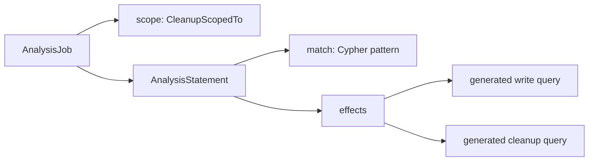

# How to extend Cartography with Analysis Jobs

## Overview
In a nutshell, Analysis Jobs let you add your own customizations to Cartography by writing Neo4j queries. This helps you add powerful enhancements to your data without the need to write Python code.

### The stages
There are 3 stages to a cartography sync. First we create database indexes, next we ingest assets via intel modules, and finally we can run Analysis Jobs on the database (see [cartography.sync.build\_default\_sync()](https://github.com/cartography-cncf/cartography/blob/master/cartography/sync.py)). This tutorial focuses on Analysis Jobs.

### How to run
Built-in enrichment Analysis Jobs are typed Python definitions under `cartography/analysis/*/analysis.py`; the remaining built-in JSON jobs are migration/cleanup-only compatibility jobs. Custom JSON Analysis Jobs are still supported with `--analysis-job-directory`; each JSON file contains a list of Neo4j statements which get run in order. Although the order of statements within a single job is preserved, we don't guarantee the order in which jobs are executed.

### Typed job syntax
Typed Analysis Jobs declare a Cypher match pattern and the effect Cartography should apply. The framework compiles the write query and the cleanup query from those effects. This minimal example is illustrative and is not a built-in job:

```python
AnalysisJob(
    name="Example public IP marker",
    short_name="example_public_ip",
    statements=(
        AnalysisStatement(
            match="MATCH (instance:AWSEC2Instance) WHERE instance.publicipaddress IS NOT NULL",
            effects=(
                SetProperty("instance", "has_public_ip", True, label="AWSEC2Instance"),
            ),
        ),
    ),
)
```

The typed syntax has three parts:

```text
AnalysisJob(scope=CleanupScopedTo(...))
    -> AnalysisStatement(match="MATCH ...", effects=(...))
        -> SetProperty / AddToSet / AddRelationship / SetRelationshipProperty
```



Common primitives:

| Primitive | Use |
| --- | --- |
| `SetProperty(node, property, value, label=...)` | Set one node property and derive cleanup for that label. |
| `SetProperties(node, {property: value}, label=...)` | Set several node properties with one effect. |
| `AddToSet(node, property, value, label=...)` | Add a value to a list property without duplicates. |
| `AddValuesToSet(node, property, values, label=...)` | Add several values to a list property without duplicates. |
| `AddRelationship(source, rel, target, source_label=..., target_label=...)` | MERGE a relationship, set `firstseen` on create, set `lastupdated` every run, and derive stale-edge cleanup. |
| `SetRelationshipProperty(rel, property, value, source_label=..., rel_label=...)` | Set a relationship property and derive property cleanup. |
| `Var("node.property")` | Use a Cypher variable or property reference as a value. |
| `Param("UPDATE_TAG")` | Use a Cypher parameter as a value. |
| `RawCypher("coalesce(...)")` | Use a raw Cypher expression as a value. |
| `CleanupScopedTo(label, id_param)` | Constrain generated cleanup to one tenant/account/project. |

`label` is required for node-property effects because cleanup needs to know which label owns the property. Plain Python strings become quoted Cypher strings, so use `Var`, `Param`, or `RawCypher` when the value should compile as Cypher.

`CleanupScopedTo(...)` lives on the `AnalysisJob` and describes the resource boundary used during generated cleanup, for example `CleanupScopedTo("AWSAccount", "AWS_ID")`. For relationship effects, `scoped_to="source"` or `"target"` lives on `AddRelationship` and chooses which endpoint is connected to that scoped resource. Keep the default `source` when the source node is under the scoped account/project; override it to `target` when only the target node is under that scope.

## Example job: which of my EC2 instances is accessible to any host on the internet?
The built-in `AWS_EC2_ASSET_EXPOSURE_INSTANCE` job lives in [cartography/analysis/aws/analysis.py](https://github.com/cartography-cncf/cartography/blob/master/cartography/analysis/aws/analysis.py). It marks an instance as internet-exposed when one of these conditions is true:

1. The instance has a public IP and is attached, directly or through a network interface, to a security group that permits `0.0.0.0/0`.
2. An internet-exposed classic load balancer exposes the instance.
3. An internet-exposed v2 load balancer exposes the instance.

The current typed definition is:

```python
AWS_EC2_ASSET_EXPOSURE_INSTANCE = AnalysisJob(
    name="AWS EC2 instance internet exposure",
    short_name="aws_ec2_asset_exposure_instance",
    cleanup_iterationsize=1000,
    statements=(
        AnalysisStatement(
            match="""
            MATCH (:AWSIpRange{id: '0.0.0.0/0'})
              -[:MEMBER_OF_IP_RULE]->(:AWSIpPermissionInbound)
              -[:MEMBER_OF_EC2_SECURITY_GROUP]->(:AWSEC2SecurityGroup)
              <-[:MEMBER_OF_EC2_SECURITY_GROUP|NETWORK_INTERFACE*..2]
              -(instance:AWSEC2Instance)
            WHERE instance.publicipaddress IS NOT NULL
            """,
            effects=(
                SetProperty(
                    "instance",
                    "exposed_internet",
                    True,
                    label="AWSEC2Instance",
                ),
                AddToSet(
                    "instance",
                    "exposed_internet_type",
                    "direct",
                    label="AWSEC2Instance",
                ),
            ),
        ),
        AnalysisStatement(
            match=(
                "MATCH (:AWSLoadBalancer{exposed_internet: true})"
                "-[:EXPOSE]->(instance:AWSEC2Instance)"
            ),
            effects=(
                SetProperty(
                    "instance",
                    "exposed_internet",
                    True,
                    label="AWSEC2Instance",
                ),
                AddToSet(
                    "instance",
                    "exposed_internet_type",
                    "elb",
                    label="AWSEC2Instance",
                ),
            ),
        ),
        AnalysisStatement(
            match=(
                "MATCH (:AWSLoadBalancerV2{exposed_internet: true})"
                "-[:EXPOSE]->(instance:AWSEC2Instance)"
            ),
            effects=(
                SetProperty(
                    "instance",
                    "exposed_internet",
                    True,
                    label="AWSEC2Instance",
                ),
                AddToSet(
                    "instance",
                    "exposed_internet_type",
                    "elbv2",
                    label="AWSEC2Instance",
                ),
            ),
        ),
    ),
)
```

The match clauses only identify the rows to update. The effects describe the graph changes, and the framework generates both the write statements and the corresponding cleanup statements.

### Cleanup ordering

The compiler determines cleanup ordering from the effect type:

- Node-property effects such as `SetProperty` and `AddToSet` remove values left by the previous run before applying current matches.
- Relationship effects such as `AddRelationship` run their `MERGE` statements first and delete relationships with an old `lastupdated` value afterward. This avoids a window where concurrent readers see all managed relationships disappear.

Do not add handwritten cleanup statements to a typed job when an existing effect can express the change.

### Run the typed job

Built-in typed jobs are converted to `GraphJob` statements and executed with `run_typed_analysis_job()`:

```python
run_typed_analysis_job(
    AWS_EC2_ASSET_EXPOSURE_INSTANCE,
    neo4j_session,
    common_job_parameters,
)
```

After the job runs, query the generated properties:

```cypher
MATCH (instance:AWSEC2Instance {exposed_internet: true})
RETURN instance.id, instance.exposed_internet_type
ORDER BY instance.id
```

## Custom JSON jobs (legacy format)

Custom JSON jobs remain supported through `--analysis-job-directory`. Use them only when the typed effect model cannot express the required operation. Statements run in file order, but Cartography does not guarantee the order in which separate job files run.

JSON jobs must provide their own cleanup and batching behavior. For node properties, remove stale values before setting current values. For managed relationships, `MERGE` current relationships before deleting edges whose `lastupdated` does not match `$UPDATE_TAG`.

## Recap

Prefer typed Analysis Jobs for built-in enrichment. Declare a match and one or more effects, let the compiler generate cleanup, and add an explicit scope when the job manages only one account, project, or tenant.
