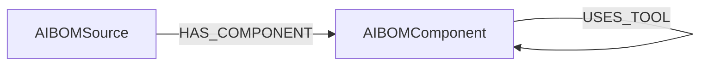

<!-- Generated from the data model. Do not edit manually. -->

## AIBOM Schema

### AIBOMComponent

One detected AI component occurrence within an AIBOM source.

> **Conditional Labels**:
>
> - `AIAgent` when `category` equals `agent`. A aibom node participating in the shared AIAgent graph interface.
> - `AIEmbedding` when `category` equals `embedding`. A aibom node participating in the shared AIEmbedding graph interface.
> - `AIMemory` when `category` equals `memory`. A aibom node participating in the shared AIMemory graph interface.
> - [`AIModel`](#ontology-aimodel) (ontology label) when `category` equals `model`. A cross-provider AIModel resource in Cartography's ontology.
> - `AIPrompt` when `category` equals `prompt`. A aibom node participating in the shared AIPrompt graph interface.
> - `AITool` when `category` equals `tool`. A aibom node participating in the shared AITool graph interface.

#### Properties

Ontology-generated fields are shown in *italics*.

| Field | Index | Description |
|-------|-------|-------------|
| id | Yes | Stable hash of source key and component occurrence fields. |
| firstseen |  | Timestamp when a sync job first created this node. |
| lastupdated | Yes | Timestamp of the last sync that observed this node. |
| agentic_confidence |  | Agentic confidence from the report. |
| agentic_hint |  | Agentic hint text. |
| category | Yes | Normalized component category used for grouping and filtering. |
| component_primary_evidence |  | Primary evidence file path selected for the component. |
| component_primary_evidence_end_line |  | End line of the primary evidence location. |
| component_primary_evidence_start_line |  | Start line of the primary evidence location. |
| component_type | Yes | AIBOM component type from the report. |
| confidence |  | Final component confidence. |
| config_source |  | Configuration source metadata when present. |
| dataset_source |  | Dataset source metadata when present. |
| decision |  | Decision annotation for the component. |
| decision_justification |  | Justification from the component decision annotation. |
| description |  | Component description. |
| detection_source | Yes | Detection origin such as code analysis, agentic, or config file. |
| embedding_model |  | Embedding model metadata when present. |
| file_path |  | File path reported for the component. |
| framework |  | Framework or provider hint emitted by AIBOM. |
| heuristic_confidence |  | Heuristic confidence from the report. |
| instance_id |  | AIBOM component instance identifier. |
| kb_concept |  | Knowledge-base concept metadata when present. |
| kb_label |  | Knowledge-base label metadata when present. |
| line_number |  | Line number reported for the component. |
| logical_id | Yes | Stable cross-source fingerprint for equivalent components. |
| manifest_digests | Yes | Concrete image digests used to link the component to Image nodes. |
| metadata_json |  | Serialized category-specific component metadata. |
| model_name |  | Model name when the component identifies a concrete model. |
| name |  | Detected component name. |
| needs_agentic |  | Whether the component required agentic review. |
| sdk_version |  | SDK or package version metadata when present. |
| skill_format |  | Skill format metadata when present. |
| storage_uri |  | Storage URI when present. |
| text |  | Raw component text or value when present. |
| transport |  | Transport metadata when present. |
| *_ont_name* | Yes | Normalized field sourced from `model_name`. |
| *_ont_provider* | Yes | Normalized field sourced from `framework`. |
| *_ont_source* |  | Module that populated this node's ontology fields. |

#### Relationships

- `(:AIBOMComponent)-[:CUSTOM]->(:AIBOMComponent)`: Preserves a custom component relationship emitted by an AIBOM report.

- `(:AIBOMComponent)-[:DETECTED_IN]->(:GitHubRepository)`: Links a component occurrence to its scanned GitHub repository.

- `(:AIBOMComponent)-[:DETECTED_IN]->(:GitLabProject)`: Links a component occurrence to its scanned GitLab project.

- `(:AIBOMComponent)-[:DETECTED_IN]->(:Image)`: Links a component occurrence to the concrete image where it was detected.

- `(:AIBOMComponent)-[:EXPOSES_TOOL]->(:AIBOMComponent)`: Links a component to another component that represents an exposed tool.

- `(:AIBOMSource)-[:HAS_COMPONENT]->(:AIBOMComponent)`: Links an AIBOM source to its detected component occurrences.

- `(:AIBOMComponent)-[:USES_MODEL]->(:AIBOMComponent)`: Links a component to another component that represents a model it uses.

- `(:AIBOMComponent)-[:USES_TOOL]->(:AIBOMComponent)`: Links a component to another component that represents a tool it uses.

### AIBOMSource

One scanned image or repository represented in an AIBOM report.

#### Properties

| Field | Index | Description |
|-------|-------|-------------|
| id | Yes | Stable hash of the source key. |
| firstseen |  | Timestamp when a sync job first created this node. |
| lastupdated | Yes | Timestamp of the last sync that observed this node. |
| analysis_status | Yes | Top-level report status. |
| analyzer_version |  | AIBOM analyzer version. |
| assets_discovered |  | Source-level discovered asset count. |
| completion_tokens |  | Top-level completion token count. |
| error_count |  | Total report error count. |
| image_matched | Yes | Whether the source carried a digest-qualified image anchor. |
| image_uri | Yes | Source image URI, falling back to the source key. |
| last_generated_at |  | Source generation timestamp. |
| llm_model |  | LLM model used during analysis when present. |
| manifest_digests | Yes | Concrete image digests extracted from the source key. |
| pending_agent_review |  | Top-level summary pending review count. |
| prompt_tokens |  | Top-level prompt token count. |
| report_completed_at |  | Report completion timestamp. |
| report_component_type_counts |  | Counts corresponding to the top-level component categories. |
| report_component_types |  | Sorted list of top-level component categories. |
| report_location |  | Local path or object-store URI used for ingestion. |
| report_output_format |  | Output format reported by AIBOM. |
| report_schema_version | Yes | AIBOM report schema version. |
| report_started_at |  | Report start timestamp. |
| report_total_components |  | Top-level summary component count. |
| report_total_relationships |  | Top-level summary relationship count. |
| report_total_sources |  | Top-level summary source count. |
| risk_score |  | Top-level risk score. |
| risk_severity | Yes | Top-level risk severity. |
| run_id | Yes | Report run identifier. |
| source_completion_tokens |  | Source-level completion token count. |
| source_component_type_counts |  | Counts corresponding to this source's component categories. |
| source_component_types |  | Sorted list of component categories in this source. |
| source_elapsed_s |  | Source-level elapsed time in seconds. |
| source_key | Yes | Native source key emitted by AIBOM. |
| source_kind | Yes | Source kind, such as container or repository. |
| source_name |  | Source name, falling back to the source key. |
| source_path |  | Extracted filesystem path used during scanning. |
| source_prompt_tokens |  | Source-level prompt token count. |
| source_status | Yes | Source processing status. |
| source_total_tokens |  | Source-level total token count. |
| sources_analyzed |  | Number of analyzed sources in the report. |
| sources_requested |  | Number of requested sources in the report. |
| sources_with_errors |  | Number of sources with errors in the report. |
| test_only_components |  | Top-level summary test-only component count. |
| total_components |  | Source-level component count. |
| total_relationships |  | Source-level relationship count. |
| total_tokens |  | Top-level total token count. |

#### Relationships

- `(:AIBOMSource)-[:HAS_COMPONENT]->(:AIBOMComponent)`: Links an AIBOM source to its detected component occurrences.

- `(:AIBOMSource)-[:RUNS_ON]->(:Container)`: generated by analysis job `AIBOMSource RUNS_ON Container analysis`.

- `(:AIBOMSource)-[:SCANNED_IMAGE]->(:Image)`: Links an AIBOM source to the concrete image it scanned.

- `(:AIBOMSource)-[:SCANNED_REPOSITORY]->(:GitHubRepository)`: Links an AIBOM source to the GitHub repository it scanned.

- `(:AIBOMSource)-[:SCANNED_REPOSITORY]->(:GitLabProject)`: Links an AIBOM source to the GitLab project it scanned.
