<!-- Generated from the data model. Do not edit manually. -->

## Azure Schema

```mermaid
graph LR
    AzureAppService -- TAGGED --> AzureTag
    AzureApplicationGateway -- CONTAINS --> AzureApplicationGatewayBackendPool
    AzureApplicationGateway -- CONTAINS --> AzureApplicationGatewayFrontendIPConfiguration
    AzureApplicationGateway -- CONTAINS --> AzureApplicationGatewayRule
    AzureApplicationGateway -- IN_SUBNET --> AzureSubnet
    AzureApplicationGateway -- TAGGED --> AzureTag
    AzureApplicationGatewayBackendPool -- ROUTES_TO --> AzureNetworkInterface
    AzureApplicationGatewayBackendPool -- ROUTES_TO --> AzurePublicIPAddress
    AzureApplicationGatewayFrontendIPConfiguration -- ASSOCIATED_WITH --> AzurePublicIPAddress
    AzureApplicationGatewayFrontendIPConfiguration -- IN_SUBNET --> AzureSubnet
    AzureApplicationGatewayRule -- ROUTES_TO --> AzureApplicationGatewayBackendPool
    AzureApplicationGatewayRule -- USES_FRONTEND_IP --> AzureApplicationGatewayFrontendIPConfiguration
    AzureContainerInstance -- WORKLOAD_PARENT --> AzureGroupContainer
    AzureCosmosDBAccount -- ASSOCIATED_WITH --> AzureCosmosDBLocation
    AzureCosmosDBAccount -- CAN_READ_FROM --> AzureCosmosDBLocation
    AzureCosmosDBAccount -- CAN_WRITE_FROM --> AzureCosmosDBLocation
    AzureCosmosDBAccount -- CONFIGURED_WITH --> AzureCDBPrivateEndpointConnection
    AzureCosmosDBAccount -- CONFIGURED_WITH --> AzureCosmosDBVirtualNetworkRule
    AzureCosmosDBAccount -- CONTAINS --> AzureCosmosDBAccountFailoverPolicy
    AzureCosmosDBAccount -- CONTAINS --> AzureCosmosDBCassandraKeyspace
    AzureCosmosDBAccount -- CONTAINS --> AzureCosmosDBCorsPolicy
    AzureCosmosDBAccount -- CONTAINS --> AzureCosmosDBMongoDBDatabase
    AzureCosmosDBAccount -- CONTAINS --> AzureCosmosDBSqlDatabase
    AzureCosmosDBAccount -- CONTAINS --> AzureCosmosDBTableResource
    AzureCosmosDBAccount -- TAGGED --> AzureTag
    AzureCosmosDBCassandraKeyspace -- CONTAINS --> AzureCosmosDBCassandraTable
    AzureCosmosDBMongoDBDatabase -- CONTAINS --> AzureCosmosDBMongoDBCollection
    AzureCosmosDBSqlDatabase -- CONTAINS --> AzureCosmosDBSqlContainer
    AzureDataFactory -- CONTAINS --> AzureDataFactoryDataset
    AzureDataFactory -- CONTAINS --> AzureDataFactoryLinkedService
    AzureDataFactory -- CONTAINS --> AzureDataFactoryPipeline
    AzureDataFactoryDataset -- USES_LINKED_SERVICE --> AzureDataFactoryLinkedService
    AzureDataFactoryPipeline -- USES_DATASET --> AzureDataFactoryDataset
    AzureEventGridTopic -- TAGGED --> AzureTag
    AzureEventHubsNamespace -- CONTAINS --> AzureEventHub
    AzureFirewall -- HAS_IP_CONFIGURATION --> AzureFirewallIPConfiguration
    AzureFirewall -- MEMBER_OF --> AzureVirtualNetwork
    AzureFirewall -- PROTECTS --> AzureLoadBalancer
    AzureFirewall -- USES_POLICY --> AzureFirewallPolicy
    AzureFirewallIPConfiguration -- IN_SUBNET --> AzureSubnet
    AzureFirewallIPConfiguration -- USES_PUBLIC_IP --> AzurePublicIPAddress
    AzureFirewallPolicy -- INHERITS_FROM --> AzureFirewallPolicy
    AzureFunctionApp -- ASSUMES --> AzureRoleDefinition
    AzureFunctionApp -- TAGGED --> AzureTag
    AzureGroupContainer -- ATTACHED_TO --> AzureSubnet
    AzureGroupContainer -- CONTAINS --> AzureContainerInstance
    AzureGroupContainer -- TAGGED --> AzureTag
    AzureKeyVault -- CONTAINS --> AzureKeyVaultCertificate
    AzureKeyVault -- CONTAINS --> AzureKeyVaultKey
    AzureKeyVault -- CONTAINS --> AzureKeyVaultSecret
    AzureKeyVaultSecret -- TAGGED --> AzureTag
    AzureKubernetesCluster -- HAS_AGENT_POOL --> AzureKubernetesAgentPool
    AzureKubernetesCluster -- TAGGED --> AzureTag
    AzureLoadBalancer -- CONTAINS --> AzureLoadBalancerBackendPool
    AzureLoadBalancer -- CONTAINS --> AzureLoadBalancerFrontendIPConfiguration
    AzureLoadBalancer -- CONTAINS --> AzureLoadBalancerInboundNatRule
    AzureLoadBalancer -- CONTAINS --> AzureLoadBalancerRule
    AzureLoadBalancer -- EXPOSE --> AzureVirtualMachine
    AzureLoadBalancer -- TAGGED --> AzureTag
    AzureLoadBalancerBackendPool -- ROUTES_TO --> AzureNetworkInterface
    AzureLoadBalancerFrontendIPConfiguration -- ASSOCIATED_WITH --> AzurePublicIPAddress
    AzureLoadBalancerRule -- ROUTES_TO --> AzureLoadBalancerBackendPool
    AzureLoadBalancerRule -- USES_FRONTEND_IP --> AzureLoadBalancerFrontendIPConfiguration
    AzureLogicApp -- TAGGED --> AzureTag
    AzureManagementGroup -- PARENT --> AzureManagementGroup
    AzureManagementGroup -- PARENT --> AzureTenant
    AzureManagementGroup -- RESOURCE --> AzureRoleAssignment
    AzureMonitorMetricAlert -- TAGGED --> AzureTag
    AzureNetworkInterface -- ASSOCIATED_WITH --> AzureNetworkSecurityGroup
    AzureNetworkInterface -- ASSOCIATED_WITH --> AzurePublicIPAddress
    AzureNetworkInterface -- ATTACHED_TO --> AzureSubnet
    AzureNetworkInterface -- ATTACHED_TO --> AzureVirtualMachine
    AzureNetworkSecurityGroup -- TAGGED --> AzureTag
    AzureNetworkSecurityRule -- MEMBER_OF_AZURE_NSG --> AzureNetworkSecurityGroup
    AzureResourceGroup -- TAGGED --> AzureTag
    AzureRoleAssignment -- ROLE_ASSIGNED --> AzureRoleDefinition
    AzureRoleDefinition -- HAS_PERMISSIONS --> AzurePermissions
    AzureSQLDatabase -- CONTAINS --> AzureDatabaseThreatDetectionPolicy
    AzureSQLDatabase -- CONTAINS --> AzureReplicationLink
    AzureSQLDatabase -- CONTAINS --> AzureRestorePoint
    AzureSQLDatabase -- CONTAINS --> AzureTransparentDataEncryption
    AzureSQLServer -- ADMINISTERED_BY --> AzureServerADAdministrator
    AzureSQLServer -- CONTAINS --> AzureElasticPool
    AzureSQLServer -- CONTAINS --> AzureFailoverGroup
    AzureSQLServer -- CONTAINS --> AzureRecoverableDatabase
    AzureSQLServer -- CONTAINS --> AzureRestorableDroppedDatabase
    AzureSQLServer -- CONTAINS --> AzureSQLDatabase
    AzureSQLServer -- RESOURCE --> AzureElasticPool
    AzureSQLServer -- RESOURCE --> AzureFailoverGroup
    AzureSQLServer -- RESOURCE --> AzureRecoverableDatabase
    AzureSQLServer -- RESOURCE --> AzureRestorableDroppedDatabase
    AzureSQLServer -- RESOURCE --> AzureSQLDatabase
    AzureSQLServer -- TAGGED --> AzureTag
    AzureSQLServer -- USED_BY --> AzureServerDNSAlias
    AzureSQLServerFirewallRule -- MEMBER_OF_AZURE_SQL_SERVER --> AzureSQLServer
    AzureSecurityAssessment -- TAGGED --> AzureTag
    AzureStorageAccount -- CONTAINS --> AzureDataLakeFileSystem
    AzureStorageAccount -- TAGGED --> AzureTag
    AzureStorageAccount -- USES --> AzureStorageBlobService
    AzureStorageAccount -- USES --> AzureStorageFileService
    AzureStorageAccount -- USES --> AzureStorageQueueService
    AzureStorageAccount -- USES --> AzureStorageTableService
    AzureStorageBlobService -- CONTAINS --> AzureStorageBlobContainer
    AzureStorageFileService -- CONTAINS --> AzureStorageFileShare
    AzureStorageQueueService -- CONTAINS --> AzureStorageQueue
    AzureStorageTableService -- CONTAINS --> AzureStorageTable
    AzureSubnet -- ASSOCIATED_WITH --> AzureNetworkSecurityGroup
    AzureSubscription -- HAS_ASSESSMENT --> AzureSecurityAssessment
    AzureSubscription -- HAS_METRIC_ALERT --> AzureMonitorMetricAlert
    AzureSubscription -- PARENT --> AzureManagementGroup
    AzureSubscription -- RESOURCE --> AzureAppService
    AzureSubscription -- RESOURCE --> AzureApplicationGateway
    AzureSubscription -- RESOURCE --> AzureApplicationGatewayBackendPool
    AzureSubscription -- RESOURCE --> AzureApplicationGatewayFrontendIPConfiguration
    AzureSubscription -- RESOURCE --> AzureApplicationGatewayRule
    AzureSubscription -- RESOURCE --> AzureCDBPrivateEndpointConnection
    AzureSubscription -- RESOURCE --> AzureContainerInstance
    AzureSubscription -- RESOURCE --> AzureCosmosDBAccount
    AzureSubscription -- RESOURCE --> AzureCosmosDBAccountFailoverPolicy
    AzureSubscription -- RESOURCE --> AzureCosmosDBCassandraKeyspace
    AzureSubscription -- RESOURCE --> AzureCosmosDBCassandraTable
    AzureSubscription -- RESOURCE --> AzureCosmosDBCorsPolicy
    AzureSubscription -- RESOURCE --> AzureCosmosDBLocation
    AzureSubscription -- RESOURCE --> AzureCosmosDBMongoDBCollection
    AzureSubscription -- RESOURCE --> AzureCosmosDBMongoDBDatabase
    AzureSubscription -- RESOURCE --> AzureCosmosDBSqlContainer
    AzureSubscription -- RESOURCE --> AzureCosmosDBSqlDatabase
    AzureSubscription -- RESOURCE --> AzureCosmosDBTableResource
    AzureSubscription -- RESOURCE --> AzureCosmosDBVirtualNetworkRule
    AzureSubscription -- RESOURCE --> AzureDataDisk
    AzureSubscription -- RESOURCE --> AzureDataFactory
    AzureSubscription -- RESOURCE --> AzureDataFactoryDataset
    AzureSubscription -- RESOURCE --> AzureDataFactoryLinkedService
    AzureSubscription -- RESOURCE --> AzureDataFactoryPipeline
    AzureSubscription -- RESOURCE --> AzureDataLakeFileSystem
    AzureSubscription -- RESOURCE --> AzureDatabaseThreatDetectionPolicy
    AzureSubscription -- RESOURCE --> AzureDisk
    AzureSubscription -- RESOURCE --> AzureElasticPool
    AzureSubscription -- RESOURCE --> AzureEventGridTopic
    AzureSubscription -- RESOURCE --> AzureEventHub
    AzureSubscription -- RESOURCE --> AzureEventHubsNamespace
    AzureSubscription -- RESOURCE --> AzureFailoverGroup
    AzureSubscription -- RESOURCE --> AzureFirewall
    AzureSubscription -- RESOURCE --> AzureFirewallIPConfiguration
    AzureSubscription -- RESOURCE --> AzureFirewallPolicy
    AzureSubscription -- RESOURCE --> AzureFunctionApp
    AzureSubscription -- RESOURCE --> AzureGroupContainer
    AzureSubscription -- RESOURCE --> AzureKeyVault
    AzureSubscription -- RESOURCE --> AzureKeyVaultCertificate
    AzureSubscription -- RESOURCE --> AzureKeyVaultKey
    AzureSubscription -- RESOURCE --> AzureKeyVaultSecret
    AzureSubscription -- RESOURCE --> AzureKubernetesAgentPool
    AzureSubscription -- RESOURCE --> AzureKubernetesCluster
    AzureSubscription -- RESOURCE --> AzureLoadBalancer
    AzureSubscription -- RESOURCE --> AzureLoadBalancerBackendPool
    AzureSubscription -- RESOURCE --> AzureLoadBalancerFrontendIPConfiguration
    AzureSubscription -- RESOURCE --> AzureLoadBalancerInboundNatRule
    AzureSubscription -- RESOURCE --> AzureLoadBalancerRule
    AzureSubscription -- RESOURCE --> AzureLogicApp
    AzureSubscription -- RESOURCE --> AzureMonitorMetricAlert
    AzureSubscription -- RESOURCE --> AzureNetworkInterface
    AzureSubscription -- RESOURCE --> AzureNetworkSecurityGroup
    AzureSubscription -- RESOURCE --> AzureNetworkSecurityRule
    AzureSubscription -- RESOURCE --> AzurePermissions
    AzureSubscription -- RESOURCE --> AzurePublicIPAddress
    AzureSubscription -- RESOURCE --> AzureRecoverableDatabase
    AzureSubscription -- RESOURCE --> AzureReplicationLink
    AzureSubscription -- RESOURCE --> AzureResourceGroup
    AzureSubscription -- RESOURCE --> AzureRestorableDroppedDatabase
    AzureSubscription -- RESOURCE --> AzureRestorePoint
    AzureSubscription -- RESOURCE --> AzureRoleAssignment
    AzureSubscription -- RESOURCE --> AzureRoleDefinition
    AzureSubscription -- RESOURCE --> AzureSQLDatabase
    AzureSubscription -- RESOURCE --> AzureSQLServer
    AzureSubscription -- RESOURCE --> AzureSQLServerFirewallRule
    AzureSubscription -- RESOURCE --> AzureSecurityAssessment
    AzureSubscription -- RESOURCE --> AzureServerADAdministrator
    AzureSubscription -- RESOURCE --> AzureServerDNSAlias
    AzureSubscription -- RESOURCE --> AzureSnapshot
    AzureSubscription -- RESOURCE --> AzureStorageAccount
    AzureSubscription -- RESOURCE --> AzureStorageBlobContainer
    AzureSubscription -- RESOURCE --> AzureStorageBlobService
    AzureSubscription -- RESOURCE --> AzureStorageFileService
    AzureSubscription -- RESOURCE --> AzureStorageFileShare
    AzureSubscription -- RESOURCE --> AzureStorageQueue
    AzureSubscription -- RESOURCE --> AzureStorageQueueService
    AzureSubscription -- RESOURCE --> AzureStorageTable
    AzureSubscription -- RESOURCE --> AzureStorageTableService
    AzureSubscription -- RESOURCE --> AzureSubnet
    AzureSubscription -- RESOURCE --> AzureSynapseDedicatedSqlPool
    AzureSubscription -- RESOURCE --> AzureSynapseLinkedService
    AzureSubscription -- RESOURCE --> AzureSynapseManagedPrivateEndpoint
    AzureSubscription -- RESOURCE --> AzureSynapsePipeline
    AzureSubscription -- RESOURCE --> AzureSynapseSparkPool
    AzureSubscription -- RESOURCE --> AzureSynapseWorkspace
    AzureSubscription -- RESOURCE --> AzureTag
    AzureSubscription -- RESOURCE --> AzureTransparentDataEncryption
    AzureSubscription -- RESOURCE --> AzureVirtualMachine
    AzureSubscription -- RESOURCE --> AzureVirtualNetwork
    AzureSynapseWorkspace -- CONTAINS --> AzureSynapseDedicatedSqlPool
    AzureSynapseWorkspace -- CONTAINS --> AzureSynapseLinkedService
    AzureSynapseWorkspace -- CONTAINS --> AzureSynapseManagedPrivateEndpoint
    AzureSynapseWorkspace -- CONTAINS --> AzureSynapsePipeline
    AzureSynapseWorkspace -- CONTAINS --> AzureSynapseSparkPool
    AzureTenant -- RESOURCE --> AzureManagementGroup
    AzureTenant -- RESOURCE --> AzurePrincipal
    AzureTenant -- RESOURCE --> AzureSubscription
    AzureVirtualMachine -- ASSUMES --> AzureRoleDefinition
    AzureVirtualMachine -- ATTACHED_TO --> AzureDataDisk
    AzureVirtualMachine -- TAGGED --> AzureTag
    AzureVirtualNetwork -- CONTAINS --> AzureSubnet
    AzureVirtualNetwork -- TAGGED --> AzureTag
```

### AzureApplicationGateway

An Azure Application Gateway that routes web traffic to backend targets.

> **Ontology Mapping**: This node uses the ontology label [`LoadBalancer`](#ontology-loadbalancer).

#### Properties

| Field | Index | Description |
|-------|-------|-------------|
| id | Yes | Azure resource ID of the application gateway. |
| firstseen |  | Timestamp when a sync job first created this node. |
| lastupdated | Yes | Timestamp of the last sync that observed this node. |
| enable_http2 |  | Whether HTTP/2 is enabled for the application gateway. |
| firewall_policy_id |  | Azure resource ID of the associated firewall policy. |
| location |  | Azure region containing the application gateway. |
| name |  | Name of the application gateway. |
| operational_state |  | Current operational state of the application gateway. |
| provisioning_state |  | Current provisioning state of the application gateway. |
| sku_capacity |  | Configured instance capacity of the application gateway. |
| sku_name |  | Name of the application gateway SKU. |
| sku_tier |  | Tier of the application gateway SKU. |
| subnet_id |  | Azure resource ID of the gateway subnet. |

#### Relationships

- `(:AzureApplicationGateway)-[:CONTAINS]->(:AzureApplicationGatewayBackendPool)`: An Azure Application Gateway contains the backend pool.

- `(:AzureApplicationGateway)-[:CONTAINS]->(:AzureApplicationGatewayFrontendIPConfiguration)`: An Azure Application Gateway contains the frontend IP configuration.

- `(:AzureApplicationGateway)-[:CONTAINS]->(:AzureApplicationGatewayRule)`: An Azure Application Gateway contains the request routing rule.

- `(:AzureApplicationGateway)-[:IN_SUBNET]->(:AzureSubnet)`: An Azure Application Gateway is deployed in a subnet.

- `(:PublicIP)-[:POINTS_TO]->(:AzureApplicationGateway)`

- `(:AzureSubscription)-[:RESOURCE]->(:AzureApplicationGateway)`: An Azure subscription contains the application gateway as a resource.

- `(:AzureApplicationGateway)-[:TAGGED]->(:AzureTag)`: An Azure Application Gateway has the tag.

### AzureApplicationGatewayBackendPool

A collection of backend targets for an Azure Application Gateway.

#### Properties

| Field | Index | Description |
|-------|-------|-------------|
| id | Yes | Azure resource ID of the application gateway backend pool. |
| firstseen |  | Timestamp when a sync job first created this node. |
| lastupdated | Yes | Timestamp of the last sync that observed this node. |
| fqdns |  | Fully qualified domain names of backend targets. |
| ip_addresses |  | IP addresses of backend targets. |
| name |  | Name of the application gateway backend pool. |

#### Relationships

- `(:AzureApplicationGateway)-[:CONTAINS]->(:AzureApplicationGatewayBackendPool)`: An Azure Application Gateway contains the backend pool.

- `(:AzureSubscription)-[:RESOURCE]->(:AzureApplicationGatewayBackendPool)`: An Azure subscription contains the application gateway backend pool as a resource.

- `(:AzureApplicationGatewayRule)-[:ROUTES_TO]->(:AzureApplicationGatewayBackendPool)`: An application gateway request routing rule routes traffic to a backend pool.

- `(:AzureApplicationGatewayBackendPool)-[:ROUTES_TO]->(:AzureNetworkInterface)`: An application gateway backend pool routes traffic to a network interface.

- `(:AzureApplicationGatewayBackendPool)-[:ROUTES_TO]->(:AzurePublicIPAddress)`: An application gateway backend pool routes traffic to a public IP address.

- `(:AzureApplicationGatewayBackendPool)-[:ROUTES_TO]->(:DNSRecord)`: An application gateway backend pool routes traffic to a DNS record.

### AzureApplicationGatewayFrontendIPConfiguration

A frontend IP configuration that receives traffic for an Azure Application Gateway.

#### Properties

| Field | Index | Description |
|-------|-------|-------------|
| id | Yes | Azure resource ID of the application gateway frontend IP configuration. |
| firstseen |  | Timestamp when a sync job first created this node. |
| lastupdated | Yes | Timestamp of the last sync that observed this node. |
| name |  | Name of the application gateway frontend IP configuration. |
| private_ip_address |  | Private IP address assigned to the frontend. |
| private_ip_allocation_method |  | Allocation method for the frontend private IP address. |
| public_ip_address_id |  | Azure resource ID of the associated public IP address. |
| subnet_id |  | Azure resource ID of the subnet used by the frontend. |

#### Relationships

- `(:AzureApplicationGatewayFrontendIPConfiguration)-[:ASSOCIATED_WITH]->(:AzurePublicIPAddress)`: An application gateway frontend IP configuration uses a public IP address.

- `(:AzureApplicationGateway)-[:CONTAINS]->(:AzureApplicationGatewayFrontendIPConfiguration)`: An Azure Application Gateway contains the frontend IP configuration.

- `(:AzureApplicationGatewayFrontendIPConfiguration)-[:IN_SUBNET]->(:AzureSubnet)`: An application gateway frontend IP configuration is assigned to a subnet.

- `(:AzureSubscription)-[:RESOURCE]->(:AzureApplicationGatewayFrontendIPConfiguration)`: An Azure subscription contains the application gateway frontend IP configuration as a resource.

- `(:AzureApplicationGatewayRule)-[:USES_FRONTEND_IP]->(:AzureApplicationGatewayFrontendIPConfiguration)`: An application gateway request routing rule uses a frontend IP configuration.

### AzureApplicationGatewayRule

A request routing rule that directs Azure Application Gateway traffic.

#### Properties

| Field | Index | Description |
|-------|-------|-------------|
| id | Yes | Azure resource ID of the application gateway request routing rule. |
| firstseen |  | Timestamp when a sync job first created this node. |
| lastupdated | Yes | Timestamp of the last sync that observed this node. |
| backend_cookie_based_affinity |  | Cookie-based affinity setting for backend traffic. |
| backend_host_name |  | Host name sent to backend targets. |
| backend_http_settings_id |  | Azure resource ID of the backend HTTP settings used by the rule. |
| backend_pick_host_name_from_backend_address |  | Whether the backend host name is derived from the backend address. |
| backend_port |  | Port used to communicate with backend targets. |
| backend_protocol |  | Protocol used to communicate with backend targets. |
| backend_request_timeout |  | Backend request timeout in seconds. |
| listener_host_name |  | Host name accepted by the associated listener. |
| listener_host_names |  | Host names accepted by the associated listener. |
| listener_id |  | Azure resource ID of the HTTP listener used by the rule. |
| listener_port |  | Port accepted by the associated listener. |
| listener_protocol |  | Protocol accepted by the associated listener. |
| listener_require_server_name_indication |  | Whether the listener requires Server Name Indication. |
| listener_ssl_certificate_id |  | Azure resource ID of the listener TLS certificate. |
| name |  | Name of the application gateway request routing rule. |
| priority |  | Evaluation priority of the routing rule. |
| rule_type |  | Routing type of the rule. |
| url_path_map_id |  | Azure resource ID of the URL path map used by the rule. |

#### Relationships

- `(:AzureApplicationGateway)-[:CONTAINS]->(:AzureApplicationGatewayRule)`: An Azure Application Gateway contains the request routing rule.

- `(:AzureSubscription)-[:RESOURCE]->(:AzureApplicationGatewayRule)`: An Azure subscription contains the application gateway request routing rule as a resource.

- `(:AzureApplicationGatewayRule)-[:ROUTES_TO]->(:AzureApplicationGatewayBackendPool)`: An application gateway request routing rule routes traffic to a backend pool.

- `(:AzureApplicationGatewayRule)-[:USES_FRONTEND_IP]->(:AzureApplicationGatewayFrontendIPConfiguration)`: An application gateway request routing rule uses a frontend IP configuration.

### AzureAppService

An application hosted by Azure App Service.

#### Properties

| Field | Index | Description |
|-------|-------|-------------|
| id | Yes | Full Azure resource ID of the app. |
| firstseen |  | Timestamp when a sync job first created this node. |
| lastupdated | Yes | Timestamp of the last sync that observed this node. |
| default_host_name |  | Default host name assigned to the app. |
| https_only |  | Whether the app accepts only HTTPS requests. |
| kind |  | Azure App Service resource kind. |
| location |  | Azure region where the app is deployed. |
| name |  | Name of the app. |
| state |  | Current operational state of the app. |

#### Relationships

- `(:DNSRecord)-[:DNS_POINTS_TO]->(:AzureAppService)`: generated by analysis job `Ontology - DNSRecord to AzureAppService linking`.

- `(:AzureSubscription)-[:RESOURCE]->(:AzureAppService)`: An Azure subscription contains the App Service app as a resource.

- `(:AzureAppService)-[:TAGGED]->(:AzureTag)`: An Azure App Service has the tag.

### AzureCDBPrivateEndpointConnection

A private endpoint connection configured for an Azure Cosmos DB account.

#### Properties

| Field | Index | Description |
|-------|-------|-------------|
| id | Yes | Azure resource ID. |
| firstseen |  | Timestamp when a sync job first created this node. |
| lastupdated | Yes | Timestamp of the last sync that observed this node. |
| actionrequired |  | Actions required to complete the private endpoint connection. |
| name |  | Name of the Azure resource. |
| privateendpointid |  | Azure resource ID of the private endpoint. |
| status |  | Approval status of the private endpoint connection. |

#### Relationships

- `(:AzureCosmosDBAccount)-[:CONFIGURED_WITH]->(:AzureCDBPrivateEndpointConnection)`: A Cosmos DB account is configured with the private endpoint connection.

- `(:AzureSubscription)-[:RESOURCE]->(:AzureCDBPrivateEndpointConnection)`: An Azure subscription contains the private endpoint connection as a resource.

### AzureContainerInstance

An individual container running in an Azure container group.

> **Ontology Mapping**: This node uses the ontology label [`Container`](#ontology-container).

#### Properties

Ontology-generated fields are shown in *italics*.

| Field | Index | Description |
|-------|-------|-------------|
| id | Yes | Identifier derived from the container group and container name. |
| firstseen |  | Timestamp when a sync job first created this node. |
| lastupdated | Yes | Timestamp of the last sync that observed this node. |
| architecture |  | Container host architecture used by Azure Container Instances. |
| architecture_normalized |  | Normalized container host architecture. |
| cpu_limit |  | Maximum CPU cores available to the container. |
| cpu_request |  | Requested CPU cores for the container. |
| group_id |  | Full Azure resource ID of the containing container group. |
| image |  | Container image reference configured for the container. |
| image_digest |  | Digest parsed from the container image reference. |
| memory_limit_gb |  | Maximum memory available in gigabytes. |
| memory_request_gb |  | Requested memory in gigabytes. |
| name |  | Name of the container. |
| state |  | Current runtime state of the container. |
| *_ont_image* | Yes | Normalized field sourced from `image`. |
| *_ont_image_digest* | Yes | Normalized field sourced from `image_digest`. |
| *_ont_name* | Yes | Normalized field sourced from `name`. |
| *_ont_source* |  | Module that populated this node's ontology fields. |
| *_ont_state* | Yes | Normalized field sourced from `state`. |

#### Relationships

- `(:AzureGroupContainer)-[:CONTAINS]->(:AzureContainerInstance)`: Deprecated compatibility edge from a container group to its container.

- `(:AzureContainerInstance)-[:HAS_IMAGE]->(:AWSECRImage)`: An Azure container uses an Amazon ECR image with the same digest.

- `(:AzureContainerInstance)-[:HAS_IMAGE]->(:GCPArtifactRegistryImage)`: An Azure container uses a Google Artifact Registry image with the same digest.

- `(:AzureContainerInstance)-[:HAS_IMAGE]->(:GitHubContainerImage)`: An Azure container uses a GitHub container image with the same digest.

- `(:AzureContainerInstance)-[:HAS_IMAGE]->(:GitLabContainerImage)`: An Azure container uses a GitLab container image with the same digest.

- `(:AzureContainerInstance)-[:RESOLVED_IMAGE]->(:Image)`: generated by analysis job `Container RESOLVED_IMAGE analysis`.

- `(:AzureSubscription)-[:RESOURCE]->(:AzureContainerInstance)`: An Azure subscription contains the container as a resource.

- `(:AzureContainerInstance)-[:WORKLOAD_PARENT]->(:AzureGroupContainer)`: A container runs within an Azure container group.

### AzureCosmosDBAccount

An Azure Cosmos DB account that hosts databases and related settings.

#### Properties

| Field | Index | Description |
|-------|-------|-------------|
| id | Yes | Azure resource ID. |
| firstseen |  | Timestamp when a sync job first created this node. |
| lastupdated | Yes | Timestamp of the last sync that observed this node. |
| accountoffertype |  | Offer type of the database account. |
| capabilities |  | Capabilities enabled for the account. |
| connectoroffer |  | Offer type of the Cassandra connector. |
| defaultconsistencylevel |  | Default consistency level for the account. |
| disablekeybasedmetadatawriteaccess |  | Whether account keys are blocked from writing resource metadata. |
| documentendpoint |  | Connection endpoint for the account. |
| enableanalyticalstorage |  | Whether analytical storage is enabled. |
| enableautomaticfailover |  | Whether Azure automatically promotes a write region after an outage. |
| enablecassandraconnector |  | Whether the Cassandra connector is enabled. |
| enablefreetier |  | Whether the account uses the Azure Cosmos DB free tier. |
| ipranges |  | IP addresses or CIDR ranges allowed by the account firewall. |
| keyvaulturi |  | Key Vault URI of the customer-managed encryption key. |
| kind |  | API kind supported by the account. |
| location |  | Azure region where the resource is located. |
| maxintervalinseconds |  | Maximum staleness interval in seconds for bounded staleness. |
| maxstalenessprefix |  | Maximum stale request count allowed for bounded staleness. |
| multiplewritelocations |  | Whether writes are enabled in multiple Azure regions. |
| name |  | Name of the Azure resource. |
| provisioningstate |  | Provisioning state of the resource. |
| publicnetworkaccess |  | Whether public network access is enabled for the account. |
| resourcegroup |  | Name of the Azure resource group. |
| type |  | Azure resource type. |
| virtualnetworkfilterenabled |  | Whether virtual network access control rules are enabled. |

#### Relationships

- `(:AzureCosmosDBAccount)-[:ASSOCIATED_WITH]->(:AzureCosmosDBLocation)`: A Cosmos DB account is deployed in the associated location.

- `(:AzureCosmosDBAccount)-[:CAN_READ_FROM]->(:AzureCosmosDBLocation)`: A Cosmos DB account can serve reads from the location.

- `(:AzureCosmosDBAccount)-[:CAN_WRITE_FROM]->(:AzureCosmosDBLocation)`: A Cosmos DB account can accept writes in the location.

- `(:AzureCosmosDBAccount)-[:CONFIGURED_WITH]->(:AzureCDBPrivateEndpointConnection)`: A Cosmos DB account is configured with the private endpoint connection.

- `(:AzureCosmosDBAccount)-[:CONFIGURED_WITH]->(:AzureCosmosDBVirtualNetworkRule)`: A Cosmos DB account is configured with the virtual network rule.

- `(:AzureCosmosDBAccount)-[:CONTAINS]->(:AzureCosmosDBAccountFailoverPolicy)`: A Cosmos DB account contains the failover policy entry.

- `(:AzureCosmosDBAccount)-[:CONTAINS]->(:AzureCosmosDBCassandraKeyspace)`: A Cosmos DB account contains the Cassandra keyspace.

- `(:AzureCosmosDBAccount)-[:CONTAINS]->(:AzureCosmosDBCorsPolicy)`: A Cosmos DB account contains the CORS policy.

- `(:AzureCosmosDBAccount)-[:CONTAINS]->(:AzureCosmosDBMongoDBDatabase)`: A Cosmos DB account contains the MongoDB database.

- `(:AzureCosmosDBAccount)-[:CONTAINS]->(:AzureCosmosDBSqlDatabase)`: A Cosmos DB account contains the SQL database.

- `(:AzureCosmosDBAccount)-[:CONTAINS]->(:AzureCosmosDBTableResource)`: A Cosmos DB account contains the Table API table.

- `(:AzureSubscription)-[:RESOURCE]->(:AzureCosmosDBAccount)`: An Azure subscription contains the Cosmos DB account as a resource.

- `(:AzureCosmosDBAccount)-[:TAGGED]->(:AzureTag)`: An Azure Cosmos DB account has the tag.

### AzureCosmosDBAccountFailoverPolicy

A regional failover priority configured for an Azure Cosmos DB account.

#### Properties

| Field | Index | Description |
|-------|-------|-------------|
| id | Yes | Unique identifier of the failover policy entry. |
| firstseen |  | Timestamp when a sync job first created this node. |
| lastupdated | Yes | Timestamp of the last sync that observed this node. |
| failoverpriority |  | Failover priority of the region, where zero is the write region. |
| locationname |  | Azure region name. |

#### Relationships

- `(:AzureCosmosDBAccount)-[:CONTAINS]->(:AzureCosmosDBAccountFailoverPolicy)`: A Cosmos DB account contains the failover policy entry.

- `(:AzureSubscription)-[:RESOURCE]->(:AzureCosmosDBAccountFailoverPolicy)`: An Azure subscription contains the failover policy entry as a resource.

### AzureCosmosDBCassandraKeyspace

An Apache Cassandra keyspace hosted by an Azure Cosmos DB account.

> **Ontology Mapping**: This node uses the ontology label [`Database`](#ontology-database).

#### Properties

Ontology-generated fields are shown in *italics*.

| Field | Index | Description |
|-------|-------|-------------|
| id | Yes | Azure resource ID. |
| firstseen |  | Timestamp when a sync job first created this node. |
| lastupdated | Yes | Timestamp of the last sync that observed this node. |
| location |  | Azure region where the resource is located. |
| maxthroughput |  | Maximum autoscale throughput in request units per second. |
| name |  | Name of the Azure resource. |
| throughput |  | Manually provisioned throughput in request units per second. |
| type |  | Azure resource type. |
| *_ont_location* | Yes | Normalized field sourced from `location`. |
| *_ont_name* | Yes | Normalized field sourced from `name`. |
| *_ont_source* |  | Module that populated this node's ontology fields. |
| *_ont_type* | Yes | Property generated by the ontology mapping. |

#### Relationships

- `(:AzureCosmosDBAccount)-[:CONTAINS]->(:AzureCosmosDBCassandraKeyspace)`: A Cosmos DB account contains the Cassandra keyspace.

- `(:AzureCosmosDBCassandraKeyspace)-[:CONTAINS]->(:AzureCosmosDBCassandraTable)`: A Cassandra keyspace contains the table.

- `(:AzureSubscription)-[:RESOURCE]->(:AzureCosmosDBCassandraKeyspace)`: An Azure subscription contains the Cassandra keyspace as a resource.

### AzureCosmosDBCassandraTable

An Apache Cassandra table in an Azure Cosmos DB keyspace.

#### Properties

| Field | Index | Description |
|-------|-------|-------------|
| id | Yes | Azure resource ID. |
| firstseen |  | Timestamp when a sync job first created this node. |
| lastupdated | Yes | Timestamp of the last sync that observed this node. |
| analyticalttl |  | Analytical store time to live in seconds. |
| container |  | Name of the Cassandra table. |
| defaultttl |  | Default item time to live in seconds. |
| location |  | Azure region where the resource is located. |
| maxthroughput |  | Maximum autoscale throughput in request units per second. |
| name |  | Name of the Azure resource. |
| throughput |  | Manually provisioned throughput in request units per second. |
| type |  | Azure resource type. |

#### Relationships

- `(:AzureCosmosDBCassandraKeyspace)-[:CONTAINS]->(:AzureCosmosDBCassandraTable)`: A Cassandra keyspace contains the table.

- `(:AzureSubscription)-[:RESOURCE]->(:AzureCosmosDBCassandraTable)`: An Azure subscription contains the Cassandra table as a resource.

### AzureCosmosDBCorsPolicy

A cross-origin resource sharing policy for an Azure Cosmos DB account.

#### Properties

| Field | Index | Description |
|-------|-------|-------------|
| id | Yes | Unique identifier assigned to the CORS policy. |
| firstseen |  | Timestamp when a sync job first created this node. |
| lastupdated | Yes | Timestamp of the last sync that observed this node. |
| allowedheaders |  | Request headers permitted for cross-origin requests. |
| allowedmethods |  | HTTP methods permitted for cross-origin requests. |
| allowedorigins |  | Origins permitted to make cross-origin requests. |
| exposedheaders |  | Response headers exposed to cross-origin clients. |
| maxageinseconds |  | Maximum time in seconds that a preflight response may be cached. |

#### Relationships

- `(:AzureCosmosDBAccount)-[:CONTAINS]->(:AzureCosmosDBCorsPolicy)`: A Cosmos DB account contains the CORS policy.

- `(:AzureSubscription)-[:RESOURCE]->(:AzureCosmosDBCorsPolicy)`: An Azure subscription contains the CORS policy as a resource.

### AzureCosmosDBLocation

An Azure region associated with a Cosmos DB account deployment.

#### Properties

| Field | Index | Description |
|-------|-------|-------------|
| id | Yes | Unique identifier of the regional account location. |
| firstseen |  | Timestamp when a sync job first created this node. |
| lastupdated | Yes | Timestamp of the last sync that observed this node. |
| documentendpoint |  | Connection endpoint for the account in this region. |
| failoverpriority |  | Failover priority of the region, where zero is the write region. |
| iszoneredundant |  | Whether the regional deployment uses availability zones. |
| locationname |  | Azure region name. |
| provisioningstate |  | Provisioning state of the resource. |

#### Relationships

- `(:AzureCosmosDBAccount)-[:ASSOCIATED_WITH]->(:AzureCosmosDBLocation)`: A Cosmos DB account is deployed in the associated location.

- `(:AzureCosmosDBAccount)-[:CAN_READ_FROM]->(:AzureCosmosDBLocation)`: A Cosmos DB account can serve reads from the location.

- `(:AzureCosmosDBAccount)-[:CAN_WRITE_FROM]->(:AzureCosmosDBLocation)`: A Cosmos DB account can accept writes in the location.

- `(:AzureSubscription)-[:RESOURCE]->(:AzureCosmosDBLocation)`: An Azure subscription contains the Cosmos DB location as a resource.

### AzureCosmosDBMongoDBCollection

A MongoDB collection in an Azure Cosmos DB database.

#### Properties

| Field | Index | Description |
|-------|-------|-------------|
| id | Yes | Azure resource ID. |
| firstseen |  | Timestamp when a sync job first created this node. |
| lastupdated | Yes | Timestamp of the last sync that observed this node. |
| analyticalttl |  | Analytical store time to live in seconds. |
| collectionname |  | Name of the MongoDB collection. |
| location |  | Azure region where the resource is located. |
| maxthroughput |  | Maximum autoscale throughput in request units per second. |
| name |  | Name of the Azure resource. |
| throughput |  | Manually provisioned throughput in request units per second. |
| type |  | Azure resource type. |

#### Relationships

- `(:AzureCosmosDBMongoDBDatabase)-[:CONTAINS]->(:AzureCosmosDBMongoDBCollection)`: A MongoDB database contains the collection.

- `(:AzureSubscription)-[:RESOURCE]->(:AzureCosmosDBMongoDBCollection)`: An Azure subscription contains the MongoDB collection as a resource.

### AzureCosmosDBMongoDBDatabase

A MongoDB database hosted by an Azure Cosmos DB account.

> **Ontology Mapping**: This node uses the ontology label [`Database`](#ontology-database).

#### Properties

Ontology-generated fields are shown in *italics*.

| Field | Index | Description |
|-------|-------|-------------|
| id | Yes | Azure resource ID. |
| firstseen |  | Timestamp when a sync job first created this node. |
| lastupdated | Yes | Timestamp of the last sync that observed this node. |
| location |  | Azure region where the resource is located. |
| maxthroughput |  | Maximum autoscale throughput in request units per second. |
| name |  | Name of the Azure resource. |
| throughput |  | Manually provisioned throughput in request units per second. |
| type |  | Azure resource type. |
| *_ont_location* | Yes | Normalized field sourced from `location`. |
| *_ont_name* | Yes | Normalized field sourced from `name`. |
| *_ont_source* |  | Module that populated this node's ontology fields. |
| *_ont_type* | Yes | Property generated by the ontology mapping. |

#### Relationships

- `(:AzureCosmosDBAccount)-[:CONTAINS]->(:AzureCosmosDBMongoDBDatabase)`: A Cosmos DB account contains the MongoDB database.

- `(:AzureCosmosDBMongoDBDatabase)-[:CONTAINS]->(:AzureCosmosDBMongoDBCollection)`: A MongoDB database contains the collection.

- `(:AzureSubscription)-[:RESOURCE]->(:AzureCosmosDBMongoDBDatabase)`: An Azure subscription contains the MongoDB database as a resource.

### AzureCosmosDBSqlContainer

A container in an Azure Cosmos DB for NoSQL database.

#### Properties

| Field | Index | Description |
|-------|-------|-------------|
| id | Yes | Azure resource ID. |
| firstseen |  | Timestamp when a sync job first created this node. |
| lastupdated | Yes | Timestamp of the last sync that observed this node. |
| analyticalttl |  | Analytical store time to live in seconds. |
| conflictresolutionpolicymode |  | Conflict resolution mode used by the container. |
| container |  | Name of the SQL container. |
| defaultttl |  | Default item time to live in seconds. |
| indexingmode |  | Indexing mode applied by the container. |
| isautomaticindexingpolicy |  | Whether the indexing policy indexes documents automatically. |
| location |  | Azure region where the resource is located. |
| maxthroughput |  | Maximum autoscale throughput in request units per second. |
| name |  | Name of the Azure resource. |
| throughput |  | Manually provisioned throughput in request units per second. |
| type |  | Azure resource type. |

#### Relationships

- `(:AzureCosmosDBSqlDatabase)-[:CONTAINS]->(:AzureCosmosDBSqlContainer)`: A SQL database contains the container.

- `(:AzureSubscription)-[:RESOURCE]->(:AzureCosmosDBSqlContainer)`: An Azure subscription contains the SQL container as a resource.

### AzureCosmosDBSqlDatabase

A database for the Azure Cosmos DB for NoSQL API.

> **Ontology Mapping**: This node uses the ontology label [`Database`](#ontology-database).

#### Properties

Ontology-generated fields are shown in *italics*.

| Field | Index | Description |
|-------|-------|-------------|
| id | Yes | Azure resource ID. |
| firstseen |  | Timestamp when a sync job first created this node. |
| lastupdated | Yes | Timestamp of the last sync that observed this node. |
| location |  | Azure region where the resource is located. |
| maxthroughput |  | Maximum autoscale throughput in request units per second. |
| name |  | Name of the Azure resource. |
| throughput |  | Manually provisioned throughput in request units per second. |
| type |  | Azure resource type. |
| *_ont_location* | Yes | Normalized field sourced from `location`. |
| *_ont_name* | Yes | Normalized field sourced from `name`. |
| *_ont_source* |  | Module that populated this node's ontology fields. |
| *_ont_type* | Yes | Property generated by the ontology mapping. |

#### Relationships

- `(:AzureCosmosDBAccount)-[:CONTAINS]->(:AzureCosmosDBSqlDatabase)`: A Cosmos DB account contains the SQL database.

- `(:AzureCosmosDBSqlDatabase)-[:CONTAINS]->(:AzureCosmosDBSqlContainer)`: A SQL database contains the container.

- `(:AzureSubscription)-[:RESOURCE]->(:AzureCosmosDBSqlDatabase)`: An Azure subscription contains the SQL database as a resource.

### AzureCosmosDBTableResource

A table hosted by an Azure Cosmos DB for Table account.

#### Properties

| Field | Index | Description |
|-------|-------|-------------|
| id | Yes | Azure resource ID. |
| firstseen |  | Timestamp when a sync job first created this node. |
| lastupdated | Yes | Timestamp of the last sync that observed this node. |
| location |  | Azure region where the resource is located. |
| maxthroughput |  | Maximum autoscale throughput in request units per second. |
| name |  | Name of the Azure resource. |
| throughput |  | Manually provisioned throughput in request units per second. |
| type |  | Azure resource type. |

#### Relationships

- `(:AzureCosmosDBAccount)-[:CONTAINS]->(:AzureCosmosDBTableResource)`: A Cosmos DB account contains the Table API table.

- `(:AzureSubscription)-[:RESOURCE]->(:AzureCosmosDBTableResource)`: An Azure subscription contains the Table API table as a resource.

### AzureCosmosDBVirtualNetworkRule

A subnet access rule configured for an Azure Cosmos DB account.

#### Properties

| Field | Index | Description |
|-------|-------|-------------|
| id | Yes | Azure resource ID of the allowed virtual network subnet. |
| firstseen |  | Timestamp when a sync job first created this node. |
| lastupdated | Yes | Timestamp of the last sync that observed this node. |
| ignoremissingvnetserviceendpoint |  | Whether the rule may reference a subnet without a service endpoint. |

#### Relationships

- `(:AzureCosmosDBAccount)-[:CONFIGURED_WITH]->(:AzureCosmosDBVirtualNetworkRule)`: A Cosmos DB account is configured with the virtual network rule.

- `(:AzureSubscription)-[:RESOURCE]->(:AzureCosmosDBVirtualNetworkRule)`: An Azure subscription contains the virtual network rule as a resource.

### AzureDatabaseThreatDetectionPolicy

A security alert policy for an Azure SQL database.

#### Properties

| Field | Index | Description |
|-------|-------|-------------|
| id | Yes | Azure resource ID for the database security alert policy. |
| firstseen |  | Timestamp when a sync job first created this node. |
| lastupdated | Yes | Timestamp of the last sync that observed this node. |
| creationtime |  | Timestamp when the policy was created. |
| disabledalerts |  | Alert types disabled by the policy. |
| emailaddresses |  | Additional email addresses that receive alerts. |
| emailadmins |  | Whether alerts are sent to account administrators. |
| name |  | Azure resource name. |
| retentiondays |  | Number of days threat detection audit logs are retained. |
| state |  | Current state of the security alert policy. |
| storageendpoint |  | Blob storage endpoint for threat detection audit logs. |

#### Relationships

- `(:AzureSQLDatabase)-[:CONTAINS]->(:AzureDatabaseThreatDetectionPolicy)`: An Azure SQL database contains this security alert policy.

- `(:AzureSubscription)-[:RESOURCE]->(:AzureDatabaseThreatDetectionPolicy)`: An Azure subscription contains this database security policy resource.

### AzureDataDisk

A data disk attached to an Azure virtual machine.

#### Properties

| Field | Index | Description |
|-------|-------|-------------|
| id | Yes | Azure resource ID of the managed disk. |
| firstseen |  | Timestamp when a sync job first created this node. |
| lastupdated | Yes | Timestamp of the last sync that observed this node. |
| caching |  | Host caching mode for the data disk. |
| createoption |  | Source used to create or attach the data disk. |
| image |  | URI of the source image. |
| lun |  | Logical unit number of the data disk. |
| managed_disk_storage_type |  | Storage account type of the managed disk. |
| name |  | Name of the data disk. |
| size |  | Size of the data disk in GB. |
| vhd |  | URI of the virtual hard disk. |
| write_accelerator_enabled |  | Whether Write Accelerator is enabled for the data disk. |

#### Relationships

- `(:AzureVirtualMachine)-[:ATTACHED_TO]->(:AzureDataDisk)`: An Azure virtual machine has the data disk attached.

- `(:AzureSubscription)-[:RESOURCE]->(:AzureDataDisk)`: An Azure subscription contains the data disk as a resource.

### AzureDataFactory

An Azure Data Factory resource for orchestrating data workflows.

#### Properties

| Field | Index | Description |
|-------|-------|-------------|
| id | Yes | Full Azure resource ID of the data factory. |
| firstseen |  | Timestamp when a sync job first created this node. |
| lastupdated | Yes | Timestamp of the last sync that observed this node. |
| create_time |  | Time when the data factory was created. |
| location |  | Azure region where the data factory is deployed. |
| name |  | Name of the data factory. |
| provisioning_state |  | Current provisioning state of the data factory. |
| version |  | Service version of the data factory. |

#### Relationships

- `(:AzureDataFactory)-[:CONTAINS]->(:AzureDataFactoryDataset)`: An Azure Data Factory contains this dataset.

- `(:AzureDataFactory)-[:CONTAINS]->(:AzureDataFactoryLinkedService)`: An Azure Data Factory contains this linked service.

- `(:AzureDataFactory)-[:CONTAINS]->(:AzureDataFactoryPipeline)`: An Azure Data Factory contains this pipeline.

- `(:AzureSubscription)-[:RESOURCE]->(:AzureDataFactory)`: An Azure subscription contains this data factory resource.

### AzureDataFactoryDataset

A named Azure Data Factory dataset that describes data for activities.

#### Properties

| Field | Index | Description |
|-------|-------|-------------|
| id | Yes | Full Azure resource ID of the dataset. |
| firstseen |  | Timestamp when a sync job first created this node. |
| lastupdated | Yes | Timestamp of the last sync that observed this node. |
| factory_id |  | Full Azure resource ID of the data factory that contains the dataset. |
| linked_service_id |  | Full Azure resource ID of the linked service used by the dataset. |
| name |  | Name of the dataset. |
| subscription_id |  | Azure subscription ID that contains the dataset. |
| type |  | Data format or storage type represented by the dataset. |

#### Relationships

- `(:AzureDataFactory)-[:CONTAINS]->(:AzureDataFactoryDataset)`: An Azure Data Factory contains this dataset.

- `(:AzureSubscription)-[:RESOURCE]->(:AzureDataFactoryDataset)`: An Azure subscription contains this data factory dataset resource.

- `(:AzureDataFactoryPipeline)-[:USES_DATASET]->(:AzureDataFactoryDataset)`: A data factory pipeline uses a dataset as activity input or output.

- `(:AzureDataFactoryDataset)-[:USES_LINKED_SERVICE]->(:AzureDataFactoryLinkedService)`: A data factory dataset uses a linked service to access data.

### AzureDataFactoryLinkedService

An Azure Data Factory connection to a data store or compute service.

#### Properties

| Field | Index | Description |
|-------|-------|-------------|
| id | Yes | Full Azure resource ID of the linked service. |
| firstseen |  | Timestamp when a sync job first created this node. |
| lastupdated | Yes | Timestamp of the last sync that observed this node. |
| factory_id |  | Full Azure resource ID of the data factory that contains the linked service. |
| name |  | Name of the linked service. |
| subscription_id |  | Azure subscription ID that contains the linked service. |
| type |  | Type of data store, compute service, or connection represented. |

#### Relationships

- `(:AzureDataFactory)-[:CONTAINS]->(:AzureDataFactoryLinkedService)`: An Azure Data Factory contains this linked service.

- `(:AzureSubscription)-[:RESOURCE]->(:AzureDataFactoryLinkedService)`: An Azure subscription contains this data factory linked service resource.

- `(:AzureDataFactoryDataset)-[:USES_LINKED_SERVICE]->(:AzureDataFactoryLinkedService)`: A data factory dataset uses a linked service to access data.

### AzureDataFactoryPipeline

An Azure Data Factory pipeline that groups activities into a workflow.

#### Properties

| Field | Index | Description |
|-------|-------|-------------|
| id | Yes | Full Azure resource ID of the pipeline. |
| firstseen |  | Timestamp when a sync job first created this node. |
| lastupdated | Yes | Timestamp of the last sync that observed this node. |
| description |  | Description of the pipeline. |
| factory_id |  | Full Azure resource ID of the data factory that contains the pipeline. |
| name |  | Name of the pipeline. |
| subscription_id |  | Azure subscription ID that contains the pipeline. |

#### Relationships

- `(:AzureDataFactory)-[:CONTAINS]->(:AzureDataFactoryPipeline)`: An Azure Data Factory contains this pipeline.

- `(:AzureSubscription)-[:RESOURCE]->(:AzureDataFactoryPipeline)`: An Azure subscription contains this data factory pipeline resource.

- `(:AzureDataFactoryPipeline)-[:USES_DATASET]->(:AzureDataFactoryDataset)`: A data factory pipeline uses a dataset as activity input or output.

### AzureDataLakeFileSystem

A hierarchical file system in an Azure Data Lake Storage account.

#### Properties

| Field | Index | Description |
|-------|-------|-------------|
| id | Yes | Full Azure resource ID of the file system. |
| firstseen |  | Timestamp when a sync job first created this node. |
| lastupdated | Yes | Timestamp of the last sync that observed this node. |
| has_immutability_policy |  | Whether the file system has an immutability policy. |
| has_legal_hold |  | Whether the file system has a legal hold. |
| last_modified_time |  | Timestamp when the file system was last modified. |
| name |  | Name of the file system. |
| public_access |  | Configured anonymous public access level for the file system. |

#### Relationships

- `(:AzureStorageAccount)-[:CONTAINS]->(:AzureDataLakeFileSystem)`: An Azure storage account contains the Data Lake file system.

- `(:AzureSubscription)-[:RESOURCE]->(:AzureDataLakeFileSystem)`: An Azure subscription contains the Data Lake file system as a resource.

### AzureDisk

An Azure managed disk.

> **Ontology Mapping**: This node uses the ontology label [`BlockStorage`](#ontology-blockstorage).

#### Properties

Ontology-generated fields are shown in *italics*.

| Field | Index | Description |
|-------|-------|-------------|
| id | Yes | Azure resource ID of the managed disk. |
| firstseen |  | Timestamp when a sync job first created this node. |
| lastupdated | Yes | Timestamp of the last sync that observed this node. |
| createoption |  | Source used to create the managed disk. |
| disksizegb |  | Size of the managed disk in GB. |
| encryption |  | Whether Azure Disk Encryption settings are enabled. |
| location |  | Azure region of the managed disk. |
| maxshares |  | Maximum number of virtual machines that can attach to the disk. |
| name |  | Name of the managed disk. |
| network_access_policy |  | Policy governing network access to the disk. |
| ostype |  | Operating system type of the disk. |
| resourcegroup |  | Resource group containing the managed disk. |
| sku |  | SKU name of the disk. |
| state |  | Current lifecycle state of the disk. |
| tier |  | Performance tier of the disk. |
| type |  | Azure resource type of the managed disk. |
| zones |  | Availability zones of the disk. |
| *_ont_name* | Yes | Normalized field sourced from `name`. |
| *_ont_region* | Yes | Normalized field sourced from `location`. |
| *_ont_size_gb* | Yes | Normalized field sourced from `disksizegb`. |
| *_ont_source* |  | Module that populated this node's ontology fields. |
| *_ont_state* | Yes | Normalized field sourced from `state`. |

#### Relationships

- `(:KubernetesPersistentVolume)-[:BACKED_BY]->(:AzureDisk)`: Links a PersistentVolume to its backing Azure managed disk.

- `(:AzureSubscription)-[:RESOURCE]->(:AzureDisk)`: An Azure subscription contains the managed disk as a resource.

### AzureElasticPool

An Azure SQL elastic pool that shares resources across databases.

#### Properties

| Field | Index | Description |
|-------|-------|-------------|
| id | Yes | Azure resource ID for the SQL elastic pool. |
| firstseen |  | Timestamp when a sync job first created this node. |
| lastupdated | Yes | Timestamp of the last sync that observed this node. |
| creation_date |  | Timestamp when the elastic pool was created. |
| kind |  | Resource kind reported by Azure. |
| licensetype |  | License model for the elastic pool. |
| location |  | Azure region of the resource. |
| maxsizebytes |  | Storage limit for the elastic pool in bytes. |
| name |  | Azure resource name. |
| state |  | Current state of the elastic pool. |
| zoneredundant |  | Whether the elastic pool uses availability zone redundancy. |

#### Relationships

- `(:AzureSQLServer)-[:CONTAINS]->(:AzureElasticPool)`: An Azure SQL logical server contains this elastic pool.

- `(:AzureSQLServer)-[:RESOURCE]->(:AzureElasticPool)`: An Azure SQL logical server contains this elastic pool resource.

- `(:AzureSubscription)-[:RESOURCE]->(:AzureElasticPool)`: An Azure subscription contains this SQL elastic pool resource.

### AzureEventGridTopic

A custom Azure Event Grid topic.

#### Properties

| Field | Index | Description |
|-------|-------|-------------|
| id | Yes | Full Azure resource ID of the topic. |
| firstseen |  | Timestamp when a sync job first created this node. |
| lastupdated | Yes | Timestamp of the last sync that observed this node. |
| location |  | Azure region where the topic is deployed. |
| name |  | Name of the topic. |
| provisioning_state |  | Current provisioning state of the topic. |
| public_network_access |  | Configured public network access state for the topic. |

#### Relationships

- `(:AzureSubscription)-[:RESOURCE]->(:AzureEventGridTopic)`: An Azure subscription contains the Event Grid topic as a resource.

- `(:AzureEventGridTopic)-[:TAGGED]->(:AzureTag)`: An Azure Event Grid topic has the tag.

### AzureEventHub

An event stream within an Azure Event Hubs namespace.

#### Properties

| Field | Index | Description |
|-------|-------|-------------|
| id | Yes | Full Azure resource ID of the event hub. |
| firstseen |  | Timestamp when a sync job first created this node. |
| lastupdated | Yes | Timestamp of the last sync that observed this node. |
| message_retention_in_days |  | Number of days that events are retained. |
| name |  | Name of the event hub. |
| partition_count |  | Number of partitions in the event hub. |
| status |  | Current operational status of the event hub. |

#### Relationships

- `(:AzureEventHubsNamespace)-[:CONTAINS]->(:AzureEventHub)`: An Event Hubs namespace contains the event hub.

- `(:AzureSubscription)-[:RESOURCE]->(:AzureEventHub)`: An Azure subscription contains the event hub as a resource.

### AzureEventHubsNamespace

An Azure Event Hubs namespace that groups event hubs.

#### Properties

| Field | Index | Description |
|-------|-------|-------------|
| id | Yes | Full Azure resource ID of the namespace. |
| firstseen |  | Timestamp when a sync job first created this node. |
| lastupdated | Yes | Timestamp of the last sync that observed this node. |
| is_auto_inflate_enabled |  | Whether automatic throughput unit scaling is enabled. |
| location |  | Azure region where the namespace is deployed. |
| maximum_throughput_units |  | Maximum throughput units allowed when automatic scaling is enabled. |
| name |  | Name of the namespace. |
| provisioning_state |  | Current provisioning state of the namespace. |
| sku_name |  | Name of the namespace pricing SKU. |
| sku_tier |  | Billing tier of the namespace pricing SKU. |

#### Relationships

- `(:AzureEventHubsNamespace)-[:CONTAINS]->(:AzureEventHub)`: An Event Hubs namespace contains the event hub.

- `(:AzureSubscription)-[:RESOURCE]->(:AzureEventHubsNamespace)`: An Azure subscription contains the Event Hubs namespace as a resource.

### AzureFailoverGroup

An Azure SQL failover group for databases on partner servers.

#### Properties

| Field | Index | Description |
|-------|-------|-------------|
| id | Yes | Azure resource ID for the SQL failover group. |
| firstseen |  | Timestamp when a sync job first created this node. |
| lastupdated | Yes | Timestamp of the last sync that observed this node. |
| location |  | Azure region of the resource. |
| name |  | Azure resource name. |
| replicationrole |  | Local replication role of the failover group. |
| replicationstate |  | Current replication state of the failover group. |

#### Relationships

- `(:AzureSQLServer)-[:CONTAINS]->(:AzureFailoverGroup)`: An Azure SQL logical server contains this failover group.

- `(:AzureSQLServer)-[:RESOURCE]->(:AzureFailoverGroup)`: An Azure SQL logical server contains this failover group resource.

- `(:AzureSubscription)-[:RESOURCE]->(:AzureFailoverGroup)`: An Azure subscription contains this SQL failover group resource.

### AzureFirewall

An Azure Firewall that filters network traffic.

> **Ontology Mapping**: This node uses the ontology label [`NetworkAccessControl`](#ontology-networkaccesscontrol).

#### Properties

Ontology-generated fields are shown in *italics*.

| Field | Index | Description |
|-------|-------|-------------|
| id | Yes | Azure resource ID of the firewall. |
| firstseen |  | Timestamp when a sync job first created this node. |
| lastupdated | Yes | Timestamp of the last sync that observed this node. |
| additional_properties |  | Additional Azure properties associated with the firewall. |
| application_rule_collection_count |  | Number of application rule collections on the firewall. |
| application_rule_collections |  | Application rule collections configured on the firewall. |
| autoscale_max_capacity |  | Maximum autoscale capacity of the firewall. |
| autoscale_min_capacity |  | Minimum autoscale capacity of the firewall. |
| etag |  | Entity tag that changes when the firewall is updated. |
| extended_location_name |  | Name of the firewall extended location. |
| extended_location_type |  | Type of the firewall extended location. |
| firewall_policy_id |  | Azure resource ID of the associated firewall policy. |
| has_management_ip |  | Whether the firewall has a management IP configuration. |
| hub_private_ip_address |  | Private IP address assigned to the secured virtual hub. |
| hub_public_ip_count |  | Number of public IP addresses assigned to the secured virtual hub. |
| ip_configuration_count |  | Number of IP configurations on the firewall. |
| ip_configurations |  | IP configurations assigned to the firewall. |
| ip_groups_count |  | Number of IP groups referenced by the firewall. |
| ip_groups_detail |  | Details of IP groups referenced by the firewall. |
| location |  | Azure region containing the firewall. |
| management_ip_configuration |  | Management IP configuration assigned to the firewall. |
| name |  | Name of the firewall. |
| nat_rule_collection_count |  | Number of NAT rule collections on the firewall. |
| nat_rule_collections |  | NAT rule collections configured on the firewall. |
| network_rule_collection_count |  | Number of network rule collections on the firewall. |
| network_rule_collections |  | Network rule collections configured on the firewall. |
| provisioning_state |  | Current provisioning state of the firewall. |
| sku_name |  | Name of the firewall SKU. |
| sku_tier |  | Tier of the firewall SKU. |
| tags |  | Azure resource tags assigned to the firewall. |
| threat_intel_mode |  | Operating mode for threat intelligence filtering. |
| type |  | Azure resource type of the firewall. |
| virtual_hub_id |  | Azure resource ID of the virtual hub hosting the firewall. |
| vnet_id |  | Azure resource ID of the virtual network hosting the firewall. |
| zones |  | Availability zones assigned to the firewall. |
| *_ont_name* | Yes | Normalized field sourced from `name`. |
| *_ont_source* |  | Module that populated this node's ontology fields. |

#### Relationships

- `(:AzureFirewall)-[:DEPLOYED_TO]->(:AzureVirtualHub)`: An Azure Firewall is deployed to a virtual hub.

- `(:AzureFirewall)-[:HAS_IP_CONFIGURATION]->(:AzureFirewallIPConfiguration)`: An Azure Firewall has the IP configuration.

- `(:AzureFirewall)-[:MEMBER_OF]->(:AzureVirtualNetwork)`: An Azure Firewall belongs to a virtual network.

- `(:AzureFirewall)-[:PROTECTS]->(:AzureLoadBalancer)`: generated by analysis job `Azure Firewall PROTECTS LB relationships`.

- `(:AzureSubscription)-[:RESOURCE]->(:AzureFirewall)`: An Azure subscription contains the firewall as a resource.

- `(:AzureFirewall)-[:USES_POLICY]->(:AzureFirewallPolicy)`: An Azure Firewall uses a firewall policy.

### AzureFirewallIPConfiguration

An IP configuration assigned to an Azure Firewall.

#### Properties

| Field | Index | Description |
|-------|-------|-------------|
| id | Yes | Azure resource ID of the firewall IP configuration. |
| firstseen |  | Timestamp when a sync job first created this node. |
| lastupdated | Yes | Timestamp of the last sync that observed this node. |
| etag |  | Entity tag that changes when the IP configuration is updated. |
| firewall_id |  | Azure resource ID of the firewall that owns the configuration. |
| name |  | Name of the firewall IP configuration. |
| private_ip_address |  | Private IP address assigned to the configuration. |
| private_ip_allocation_method |  | Allocation method for the private IP address. |
| provisioning_state |  | Current provisioning state of the IP configuration. |
| public_ip_address_id |  | Azure resource ID of the associated public IP address. |
| subnet_id |  | Azure resource ID of the associated subnet. |
| type |  | Azure resource type of the IP configuration. |

#### Relationships

- `(:AzureFirewall)-[:HAS_IP_CONFIGURATION]->(:AzureFirewallIPConfiguration)`: An Azure Firewall has the IP configuration.

- `(:AzureFirewallIPConfiguration)-[:IN_SUBNET]->(:AzureSubnet)`: An Azure Firewall IP configuration is assigned to a subnet.

- `(:AzureSubscription)-[:RESOURCE]->(:AzureFirewallIPConfiguration)`: An Azure subscription contains the firewall IP configuration as a resource.

- `(:AzureFirewallIPConfiguration)-[:USES_PUBLIC_IP]->(:AzurePublicIPAddress)`: An Azure Firewall IP configuration uses a public IP address.

### AzureFirewallPolicy

An Azure Firewall Policy that defines firewall security and operational settings.

#### Properties

| Field | Index | Description |
|-------|-------|-------------|
| id | Yes | Azure resource ID of the firewall policy. |
| firstseen |  | Timestamp when a sync job first created this node. |
| lastupdated | Yes | Timestamp of the last sync that observed this node. |
| base_policy_id |  | Azure resource ID of the parent firewall policy. |
| child_policies |  | Firewall policies that inherit from this policy. |
| dns_enable_proxy |  | Whether DNS proxy is enabled. |
| dns_require_proxy_for_network_rules |  | Whether network rules require DNS proxy. |
| dns_servers |  | Custom DNS servers used by the firewall policy. |
| etag |  | Entity tag that changes when the firewall policy is updated. |
| explicit_proxy_enable |  | Whether explicit proxy is enabled. |
| explicit_proxy_enable_pac_file |  | Whether a proxy auto-configuration file is enabled. |
| explicit_proxy_http_port |  | Port used by the explicit HTTP proxy. |
| explicit_proxy_https_port |  | Port used by the explicit HTTPS proxy. |
| explicit_proxy_pac_file |  | URL of the proxy auto-configuration file. |
| explicit_proxy_pac_file_port |  | Port used to serve the proxy auto-configuration file. |
| firewalls |  | Firewalls associated with this policy. |
| insights_is_enabled |  | Whether firewall policy insights are enabled. |
| insights_retention_days |  | Number of days firewall policy insights are retained. |
| intrusion_detection_bypass_traffic |  | Traffic bypass settings for intrusion detection. |
| intrusion_detection_mode |  | Operating mode for intrusion detection. |
| intrusion_detection_private_ranges |  | Private IP ranges used by intrusion detection. |
| intrusion_detection_profile |  | Intrusion detection profile used by the policy. |
| intrusion_detection_signature_overrides |  | Intrusion detection signature mode overrides. |
| location |  | Azure region containing the firewall policy. |
| name |  | Name of the firewall policy. |
| provisioning_state |  | Current provisioning state of the firewall policy. |
| rule_collection_groups |  | Rule collection groups referenced by the firewall policy. |
| rule_groups_detail |  | Rule collection groups and their firewall rules. |
| size |  | Current size of the firewall policy. |
| sku_tier |  | Tier of the firewall policy SKU. |
| snat_auto_learn_private_ranges |  | Mode for automatically learning private ranges excluded from source NAT. |
| snat_private_ranges |  | Private IP ranges that are not source NAT translated. |
| sql_allow_sql_redirect |  | Whether SQL redirect traffic is allowed. |
| tags |  | Azure resource tags assigned to the firewall policy. |
| threat_intel_mode |  | Operating mode for threat intelligence filtering. |
| threat_intel_whitelist_fqdns |  | Fully qualified domain names excluded from threat intelligence filtering. |
| threat_intel_whitelist_ip_addresses |  | IP addresses excluded from threat intelligence filtering. |
| transport_security_ca_name |  | Name of the certificate authority used for TLS inspection. |
| transport_security_key_vault_secret_id |  | Key Vault secret ID of the TLS inspection certificate. |
| type |  | Azure resource type of the firewall policy. |

#### Relationships

- `(:AzureFirewallPolicy)-[:INHERITS_FROM]->(:AzureFirewallPolicy)`: An Azure Firewall Policy inherits settings from a parent policy.

- `(:AzureSubscription)-[:RESOURCE]->(:AzureFirewallPolicy)`: An Azure subscription contains the firewall policy as a resource.

- `(:AzureFirewall)-[:USES_POLICY]->(:AzureFirewallPolicy)`: An Azure Firewall uses a firewall policy.

### AzureFunctionApp

A serverless application hosted by Azure Functions.

> **Ontology Mapping**: This node uses the ontology label [`Function`](#ontology-function).

#### Properties

Ontology-generated fields are shown in *italics*.

| Field | Index | Description |
|-------|-------|-------------|
| id | Yes | Full Azure resource ID of the function app. |
| firstseen |  | Timestamp when a sync job first created this node. |
| lastupdated | Yes | Timestamp of the last sync that observed this node. |
| architecture_normalized |  | Normalized architecture for a container deployment. |
| default_host_name |  | Default host name assigned to the function app. |
| deployment_type |  | Deployment type, either code or container when known. |
| https_only |  | Whether the function app accepts only HTTPS requests. |
| identity_principal_ids |  | Object IDs of managed identity service principals assigned to the app. |
| image_digest |  | Digest parsed from the configured container image reference. |
| image_uri |  | Container image reference configured for the function app. |
| is_container |  | Whether the function app uses a container deployment. |
| kind |  | Azure App Service resource kind. |
| location |  | Azure region where the function app is deployed. |
| name |  | Name of the function app. |
| state |  | Current operational state of the function app. |
| *_ont_deployment_type* | Yes | Normalized field sourced from `deployment_type`. |
| *_ont_image* | Yes | Normalized field sourced from `image_uri`. |
| *_ont_image_digest* | Yes | Normalized field sourced from `image_digest`. |
| *_ont_name* | Yes | Normalized field sourced from `name`. |
| *_ont_source* |  | Module that populated this node's ontology fields. |

#### Relationships

- `(:AzureFunctionApp)-[:ASSUMES]->(:AzureRoleDefinition)`: An Azure Function App assumes a role assigned to its managed identity.

- `(:DNSRecord)-[:DNS_POINTS_TO]->(:AzureFunctionApp)`: generated by analysis job `Ontology - DNSRecord to AzureFunctionApp linking`.

- `(:AzureFunctionApp)-[:HAS_IMAGE]->(:AWSECRImage)`: An Azure Function App uses an Amazon ECR image with the same digest.

- `(:AzureFunctionApp)-[:HAS_IMAGE]->(:GCPArtifactRegistryImage)`: An Azure Function App uses a Google Artifact Registry image with the same digest.

- `(:AzureFunctionApp)-[:HAS_IMAGE]->(:GitHubContainerImage)`: An Azure Function App uses a GitHub container image with the same digest.

- `(:AzureFunctionApp)-[:HAS_IMAGE]->(:GitLabContainerImage)`: An Azure Function App uses a GitLab container image with the same digest.

- `(:AzureFunctionApp)-[:RESOLVED_IMAGE]->(:Image)`: generated by analysis job `Function RESOLVED_IMAGE analysis`.

- `(:AzureSubscription)-[:RESOURCE]->(:AzureFunctionApp)`: An Azure subscription contains the function app as a resource.

- `(:AzureFunctionApp)-[:RUNS_AS]->(:EntraServicePrincipal)`: An Azure Function App runs as one of its managed identities.

- `(:AzureFunctionApp)-[:TAGGED]->(:AzureTag)`: An Azure Function App has the tag.

### AzureGroupContainer

An Azure Container Instances container group.

> **Ontology Mapping**: This node uses the ontology label [`ComputePod`](#ontology-computepod).

#### Properties

Ontology-generated fields are shown in *italics*.

| Field | Index | Description |
|-------|-------|-------------|
| id | Yes | Azure Resource Manager ID of the container group. |
| firstseen |  | Timestamp when a sync job first created this node. |
| lastupdated | Yes | Timestamp of the last sync that observed this node. |
| exposed_internet | Yes | `True` when the container group has a public IP address, or an IP with no subnet attachment. `False` otherwise. |
| exposed_internet_type | Yes | How it is exposed. Always `direct`. |
| ip_address |  | IP address assigned to the container group. |
| ip_address_type |  | Exposure type of the container group's IP address. |
| location |  | Azure region where the container group runs. |
| name |  | Name of the container group. |
| os_type |  | Operating system type used by the container group. |
| provisioning_state |  | Current provisioning state of the container group. |
| type |  | Azure resource type of the container group. |
| *_ont_name* | Yes | Normalized field sourced from `name`. |
| *_ont_source* |  | Module that populated this node's ontology fields. |

#### Relationships

- `(:AzureGroupContainer)-[:ATTACHED_TO]->(:AzureSubnet)`: An Azure container group is attached to a virtual network subnet.

- `(:AzureGroupContainer)-[:CONTAINS]->(:AzureContainerInstance)`: Deprecated compatibility edge from a container group to its container.

- `(:AzureSubscription)-[:RESOURCE]->(:AzureGroupContainer)`: An Azure subscription contains the container group as a resource.

- `(:AzureGroupContainer)-[:TAGGED]->(:AzureTag)`: An Azure Container Instances container group has the tag.

- `(:AzureContainerInstance)-[:WORKLOAD_PARENT]->(:AzureGroupContainer)`: A container runs within an Azure container group.

### AzureKeyVault

An Azure Key Vault for keys, secrets, and certificates.

#### Properties

| Field | Index | Description |
|-------|-------|-------------|
| id | Yes | Full Azure resource ID of the vault. |
| firstseen |  | Timestamp when a sync job first created this node. |
| lastupdated | Yes | Timestamp of the last sync that observed this node. |
| location |  | Azure region where the vault is deployed. |
| name |  | Name of the vault. |
| sku_name |  | Name of the vault pricing SKU. |
| tenant_id |  | Microsoft tenant ID associated with the vault. |

#### Relationships

- `(:AzureKeyVault)-[:CONTAINS]->(:AzureKeyVaultCertificate)`: An Azure key vault contains the certificate.

- `(:AzureKeyVault)-[:CONTAINS]->(:AzureKeyVaultKey)`: An Azure key vault contains the key.

- `(:AzureKeyVault)-[:CONTAINS]->(:AzureKeyVaultSecret)`: An Azure key vault contains the secret.

- `(:AzureSubscription)-[:RESOURCE]->(:AzureKeyVault)`: An Azure subscription contains the key vault as a resource.

### AzureKeyVaultCertificate

A certificate managed in Azure Key Vault.

> **Ontology Mapping**: This node uses the ontology label [`Certificate`](#ontology-certificate).

#### Properties

Ontology-generated fields are shown in *italics*.

| Field | Index | Description |
|-------|-------|-------------|
| id | Yes | Azure Key Vault certificate identifier. |
| firstseen |  | Timestamp when a sync job first created this node. |
| lastupdated | Yes | Timestamp of the last sync that observed this node. |
| created_on |  | Timestamp when the certificate was created. |
| enabled |  | Whether the certificate is enabled. |
| name |  | Name of the certificate. |
| updated_on |  | Timestamp when the certificate was last updated. |
| x5t |  | Hexadecimal X.509 certificate thumbprint. |
| *_ont_domain* | Yes | Normalized field sourced from `name`. |
| *_ont_source* |  | Module that populated this node's ontology fields. |

#### Relationships

- `(:AzureKeyVault)-[:CONTAINS]->(:AzureKeyVaultCertificate)`: An Azure key vault contains the certificate.

- `(:AzureSubscription)-[:RESOURCE]->(:AzureKeyVaultCertificate)`: An Azure subscription contains the certificate as a resource.

### AzureKeyVaultKey

A cryptographic key managed in Azure Key Vault.

> **Ontology Mapping**: This node uses the ontology label [`EncryptionKey`](#ontology-encryptionkey).

#### Properties

Ontology-generated fields are shown in *italics*.

| Field | Index | Description |
|-------|-------|-------------|
| id | Yes | Azure Key Vault key identifier. |
| firstseen |  | Timestamp when a sync job first created this node. |
| lastupdated | Yes | Timestamp of the last sync that observed this node. |
| created_on |  | Timestamp when the key was created. |
| enabled |  | Whether the key is enabled. |
| name |  | Name of the key. |
| updated_on |  | Timestamp when the key was last updated. |
| *_ont_enabled* | Yes | Normalized field sourced from `enabled`. |
| *_ont_name* | Yes | Normalized field sourced from `name`. |
| *_ont_source* |  | Module that populated this node's ontology fields. |

#### Relationships

- `(:AzureKeyVault)-[:CONTAINS]->(:AzureKeyVaultKey)`: An Azure key vault contains the key.

- `(:AzureSubscription)-[:RESOURCE]->(:AzureKeyVaultKey)`: An Azure subscription contains the key as a resource.

### AzureKeyVaultSecret

A secret managed in Azure Key Vault.

> **Ontology Mapping**: This node uses the ontology label [`Secret`](#ontology-secret).

#### Properties

Ontology-generated fields are shown in *italics*.

| Field | Index | Description |
|-------|-------|-------------|
| id | Yes | Azure Key Vault secret identifier. |
| firstseen |  | Timestamp when a sync job first created this node. |
| lastupdated | Yes | Timestamp of the last sync that observed this node. |
| created_on |  | Timestamp when the secret was created. |
| enabled |  | Whether the secret is enabled. |
| name |  | Name of the secret. |
| updated_on |  | Timestamp when the secret was last updated. |
| *_ont_created_at* | Yes | Normalized field sourced from `created_on`. |
| *_ont_name* | Yes | Normalized field sourced from `name`. |
| *_ont_source* |  | Module that populated this node's ontology fields. |
| *_ont_updated_at* | Yes | Normalized field sourced from `updated_on`. |

#### Relationships

- `(:AzureKeyVault)-[:CONTAINS]->(:AzureKeyVaultSecret)`: An Azure key vault contains the secret.

- `(:AzureSubscription)-[:RESOURCE]->(:AzureKeyVaultSecret)`: An Azure subscription contains the secret as a resource.

- `(:AzureKeyVaultSecret)-[:TAGGED]->(:AzureTag)`: An Azure Key Vault secret has the tag.

### AzureKubernetesAgentPool

An agent pool of virtual machine nodes in an AKS cluster.

#### Properties

| Field | Index | Description |
|-------|-------|-------------|
| id | Yes | Full Azure resource ID of the agent pool. |
| firstseen |  | Timestamp when a sync job first created this node. |
| lastupdated | Yes | Timestamp of the last sync that observed this node. |
| count |  | Number of nodes in the agent pool. |
| name |  | Name of the agent pool. |
| os_type |  | Operating system used by nodes in the pool. |
| provisioning_state |  | Current provisioning state of the agent pool. |
| vm_size |  | Virtual machine size used by nodes in the pool. |

#### Relationships

- `(:AzureKubernetesCluster)-[:HAS_AGENT_POOL]->(:AzureKubernetesAgentPool)`: An AKS cluster contains the agent pool.

- `(:AzureSubscription)-[:RESOURCE]->(:AzureKubernetesAgentPool)`: An Azure subscription contains the agent pool as a resource.

### AzureKubernetesCluster

An Azure Kubernetes Service cluster.

> **Ontology Mapping**: This node uses the ontology label [`ComputeCluster`](#ontology-computecluster).

#### Properties

Ontology-generated fields are shown in *italics*.

| Field | Index | Description |
|-------|-------|-------------|
| id | Yes | Full Azure resource ID of the AKS cluster. |
| firstseen |  | Timestamp when a sync job first created this node. |
| lastupdated | Yes | Timestamp of the last sync that observed this node. |
| api_server_public_access |  | Whether the Kubernetes API server is reachable from public networks. |
| fqdn |  | Fully qualified domain name of the API server. |
| kubernetes_version |  | Kubernetes version running on the cluster. |
| location |  | Azure region where the cluster is deployed. |
| name |  | Name of the AKS cluster. |
| provisioning_state |  | Current provisioning state of the cluster. |
| *_ont_control_plane_public_access* | Yes | Normalized field sourced from `api_server_public_access`. |
| *_ont_endpoint* | Yes | Normalized field sourced from `fqdn`. |
| *_ont_name* | Yes | Normalized field sourced from `name`. |
| *_ont_region* | Yes | Normalized field sourced from `location`. |
| *_ont_source* |  | Module that populated this node's ontology fields. |
| *_ont_status* | Yes | Normalized field sourced from `provisioning_state`. |
| *_ont_version* | Yes | Normalized field sourced from `kubernetes_version`. |

#### Relationships

- `(:AzureKubernetesCluster)-[:HAS_AGENT_POOL]->(:AzureKubernetesAgentPool)`: An AKS cluster contains the agent pool.

- `(:AzureSubscription)-[:RESOURCE]->(:AzureKubernetesCluster)`: An Azure subscription contains the AKS cluster as a resource.

- `(:AzureKubernetesCluster)-[:TAGGED]->(:AzureTag)`: An Azure Kubernetes cluster has the tag.

### AzureLoadBalancer

An Azure Load Balancer that distributes network traffic across backend targets.

> **Ontology Mapping**: This node uses the ontology label [`LoadBalancer`](#ontology-loadbalancer).

#### Properties

Ontology-generated fields are shown in *italics*.

| Field | Index | Description |
|-------|-------|-------------|
| id | Yes | Azure resource ID of the load balancer. |
| firstseen |  | Timestamp when a sync job first created this node. |
| lastupdated | Yes | Timestamp of the last sync that observed this node. |
| exposed_internet | Yes | `True` when a frontend IP configuration is associated with a public IP address. `False` otherwise. |
| location |  | Azure region containing the load balancer. |
| name |  | Name of the load balancer. |
| sku_name |  | Name of the load balancer SKU. |
| *_ont_lb_type* | Yes | Normalized field sourced from `sku_name`. |
| *_ont_name* | Yes | Normalized field sourced from `name`. |
| *_ont_region* | Yes | Normalized field sourced from `location`. |
| *_ont_source* |  | Module that populated this node's ontology fields. |

#### Relationships

- `(:AzureLoadBalancer)-[:CONTAINS]->(:AzureLoadBalancerBackendPool)`: An Azure Load Balancer contains the backend pool.

- `(:AzureLoadBalancer)-[:CONTAINS]->(:AzureLoadBalancerFrontendIPConfiguration)`: An Azure Load Balancer contains the frontend IP configuration.

- `(:AzureLoadBalancer)-[:CONTAINS]->(:AzureLoadBalancerInboundNatRule)`: An Azure Load Balancer contains the inbound NAT rule.

- `(:AzureLoadBalancer)-[:CONTAINS]->(:AzureLoadBalancerRule)`: An Azure Load Balancer contains the load balancing rule.

- `(:AzureLoadBalancer)-[:EXPOSE]->(:AzureVirtualMachine)`: generated by analysis job `Azure LB EXPOSE relationships`.
  - Properties:

    | Field | Description |
    |-------|-------------|
    | exposure_type | Property generated by analysis job: `Azure LB EXPOSE relationships`. |

- `(:PublicIP)-[:POINTS_TO]->(:AzureLoadBalancer)`

- `(:AzureFirewall)-[:PROTECTS]->(:AzureLoadBalancer)`: generated by analysis job `Azure Firewall PROTECTS LB relationships`.

- `(:AzureSubscription)-[:RESOURCE]->(:AzureLoadBalancer)`: An Azure subscription contains the load balancer as a resource.

- `(:AzureLoadBalancer)-[:TAGGED]->(:AzureTag)`: An Azure Load Balancer has the tag.

### AzureLoadBalancerBackendPool

A collection of backend targets for an Azure Load Balancer.

#### Properties

| Field | Index | Description |
|-------|-------|-------------|
| id | Yes | Azure resource ID of the load balancer backend pool. |
| firstseen |  | Timestamp when a sync job first created this node. |
| lastupdated | Yes | Timestamp of the last sync that observed this node. |
| name |  | Name of the load balancer backend pool. |

#### Relationships

- `(:AzureLoadBalancer)-[:CONTAINS]->(:AzureLoadBalancerBackendPool)`: An Azure Load Balancer contains the backend pool.

- `(:AzureSubscription)-[:RESOURCE]->(:AzureLoadBalancerBackendPool)`: An Azure subscription contains the load balancer backend pool as a resource.

- `(:AzureLoadBalancerRule)-[:ROUTES_TO]->(:AzureLoadBalancerBackendPool)`: A load balancing rule routes traffic to a backend pool.

- `(:AzureLoadBalancerBackendPool)-[:ROUTES_TO]->(:AzureNetworkInterface)`: A load balancer backend pool routes traffic to a network interface.

### AzureLoadBalancerFrontendIPConfiguration

A frontend IP configuration that receives traffic for an Azure Load Balancer.

#### Properties

| Field | Index | Description |
|-------|-------|-------------|
| id | Yes | Azure resource ID of the load balancer frontend IP configuration. |
| firstseen |  | Timestamp when a sync job first created this node. |
| lastupdated | Yes | Timestamp of the last sync that observed this node. |
| name |  | Name of the load balancer frontend IP configuration. |
| private_ip_address |  | Private IP address assigned to the frontend. |
| public_ip_address_id |  | Azure resource ID of the associated public IP address. |

#### Relationships

- `(:AzureLoadBalancerFrontendIPConfiguration)-[:ASSOCIATED_WITH]->(:AzurePublicIPAddress)`: A load balancer frontend IP configuration uses a public IP address.

- `(:AzureLoadBalancer)-[:CONTAINS]->(:AzureLoadBalancerFrontendIPConfiguration)`: An Azure Load Balancer contains the frontend IP configuration.

- `(:AzureSubscription)-[:RESOURCE]->(:AzureLoadBalancerFrontendIPConfiguration)`: An Azure subscription contains the load balancer frontend IP configuration as a resource.

- `(:AzureLoadBalancerRule)-[:USES_FRONTEND_IP]->(:AzureLoadBalancerFrontendIPConfiguration)`: A load balancing rule uses a frontend IP configuration.

### AzureLoadBalancerInboundNatRule

An inbound NAT rule that forwards Azure Load Balancer traffic to a backend target.

#### Properties

| Field | Index | Description |
|-------|-------|-------------|
| id | Yes | Azure resource ID of the inbound NAT rule. |
| firstseen |  | Timestamp when a sync job first created this node. |
| lastupdated | Yes | Timestamp of the last sync that observed this node. |
| backend_port |  | Backend port to which inbound traffic is forwarded. |
| frontend_port |  | Frontend port that receives inbound traffic. |
| name |  | Name of the inbound NAT rule. |
| protocol |  | Transport protocol used by the inbound NAT rule. |

#### Relationships

- `(:AzureLoadBalancer)-[:CONTAINS]->(:AzureLoadBalancerInboundNatRule)`: An Azure Load Balancer contains the inbound NAT rule.

- `(:AzureSubscription)-[:RESOURCE]->(:AzureLoadBalancerInboundNatRule)`: An Azure subscription contains the inbound NAT rule as a resource.

### AzureLoadBalancerRule

A rule that distributes Azure Load Balancer traffic across a backend pool.

#### Properties

| Field | Index | Description |
|-------|-------|-------------|
| id | Yes | Azure resource ID of the load balancing rule. |
| firstseen |  | Timestamp when a sync job first created this node. |
| lastupdated | Yes | Timestamp of the last sync that observed this node. |
| backend_port |  | Backend port to which the rule distributes traffic. |
| frontend_port |  | Frontend port on which the rule receives traffic. |
| name |  | Name of the load balancing rule. |
| protocol |  | Transport protocol used by the load balancing rule. |

#### Relationships

- `(:AzureLoadBalancer)-[:CONTAINS]->(:AzureLoadBalancerRule)`: An Azure Load Balancer contains the load balancing rule.

- `(:AzureSubscription)-[:RESOURCE]->(:AzureLoadBalancerRule)`: An Azure subscription contains the load balancing rule as a resource.

- `(:AzureLoadBalancerRule)-[:ROUTES_TO]->(:AzureLoadBalancerBackendPool)`: A load balancing rule routes traffic to a backend pool.

- `(:AzureLoadBalancerRule)-[:USES_FRONTEND_IP]->(:AzureLoadBalancerFrontendIPConfiguration)`: A load balancing rule uses a frontend IP configuration.

### AzureLogicApp

A workflow managed by Azure Logic Apps.

#### Properties

| Field | Index | Description |
|-------|-------|-------------|
| id | Yes | Full Azure resource ID of the workflow. |
| firstseen |  | Timestamp when a sync job first created this node. |
| lastupdated | Yes | Timestamp of the last sync that observed this node. |
| access_endpoint |  | Access endpoint for the workflow. |
| changed_time |  | Timestamp when the workflow was last changed. |
| created_time |  | Timestamp when the workflow was created. |
| location |  | Azure region where the workflow is deployed. |
| name |  | Name of the workflow. |
| state |  | Current enabled or disabled state of the workflow. |
| version |  | Version identifier of the workflow. |

#### Relationships

- `(:AzureSubscription)-[:RESOURCE]->(:AzureLogicApp)`: An Azure subscription contains the Logic App workflow as a resource.

- `(:AzureLogicApp)-[:TAGGED]->(:AzureTag)`: An Azure Logic App has the tag.

### AzureManagementGroup

An Azure management group used to organize subscriptions and resources.

#### Properties

| Field | Index | Description |
|-------|-------|-------------|
| id | Yes | Azure Resource Manager ID of the management group. |
| firstseen |  | Timestamp when a sync job first created this node. |
| lastupdated | Yes | Timestamp of the last sync that observed this node. |
| displayname |  | Display name of the management group. |
| name |  | Name of the management group. |
| parent_management_group_id |  | Azure Resource Manager ID of the parent management group. |
| parent_tenant_id |  | Microsoft tenant ID when the tenant is the direct parent. |
| tenantid |  | Microsoft tenant ID associated with the management group. |
| type |  | Azure resource type of the management group. |
| updatedby |  | Identifier of the principal that last updated the management group. |
| updatedtime |  | Timestamp when the management group was last updated. |
| version |  | Version number of the management group record. |

#### Relationships

- `(:AzureManagementGroup)-[:PARENT]->(:AzureManagementGroup)`: An Azure management group has another management group as its parent.

- `(:AzureSubscription)-[:PARENT]->(:AzureManagementGroup)`: An Azure subscription has a parent management group.

- `(:AzureManagementGroup)-[:PARENT]->(:AzureTenant)`: A root Azure management group has the tenant as its parent.

- `(:AzureManagementGroup)-[:RESOURCE]->(:AzureRoleAssignment)`: An Azure management group contains the role assignment as a resource.

- `(:AzureTenant)-[:RESOURCE]->(:AzureManagementGroup)`: An Azure tenant contains the management group as a resource.

### AzureMonitorMetricAlert

An Azure Monitor alert that evaluates metric-based criteria.

#### Properties

| Field | Index | Description |
|-------|-------|-------------|
| id | Yes | Azure Resource Manager ID of the metric alert. |
| firstseen |  | Timestamp when a sync job first created this node. |
| lastupdated | Yes | Timestamp of the last sync that observed this node. |
| description |  | Description of the metric alert. |
| enabled |  | Whether the metric alert is enabled. |
| evaluation_frequency |  | Frequency at which the alert criteria are evaluated. |
| last_updated_time |  | Timestamp when the metric alert was last updated. |
| location |  | Azure location assigned to the metric alert. |
| name |  | Name of the metric alert. |
| severity |  | Severity level of the metric alert. |
| window_size |  | Time window over which the alert criteria are evaluated. |

#### Relationships

- `(:AzureSubscription)-[:HAS_METRIC_ALERT]->(:AzureMonitorMetricAlert)`: Deprecated compatibility edge linking a subscription to a metric alert.

- `(:AzureSubscription)-[:RESOURCE]->(:AzureMonitorMetricAlert)`: An Azure subscription contains the metric alert as a resource.

- `(:AzureMonitorMetricAlert)-[:TAGGED]->(:AzureTag)`: An Azure Monitor metric alert has the tag.

### AzureNetworkInterface

A network interface in an Azure virtual network.

#### Properties

| Field | Index | Description |
|-------|-------|-------------|
| id | Yes | Full Azure resource ID of the network interface. |
| firstseen |  | Timestamp when a sync job first created this node. |
| lastupdated | Yes | Timestamp of the last sync that observed this node. |
| location |  | Azure region where the network interface is deployed. |
| mac_address |  | Media access control address of the interface. |
| name |  | Name of the network interface. |
| private_ip_addresses |  | Private IP addresses assigned through interface IP configurations. |

#### Relationships

- `(:AzureNetworkInterface)-[:ASSOCIATED_WITH]->(:AzureNetworkSecurityGroup)`: An Azure network interface is associated with a network security group.

- `(:AzureNetworkInterface)-[:ASSOCIATED_WITH]->(:AzurePublicIPAddress)`: An Azure network interface is associated with a public IP address.

- `(:AzureNetworkInterface)-[:ATTACHED_TO]->(:AzureSubnet)`: An Azure network interface is attached to a subnet.

- `(:AzureNetworkInterface)-[:ATTACHED_TO]->(:AzureVirtualMachine)`: An Azure network interface is attached to a virtual machine.

- `(:AzureSubscription)-[:RESOURCE]->(:AzureNetworkInterface)`: An Azure subscription contains the network interface as a resource.

- `(:AzureApplicationGatewayBackendPool)-[:ROUTES_TO]->(:AzureNetworkInterface)`: An application gateway backend pool routes traffic to a network interface.

- `(:AzureLoadBalancerBackendPool)-[:ROUTES_TO]->(:AzureNetworkInterface)`: A load balancer backend pool routes traffic to a network interface.

### AzureNetworkSecurityGroup

An Azure network security group that filters network traffic.

> **Ontology Mapping**: This node uses the ontology label [`NetworkAccessControl`](#ontology-networkaccesscontrol).

#### Properties

Ontology-generated fields are shown in *italics*.

| Field | Index | Description |
|-------|-------|-------------|
| id | Yes | Full Azure resource ID of the network security group. |
| firstseen |  | Timestamp when a sync job first created this node. |
| lastupdated | Yes | Timestamp of the last sync that observed this node. |
| location |  | Azure region where the network security group is deployed. |
| name |  | Name of the network security group. |
| *_ont_name* | Yes | Normalized field sourced from `name`. |
| *_ont_source* |  | Module that populated this node's ontology fields. |

#### Relationships

- `(:AzureNetworkInterface)-[:ASSOCIATED_WITH]->(:AzureNetworkSecurityGroup)`: An Azure network interface is associated with a network security group.

- `(:AzureSubnet)-[:ASSOCIATED_WITH]->(:AzureNetworkSecurityGroup)`: An Azure subnet is associated with a network security group.

- `(:AzureNetworkSecurityRule)-[:MEMBER_OF_AZURE_NSG]->(:AzureNetworkSecurityGroup)`: An Azure security rule belongs to a network security group.

- `(:AzureSubscription)-[:RESOURCE]->(:AzureNetworkSecurityGroup)`: An Azure subscription contains the network security group as a resource.

- `(:AzureNetworkSecurityGroup)-[:TAGGED]->(:AzureTag)`: An Azure network security group has the tag.

### AzureNetworkSecurityRule

This node label is loaded by more than one sync path:

- An inbound rule of an Azure network security group, carrying the
`IpPermissionInbound` label so it matches AWS and GCP ingress rules.
- An outbound rule of an Azure network security group, carrying the
`IpPermissionEgress` label so it matches AWS and GCP egress rules.

> **Additional Labels**: This node also uses `IpRule`.

> **Additional Labels**: Some schema variants may also use `IpPermissionEgress`, `IpPermissionInbound`.

> **Additional Label Definitions**:
>
> - `IpPermissionEgress`: A node participating in the shared IpPermissionEgress graph interface.
> - `IpPermissionInbound`: A node participating in the shared IpPermissionInbound graph interface.
> - `IpRule`: A node participating in the shared IpRule graph interface.

#### Properties

| Field | Index | Description |
|-------|-------|-------------|
| id | Yes | Full Azure resource ID of the security rule. |
| firstseen |  | Timestamp when a sync job first created this node. |
| lastupdated | Yes | Timestamp of the last sync that observed this node. |
| access |  | Whether matching traffic is allowed or denied. |
| description |  | Description configured for the security rule. |
| destination_address_prefix |  | Single destination address prefix. |
| destination_address_prefixes |  | Destination address prefixes. |
| destination_port_range |  | Single destination port or port range. |
| destination_port_ranges |  | Destination ports and port ranges. |
| direction |  | Traffic direction matched by the rule. |
| is_default |  | Whether the rule is a default Azure security rule. |
| name |  | Name of the security rule. |
| priority |  | Evaluation priority of the rule. |
| protocol |  | Network protocol matched by the rule. |
| source_address_prefix |  | Single source address prefix. |
| source_address_prefixes |  | Source address prefixes. |
| source_port_range |  | Single source port or port range. |
| source_port_ranges |  | Source ports and port ranges. |

#### Relationships

- `(:AzureNetworkSecurityRule)-[:MEMBER_OF_AZURE_NSG]->(:AzureNetworkSecurityGroup)`: An Azure security rule belongs to a network security group.

- `(:AzureSubscription)-[:RESOURCE]->(:AzureNetworkSecurityRule)`: An Azure subscription contains the security rule as a resource.

### AzurePermissions

A set of control plane and data plane permissions in an Azure role.

#### Properties

| Field | Index | Description |
|-------|-------|-------------|
| id | Yes | Identifier of the permission set within its role definition. |
| firstseen |  | Timestamp when a sync job first created this node. |
| lastupdated | Yes | Timestamp of the last sync that observed this node. |
| actions |  | Control plane operations granted by the permission set. |
| data_actions |  | Data plane operations granted by the permission set. |
| not_actions |  | Control plane operations excluded from the granted actions. |
| not_data_actions |  | Data plane operations excluded from the granted data actions. |
| subscription_id |  | Azure subscription ID associated with the permission set. |

#### Relationships

- `(:AzureRoleDefinition)-[:HAS_PERMISSIONS]->(:AzurePermissions)`: An Azure role definition contains one or more permission sets.

- `(:AzureSubscription)-[:RESOURCE]->(:AzurePermissions)`: An Azure subscription contains the permission set as a resource.

### AzurePrincipal

A Microsoft Entra principal referenced by Azure resources.

#### Properties

| Field | Index | Description |
|-------|-------|-------------|
| id | Yes | Microsoft Entra object ID of the principal. |
| firstseen |  | Timestamp when a sync job first created this node. |
| lastupdated | Yes | Timestamp of the last sync that observed this node. |

#### Relationships

- `(:AzureTenant)-[:RESOURCE]->(:AzurePrincipal)`: An Azure tenant contains the principal as a resource.

### AzurePublicIPAddress

A public IP address resource in Azure.

> **Ontology Projection**: `AzurePublicIPAddress` contributes data to canonical [`PublicIP`](#ontology-publicip) nodes.

#### Properties

| Field | Index | Description |
|-------|-------|-------------|
| id | Yes | Full Azure resource ID of the public IP address. |
| firstseen |  | Timestamp when a sync job first created this node. |
| lastupdated | Yes | Timestamp of the last sync that observed this node. |
| allocation_method |  | Public IP allocation method. |
| ip_address |  | Assigned public IP address. |
| location |  | Azure region where the public IP address is deployed. |
| name |  | Name of the public IP address resource. |

#### Relationships

- `(:AzureApplicationGatewayFrontendIPConfiguration)-[:ASSOCIATED_WITH]->(:AzurePublicIPAddress)`: An application gateway frontend IP configuration uses a public IP address.

- `(:AzureLoadBalancerFrontendIPConfiguration)-[:ASSOCIATED_WITH]->(:AzurePublicIPAddress)`: A load balancer frontend IP configuration uses a public IP address.

- `(:AzureNetworkInterface)-[:ASSOCIATED_WITH]->(:AzurePublicIPAddress)`: An Azure network interface is associated with a public IP address.

- `(:PublicIP)-[:RESERVED_BY]->(:AzurePublicIPAddress)`

- `(:AzureSubscription)-[:RESOURCE]->(:AzurePublicIPAddress)`: An Azure subscription contains the public IP address as a resource.

- `(:AzureApplicationGatewayBackendPool)-[:ROUTES_TO]->(:AzurePublicIPAddress)`: An application gateway backend pool routes traffic to a public IP address.

- `(:AzureFirewallIPConfiguration)-[:USES_PUBLIC_IP]->(:AzurePublicIPAddress)`: An Azure Firewall IP configuration uses a public IP address.

### AzureRecoverableDatabase

An Azure SQL database recoverable from its available backups.

#### Properties

| Field | Index | Description |
|-------|-------|-------------|
| id | Yes | Azure resource ID for the recoverable database. |
| firstseen |  | Timestamp when a sync job first created this node. |
| lastupdated | Yes | Timestamp of the last sync that observed this node. |
| edition |  | Service edition of the database. |
| lastbackupdate |  | Timestamp of the latest available database backup. |
| name |  | Azure resource name. |
| servicelevelobjective |  | Service level objective of the database. |

#### Relationships

- `(:AzureSQLServer)-[:CONTAINS]->(:AzureRecoverableDatabase)`: An Azure SQL logical server contains this recoverable database.

- `(:AzureSQLServer)-[:RESOURCE]->(:AzureRecoverableDatabase)`: An Azure SQL logical server contains this recoverable database resource.

- `(:AzureSubscription)-[:RESOURCE]->(:AzureRecoverableDatabase)`: An Azure subscription contains this recoverable database resource.

### AzureReplicationLink

A replication link between an Azure SQL database and its partner.

#### Properties

| Field | Index | Description |
|-------|-------|-------------|
| id | Yes | Azure resource ID for the database replication link. |
| firstseen |  | Timestamp when a sync job first created this node. |
| lastupdated | Yes | Timestamp of the last sync that observed this node. |
| location |  | Azure region of the resource. |
| mode |  | Replication mode of the link. |
| name |  | Azure resource name. |
| partnerdatabase |  | Name of the partner database. |
| partnerlocation |  | Azure region of the partner database. |
| partnerrole |  | Replication role of the partner database. |
| partnerserver |  | Name of the partner SQL logical server. |
| percentcomplete |  | Percentage of initial seeding completed. |
| role |  | Local database's replication role. |
| starttime |  | Timestamp when the replication link was created. |
| state |  | Current replication state of the link. |
| terminationallowed |  | Whether the replication link can currently be terminated. |

#### Relationships

- `(:AzureSQLDatabase)-[:CONTAINS]->(:AzureReplicationLink)`: An Azure SQL database contains this replication link.

- `(:AzureSubscription)-[:RESOURCE]->(:AzureReplicationLink)`: An Azure subscription contains this database replication link resource.

### AzureResourceGroup

An Azure resource group that organizes related cloud resources.

#### Properties

| Field | Index | Description |
|-------|-------|-------------|
| id | Yes | Azure Resource Manager ID of the resource group. |
| firstseen |  | Timestamp when a sync job first created this node. |
| lastupdated | Yes | Timestamp of the last sync that observed this node. |
| location |  | Azure region where the resource group metadata is stored. |
| name |  | Name of the resource group. |
| provisioning_state |  | Current provisioning state of the resource group. |

#### Relationships

- `(:AzureSubscription)-[:RESOURCE]->(:AzureResourceGroup)`: An Azure subscription contains the resource group as a resource.

- `(:AzureResourceGroup)-[:TAGGED]->(:AzureTag)`: An Azure resource group has the tag.

### AzureRestorableDroppedDatabase

A deleted Azure SQL database that remains available for restoration.

#### Properties

| Field | Index | Description |
|-------|-------|-------------|
| id | Yes | Azure resource ID for the restorable dropped database. |
| firstseen |  | Timestamp when a sync job first created this node. |
| lastupdated | Yes | Timestamp of the last sync that observed this node. |
| creationdate |  | Timestamp when the database was created. |
| databasename |  | Name of the deleted database. |
| deletiondate |  | Timestamp when the database was deleted. |
| edition |  | Service edition of the database. |
| location |  | Azure region of the resource. |
| maxsizebytes |  | Maximum database size in bytes. |
| name |  | Azure resource name. |
| restoredate |  | Earliest timestamp to which the database can be restored. |
| servicelevelobjective |  | Service level objective of the database. |

#### Relationships

- `(:AzureSQLServer)-[:CONTAINS]->(:AzureRestorableDroppedDatabase)`: An Azure SQL logical server contains this restorable dropped database.

- `(:AzureSQLServer)-[:RESOURCE]->(:AzureRestorableDroppedDatabase)`: An Azure SQL logical server contains this restorable database resource.

- `(:AzureSubscription)-[:RESOURCE]->(:AzureRestorableDroppedDatabase)`: An Azure subscription contains this restorable database resource.

### AzureRestorePoint

A restore point for an Azure SQL database.

#### Properties

| Field | Index | Description |
|-------|-------|-------------|
| id | Yes | Azure resource ID for the database restore point. |
| firstseen |  | Timestamp when a sync job first created this node. |
| lastupdated | Yes | Timestamp of the last sync that observed this node. |
| creationdate |  | Timestamp when the restore point was created. |
| location |  | Azure region of the resource. |
| name |  | Azure resource name. |
| restoredate |  | Earliest timestamp to which the database can be restored. |
| restorepointtype |  | Type of restore point. |

#### Relationships

- `(:AzureSQLDatabase)-[:CONTAINS]->(:AzureRestorePoint)`: An Azure SQL database contains this restore point.

- `(:AzureSubscription)-[:RESOURCE]->(:AzureRestorePoint)`: An Azure subscription contains this database restore point resource.

### AzureRoleAssignment

An Azure role assignment that grants a role to a principal at a scope.

#### Properties

| Field | Index | Description |
|-------|-------|-------------|
| id | Yes | Azure Resource Manager ID of the role assignment. |
| firstseen |  | Timestamp when a sync job first created this node. |
| lastupdated | Yes | Timestamp of the last sync that observed this node. |
| condition |  | Optional condition that limits the role assignment, encoded as JSON. |
| created_by |  | Microsoft Entra object ID that created the role assignment. |
| created_on |  | Timestamp when the role assignment was created. |
| delegated_managed_identity_resource_id |  | Resource ID of the delegated managed identity associated with the assignment. |
| description |  | Description of the role assignment. |
| management_group_id |  | Azure Resource Manager ID of the associated management group. |
| name |  | Name of the role assignment. |
| principal_id |  | Microsoft Entra object ID of the assigned principal. |
| principal_type |  | Type of the assigned principal. |
| role_definition_id |  | Azure Resource Manager ID of the assigned role definition. |
| scope | Yes | Azure resource scope where the role assignment applies. |
| scope_type |  | Type of Azure resource scope where the assignment applies. |
| subscription_id |  | Azure subscription ID associated with the role assignment. |
| type |  | Azure resource type of the role assignment. |
| updated_by |  | Microsoft Entra object ID that last updated the role assignment. |
| updated_on |  | Timestamp when the role assignment was last updated. |

#### Relationships

- `(:EntraGroup)-[:HAS_ROLE_ASSIGNMENT]->(:AzureRoleAssignment)`: A Microsoft Entra group has the Azure role assignment.

- `(:EntraServicePrincipal)-[:HAS_ROLE_ASSIGNMENT]->(:AzureRoleAssignment)`: A Microsoft Entra service principal has the Azure role assignment.

- `(:EntraUser)-[:HAS_ROLE_ASSIGNMENT]->(:AzureRoleAssignment)`: A Microsoft Entra user has the Azure role assignment.

- `(:AzureManagementGroup)-[:RESOURCE]->(:AzureRoleAssignment)`: An Azure management group contains the role assignment as a resource.

- `(:AzureSubscription)-[:RESOURCE]->(:AzureRoleAssignment)`: An Azure subscription contains the role assignment as a resource.

- `(:AzureRoleAssignment)-[:ROLE_ASSIGNED]->(:AzureRoleDefinition)`: An Azure role assignment grants a role definition.

### AzureRoleDefinition

An Azure role definition that specifies assignable permissions.

> **Ontology Mapping**: This node uses the ontology label [`PermissionRole`](#ontology-permissionrole).

#### Properties

Ontology-generated fields are shown in *italics*.

| Field | Index | Description |
|-------|-------|-------------|
| id | Yes | Azure Resource Manager ID of the role definition. |
| firstseen |  | Timestamp when a sync job first created this node. |
| lastupdated | Yes | Timestamp of the last sync that observed this node. |
| assignable_scopes |  | Azure resource scopes where the role can be assigned. |
| description |  | Description of the Azure role. |
| name |  | Name of the role definition resource. |
| role_name |  | Display name of the Azure role. |
| subscription_id |  | Azure subscription ID associated with the role definition. |
| type |  | Azure resource type of the role definition. |
| *_ont_name* | Yes | Normalized field sourced from `role_name`. |
| *_ont_source* |  | Module that populated this node's ontology fields. |

#### Relationships

- `(:AzureFunctionApp)-[:ASSUMES]->(:AzureRoleDefinition)`: An Azure Function App assumes a role assigned to its managed identity.

- `(:AzureVirtualMachine)-[:ASSUMES]->(:AzureRoleDefinition)`: The virtual machine assumes an Azure role through its managed identity.

- `(:AzureRoleDefinition)-[:HAS_PERMISSIONS]->(:AzurePermissions)`: An Azure role definition contains one or more permission sets.

- `(:AzureSubscription)-[:RESOURCE]->(:AzureRoleDefinition)`: An Azure subscription contains the role definition as a resource.

- `(:AzureRoleAssignment)-[:ROLE_ASSIGNED]->(:AzureRoleDefinition)`: An Azure role assignment grants a role definition.

### AzureSecurityAssessment

A Microsoft Defender for Cloud security assessment.

> **Ontology Mapping**: This node uses the ontology label [`SecurityIssue`](#ontology-securityissue).

#### Properties

Ontology-generated fields are shown in *italics*.

| Field | Index | Description |
|-------|-------|-------------|
| id | Yes | Azure Resource Manager ID of the security assessment. |
| firstseen |  | Timestamp when a sync job first created this node. |
| lastupdated | Yes | Timestamp of the last sync that observed this node. |
| description |  | Explanation of the security issue identified by the assessment. |
| display_name |  | Display name of the security assessment. |
| name |  | Name of the security assessment. |
| remediation_description |  | Recommended steps for remediating the security issue. |
| *_ont_source* |  | Module that populated this node's ontology fields. |
| *_ont_title* | Yes | Normalized field sourced from `display_name`. |

#### Relationships

- `(:AzureSubscription)-[:HAS_ASSESSMENT]->(:AzureSecurityAssessment)`: Deprecated compatibility edge linking a subscription to an assessment.

- `(:AzureSubscription)-[:RESOURCE]->(:AzureSecurityAssessment)`: An Azure subscription contains the security assessment as a resource.

- `(:AzureSecurityAssessment)-[:TAGGED]->(:AzureTag)`: An Azure security assessment has the tag.

### AzureServerADAdministrator

A Microsoft Entra administrator configured for an Azure SQL server.

#### Properties

| Field | Index | Description |
|-------|-------|-------------|
| id | Yes | Azure resource ID for the SQL server administrator. |
| firstseen |  | Timestamp when a sync job first created this node. |
| lastupdated | Yes | Timestamp of the last sync that observed this node. |
| administratortype |  | Type of server administrator. |
| login |  | Login name of the server administrator. |
| name |  | Azure resource name. |

#### Relationships

- `(:AzureSQLServer)-[:ADMINISTERED_BY]->(:AzureServerADAdministrator)`: An Azure SQL logical server is administered by this identity.

- `(:AzureSubscription)-[:RESOURCE]->(:AzureServerADAdministrator)`: An Azure subscription contains this SQL server administrator resource.

### AzureServerDNSAlias

A DNS alias for an Azure SQL logical server.

#### Properties

| Field | Index | Description |
|-------|-------|-------------|
| id | Yes | Azure resource ID for the SQL server DNS alias. |
| firstseen |  | Timestamp when a sync job first created this node. |
| lastupdated | Yes | Timestamp of the last sync that observed this node. |
| dnsrecord |  | Fully qualified DNS record for the alias. |
| name |  | Azure resource name. |

#### Relationships

- `(:AzureSubscription)-[:RESOURCE]->(:AzureServerDNSAlias)`: An Azure subscription contains this SQL server DNS alias resource.

- `(:AzureSQLServer)-[:USED_BY]->(:AzureServerDNSAlias)`: An Azure SQL logical server is addressed through this DNS alias.

### AzureSnapshot

An Azure point-in-time managed disk snapshot.

> **Ontology Mapping**: This node uses the ontology label [`Snapshot`](#ontology-snapshot).

#### Properties

Ontology-generated fields are shown in *italics*.

| Field | Index | Description |
|-------|-------|-------------|
| id | Yes | Azure resource ID of the snapshot. |
| firstseen |  | Timestamp when a sync job first created this node. |
| lastupdated | Yes | Timestamp of the last sync that observed this node. |
| createoption |  | Source used to create the snapshot. |
| disksizegb |  | Size of the snapshot in GB. |
| encryption |  | Whether Azure Disk Encryption settings are enabled. |
| incremental |  | Whether the snapshot is incremental. |
| location |  | Azure region of the snapshot. |
| name |  | Name of the snapshot. |
| network_access_policy |  | Policy governing network access to the snapshot. |
| ostype |  | Operating system type of the snapshot. |
| resourcegroup |  | Resource group containing the snapshot. |
| sku |  | SKU name of the snapshot. |
| tier |  | Performance tier of the snapshot. |
| type |  | Azure resource type of the snapshot. |
| *_ont_name* | Yes | Normalized field sourced from `name`. |
| *_ont_region* | Yes | Normalized field sourced from `location`. |
| *_ont_source* |  | Module that populated this node's ontology fields. |

#### Relationships

- `(:AzureSubscription)-[:RESOURCE]->(:AzureSnapshot)`: An Azure subscription contains the snapshot as a resource.

### AzureSQLDatabase

An Azure SQL database hosted by a logical server.

> **Ontology Mapping**: This node uses the ontology label [`Database`](#ontology-database).

#### Properties

Ontology-generated fields are shown in *italics*.

| Field | Index | Description |
|-------|-------|-------------|
| id | Yes | Azure resource ID for the SQL database. |
| firstseen |  | Timestamp when a sync job first created this node. |
| lastupdated | Yes | Timestamp of the last sync that observed this node. |
| collation |  | Database collation. |
| creationdate |  | Timestamp when the database was created. |
| databaseid |  | Database identifier assigned by Azure SQL. |
| elasticpoolid |  | Azure resource ID of the database's elastic pool. |
| failovergroupid |  | Azure resource ID of the database's failover group. |
| kind |  | Resource kind reported by Azure. |
| licensetype |  | License model for the database. |
| location |  | Azure region of the resource. |
| maxsizebytes |  | Maximum database size in bytes. |
| name |  | Azure resource name. |
| recoverabledbid |  | Azure resource ID of the related recoverable database. |
| restorabledroppeddbid |  | Azure resource ID of the related restorable dropped database. |
| secondarylocation |  | Default Azure region for the database's geo-secondary. |
| zoneredundant |  | Whether the database uses availability zone redundancy. |
| *_ont_location* | Yes | Normalized field sourced from `location`. |
| *_ont_name* | Yes | Normalized field sourced from `name`. |
| *_ont_source* |  | Module that populated this node's ontology fields. |
| *_ont_type* | Yes | Normalized field sourced from `kind`. |

#### Relationships

- `(:AzureSQLDatabase)-[:CONTAINS]->(:AzureDatabaseThreatDetectionPolicy)`: An Azure SQL database contains this security alert policy.

- `(:AzureSQLDatabase)-[:CONTAINS]->(:AzureReplicationLink)`: An Azure SQL database contains this replication link.

- `(:AzureSQLDatabase)-[:CONTAINS]->(:AzureRestorePoint)`: An Azure SQL database contains this restore point.

- `(:AzureSQLServer)-[:CONTAINS]->(:AzureSQLDatabase)`: An Azure SQL logical server contains this database.

- `(:AzureSQLDatabase)-[:CONTAINS]->(:AzureTransparentDataEncryption)`: An Azure SQL database contains this encryption configuration.

- `(:AzureSQLServer)-[:RESOURCE]->(:AzureSQLDatabase)`: An Azure SQL logical server contains this database resource.

- `(:AzureSubscription)-[:RESOURCE]->(:AzureSQLDatabase)`: An Azure subscription contains this SQL database resource.

### AzureSQLServer

An Azure SQL logical server that hosts databases and related resources.

#### Properties

| Field | Index | Description |
|-------|-------|-------------|
| id | Yes | Azure resource ID for the SQL logical server. |
| firstseen |  | Timestamp when a sync job first created this node. |
| lastupdated | Yes | Timestamp of the last sync that observed this node. |
| kind |  | Resource kind reported by Azure. |
| location |  | Azure region of the resource. |
| minimal_tls_version |  | Minimum TLS version accepted by the server. |
| name |  | Azure resource name. |
| public_network_access |  | Whether public network access is enabled for the server. |
| resourcegroup |  | Name of the containing Azure resource group. |
| state |  | Current state of the SQL logical server. |
| version |  | SQL logical server version. |

#### Relationships

- `(:AzureSQLServer)-[:ADMINISTERED_BY]->(:AzureServerADAdministrator)`: An Azure SQL logical server is administered by this identity.

- `(:EntraGroup)-[:CAN_MANAGE]->(:AzureSQLServer)`: `EntraGroup` receives evaluated `CAN_MANAGE` access to `AzureSQLServer` from AZURE IAM policies.
  - Evaluated permissions: `Microsoft.Sql/servers/delete`

- `(:EntraServicePrincipal)-[:CAN_MANAGE]->(:AzureSQLServer)`: `EntraServicePrincipal` receives evaluated `CAN_MANAGE` access to `AzureSQLServer` from AZURE IAM policies.
  - Evaluated permissions: `Microsoft.Sql/servers/delete`

- `(:EntraUser)-[:CAN_MANAGE]->(:AzureSQLServer)`: `EntraUser` receives evaluated `CAN_MANAGE` access to `AzureSQLServer` from AZURE IAM policies.
  - Evaluated permissions: `Microsoft.Sql/servers/delete`

- `(:EntraGroup)-[:CAN_READ]->(:AzureSQLServer)`: `EntraGroup` receives evaluated `CAN_READ` access to `AzureSQLServer` from AZURE IAM policies.
  - Evaluated permissions: `Microsoft.Sql/servers/read`

- `(:EntraServicePrincipal)-[:CAN_READ]->(:AzureSQLServer)`: `EntraServicePrincipal` receives evaluated `CAN_READ` access to `AzureSQLServer` from AZURE IAM policies.
  - Evaluated permissions: `Microsoft.Sql/servers/read`

- `(:EntraUser)-[:CAN_READ]->(:AzureSQLServer)`: `EntraUser` receives evaluated `CAN_READ` access to `AzureSQLServer` from AZURE IAM policies.
  - Evaluated permissions: `Microsoft.Sql/servers/read`

- `(:EntraGroup)-[:CAN_WRITE]->(:AzureSQLServer)`: `EntraGroup` receives evaluated `CAN_WRITE` access to `AzureSQLServer` from AZURE IAM policies.
  - Evaluated permissions: `Microsoft.Sql/servers/write`

- `(:EntraServicePrincipal)-[:CAN_WRITE]->(:AzureSQLServer)`: `EntraServicePrincipal` receives evaluated `CAN_WRITE` access to `AzureSQLServer` from AZURE IAM policies.
  - Evaluated permissions: `Microsoft.Sql/servers/write`

- `(:EntraUser)-[:CAN_WRITE]->(:AzureSQLServer)`: `EntraUser` receives evaluated `CAN_WRITE` access to `AzureSQLServer` from AZURE IAM policies.
  - Evaluated permissions: `Microsoft.Sql/servers/write`

- `(:AzureSQLServer)-[:CONTAINS]->(:AzureElasticPool)`: An Azure SQL logical server contains this elastic pool.

- `(:AzureSQLServer)-[:CONTAINS]->(:AzureFailoverGroup)`: An Azure SQL logical server contains this failover group.

- `(:AzureSQLServer)-[:CONTAINS]->(:AzureRecoverableDatabase)`: An Azure SQL logical server contains this recoverable database.

- `(:AzureSQLServer)-[:CONTAINS]->(:AzureRestorableDroppedDatabase)`: An Azure SQL logical server contains this restorable dropped database.

- `(:AzureSQLServer)-[:CONTAINS]->(:AzureSQLDatabase)`: An Azure SQL logical server contains this database.

- `(:AzureSQLServerFirewallRule)-[:MEMBER_OF_AZURE_SQL_SERVER]->(:AzureSQLServer)`: This firewall rule applies to an Azure SQL logical server.

- `(:AzureSQLServer)-[:RESOURCE]->(:AzureElasticPool)`: An Azure SQL logical server contains this elastic pool resource.

- `(:AzureSQLServer)-[:RESOURCE]->(:AzureFailoverGroup)`: An Azure SQL logical server contains this failover group resource.

- `(:AzureSQLServer)-[:RESOURCE]->(:AzureRecoverableDatabase)`: An Azure SQL logical server contains this recoverable database resource.

- `(:AzureSQLServer)-[:RESOURCE]->(:AzureRestorableDroppedDatabase)`: An Azure SQL logical server contains this restorable database resource.

- `(:AzureSQLServer)-[:RESOURCE]->(:AzureSQLDatabase)`: An Azure SQL logical server contains this database resource.

- `(:AzureSubscription)-[:RESOURCE]->(:AzureSQLServer)`: An Azure subscription contains this SQL logical server resource.

- `(:AzureSQLServer)-[:TAGGED]->(:AzureTag)`: An Azure SQL logical server has the tag.

- `(:AzureSQLServer)-[:USED_BY]->(:AzureServerDNSAlias)`: An Azure SQL logical server is addressed through this DNS alias.

### AzureSQLServerFirewallRule

An Azure SQL server firewall rule for an allowed IPv4 address range.

> **Additional Labels**: This node also uses `IpPermissionInbound`, `IpRule`.

> **Additional Label Definitions**:
>
> - `IpPermissionInbound`: A node participating in the shared IpPermissionInbound graph interface.
> - `IpRule`: A node participating in the shared IpRule graph interface.

#### Properties

| Field | Index | Description |
|-------|-------|-------------|
| id | Yes | Azure resource ID for the SQL server firewall rule. |
| firstseen |  | Timestamp when a sync job first created this node. |
| lastupdated | Yes | Timestamp of the last sync that observed this node. |
| end_ip_address |  | Last IPv4 address in the allowed range. |
| name |  | Azure resource name. |
| start_ip_address |  | First IPv4 address in the allowed range. |

#### Relationships

- `(:AzureSQLServerFirewallRule)-[:MEMBER_OF_AZURE_SQL_SERVER]->(:AzureSQLServer)`: This firewall rule applies to an Azure SQL logical server.

- `(:AzureSubscription)-[:RESOURCE]->(:AzureSQLServerFirewallRule)`: An Azure subscription contains this SQL server firewall rule resource.

### AzureStorageAccount

An Azure Storage account that provides blob, file, queue, and table services.

#### Properties

| Field | Index | Description |
|-------|-------|-------------|
| id | Yes | Azure resource ID. |
| firstseen |  | Timestamp when a sync job first created this node. |
| lastupdated | Yes | Timestamp of the last sync that observed this node. |
| creationtime |  | Time when the storage account was created. |
| hnsenabled |  | Whether the hierarchical namespace is enabled for the storage account. |
| kind |  | Type of storage account. |
| location |  | Azure region where the storage account is located. |
| name |  | Azure resource name. |
| primarylocation |  | Primary Azure region for the storage account. |
| provisioningstate |  | Provisioning state of the storage account. |
| resourcegroup |  | Name of the Azure resource group that contains the storage account. |
| secondarylocation |  | Secondary Azure region for the storage account. |
| statusofprimary |  | Availability status of the primary region. |
| statusofsecondary |  | Availability status of the secondary region. |
| supportshttpstrafficonly |  | Whether the storage account accepts only HTTPS traffic. |
| type |  | Azure resource type. |

#### Relationships

- `(:SnowflakeExternalVolumeStorageLocation)-[:BACKED_BY]->(:AzureStorageAccount)`: A Snowflake external volume storage location is backed by an Azure storage account.

- `(:SnowflakeStage)-[:BACKED_BY]->(:AzureStorageAccount)`: A Snowflake external stage is backed by an Azure storage account.

- `(:AzureStorageAccount)-[:CONTAINS]->(:AzureDataLakeFileSystem)`: An Azure storage account contains the Data Lake file system.

- `(:AzureSubscription)-[:RESOURCE]->(:AzureStorageAccount)`: An Azure subscription contains the storage account as a resource.

- `(:AzureStorageAccount)-[:TAGGED]->(:AzureTag)`: An Azure Storage account has the tag.

- `(:AzureStorageAccount)-[:USES]->(:AzureStorageBlobService)`: An Azure Storage account uses the blob service.

- `(:AzureStorageAccount)-[:USES]->(:AzureStorageFileService)`: An Azure Storage account uses the file service.

- `(:AzureStorageAccount)-[:USES]->(:AzureStorageQueueService)`: An Azure Storage account uses the queue service.

- `(:AzureStorageAccount)-[:USES]->(:AzureStorageTableService)`: An Azure Storage account uses the table service.

### AzureStorageBlobContainer

An Azure Blob Storage container that organizes blobs within a blob service.

> **Ontology Mapping**: This node uses the ontology label [`ObjectStorage`](#ontology-objectstorage).

#### Properties

Ontology-generated fields are shown in *italics*.

| Field | Index | Description |
|-------|-------|-------------|
| id | Yes | Azure resource ID. |
| firstseen |  | Timestamp when a sync job first created this node. |
| lastupdated | Yes | Timestamp of the last sync that observed this node. |
| default_encryption_scope |  | Default encryption scope used for writes to the blob container. |
| deleted |  | Whether the blob container is soft deleted. |
| deletedtime |  | Time when the blob container was deleted. |
| has_immutability_policy |  | Whether the blob container has an immutability policy. |
| has_legal_hold |  | Whether the blob container has at least one legal hold tag. |
| last_modified_time |  | Time when the blob container was last modified. |
| lease_duration |  | Lease duration of the blob container. |
| lease_state |  | Lease state of the blob container. |
| lease_status |  | Lease status of the blob container. |
| name |  | Azure resource name. |
| public_access |  | Level of anonymous public access allowed for the blob container. |
| remaining_retention_days |  | Remaining retention period for the soft-deleted blob container, in days. |
| type |  | Azure resource type. |
| version |  | Version of the soft-deleted blob container. |
| *_ont_encrypted* | Yes | Normalized field sourced from `default_encryption_scope`. |
| *_ont_name* | Yes | Normalized field sourced from `name`. |
| *_ont_public* | Yes | Normalized field sourced from `public_access`. |
| *_ont_source* |  | Module that populated this node's ontology fields. |

#### Relationships

- `(:AzureStorageBlobService)-[:CONTAINS]->(:AzureStorageBlobContainer)`: An Azure Blob Storage service contains the blob container.

- `(:AzureSubscription)-[:RESOURCE]->(:AzureStorageBlobContainer)`: An Azure subscription contains the blob container as a resource.

### AzureStorageBlobService

The Blob Storage service of an Azure Storage account.

#### Properties

| Field | Index | Description |
|-------|-------|-------------|
| id | Yes | Azure resource ID. |
| firstseen |  | Timestamp when a sync job first created this node. |
| lastupdated | Yes | Timestamp of the last sync that observed this node. |
| name |  | Azure resource name. |
| type |  | Azure resource type. |

#### Relationships

- `(:AzureStorageBlobService)-[:CONTAINS]->(:AzureStorageBlobContainer)`: An Azure Blob Storage service contains the blob container.

- `(:AzureSubscription)-[:RESOURCE]->(:AzureStorageBlobService)`: An Azure subscription contains the blob service as a resource.

- `(:AzureStorageAccount)-[:USES]->(:AzureStorageBlobService)`: An Azure Storage account uses the blob service.

### AzureStorageFileService

The Azure Files service of an Azure Storage account.

#### Properties

| Field | Index | Description |
|-------|-------|-------------|
| id | Yes | Azure resource ID. |
| firstseen |  | Timestamp when a sync job first created this node. |
| lastupdated | Yes | Timestamp of the last sync that observed this node. |
| name |  | Azure resource name. |
| type |  | Azure resource type. |

#### Relationships

- `(:AzureStorageFileService)-[:CONTAINS]->(:AzureStorageFileShare)`: An Azure Files service contains the file share.

- `(:AzureSubscription)-[:RESOURCE]->(:AzureStorageFileService)`: An Azure subscription contains the file service as a resource.

- `(:AzureStorageAccount)-[:USES]->(:AzureStorageFileService)`: An Azure Storage account uses the file service.

### AzureStorageFileShare

An Azure file share hosted by an Azure Files service.

> **Ontology Mapping**: This node uses the ontology label [`FileStorage`](#ontology-filestorage).

#### Properties

Ontology-generated fields are shown in *italics*.

| Field | Index | Description |
|-------|-------|-------------|
| id | Yes | Azure resource ID. |
| firstseen |  | Timestamp when a sync job first created this node. |
| lastupdated | Yes | Timestamp of the last sync that observed this node. |
| accesstier |  | Access tier of the file share. |
| accesstierchangetime |  | Time when the file share access tier last changed. |
| accesstierstatus |  | Status of the file share access tier change. |
| deleted |  | Whether the file share is soft deleted. |
| deletedtime |  | Time when the file share was deleted. |
| enabledprotocols |  | Protocol enabled for the file share. |
| lastmodifiedtime |  | Time when the file share was last modified. |
| name |  | Azure resource name. |
| remainingretentiondays |  | Remaining retention period for the soft-deleted file share, in days. |
| sharequota |  | Provisioned size of the file share, in gibibytes. |
| shareusagebytes |  | Approximate size of data stored in the file share, in bytes. |
| type |  | Azure resource type. |
| version |  | Version of the soft-deleted file share. |
| *_ont_name* | Yes | Normalized field sourced from `name`. |
| *_ont_source* |  | Module that populated this node's ontology fields. |

#### Relationships

- `(:AzureStorageFileService)-[:CONTAINS]->(:AzureStorageFileShare)`: An Azure Files service contains the file share.

- `(:AzureSubscription)-[:RESOURCE]->(:AzureStorageFileShare)`: An Azure subscription contains the file share as a resource.

### AzureStorageQueue

An Azure Storage queue hosted by a queue service.

#### Properties

| Field | Index | Description |
|-------|-------|-------------|
| id | Yes | Azure resource ID. |
| firstseen |  | Timestamp when a sync job first created this node. |
| lastupdated | Yes | Timestamp of the last sync that observed this node. |
| name |  | Azure resource name. |
| type |  | Azure resource type. |

#### Relationships

- `(:AzureStorageQueueService)-[:CONTAINS]->(:AzureStorageQueue)`: An Azure Queue Storage service contains the queue.

- `(:AzureSubscription)-[:RESOURCE]->(:AzureStorageQueue)`: An Azure subscription contains the queue as a resource.

### AzureStorageQueueService

The Queue Storage service of an Azure Storage account.

#### Properties

| Field | Index | Description |
|-------|-------|-------------|
| id | Yes | Azure resource ID. |
| firstseen |  | Timestamp when a sync job first created this node. |
| lastupdated | Yes | Timestamp of the last sync that observed this node. |
| name |  | Azure resource name. |
| type |  | Azure resource type. |

#### Relationships

- `(:AzureStorageQueueService)-[:CONTAINS]->(:AzureStorageQueue)`: An Azure Queue Storage service contains the queue.

- `(:AzureSubscription)-[:RESOURCE]->(:AzureStorageQueueService)`: An Azure subscription contains the queue service as a resource.

- `(:AzureStorageAccount)-[:USES]->(:AzureStorageQueueService)`: An Azure Storage account uses the queue service.

### AzureStorageTable

An Azure Table Storage table hosted by a table service.

#### Properties

| Field | Index | Description |
|-------|-------|-------------|
| id | Yes | Azure resource ID. |
| firstseen |  | Timestamp when a sync job first created this node. |
| lastupdated | Yes | Timestamp of the last sync that observed this node. |
| name |  | Azure resource name. |
| tablename |  | Name of the Azure Storage table. |
| type |  | Azure resource type. |

#### Relationships

- `(:AzureStorageTableService)-[:CONTAINS]->(:AzureStorageTable)`: An Azure Table Storage service contains the table.

- `(:AzureSubscription)-[:RESOURCE]->(:AzureStorageTable)`: An Azure subscription contains the table as a resource.

### AzureStorageTableService

The Table Storage service of an Azure Storage account.

#### Properties

| Field | Index | Description |
|-------|-------|-------------|
| id | Yes | Azure resource ID. |
| firstseen |  | Timestamp when a sync job first created this node. |
| lastupdated | Yes | Timestamp of the last sync that observed this node. |
| name |  | Azure resource name. |
| type |  | Azure resource type. |

#### Relationships

- `(:AzureStorageTableService)-[:CONTAINS]->(:AzureStorageTable)`: An Azure Table Storage service contains the table.

- `(:AzureSubscription)-[:RESOURCE]->(:AzureStorageTableService)`: An Azure subscription contains the table service as a resource.

- `(:AzureStorageAccount)-[:USES]->(:AzureStorageTableService)`: An Azure Storage account uses the table service.

### AzureSubnet

A subnet within an Azure virtual network.

> **Ontology Mapping**: This node uses the ontology label [`Subnet`](#ontology-subnet).

#### Properties

Ontology-generated fields are shown in *italics*.

| Field | Index | Description |
|-------|-------|-------------|
| id | Yes | Full Azure resource ID of the subnet. |
| firstseen |  | Timestamp when a sync job first created this node. |
| lastupdated | Yes | Timestamp of the last sync that observed this node. |
| address_prefix |  | IPv4 or IPv6 address prefix assigned to the subnet. |
| name |  | Name of the subnet. |
| *_ont_cidr_block* | Yes | Normalized field sourced from `address_prefix`. |
| *_ont_name* | Yes | Normalized field sourced from `name`. |
| *_ont_source* |  | Module that populated this node's ontology fields. |

#### Relationships

- `(:AzureSubnet)-[:ASSOCIATED_WITH]->(:AzureNetworkSecurityGroup)`: An Azure subnet is associated with a network security group.

- `(:AzureGroupContainer)-[:ATTACHED_TO]->(:AzureSubnet)`: An Azure container group is attached to a virtual network subnet.

- `(:AzureNetworkInterface)-[:ATTACHED_TO]->(:AzureSubnet)`: An Azure network interface is attached to a subnet.

- `(:AzureVirtualNetwork)-[:CONTAINS]->(:AzureSubnet)`: An Azure virtual network contains the subnet.

- `(:AzureApplicationGateway)-[:IN_SUBNET]->(:AzureSubnet)`: An Azure Application Gateway is deployed in a subnet.

- `(:AzureApplicationGatewayFrontendIPConfiguration)-[:IN_SUBNET]->(:AzureSubnet)`: An application gateway frontend IP configuration is assigned to a subnet.

- `(:AzureFirewallIPConfiguration)-[:IN_SUBNET]->(:AzureSubnet)`: An Azure Firewall IP configuration is assigned to a subnet.

- `(:AzureSubscription)-[:RESOURCE]->(:AzureSubnet)`: An Azure subscription contains the subnet as a resource.

### AzureSubscription

An Azure subscription that contains cloud resources.

> **Ontology Mapping**: This node uses the ontology label [`Tenant`](#ontology-tenant).

#### Properties

Ontology-generated fields are shown in *italics*.

| Field | Index | Description |
|-------|-------|-------------|
| id | Yes | Azure subscription ID. |
| firstseen |  | Timestamp when a sync job first created this node. |
| lastupdated | Yes | Timestamp of the last sync that observed this node. |
| name |  | Display name of the subscription. |
| parent_management_group_id |  | Azure Resource Manager ID of the parent management group. |
| path |  | Azure Resource Manager path of the subscription. |
| state |  | Current state of the subscription. |
| *_ont_name* | Yes | Normalized field sourced from `name`. |
| *_ont_source* |  | Module that populated this node's ontology fields. |
| *_ont_status* | Yes | Normalized field sourced from `state`. |

#### Relationships

- `(:AzureSubscription)-[:HAS_ASSESSMENT]->(:AzureSecurityAssessment)`: Deprecated compatibility edge linking a subscription to an assessment.

- `(:AzureSubscription)-[:HAS_METRIC_ALERT]->(:AzureMonitorMetricAlert)`: Deprecated compatibility edge linking a subscription to a metric alert.

- `(:AzureSubscription)-[:PARENT]->(:AzureManagementGroup)`: An Azure subscription has a parent management group.

- `(:AzureSubscription)-[:RESOURCE]->(:AzureAppService)`: An Azure subscription contains the App Service app as a resource.

- `(:AzureSubscription)-[:RESOURCE]->(:AzureApplicationGateway)`: An Azure subscription contains the application gateway as a resource.

- `(:AzureSubscription)-[:RESOURCE]->(:AzureApplicationGatewayBackendPool)`: An Azure subscription contains the application gateway backend pool as a resource.

- `(:AzureSubscription)-[:RESOURCE]->(:AzureApplicationGatewayFrontendIPConfiguration)`: An Azure subscription contains the application gateway frontend IP configuration as a resource.

- `(:AzureSubscription)-[:RESOURCE]->(:AzureApplicationGatewayRule)`: An Azure subscription contains the application gateway request routing rule as a resource.

- `(:AzureSubscription)-[:RESOURCE]->(:AzureCDBPrivateEndpointConnection)`: An Azure subscription contains the private endpoint connection as a resource.

- `(:AzureSubscription)-[:RESOURCE]->(:AzureContainerInstance)`: An Azure subscription contains the container as a resource.

- `(:AzureSubscription)-[:RESOURCE]->(:AzureCosmosDBAccount)`: An Azure subscription contains the Cosmos DB account as a resource.

- `(:AzureSubscription)-[:RESOURCE]->(:AzureCosmosDBAccountFailoverPolicy)`: An Azure subscription contains the failover policy entry as a resource.

- `(:AzureSubscription)-[:RESOURCE]->(:AzureCosmosDBCassandraKeyspace)`: An Azure subscription contains the Cassandra keyspace as a resource.

- `(:AzureSubscription)-[:RESOURCE]->(:AzureCosmosDBCassandraTable)`: An Azure subscription contains the Cassandra table as a resource.

- `(:AzureSubscription)-[:RESOURCE]->(:AzureCosmosDBCorsPolicy)`: An Azure subscription contains the CORS policy as a resource.

- `(:AzureSubscription)-[:RESOURCE]->(:AzureCosmosDBLocation)`: An Azure subscription contains the Cosmos DB location as a resource.

- `(:AzureSubscription)-[:RESOURCE]->(:AzureCosmosDBMongoDBCollection)`: An Azure subscription contains the MongoDB collection as a resource.

- `(:AzureSubscription)-[:RESOURCE]->(:AzureCosmosDBMongoDBDatabase)`: An Azure subscription contains the MongoDB database as a resource.

- `(:AzureSubscription)-[:RESOURCE]->(:AzureCosmosDBSqlContainer)`: An Azure subscription contains the SQL container as a resource.

- `(:AzureSubscription)-[:RESOURCE]->(:AzureCosmosDBSqlDatabase)`: An Azure subscription contains the SQL database as a resource.

- `(:AzureSubscription)-[:RESOURCE]->(:AzureCosmosDBTableResource)`: An Azure subscription contains the Table API table as a resource.

- `(:AzureSubscription)-[:RESOURCE]->(:AzureCosmosDBVirtualNetworkRule)`: An Azure subscription contains the virtual network rule as a resource.

- `(:AzureSubscription)-[:RESOURCE]->(:AzureDataDisk)`: An Azure subscription contains the data disk as a resource.

- `(:AzureSubscription)-[:RESOURCE]->(:AzureDataFactory)`: An Azure subscription contains this data factory resource.

- `(:AzureSubscription)-[:RESOURCE]->(:AzureDataFactoryDataset)`: An Azure subscription contains this data factory dataset resource.

- `(:AzureSubscription)-[:RESOURCE]->(:AzureDataFactoryLinkedService)`: An Azure subscription contains this data factory linked service resource.

- `(:AzureSubscription)-[:RESOURCE]->(:AzureDataFactoryPipeline)`: An Azure subscription contains this data factory pipeline resource.

- `(:AzureSubscription)-[:RESOURCE]->(:AzureDataLakeFileSystem)`: An Azure subscription contains the Data Lake file system as a resource.

- `(:AzureSubscription)-[:RESOURCE]->(:AzureDatabaseThreatDetectionPolicy)`: An Azure subscription contains this database security policy resource.

- `(:AzureSubscription)-[:RESOURCE]->(:AzureDisk)`: An Azure subscription contains the managed disk as a resource.

- `(:AzureSubscription)-[:RESOURCE]->(:AzureElasticPool)`: An Azure subscription contains this SQL elastic pool resource.

- `(:AzureSubscription)-[:RESOURCE]->(:AzureEventGridTopic)`: An Azure subscription contains the Event Grid topic as a resource.

- `(:AzureSubscription)-[:RESOURCE]->(:AzureEventHub)`: An Azure subscription contains the event hub as a resource.

- `(:AzureSubscription)-[:RESOURCE]->(:AzureEventHubsNamespace)`: An Azure subscription contains the Event Hubs namespace as a resource.

- `(:AzureSubscription)-[:RESOURCE]->(:AzureFailoverGroup)`: An Azure subscription contains this SQL failover group resource.

- `(:AzureSubscription)-[:RESOURCE]->(:AzureFirewall)`: An Azure subscription contains the firewall as a resource.

- `(:AzureSubscription)-[:RESOURCE]->(:AzureFirewallIPConfiguration)`: An Azure subscription contains the firewall IP configuration as a resource.

- `(:AzureSubscription)-[:RESOURCE]->(:AzureFirewallPolicy)`: An Azure subscription contains the firewall policy as a resource.

- `(:AzureSubscription)-[:RESOURCE]->(:AzureFunctionApp)`: An Azure subscription contains the function app as a resource.

- `(:AzureSubscription)-[:RESOURCE]->(:AzureGroupContainer)`: An Azure subscription contains the container group as a resource.

- `(:AzureSubscription)-[:RESOURCE]->(:AzureKeyVault)`: An Azure subscription contains the key vault as a resource.

- `(:AzureSubscription)-[:RESOURCE]->(:AzureKeyVaultCertificate)`: An Azure subscription contains the certificate as a resource.

- `(:AzureSubscription)-[:RESOURCE]->(:AzureKeyVaultKey)`: An Azure subscription contains the key as a resource.

- `(:AzureSubscription)-[:RESOURCE]->(:AzureKeyVaultSecret)`: An Azure subscription contains the secret as a resource.

- `(:AzureSubscription)-[:RESOURCE]->(:AzureKubernetesAgentPool)`: An Azure subscription contains the agent pool as a resource.

- `(:AzureSubscription)-[:RESOURCE]->(:AzureKubernetesCluster)`: An Azure subscription contains the AKS cluster as a resource.

- `(:AzureSubscription)-[:RESOURCE]->(:AzureLoadBalancer)`: An Azure subscription contains the load balancer as a resource.

- `(:AzureSubscription)-[:RESOURCE]->(:AzureLoadBalancerBackendPool)`: An Azure subscription contains the load balancer backend pool as a resource.

- `(:AzureSubscription)-[:RESOURCE]->(:AzureLoadBalancerFrontendIPConfiguration)`: An Azure subscription contains the load balancer frontend IP configuration as a resource.

- `(:AzureSubscription)-[:RESOURCE]->(:AzureLoadBalancerInboundNatRule)`: An Azure subscription contains the inbound NAT rule as a resource.

- `(:AzureSubscription)-[:RESOURCE]->(:AzureLoadBalancerRule)`: An Azure subscription contains the load balancing rule as a resource.

- `(:AzureSubscription)-[:RESOURCE]->(:AzureLogicApp)`: An Azure subscription contains the Logic App workflow as a resource.

- `(:AzureSubscription)-[:RESOURCE]->(:AzureMonitorMetricAlert)`: An Azure subscription contains the metric alert as a resource.

- `(:AzureSubscription)-[:RESOURCE]->(:AzureNetworkInterface)`: An Azure subscription contains the network interface as a resource.

- `(:AzureSubscription)-[:RESOURCE]->(:AzureNetworkSecurityGroup)`: An Azure subscription contains the network security group as a resource.

- `(:AzureSubscription)-[:RESOURCE]->(:AzureNetworkSecurityRule)`: An Azure subscription contains the security rule as a resource.

- `(:AzureSubscription)-[:RESOURCE]->(:AzurePermissions)`: An Azure subscription contains the permission set as a resource.

- `(:AzureSubscription)-[:RESOURCE]->(:AzurePublicIPAddress)`: An Azure subscription contains the public IP address as a resource.

- `(:AzureSubscription)-[:RESOURCE]->(:AzureRecoverableDatabase)`: An Azure subscription contains this recoverable database resource.

- `(:AzureSubscription)-[:RESOURCE]->(:AzureReplicationLink)`: An Azure subscription contains this database replication link resource.

- `(:AzureSubscription)-[:RESOURCE]->(:AzureResourceGroup)`: An Azure subscription contains the resource group as a resource.

- `(:AzureSubscription)-[:RESOURCE]->(:AzureRestorableDroppedDatabase)`: An Azure subscription contains this restorable database resource.

- `(:AzureSubscription)-[:RESOURCE]->(:AzureRestorePoint)`: An Azure subscription contains this database restore point resource.

- `(:AzureSubscription)-[:RESOURCE]->(:AzureRoleAssignment)`: An Azure subscription contains the role assignment as a resource.

- `(:AzureSubscription)-[:RESOURCE]->(:AzureRoleDefinition)`: An Azure subscription contains the role definition as a resource.

- `(:AzureSubscription)-[:RESOURCE]->(:AzureSQLDatabase)`: An Azure subscription contains this SQL database resource.

- `(:AzureSubscription)-[:RESOURCE]->(:AzureSQLServer)`: An Azure subscription contains this SQL logical server resource.

- `(:AzureSubscription)-[:RESOURCE]->(:AzureSQLServerFirewallRule)`: An Azure subscription contains this SQL server firewall rule resource.

- `(:AzureSubscription)-[:RESOURCE]->(:AzureSecurityAssessment)`: An Azure subscription contains the security assessment as a resource.

- `(:AzureSubscription)-[:RESOURCE]->(:AzureServerADAdministrator)`: An Azure subscription contains this SQL server administrator resource.

- `(:AzureSubscription)-[:RESOURCE]->(:AzureServerDNSAlias)`: An Azure subscription contains this SQL server DNS alias resource.

- `(:AzureSubscription)-[:RESOURCE]->(:AzureSnapshot)`: An Azure subscription contains the snapshot as a resource.

- `(:AzureSubscription)-[:RESOURCE]->(:AzureStorageAccount)`: An Azure subscription contains the storage account as a resource.

- `(:AzureSubscription)-[:RESOURCE]->(:AzureStorageBlobContainer)`: An Azure subscription contains the blob container as a resource.

- `(:AzureSubscription)-[:RESOURCE]->(:AzureStorageBlobService)`: An Azure subscription contains the blob service as a resource.

- `(:AzureSubscription)-[:RESOURCE]->(:AzureStorageFileService)`: An Azure subscription contains the file service as a resource.

- `(:AzureSubscription)-[:RESOURCE]->(:AzureStorageFileShare)`: An Azure subscription contains the file share as a resource.

- `(:AzureSubscription)-[:RESOURCE]->(:AzureStorageQueue)`: An Azure subscription contains the queue as a resource.

- `(:AzureSubscription)-[:RESOURCE]->(:AzureStorageQueueService)`: An Azure subscription contains the queue service as a resource.

- `(:AzureSubscription)-[:RESOURCE]->(:AzureStorageTable)`: An Azure subscription contains the table as a resource.

- `(:AzureSubscription)-[:RESOURCE]->(:AzureStorageTableService)`: An Azure subscription contains the table service as a resource.

- `(:AzureSubscription)-[:RESOURCE]->(:AzureSubnet)`: An Azure subscription contains the subnet as a resource.

- `(:AzureSubscription)-[:RESOURCE]->(:AzureSynapseDedicatedSqlPool)`: An Azure subscription contains this dedicated SQL pool resource.

- `(:AzureSubscription)-[:RESOURCE]->(:AzureSynapseLinkedService)`: An Azure subscription contains this Synapse linked service resource.

- `(:AzureSubscription)-[:RESOURCE]->(:AzureSynapseManagedPrivateEndpoint)`: An Azure subscription contains this managed private endpoint resource.

- `(:AzureSubscription)-[:RESOURCE]->(:AzureSynapsePipeline)`: An Azure subscription contains this Synapse pipeline resource.

- `(:AzureSubscription)-[:RESOURCE]->(:AzureSynapseSparkPool)`: An Azure subscription contains this Apache Spark pool resource.

- `(:AzureSubscription)-[:RESOURCE]->(:AzureSynapseWorkspace)`: An Azure subscription contains this Synapse workspace resource.

- `(:AzureSubscription)-[:RESOURCE]->(:AzureTag)`: An Azure subscription scopes the tag.

- `(:AzureTenant)-[:RESOURCE]->(:AzureSubscription)`: An Azure tenant contains the subscription as a resource.

- `(:AzureSubscription)-[:RESOURCE]->(:AzureTransparentDataEncryption)`: An Azure subscription contains this encryption configuration resource.

- `(:AzureSubscription)-[:RESOURCE]->(:AzureVirtualMachine)`: An Azure subscription contains the virtual machine as a resource.

- `(:AzureSubscription)-[:RESOURCE]->(:AzureVirtualNetwork)`: An Azure subscription contains the virtual network as a resource.

### AzureSynapseDedicatedSqlPool

An Azure Synapse dedicated SQL pool for enterprise data warehousing.

#### Properties

| Field | Index | Description |
|-------|-------|-------------|
| id | Yes | Full Azure resource ID of the dedicated SQL pool. |
| firstseen |  | Timestamp when a sync job first created this node. |
| lastupdated | Yes | Timestamp of the last sync that observed this node. |
| location |  | Azure region where the dedicated SQL pool is deployed. |
| name |  | Name of the dedicated SQL pool. |
| sku |  | SKU name that defines the pool's service tier and capacity. |
| state |  | Current provisioning state of the dedicated SQL pool. |

#### Relationships

- `(:AzureSynapseWorkspace)-[:CONTAINS]->(:AzureSynapseDedicatedSqlPool)`: An Azure Synapse workspace contains this dedicated SQL pool.

- `(:AzureSubscription)-[:RESOURCE]->(:AzureSynapseDedicatedSqlPool)`: An Azure subscription contains this dedicated SQL pool resource.

### AzureSynapseLinkedService

An Azure Synapse connection to a data store or compute service.

#### Properties

| Field | Index | Description |
|-------|-------|-------------|
| id | Yes | Full Azure resource ID of the linked service. |
| firstseen |  | Timestamp when a sync job first created this node. |
| lastupdated | Yes | Timestamp of the last sync that observed this node. |
| name |  | Name of the linked service. |
| target_resource_id |  | Full Azure resource ID of the service connection target, when available. |

#### Relationships

- `(:AzureSynapseWorkspace)-[:CONTAINS]->(:AzureSynapseLinkedService)`: An Azure Synapse workspace contains this linked service.

- `(:AzureSubscription)-[:RESOURCE]->(:AzureSynapseLinkedService)`: An Azure subscription contains this Synapse linked service resource.

### AzureSynapseManagedPrivateEndpoint

A private connection from a Synapse managed virtual network to a resource.

#### Properties

| Field | Index | Description |
|-------|-------|-------------|
| id | Yes | Full Azure resource ID of the managed private endpoint. |
| firstseen |  | Timestamp when a sync job first created this node. |
| lastupdated | Yes | Timestamp of the last sync that observed this node. |
| name |  | Name of the managed private endpoint. |
| target_resource_id |  | Full Azure resource ID of the private link target. |

#### Relationships

- `(:AzureSynapseWorkspace)-[:CONTAINS]->(:AzureSynapseManagedPrivateEndpoint)`: An Azure Synapse workspace contains this managed private endpoint.

- `(:AzureSubscription)-[:RESOURCE]->(:AzureSynapseManagedPrivateEndpoint)`: An Azure subscription contains this managed private endpoint resource.

### AzureSynapsePipeline

An Azure Synapse pipeline that groups activities into a data workflow.

#### Properties

| Field | Index | Description |
|-------|-------|-------------|
| id | Yes | Full Azure resource ID of the pipeline. |
| firstseen |  | Timestamp when a sync job first created this node. |
| lastupdated | Yes | Timestamp of the last sync that observed this node. |
| name |  | Name of the pipeline. |

#### Relationships

- `(:AzureSynapseWorkspace)-[:CONTAINS]->(:AzureSynapsePipeline)`: An Azure Synapse workspace contains this pipeline.

- `(:AzureSubscription)-[:RESOURCE]->(:AzureSynapsePipeline)`: An Azure subscription contains this Synapse pipeline resource.

### AzureSynapseSparkPool

An Azure Synapse Apache Spark pool for distributed data processing.

#### Properties

| Field | Index | Description |
|-------|-------|-------------|
| id | Yes | Full Azure resource ID of the Apache Spark pool. |
| firstseen |  | Timestamp when a sync job first created this node. |
| lastupdated | Yes | Timestamp of the last sync that observed this node. |
| location |  | Azure region where the Apache Spark pool is deployed. |
| name |  | Name of the Apache Spark pool. |
| node_count |  | Number of compute nodes assigned to the pool. |
| node_size |  | Size of each compute node in the pool. |
| spark_version |  | Apache Spark version used by the pool. |
| state |  | Current provisioning state of the Apache Spark pool. |

#### Relationships

- `(:AzureSynapseWorkspace)-[:CONTAINS]->(:AzureSynapseSparkPool)`: An Azure Synapse workspace contains this Apache Spark pool.

- `(:AzureSubscription)-[:RESOURCE]->(:AzureSynapseSparkPool)`: An Azure subscription contains this Apache Spark pool resource.

### AzureSynapseWorkspace

An Azure Synapse workspace that groups analytics data and services.

#### Properties

| Field | Index | Description |
|-------|-------|-------------|
| id | Yes | Full Azure resource ID of the Synapse workspace. |
| firstseen |  | Timestamp when a sync job first created this node. |
| lastupdated | Yes | Timestamp of the last sync that observed this node. |
| connectivity_endpoints |  | Workspace service endpoints for web, SQL, and development access. |
| location |  | Azure region where the workspace is deployed. |
| name |  | Name of the Synapse workspace. |

#### Relationships

- `(:AzureSynapseWorkspace)-[:CONTAINS]->(:AzureSynapseDedicatedSqlPool)`: An Azure Synapse workspace contains this dedicated SQL pool.

- `(:AzureSynapseWorkspace)-[:CONTAINS]->(:AzureSynapseLinkedService)`: An Azure Synapse workspace contains this linked service.

- `(:AzureSynapseWorkspace)-[:CONTAINS]->(:AzureSynapseManagedPrivateEndpoint)`: An Azure Synapse workspace contains this managed private endpoint.

- `(:AzureSynapseWorkspace)-[:CONTAINS]->(:AzureSynapsePipeline)`: An Azure Synapse workspace contains this pipeline.

- `(:AzureSynapseWorkspace)-[:CONTAINS]->(:AzureSynapseSparkPool)`: An Azure Synapse workspace contains this Apache Spark pool.

- `(:AzureSubscription)-[:RESOURCE]->(:AzureSynapseWorkspace)`: An Azure subscription contains this Synapse workspace resource.

### AzureTag

An Azure resource tag represented by a subscription-scoped key and value.

> **Ontology Mapping**: Some schema variants may also use the ontology label [`Tag`](#ontology-tag).

#### Properties

Ontology-generated fields are shown in *italics*.

| Field | Index | Description |
|-------|-------|-------------|
| id | Yes | Subscription-scoped identifier formed from the tag key and value. |
| firstseen |  | Timestamp when a sync job first created this node. |
| lastupdated | Yes | Timestamp of the last sync that observed this node. |
| key | Yes | Name of the tag. |
| subscription_id |  | Azure subscription containing the tagged resource. |
| value |  | Value of the tag. |
| *_ont_source* |  | Module that populated this node's ontology fields. |

#### Relationships

- `(:AzureSubscription)-[:RESOURCE]->(:AzureTag)`: An Azure subscription scopes the tag.

- `(:AzureAppService)-[:TAGGED]->(:AzureTag)`: An Azure App Service has the tag.

- `(:AzureApplicationGateway)-[:TAGGED]->(:AzureTag)`: An Azure Application Gateway has the tag.

- `(:AzureCosmosDBAccount)-[:TAGGED]->(:AzureTag)`: An Azure Cosmos DB account has the tag.

- `(:AzureEventGridTopic)-[:TAGGED]->(:AzureTag)`: An Azure Event Grid topic has the tag.

- `(:AzureFunctionApp)-[:TAGGED]->(:AzureTag)`: An Azure Function App has the tag.

- `(:AzureGroupContainer)-[:TAGGED]->(:AzureTag)`: An Azure Container Instances container group has the tag.

- `(:AzureKeyVaultSecret)-[:TAGGED]->(:AzureTag)`: An Azure Key Vault secret has the tag.

- `(:AzureKubernetesCluster)-[:TAGGED]->(:AzureTag)`: An Azure Kubernetes cluster has the tag.

- `(:AzureLoadBalancer)-[:TAGGED]->(:AzureTag)`: An Azure Load Balancer has the tag.

- `(:AzureLogicApp)-[:TAGGED]->(:AzureTag)`: An Azure Logic App has the tag.

- `(:AzureMonitorMetricAlert)-[:TAGGED]->(:AzureTag)`: An Azure Monitor metric alert has the tag.

- `(:AzureNetworkSecurityGroup)-[:TAGGED]->(:AzureTag)`: An Azure network security group has the tag.

- `(:AzureResourceGroup)-[:TAGGED]->(:AzureTag)`: An Azure resource group has the tag.

- `(:AzureSQLServer)-[:TAGGED]->(:AzureTag)`: An Azure SQL logical server has the tag.

- `(:AzureSecurityAssessment)-[:TAGGED]->(:AzureTag)`: An Azure security assessment has the tag.

- `(:AzureStorageAccount)-[:TAGGED]->(:AzureTag)`: An Azure Storage account has the tag.

- `(:AzureVirtualMachine)-[:TAGGED]->(:AzureTag)`: An Azure virtual machine has the tag.

- `(:AzureVirtualNetwork)-[:TAGGED]->(:AzureTag)`: An Azure virtual network has the tag.

### AzureTenant

A Microsoft tenant, with EntraTenant retained as a compatibility label.

> **Ontology Mapping**: This node uses the ontology label [`Tenant`](#ontology-tenant).

#### Properties

Ontology-generated fields are shown in *italics*.

| Field | Index | Description |
|-------|-------|-------------|
| id | Yes | Microsoft tenant ID. |
| firstseen |  | Timestamp when a sync job first created this node. |
| lastupdated | Yes | Timestamp of the last sync that observed this node. |
| *_ont_source* |  | Module that populated this node's ontology fields. |

#### Relationships

- `(:AzureManagementGroup)-[:PARENT]->(:AzureTenant)`: A root Azure management group has the tenant as its parent.

- `(:AzureTenant)-[:RESOURCE]->(:AzureManagementGroup)`: An Azure tenant contains the management group as a resource.

- `(:AzureTenant)-[:RESOURCE]->(:AzurePrincipal)`: An Azure tenant contains the principal as a resource.

- `(:AzureTenant)-[:RESOURCE]->(:AzureSubscription)`: An Azure tenant contains the subscription as a resource.

- `(:AzureTenant)-[:RESOURCE]->(:EntraAppRoleAssignment)`: Links a Microsoft tenant to one of its app role assignments.

- `(:AzureTenant)-[:RESOURCE]->(:EntraApplication)`: Links a Microsoft tenant to one of its Entra applications.

- `(:AzureTenant)-[:RESOURCE]->(:EntraGroup)`: Links a Microsoft tenant to one of its Entra groups.

- `(:AzureTenant)-[:RESOURCE]->(:EntraOU)`: Links a Microsoft tenant to one of its administrative units.

- `(:AzureTenant)-[:RESOURCE]->(:EntraRoleAssignment)`: Links a Microsoft tenant to one of its directory role assignments.

- `(:AzureTenant)-[:RESOURCE]->(:EntraRoleDefinition)`: Links a Microsoft tenant to one of its directory role definitions.

- `(:AzureTenant)-[:RESOURCE]->(:EntraServicePrincipal)`: Links a Microsoft tenant to one of its service principals.

- `(:AzureTenant)-[:RESOURCE]->(:EntraUser)`: Links a Microsoft tenant to one of its Entra users.

- `(:AzureTenant)-[:RESOURCE]->(:IntuneCompliancePolicy)`: Links a Microsoft tenant to one of its Intune compliance policies.

- `(:AzureTenant)-[:RESOURCE]->(:IntuneDetectedApp)`: Links a Microsoft tenant to a detected Intune application.

- `(:AzureTenant)-[:RESOURCE]->(:IntuneManagedDevice)`: Links a Microsoft tenant to one of its Intune managed devices.

- `(:AzureTenant)-[:RESOURCE]->(:M365License)`: Links a Microsoft tenant to one of its Microsoft 365 licenses.

- `(:AzureTenant)-[:RESOURCE]->(:M365ServicePlan)`: Links a Microsoft tenant to one of its Microsoft 365 service plans.

### AzureTransparentDataEncryption

The transparent data encryption configuration for an Azure SQL database.

#### Properties

| Field | Index | Description |
|-------|-------|-------------|
| id | Yes | Azure resource ID for the transparent data encryption configuration. |
| firstseen |  | Timestamp when a sync job first created this node. |
| lastupdated | Yes | Timestamp of the last sync that observed this node. |
| location |  | Azure region of the resource. |
| name |  | Azure resource name. |
| status |  | State of transparent data encryption. |

#### Relationships

- `(:AzureSQLDatabase)-[:CONTAINS]->(:AzureTransparentDataEncryption)`: An Azure SQL database contains this encryption configuration.

- `(:AzureSubscription)-[:RESOURCE]->(:AzureTransparentDataEncryption)`: An Azure subscription contains this encryption configuration resource.

### AzureVirtualMachine

An Azure virtual machine.

> **Ontology Mapping**: This node uses the ontology label [`ComputeInstance`](#ontology-computeinstance).

#### Properties

Ontology-generated fields are shown in *italics*.

| Field | Index | Description |
|-------|-------|-------------|
| id | Yes | Azure resource ID of the virtual machine. |
| firstseen |  | Timestamp when a sync job first created this node. |
| lastupdated | Yes | Timestamp of the last sync that observed this node. |
| computer_name |  | Host name assigned to the virtual machine. |
| eviction_policy |  | Eviction policy for a Spot virtual machine. |
| exposed_internet | Yes | `True` when a network interface carries a public IP, or when an exposed load balancer routes to one. `False` otherwise. |
| exposed_internet_type | Yes | How the VM is exposed: `direct` (its own public IP) and/or `lb` (behind an exposed load balancer). |
| identity_principal_ids |  | Microsoft Entra principal IDs of the managed identities. |
| identity_type |  | Managed identity type configured for the virtual machine. |
| license_type |  | Azure Hybrid Benefit license type for the virtual machine. |
| location |  | Azure region of the virtual machine. |
| name |  | Name of the virtual machine. |
| plan |  | Marketplace plan product for the virtual machine. |
| priority |  | Allocation priority of the virtual machine. |
| resourcegroup |  | Resource group containing the virtual machine. |
| size |  | Hardware size of the virtual machine. |
| type |  | Azure resource type of the virtual machine. |
| ultra_ssd_enabled |  | Whether Ultra Disk support is enabled. |
| zones |  | Availability zones of the virtual machine. |
| *_ont_name* | Yes | Normalized field sourced from `name`. |
| *_ont_region* | Yes | Normalized field sourced from `location`. |
| *_ont_source* |  | Module that populated this node's ontology fields. |
| *_ont_type* | Yes | Normalized field sourced from `size`. |

#### Relationships

- `(:AzureVirtualMachine)-[:ASSUMES]->(:AzureRoleDefinition)`: The virtual machine assumes an Azure role through its managed identity.

- `(:AzureVirtualMachine)-[:ATTACHED_TO]->(:AzureDataDisk)`: An Azure virtual machine has the data disk attached.

- `(:AzureNetworkInterface)-[:ATTACHED_TO]->(:AzureVirtualMachine)`: An Azure network interface is attached to a virtual machine.

- `(:AzureLoadBalancer)-[:EXPOSE]->(:AzureVirtualMachine)`: generated by analysis job `Azure LB EXPOSE relationships`.
  - Properties:

    | Field | Description |
    |-------|-------------|
    | exposure_type | Property generated by analysis job: `Azure LB EXPOSE relationships`. |

- `(:PublicIP)-[:POINTS_TO]->(:AzureVirtualMachine)`

- `(:AzureSubscription)-[:RESOURCE]->(:AzureVirtualMachine)`: An Azure subscription contains the virtual machine as a resource.

- `(:AzureVirtualMachine)-[:RUNS_AS]->(:EntraServicePrincipal)`: The virtual machine runs as a managed identity's service principal.

- `(:AzureVirtualMachine)-[:TAGGED]->(:AzureTag)`: An Azure virtual machine has the tag.

### AzureVirtualNetwork

An isolated virtual network in Azure.

> **Ontology Mapping**: This node uses the ontology label [`VirtualNetwork`](#ontology-virtualnetwork).

#### Properties

Ontology-generated fields are shown in *italics*.

| Field | Index | Description |
|-------|-------|-------------|
| id | Yes | Full Azure resource ID of the virtual network. |
| firstseen |  | Timestamp when a sync job first created this node. |
| lastupdated | Yes | Timestamp of the last sync that observed this node. |
| location |  | Azure region where the virtual network is deployed. |
| name |  | Name of the virtual network. |
| provisioning_state |  | Current provisioning state of the virtual network. |
| *_ont_name* | Yes | Normalized field sourced from `name`. |
| *_ont_region* | Yes | Normalized field sourced from `location`. |
| *_ont_source* |  | Module that populated this node's ontology fields. |

#### Relationships

- `(:AzureVirtualNetwork)-[:CONTAINS]->(:AzureSubnet)`: An Azure virtual network contains the subnet.

- `(:AzureFirewall)-[:MEMBER_OF]->(:AzureVirtualNetwork)`: An Azure Firewall belongs to a virtual network.

- `(:AzureSubscription)-[:RESOURCE]->(:AzureVirtualNetwork)`: An Azure subscription contains the virtual network as a resource.

- `(:AzureVirtualNetwork)-[:TAGGED]->(:AzureTag)`: An Azure virtual network has the tag.
