<!-- Generated from the data model. Do not edit manually. -->

## Bbot Schema

```mermaid
graph LR
    BbotASN -- DISCOVERED_FROM --> BbotASN
    BbotASN -- DISCOVERED_FROM --> BbotDNSName
    BbotASN -- DISCOVERED_FROM --> BbotEmailAddress
    BbotASN -- DISCOVERED_FROM --> BbotFinding
    BbotASN -- DISCOVERED_FROM --> BbotIPAddress
    BbotASN -- DISCOVERED_FROM --> BbotIPRange
    BbotASN -- DISCOVERED_FROM --> BbotOpenTCPPort
    BbotASN -- DISCOVERED_FROM --> BbotOrgStub
    BbotASN -- DISCOVERED_FROM --> BbotScan
    BbotASN -- DISCOVERED_FROM --> BbotSocial
    BbotASN -- DISCOVERED_FROM --> BbotStorageBucket
    BbotASN -- DISCOVERED_FROM --> BbotTechnology
    BbotASN -- DISCOVERED_FROM --> BbotURL
    BbotASN -- OBSERVED_IN --> BbotScan
    BbotDNSName -- DISCOVERED_FROM --> BbotASN
    BbotDNSName -- DISCOVERED_FROM --> BbotDNSName
    BbotDNSName -- DISCOVERED_FROM --> BbotEmailAddress
    BbotDNSName -- DISCOVERED_FROM --> BbotFinding
    BbotDNSName -- DISCOVERED_FROM --> BbotIPAddress
    BbotDNSName -- DISCOVERED_FROM --> BbotIPRange
    BbotDNSName -- DISCOVERED_FROM --> BbotOpenTCPPort
    BbotDNSName -- DISCOVERED_FROM --> BbotOrgStub
    BbotDNSName -- DISCOVERED_FROM --> BbotScan
    BbotDNSName -- DISCOVERED_FROM --> BbotSocial
    BbotDNSName -- DISCOVERED_FROM --> BbotStorageBucket
    BbotDNSName -- DISCOVERED_FROM --> BbotTechnology
    BbotDNSName -- DISCOVERED_FROM --> BbotURL
    BbotDNSName -- HAS_OPEN_PORT --> BbotOpenTCPPort
    BbotDNSName -- OBSERVED_IN --> BbotScan
    BbotDNSName -- RESOLVES_TO --> BbotDNSName
    BbotDNSName -- RESOLVES_TO --> BbotIPAddress
    BbotEmailAddress -- DISCOVERED_FROM --> BbotASN
    BbotEmailAddress -- DISCOVERED_FROM --> BbotDNSName
    BbotEmailAddress -- DISCOVERED_FROM --> BbotEmailAddress
    BbotEmailAddress -- DISCOVERED_FROM --> BbotFinding
    BbotEmailAddress -- DISCOVERED_FROM --> BbotIPAddress
    BbotEmailAddress -- DISCOVERED_FROM --> BbotIPRange
    BbotEmailAddress -- DISCOVERED_FROM --> BbotOpenTCPPort
    BbotEmailAddress -- DISCOVERED_FROM --> BbotOrgStub
    BbotEmailAddress -- DISCOVERED_FROM --> BbotScan
    BbotEmailAddress -- DISCOVERED_FROM --> BbotSocial
    BbotEmailAddress -- DISCOVERED_FROM --> BbotStorageBucket
    BbotEmailAddress -- DISCOVERED_FROM --> BbotTechnology
    BbotEmailAddress -- DISCOVERED_FROM --> BbotURL
    BbotEmailAddress -- OBSERVED_IN --> BbotScan
    BbotFinding -- AFFECTS --> BbotDNSName
    BbotFinding -- AFFECTS --> BbotIPAddress
    BbotFinding -- AFFECTS --> BbotOpenTCPPort
    BbotFinding -- AFFECTS --> BbotStorageBucket
    BbotFinding -- AFFECTS --> BbotURL
    BbotFinding -- DISCOVERED_FROM --> BbotASN
    BbotFinding -- DISCOVERED_FROM --> BbotDNSName
    BbotFinding -- DISCOVERED_FROM --> BbotEmailAddress
    BbotFinding -- DISCOVERED_FROM --> BbotFinding
    BbotFinding -- DISCOVERED_FROM --> BbotIPAddress
    BbotFinding -- DISCOVERED_FROM --> BbotIPRange
    BbotFinding -- DISCOVERED_FROM --> BbotOpenTCPPort
    BbotFinding -- DISCOVERED_FROM --> BbotOrgStub
    BbotFinding -- DISCOVERED_FROM --> BbotScan
    BbotFinding -- DISCOVERED_FROM --> BbotSocial
    BbotFinding -- DISCOVERED_FROM --> BbotStorageBucket
    BbotFinding -- DISCOVERED_FROM --> BbotTechnology
    BbotFinding -- DISCOVERED_FROM --> BbotURL
    BbotFinding -- OBSERVED_IN --> BbotScan
    BbotIPAddress -- ANNOUNCED_BY --> BbotASN
    BbotIPAddress -- DISCOVERED_FROM --> BbotASN
    BbotIPAddress -- DISCOVERED_FROM --> BbotDNSName
    BbotIPAddress -- DISCOVERED_FROM --> BbotEmailAddress
    BbotIPAddress -- DISCOVERED_FROM --> BbotFinding
    BbotIPAddress -- DISCOVERED_FROM --> BbotIPAddress
    BbotIPAddress -- DISCOVERED_FROM --> BbotIPRange
    BbotIPAddress -- DISCOVERED_FROM --> BbotOpenTCPPort
    BbotIPAddress -- DISCOVERED_FROM --> BbotOrgStub
    BbotIPAddress -- DISCOVERED_FROM --> BbotScan
    BbotIPAddress -- DISCOVERED_FROM --> BbotSocial
    BbotIPAddress -- DISCOVERED_FROM --> BbotStorageBucket
    BbotIPAddress -- DISCOVERED_FROM --> BbotTechnology
    BbotIPAddress -- DISCOVERED_FROM --> BbotURL
    BbotIPAddress -- HAS_OPEN_PORT --> BbotOpenTCPPort
    BbotIPAddress -- OBSERVED_IN --> BbotScan
    BbotIPRange -- DISCOVERED_FROM --> BbotASN
    BbotIPRange -- DISCOVERED_FROM --> BbotDNSName
    BbotIPRange -- DISCOVERED_FROM --> BbotEmailAddress
    BbotIPRange -- DISCOVERED_FROM --> BbotFinding
    BbotIPRange -- DISCOVERED_FROM --> BbotIPAddress
    BbotIPRange -- DISCOVERED_FROM --> BbotIPRange
    BbotIPRange -- DISCOVERED_FROM --> BbotOpenTCPPort
    BbotIPRange -- DISCOVERED_FROM --> BbotOrgStub
    BbotIPRange -- DISCOVERED_FROM --> BbotScan
    BbotIPRange -- DISCOVERED_FROM --> BbotSocial
    BbotIPRange -- DISCOVERED_FROM --> BbotStorageBucket
    BbotIPRange -- DISCOVERED_FROM --> BbotTechnology
    BbotIPRange -- DISCOVERED_FROM --> BbotURL
    BbotIPRange -- OBSERVED_IN --> BbotScan
    BbotOpenTCPPort -- DISCOVERED_FROM --> BbotASN
    BbotOpenTCPPort -- DISCOVERED_FROM --> BbotDNSName
    BbotOpenTCPPort -- DISCOVERED_FROM --> BbotEmailAddress
    BbotOpenTCPPort -- DISCOVERED_FROM --> BbotFinding
    BbotOpenTCPPort -- DISCOVERED_FROM --> BbotIPAddress
    BbotOpenTCPPort -- DISCOVERED_FROM --> BbotIPRange
    BbotOpenTCPPort -- DISCOVERED_FROM --> BbotOpenTCPPort
    BbotOpenTCPPort -- DISCOVERED_FROM --> BbotOrgStub
    BbotOpenTCPPort -- DISCOVERED_FROM --> BbotScan
    BbotOpenTCPPort -- DISCOVERED_FROM --> BbotSocial
    BbotOpenTCPPort -- DISCOVERED_FROM --> BbotStorageBucket
    BbotOpenTCPPort -- DISCOVERED_FROM --> BbotTechnology
    BbotOpenTCPPort -- DISCOVERED_FROM --> BbotURL
    BbotOpenTCPPort -- OBSERVED_IN --> BbotScan
    BbotOrgStub -- DISCOVERED_FROM --> BbotASN
    BbotOrgStub -- DISCOVERED_FROM --> BbotDNSName
    BbotOrgStub -- DISCOVERED_FROM --> BbotEmailAddress
    BbotOrgStub -- DISCOVERED_FROM --> BbotFinding
    BbotOrgStub -- DISCOVERED_FROM --> BbotIPAddress
    BbotOrgStub -- DISCOVERED_FROM --> BbotIPRange
    BbotOrgStub -- DISCOVERED_FROM --> BbotOpenTCPPort
    BbotOrgStub -- DISCOVERED_FROM --> BbotOrgStub
    BbotOrgStub -- DISCOVERED_FROM --> BbotScan
    BbotOrgStub -- DISCOVERED_FROM --> BbotSocial
    BbotOrgStub -- DISCOVERED_FROM --> BbotStorageBucket
    BbotOrgStub -- DISCOVERED_FROM --> BbotTechnology
    BbotOrgStub -- DISCOVERED_FROM --> BbotURL
    BbotOrgStub -- OBSERVED_IN --> BbotScan
    BbotSocial -- DISCOVERED_FROM --> BbotASN
    BbotSocial -- DISCOVERED_FROM --> BbotDNSName
    BbotSocial -- DISCOVERED_FROM --> BbotEmailAddress
    BbotSocial -- DISCOVERED_FROM --> BbotFinding
    BbotSocial -- DISCOVERED_FROM --> BbotIPAddress
    BbotSocial -- DISCOVERED_FROM --> BbotIPRange
    BbotSocial -- DISCOVERED_FROM --> BbotOpenTCPPort
    BbotSocial -- DISCOVERED_FROM --> BbotOrgStub
    BbotSocial -- DISCOVERED_FROM --> BbotScan
    BbotSocial -- DISCOVERED_FROM --> BbotSocial
    BbotSocial -- DISCOVERED_FROM --> BbotStorageBucket
    BbotSocial -- DISCOVERED_FROM --> BbotTechnology
    BbotSocial -- DISCOVERED_FROM --> BbotURL
    BbotSocial -- OBSERVED_IN --> BbotScan
    BbotStorageBucket -- DISCOVERED_FROM --> BbotASN
    BbotStorageBucket -- DISCOVERED_FROM --> BbotDNSName
    BbotStorageBucket -- DISCOVERED_FROM --> BbotEmailAddress
    BbotStorageBucket -- DISCOVERED_FROM --> BbotFinding
    BbotStorageBucket -- DISCOVERED_FROM --> BbotIPAddress
    BbotStorageBucket -- DISCOVERED_FROM --> BbotIPRange
    BbotStorageBucket -- DISCOVERED_FROM --> BbotOpenTCPPort
    BbotStorageBucket -- DISCOVERED_FROM --> BbotOrgStub
    BbotStorageBucket -- DISCOVERED_FROM --> BbotScan
    BbotStorageBucket -- DISCOVERED_FROM --> BbotSocial
    BbotStorageBucket -- DISCOVERED_FROM --> BbotStorageBucket
    BbotStorageBucket -- DISCOVERED_FROM --> BbotTechnology
    BbotStorageBucket -- DISCOVERED_FROM --> BbotURL
    BbotStorageBucket -- OBSERVED_IN --> BbotScan
    BbotTechnology -- DETECTED_ON --> BbotDNSName
    BbotTechnology -- DETECTED_ON --> BbotIPAddress
    BbotTechnology -- DETECTED_ON --> BbotOpenTCPPort
    BbotTechnology -- DETECTED_ON --> BbotURL
    BbotTechnology -- DISCOVERED_FROM --> BbotASN
    BbotTechnology -- DISCOVERED_FROM --> BbotDNSName
    BbotTechnology -- DISCOVERED_FROM --> BbotEmailAddress
    BbotTechnology -- DISCOVERED_FROM --> BbotFinding
    BbotTechnology -- DISCOVERED_FROM --> BbotIPAddress
    BbotTechnology -- DISCOVERED_FROM --> BbotIPRange
    BbotTechnology -- DISCOVERED_FROM --> BbotOpenTCPPort
    BbotTechnology -- DISCOVERED_FROM --> BbotOrgStub
    BbotTechnology -- DISCOVERED_FROM --> BbotScan
    BbotTechnology -- DISCOVERED_FROM --> BbotSocial
    BbotTechnology -- DISCOVERED_FROM --> BbotStorageBucket
    BbotTechnology -- DISCOVERED_FROM --> BbotTechnology
    BbotTechnology -- DISCOVERED_FROM --> BbotURL
    BbotTechnology -- OBSERVED_IN --> BbotScan
    BbotURL -- DISCOVERED_FROM --> BbotASN
    BbotURL -- DISCOVERED_FROM --> BbotDNSName
    BbotURL -- DISCOVERED_FROM --> BbotEmailAddress
    BbotURL -- DISCOVERED_FROM --> BbotFinding
    BbotURL -- DISCOVERED_FROM --> BbotIPAddress
    BbotURL -- DISCOVERED_FROM --> BbotIPRange
    BbotURL -- DISCOVERED_FROM --> BbotOpenTCPPort
    BbotURL -- DISCOVERED_FROM --> BbotOrgStub
    BbotURL -- DISCOVERED_FROM --> BbotScan
    BbotURL -- DISCOVERED_FROM --> BbotSocial
    BbotURL -- DISCOVERED_FROM --> BbotStorageBucket
    BbotURL -- DISCOVERED_FROM --> BbotTechnology
    BbotURL -- DISCOVERED_FROM --> BbotURL
    BbotURL -- HOSTED_BY --> BbotDNSName
    BbotURL -- HOSTED_BY --> BbotIPAddress
    BbotURL -- HOSTED_BY --> BbotOpenTCPPort
    BbotURL -- OBSERVED_IN --> BbotScan
```

### BbotASN

Represents an autonomous system observed by BBOT.

#### Properties

| Field | Index | Description |
|-------|-------|-------------|
| id | Yes | Stable identity derived from the event's normalized deduplication data. |
| firstseen |  | Timestamp when a sync job first created this node. |
| lastupdated | Yes | Timestamp of the last sync that observed this node. |
| asn |  | Autonomous system number. |
| bbot_ids |  | BBOT deduplication IDs represented by this aggregated node. |
| bucket_name |  | Normalized object storage bucket name. |
| bucket_provider |  | Normalized object storage provider. |
| confidence |  | Finding confidence reported by BBOT. |
| country |  | Country code reported for the autonomous system. |
| cves |  | CVE identifiers associated with a finding. |
| data |  | Original event data, serialized when structured. |
| description |  | Event-specific explanatory text. |
| discovery_contexts |  | Union of BBOT discovery context strings. |
| duration_seconds |  | BBOT scan duration in seconds. |
| email |  | Normalized email address. |
| endpoint |  | BBOT endpoint display value. |
| event_type |  | Original BBOT event type. |
| finding_name |  | Stable finding name, when reported. |
| finished_at |  | BBOT scan completion time. |
| host |  | Normalized hostname or IP address, when present. |
| ip_address | Yes | Canonical IPv4 or IPv6 address. |
| is_global |  | Whether the IP address is globally routable. |
| modules |  | Union of BBOT modules across aggregated occurrences. |
| name |  | Normalized event-specific display name, when present. |
| network |  | Canonical IP network in CIDR notation. |
| observed_at |  | Timestamp of the latest aggregated occurrence. |
| occurrence_count |  | Number of occurrences aggregated for the selected scan. |
| occurrence_uuids |  | Occurrence UUIDs aggregated into this node for the selected scan. |
| organization |  | Normalized organization stub. |
| parent_uuids |  | Parent occurrence UUIDs observed in the selected scan. |
| platform |  | Social profile platform. |
| port |  | Effective TCP port, when present. |
| profile_name |  | Social profile name. |
| public_ip_address |  | Canonical IP address when globally routable. |
| resolved_hosts |  | Union of DNS names and IP addresses resolved by BBOT. |
| scan_id |  | BBOT ID of the selected scan containing this observation. |
| scope_distance |  | Smallest BBOT scope distance among aggregated occurrences. |
| severity |  | Finding severity reported by BBOT. |
| source_uri |  | Local path or object-store URI of the selected report. |
| started_at |  | BBOT scan start time. |
| status |  | BBOT scan status. |
| subnet |  | Network associated with the autonomous system. |
| tags |  | Union of BBOT tags across aggregated occurrences. |
| targets |  | Seed targets supplied to the BBOT scan. |
| technology |  | Normalized detected technology name. |
| url |  | Canonical URL, when present. |
| web_spider_distance |  | Smallest web spider distance among aggregated occurrences. |

#### Relationships

- `(:BbotIPAddress)-[:ANNOUNCED_BY]->(:BbotASN)`: Connects an IP address to the autonomous system that announces it.

- `(:BbotASN)-[:DISCOVERED_FROM]->(:BbotASN)`: Connects a BBOT entity to the nearest supported parent ancestor that discovered it.

- `(:BbotDNSName)-[:DISCOVERED_FROM]->(:BbotASN)`: Connects a BBOT entity to the nearest supported parent ancestor that discovered it.

- `(:BbotASN)-[:DISCOVERED_FROM]->(:BbotDNSName)`: Connects a BBOT entity to the nearest supported parent ancestor that discovered it.

- `(:BbotEmailAddress)-[:DISCOVERED_FROM]->(:BbotASN)`: Connects a BBOT entity to the nearest supported parent ancestor that discovered it.

- `(:BbotASN)-[:DISCOVERED_FROM]->(:BbotEmailAddress)`: Connects a BBOT entity to the nearest supported parent ancestor that discovered it.

- `(:BbotFinding)-[:DISCOVERED_FROM]->(:BbotASN)`: Connects a BBOT entity to the nearest supported parent ancestor that discovered it.

- `(:BbotASN)-[:DISCOVERED_FROM]->(:BbotFinding)`: Connects a BBOT entity to the nearest supported parent ancestor that discovered it.

- `(:BbotIPAddress)-[:DISCOVERED_FROM]->(:BbotASN)`: Connects a BBOT entity to the nearest supported parent ancestor that discovered it.

- `(:BbotASN)-[:DISCOVERED_FROM]->(:BbotIPAddress)`: Connects a BBOT entity to the nearest supported parent ancestor that discovered it.

- `(:BbotIPRange)-[:DISCOVERED_FROM]->(:BbotASN)`: Connects a BBOT entity to the nearest supported parent ancestor that discovered it.

- `(:BbotASN)-[:DISCOVERED_FROM]->(:BbotIPRange)`: Connects a BBOT entity to the nearest supported parent ancestor that discovered it.

- `(:BbotOpenTCPPort)-[:DISCOVERED_FROM]->(:BbotASN)`: Connects a BBOT entity to the nearest supported parent ancestor that discovered it.

- `(:BbotASN)-[:DISCOVERED_FROM]->(:BbotOpenTCPPort)`: Connects a BBOT entity to the nearest supported parent ancestor that discovered it.

- `(:BbotOrgStub)-[:DISCOVERED_FROM]->(:BbotASN)`: Connects a BBOT entity to the nearest supported parent ancestor that discovered it.

- `(:BbotASN)-[:DISCOVERED_FROM]->(:BbotOrgStub)`: Connects a BBOT entity to the nearest supported parent ancestor that discovered it.

- `(:BbotASN)-[:DISCOVERED_FROM]->(:BbotScan)`: Connects a BBOT entity to the nearest supported parent ancestor that discovered it.

- `(:BbotSocial)-[:DISCOVERED_FROM]->(:BbotASN)`: Connects a BBOT entity to the nearest supported parent ancestor that discovered it.

- `(:BbotASN)-[:DISCOVERED_FROM]->(:BbotSocial)`: Connects a BBOT entity to the nearest supported parent ancestor that discovered it.

- `(:BbotStorageBucket)-[:DISCOVERED_FROM]->(:BbotASN)`: Connects a BBOT entity to the nearest supported parent ancestor that discovered it.

- `(:BbotASN)-[:DISCOVERED_FROM]->(:BbotStorageBucket)`: Connects a BBOT entity to the nearest supported parent ancestor that discovered it.

- `(:BbotTechnology)-[:DISCOVERED_FROM]->(:BbotASN)`: Connects a BBOT entity to the nearest supported parent ancestor that discovered it.

- `(:BbotASN)-[:DISCOVERED_FROM]->(:BbotTechnology)`: Connects a BBOT entity to the nearest supported parent ancestor that discovered it.

- `(:BbotURL)-[:DISCOVERED_FROM]->(:BbotASN)`: Connects a BBOT entity to the nearest supported parent ancestor that discovered it.

- `(:BbotASN)-[:DISCOVERED_FROM]->(:BbotURL)`: Connects a BBOT entity to the nearest supported parent ancestor that discovered it.

- `(:BbotASN)-[:OBSERVED_IN]->(:BbotScan)`: Connects a BBOT entity to the completed scan that observed it.

### BbotDNSName

Represents a normalized DNS name observed by BBOT.

> **Ontology Mapping**: This node uses the ontology label [`DNSRecord`](#ontology-dnsrecord).

#### Properties

Ontology-generated fields are shown in *italics*.

| Field | Index | Description |
|-------|-------|-------------|
| id | Yes | Stable identity derived from the event's normalized deduplication data. |
| firstseen |  | Timestamp when a sync job first created this node. |
| lastupdated | Yes | Timestamp of the last sync that observed this node. |
| asn |  | Autonomous system number. |
| bbot_ids |  | BBOT deduplication IDs represented by this aggregated node. |
| bucket_name |  | Normalized object storage bucket name. |
| bucket_provider |  | Normalized object storage provider. |
| confidence |  | Finding confidence reported by BBOT. |
| country |  | Country code reported for the autonomous system. |
| cves |  | CVE identifiers associated with a finding. |
| data |  | Original event data, serialized when structured. |
| description |  | Event-specific explanatory text. |
| discovery_contexts |  | Union of BBOT discovery context strings. |
| duration_seconds |  | BBOT scan duration in seconds. |
| email |  | Normalized email address. |
| endpoint |  | BBOT endpoint display value. |
| event_type |  | Original BBOT event type. |
| finding_name |  | Stable finding name, when reported. |
| finished_at |  | BBOT scan completion time. |
| host |  | Normalized hostname or IP address, when present. |
| ip_address | Yes | Canonical IPv4 or IPv6 address. |
| is_global |  | Whether the IP address is globally routable. |
| modules |  | Union of BBOT modules across aggregated occurrences. |
| name |  | Normalized event-specific display name, when present. |
| network |  | Canonical IP network in CIDR notation. |
| observed_at |  | Timestamp of the latest aggregated occurrence. |
| occurrence_count |  | Number of occurrences aggregated for the selected scan. |
| occurrence_uuids |  | Occurrence UUIDs aggregated into this node for the selected scan. |
| organization |  | Normalized organization stub. |
| parent_uuids |  | Parent occurrence UUIDs observed in the selected scan. |
| platform |  | Social profile platform. |
| port |  | Effective TCP port, when present. |
| profile_name |  | Social profile name. |
| public_ip_address |  | Canonical IP address when globally routable. |
| resolved_hosts |  | Union of DNS names and IP addresses resolved by BBOT. |
| scan_id |  | BBOT ID of the selected scan containing this observation. |
| scope_distance |  | Smallest BBOT scope distance among aggregated occurrences. |
| severity |  | Finding severity reported by BBOT. |
| source_uri |  | Local path or object-store URI of the selected report. |
| started_at |  | BBOT scan start time. |
| status |  | BBOT scan status. |
| subnet |  | Network associated with the autonomous system. |
| tags |  | Union of BBOT tags across aggregated occurrences. |
| targets |  | Seed targets supplied to the BBOT scan. |
| technology |  | Normalized detected technology name. |
| url |  | Canonical URL, when present. |
| web_spider_distance |  | Smallest web spider distance among aggregated occurrences. |
| *_ont_name* | Yes | Normalized field sourced from `name`. |
| *_ont_source* |  | Module that populated this node's ontology fields. |

#### Relationships

- `(:BbotFinding)-[:AFFECTS]->(:BbotDNSName)`: Connects a BBOT finding to the asset it affects.

- `(:BbotTechnology)-[:DETECTED_ON]->(:BbotDNSName)`: Connects a detected technology to the URL, endpoint, or host where BBOT found it.

- `(:BbotASN)-[:DISCOVERED_FROM]->(:BbotDNSName)`: Connects a BBOT entity to the nearest supported parent ancestor that discovered it.

- `(:BbotDNSName)-[:DISCOVERED_FROM]->(:BbotASN)`: Connects a BBOT entity to the nearest supported parent ancestor that discovered it.

- `(:BbotDNSName)-[:DISCOVERED_FROM]->(:BbotDNSName)`: Connects a BBOT entity to the nearest supported parent ancestor that discovered it.

- `(:BbotEmailAddress)-[:DISCOVERED_FROM]->(:BbotDNSName)`: Connects a BBOT entity to the nearest supported parent ancestor that discovered it.

- `(:BbotDNSName)-[:DISCOVERED_FROM]->(:BbotEmailAddress)`: Connects a BBOT entity to the nearest supported parent ancestor that discovered it.

- `(:BbotFinding)-[:DISCOVERED_FROM]->(:BbotDNSName)`: Connects a BBOT entity to the nearest supported parent ancestor that discovered it.

- `(:BbotDNSName)-[:DISCOVERED_FROM]->(:BbotFinding)`: Connects a BBOT entity to the nearest supported parent ancestor that discovered it.

- `(:BbotIPAddress)-[:DISCOVERED_FROM]->(:BbotDNSName)`: Connects a BBOT entity to the nearest supported parent ancestor that discovered it.

- `(:BbotDNSName)-[:DISCOVERED_FROM]->(:BbotIPAddress)`: Connects a BBOT entity to the nearest supported parent ancestor that discovered it.

- `(:BbotIPRange)-[:DISCOVERED_FROM]->(:BbotDNSName)`: Connects a BBOT entity to the nearest supported parent ancestor that discovered it.

- `(:BbotDNSName)-[:DISCOVERED_FROM]->(:BbotIPRange)`: Connects a BBOT entity to the nearest supported parent ancestor that discovered it.

- `(:BbotOpenTCPPort)-[:DISCOVERED_FROM]->(:BbotDNSName)`: Connects a BBOT entity to the nearest supported parent ancestor that discovered it.

- `(:BbotDNSName)-[:DISCOVERED_FROM]->(:BbotOpenTCPPort)`: Connects a BBOT entity to the nearest supported parent ancestor that discovered it.

- `(:BbotOrgStub)-[:DISCOVERED_FROM]->(:BbotDNSName)`: Connects a BBOT entity to the nearest supported parent ancestor that discovered it.

- `(:BbotDNSName)-[:DISCOVERED_FROM]->(:BbotOrgStub)`: Connects a BBOT entity to the nearest supported parent ancestor that discovered it.

- `(:BbotDNSName)-[:DISCOVERED_FROM]->(:BbotScan)`: Connects a BBOT entity to the nearest supported parent ancestor that discovered it.

- `(:BbotSocial)-[:DISCOVERED_FROM]->(:BbotDNSName)`: Connects a BBOT entity to the nearest supported parent ancestor that discovered it.

- `(:BbotDNSName)-[:DISCOVERED_FROM]->(:BbotSocial)`: Connects a BBOT entity to the nearest supported parent ancestor that discovered it.

- `(:BbotStorageBucket)-[:DISCOVERED_FROM]->(:BbotDNSName)`: Connects a BBOT entity to the nearest supported parent ancestor that discovered it.

- `(:BbotDNSName)-[:DISCOVERED_FROM]->(:BbotStorageBucket)`: Connects a BBOT entity to the nearest supported parent ancestor that discovered it.

- `(:BbotTechnology)-[:DISCOVERED_FROM]->(:BbotDNSName)`: Connects a BBOT entity to the nearest supported parent ancestor that discovered it.

- `(:BbotDNSName)-[:DISCOVERED_FROM]->(:BbotTechnology)`: Connects a BBOT entity to the nearest supported parent ancestor that discovered it.

- `(:BbotURL)-[:DISCOVERED_FROM]->(:BbotDNSName)`: Connects a BBOT entity to the nearest supported parent ancestor that discovered it.

- `(:BbotDNSName)-[:DISCOVERED_FROM]->(:BbotURL)`: Connects a BBOT entity to the nearest supported parent ancestor that discovered it.

- `(:BbotDNSName)-[:HAS_OPEN_PORT]->(:BbotOpenTCPPort)`: Connects a DNS name to an open TCP endpoint on that host.

- `(:BbotURL)-[:HOSTED_BY]->(:BbotDNSName)`: Connects a URL to the endpoint or host that serves it.

- `(:BbotDNSName)-[:MATCHES_DNS_RECORD]->(:DNSRecord)`: generated by analysis job `Ontology - BbotDNSName to provider DNSRecord linking`.

- `(:BbotDNSName)-[:OBSERVED_IN]->(:BbotScan)`: Connects a BBOT entity to the completed scan that observed it.

- `(:BbotDNSName)-[:RESOLVES_TO]->(:BbotDNSName)`: Connects a DNS name to another DNS name returned by BBOT resolution.

- `(:BbotDNSName)-[:RESOLVES_TO]->(:BbotIPAddress)`: Connects a DNS name to an IP address returned by BBOT resolution.

### BbotEmailAddress

Represents a normalized email address observed by BBOT.

#### Properties

| Field | Index | Description |
|-------|-------|-------------|
| id | Yes | Stable identity derived from the event's normalized deduplication data. |
| firstseen |  | Timestamp when a sync job first created this node. |
| lastupdated | Yes | Timestamp of the last sync that observed this node. |
| asn |  | Autonomous system number. |
| bbot_ids |  | BBOT deduplication IDs represented by this aggregated node. |
| bucket_name |  | Normalized object storage bucket name. |
| bucket_provider |  | Normalized object storage provider. |
| confidence |  | Finding confidence reported by BBOT. |
| country |  | Country code reported for the autonomous system. |
| cves |  | CVE identifiers associated with a finding. |
| data |  | Original event data, serialized when structured. |
| description |  | Event-specific explanatory text. |
| discovery_contexts |  | Union of BBOT discovery context strings. |
| duration_seconds |  | BBOT scan duration in seconds. |
| email |  | Normalized email address. |
| endpoint |  | BBOT endpoint display value. |
| event_type |  | Original BBOT event type. |
| finding_name |  | Stable finding name, when reported. |
| finished_at |  | BBOT scan completion time. |
| host |  | Normalized hostname or IP address, when present. |
| ip_address | Yes | Canonical IPv4 or IPv6 address. |
| is_global |  | Whether the IP address is globally routable. |
| modules |  | Union of BBOT modules across aggregated occurrences. |
| name |  | Normalized event-specific display name, when present. |
| network |  | Canonical IP network in CIDR notation. |
| observed_at |  | Timestamp of the latest aggregated occurrence. |
| occurrence_count |  | Number of occurrences aggregated for the selected scan. |
| occurrence_uuids |  | Occurrence UUIDs aggregated into this node for the selected scan. |
| organization |  | Normalized organization stub. |
| parent_uuids |  | Parent occurrence UUIDs observed in the selected scan. |
| platform |  | Social profile platform. |
| port |  | Effective TCP port, when present. |
| profile_name |  | Social profile name. |
| public_ip_address |  | Canonical IP address when globally routable. |
| resolved_hosts |  | Union of DNS names and IP addresses resolved by BBOT. |
| scan_id |  | BBOT ID of the selected scan containing this observation. |
| scope_distance |  | Smallest BBOT scope distance among aggregated occurrences. |
| severity |  | Finding severity reported by BBOT. |
| source_uri |  | Local path or object-store URI of the selected report. |
| started_at |  | BBOT scan start time. |
| status |  | BBOT scan status. |
| subnet |  | Network associated with the autonomous system. |
| tags |  | Union of BBOT tags across aggregated occurrences. |
| targets |  | Seed targets supplied to the BBOT scan. |
| technology |  | Normalized detected technology name. |
| url |  | Canonical URL, when present. |
| web_spider_distance |  | Smallest web spider distance among aggregated occurrences. |

#### Relationships

- `(:BbotASN)-[:DISCOVERED_FROM]->(:BbotEmailAddress)`: Connects a BBOT entity to the nearest supported parent ancestor that discovered it.

- `(:BbotEmailAddress)-[:DISCOVERED_FROM]->(:BbotASN)`: Connects a BBOT entity to the nearest supported parent ancestor that discovered it.

- `(:BbotDNSName)-[:DISCOVERED_FROM]->(:BbotEmailAddress)`: Connects a BBOT entity to the nearest supported parent ancestor that discovered it.

- `(:BbotEmailAddress)-[:DISCOVERED_FROM]->(:BbotDNSName)`: Connects a BBOT entity to the nearest supported parent ancestor that discovered it.

- `(:BbotEmailAddress)-[:DISCOVERED_FROM]->(:BbotEmailAddress)`: Connects a BBOT entity to the nearest supported parent ancestor that discovered it.

- `(:BbotFinding)-[:DISCOVERED_FROM]->(:BbotEmailAddress)`: Connects a BBOT entity to the nearest supported parent ancestor that discovered it.

- `(:BbotEmailAddress)-[:DISCOVERED_FROM]->(:BbotFinding)`: Connects a BBOT entity to the nearest supported parent ancestor that discovered it.

- `(:BbotIPAddress)-[:DISCOVERED_FROM]->(:BbotEmailAddress)`: Connects a BBOT entity to the nearest supported parent ancestor that discovered it.

- `(:BbotEmailAddress)-[:DISCOVERED_FROM]->(:BbotIPAddress)`: Connects a BBOT entity to the nearest supported parent ancestor that discovered it.

- `(:BbotIPRange)-[:DISCOVERED_FROM]->(:BbotEmailAddress)`: Connects a BBOT entity to the nearest supported parent ancestor that discovered it.

- `(:BbotEmailAddress)-[:DISCOVERED_FROM]->(:BbotIPRange)`: Connects a BBOT entity to the nearest supported parent ancestor that discovered it.

- `(:BbotOpenTCPPort)-[:DISCOVERED_FROM]->(:BbotEmailAddress)`: Connects a BBOT entity to the nearest supported parent ancestor that discovered it.

- `(:BbotEmailAddress)-[:DISCOVERED_FROM]->(:BbotOpenTCPPort)`: Connects a BBOT entity to the nearest supported parent ancestor that discovered it.

- `(:BbotOrgStub)-[:DISCOVERED_FROM]->(:BbotEmailAddress)`: Connects a BBOT entity to the nearest supported parent ancestor that discovered it.

- `(:BbotEmailAddress)-[:DISCOVERED_FROM]->(:BbotOrgStub)`: Connects a BBOT entity to the nearest supported parent ancestor that discovered it.

- `(:BbotEmailAddress)-[:DISCOVERED_FROM]->(:BbotScan)`: Connects a BBOT entity to the nearest supported parent ancestor that discovered it.

- `(:BbotSocial)-[:DISCOVERED_FROM]->(:BbotEmailAddress)`: Connects a BBOT entity to the nearest supported parent ancestor that discovered it.

- `(:BbotEmailAddress)-[:DISCOVERED_FROM]->(:BbotSocial)`: Connects a BBOT entity to the nearest supported parent ancestor that discovered it.

- `(:BbotStorageBucket)-[:DISCOVERED_FROM]->(:BbotEmailAddress)`: Connects a BBOT entity to the nearest supported parent ancestor that discovered it.

- `(:BbotEmailAddress)-[:DISCOVERED_FROM]->(:BbotStorageBucket)`: Connects a BBOT entity to the nearest supported parent ancestor that discovered it.

- `(:BbotTechnology)-[:DISCOVERED_FROM]->(:BbotEmailAddress)`: Connects a BBOT entity to the nearest supported parent ancestor that discovered it.

- `(:BbotEmailAddress)-[:DISCOVERED_FROM]->(:BbotTechnology)`: Connects a BBOT entity to the nearest supported parent ancestor that discovered it.

- `(:BbotURL)-[:DISCOVERED_FROM]->(:BbotEmailAddress)`: Connects a BBOT entity to the nearest supported parent ancestor that discovered it.

- `(:BbotEmailAddress)-[:DISCOVERED_FROM]->(:BbotURL)`: Connects a BBOT entity to the nearest supported parent ancestor that discovered it.

- `(:BbotEmailAddress)-[:OBSERVED_IN]->(:BbotScan)`: Connects a BBOT entity to the completed scan that observed it.

### BbotFinding

Represents a security finding detected by BBOT.

> **Ontology Mapping**: This node uses the ontology label [`SecurityIssue`](#ontology-securityissue).

#### Properties

Ontology-generated fields are shown in *italics*.

| Field | Index | Description |
|-------|-------|-------------|
| id | Yes | Stable identity derived from the event's normalized deduplication data. |
| firstseen |  | Timestamp when a sync job first created this node. |
| lastupdated | Yes | Timestamp of the last sync that observed this node. |
| asn |  | Autonomous system number. |
| bbot_ids |  | BBOT deduplication IDs represented by this aggregated node. |
| bucket_name |  | Normalized object storage bucket name. |
| bucket_provider |  | Normalized object storage provider. |
| confidence |  | Finding confidence reported by BBOT. |
| country |  | Country code reported for the autonomous system. |
| cves |  | CVE identifiers associated with a finding. |
| data |  | Original event data, serialized when structured. |
| description |  | Event-specific explanatory text. |
| discovery_contexts |  | Union of BBOT discovery context strings. |
| duration_seconds |  | BBOT scan duration in seconds. |
| email |  | Normalized email address. |
| endpoint |  | BBOT endpoint display value. |
| event_type |  | Original BBOT event type. |
| finding_name |  | Stable finding name, when reported. |
| finished_at |  | BBOT scan completion time. |
| host |  | Normalized hostname or IP address, when present. |
| ip_address | Yes | Canonical IPv4 or IPv6 address. |
| is_global |  | Whether the IP address is globally routable. |
| modules |  | Union of BBOT modules across aggregated occurrences. |
| name |  | Normalized event-specific display name, when present. |
| network |  | Canonical IP network in CIDR notation. |
| observed_at |  | Timestamp of the latest aggregated occurrence. |
| occurrence_count |  | Number of occurrences aggregated for the selected scan. |
| occurrence_uuids |  | Occurrence UUIDs aggregated into this node for the selected scan. |
| organization |  | Normalized organization stub. |
| parent_uuids |  | Parent occurrence UUIDs observed in the selected scan. |
| platform |  | Social profile platform. |
| port |  | Effective TCP port, when present. |
| profile_name |  | Social profile name. |
| public_ip_address |  | Canonical IP address when globally routable. |
| resolved_hosts |  | Union of DNS names and IP addresses resolved by BBOT. |
| scan_id |  | BBOT ID of the selected scan containing this observation. |
| scope_distance |  | Smallest BBOT scope distance among aggregated occurrences. |
| severity |  | Finding severity reported by BBOT. |
| source_uri |  | Local path or object-store URI of the selected report. |
| started_at |  | BBOT scan start time. |
| status |  | BBOT scan status. |
| subnet |  | Network associated with the autonomous system. |
| tags |  | Union of BBOT tags across aggregated occurrences. |
| targets |  | Seed targets supplied to the BBOT scan. |
| technology |  | Normalized detected technology name. |
| url |  | Canonical URL, when present. |
| web_spider_distance |  | Smallest web spider distance among aggregated occurrences. |
| *_ont_severity* | Yes | Normalized field sourced from `severity`. |
| *_ont_source* |  | Module that populated this node's ontology fields. |
| *_ont_title* | Yes | Normalized field sourced from `finding_name`. |

#### Relationships

- `(:BbotFinding)-[:AFFECTS]->(:BbotDNSName)`: Connects a BBOT finding to the asset it affects.

- `(:BbotFinding)-[:AFFECTS]->(:BbotIPAddress)`: Connects a BBOT finding to the asset it affects.

- `(:BbotFinding)-[:AFFECTS]->(:BbotOpenTCPPort)`: Connects a BBOT finding to the asset it affects.

- `(:BbotFinding)-[:AFFECTS]->(:BbotStorageBucket)`: Connects a BBOT finding to the asset it affects.

- `(:BbotFinding)-[:AFFECTS]->(:BbotURL)`: Connects a BBOT finding to the asset it affects.

- `(:BbotASN)-[:DISCOVERED_FROM]->(:BbotFinding)`: Connects a BBOT entity to the nearest supported parent ancestor that discovered it.

- `(:BbotFinding)-[:DISCOVERED_FROM]->(:BbotASN)`: Connects a BBOT entity to the nearest supported parent ancestor that discovered it.

- `(:BbotDNSName)-[:DISCOVERED_FROM]->(:BbotFinding)`: Connects a BBOT entity to the nearest supported parent ancestor that discovered it.

- `(:BbotFinding)-[:DISCOVERED_FROM]->(:BbotDNSName)`: Connects a BBOT entity to the nearest supported parent ancestor that discovered it.

- `(:BbotEmailAddress)-[:DISCOVERED_FROM]->(:BbotFinding)`: Connects a BBOT entity to the nearest supported parent ancestor that discovered it.

- `(:BbotFinding)-[:DISCOVERED_FROM]->(:BbotEmailAddress)`: Connects a BBOT entity to the nearest supported parent ancestor that discovered it.

- `(:BbotFinding)-[:DISCOVERED_FROM]->(:BbotFinding)`: Connects a BBOT entity to the nearest supported parent ancestor that discovered it.

- `(:BbotIPAddress)-[:DISCOVERED_FROM]->(:BbotFinding)`: Connects a BBOT entity to the nearest supported parent ancestor that discovered it.

- `(:BbotFinding)-[:DISCOVERED_FROM]->(:BbotIPAddress)`: Connects a BBOT entity to the nearest supported parent ancestor that discovered it.

- `(:BbotIPRange)-[:DISCOVERED_FROM]->(:BbotFinding)`: Connects a BBOT entity to the nearest supported parent ancestor that discovered it.

- `(:BbotFinding)-[:DISCOVERED_FROM]->(:BbotIPRange)`: Connects a BBOT entity to the nearest supported parent ancestor that discovered it.

- `(:BbotOpenTCPPort)-[:DISCOVERED_FROM]->(:BbotFinding)`: Connects a BBOT entity to the nearest supported parent ancestor that discovered it.

- `(:BbotFinding)-[:DISCOVERED_FROM]->(:BbotOpenTCPPort)`: Connects a BBOT entity to the nearest supported parent ancestor that discovered it.

- `(:BbotOrgStub)-[:DISCOVERED_FROM]->(:BbotFinding)`: Connects a BBOT entity to the nearest supported parent ancestor that discovered it.

- `(:BbotFinding)-[:DISCOVERED_FROM]->(:BbotOrgStub)`: Connects a BBOT entity to the nearest supported parent ancestor that discovered it.

- `(:BbotFinding)-[:DISCOVERED_FROM]->(:BbotScan)`: Connects a BBOT entity to the nearest supported parent ancestor that discovered it.

- `(:BbotSocial)-[:DISCOVERED_FROM]->(:BbotFinding)`: Connects a BBOT entity to the nearest supported parent ancestor that discovered it.

- `(:BbotFinding)-[:DISCOVERED_FROM]->(:BbotSocial)`: Connects a BBOT entity to the nearest supported parent ancestor that discovered it.

- `(:BbotStorageBucket)-[:DISCOVERED_FROM]->(:BbotFinding)`: Connects a BBOT entity to the nearest supported parent ancestor that discovered it.

- `(:BbotFinding)-[:DISCOVERED_FROM]->(:BbotStorageBucket)`: Connects a BBOT entity to the nearest supported parent ancestor that discovered it.

- `(:BbotTechnology)-[:DISCOVERED_FROM]->(:BbotFinding)`: Connects a BBOT entity to the nearest supported parent ancestor that discovered it.

- `(:BbotFinding)-[:DISCOVERED_FROM]->(:BbotTechnology)`: Connects a BBOT entity to the nearest supported parent ancestor that discovered it.

- `(:BbotURL)-[:DISCOVERED_FROM]->(:BbotFinding)`: Connects a BBOT entity to the nearest supported parent ancestor that discovered it.

- `(:BbotFinding)-[:DISCOVERED_FROM]->(:BbotURL)`: Connects a BBOT entity to the nearest supported parent ancestor that discovered it.

- `(:BbotFinding)-[:OBSERVED_IN]->(:BbotScan)`: Connects a BBOT entity to the completed scan that observed it.

### BbotIPAddress

Represents a canonical IPv4 or IPv6 address observed by BBOT.

> **Ontology Projection**: `BbotIPAddress` contributes data to canonical [`PublicIP`](#ontology-publicip) nodes.

#### Properties

| Field | Index | Description |
|-------|-------|-------------|
| id | Yes | Stable identity derived from the event's normalized deduplication data. |
| firstseen |  | Timestamp when a sync job first created this node. |
| lastupdated | Yes | Timestamp of the last sync that observed this node. |
| asn |  | Autonomous system number. |
| bbot_ids |  | BBOT deduplication IDs represented by this aggregated node. |
| bucket_name |  | Normalized object storage bucket name. |
| bucket_provider |  | Normalized object storage provider. |
| confidence |  | Finding confidence reported by BBOT. |
| country |  | Country code reported for the autonomous system. |
| cves |  | CVE identifiers associated with a finding. |
| data |  | Original event data, serialized when structured. |
| description |  | Event-specific explanatory text. |
| discovery_contexts |  | Union of BBOT discovery context strings. |
| duration_seconds |  | BBOT scan duration in seconds. |
| email |  | Normalized email address. |
| endpoint |  | BBOT endpoint display value. |
| event_type |  | Original BBOT event type. |
| finding_name |  | Stable finding name, when reported. |
| finished_at |  | BBOT scan completion time. |
| host |  | Normalized hostname or IP address, when present. |
| ip_address | Yes | Canonical IPv4 or IPv6 address. |
| is_global |  | Whether the IP address is globally routable. |
| modules |  | Union of BBOT modules across aggregated occurrences. |
| name |  | Normalized event-specific display name, when present. |
| network |  | Canonical IP network in CIDR notation. |
| observed_at |  | Timestamp of the latest aggregated occurrence. |
| occurrence_count |  | Number of occurrences aggregated for the selected scan. |
| occurrence_uuids |  | Occurrence UUIDs aggregated into this node for the selected scan. |
| organization |  | Normalized organization stub. |
| parent_uuids |  | Parent occurrence UUIDs observed in the selected scan. |
| platform |  | Social profile platform. |
| port |  | Effective TCP port, when present. |
| profile_name |  | Social profile name. |
| public_ip_address |  | Canonical IP address when globally routable. |
| resolved_hosts |  | Union of DNS names and IP addresses resolved by BBOT. |
| scan_id |  | BBOT ID of the selected scan containing this observation. |
| scope_distance |  | Smallest BBOT scope distance among aggregated occurrences. |
| severity |  | Finding severity reported by BBOT. |
| source_uri |  | Local path or object-store URI of the selected report. |
| started_at |  | BBOT scan start time. |
| status |  | BBOT scan status. |
| subnet |  | Network associated with the autonomous system. |
| tags |  | Union of BBOT tags across aggregated occurrences. |
| targets |  | Seed targets supplied to the BBOT scan. |
| technology |  | Normalized detected technology name. |
| url |  | Canonical URL, when present. |
| web_spider_distance |  | Smallest web spider distance among aggregated occurrences. |

#### Relationships

- `(:BbotFinding)-[:AFFECTS]->(:BbotIPAddress)`: Connects a BBOT finding to the asset it affects.

- `(:BbotIPAddress)-[:ANNOUNCED_BY]->(:BbotASN)`: Connects an IP address to the autonomous system that announces it.

- `(:BbotTechnology)-[:DETECTED_ON]->(:BbotIPAddress)`: Connects a detected technology to the URL, endpoint, or host where BBOT found it.

- `(:BbotASN)-[:DISCOVERED_FROM]->(:BbotIPAddress)`: Connects a BBOT entity to the nearest supported parent ancestor that discovered it.

- `(:BbotIPAddress)-[:DISCOVERED_FROM]->(:BbotASN)`: Connects a BBOT entity to the nearest supported parent ancestor that discovered it.

- `(:BbotDNSName)-[:DISCOVERED_FROM]->(:BbotIPAddress)`: Connects a BBOT entity to the nearest supported parent ancestor that discovered it.

- `(:BbotIPAddress)-[:DISCOVERED_FROM]->(:BbotDNSName)`: Connects a BBOT entity to the nearest supported parent ancestor that discovered it.

- `(:BbotEmailAddress)-[:DISCOVERED_FROM]->(:BbotIPAddress)`: Connects a BBOT entity to the nearest supported parent ancestor that discovered it.

- `(:BbotIPAddress)-[:DISCOVERED_FROM]->(:BbotEmailAddress)`: Connects a BBOT entity to the nearest supported parent ancestor that discovered it.

- `(:BbotFinding)-[:DISCOVERED_FROM]->(:BbotIPAddress)`: Connects a BBOT entity to the nearest supported parent ancestor that discovered it.

- `(:BbotIPAddress)-[:DISCOVERED_FROM]->(:BbotFinding)`: Connects a BBOT entity to the nearest supported parent ancestor that discovered it.

- `(:BbotIPAddress)-[:DISCOVERED_FROM]->(:BbotIPAddress)`: Connects a BBOT entity to the nearest supported parent ancestor that discovered it.

- `(:BbotIPRange)-[:DISCOVERED_FROM]->(:BbotIPAddress)`: Connects a BBOT entity to the nearest supported parent ancestor that discovered it.

- `(:BbotIPAddress)-[:DISCOVERED_FROM]->(:BbotIPRange)`: Connects a BBOT entity to the nearest supported parent ancestor that discovered it.

- `(:BbotOpenTCPPort)-[:DISCOVERED_FROM]->(:BbotIPAddress)`: Connects a BBOT entity to the nearest supported parent ancestor that discovered it.

- `(:BbotIPAddress)-[:DISCOVERED_FROM]->(:BbotOpenTCPPort)`: Connects a BBOT entity to the nearest supported parent ancestor that discovered it.

- `(:BbotOrgStub)-[:DISCOVERED_FROM]->(:BbotIPAddress)`: Connects a BBOT entity to the nearest supported parent ancestor that discovered it.

- `(:BbotIPAddress)-[:DISCOVERED_FROM]->(:BbotOrgStub)`: Connects a BBOT entity to the nearest supported parent ancestor that discovered it.

- `(:BbotIPAddress)-[:DISCOVERED_FROM]->(:BbotScan)`: Connects a BBOT entity to the nearest supported parent ancestor that discovered it.

- `(:BbotSocial)-[:DISCOVERED_FROM]->(:BbotIPAddress)`: Connects a BBOT entity to the nearest supported parent ancestor that discovered it.

- `(:BbotIPAddress)-[:DISCOVERED_FROM]->(:BbotSocial)`: Connects a BBOT entity to the nearest supported parent ancestor that discovered it.

- `(:BbotStorageBucket)-[:DISCOVERED_FROM]->(:BbotIPAddress)`: Connects a BBOT entity to the nearest supported parent ancestor that discovered it.

- `(:BbotIPAddress)-[:DISCOVERED_FROM]->(:BbotStorageBucket)`: Connects a BBOT entity to the nearest supported parent ancestor that discovered it.

- `(:BbotTechnology)-[:DISCOVERED_FROM]->(:BbotIPAddress)`: Connects a BBOT entity to the nearest supported parent ancestor that discovered it.

- `(:BbotIPAddress)-[:DISCOVERED_FROM]->(:BbotTechnology)`: Connects a BBOT entity to the nearest supported parent ancestor that discovered it.

- `(:BbotURL)-[:DISCOVERED_FROM]->(:BbotIPAddress)`: Connects a BBOT entity to the nearest supported parent ancestor that discovered it.

- `(:BbotIPAddress)-[:DISCOVERED_FROM]->(:BbotURL)`: Connects a BBOT entity to the nearest supported parent ancestor that discovered it.

- `(:BbotIPAddress)-[:HAS_OPEN_PORT]->(:BbotOpenTCPPort)`: Connects an IP address to an open TCP endpoint on that host.

- `(:BbotURL)-[:HOSTED_BY]->(:BbotIPAddress)`: Connects a URL to the endpoint or host that serves it.

- `(:BbotIPAddress)-[:MATCHES_PUBLIC_IP]->(:PublicIP)`: generated by analysis job `Ontology - BbotIPAddress to PublicIP linking`.

- `(:BbotIPAddress)-[:OBSERVED_IN]->(:BbotScan)`: Connects a BBOT entity to the completed scan that observed it.

- `(:BbotDNSName)-[:RESOLVES_TO]->(:BbotIPAddress)`: Connects a DNS name to an IP address returned by BBOT resolution.

### BbotIPRange

Represents a canonical IP network observed by BBOT.

#### Properties

| Field | Index | Description |
|-------|-------|-------------|
| id | Yes | Stable identity derived from the event's normalized deduplication data. |
| firstseen |  | Timestamp when a sync job first created this node. |
| lastupdated | Yes | Timestamp of the last sync that observed this node. |
| asn |  | Autonomous system number. |
| bbot_ids |  | BBOT deduplication IDs represented by this aggregated node. |
| bucket_name |  | Normalized object storage bucket name. |
| bucket_provider |  | Normalized object storage provider. |
| confidence |  | Finding confidence reported by BBOT. |
| country |  | Country code reported for the autonomous system. |
| cves |  | CVE identifiers associated with a finding. |
| data |  | Original event data, serialized when structured. |
| description |  | Event-specific explanatory text. |
| discovery_contexts |  | Union of BBOT discovery context strings. |
| duration_seconds |  | BBOT scan duration in seconds. |
| email |  | Normalized email address. |
| endpoint |  | BBOT endpoint display value. |
| event_type |  | Original BBOT event type. |
| finding_name |  | Stable finding name, when reported. |
| finished_at |  | BBOT scan completion time. |
| host |  | Normalized hostname or IP address, when present. |
| ip_address | Yes | Canonical IPv4 or IPv6 address. |
| is_global |  | Whether the IP address is globally routable. |
| modules |  | Union of BBOT modules across aggregated occurrences. |
| name |  | Normalized event-specific display name, when present. |
| network |  | Canonical IP network in CIDR notation. |
| observed_at |  | Timestamp of the latest aggregated occurrence. |
| occurrence_count |  | Number of occurrences aggregated for the selected scan. |
| occurrence_uuids |  | Occurrence UUIDs aggregated into this node for the selected scan. |
| organization |  | Normalized organization stub. |
| parent_uuids |  | Parent occurrence UUIDs observed in the selected scan. |
| platform |  | Social profile platform. |
| port |  | Effective TCP port, when present. |
| profile_name |  | Social profile name. |
| public_ip_address |  | Canonical IP address when globally routable. |
| resolved_hosts |  | Union of DNS names and IP addresses resolved by BBOT. |
| scan_id |  | BBOT ID of the selected scan containing this observation. |
| scope_distance |  | Smallest BBOT scope distance among aggregated occurrences. |
| severity |  | Finding severity reported by BBOT. |
| source_uri |  | Local path or object-store URI of the selected report. |
| started_at |  | BBOT scan start time. |
| status |  | BBOT scan status. |
| subnet |  | Network associated with the autonomous system. |
| tags |  | Union of BBOT tags across aggregated occurrences. |
| targets |  | Seed targets supplied to the BBOT scan. |
| technology |  | Normalized detected technology name. |
| url |  | Canonical URL, when present. |
| web_spider_distance |  | Smallest web spider distance among aggregated occurrences. |

#### Relationships

- `(:BbotASN)-[:DISCOVERED_FROM]->(:BbotIPRange)`: Connects a BBOT entity to the nearest supported parent ancestor that discovered it.

- `(:BbotIPRange)-[:DISCOVERED_FROM]->(:BbotASN)`: Connects a BBOT entity to the nearest supported parent ancestor that discovered it.

- `(:BbotDNSName)-[:DISCOVERED_FROM]->(:BbotIPRange)`: Connects a BBOT entity to the nearest supported parent ancestor that discovered it.

- `(:BbotIPRange)-[:DISCOVERED_FROM]->(:BbotDNSName)`: Connects a BBOT entity to the nearest supported parent ancestor that discovered it.

- `(:BbotEmailAddress)-[:DISCOVERED_FROM]->(:BbotIPRange)`: Connects a BBOT entity to the nearest supported parent ancestor that discovered it.

- `(:BbotIPRange)-[:DISCOVERED_FROM]->(:BbotEmailAddress)`: Connects a BBOT entity to the nearest supported parent ancestor that discovered it.

- `(:BbotFinding)-[:DISCOVERED_FROM]->(:BbotIPRange)`: Connects a BBOT entity to the nearest supported parent ancestor that discovered it.

- `(:BbotIPRange)-[:DISCOVERED_FROM]->(:BbotFinding)`: Connects a BBOT entity to the nearest supported parent ancestor that discovered it.

- `(:BbotIPAddress)-[:DISCOVERED_FROM]->(:BbotIPRange)`: Connects a BBOT entity to the nearest supported parent ancestor that discovered it.

- `(:BbotIPRange)-[:DISCOVERED_FROM]->(:BbotIPAddress)`: Connects a BBOT entity to the nearest supported parent ancestor that discovered it.

- `(:BbotIPRange)-[:DISCOVERED_FROM]->(:BbotIPRange)`: Connects a BBOT entity to the nearest supported parent ancestor that discovered it.

- `(:BbotOpenTCPPort)-[:DISCOVERED_FROM]->(:BbotIPRange)`: Connects a BBOT entity to the nearest supported parent ancestor that discovered it.

- `(:BbotIPRange)-[:DISCOVERED_FROM]->(:BbotOpenTCPPort)`: Connects a BBOT entity to the nearest supported parent ancestor that discovered it.

- `(:BbotOrgStub)-[:DISCOVERED_FROM]->(:BbotIPRange)`: Connects a BBOT entity to the nearest supported parent ancestor that discovered it.

- `(:BbotIPRange)-[:DISCOVERED_FROM]->(:BbotOrgStub)`: Connects a BBOT entity to the nearest supported parent ancestor that discovered it.

- `(:BbotIPRange)-[:DISCOVERED_FROM]->(:BbotScan)`: Connects a BBOT entity to the nearest supported parent ancestor that discovered it.

- `(:BbotSocial)-[:DISCOVERED_FROM]->(:BbotIPRange)`: Connects a BBOT entity to the nearest supported parent ancestor that discovered it.

- `(:BbotIPRange)-[:DISCOVERED_FROM]->(:BbotSocial)`: Connects a BBOT entity to the nearest supported parent ancestor that discovered it.

- `(:BbotStorageBucket)-[:DISCOVERED_FROM]->(:BbotIPRange)`: Connects a BBOT entity to the nearest supported parent ancestor that discovered it.

- `(:BbotIPRange)-[:DISCOVERED_FROM]->(:BbotStorageBucket)`: Connects a BBOT entity to the nearest supported parent ancestor that discovered it.

- `(:BbotTechnology)-[:DISCOVERED_FROM]->(:BbotIPRange)`: Connects a BBOT entity to the nearest supported parent ancestor that discovered it.

- `(:BbotIPRange)-[:DISCOVERED_FROM]->(:BbotTechnology)`: Connects a BBOT entity to the nearest supported parent ancestor that discovered it.

- `(:BbotURL)-[:DISCOVERED_FROM]->(:BbotIPRange)`: Connects a BBOT entity to the nearest supported parent ancestor that discovered it.

- `(:BbotIPRange)-[:DISCOVERED_FROM]->(:BbotURL)`: Connects a BBOT entity to the nearest supported parent ancestor that discovered it.

- `(:BbotIPRange)-[:OBSERVED_IN]->(:BbotScan)`: Connects a BBOT entity to the completed scan that observed it.

### BbotOpenTCPPort

Represents an open TCP endpoint observed by BBOT.

#### Properties

| Field | Index | Description |
|-------|-------|-------------|
| id | Yes | Stable identity derived from the event's normalized deduplication data. |
| firstseen |  | Timestamp when a sync job first created this node. |
| lastupdated | Yes | Timestamp of the last sync that observed this node. |
| asn |  | Autonomous system number. |
| bbot_ids |  | BBOT deduplication IDs represented by this aggregated node. |
| bucket_name |  | Normalized object storage bucket name. |
| bucket_provider |  | Normalized object storage provider. |
| confidence |  | Finding confidence reported by BBOT. |
| country |  | Country code reported for the autonomous system. |
| cves |  | CVE identifiers associated with a finding. |
| data |  | Original event data, serialized when structured. |
| description |  | Event-specific explanatory text. |
| discovery_contexts |  | Union of BBOT discovery context strings. |
| duration_seconds |  | BBOT scan duration in seconds. |
| email |  | Normalized email address. |
| endpoint |  | BBOT endpoint display value. |
| event_type |  | Original BBOT event type. |
| finding_name |  | Stable finding name, when reported. |
| finished_at |  | BBOT scan completion time. |
| host |  | Normalized hostname or IP address, when present. |
| ip_address | Yes | Canonical IPv4 or IPv6 address. |
| is_global |  | Whether the IP address is globally routable. |
| modules |  | Union of BBOT modules across aggregated occurrences. |
| name |  | Normalized event-specific display name, when present. |
| network |  | Canonical IP network in CIDR notation. |
| observed_at |  | Timestamp of the latest aggregated occurrence. |
| occurrence_count |  | Number of occurrences aggregated for the selected scan. |
| occurrence_uuids |  | Occurrence UUIDs aggregated into this node for the selected scan. |
| organization |  | Normalized organization stub. |
| parent_uuids |  | Parent occurrence UUIDs observed in the selected scan. |
| platform |  | Social profile platform. |
| port |  | Effective TCP port, when present. |
| profile_name |  | Social profile name. |
| public_ip_address |  | Canonical IP address when globally routable. |
| resolved_hosts |  | Union of DNS names and IP addresses resolved by BBOT. |
| scan_id |  | BBOT ID of the selected scan containing this observation. |
| scope_distance |  | Smallest BBOT scope distance among aggregated occurrences. |
| severity |  | Finding severity reported by BBOT. |
| source_uri |  | Local path or object-store URI of the selected report. |
| started_at |  | BBOT scan start time. |
| status |  | BBOT scan status. |
| subnet |  | Network associated with the autonomous system. |
| tags |  | Union of BBOT tags across aggregated occurrences. |
| targets |  | Seed targets supplied to the BBOT scan. |
| technology |  | Normalized detected technology name. |
| url |  | Canonical URL, when present. |
| web_spider_distance |  | Smallest web spider distance among aggregated occurrences. |

#### Relationships

- `(:BbotFinding)-[:AFFECTS]->(:BbotOpenTCPPort)`: Connects a BBOT finding to the asset it affects.

- `(:BbotTechnology)-[:DETECTED_ON]->(:BbotOpenTCPPort)`: Connects a detected technology to the URL, endpoint, or host where BBOT found it.

- `(:BbotASN)-[:DISCOVERED_FROM]->(:BbotOpenTCPPort)`: Connects a BBOT entity to the nearest supported parent ancestor that discovered it.

- `(:BbotOpenTCPPort)-[:DISCOVERED_FROM]->(:BbotASN)`: Connects a BBOT entity to the nearest supported parent ancestor that discovered it.

- `(:BbotDNSName)-[:DISCOVERED_FROM]->(:BbotOpenTCPPort)`: Connects a BBOT entity to the nearest supported parent ancestor that discovered it.

- `(:BbotOpenTCPPort)-[:DISCOVERED_FROM]->(:BbotDNSName)`: Connects a BBOT entity to the nearest supported parent ancestor that discovered it.

- `(:BbotEmailAddress)-[:DISCOVERED_FROM]->(:BbotOpenTCPPort)`: Connects a BBOT entity to the nearest supported parent ancestor that discovered it.

- `(:BbotOpenTCPPort)-[:DISCOVERED_FROM]->(:BbotEmailAddress)`: Connects a BBOT entity to the nearest supported parent ancestor that discovered it.

- `(:BbotFinding)-[:DISCOVERED_FROM]->(:BbotOpenTCPPort)`: Connects a BBOT entity to the nearest supported parent ancestor that discovered it.

- `(:BbotOpenTCPPort)-[:DISCOVERED_FROM]->(:BbotFinding)`: Connects a BBOT entity to the nearest supported parent ancestor that discovered it.

- `(:BbotIPAddress)-[:DISCOVERED_FROM]->(:BbotOpenTCPPort)`: Connects a BBOT entity to the nearest supported parent ancestor that discovered it.

- `(:BbotOpenTCPPort)-[:DISCOVERED_FROM]->(:BbotIPAddress)`: Connects a BBOT entity to the nearest supported parent ancestor that discovered it.

- `(:BbotIPRange)-[:DISCOVERED_FROM]->(:BbotOpenTCPPort)`: Connects a BBOT entity to the nearest supported parent ancestor that discovered it.

- `(:BbotOpenTCPPort)-[:DISCOVERED_FROM]->(:BbotIPRange)`: Connects a BBOT entity to the nearest supported parent ancestor that discovered it.

- `(:BbotOpenTCPPort)-[:DISCOVERED_FROM]->(:BbotOpenTCPPort)`: Connects a BBOT entity to the nearest supported parent ancestor that discovered it.

- `(:BbotOrgStub)-[:DISCOVERED_FROM]->(:BbotOpenTCPPort)`: Connects a BBOT entity to the nearest supported parent ancestor that discovered it.

- `(:BbotOpenTCPPort)-[:DISCOVERED_FROM]->(:BbotOrgStub)`: Connects a BBOT entity to the nearest supported parent ancestor that discovered it.

- `(:BbotOpenTCPPort)-[:DISCOVERED_FROM]->(:BbotScan)`: Connects a BBOT entity to the nearest supported parent ancestor that discovered it.

- `(:BbotSocial)-[:DISCOVERED_FROM]->(:BbotOpenTCPPort)`: Connects a BBOT entity to the nearest supported parent ancestor that discovered it.

- `(:BbotOpenTCPPort)-[:DISCOVERED_FROM]->(:BbotSocial)`: Connects a BBOT entity to the nearest supported parent ancestor that discovered it.

- `(:BbotStorageBucket)-[:DISCOVERED_FROM]->(:BbotOpenTCPPort)`: Connects a BBOT entity to the nearest supported parent ancestor that discovered it.

- `(:BbotOpenTCPPort)-[:DISCOVERED_FROM]->(:BbotStorageBucket)`: Connects a BBOT entity to the nearest supported parent ancestor that discovered it.

- `(:BbotTechnology)-[:DISCOVERED_FROM]->(:BbotOpenTCPPort)`: Connects a BBOT entity to the nearest supported parent ancestor that discovered it.

- `(:BbotOpenTCPPort)-[:DISCOVERED_FROM]->(:BbotTechnology)`: Connects a BBOT entity to the nearest supported parent ancestor that discovered it.

- `(:BbotURL)-[:DISCOVERED_FROM]->(:BbotOpenTCPPort)`: Connects a BBOT entity to the nearest supported parent ancestor that discovered it.

- `(:BbotOpenTCPPort)-[:DISCOVERED_FROM]->(:BbotURL)`: Connects a BBOT entity to the nearest supported parent ancestor that discovered it.

- `(:BbotDNSName)-[:HAS_OPEN_PORT]->(:BbotOpenTCPPort)`: Connects a DNS name to an open TCP endpoint on that host.

- `(:BbotIPAddress)-[:HAS_OPEN_PORT]->(:BbotOpenTCPPort)`: Connects an IP address to an open TCP endpoint on that host.

- `(:BbotURL)-[:HOSTED_BY]->(:BbotOpenTCPPort)`: Connects a URL to the endpoint or host that serves it.

- `(:BbotOpenTCPPort)-[:OBSERVED_IN]->(:BbotScan)`: Connects a BBOT entity to the completed scan that observed it.

### BbotOrgStub

Represents a normalized organization stub observed by BBOT.

#### Properties

| Field | Index | Description |
|-------|-------|-------------|
| id | Yes | Stable identity derived from the event's normalized deduplication data. |
| firstseen |  | Timestamp when a sync job first created this node. |
| lastupdated | Yes | Timestamp of the last sync that observed this node. |
| asn |  | Autonomous system number. |
| bbot_ids |  | BBOT deduplication IDs represented by this aggregated node. |
| bucket_name |  | Normalized object storage bucket name. |
| bucket_provider |  | Normalized object storage provider. |
| confidence |  | Finding confidence reported by BBOT. |
| country |  | Country code reported for the autonomous system. |
| cves |  | CVE identifiers associated with a finding. |
| data |  | Original event data, serialized when structured. |
| description |  | Event-specific explanatory text. |
| discovery_contexts |  | Union of BBOT discovery context strings. |
| duration_seconds |  | BBOT scan duration in seconds. |
| email |  | Normalized email address. |
| endpoint |  | BBOT endpoint display value. |
| event_type |  | Original BBOT event type. |
| finding_name |  | Stable finding name, when reported. |
| finished_at |  | BBOT scan completion time. |
| host |  | Normalized hostname or IP address, when present. |
| ip_address | Yes | Canonical IPv4 or IPv6 address. |
| is_global |  | Whether the IP address is globally routable. |
| modules |  | Union of BBOT modules across aggregated occurrences. |
| name |  | Normalized event-specific display name, when present. |
| network |  | Canonical IP network in CIDR notation. |
| observed_at |  | Timestamp of the latest aggregated occurrence. |
| occurrence_count |  | Number of occurrences aggregated for the selected scan. |
| occurrence_uuids |  | Occurrence UUIDs aggregated into this node for the selected scan. |
| organization |  | Normalized organization stub. |
| parent_uuids |  | Parent occurrence UUIDs observed in the selected scan. |
| platform |  | Social profile platform. |
| port |  | Effective TCP port, when present. |
| profile_name |  | Social profile name. |
| public_ip_address |  | Canonical IP address when globally routable. |
| resolved_hosts |  | Union of DNS names and IP addresses resolved by BBOT. |
| scan_id |  | BBOT ID of the selected scan containing this observation. |
| scope_distance |  | Smallest BBOT scope distance among aggregated occurrences. |
| severity |  | Finding severity reported by BBOT. |
| source_uri |  | Local path or object-store URI of the selected report. |
| started_at |  | BBOT scan start time. |
| status |  | BBOT scan status. |
| subnet |  | Network associated with the autonomous system. |
| tags |  | Union of BBOT tags across aggregated occurrences. |
| targets |  | Seed targets supplied to the BBOT scan. |
| technology |  | Normalized detected technology name. |
| url |  | Canonical URL, when present. |
| web_spider_distance |  | Smallest web spider distance among aggregated occurrences. |

#### Relationships

- `(:BbotASN)-[:DISCOVERED_FROM]->(:BbotOrgStub)`: Connects a BBOT entity to the nearest supported parent ancestor that discovered it.

- `(:BbotOrgStub)-[:DISCOVERED_FROM]->(:BbotASN)`: Connects a BBOT entity to the nearest supported parent ancestor that discovered it.

- `(:BbotDNSName)-[:DISCOVERED_FROM]->(:BbotOrgStub)`: Connects a BBOT entity to the nearest supported parent ancestor that discovered it.

- `(:BbotOrgStub)-[:DISCOVERED_FROM]->(:BbotDNSName)`: Connects a BBOT entity to the nearest supported parent ancestor that discovered it.

- `(:BbotEmailAddress)-[:DISCOVERED_FROM]->(:BbotOrgStub)`: Connects a BBOT entity to the nearest supported parent ancestor that discovered it.

- `(:BbotOrgStub)-[:DISCOVERED_FROM]->(:BbotEmailAddress)`: Connects a BBOT entity to the nearest supported parent ancestor that discovered it.

- `(:BbotFinding)-[:DISCOVERED_FROM]->(:BbotOrgStub)`: Connects a BBOT entity to the nearest supported parent ancestor that discovered it.

- `(:BbotOrgStub)-[:DISCOVERED_FROM]->(:BbotFinding)`: Connects a BBOT entity to the nearest supported parent ancestor that discovered it.

- `(:BbotIPAddress)-[:DISCOVERED_FROM]->(:BbotOrgStub)`: Connects a BBOT entity to the nearest supported parent ancestor that discovered it.

- `(:BbotOrgStub)-[:DISCOVERED_FROM]->(:BbotIPAddress)`: Connects a BBOT entity to the nearest supported parent ancestor that discovered it.

- `(:BbotIPRange)-[:DISCOVERED_FROM]->(:BbotOrgStub)`: Connects a BBOT entity to the nearest supported parent ancestor that discovered it.

- `(:BbotOrgStub)-[:DISCOVERED_FROM]->(:BbotIPRange)`: Connects a BBOT entity to the nearest supported parent ancestor that discovered it.

- `(:BbotOpenTCPPort)-[:DISCOVERED_FROM]->(:BbotOrgStub)`: Connects a BBOT entity to the nearest supported parent ancestor that discovered it.

- `(:BbotOrgStub)-[:DISCOVERED_FROM]->(:BbotOpenTCPPort)`: Connects a BBOT entity to the nearest supported parent ancestor that discovered it.

- `(:BbotOrgStub)-[:DISCOVERED_FROM]->(:BbotOrgStub)`: Connects a BBOT entity to the nearest supported parent ancestor that discovered it.

- `(:BbotOrgStub)-[:DISCOVERED_FROM]->(:BbotScan)`: Connects a BBOT entity to the nearest supported parent ancestor that discovered it.

- `(:BbotSocial)-[:DISCOVERED_FROM]->(:BbotOrgStub)`: Connects a BBOT entity to the nearest supported parent ancestor that discovered it.

- `(:BbotOrgStub)-[:DISCOVERED_FROM]->(:BbotSocial)`: Connects a BBOT entity to the nearest supported parent ancestor that discovered it.

- `(:BbotStorageBucket)-[:DISCOVERED_FROM]->(:BbotOrgStub)`: Connects a BBOT entity to the nearest supported parent ancestor that discovered it.

- `(:BbotOrgStub)-[:DISCOVERED_FROM]->(:BbotStorageBucket)`: Connects a BBOT entity to the nearest supported parent ancestor that discovered it.

- `(:BbotTechnology)-[:DISCOVERED_FROM]->(:BbotOrgStub)`: Connects a BBOT entity to the nearest supported parent ancestor that discovered it.

- `(:BbotOrgStub)-[:DISCOVERED_FROM]->(:BbotTechnology)`: Connects a BBOT entity to the nearest supported parent ancestor that discovered it.

- `(:BbotURL)-[:DISCOVERED_FROM]->(:BbotOrgStub)`: Connects a BBOT entity to the nearest supported parent ancestor that discovered it.

- `(:BbotOrgStub)-[:DISCOVERED_FROM]->(:BbotURL)`: Connects a BBOT entity to the nearest supported parent ancestor that discovered it.

- `(:BbotOrgStub)-[:OBSERVED_IN]->(:BbotScan)`: Connects a BBOT entity to the completed scan that observed it.

### BbotScan

Represents the selected completed BBOT scan.

#### Properties

| Field | Index | Description |
|-------|-------|-------------|
| id | Yes | Stable identity derived from the event's normalized deduplication data. |
| firstseen |  | Timestamp when a sync job first created this node. |
| lastupdated | Yes | Timestamp of the last sync that observed this node. |
| asn |  | Autonomous system number. |
| bbot_ids |  | BBOT deduplication IDs represented by this aggregated node. |
| bucket_name |  | Normalized object storage bucket name. |
| bucket_provider |  | Normalized object storage provider. |
| confidence |  | Finding confidence reported by BBOT. |
| country |  | Country code reported for the autonomous system. |
| cves |  | CVE identifiers associated with a finding. |
| data |  | Original event data, serialized when structured. |
| description |  | Event-specific explanatory text. |
| discovery_contexts |  | Union of BBOT discovery context strings. |
| duration_seconds |  | BBOT scan duration in seconds. |
| email |  | Normalized email address. |
| endpoint |  | BBOT endpoint display value. |
| event_type |  | Original BBOT event type. |
| finding_name |  | Stable finding name, when reported. |
| finished_at |  | BBOT scan completion time. |
| host |  | Normalized hostname or IP address, when present. |
| ip_address | Yes | Canonical IPv4 or IPv6 address. |
| is_global |  | Whether the IP address is globally routable. |
| modules |  | Union of BBOT modules across aggregated occurrences. |
| name |  | Normalized event-specific display name, when present. |
| network |  | Canonical IP network in CIDR notation. |
| observed_at |  | Timestamp of the latest aggregated occurrence. |
| occurrence_count |  | Number of occurrences aggregated for the selected scan. |
| occurrence_uuids |  | Occurrence UUIDs aggregated into this node for the selected scan. |
| organization |  | Normalized organization stub. |
| parent_uuids |  | Parent occurrence UUIDs observed in the selected scan. |
| platform |  | Social profile platform. |
| port |  | Effective TCP port, when present. |
| profile_name |  | Social profile name. |
| public_ip_address |  | Canonical IP address when globally routable. |
| resolved_hosts |  | Union of DNS names and IP addresses resolved by BBOT. |
| scan_id |  | BBOT ID of the selected scan containing this observation. |
| scope_distance |  | Smallest BBOT scope distance among aggregated occurrences. |
| severity |  | Finding severity reported by BBOT. |
| source_uri |  | Local path or object-store URI of the selected report. |
| started_at |  | BBOT scan start time. |
| status |  | BBOT scan status. |
| subnet |  | Network associated with the autonomous system. |
| tags |  | Union of BBOT tags across aggregated occurrences. |
| targets |  | Seed targets supplied to the BBOT scan. |
| technology |  | Normalized detected technology name. |
| url |  | Canonical URL, when present. |
| web_spider_distance |  | Smallest web spider distance among aggregated occurrences. |

#### Relationships

- `(:BbotASN)-[:DISCOVERED_FROM]->(:BbotScan)`: Connects a BBOT entity to the nearest supported parent ancestor that discovered it.

- `(:BbotDNSName)-[:DISCOVERED_FROM]->(:BbotScan)`: Connects a BBOT entity to the nearest supported parent ancestor that discovered it.

- `(:BbotEmailAddress)-[:DISCOVERED_FROM]->(:BbotScan)`: Connects a BBOT entity to the nearest supported parent ancestor that discovered it.

- `(:BbotFinding)-[:DISCOVERED_FROM]->(:BbotScan)`: Connects a BBOT entity to the nearest supported parent ancestor that discovered it.

- `(:BbotIPAddress)-[:DISCOVERED_FROM]->(:BbotScan)`: Connects a BBOT entity to the nearest supported parent ancestor that discovered it.

- `(:BbotIPRange)-[:DISCOVERED_FROM]->(:BbotScan)`: Connects a BBOT entity to the nearest supported parent ancestor that discovered it.

- `(:BbotOpenTCPPort)-[:DISCOVERED_FROM]->(:BbotScan)`: Connects a BBOT entity to the nearest supported parent ancestor that discovered it.

- `(:BbotOrgStub)-[:DISCOVERED_FROM]->(:BbotScan)`: Connects a BBOT entity to the nearest supported parent ancestor that discovered it.

- `(:BbotSocial)-[:DISCOVERED_FROM]->(:BbotScan)`: Connects a BBOT entity to the nearest supported parent ancestor that discovered it.

- `(:BbotStorageBucket)-[:DISCOVERED_FROM]->(:BbotScan)`: Connects a BBOT entity to the nearest supported parent ancestor that discovered it.

- `(:BbotTechnology)-[:DISCOVERED_FROM]->(:BbotScan)`: Connects a BBOT entity to the nearest supported parent ancestor that discovered it.

- `(:BbotURL)-[:DISCOVERED_FROM]->(:BbotScan)`: Connects a BBOT entity to the nearest supported parent ancestor that discovered it.

- `(:BbotASN)-[:OBSERVED_IN]->(:BbotScan)`: Connects a BBOT entity to the completed scan that observed it.

- `(:BbotDNSName)-[:OBSERVED_IN]->(:BbotScan)`: Connects a BBOT entity to the completed scan that observed it.

- `(:BbotEmailAddress)-[:OBSERVED_IN]->(:BbotScan)`: Connects a BBOT entity to the completed scan that observed it.

- `(:BbotFinding)-[:OBSERVED_IN]->(:BbotScan)`: Connects a BBOT entity to the completed scan that observed it.

- `(:BbotIPAddress)-[:OBSERVED_IN]->(:BbotScan)`: Connects a BBOT entity to the completed scan that observed it.

- `(:BbotIPRange)-[:OBSERVED_IN]->(:BbotScan)`: Connects a BBOT entity to the completed scan that observed it.

- `(:BbotOpenTCPPort)-[:OBSERVED_IN]->(:BbotScan)`: Connects a BBOT entity to the completed scan that observed it.

- `(:BbotOrgStub)-[:OBSERVED_IN]->(:BbotScan)`: Connects a BBOT entity to the completed scan that observed it.

- `(:BbotSocial)-[:OBSERVED_IN]->(:BbotScan)`: Connects a BBOT entity to the completed scan that observed it.

- `(:BbotStorageBucket)-[:OBSERVED_IN]->(:BbotScan)`: Connects a BBOT entity to the completed scan that observed it.

- `(:BbotTechnology)-[:OBSERVED_IN]->(:BbotScan)`: Connects a BBOT entity to the completed scan that observed it.

- `(:BbotURL)-[:OBSERVED_IN]->(:BbotScan)`: Connects a BBOT entity to the completed scan that observed it.

### BbotSocial

Represents a social profile observed by BBOT.

#### Properties

| Field | Index | Description |
|-------|-------|-------------|
| id | Yes | Stable identity derived from the event's normalized deduplication data. |
| firstseen |  | Timestamp when a sync job first created this node. |
| lastupdated | Yes | Timestamp of the last sync that observed this node. |
| asn |  | Autonomous system number. |
| bbot_ids |  | BBOT deduplication IDs represented by this aggregated node. |
| bucket_name |  | Normalized object storage bucket name. |
| bucket_provider |  | Normalized object storage provider. |
| confidence |  | Finding confidence reported by BBOT. |
| country |  | Country code reported for the autonomous system. |
| cves |  | CVE identifiers associated with a finding. |
| data |  | Original event data, serialized when structured. |
| description |  | Event-specific explanatory text. |
| discovery_contexts |  | Union of BBOT discovery context strings. |
| duration_seconds |  | BBOT scan duration in seconds. |
| email |  | Normalized email address. |
| endpoint |  | BBOT endpoint display value. |
| event_type |  | Original BBOT event type. |
| finding_name |  | Stable finding name, when reported. |
| finished_at |  | BBOT scan completion time. |
| host |  | Normalized hostname or IP address, when present. |
| ip_address | Yes | Canonical IPv4 or IPv6 address. |
| is_global |  | Whether the IP address is globally routable. |
| modules |  | Union of BBOT modules across aggregated occurrences. |
| name |  | Normalized event-specific display name, when present. |
| network |  | Canonical IP network in CIDR notation. |
| observed_at |  | Timestamp of the latest aggregated occurrence. |
| occurrence_count |  | Number of occurrences aggregated for the selected scan. |
| occurrence_uuids |  | Occurrence UUIDs aggregated into this node for the selected scan. |
| organization |  | Normalized organization stub. |
| parent_uuids |  | Parent occurrence UUIDs observed in the selected scan. |
| platform |  | Social profile platform. |
| port |  | Effective TCP port, when present. |
| profile_name |  | Social profile name. |
| public_ip_address |  | Canonical IP address when globally routable. |
| resolved_hosts |  | Union of DNS names and IP addresses resolved by BBOT. |
| scan_id |  | BBOT ID of the selected scan containing this observation. |
| scope_distance |  | Smallest BBOT scope distance among aggregated occurrences. |
| severity |  | Finding severity reported by BBOT. |
| source_uri |  | Local path or object-store URI of the selected report. |
| started_at |  | BBOT scan start time. |
| status |  | BBOT scan status. |
| subnet |  | Network associated with the autonomous system. |
| tags |  | Union of BBOT tags across aggregated occurrences. |
| targets |  | Seed targets supplied to the BBOT scan. |
| technology |  | Normalized detected technology name. |
| url |  | Canonical URL, when present. |
| web_spider_distance |  | Smallest web spider distance among aggregated occurrences. |

#### Relationships

- `(:BbotASN)-[:DISCOVERED_FROM]->(:BbotSocial)`: Connects a BBOT entity to the nearest supported parent ancestor that discovered it.

- `(:BbotSocial)-[:DISCOVERED_FROM]->(:BbotASN)`: Connects a BBOT entity to the nearest supported parent ancestor that discovered it.

- `(:BbotDNSName)-[:DISCOVERED_FROM]->(:BbotSocial)`: Connects a BBOT entity to the nearest supported parent ancestor that discovered it.

- `(:BbotSocial)-[:DISCOVERED_FROM]->(:BbotDNSName)`: Connects a BBOT entity to the nearest supported parent ancestor that discovered it.

- `(:BbotEmailAddress)-[:DISCOVERED_FROM]->(:BbotSocial)`: Connects a BBOT entity to the nearest supported parent ancestor that discovered it.

- `(:BbotSocial)-[:DISCOVERED_FROM]->(:BbotEmailAddress)`: Connects a BBOT entity to the nearest supported parent ancestor that discovered it.

- `(:BbotFinding)-[:DISCOVERED_FROM]->(:BbotSocial)`: Connects a BBOT entity to the nearest supported parent ancestor that discovered it.

- `(:BbotSocial)-[:DISCOVERED_FROM]->(:BbotFinding)`: Connects a BBOT entity to the nearest supported parent ancestor that discovered it.

- `(:BbotIPAddress)-[:DISCOVERED_FROM]->(:BbotSocial)`: Connects a BBOT entity to the nearest supported parent ancestor that discovered it.

- `(:BbotSocial)-[:DISCOVERED_FROM]->(:BbotIPAddress)`: Connects a BBOT entity to the nearest supported parent ancestor that discovered it.

- `(:BbotIPRange)-[:DISCOVERED_FROM]->(:BbotSocial)`: Connects a BBOT entity to the nearest supported parent ancestor that discovered it.

- `(:BbotSocial)-[:DISCOVERED_FROM]->(:BbotIPRange)`: Connects a BBOT entity to the nearest supported parent ancestor that discovered it.

- `(:BbotOpenTCPPort)-[:DISCOVERED_FROM]->(:BbotSocial)`: Connects a BBOT entity to the nearest supported parent ancestor that discovered it.

- `(:BbotSocial)-[:DISCOVERED_FROM]->(:BbotOpenTCPPort)`: Connects a BBOT entity to the nearest supported parent ancestor that discovered it.

- `(:BbotOrgStub)-[:DISCOVERED_FROM]->(:BbotSocial)`: Connects a BBOT entity to the nearest supported parent ancestor that discovered it.

- `(:BbotSocial)-[:DISCOVERED_FROM]->(:BbotOrgStub)`: Connects a BBOT entity to the nearest supported parent ancestor that discovered it.

- `(:BbotSocial)-[:DISCOVERED_FROM]->(:BbotScan)`: Connects a BBOT entity to the nearest supported parent ancestor that discovered it.

- `(:BbotSocial)-[:DISCOVERED_FROM]->(:BbotSocial)`: Connects a BBOT entity to the nearest supported parent ancestor that discovered it.

- `(:BbotStorageBucket)-[:DISCOVERED_FROM]->(:BbotSocial)`: Connects a BBOT entity to the nearest supported parent ancestor that discovered it.

- `(:BbotSocial)-[:DISCOVERED_FROM]->(:BbotStorageBucket)`: Connects a BBOT entity to the nearest supported parent ancestor that discovered it.

- `(:BbotTechnology)-[:DISCOVERED_FROM]->(:BbotSocial)`: Connects a BBOT entity to the nearest supported parent ancestor that discovered it.

- `(:BbotSocial)-[:DISCOVERED_FROM]->(:BbotTechnology)`: Connects a BBOT entity to the nearest supported parent ancestor that discovered it.

- `(:BbotURL)-[:DISCOVERED_FROM]->(:BbotSocial)`: Connects a BBOT entity to the nearest supported parent ancestor that discovered it.

- `(:BbotSocial)-[:DISCOVERED_FROM]->(:BbotURL)`: Connects a BBOT entity to the nearest supported parent ancestor that discovered it.

- `(:BbotSocial)-[:OBSERVED_IN]->(:BbotScan)`: Connects a BBOT entity to the completed scan that observed it.

### BbotStorageBucket

Represents an object storage bucket observed by BBOT.

#### Properties

| Field | Index | Description |
|-------|-------|-------------|
| id | Yes | Stable identity derived from the event's normalized deduplication data. |
| firstseen |  | Timestamp when a sync job first created this node. |
| lastupdated | Yes | Timestamp of the last sync that observed this node. |
| asn |  | Autonomous system number. |
| bbot_ids |  | BBOT deduplication IDs represented by this aggregated node. |
| bucket_name |  | Normalized object storage bucket name. |
| bucket_provider |  | Normalized object storage provider. |
| confidence |  | Finding confidence reported by BBOT. |
| country |  | Country code reported for the autonomous system. |
| cves |  | CVE identifiers associated with a finding. |
| data |  | Original event data, serialized when structured. |
| description |  | Event-specific explanatory text. |
| discovery_contexts |  | Union of BBOT discovery context strings. |
| duration_seconds |  | BBOT scan duration in seconds. |
| email |  | Normalized email address. |
| endpoint |  | BBOT endpoint display value. |
| event_type |  | Original BBOT event type. |
| finding_name |  | Stable finding name, when reported. |
| finished_at |  | BBOT scan completion time. |
| host |  | Normalized hostname or IP address, when present. |
| ip_address | Yes | Canonical IPv4 or IPv6 address. |
| is_global |  | Whether the IP address is globally routable. |
| modules |  | Union of BBOT modules across aggregated occurrences. |
| name |  | Normalized event-specific display name, when present. |
| network |  | Canonical IP network in CIDR notation. |
| observed_at |  | Timestamp of the latest aggregated occurrence. |
| occurrence_count |  | Number of occurrences aggregated for the selected scan. |
| occurrence_uuids |  | Occurrence UUIDs aggregated into this node for the selected scan. |
| organization |  | Normalized organization stub. |
| parent_uuids |  | Parent occurrence UUIDs observed in the selected scan. |
| platform |  | Social profile platform. |
| port |  | Effective TCP port, when present. |
| profile_name |  | Social profile name. |
| public_ip_address |  | Canonical IP address when globally routable. |
| resolved_hosts |  | Union of DNS names and IP addresses resolved by BBOT. |
| scan_id |  | BBOT ID of the selected scan containing this observation. |
| scope_distance |  | Smallest BBOT scope distance among aggregated occurrences. |
| severity |  | Finding severity reported by BBOT. |
| source_uri |  | Local path or object-store URI of the selected report. |
| started_at |  | BBOT scan start time. |
| status |  | BBOT scan status. |
| subnet |  | Network associated with the autonomous system. |
| tags |  | Union of BBOT tags across aggregated occurrences. |
| targets |  | Seed targets supplied to the BBOT scan. |
| technology |  | Normalized detected technology name. |
| url |  | Canonical URL, when present. |
| web_spider_distance |  | Smallest web spider distance among aggregated occurrences. |

#### Relationships

- `(:BbotFinding)-[:AFFECTS]->(:BbotStorageBucket)`: Connects a BBOT finding to the asset it affects.

- `(:BbotASN)-[:DISCOVERED_FROM]->(:BbotStorageBucket)`: Connects a BBOT entity to the nearest supported parent ancestor that discovered it.

- `(:BbotStorageBucket)-[:DISCOVERED_FROM]->(:BbotASN)`: Connects a BBOT entity to the nearest supported parent ancestor that discovered it.

- `(:BbotDNSName)-[:DISCOVERED_FROM]->(:BbotStorageBucket)`: Connects a BBOT entity to the nearest supported parent ancestor that discovered it.

- `(:BbotStorageBucket)-[:DISCOVERED_FROM]->(:BbotDNSName)`: Connects a BBOT entity to the nearest supported parent ancestor that discovered it.

- `(:BbotEmailAddress)-[:DISCOVERED_FROM]->(:BbotStorageBucket)`: Connects a BBOT entity to the nearest supported parent ancestor that discovered it.

- `(:BbotStorageBucket)-[:DISCOVERED_FROM]->(:BbotEmailAddress)`: Connects a BBOT entity to the nearest supported parent ancestor that discovered it.

- `(:BbotFinding)-[:DISCOVERED_FROM]->(:BbotStorageBucket)`: Connects a BBOT entity to the nearest supported parent ancestor that discovered it.

- `(:BbotStorageBucket)-[:DISCOVERED_FROM]->(:BbotFinding)`: Connects a BBOT entity to the nearest supported parent ancestor that discovered it.

- `(:BbotIPAddress)-[:DISCOVERED_FROM]->(:BbotStorageBucket)`: Connects a BBOT entity to the nearest supported parent ancestor that discovered it.

- `(:BbotStorageBucket)-[:DISCOVERED_FROM]->(:BbotIPAddress)`: Connects a BBOT entity to the nearest supported parent ancestor that discovered it.

- `(:BbotIPRange)-[:DISCOVERED_FROM]->(:BbotStorageBucket)`: Connects a BBOT entity to the nearest supported parent ancestor that discovered it.

- `(:BbotStorageBucket)-[:DISCOVERED_FROM]->(:BbotIPRange)`: Connects a BBOT entity to the nearest supported parent ancestor that discovered it.

- `(:BbotOpenTCPPort)-[:DISCOVERED_FROM]->(:BbotStorageBucket)`: Connects a BBOT entity to the nearest supported parent ancestor that discovered it.

- `(:BbotStorageBucket)-[:DISCOVERED_FROM]->(:BbotOpenTCPPort)`: Connects a BBOT entity to the nearest supported parent ancestor that discovered it.

- `(:BbotOrgStub)-[:DISCOVERED_FROM]->(:BbotStorageBucket)`: Connects a BBOT entity to the nearest supported parent ancestor that discovered it.

- `(:BbotStorageBucket)-[:DISCOVERED_FROM]->(:BbotOrgStub)`: Connects a BBOT entity to the nearest supported parent ancestor that discovered it.

- `(:BbotStorageBucket)-[:DISCOVERED_FROM]->(:BbotScan)`: Connects a BBOT entity to the nearest supported parent ancestor that discovered it.

- `(:BbotSocial)-[:DISCOVERED_FROM]->(:BbotStorageBucket)`: Connects a BBOT entity to the nearest supported parent ancestor that discovered it.

- `(:BbotStorageBucket)-[:DISCOVERED_FROM]->(:BbotSocial)`: Connects a BBOT entity to the nearest supported parent ancestor that discovered it.

- `(:BbotStorageBucket)-[:DISCOVERED_FROM]->(:BbotStorageBucket)`: Connects a BBOT entity to the nearest supported parent ancestor that discovered it.

- `(:BbotTechnology)-[:DISCOVERED_FROM]->(:BbotStorageBucket)`: Connects a BBOT entity to the nearest supported parent ancestor that discovered it.

- `(:BbotStorageBucket)-[:DISCOVERED_FROM]->(:BbotTechnology)`: Connects a BBOT entity to the nearest supported parent ancestor that discovered it.

- `(:BbotURL)-[:DISCOVERED_FROM]->(:BbotStorageBucket)`: Connects a BBOT entity to the nearest supported parent ancestor that discovered it.

- `(:BbotStorageBucket)-[:DISCOVERED_FROM]->(:BbotURL)`: Connects a BBOT entity to the nearest supported parent ancestor that discovered it.

- `(:BbotStorageBucket)-[:OBSERVED_IN]->(:BbotScan)`: Connects a BBOT entity to the completed scan that observed it.

### BbotTechnology

Represents a technology detected on a host, effective port, or URL.

#### Properties

| Field | Index | Description |
|-------|-------|-------------|
| id | Yes | Stable identity derived from the event's normalized deduplication data. |
| firstseen |  | Timestamp when a sync job first created this node. |
| lastupdated | Yes | Timestamp of the last sync that observed this node. |
| asn |  | Autonomous system number. |
| bbot_ids |  | BBOT deduplication IDs represented by this aggregated node. |
| bucket_name |  | Normalized object storage bucket name. |
| bucket_provider |  | Normalized object storage provider. |
| confidence |  | Finding confidence reported by BBOT. |
| country |  | Country code reported for the autonomous system. |
| cves |  | CVE identifiers associated with a finding. |
| data |  | Original event data, serialized when structured. |
| description |  | Event-specific explanatory text. |
| discovery_contexts |  | Union of BBOT discovery context strings. |
| duration_seconds |  | BBOT scan duration in seconds. |
| email |  | Normalized email address. |
| endpoint |  | BBOT endpoint display value. |
| event_type |  | Original BBOT event type. |
| finding_name |  | Stable finding name, when reported. |
| finished_at |  | BBOT scan completion time. |
| host |  | Normalized hostname or IP address, when present. |
| ip_address | Yes | Canonical IPv4 or IPv6 address. |
| is_global |  | Whether the IP address is globally routable. |
| modules |  | Union of BBOT modules across aggregated occurrences. |
| name |  | Normalized event-specific display name, when present. |
| network |  | Canonical IP network in CIDR notation. |
| observed_at |  | Timestamp of the latest aggregated occurrence. |
| occurrence_count |  | Number of occurrences aggregated for the selected scan. |
| occurrence_uuids |  | Occurrence UUIDs aggregated into this node for the selected scan. |
| organization |  | Normalized organization stub. |
| parent_uuids |  | Parent occurrence UUIDs observed in the selected scan. |
| platform |  | Social profile platform. |
| port |  | Effective TCP port, when present. |
| profile_name |  | Social profile name. |
| public_ip_address |  | Canonical IP address when globally routable. |
| resolved_hosts |  | Union of DNS names and IP addresses resolved by BBOT. |
| scan_id |  | BBOT ID of the selected scan containing this observation. |
| scope_distance |  | Smallest BBOT scope distance among aggregated occurrences. |
| severity |  | Finding severity reported by BBOT. |
| source_uri |  | Local path or object-store URI of the selected report. |
| started_at |  | BBOT scan start time. |
| status |  | BBOT scan status. |
| subnet |  | Network associated with the autonomous system. |
| tags |  | Union of BBOT tags across aggregated occurrences. |
| targets |  | Seed targets supplied to the BBOT scan. |
| technology |  | Normalized detected technology name. |
| url |  | Canonical URL, when present. |
| web_spider_distance |  | Smallest web spider distance among aggregated occurrences. |

#### Relationships

- `(:BbotTechnology)-[:DETECTED_ON]->(:BbotDNSName)`: Connects a detected technology to the URL, endpoint, or host where BBOT found it.

- `(:BbotTechnology)-[:DETECTED_ON]->(:BbotIPAddress)`: Connects a detected technology to the URL, endpoint, or host where BBOT found it.

- `(:BbotTechnology)-[:DETECTED_ON]->(:BbotOpenTCPPort)`: Connects a detected technology to the URL, endpoint, or host where BBOT found it.

- `(:BbotTechnology)-[:DETECTED_ON]->(:BbotURL)`: Connects a detected technology to the URL, endpoint, or host where BBOT found it.

- `(:BbotASN)-[:DISCOVERED_FROM]->(:BbotTechnology)`: Connects a BBOT entity to the nearest supported parent ancestor that discovered it.

- `(:BbotTechnology)-[:DISCOVERED_FROM]->(:BbotASN)`: Connects a BBOT entity to the nearest supported parent ancestor that discovered it.

- `(:BbotDNSName)-[:DISCOVERED_FROM]->(:BbotTechnology)`: Connects a BBOT entity to the nearest supported parent ancestor that discovered it.

- `(:BbotTechnology)-[:DISCOVERED_FROM]->(:BbotDNSName)`: Connects a BBOT entity to the nearest supported parent ancestor that discovered it.

- `(:BbotEmailAddress)-[:DISCOVERED_FROM]->(:BbotTechnology)`: Connects a BBOT entity to the nearest supported parent ancestor that discovered it.

- `(:BbotTechnology)-[:DISCOVERED_FROM]->(:BbotEmailAddress)`: Connects a BBOT entity to the nearest supported parent ancestor that discovered it.

- `(:BbotFinding)-[:DISCOVERED_FROM]->(:BbotTechnology)`: Connects a BBOT entity to the nearest supported parent ancestor that discovered it.

- `(:BbotTechnology)-[:DISCOVERED_FROM]->(:BbotFinding)`: Connects a BBOT entity to the nearest supported parent ancestor that discovered it.

- `(:BbotIPAddress)-[:DISCOVERED_FROM]->(:BbotTechnology)`: Connects a BBOT entity to the nearest supported parent ancestor that discovered it.

- `(:BbotTechnology)-[:DISCOVERED_FROM]->(:BbotIPAddress)`: Connects a BBOT entity to the nearest supported parent ancestor that discovered it.

- `(:BbotIPRange)-[:DISCOVERED_FROM]->(:BbotTechnology)`: Connects a BBOT entity to the nearest supported parent ancestor that discovered it.

- `(:BbotTechnology)-[:DISCOVERED_FROM]->(:BbotIPRange)`: Connects a BBOT entity to the nearest supported parent ancestor that discovered it.

- `(:BbotOpenTCPPort)-[:DISCOVERED_FROM]->(:BbotTechnology)`: Connects a BBOT entity to the nearest supported parent ancestor that discovered it.

- `(:BbotTechnology)-[:DISCOVERED_FROM]->(:BbotOpenTCPPort)`: Connects a BBOT entity to the nearest supported parent ancestor that discovered it.

- `(:BbotOrgStub)-[:DISCOVERED_FROM]->(:BbotTechnology)`: Connects a BBOT entity to the nearest supported parent ancestor that discovered it.

- `(:BbotTechnology)-[:DISCOVERED_FROM]->(:BbotOrgStub)`: Connects a BBOT entity to the nearest supported parent ancestor that discovered it.

- `(:BbotTechnology)-[:DISCOVERED_FROM]->(:BbotScan)`: Connects a BBOT entity to the nearest supported parent ancestor that discovered it.

- `(:BbotSocial)-[:DISCOVERED_FROM]->(:BbotTechnology)`: Connects a BBOT entity to the nearest supported parent ancestor that discovered it.

- `(:BbotTechnology)-[:DISCOVERED_FROM]->(:BbotSocial)`: Connects a BBOT entity to the nearest supported parent ancestor that discovered it.

- `(:BbotStorageBucket)-[:DISCOVERED_FROM]->(:BbotTechnology)`: Connects a BBOT entity to the nearest supported parent ancestor that discovered it.

- `(:BbotTechnology)-[:DISCOVERED_FROM]->(:BbotStorageBucket)`: Connects a BBOT entity to the nearest supported parent ancestor that discovered it.

- `(:BbotTechnology)-[:DISCOVERED_FROM]->(:BbotTechnology)`: Connects a BBOT entity to the nearest supported parent ancestor that discovered it.

- `(:BbotURL)-[:DISCOVERED_FROM]->(:BbotTechnology)`: Connects a BBOT entity to the nearest supported parent ancestor that discovered it.

- `(:BbotTechnology)-[:DISCOVERED_FROM]->(:BbotURL)`: Connects a BBOT entity to the nearest supported parent ancestor that discovered it.

- `(:BbotTechnology)-[:OBSERVED_IN]->(:BbotScan)`: Connects a BBOT entity to the completed scan that observed it.

### BbotURL

Represents a canonical URL using BBOT's configured deduplication behavior.

#### Properties

| Field | Index | Description |
|-------|-------|-------------|
| id | Yes | Stable identity derived from the event's normalized deduplication data. |
| firstseen |  | Timestamp when a sync job first created this node. |
| lastupdated | Yes | Timestamp of the last sync that observed this node. |
| asn |  | Autonomous system number. |
| bbot_ids |  | BBOT deduplication IDs represented by this aggregated node. |
| bucket_name |  | Normalized object storage bucket name. |
| bucket_provider |  | Normalized object storage provider. |
| confidence |  | Finding confidence reported by BBOT. |
| country |  | Country code reported for the autonomous system. |
| cves |  | CVE identifiers associated with a finding. |
| data |  | Original event data, serialized when structured. |
| description |  | Event-specific explanatory text. |
| discovery_contexts |  | Union of BBOT discovery context strings. |
| duration_seconds |  | BBOT scan duration in seconds. |
| email |  | Normalized email address. |
| endpoint |  | BBOT endpoint display value. |
| event_type |  | Original BBOT event type. |
| finding_name |  | Stable finding name, when reported. |
| finished_at |  | BBOT scan completion time. |
| host |  | Normalized hostname or IP address, when present. |
| ip_address | Yes | Canonical IPv4 or IPv6 address. |
| is_global |  | Whether the IP address is globally routable. |
| modules |  | Union of BBOT modules across aggregated occurrences. |
| name |  | Normalized event-specific display name, when present. |
| network |  | Canonical IP network in CIDR notation. |
| observed_at |  | Timestamp of the latest aggregated occurrence. |
| occurrence_count |  | Number of occurrences aggregated for the selected scan. |
| occurrence_uuids |  | Occurrence UUIDs aggregated into this node for the selected scan. |
| organization |  | Normalized organization stub. |
| parent_uuids |  | Parent occurrence UUIDs observed in the selected scan. |
| platform |  | Social profile platform. |
| port |  | Effective TCP port, when present. |
| profile_name |  | Social profile name. |
| public_ip_address |  | Canonical IP address when globally routable. |
| resolved_hosts |  | Union of DNS names and IP addresses resolved by BBOT. |
| scan_id |  | BBOT ID of the selected scan containing this observation. |
| scope_distance |  | Smallest BBOT scope distance among aggregated occurrences. |
| severity |  | Finding severity reported by BBOT. |
| source_uri |  | Local path or object-store URI of the selected report. |
| started_at |  | BBOT scan start time. |
| status |  | BBOT scan status. |
| subnet |  | Network associated with the autonomous system. |
| tags |  | Union of BBOT tags across aggregated occurrences. |
| targets |  | Seed targets supplied to the BBOT scan. |
| technology |  | Normalized detected technology name. |
| url |  | Canonical URL, when present. |
| web_spider_distance |  | Smallest web spider distance among aggregated occurrences. |

#### Relationships

- `(:BbotFinding)-[:AFFECTS]->(:BbotURL)`: Connects a BBOT finding to the asset it affects.

- `(:BbotTechnology)-[:DETECTED_ON]->(:BbotURL)`: Connects a detected technology to the URL, endpoint, or host where BBOT found it.

- `(:BbotASN)-[:DISCOVERED_FROM]->(:BbotURL)`: Connects a BBOT entity to the nearest supported parent ancestor that discovered it.

- `(:BbotURL)-[:DISCOVERED_FROM]->(:BbotASN)`: Connects a BBOT entity to the nearest supported parent ancestor that discovered it.

- `(:BbotDNSName)-[:DISCOVERED_FROM]->(:BbotURL)`: Connects a BBOT entity to the nearest supported parent ancestor that discovered it.

- `(:BbotURL)-[:DISCOVERED_FROM]->(:BbotDNSName)`: Connects a BBOT entity to the nearest supported parent ancestor that discovered it.

- `(:BbotEmailAddress)-[:DISCOVERED_FROM]->(:BbotURL)`: Connects a BBOT entity to the nearest supported parent ancestor that discovered it.

- `(:BbotURL)-[:DISCOVERED_FROM]->(:BbotEmailAddress)`: Connects a BBOT entity to the nearest supported parent ancestor that discovered it.

- `(:BbotFinding)-[:DISCOVERED_FROM]->(:BbotURL)`: Connects a BBOT entity to the nearest supported parent ancestor that discovered it.

- `(:BbotURL)-[:DISCOVERED_FROM]->(:BbotFinding)`: Connects a BBOT entity to the nearest supported parent ancestor that discovered it.

- `(:BbotIPAddress)-[:DISCOVERED_FROM]->(:BbotURL)`: Connects a BBOT entity to the nearest supported parent ancestor that discovered it.

- `(:BbotURL)-[:DISCOVERED_FROM]->(:BbotIPAddress)`: Connects a BBOT entity to the nearest supported parent ancestor that discovered it.

- `(:BbotIPRange)-[:DISCOVERED_FROM]->(:BbotURL)`: Connects a BBOT entity to the nearest supported parent ancestor that discovered it.

- `(:BbotURL)-[:DISCOVERED_FROM]->(:BbotIPRange)`: Connects a BBOT entity to the nearest supported parent ancestor that discovered it.

- `(:BbotOpenTCPPort)-[:DISCOVERED_FROM]->(:BbotURL)`: Connects a BBOT entity to the nearest supported parent ancestor that discovered it.

- `(:BbotURL)-[:DISCOVERED_FROM]->(:BbotOpenTCPPort)`: Connects a BBOT entity to the nearest supported parent ancestor that discovered it.

- `(:BbotOrgStub)-[:DISCOVERED_FROM]->(:BbotURL)`: Connects a BBOT entity to the nearest supported parent ancestor that discovered it.

- `(:BbotURL)-[:DISCOVERED_FROM]->(:BbotOrgStub)`: Connects a BBOT entity to the nearest supported parent ancestor that discovered it.

- `(:BbotURL)-[:DISCOVERED_FROM]->(:BbotScan)`: Connects a BBOT entity to the nearest supported parent ancestor that discovered it.

- `(:BbotSocial)-[:DISCOVERED_FROM]->(:BbotURL)`: Connects a BBOT entity to the nearest supported parent ancestor that discovered it.

- `(:BbotURL)-[:DISCOVERED_FROM]->(:BbotSocial)`: Connects a BBOT entity to the nearest supported parent ancestor that discovered it.

- `(:BbotStorageBucket)-[:DISCOVERED_FROM]->(:BbotURL)`: Connects a BBOT entity to the nearest supported parent ancestor that discovered it.

- `(:BbotURL)-[:DISCOVERED_FROM]->(:BbotStorageBucket)`: Connects a BBOT entity to the nearest supported parent ancestor that discovered it.

- `(:BbotTechnology)-[:DISCOVERED_FROM]->(:BbotURL)`: Connects a BBOT entity to the nearest supported parent ancestor that discovered it.

- `(:BbotURL)-[:DISCOVERED_FROM]->(:BbotTechnology)`: Connects a BBOT entity to the nearest supported parent ancestor that discovered it.

- `(:BbotURL)-[:DISCOVERED_FROM]->(:BbotURL)`: Connects a BBOT entity to the nearest supported parent ancestor that discovered it.

- `(:BbotURL)-[:HOSTED_BY]->(:BbotDNSName)`: Connects a URL to the endpoint or host that serves it.

- `(:BbotURL)-[:HOSTED_BY]->(:BbotIPAddress)`: Connects a URL to the endpoint or host that serves it.

- `(:BbotURL)-[:HOSTED_BY]->(:BbotOpenTCPPort)`: Connects a URL to the endpoint or host that serves it.

- `(:BbotURL)-[:OBSERVED_IN]->(:BbotScan)`: Connects a BBOT entity to the completed scan that observed it.
