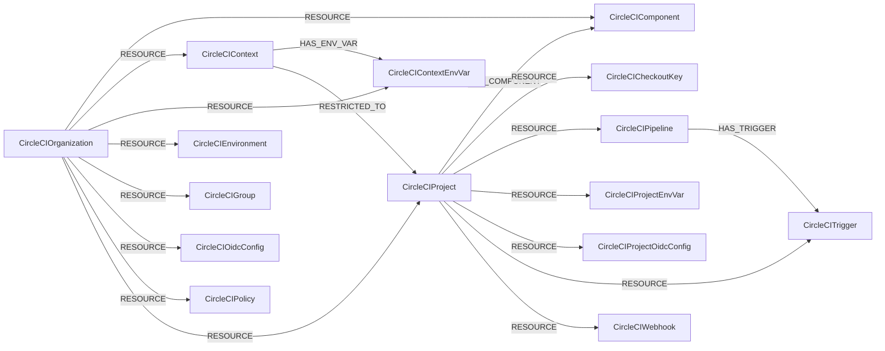

<!-- Generated from the data model. Do not edit manually. -->

## Circleci Schema

### CircleCICheckoutKey

A public checkout or deploy key for a CircleCI project.

#### Properties

| Field | Index | Description |
|-------|-------|-------------|
| id | Yes | Synthesized CircleCI checkout key ID. |
| firstseen |  | Timestamp when a sync job first created this node. |
| lastupdated | Yes | Timestamp of the last sync that observed this node. |
| created_at |  | Checkout key creation timestamp. |
| fingerprint | Yes | Checkout key fingerprint. |
| preferred |  | Whether this is the preferred checkout key. |
| project_slug |  | Slug of the owning CircleCI project. |
| public_key |  | SSH public key. |
| type |  | Checkout key type. |

#### Relationships

- `(:CircleCIProject)-[:RESOURCE]->(:CircleCICheckoutKey)`: The CircleCI project contains the checkout key.

### CircleCIComponent

A deploy component in a CircleCI organization.

#### Properties

| Field | Index | Description |
|-------|-------|-------------|
| id | Yes | CircleCI component ID. |
| firstseen |  | Timestamp when a sync job first created this node. |
| lastupdated | Yes | Timestamp of the last sync that observed this node. |
| created_at |  | Component creation timestamp. |
| labels |  | Labels assigned to the component. |
| name | Yes | Component name. |
| project_id |  | ID of the associated CircleCI project. |
| release_count |  | Number of component releases. |
| updated_at |  | Component update timestamp. |

#### Relationships

- `(:CircleCIProject)-[:HAS_COMPONENT]->(:CircleCIComponent)`: The CircleCI project has the deploy component.

- `(:CircleCIOrganization)-[:RESOURCE]->(:CircleCIComponent)`: The CircleCI organization contains the deploy component.

### CircleCIContext

A CircleCI context containing shared environment variables.

#### Properties

| Field | Index | Description |
|-------|-------|-------------|
| id | Yes | CircleCI context ID. |
| firstseen |  | Timestamp when a sync job first created this node. |
| lastupdated | Yes | Timestamp of the last sync that observed this node. |
| created_at |  | Context creation timestamp. |
| name | Yes | Context name. |

#### Relationships

- `(:CircleCIContext)-[:HAS_ENV_VAR]->(:CircleCIContextEnvVar)`: The CircleCI context has the environment variable.

- `(:CircleCIOrganization)-[:RESOURCE]->(:CircleCIContext)`: The CircleCI organization contains the context.

- `(:CircleCIContext)-[:RESTRICTED_TO]->(:CircleCIProject)`: The context is restricted to the allowed CircleCI projects.

### CircleCIContextEnvVar

A named environment variable in a CircleCI context.

#### Properties

| Field | Index | Description |
|-------|-------|-------------|
| id | Yes | Synthesized context environment variable ID. |
| firstseen |  | Timestamp when a sync job first created this node. |
| lastupdated | Yes | Timestamp of the last sync that observed this node. |
| context_id |  | ID of the owning context. |
| created_at |  | Variable creation timestamp. |
| updated_at |  | Variable update timestamp. |
| variable | Yes | Environment variable name. |

#### Relationships

- `(:CircleCIContext)-[:HAS_ENV_VAR]->(:CircleCIContextEnvVar)`: The CircleCI context has the environment variable.

- `(:CircleCIOrganization)-[:RESOURCE]->(:CircleCIContextEnvVar)`: The CircleCI organization contains the context environment variable.

### CircleCIEnvironment

A deploy environment in a CircleCI organization.

#### Properties

| Field | Index | Description |
|-------|-------|-------------|
| id | Yes | CircleCI environment ID. |
| firstseen |  | Timestamp when a sync job first created this node. |
| lastupdated | Yes | Timestamp of the last sync that observed this node. |
| created_at |  | Environment creation timestamp. |
| description |  | Environment description. |
| labels |  | Labels assigned to the environment. |
| name | Yes | Environment name. |
| updated_at |  | Environment update timestamp. |

#### Relationships

- `(:CircleCIOrganization)-[:RESOURCE]->(:CircleCIEnvironment)`: The CircleCI organization contains the deploy environment.

### CircleCIGroup

A CircleCI organization group with the canonical UserGroup label.

> **Ontology Mapping**: This node uses the ontology label [`UserGroup`](#ontology-usergroup).

#### Properties

Ontology-generated fields are shown in *italics*.

| Field | Index | Description |
|-------|-------|-------------|
| id | Yes | CircleCI group ID. |
| firstseen |  | Timestamp when a sync job first created this node. |
| lastupdated | Yes | Timestamp of the last sync that observed this node. |
| description |  | Group description. |
| name | Yes | Group name. |
| *_ont_description* |  | Normalized field sourced from `description`. |
| *_ont_name* | Yes | Normalized field sourced from `name`. |
| *_ont_source* |  | Module that populated this node's ontology fields. |

#### Relationships

- `(:CircleCIOrganization)-[:RESOURCE]->(:CircleCIGroup)`: The CircleCI organization contains the user group.

### CircleCIOidcConfig

An organization-level CircleCI OIDC custom-claims configuration.

#### Properties

| Field | Index | Description |
|-------|-------|-------------|
| id | Yes | Owning organization ID used as the configuration ID. |
| firstseen |  | Timestamp when a sync job first created this node. |
| lastupdated | Yes | Timestamp of the last sync that observed this node. |
| audience |  | Trusted OIDC token audiences. |
| audience_updated_at |  | Timestamp of the last audience change. |
| org_id |  | Owning organization ID. |
| project_id |  | Owning project ID when present. |
| scope |  | OIDC configuration scope. |
| ttl |  | OIDC token time to live. |
| ttl_updated_at |  | Timestamp of the last token TTL change. |

#### Relationships

- `(:CircleCIOrganization)-[:RESOURCE]->(:CircleCIOidcConfig)`: The CircleCI organization contains its OIDC configuration.

### CircleCIOrganization

A CircleCI organization with the canonical Tenant label.

> **Ontology Mapping**: This node uses the ontology label [`Tenant`](#ontology-tenant).

#### Properties

Ontology-generated fields are shown in *italics*.

| Field | Index | Description |
|-------|-------|-------------|
| id | Yes | CircleCI organization ID. |
| firstseen |  | Timestamp when a sync job first created this node. |
| lastupdated | Yes | Timestamp of the last sync that observed this node. |
| avatar_url |  | URL of the organization avatar. |
| name |  | Organization display name. |
| slug | Yes | CircleCI organization slug. |
| vcs_login |  | GitHub organization login derived from the CircleCI slug. |
| vcs_type |  | Version control system type. |
| *_ont_name* | Yes | Normalized field sourced from `name`. |
| *_ont_source* |  | Module that populated this node's ontology fields. |

#### Relationships

- `(:CircleCIOrganization)-[:ASSOCIATED_WITH]->(:GitHubOrganization)`: The CircleCI organization is associated with a matching GitHub organization.

- `(:CircleCIOrganization)-[:RESOURCE]->(:CircleCIComponent)`: The CircleCI organization contains the deploy component.

- `(:CircleCIOrganization)-[:RESOURCE]->(:CircleCIContext)`: The CircleCI organization contains the context.

- `(:CircleCIOrganization)-[:RESOURCE]->(:CircleCIContextEnvVar)`: The CircleCI organization contains the context environment variable.

- `(:CircleCIOrganization)-[:RESOURCE]->(:CircleCIEnvironment)`: The CircleCI organization contains the deploy environment.

- `(:CircleCIOrganization)-[:RESOURCE]->(:CircleCIGroup)`: The CircleCI organization contains the user group.

- `(:CircleCIOrganization)-[:RESOURCE]->(:CircleCIOidcConfig)`: The CircleCI organization contains its OIDC configuration.

- `(:CircleCIOrganization)-[:RESOURCE]->(:CircleCIPolicy)`: The CircleCI organization contains the configuration policy.

- `(:CircleCIOrganization)-[:RESOURCE]->(:CircleCIProject)`: The CircleCI organization contains the project.

### CircleCIPipeline

A CircleCI pipeline definition with the canonical CICDPipeline label.

> **Ontology Mapping**: This node uses the ontology label [`CICDPipeline`](#ontology-cicdpipeline).

#### Properties

Ontology-generated fields are shown in *italics*.

| Field | Index | Description |
|-------|-------|-------------|
| id | Yes | CircleCI pipeline ID. |
| firstseen |  | Timestamp when a sync job first created this node. |
| lastupdated | Yes | Timestamp of the last sync that observed this node. |
| checkout_source_provider |  | Pipeline checkout provider. |
| checkout_source_repo_external_id |  | External ID of the checkout repository. |
| checkout_source_repo_full_name |  | Full name of the checkout repository. |
| config_source_file_path |  | Path to the pipeline configuration file. |
| config_source_provider |  | Pipeline configuration provider. |
| config_source_repo_external_id |  | External ID of the configuration repository. |
| config_source_repo_full_name |  | Full name of the configuration repository. |
| created_at |  | Pipeline creation timestamp. |
| description |  | Pipeline description. |
| name | Yes | Pipeline name. |
| *_ont_name* | Yes | Normalized field sourced from `name`. |
| *_ont_source* |  | Module that populated this node's ontology fields. |
| *_ont_type* | Yes | Property generated by the ontology mapping. |

#### Relationships

- `(:CircleCIPipeline)-[:HAS_TRIGGER]->(:CircleCITrigger)`: The CircleCI pipeline has the trigger.

- `(:CircleCIProject)-[:RESOURCE]->(:CircleCIPipeline)`: The CircleCI project contains the pipeline definition.

### CircleCIPolicy

A CircleCI configuration policy in an organization policy bundle.

#### Properties

| Field | Index | Description |
|-------|-------|-------------|
| id | Yes | Synthesized CircleCI policy ID. |
| firstseen |  | Timestamp when a sync job first created this node. |
| lastupdated | Yes | Timestamp of the last sync that observed this node. |
| content |  | Policy source in Rego. |
| context |  | CircleCI policy context. |
| created_at |  | Policy creation timestamp. |
| created_by |  | Identity that created the policy. |
| decision_enabled |  | Whether policy decisions are enabled for the context. |
| name | Yes | Policy name. |

#### Relationships

- `(:CircleCIOrganization)-[:RESOURCE]->(:CircleCIPolicy)`: The CircleCI organization contains the configuration policy.

### CircleCIProject

A CircleCI project linked to its external source repository.

#### Properties

| Field | Index | Description |
|-------|-------|-------------|
| id | Yes | CircleCI project ID. |
| firstseen |  | Timestamp when a sync job first created this node. |
| lastupdated | Yes | Timestamp of the last sync that observed this node. |
| default_branch |  | Default repository branch. |
| name |  | Project name. |
| organization_id |  | Owning organization ID. |
| organization_name |  | Owning organization name. |
| organization_slug |  | Owning organization slug. |
| slug | Yes | CircleCI project slug. |
| vcs_provider |  | Version control provider. |
| vcs_url |  | Version control repository URL. |

#### Relationships

- `(:CircleCIProject)-[:BUILDS]->(:GitHubRepository)`: The CircleCI project builds a matching GitHub repository.

- `(:CircleCIProject)-[:BUILDS]->(:GitLabProject)`: The CircleCI project builds a matching GitLab project.

- `(:CircleCIProject)-[:HAS_COMPONENT]->(:CircleCIComponent)`: The CircleCI project has the deploy component.

- `(:Image)-[:PACKAGED_BY]->(:CircleCIProject)`: MatchLink for the building project: (Image)-[:PACKAGED_BY]->(CircleCIProject).

Emitted where a rung identifies the building CircleCI project (the /pipeline feed run
reliably carries project_slug). Analogous to the GitHub ImagePackagedByWorkflowMatchLink;
the PACKAGED_FROM edge to the repo follows either the matcher's own repo edge or the
project's existing CircleCIProject-[:BUILDS]->repo hop.
  - Properties:

    | Field | Description |
    |-------|-------------|
    | match_method | Value sourced from `match_method`. |

- `(:CircleCIProject)-[:RESOURCE]->(:CircleCICheckoutKey)`: The CircleCI project contains the checkout key.

- `(:CircleCIOrganization)-[:RESOURCE]->(:CircleCIProject)`: The CircleCI organization contains the project.

- `(:CircleCIProject)-[:RESOURCE]->(:CircleCIPipeline)`: The CircleCI project contains the pipeline definition.

- `(:CircleCIProject)-[:RESOURCE]->(:CircleCIProjectEnvVar)`: The CircleCI project contains the environment variable.

- `(:CircleCIProject)-[:RESOURCE]->(:CircleCIProjectOidcConfig)`: The CircleCI project contains its OIDC configuration.

- `(:CircleCIProject)-[:RESOURCE]->(:CircleCITrigger)`: The CircleCI project contains the trigger.

- `(:CircleCIProject)-[:RESOURCE]->(:CircleCIWebhook)`: The CircleCI project contains the outbound webhook.

- `(:CircleCIContext)-[:RESTRICTED_TO]->(:CircleCIProject)`: The context is restricted to the allowed CircleCI projects.

### CircleCIProjectEnvVar

A project-level CircleCI environment variable with a masked value.

#### Properties

| Field | Index | Description |
|-------|-------|-------------|
| id | Yes | Synthesized project environment variable ID. |
| firstseen |  | Timestamp when a sync job first created this node. |
| lastupdated | Yes | Timestamp of the last sync that observed this node. |
| name | Yes | Environment variable name. |
| project_slug |  | Slug of the owning CircleCI project. |
| value |  | Masked environment variable value. |

#### Relationships

- `(:CircleCIProject)-[:RESOURCE]->(:CircleCIProjectEnvVar)`: The CircleCI project contains the environment variable.

### CircleCIProjectOidcConfig

A project-level CircleCI OIDC custom-claims configuration.

#### Properties

| Field | Index | Description |
|-------|-------|-------------|
| id | Yes | Owning project ID used as the configuration ID. |
| firstseen |  | Timestamp when a sync job first created this node. |
| lastupdated | Yes | Timestamp of the last sync that observed this node. |
| audience |  | Trusted OIDC token audiences. |
| audience_updated_at |  | Timestamp of the last audience change. |
| org_id |  | Owning organization ID. |
| project_id |  | Owning project ID. |
| scope |  | OIDC configuration scope. |
| ttl |  | OIDC token time to live. |
| ttl_updated_at |  | Timestamp of the last token TTL change. |

#### Relationships

- `(:CircleCIProject)-[:RESOURCE]->(:CircleCIProjectOidcConfig)`: The CircleCI project contains its OIDC configuration.

### CircleCITrigger

An event or schedule trigger attached to a CircleCI pipeline.

#### Properties

| Field | Index | Description |
|-------|-------|-------------|
| id | Yes | CircleCI trigger ID. |
| firstseen |  | Timestamp when a sync job first created this node. |
| lastupdated | Yes | Timestamp of the last sync that observed this node. |
| checkout_ref |  | Version control reference to check out. |
| config_ref |  | Version control reference containing the config. |
| cron_expression |  | Cron expression for a scheduled trigger. |
| description |  | Trigger description. |
| disabled |  | Whether the trigger is disabled. |
| event_name | Yes | Event that activates the trigger. |
| event_preset |  | Configured event preset. |
| event_source_provider |  | Provider that supplies trigger events. |
| pipeline_id |  | ID of the owning CircleCI pipeline. |

#### Relationships

- `(:CircleCIPipeline)-[:HAS_TRIGGER]->(:CircleCITrigger)`: The CircleCI pipeline has the trigger.

- `(:CircleCIProject)-[:RESOURCE]->(:CircleCITrigger)`: The CircleCI project contains the trigger.

### CircleCIWebhook

An outbound webhook configured for a CircleCI project.

#### Properties

| Field | Index | Description |
|-------|-------|-------------|
| id | Yes | CircleCI webhook ID. |
| firstseen |  | Timestamp when a sync job first created this node. |
| lastupdated | Yes | Timestamp of the last sync that observed this node. |
| events |  | Webhook event subscriptions. |
| has_signing_secret |  | Whether the webhook has a signing secret configured. |
| name | Yes | Webhook name. |
| url |  | Webhook destination URL. |
| verify_tls |  | Whether the webhook verifies TLS certificates. |

#### Relationships

- `(:CircleCIProject)-[:RESOURCE]->(:CircleCIWebhook)`: The CircleCI project contains the outbound webhook.
