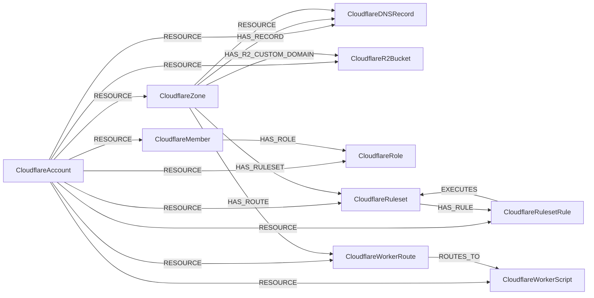

<!-- Generated from the data model. Do not edit manually. -->

## Cloudflare Schema

### CloudflareAccount

A Cloudflare account that contains managed resources.

> **Ontology Mapping**: This node uses the ontology label [`Tenant`](#ontology-tenant).

#### Properties

Ontology-generated fields are shown in *italics*.

| Field | Index | Description |
|-------|-------|-------------|
| id | Yes | Cloudflare account ID. |
| firstseen |  | Timestamp when a sync job first created this node. |
| lastupdated | Yes | Timestamp of the last sync that observed this node. |
| abuse_contact_email |  | Contact email for abuse reports. |
| created_on |  | Timestamp when the account was created. |
| default_nameservers |  | Deprecated default nameserver setting for new zones. |
| enforce_twofactor |  | Whether account membership requires two-factor authentication. |
| name |  | Account name. |
| use_account_custom_ns_by_default |  | Deprecated setting for using account custom nameservers by default. |
| *_ont_name* | Yes | Normalized field sourced from `name`. |
| *_ont_source* |  | Module that populated this node's ontology fields. |

#### Relationships

- `(:CloudflareAccount)-[:RESOURCE]->(:CloudflareDNSRecord)`

- `(:CloudflareAccount)-[:RESOURCE]->(:CloudflareMember)`: The account contains the member.

- `(:CloudflareAccount)-[:RESOURCE]->(:CloudflareR2Bucket)`: The account contains the R2 bucket.

- `(:CloudflareAccount)-[:RESOURCE]->(:CloudflareRole)`: The account contains the role.

- `(:CloudflareAccount)-[:RESOURCE]->(:CloudflareRuleset)`: The account contains the ruleset.

- `(:CloudflareAccount)-[:RESOURCE]->(:CloudflareRulesetRule)`: The account contains the ruleset rule.

- `(:CloudflareAccount)-[:RESOURCE]->(:CloudflareWorkerRoute)`: The account contains the Worker route.

- `(:CloudflareAccount)-[:RESOURCE]->(:CloudflareWorkerScript)`: The account contains the Worker script.

- `(:CloudflareAccount)-[:RESOURCE]->(:CloudflareZone)`: The account contains the DNS zone.

### CloudflareDNSRecord

A DNS record in Cloudflare.

> **Ontology Mapping**: This node uses the ontology label [`DNSRecord`](#ontology-dnsrecord).

#### Properties

Ontology-generated fields are shown in *italics*.

| Field | Index | Description |
|-------|-------|-------------|
| id | Yes | DNS record ID. |
| firstseen |  | Timestamp when a sync job first created this node. |
| lastupdated | Yes | Timestamp of the last sync that observed this node. |
| comment |  | DNS record comment. |
| created_on |  | Timestamp when the record was created. |
| modified_on |  | Timestamp when the record was last modified. |
| name | Yes | DNS record name. |
| proxiable |  | Whether Cloudflare can proxy the record. |
| proxied |  | Whether Cloudflare proxies the record. |
| ttl |  | DNS record TTL; 1 indicates automatic TTL. |
| type |  | DNS record type. |
| value |  | Value or address to which the record points. |
| *_ont_name* | Yes | Normalized field sourced from `name`. |
| *_ont_source* |  | Module that populated this node's ontology fields. |
| *_ont_type* | Yes | Normalized field sourced from `type`. |
| *_ont_value* | Yes | Normalized field sourced from `value`. |

#### Relationships

- `(:CloudflareZone)-[:HAS_RECORD]->(:CloudflareDNSRecord)`: The DNS zone contains the DNS record.

- `(:CloudflareAccount)-[:RESOURCE]->(:CloudflareDNSRecord)`

- `(:CloudflareZone)-[:RESOURCE]->(:CloudflareDNSRecord)`

### CloudflareMember

A user membership in a Cloudflare account.

> **Ontology Mapping**: This node uses the ontology label [`UserAccount`](#ontology-useraccount).

#### Properties

Ontology-generated fields are shown in *italics*.

| Field | Index | Description |
|-------|-------|-------------|
| id | Yes | Membership ID. |
| firstseen |  | Timestamp when a sync job first created this node. |
| lastupdated | Yes | Timestamp of the last sync that observed this node. |
| email |  | Related user's email address. |
| firstname |  | Related user's first name. |
| lastname |  | Related user's last name. |
| status |  | Membership status in the account. |
| two_factor_authentication_enabled |  | Whether the related user enabled two-factor authentication. |
| user_id |  | Related user's ID. |
| *_ont_active* | Yes | Normalized field sourced from `status`. |
| *_ont_email* | Yes | Normalized field sourced from `email`. |
| *_ont_firstname* | Yes | Normalized field sourced from `firstname`. |
| *_ont_has_mfa* | Yes | Normalized field sourced from `two_factor_authentication_enabled`. |
| *_ont_lastname* | Yes | Normalized field sourced from `lastname`. |
| *_ont_source* |  | Module that populated this node's ontology fields. |

#### Relationships

- `(:User)-[:HAS_ACCOUNT]->(:CloudflareMember)`

- `(:CloudflareMember)-[:HAS_ROLE]->(:CloudflareRole)`: The member has the assigned role.

- `(:CloudflareAccount)-[:RESOURCE]->(:CloudflareMember)`: The account contains the member.

### CloudflareR2Bucket

An R2 object storage bucket in Cloudflare.

> **Ontology Mapping**: This node uses the ontology label [`ObjectStorage`](#ontology-objectstorage).

#### Properties

Ontology-generated fields are shown in *italics*.

| Field | Index | Description |
|-------|-------|-------------|
| id | Yes | Bucket ID, built as `<account_id>/<jurisdiction>/<bucket name>`. |
| firstseen |  | Timestamp when a sync job first created this node. |
| lastupdated | Yes | Timestamp of the last sync that observed this node. |
| creation_date |  | Timestamp when the bucket was created. |
| exposed_internet | Yes | `True` when an enabled r2.dev or custom domain serves the bucket. Left null when either domain source could not be read, since a partial read must not downgrade a reachable bucket. |
| exposed_internet_type | Yes | How it is exposed. Always `direct`, since the bucket is served at its own hostname. |
| jurisdiction |  | Jurisdiction the bucket objects are guaranteed to be stored in. |
| location |  | Location hint of the bucket, such as `weur` or `enam`. |
| name | Yes | Bucket name. |
| public |  | Whether the bucket is reachable from the internet through its managed r2.dev domain or an enabled custom domain. |
| public_domains |  | Hostnames serving the bucket publicly, including the managed r2.dev domain and any enabled custom domain. |
| r2_dev_enabled |  | Whether the bucket is served on its managed r2.dev domain. |
| storage_class |  | Default storage class applied to newly uploaded objects. |
| *_ont_encrypted* | Yes | Property generated by the ontology mapping. |
| *_ont_location* | Yes | Normalized field sourced from `location`. |
| *_ont_name* | Yes | Normalized field sourced from `name`. |
| *_ont_public* | Yes | Normalized field sourced from `public`. |
| *_ont_source* |  | Module that populated this node's ontology fields. |

#### Relationships

- `(:CloudflareZone)-[:HAS_R2_CUSTOM_DOMAIN]->(:CloudflareR2Bucket)`: The DNS zone hosts an enabled custom domain serving the R2 bucket.

- `(:CloudflareAccount)-[:RESOURCE]->(:CloudflareR2Bucket)`: The account contains the R2 bucket.

### CloudflareRole

A permission role in Cloudflare.

> **Ontology Mapping**: This node uses the ontology label [`PermissionRole`](#ontology-permissionrole).

#### Properties

Ontology-generated fields are shown in *italics*.

| Field | Index | Description |
|-------|-------|-------------|
| id | Yes | Role ID. |
| firstseen |  | Timestamp when a sync job first created this node. |
| lastupdated | Yes | Timestamp of the last sync that observed this node. |
| description |  | Description of the role's permissions. |
| name |  | Role name. |
| *_ont_name* | Yes | Normalized field sourced from `name`. |
| *_ont_scope* | Yes | Property generated by the ontology mapping. |
| *_ont_source* |  | Module that populated this node's ontology fields. |
| *_ont_type* | Yes | Property generated by the ontology mapping. |

#### Relationships

- `(:CloudflareMember)-[:HAS_ROLE]->(:CloudflareRole)`: The member has the assigned role.

- `(:CloudflareAccount)-[:RESOURCE]->(:CloudflareRole)`: The account contains the role.

### CloudflareRuleset

A Cloudflare ruleset, as deployed in one scope. Rulesets are the engine behind
the Cloudflare WAF: the security phases carry the request filtering, rate
limiting and bot mitigation configuration, while other phases handle caching,
transforms and redirects.

Only deployed rulesets are ingested, that is the phase entry point rulesets of
a scope and whatever an enabled `execute` rule in them turns on. A ruleset that
merely exists, such as a Cloudflare-provided one nothing executes, has no node.

> **Conditional Labels**:
>
> - [`NetworkAccessControl`](#ontology-networkaccesscontrol) (ontology label) when `security_ruleset` equals `true`. A cross-provider NetworkAccessControl resource in Cartography's ontology.

#### Properties

Ontology-generated fields are shown in *italics*.

| Field | Index | Description |
|-------|-------|-------------|
| id | Yes | Ruleset deployment ID, built as `<zone_id>/<ruleset_id>` for a zone-level ruleset and `<account_id>/<ruleset_id>` for an account-level one. |
| firstseen |  | Timestamp when a sync job first created this node. |
| lastupdated | Yes | Timestamp of the last sync that observed this node. |
| description |  | Informative description of the ruleset. |
| kind |  | Kind of the ruleset: `managed` for Cloudflare-provided rulesets, `custom`, `root` or `zone` for customer-authored ones. |
| last_updated |  | Timestamp when the ruleset was last modified. |
| name | Yes | Human-readable name of the ruleset. |
| phase |  | Request-processing phase the ruleset runs in, such as `http_request_firewall_custom`. |
| ruleset_id | Yes | Ruleset ID as returned by the Cloudflare API. Shared by every deployment of a Cloudflare-provided ruleset, and the value that `CloudflareRulesetRule.executed_ruleset_id` points at. |
| scope |  | Level the ruleset is deployed at: `account` for a ruleset covering every zone in the account, `zone` for a single-zone ruleset. |
| security_ruleset |  | Whether the ruleset phase performs access control, as opposed to caching, transforming or redirecting requests. Drives the NetworkAccessControl ontology label. |
| version |  | Version of the ruleset. |
| *_ont_name* | Yes | Normalized field sourced from `name`. |
| *_ont_source* |  | Module that populated this node's ontology fields. |

#### Relationships

- `(:CloudflareRulesetRule)-[:EXECUTES]->(:CloudflareRuleset)`: The rule turns on another ruleset, typically a Cloudflare managed one. The
target is the deployment in the scope the rule was read from, not every
deployment sharing the executed ruleset's API ID.

- `(:CloudflareRuleset)-[:HAS_RULE]->(:CloudflareRulesetRule)`: The ruleset contains the rule.

- `(:CloudflareZone)-[:HAS_RULESET]->(:CloudflareRuleset)`: The DNS zone applies the ruleset to its incoming requests. Absent on
account-level rulesets, which are not tied to a single zone.

- `(:CloudflareAccount)-[:RESOURCE]->(:CloudflareRuleset)`: The account contains the ruleset.

### CloudflareRulesetRule

A rule inside a Cloudflare ruleset.

#### Properties

| Field | Index | Description |
|-------|-------|-------------|
| id | Yes | Rule ID, built as `<ruleset deployment id>/<rule_id>`. |
| firstseen |  | Timestamp when a sync job first created this node. |
| lastupdated | Yes | Timestamp of the last sync that observed this node. |
| action |  | Action performed when the rule matches, such as `block`, `managed_challenge` or `execute`. |
| categories |  | Categories of the rule. |
| description |  | Informative description of the rule. |
| enabled |  | Whether the rule is executed. |
| executed_deployment_id |  | Deployment ID of the ruleset this rule executes, resolved in the scope the rule itself was read from. |
| executed_ruleset_id |  | Cloudflare API ID of the ruleset this rule executes, shared by every deployment of that ruleset. Set only on `execute` rules, which is how a zone or an account turns on a Cloudflare managed ruleset. Follow the EXECUTES relationship to reach the single deployment this rule actually turns on. |
| expression |  | Expression defining which traffic matches the rule. |
| last_updated |  | Timestamp when the rule was last modified. |
| logging_enabled |  | Whether the rule logs its matches. |
| ratelimit_period |  | Period in seconds over which the rate limit counter increments. |
| ratelimit_requests_per_period |  | Request threshold per period before the action is executed. |
| ref |  | Reference of the rule, defaulting to the rule ID. |
| rule_id | Yes | Rule ID as returned by the Cloudflare API. |
| ruleset_id |  | Deployment ID of the ruleset the rule belongs to, matching `CloudflareRuleset.id`. |
| version |  | Version of the rule. |

#### Relationships

- `(:CloudflareRulesetRule)-[:EXECUTES]->(:CloudflareRuleset)`: The rule turns on another ruleset, typically a Cloudflare managed one. The
target is the deployment in the scope the rule was read from, not every
deployment sharing the executed ruleset's API ID.

- `(:CloudflareRuleset)-[:HAS_RULE]->(:CloudflareRulesetRule)`: The ruleset contains the rule.

- `(:CloudflareAccount)-[:RESOURCE]->(:CloudflareRulesetRule)`: The account contains the ruleset rule.

### CloudflareWorkerRoute

A route binding a zone URL pattern to a Cloudflare Worker script.

#### Properties

| Field | Index | Description |
|-------|-------|-------------|
| id | Yes | Route ID. |
| firstseen |  | Timestamp when a sync job first created this node. |
| lastupdated | Yes | Timestamp of the last sync that observed this node. |
| pattern | Yes | URL pattern incoming requests are matched against. |
| script |  | Name of the Worker script invoked when the route matches. |
| zone_id |  | ID of the zone the route is defined in. |

#### Relationships

- `(:CloudflareZone)-[:HAS_ROUTE]->(:CloudflareWorkerRoute)`: The DNS zone routes matching requests through the Worker route.

- `(:CloudflareAccount)-[:RESOURCE]->(:CloudflareWorkerRoute)`: The account contains the Worker route.

- `(:CloudflareWorkerRoute)-[:ROUTES_TO]->(:CloudflareWorkerScript)`: The route invokes the Worker script.

### CloudflareWorkerScript

A Worker script deployed in Cloudflare.

> **Ontology Mapping**: This node uses the ontology label [`Function`](#ontology-function).

#### Properties

Ontology-generated fields are shown in *italics*.

| Field | Index | Description |
|-------|-------|-------------|
| id | Yes | Script ID, built as `<account_id>/<script name>`. |
| firstseen |  | Timestamp when a sync job first created this node. |
| lastupdated | Yes | Timestamp of the last sync that observed this node. |
| compatibility_date |  | Workers runtime version the script targets. |
| compatibility_flags |  | Runtime feature flags enabled or disabled for the script. |
| created_on |  | Timestamp when the script was created. |
| etag |  | Hash of the script content. |
| has_assets |  | Whether the script serves static assets. |
| has_modules |  | Whether the script uses ES modules. |
| last_deployed_from |  | Client most recently used to deploy the script. |
| logpush |  | Whether Logpush is turned on for the script. |
| modified_on |  | Timestamp when the script was last modified. |
| name | Yes | Script name. |
| observability_enabled |  | Whether observability is enabled for the script. |
| placement_mode |  | Placement mode of the script, such as `smart` or `targeted`. |
| tag |  | Immutable Cloudflare ID of the script. |
| usage_model |  | Usage model billed for the script invocations. |
| *_ont_deployment_type* | Yes | Property generated by the ontology mapping. |
| *_ont_name* | Yes | Normalized field sourced from `name`. |
| *_ont_source* |  | Module that populated this node's ontology fields. |

#### Relationships

- `(:CloudflareWorkerScript)-[:RESOLVED_IMAGE]->(:Image)`: generated by analysis job `Function RESOLVED_IMAGE analysis`.

- `(:CloudflareAccount)-[:RESOURCE]->(:CloudflareWorkerScript)`: The account contains the Worker script.

- `(:CloudflareWorkerRoute)-[:ROUTES_TO]->(:CloudflareWorkerScript)`: The route invokes the Worker script.

### CloudflareZone

A DNS zone managed by Cloudflare.

> **Ontology Mapping**: This node uses the ontology label [`DNSZone`](#ontology-dnszone).

#### Properties

Ontology-generated fields are shown in *italics*.

| Field | Index | Description |
|-------|-------|-------------|
| id | Yes | Cloudflare zone ID. |
| firstseen |  | Timestamp when a sync job first created this node. |
| lastupdated | Yes | Timestamp of the last sync that observed this node. |
| activated_on |  | Timestamp when ownership was verified and the zone became active. |
| cdn_only |  | Whether the zone is configured only for CDN. |
| created_on |  | Timestamp when the zone was created. |
| custom_certificate_quota |  | Number of custom certificates allowed for the zone. |
| development_mode |  | Seconds until development mode expires, or since it expired. |
| dns_only |  | Whether the zone is configured only for DNS. |
| foundation_dns |  | Whether the zone uses Foundation DNS. |
| modified_on |  | Timestamp when the zone was last modified. |
| name |  | Domain name. |
| original_dnshost |  | DNS host used before switching to Cloudflare. |
| original_registrar |  | Registrar used before switching to Cloudflare. |
| page_rule_quota |  | Number of page rules allowed for the zone. |
| paused |  | Whether the zone only uses Cloudflare DNS services. |
| phishing_detected |  | Whether the zone was flagged for phishing. |
| status |  | Cloudflare zone status. |
| type |  | Zone type, such as full or partial. |
| verification_key |  | Verification key for partial zone setup. |
| *_ont_name* | Yes | Normalized field sourced from `name`. |
| *_ont_public* | Yes | Property generated by the ontology mapping. |
| *_ont_source* |  | Module that populated this node's ontology fields. |

#### Relationships

- `(:CloudflareZone)-[:HAS_R2_CUSTOM_DOMAIN]->(:CloudflareR2Bucket)`: The DNS zone hosts an enabled custom domain serving the R2 bucket.

- `(:CloudflareZone)-[:HAS_RECORD]->(:CloudflareDNSRecord)`: The DNS zone contains the DNS record.

- `(:CloudflareZone)-[:HAS_ROUTE]->(:CloudflareWorkerRoute)`: The DNS zone routes matching requests through the Worker route.

- `(:CloudflareZone)-[:HAS_RULESET]->(:CloudflareRuleset)`: The DNS zone applies the ruleset to its incoming requests. Absent on
account-level rulesets, which are not tied to a single zone.

- `(:CloudflareAccount)-[:RESOURCE]->(:CloudflareZone)`: The account contains the DNS zone.

- `(:CloudflareZone)-[:RESOURCE]->(:CloudflareDNSRecord)`
