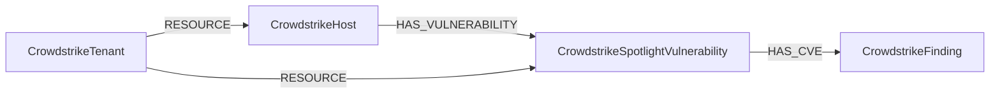

<!-- Generated from the data model. Do not edit manually. -->

## Crowdstrike Schema

### CrowdstrikeFinding

A CVE definition derived from CrowdStrike Spotlight data.

> **Ontology Mapping**: This node uses the ontology label [`CVE`](#ontology-cve).

#### Properties

Ontology-generated fields are shown in *italics*.

| Field | Index | Description |
|-------|-------|-------------|
| id | Yes | CVE identifier. |
| firstseen |  | Timestamp when a sync job first created this node. |
| lastupdated | Yes | Timestamp of the last sync that observed this node. |
| base_score |  | CVSS base score for the CVE. |
| base_severity |  | Severity assigned to the CVE. |
| cve_id | Yes | CVE identifier indexed for cross-module correlation. |
| exploitability_score |  | Numeric score describing known exploit availability. |
| *_ont_base_score* | Yes | Normalized field sourced from `base_score`. |
| *_ont_base_severity* | Yes | Normalized field sourced from `base_severity`. |
| *_ont_cve_id* | Yes | Normalized field sourced from `cve_id`. |
| *_ont_source* |  | Module that populated this node's ontology fields. |

#### Relationships

- `(:CrowdstrikeFinding)-[:AFFECTS]->(:Device)`: generated by analysis job `Ontology - CrowdstrikeFinding AFFECTS Device linking`.

- `(:CrowdstrikeSpotlightVulnerability)-[:HAS_CVE]->(:CrowdstrikeFinding)`: Links a Spotlight vulnerability detection to its CVE.

### CrowdstrikeHost

An endpoint device observed by CrowdStrike Falcon.

> **Ontology Projection**: `CrowdstrikeHost` contributes data to canonical [`Device`](#ontology-device) nodes.

#### Properties

| Field | Index | Description |
|-------|-------|-------------|
| id | Yes | CrowdStrike device ID. |
| firstseen |  | Timestamp when a sync job first created this node. |
| lastupdated | Yes | Timestamp of the last sync that observed this node. |
| agent_version |  | Version of the CrowdStrike agent. |
| bios_manufacturer |  | BIOS manufacturer. |
| bios_version |  | BIOS version. |
| cid |  | CrowdStrike customer ID. |
| cpu_signature |  | CPU signature reported by the host. |
| crowdstrike_first_seen |  | Timestamp of the host's first connection to CrowdStrike Falcon. |
| crowdstrike_last_seen |  | Timestamp of the host's most recent connection to Falcon. |
| email | Yes | Email address associated with the host. |
| external_ip |  | External IP address observed by CrowdStrike. |
| hostname | Yes | Host name reported to CrowdStrike. |
| instance_id | Yes | Cloud provider instance ID associated with the host. |
| kernel_version |  | Host operating system kernel version. |
| local_ip |  | Local IP address of the host. |
| mac_address |  | MAC address of the host. |
| machine_domain |  | Directory domain to which the host belongs. |
| major_version |  | Major operating system version. |
| minor_version |  | Minor operating system version. |
| modified_timestamp |  | Timestamp when CrowdStrike last modified the host record. |
| os_build |  | Operating system build. |
| os_version |  | Operating system version. |
| platform_id |  | CrowdStrike platform identifier. |
| platform_name |  | Operating system platform name. |
| product_type |  | CrowdStrike product type identifier. |
| product_type_desc |  | Human-readable CrowdStrike product type. |
| provision_status |  | Provisioning status of the host. |
| reduced_functionality_mode |  | Reduced functionality mode status. |
| serial_number | Yes | Hardware serial number reported for the host. |
| service_provider |  | Service provider associated with the host. |
| service_provider_account_id |  | Service provider account ID associated with the host. |
| status |  | Containment status of the host. |
| system_manufacturer |  | System manufacturer. |
| system_product_name |  | System product name. |
| tags |  | Grouping tags assigned to the host. |

#### Relationships

- `(:CrowdstrikeHost)-[:HAS_VULNERABILITY]->(:CrowdstrikeSpotlightVulnerability)`: Links a CrowdStrike host to a vulnerability detected on that host.

- `(:Device)-[:OBSERVED_AS]->(:CrowdstrikeHost)`

- `(:CrowdstrikeTenant)-[:RESOURCE]->(:CrowdstrikeHost)`: The CrowdStrike tenant contains this host as a managed resource.

### CrowdstrikeSpotlightVulnerability

A vulnerability detection reported by CrowdStrike Spotlight.

> **Additional Labels**: This node also uses `SpotlightVulnerability`.

> **Additional Label Definitions**:
>
> - `SpotlightVulnerability`: Compatibility label for the deprecated `SpotlightVulnerability` crowdstrike node label. Use `CrowdstrikeSpotlightVulnerability` instead. Scheduled for removal in v1.0.0.

#### Properties

| Field | Index | Description |
|-------|-------|-------------|
| id | Yes | Unique Spotlight vulnerability ID. |
| firstseen |  | Timestamp when a sync job first created this node. |
| lastupdated | Yes | Timestamp of the last sync that observed this node. |
| aid |  | Agent ID of the host on which the vulnerability was detected. |
| app_product_name_version |  | Affected application product name and version. |
| cid |  | CrowdStrike customer ID. |
| closed_timestamp |  | Timestamp when the vulnerability was closed. |
| created_timestamp |  | Timestamp when Spotlight created the vulnerability record. |
| cve_id | Yes | CVE identifier associated with the vulnerability. |
| host_info_local_ip | Yes | Local IP address of the affected host. |
| remediation_ids |  | Identifiers of available remediation actions. |
| status |  | Current Spotlight vulnerability status. |
| updated_timestamp |  | Timestamp when Spotlight last updated the vulnerability. |

#### Relationships

- `(:CrowdstrikeSpotlightVulnerability)-[:HAS_CVE]->(:CVE)`: A CrowdStrike Spotlight vulnerability references this CVE.

- `(:CrowdstrikeSpotlightVulnerability)-[:HAS_CVE]->(:CrowdstrikeFinding)`: Links a Spotlight vulnerability detection to its CVE.

- `(:CrowdstrikeHost)-[:HAS_VULNERABILITY]->(:CrowdstrikeSpotlightVulnerability)`: Links a CrowdStrike host to a vulnerability detected on that host.

- `(:CrowdstrikeTenant)-[:RESOURCE]->(:CrowdstrikeSpotlightVulnerability)`: The CrowdStrike tenant contains this vulnerability as a managed resource.

### CrowdstrikeTenant

A CrowdStrike customer tenant that scopes imported Falcon resources.

> **Ontology Mapping**: This node uses the ontology label [`Tenant`](#ontology-tenant).

#### Properties

Ontology-generated fields are shown in *italics*.

| Field | Index | Description |
|-------|-------|-------------|
| id | Yes | CrowdStrike customer ID for the tenant. |
| firstseen |  | Timestamp when a sync job first created this node. |
| lastupdated | Yes | Timestamp of the last sync that observed this node. |
| *_ont_source* |  | Module that populated this node's ontology fields. |

#### Relationships

- `(:CrowdstrikeTenant)-[:RESOURCE]->(:CrowdstrikeHost)`: The CrowdStrike tenant contains this host as a managed resource.

- `(:CrowdstrikeTenant)-[:RESOURCE]->(:CrowdstrikeSpotlightVulnerability)`: The CrowdStrike tenant contains this vulnerability as a managed resource.
