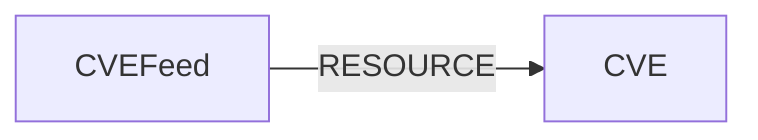

<!-- Generated from the data model. Do not edit manually. -->

## Cve Schema

### CVE

A published Common Vulnerabilities and Exposures record.

#### Properties

Ontology-generated fields are shown in *italics*.

| Field | Index | Description |
|-------|-------|-------------|
| id | Yes | CVE identifier. |
| firstseen |  | Timestamp when a sync job first created this node. |
| lastupdated | Yes | Timestamp of the last sync that observed this node. |
| assigner |  | Organization or authority that assigned the CVE. |
| attack_complexity |  | CVSS attack complexity. |
| attack_vector |  | CVSS attack vector. |
| availability_impact |  | CVSS availability impact. |
| base_score |  | CVSS base score. |
| base_severity |  | CVSS base severity. |
| confidentiality_impact |  | CVSS confidentiality impact. |
| cve_id | Yes | CVE identifier indexed for cross-module correlation. |
| description |  | English description of the vulnerability. |
| exploitability_score |  | CVSS exploitability score. |
| impact_score |  | CVSS impact score. |
| integrity_impact |  | CVSS integrity impact. |
| last_modified_date |  | Timestamp when the CVE was last modified. |
| privileges_required |  | CVSS privileges required. |
| problem_types |  | CWE identifiers associated with the vulnerability. |
| published_date |  | Timestamp when the CVE was published. |
| references |  | Reference URLs for the vulnerability. |
| scope |  | CVSS scope. |
| user_interaction |  | CVSS user interaction requirement. |
| vector_string |  | CVSS vector string. |
| vuln_status |  | Current status assigned to the vulnerability. |
| *_ont_assigner* | Yes | Normalized field sourced from `assigner`. |
| *_ont_attack_complexity* | Yes | Normalized field sourced from `attack_complexity`. |
| *_ont_attack_vector* | Yes | Normalized field sourced from `attack_vector`. |
| *_ont_availability_impact* | Yes | Normalized field sourced from `availability_impact`. |
| *_ont_base_score* | Yes | Normalized field sourced from `base_score`. |
| *_ont_base_severity* | Yes | Normalized field sourced from `base_severity`. |
| *_ont_confidentiality_impact* | Yes | Normalized field sourced from `confidentiality_impact`. |
| *_ont_cve_id* | Yes | Normalized field sourced from `cve_id`. |
| *_ont_description* |  | Normalized field sourced from `description`. |
| *_ont_exploitability_score* | Yes | Normalized field sourced from `exploitability_score`. |
| *_ont_impact_score* | Yes | Normalized field sourced from `impact_score`. |
| *_ont_integrity_impact* | Yes | Normalized field sourced from `integrity_impact`. |
| *_ont_last_modified_date* | Yes | Normalized field sourced from `last_modified_date`. |
| *_ont_privileges_required* | Yes | Normalized field sourced from `privileges_required`. |
| *_ont_problem_types* |  | Normalized field sourced from `problem_types`. |
| *_ont_published_date* | Yes | Normalized field sourced from `published_date`. |
| *_ont_references* |  | Normalized field sourced from `references`. |
| *_ont_scope* | Yes | Normalized field sourced from `scope`. |
| *_ont_source* |  | Module that populated this node's ontology fields. |
| *_ont_user_interaction* | Yes | Normalized field sourced from `user_interaction`. |
| *_ont_vector_string* | Yes | Normalized field sourced from `vector_string`. |
| *_ont_vuln_status* | Yes | Normalized field sourced from `vuln_status`. |

#### Relationships

- `(:CVEMetadata)-[:ENRICHES]->(:CVE)`: CVE metadata enriches its corresponding CVE.

- `(:CrowdstrikeSpotlightVulnerability)-[:HAS_CVE]->(:CVE)`: A CrowdStrike Spotlight vulnerability references this CVE.

- `(:S1AppFinding)-[:LINKED_TO]->(:CVE)`: Links a SentinelOne finding to its generic CVE definition.

- `(:CVE)-[:LINKED_TO]->(:SemgrepSCAFinding)`: Links a CVE to the Semgrep SCA finding that identified it.

- `(:WizFinding)-[:LINKED_TO]->(:CVE)`

- `(:CVEFeed)-[:RESOURCE]->(:CVE)`: A CVE feed contains the CVEs imported from that feed.

### CVEFeed

A source feed from which Cartography imports CVE records.

#### Properties

| Field | Index | Description |
|-------|-------|-------------|
| id | Yes | Unique identifier for the CVE feed. |
| firstseen |  | Timestamp when a sync job first created this node. |
| lastupdated | Yes | Timestamp of the last sync that observed this node. |
| format |  | Data format published by the feed. |
| timestamp |  | Timestamp reported by the feed. |
| version |  | Version of the feed data format. |

#### Relationships

- `(:CVEFeed)-[:RESOURCE]->(:CVE)`: A CVE feed contains the CVEs imported from that feed.
