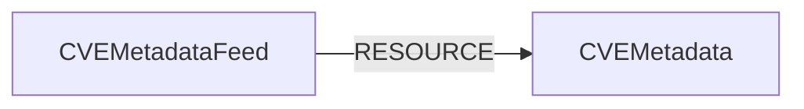

<!-- Generated from the data model. Do not edit manually. -->

## Cve Metadata Schema

### CVEMetadata

Enrichment metadata for a CVE, sourced from NVD and EPSS.

#### Properties

| Field | Index | Description |
|-------|-------|-------------|
| id | Yes | CVE identifier. |
| firstseen |  | Timestamp when a sync job first created this node. |
| lastupdated | Yes | Timestamp of the last sync that observed this node. |
| attack_complexity |  | CVSS attack complexity metric. |
| attack_vector |  | CVSS attack vector metric. |
| availability_impact |  | CVSS availability impact metric. |
| base_score |  | CVSS base score. |
| base_severity |  | CVSS base severity rating. |
| cisa_action_due |  | CISA KEV remediation due date. |
| cisa_exploit_add |  | Date when CISA added the CVE to the KEV catalog. |
| cisa_required_action |  | Remediation action required by CISA. |
| cisa_vulnerability_name |  | CISA vulnerability name. |
| confidentiality_impact |  | CVSS confidentiality impact metric. |
| cvss_version |  | CVSS version selected from the NVD metrics. |
| description |  | English description of the vulnerability. |
| effect_tags |  | Controlled technical effects derived from mapped CWEs when available, otherwise from high CVSS confidentiality, integrity, and availability impacts plus the network straight-shot rule. Values are execute-code, gain-privileges, access-credentials, bypass-control, disclose-data, tamper-data, and deny-service. |
| effect_tags_source |  | Derivation source for effect_tags: cwe takes strict precedence over the cvss fallback, and none indicates that no usable effects were found. |
| epss_percentile |  | EPSS percentile ranking from 0.0 to 1.0. |
| epss_score |  | EPSS probability of exploitation from 0.0 to 1.0. |
| exploitability_score |  | CVSS exploitability score. |
| impact_score |  | CVSS impact score. |
| integrity_impact |  | CVSS integrity impact metric. |
| is_kev | Yes | Whether the CVE appears in the CISA KEV catalog. |
| last_modified_date |  | Date and time when the CVE was last modified. |
| privileges_required |  | CVSS privileges required metric. |
| problem_types |  | CWE identifiers associated with the vulnerability. |
| published_date |  | Date and time when the CVE was published. |
| references |  | Reference URLs for the vulnerability. |
| scope |  | CVSS scope metric. |
| user_interaction |  | CVSS user interaction metric. |
| vector_string |  | CVSS vector string. |
| vuln_status |  | NVD vulnerability analysis status. |

#### Relationships

- `(:CVEMetadata)-[:ENRICHES]->(:CVE)`: CVE metadata enriches its corresponding CVE.

- `(:CVEMetadataFeed)-[:RESOURCE]->(:CVEMetadata)`: A CVE metadata feed contains CVE metadata as a managed resource.

### CVEMetadataFeed

The enrichment feed used to manage CVE metadata lifecycle.

#### Properties

| Field | Index | Description |
|-------|-------|-------------|
| id | Yes | CVE metadata feed identifier. |
| firstseen |  | Timestamp when a sync job first created this node. |
| lastupdated | Yes | Timestamp of the last sync that observed this node. |
| source_epss |  | Whether EPSS enrichment was enabled for the sync. |
| source_nvd |  | Whether NVD enrichment was enabled for the sync. |

#### Relationships

- `(:CVEMetadataFeed)-[:RESOURCE]->(:CVEMetadata)`: A CVE metadata feed contains CVE metadata as a managed resource.
