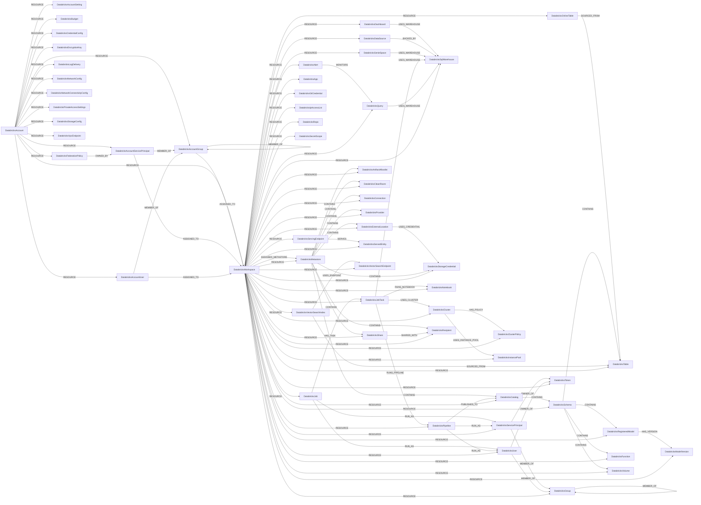

<!-- Generated from the data model. Do not edit manually. -->

## Databricks Schema

### DatabricksAccount

A Databricks account that owns workspaces and account-level resources.

> **Ontology Mapping**: This node uses the ontology label [`Tenant`](#ontology-tenant).

#### Properties

Ontology-generated fields are shown in *italics*.

| Field | Index | Description |
|-------|-------|-------------|
| id | Yes | Databricks account ID. |
| firstseen |  | Timestamp when a sync job first created this node. |
| lastupdated | Yes | Timestamp of the last sync that observed this node. |
| account_id | Yes | Databricks account ID. |
| host |  | Host URL for the Databricks account API. |
| *_ont_domain* | Yes | Normalized field sourced from `host`. |
| *_ont_name* | Yes | Normalized field sourced from `account_id`. |
| *_ont_source* |  | Module that populated this node's ontology fields. |

#### Relationships

- `(:DatabricksAccount)-[:RESOURCE]->(:DatabricksAccountGroup)`: A Databricks account owns an account-level resource.

- `(:DatabricksAccount)-[:RESOURCE]->(:DatabricksAccountServicePrincipal)`: A Databricks account owns an account-level resource.

- `(:DatabricksAccount)-[:RESOURCE]->(:DatabricksAccountSetting)`: A Databricks account owns an account-level resource.

- `(:DatabricksAccount)-[:RESOURCE]->(:DatabricksAccountUser)`: A Databricks account owns an account-level resource.

- `(:DatabricksAccount)-[:RESOURCE]->(:DatabricksBudget)`: A Databricks account owns an account-level resource.

- `(:DatabricksAccount)-[:RESOURCE]->(:DatabricksCredentialConfig)`: A Databricks account owns an account-level resource.

- `(:DatabricksAccount)-[:RESOURCE]->(:DatabricksEncryptionKey)`: A Databricks account owns an account-level resource.

- `(:DatabricksAccount)-[:RESOURCE]->(:DatabricksFederationPolicy)`: A Databricks account owns an account-level resource.

- `(:DatabricksAccount)-[:RESOURCE]->(:DatabricksLogDelivery)`: A Databricks account owns an account-level resource.

- `(:DatabricksAccount)-[:RESOURCE]->(:DatabricksNetworkConfig)`: A Databricks account owns an account-level resource.

- `(:DatabricksAccount)-[:RESOURCE]->(:DatabricksNetworkConnectivityConfig)`: A Databricks account contains this network connectivity configuration.

- `(:DatabricksAccount)-[:RESOURCE]->(:DatabricksPrivateAccessSettings)`: A Databricks account owns an account-level resource.

- `(:DatabricksAccount)-[:RESOURCE]->(:DatabricksStorageConfig)`: A Databricks account owns an account-level resource.

- `(:DatabricksAccount)-[:RESOURCE]->(:DatabricksVpcEndpoint)`: A Databricks account owns an account-level resource.

- `(:DatabricksAccount)-[:RESOURCE]->(:DatabricksWorkspace)`: A Databricks account owns an account-level resource.

### DatabricksAccountGroup

A Databricks account-level SCIM group.

> **Ontology Mapping**: This node uses the ontology label [`UserGroup`](#ontology-usergroup).

#### Properties

Ontology-generated fields are shown in *italics*.

| Field | Index | Description |
|-------|-------|-------------|
| id | Yes | Account-scoped Databricks SCIM group ID. |
| firstseen |  | Timestamp when a sync job first created this node. |
| lastupdated | Yes | Timestamp of the last sync that observed this node. |
| display_name | Yes | Group display name. |
| external_id |  | External identity provider ID for the group. |
| scim_id | Yes | Databricks account SCIM group ID. |
| *_ont_name* | Yes | Normalized field sourced from `display_name`. |
| *_ont_source* |  | Module that populated this node's ontology fields. |

#### Relationships

- `(:DatabricksAccountGroup)-[:ASSIGNED_TO]->(:DatabricksWorkspace)`: An account-level Databricks principal is assigned to a workspace.
  - Properties:

    | Field | Description |
    |-------|-------------|
    | permissions | Workspace permissions granted to the account principal. |

- `(:DatabricksAccountGroup)-[:MEMBER_OF]->(:DatabricksAccountGroup)`: A Databricks account group is a member of another account group.

- `(:DatabricksAccountServicePrincipal)-[:MEMBER_OF]->(:DatabricksAccountGroup)`: A Databricks account service principal is a member of an account group.

- `(:DatabricksAccountUser)-[:MEMBER_OF]->(:DatabricksAccountGroup)`: A Databricks account user is a member of an account group.

- `(:DatabricksAccount)-[:RESOURCE]->(:DatabricksAccountGroup)`: A Databricks account owns an account-level resource.

### DatabricksAccountServicePrincipal

A Databricks account-level SCIM service principal.

> **Ontology Mapping**: This node uses the ontology label [`ServiceAccount`](#ontology-serviceaccount).

#### Properties

Ontology-generated fields are shown in *italics*.

| Field | Index | Description |
|-------|-------|-------------|
| id | Yes | Account-scoped Databricks SCIM service principal ID. |
| firstseen |  | Timestamp when a sync job first created this node. |
| lastupdated | Yes | Timestamp of the last sync that observed this node. |
| active |  | Whether the service principal is active. |
| application_id | Yes | OAuth application ID for the service principal. |
| display_name |  | Service principal display name. |
| external_id |  | External identity provider ID for the service principal. |
| scim_id | Yes | Databricks account SCIM service principal ID. |
| *_ont_active* | Yes | Normalized field sourced from `active`. |
| *_ont_name* | Yes | Normalized field sourced from `display_name`. |
| *_ont_source* |  | Module that populated this node's ontology fields. |

#### Relationships

- `(:DatabricksAccountServicePrincipal)-[:ASSIGNED_TO]->(:DatabricksWorkspace)`: An account-level Databricks principal is assigned to a workspace.
  - Properties:

    | Field | Description |
    |-------|-------------|
    | permissions | Workspace permissions granted to the account principal. |

- `(:DatabricksAccountServicePrincipal)-[:MEMBER_OF]->(:DatabricksAccountGroup)`: A Databricks account service principal is a member of an account group.

- `(:DatabricksFederationPolicy)-[:OWNED_BY]->(:DatabricksAccountServicePrincipal)`: A federation policy is owned by its account service principal.

- `(:DatabricksAccount)-[:RESOURCE]->(:DatabricksAccountServicePrincipal)`: A Databricks account owns an account-level resource.

### DatabricksAccountSetting

A security-relevant Databricks account setting.

#### Properties

| Field | Index | Description |
|-------|-------|-------------|
| id | Yes | Account-scoped Databricks setting ID. |
| firstseen |  | Timestamp when a sync job first created this node. |
| lastupdated | Yes | Timestamp of the last sync that observed this node. |
| setting_name | Yes | Account setting name. |
| value |  | Account setting value. |

#### Relationships

- `(:DatabricksAccount)-[:RESOURCE]->(:DatabricksAccountSetting)`: A Databricks account owns an account-level resource.

### DatabricksAccountUser

A Databricks account-level SCIM user.

> **Ontology Mapping**: This node uses the ontology label [`UserAccount`](#ontology-useraccount).

#### Properties

Ontology-generated fields are shown in *italics*.

| Field | Index | Description |
|-------|-------|-------------|
| id | Yes | Account-scoped Databricks SCIM user ID. |
| firstseen |  | Timestamp when a sync job first created this node. |
| lastupdated | Yes | Timestamp of the last sync that observed this node. |
| active |  | Whether the user is active. |
| display_name |  | User display name. |
| email | Yes | Primary email address for the user. |
| external_id |  | External identity provider ID for the user. |
| scim_id | Yes | Databricks account SCIM user ID. |
| user_name | Yes | SCIM user name, typically the user's email address. |
| *_ont_active* | Yes | Normalized field sourced from `active`. |
| *_ont_email* | Yes | Normalized field sourced from `email`. |
| *_ont_fullname* | Yes | Normalized field sourced from `display_name`. |
| *_ont_source* |  | Module that populated this node's ontology fields. |

#### Relationships

- `(:DatabricksAccountUser)-[:ASSIGNED_TO]->(:DatabricksWorkspace)`: An account-level Databricks principal is assigned to a workspace.
  - Properties:

    | Field | Description |
    |-------|-------------|
    | permissions | Workspace permissions granted to the account principal. |

- `(:User)-[:HAS_ACCOUNT]->(:DatabricksAccountUser)`

- `(:DatabricksAccountUser)-[:MEMBER_OF]->(:DatabricksAccountGroup)`: A Databricks account user is a member of an account group.

- `(:DatabricksAccount)-[:RESOURCE]->(:DatabricksAccountUser)`: A Databricks account owns an account-level resource.

### DatabricksAlert

A Databricks SQL alert that evaluates a saved query.

#### Properties

| Field | Index | Description |
|-------|-------|-------------|
| id | Yes | Workspace-scoped identifier for the Databricks alert. |
| firstseen |  | Timestamp when a sync job first created this node. |
| lastupdated | Yes | Timestamp of the last sync that observed this node. |
| alert_id | Yes | Databricks alert identifier. |
| condition_op |  | Comparison operator used by the alert condition. |
| create_time |  | Timestamp when the alert was created. |
| display_name | Yes | Display name of the alert. |
| lifecycle_state |  | Lifecycle state of the alert. |
| owner_user_name | Yes | User name of the alert owner. |
| parent_path |  | Workspace path of the alert's parent folder. |
| query_id | Yes | Identifier of the query monitored by the alert. |
| state |  | Current evaluation state of the alert. |
| update_time |  | Timestamp when the alert was last updated. |

#### Relationships

- `(:DatabricksAlert)-[:MONITORS]->(:DatabricksQuery)`: A Databricks alert monitors a Databricks query.

- `(:DatabricksWorkspace)-[:RESOURCE]->(:DatabricksAlert)`: A Databricks workspace contains this alert resource.

### DatabricksApp

A Databricks app deployed in a workspace.

> **Additional Labels**: This node also uses `DatabricksAclObject`.

> **Additional Label Definitions**:
>
> - `DatabricksAclObject`: An object that can receive Databricks workspace permissions.

#### Properties

| Field | Index | Description |
|-------|-------|-------------|
| id | Yes | Workspace-scoped identifier for the Databricks app. |
| firstseen |  | Timestamp when a sync job first created this node. |
| lastupdated | Yes | Timestamp of the last sync that observed this node. |
| app_state |  | Current lifecycle state of the app. |
| compute_size |  | Compute size assigned to the app. |
| compute_state |  | Current state of the app's compute. |
| create_time |  | Timestamp when the app was created. |
| creator | Yes | User name of the app creator. |
| description |  | Description of the app. |
| name | Yes | Name of the app. |
| oauth2_app_client_id |  | OAuth application client identifier for the app. |
| service_principal_client_id | Yes | Client identifier of the app's service principal. |
| service_principal_name |  | Name of the app's service principal. |
| update_time |  | Timestamp when the app was last updated. |
| url | Yes | URL of the deployed app. |

#### Relationships

- `(:DatabricksWorkspace)-[:RESOURCE]->(:DatabricksApp)`: A Databricks workspace contains this app resource.

### DatabricksArtifactAllowlist

A Unity Catalog allowlist for libraries and initialization scripts.

#### Properties

| Field | Index | Description |
|-------|-------|-------------|
| id | Yes | Identifier for the artifact allowlist. |
| firstseen |  | Timestamp when a sync job first created this node. |
| lastupdated | Yes | Timestamp of the last sync that observed this node. |
| artifact_type | Yes | Type of artifact governed by the allowlist. |
| artifacts |  | Allowed artifact patterns prefixed by their match types. |
| created_at |  | Timestamp when the allowlist was created. |
| created_by | Yes | Principal that created the allowlist. |
| metastore_id | Yes | Identifier of the metastore governed by the allowlist. |

#### Relationships

- `(:DatabricksMetastore)-[:CONTAINS]->(:DatabricksArtifactAllowlist)`: A Databricks metastore contains an artifact allowlist.

- `(:DatabricksWorkspace)-[:RESOURCE]->(:DatabricksArtifactAllowlist)`: A Databricks artifact allowlist is a resource within a workspace.

### DatabricksBudget

A Databricks account budget configuration.

#### Properties

| Field | Index | Description |
|-------|-------|-------------|
| id | Yes | Account-scoped Databricks budget configuration ID. |
| firstseen |  | Timestamp when a sync job first created this node. |
| lastupdated | Yes | Timestamp of the last sync that observed this node. |
| budget_configuration_id | Yes | Databricks budget configuration ID. |
| display_name | Yes | Budget display name. |

#### Relationships

- `(:DatabricksAccount)-[:RESOURCE]->(:DatabricksBudget)`: A Databricks account owns an account-level resource.

### DatabricksCatalog

A Unity Catalog catalog that organizes data and other securables.

> **Ontology Mapping**: This node uses the ontology label [`Database`](#ontology-database).

> **Additional Labels**: This node also uses `DatabricksSecurable`.

> **Additional Label Definitions**:
>
> - `DatabricksSecurable`: A Unity Catalog object that can receive Databricks privileges.

#### Properties

Ontology-generated fields are shown in *italics*.

| Field | Index | Description |
|-------|-------|-------------|
| id | Yes | Metastore-scoped identifier for the catalog. |
| firstseen |  | Timestamp when a sync job first created this node. |
| lastupdated | Yes | Timestamp of the last sync that observed this node. |
| catalog_id | Yes | Databricks identifier for the catalog. |
| catalog_type |  | Type of the catalog. |
| comment |  | User-provided description of the catalog. |
| connection_name | Yes | Name of the connection used by a foreign catalog. |
| created_at |  | Timestamp when the catalog was created. |
| created_by |  | Principal that created the catalog. |
| full_name | Yes | Full name of the catalog. |
| isolation_mode |  | Workspace isolation mode of the catalog. |
| metastore_id | Yes | Identifier of the metastore that contains the catalog. |
| name | Yes | Name of the catalog. |
| owner | Yes | Principal that owns the catalog. |
| provider_name |  | Name of the provider for a shared catalog. |
| securable_kind |  | Unity Catalog securable kind of the catalog. |
| share_name |  | Name of the share that provides the catalog. |
| storage_root |  | Cloud storage root for managed catalog data. |
| updated_at |  | Timestamp when the catalog was last updated. |
| updated_by |  | Principal that last updated the catalog. |
| *_ont_name* | Yes | Normalized field sourced from `full_name`. |
| *_ont_source* |  | Module that populated this node's ontology fields. |
| *_ont_type* | Yes | Normalized field sourced from `catalog_type`. |

#### Relationships

- `(:DatabricksMetastore)-[:CONTAINS]->(:DatabricksCatalog)`: A Databricks metastore contains a catalog.

- `(:DatabricksCatalog)-[:CONTAINS]->(:DatabricksSchema)`: A Databricks catalog contains a schema.

- `(:DatabricksPipeline)-[:PUBLISHES_TO]->(:DatabricksCatalog)`: A Databricks pipeline publishes data to a Unity Catalog catalog.

- `(:DatabricksWorkspace)-[:RESOURCE]->(:DatabricksCatalog)`: A Databricks catalog is a resource within a workspace.

### DatabricksCleanRoom

A Databricks clean room for privacy-preserving data collaboration.

#### Properties

| Field | Index | Description |
|-------|-------|-------------|
| id | Yes | Metastore-scoped identifier for the clean room. |
| firstseen |  | Timestamp when a sync job first created this node. |
| lastupdated | Yes | Timestamp of the last sync that observed this node. |
| access_restricted |  | Whether access to the clean room is restricted. |
| comment |  | User-provided description of the clean room. |
| created_at |  | Timestamp when the clean room was created. |
| metastore_id | Yes | Identifier of the metastore that contains the clean room. |
| name | Yes | Name of the clean room. |
| owner | Yes | Principal that owns the clean room. |
| updated_at |  | Timestamp when the clean room was last updated. |

#### Relationships

- `(:DatabricksMetastore)-[:CONTAINS]->(:DatabricksCleanRoom)`: A Databricks metastore contains a clean room.

- `(:DatabricksWorkspace)-[:RESOURCE]->(:DatabricksCleanRoom)`: A Databricks clean room is a resource within a workspace.

### DatabricksCluster

A Databricks compute cluster.

> **Additional Labels**: This node also uses `DatabricksAclObject`.

> **Additional Label Definitions**:
>
> - `DatabricksAclObject`: An object that can receive Databricks workspace permissions.

#### Properties

| Field | Index | Description |
|-------|-------|-------------|
| id | Yes | Workspace-scoped identifier for the cluster. |
| firstseen |  | Timestamp when a sync job first created this node. |
| lastupdated | Yes | Timestamp of the last sync that observed this node. |
| autotermination_minutes |  | Minutes of inactivity before the cluster terminates automatically. |
| cluster_id | Yes | Databricks cluster identifier. |
| cluster_name | Yes | Name of the cluster. |
| cluster_source |  | Source that created the cluster. |
| creator_user_name | Yes | User who created the cluster. |
| data_security_mode |  | Data security mode of the cluster. |
| driver_instance_pool_id | Yes | Instance pool identifier used for the driver node. |
| driver_node_type_id |  | Driver node type used by the cluster. |
| enable_elastic_disk |  | Whether elastic disk autoscaling is enabled. |
| enable_local_disk_encryption |  | Whether local disks are encrypted. |
| instance_pool_id | Yes | Instance pool identifier used for worker nodes. |
| node_type_id |  | Worker node type used by the cluster. |
| num_workers |  | Number of worker nodes in the cluster. |
| runtime_engine |  | Runtime engine used by the cluster. |
| single_user_name | Yes | User assigned to a single-user cluster. |
| spark_version |  | Databricks Runtime version used by the cluster. |
| start_time |  | Timestamp when the cluster was started. |
| state |  | Current lifecycle state of the cluster. |
| terminated_time |  | Timestamp when the cluster was terminated. |

#### Relationships

- `(:DatabricksCluster)-[:HAS_POLICY]->(:DatabricksClusterPolicy)`: A Databricks cluster uses a cluster policy.

- `(:DatabricksWorkspace)-[:RESOURCE]->(:DatabricksCluster)`: A Databricks workspace contains the cluster as a resource.

- `(:DatabricksJobTask)-[:USES_CLUSTER]->(:DatabricksCluster)`: A Databricks job task uses an existing cluster.

- `(:DatabricksCluster)-[:USES_INSTANCE_POOL]->(:DatabricksInstancePool)`: A Databricks cluster uses an instance pool for driver or worker nodes.

### DatabricksClusterPolicy

A Databricks policy that constrains cluster configuration.

> **Additional Labels**: This node also uses `DatabricksAclObject`.

> **Additional Label Definitions**:
>
> - `DatabricksAclObject`: An object that can receive Databricks workspace permissions.

#### Properties

| Field | Index | Description |
|-------|-------|-------------|
| id | Yes | Workspace-scoped identifier for the cluster policy. |
| firstseen |  | Timestamp when a sync job first created this node. |
| lastupdated | Yes | Timestamp of the last sync that observed this node. |
| created_at |  | Timestamp when the cluster policy was created. |
| creator_user_name | Yes | User who created the cluster policy. |
| definition |  | JSON definition of the cluster policy. |
| description |  | Description of the cluster policy. |
| name | Yes | Name of the cluster policy. |
| policy_family_id |  | Identifier of the policy family used by this policy. |
| policy_id | Yes | Databricks cluster policy identifier. |

#### Relationships

- `(:DatabricksCluster)-[:HAS_POLICY]->(:DatabricksClusterPolicy)`: A Databricks cluster uses a cluster policy.

- `(:DatabricksWorkspace)-[:RESOURCE]->(:DatabricksClusterPolicy)`: A Databricks workspace contains the cluster policy as a resource.

### DatabricksConnection

A Unity Catalog connection to an external data system.

> **Additional Labels**: This node also uses `DatabricksSecurable`.

> **Additional Label Definitions**:
>
> - `DatabricksSecurable`: A Unity Catalog object that can receive Databricks privileges.

#### Properties

| Field | Index | Description |
|-------|-------|-------------|
| id | Yes | Metastore-scoped identifier for the connection. |
| firstseen |  | Timestamp when a sync job first created this node. |
| lastupdated | Yes | Timestamp of the last sync that observed this node. |
| comment |  | User-provided description of the connection. |
| connection_id | Yes | Databricks identifier for the connection. |
| connection_type |  | Type of the external data connection. |
| created_at |  | Timestamp when the connection was created. |
| created_by |  | Principal that created the connection. |
| credential_type |  | Authentication method used by the connection. |
| full_name | Yes | Full name of the connection. |
| host | Yes | Host name of the external data source. |
| metastore_id | Yes | Identifier of the metastore that contains the connection. |
| name | Yes | Name of the connection. |
| owner | Yes | Principal that owns the connection. |
| port |  | Network port of the external data source. |
| read_only |  | Whether the connection permits only read operations. |
| updated_at |  | Timestamp when the connection was last updated. |
| updated_by |  | Principal that last updated the connection. |

#### Relationships

- `(:DatabricksMetastore)-[:CONTAINS]->(:DatabricksConnection)`: A Databricks metastore contains a connection.

- `(:DatabricksWorkspace)-[:RESOURCE]->(:DatabricksConnection)`: A Databricks connection is a resource within a workspace.

### DatabricksCredentialConfig

A Databricks account credential configuration for an AWS IAM role.

#### Properties

| Field | Index | Description |
|-------|-------|-------------|
| id | Yes | Account-scoped Databricks credential configuration ID. |
| firstseen |  | Timestamp when a sync job first created this node. |
| lastupdated | Yes | Timestamp of the last sync that observed this node. |
| aws_account_id | Yes | ID of the AWS account that owns the IAM role. |
| aws_role_arn | Yes | ARN of the cross-account AWS IAM role. |
| created_time |  | Timestamp when the credential configuration was created. |
| credentials_id | Yes | Databricks credential configuration ID. |
| credentials_name | Yes | Credential configuration name. |

#### Relationships

- `(:DatabricksCredentialConfig)-[:ASSUMES_ROLE]->(:AWSPrincipal)`: A Databricks credential configuration assumes an AWS IAM role.

- `(:DatabricksCredentialConfig)-[:IN_ACCOUNT]->(:AWSAccount)`: A Databricks credential configuration uses a role in an AWS account.

- `(:DatabricksAccount)-[:RESOURCE]->(:DatabricksCredentialConfig)`: A Databricks account owns an account-level resource.

### DatabricksDashboard

A Databricks dashboard in a workspace.

#### Properties

| Field | Index | Description |
|-------|-------|-------------|
| id | Yes | Workspace-scoped identifier for the Databricks dashboard. |
| firstseen |  | Timestamp when a sync job first created this node. |
| lastupdated | Yes | Timestamp of the last sync that observed this node. |
| create_time |  | Timestamp when the dashboard was created. |
| dashboard_id | Yes | Databricks dashboard identifier. |
| dashboard_type |  | Dashboard generation, such as Lakeview or legacy. |
| display_name | Yes | Display name of the dashboard. |
| lifecycle_state |  | Lifecycle state of the dashboard. |
| owner_user_name | Yes | User name of the dashboard owner. |
| parent_path |  | Workspace path of the dashboard's parent folder. |
| path |  | Workspace path of the dashboard. |
| update_time |  | Timestamp when the dashboard was last updated. |
| warehouse_id | Yes | Identifier of the SQL warehouse used by the dashboard. |

#### Relationships

- `(:DatabricksWorkspace)-[:RESOURCE]->(:DatabricksDashboard)`: A Databricks workspace contains this dashboard resource.

- `(:DatabricksDashboard)-[:USES_WAREHOUSE]->(:DatabricksSqlWarehouse)`: A Databricks dashboard uses a SQL warehouse.

### DatabricksDataSource

A Databricks SQL data source backed by a warehouse.

#### Properties

| Field | Index | Description |
|-------|-------|-------------|
| id | Yes | Workspace-scoped identifier for the Databricks data source. |
| firstseen |  | Timestamp when a sync job first created this node. |
| lastupdated | Yes | Timestamp of the last sync that observed this node. |
| data_source_id | Yes | Databricks data source identifier. |
| name | Yes | Name of the data source. |
| paused |  | Whether the data source is paused. |
| syntax |  | SQL dialect supported by the data source. |
| type |  | Type of the data source. |
| view_only |  | Whether the data source is restricted to viewing. |
| warehouse_id | Yes | Identifier of the backing SQL warehouse. |

#### Relationships

- `(:DatabricksDataSource)-[:BACKED_BY]->(:DatabricksSqlWarehouse)`: A Databricks data source is backed by a SQL warehouse.

- `(:DatabricksWorkspace)-[:RESOURCE]->(:DatabricksDataSource)`: A Databricks workspace contains this data source resource.

### DatabricksEncryptionKey

A Databricks account customer-managed encryption key.

#### Properties

| Field | Index | Description |
|-------|-------|-------------|
| id | Yes | Account-scoped Databricks customer-managed key ID. |
| firstseen |  | Timestamp when a sync job first created this node. |
| lastupdated | Yes | Timestamp of the last sync that observed this node. |
| aws_key_alias |  | Alias of the AWS KMS key. |
| aws_key_arn | Yes | ARN of the AWS KMS key. |
| customer_managed_key_id | Yes | Databricks customer-managed key ID. |
| gcp_kms_key_name | Yes | Full resource name of the Google Cloud KMS key. |
| use_cases |  | Databricks use cases protected by the key. |

#### Relationships

- `(:DatabricksEncryptionKey)-[:REFERENCES_KEY]->(:AWSKMSKey)`: A Databricks encryption key references an AWS KMS key.

- `(:DatabricksEncryptionKey)-[:REFERENCES_KEY]->(:GCPCryptoKey)`: A Databricks encryption key references a Google Cloud KMS key.

- `(:DatabricksAccount)-[:RESOURCE]->(:DatabricksEncryptionKey)`: A Databricks account owns an account-level resource.

### DatabricksExternalLocation

A Unity Catalog external location that governs a cloud storage path.

> **Ontology Mapping**: This node uses the ontology label [`ObjectStorage`](#ontology-objectstorage).

> **Additional Labels**: This node also uses `DatabricksSecurable`.

> **Additional Label Definitions**:
>
> - `DatabricksSecurable`: A Unity Catalog object that can receive Databricks privileges.

#### Properties

Ontology-generated fields are shown in *italics*.

| Field | Index | Description |
|-------|-------|-------------|
| id | Yes | Identifier for the external location. |
| firstseen |  | Timestamp when a sync job first created this node. |
| lastupdated | Yes | Timestamp of the last sync that observed this node. |
| comment |  | User-provided description of the external location. |
| created_at |  | Timestamp when the external location was created. |
| credential_id | Yes | Identifier of the storage credential used by the location. |
| credential_name |  | Name of the storage credential used by the location. |
| external_location_id | Yes | Databricks identifier for the external location. |
| fallback |  | Whether fallback mode is enabled for the external location. |
| isolation_mode |  | Workspace isolation mode of the external location. |
| metastore_id | Yes | Identifier of the metastore that contains the external location. |
| name | Yes | Name of the external location. |
| owner | Yes | Principal that owns the external location. |
| read_only |  | Whether the external location is read-only. |
| updated_at |  | Timestamp when the external location was last updated. |
| url | Yes | Cloud storage URL of the external location. |
| *_ont_name* | Yes | Normalized field sourced from `name`. |
| *_ont_source* |  | Module that populated this node's ontology fields. |

#### Relationships

- `(:DatabricksExternalLocation)-[:BACKED_BY]->(:AWSS3Bucket)`: A Databricks external location is backed by an Amazon S3 bucket.

- `(:DatabricksExternalLocation)-[:BACKED_BY]->(:GCPBucket)`: A Databricks external location is backed by a Google Cloud Storage bucket.

- `(:DatabricksMetastore)-[:CONTAINS]->(:DatabricksExternalLocation)`: A Databricks metastore contains an external location.

- `(:DatabricksWorkspace)-[:RESOURCE]->(:DatabricksExternalLocation)`: A Databricks external location is a resource within a workspace.

- `(:DatabricksExternalLocation)-[:USES_CREDENTIAL]->(:DatabricksStorageCredential)`: A Databricks external location uses a storage credential.

### DatabricksFederationPolicy

A Databricks account or service principal federation policy.

#### Properties

| Field | Index | Description |
|-------|-------|-------------|
| id | Yes | Account-scoped Databricks federation policy ID. |
| firstseen |  | Timestamp when a sync job first created this node. |
| lastupdated | Yes | Timestamp of the last sync that observed this node. |
| audiences |  | OIDC audiences accepted by the policy. |
| description |  | Federation policy description. |
| issuer |  | OIDC token issuer accepted by the policy. |
| name |  | Federation policy name. |
| service_principal_id |  | SCIM ID for a service-principal-scoped policy. |
| subject_claim |  | OIDC claim used to identify the federated subject. |
| uid | Yes | Server-assigned federation policy UID. |

#### Relationships

- `(:DatabricksFederationPolicy)-[:OWNED_BY]->(:DatabricksAccountServicePrincipal)`: A federation policy is owned by its account service principal.

- `(:DatabricksAccount)-[:RESOURCE]->(:DatabricksFederationPolicy)`: A Databricks account owns an account-level resource.

### DatabricksFunction

A user-defined function registered in Unity Catalog.

> **Additional Labels**: This node also uses `DatabricksSecurable`.

> **Additional Label Definitions**:
>
> - `DatabricksSecurable`: A Unity Catalog object that can receive Databricks privileges.

#### Properties

| Field | Index | Description |
|-------|-------|-------------|
| id | Yes | Metastore-scoped identifier for the function. |
| firstseen |  | Timestamp when a sync job first created this node. |
| lastupdated | Yes | Timestamp of the last sync that observed this node. |
| catalog_name | Yes | Name of the catalog that contains the function. |
| comment |  | User-provided description of the function. |
| created_at |  | Timestamp when the function was created. |
| created_by |  | Principal that created the function. |
| data_type |  | Return data type of the function. |
| external_language |  | Language in which the function is written. |
| full_name | Yes | Full catalog, schema, and function name. |
| function_id | Yes | Databricks identifier for the function. |
| is_deterministic |  | Whether the function returns the same result for the same inputs. |
| metastore_id | Yes | Identifier of the metastore that contains the function. |
| name | Yes | Name of the function. |
| owner | Yes | Principal that owns the function. |
| routine_body |  | Language used to define the function body. |
| schema_name | Yes | Name of the schema that contains the function. |
| security_type |  | Security context used to run the function. |
| sql_data_access |  | Declared SQL data access behavior. |
| updated_at |  | Timestamp when the function was last updated. |
| updated_by |  | Principal that last updated the function. |

#### Relationships

- `(:DatabricksSchema)-[:CONTAINS]->(:DatabricksFunction)`: A Databricks schema contains a function.

- `(:DatabricksWorkspace)-[:RESOURCE]->(:DatabricksFunction)`: A Databricks function is a resource within a workspace.

### DatabricksGenieSpace

A Databricks Genie space for natural-language data analysis.

#### Properties

| Field | Index | Description |
|-------|-------|-------------|
| id | Yes | Workspace-scoped identifier for the Databricks Genie space. |
| firstseen |  | Timestamp when a sync job first created this node. |
| lastupdated | Yes | Timestamp of the last sync that observed this node. |
| description |  | Description of the Genie space. |
| space_id | Yes | Databricks Genie space identifier. |
| title | Yes | Title of the Genie space. |
| warehouse_id | Yes | Identifier of the SQL warehouse used by the Genie space. |

#### Relationships

- `(:DatabricksWorkspace)-[:RESOURCE]->(:DatabricksGenieSpace)`: A Databricks workspace contains this Genie space resource.

- `(:DatabricksGenieSpace)-[:USES_WAREHOUSE]->(:DatabricksSqlWarehouse)`: A Databricks Genie space uses a SQL warehouse.

### DatabricksGitCredential

A credential used to authenticate to a Git provider from Databricks.

#### Properties

| Field | Index | Description |
|-------|-------|-------------|
| id | Yes | Workspace-scoped identifier for the Git credential. |
| firstseen |  | Timestamp when a sync job first created this node. |
| lastupdated | Yes | Timestamp of the last sync that observed this node. |
| credential_id | Yes | Databricks Git credential identifier. |
| git_provider |  | Git provider associated with the credential. |
| git_username | Yes | Git user name associated with the credential. |

#### Relationships

- `(:DatabricksWorkspace)-[:RESOURCE]->(:DatabricksGitCredential)`: A Databricks workspace contains the Git credential as a resource.

### DatabricksGroup

A group of principals in a Databricks workspace.

> **Ontology Mapping**: This node uses the ontology label [`UserGroup`](#ontology-usergroup).

#### Properties

Ontology-generated fields are shown in *italics*.

| Field | Index | Description |
|-------|-------|-------------|
| id | Yes | Workspace-scoped identifier for the group. |
| firstseen |  | Timestamp when a sync job first created this node. |
| lastupdated | Yes | Timestamp of the last sync that observed this node. |
| display_name | Yes | Display name of the group. |
| external_id |  | Identifier assigned by the external identity provider. |
| scim_id | Yes | Databricks SCIM group identifier. |
| *_ont_name* | Yes | Normalized field sourced from `display_name`. |
| *_ont_source* |  | Module that populated this node's ontology fields. |

#### Relationships

- `(:DatabricksGroup)-[:HAS_PERMISSION]->(:DatabricksAclObject)`: A Databricks principal has permissions on an ACL object.
  - Properties:

    | Field | Description |
    |-------|-------------|
    | permission_level | Permission levels granted to the principal on the object. |

- `(:DatabricksGroup)-[:HAS_PRIVILEGE]->(:DatabricksSecurable)`: A Databricks group has privileges on a Unity Catalog securable.
  - Properties:

    | Field | Description |
    |-------|-------------|
    | privileges | Unity Catalog privileges granted to the principal. |

- `(:DatabricksGroup)-[:MEMBER_OF]->(:DatabricksGroup)`: A Databricks principal is a member of a Databricks group.

- `(:DatabricksServicePrincipal)-[:MEMBER_OF]->(:DatabricksGroup)`: A Databricks principal is a member of a Databricks group.

- `(:DatabricksUser)-[:MEMBER_OF]->(:DatabricksGroup)`: A Databricks principal is a member of a Databricks group.

- `(:DatabricksWorkspace)-[:RESOURCE]->(:DatabricksGroup)`: A Databricks workspace contains the group as a resource.

### DatabricksInstancePool

A Databricks pool of reusable compute instances.

> **Additional Labels**: This node also uses `DatabricksAclObject`.

> **Additional Label Definitions**:
>
> - `DatabricksAclObject`: An object that can receive Databricks workspace permissions.

#### Properties

| Field | Index | Description |
|-------|-------|-------------|
| id | Yes | Workspace-scoped identifier for the instance pool. |
| firstseen |  | Timestamp when a sync job first created this node. |
| lastupdated | Yes | Timestamp of the last sync that observed this node. |
| enable_elastic_disk |  | Whether elastic disk autoscaling is enabled. |
| idle_instance_autotermination_minutes |  | Minutes before an idle instance terminates automatically. |
| instance_pool_id | Yes | Databricks instance pool identifier. |
| instance_pool_name | Yes | Name of the instance pool. |
| max_capacity |  | Maximum number of instances the pool can contain. |
| min_idle_instances |  | Minimum number of idle instances maintained by the pool. |
| node_type_id |  | Node type provisioned by the instance pool. |
| state |  | Current lifecycle state of the instance pool. |

#### Relationships

- `(:DatabricksWorkspace)-[:RESOURCE]->(:DatabricksInstancePool)`: A Databricks workspace contains the instance pool as a resource.

- `(:DatabricksCluster)-[:USES_INSTANCE_POOL]->(:DatabricksInstancePool)`: A Databricks cluster uses an instance pool for driver or worker nodes.

### DatabricksIpAccessList

A Databricks workspace control that allows or blocks network addresses.

> **Ontology Mapping**: This node uses the ontology label [`NetworkAccessControl`](#ontology-networkaccesscontrol).

#### Properties

Ontology-generated fields are shown in *italics*.

| Field | Index | Description |
|-------|-------|-------------|
| id | Yes | Workspace-scoped identifier for the IP access list. |
| firstseen |  | Timestamp when a sync job first created this node. |
| lastupdated | Yes | Timestamp of the last sync that observed this node. |
| address_count |  | Number of IP addresses and CIDR ranges in the list. |
| created_at |  | Timestamp when the IP access list was created. |
| enabled |  | Whether the IP access list is enforced. |
| ip_addresses |  | IP addresses and CIDR ranges in the list. |
| label | Yes | Display label of the IP access list. |
| list_id | Yes | Databricks IP access list identifier. |
| list_type |  | Access list type, such as allowlist or blocklist. |
| updated_at |  | Timestamp when the IP access list was last updated. |
| *_ont_name* | Yes | Normalized field sourced from `label`. |
| *_ont_source* |  | Module that populated this node's ontology fields. |

#### Relationships

- `(:DatabricksWorkspace)-[:RESOURCE]->(:DatabricksIpAccessList)`: A Databricks workspace contains the IP access list as a resource.

### DatabricksJob

A Databricks job that defines an automated workload.

> **Additional Labels**: This node also uses `DatabricksAclObject`.

> **Additional Label Definitions**:
>
> - `DatabricksAclObject`: An object that can receive Databricks workspace permissions.

#### Properties

| Field | Index | Description |
|-------|-------|-------------|
| id | Yes | Workspace-scoped identifier for the job. |
| firstseen |  | Timestamp when a sync job first created this node. |
| lastupdated | Yes | Timestamp of the last sync that observed this node. |
| continuous |  | Whether the job uses continuous execution. |
| created_time |  | Timestamp when the job was created. |
| creator_user_name | Yes | User who created the job. |
| format |  | Job format, such as single-task or multi-task. |
| job_id | Yes | Databricks job identifier. |
| max_concurrent_runs |  | Maximum number of concurrent active runs. |
| name | Yes | Name of the job. |
| run_as_user_name | Yes | User name or application identifier of the run-as principal. |
| schedule_pause_status |  | Pause state of the job schedule. |
| schedule_quartz_cron_expression |  | Quartz cron expression for the job schedule. |
| schedule_timezone_id |  | Time zone used by the job schedule. |
| timeout_seconds |  | Maximum run duration in seconds. |

#### Relationships

- `(:DatabricksJob)-[:HAS_TASK]->(:DatabricksJobTask)`: A Databricks job contains the task.

- `(:DatabricksWorkspace)-[:RESOURCE]->(:DatabricksJob)`: A Databricks workspace contains the job as a resource.

- `(:DatabricksJob)-[:RUN_AS]->(:DatabricksServicePrincipal)`: A Databricks job runs as a Databricks service principal.

- `(:DatabricksJob)-[:RUN_AS]->(:DatabricksUser)`: A Databricks job runs as a Databricks user.

### DatabricksJobTask

A task within a Databricks job.

#### Properties

| Field | Index | Description |
|-------|-------|-------------|
| id | Yes | Workspace-scoped identifier for the job task. |
| firstseen |  | Timestamp when a sync job first created this node. |
| lastupdated | Yes | Timestamp of the last sync that observed this node. |
| disabled |  | Whether the task is disabled. |
| existing_cluster_id |  | Identifier of the existing cluster used by the task. |
| job_cluster_key |  | Key of the job cluster used by the task. |
| job_id | Yes | Databricks identifier of the job containing the task. |
| notebook_path | Yes | Workspace path of the notebook run by the task. |
| notebook_scoped_id | Yes | Workspace-scoped identifier of the referenced notebook. |
| pipeline_id | Yes | Identifier of the pipeline run by the task. |
| run_if |  | Condition that controls whether the task runs. |
| run_job_id | Yes | Identifier of the job invoked by the task. |
| task_key | Yes | Key that identifies the task in its job. |
| task_type |  | Type of workload performed by the task. |
| warehouse_id | Yes | Identifier of the SQL warehouse used by the task. |

#### Relationships

- `(:DatabricksJob)-[:HAS_TASK]->(:DatabricksJobTask)`: A Databricks job contains the task.

- `(:DatabricksWorkspace)-[:RESOURCE]->(:DatabricksJobTask)`: A Databricks workspace contains the job task as a resource.

- `(:DatabricksJobTask)-[:RUNS_NOTEBOOK]->(:DatabricksNotebook)`: A Databricks job task runs the notebook.

- `(:DatabricksJobTask)-[:RUNS_PIPELINE]->(:DatabricksPipeline)`: A Databricks job task runs a pipeline.

- `(:DatabricksJobTask)-[:USES_CLUSTER]->(:DatabricksCluster)`: A Databricks job task uses an existing cluster.

- `(:DatabricksJobTask)-[:USES_WAREHOUSE]->(:DatabricksSqlWarehouse)`: A Databricks job task uses a SQL warehouse.

### DatabricksLogDelivery

A Databricks account log delivery configuration.

#### Properties

| Field | Index | Description |
|-------|-------|-------------|
| id | Yes | Account-scoped Databricks log delivery configuration ID. |
| firstseen |  | Timestamp when a sync job first created this node. |
| lastupdated | Yes | Timestamp of the last sync that observed this node. |
| config_id | Yes | Databricks log delivery configuration ID. |
| config_name | Yes | Log delivery configuration name. |
| delivery_path_prefix |  | Path prefix for delivered logs within the bucket. |
| log_type |  | Type of logs delivered by the configuration. |
| output_format |  | Output format for delivered logs. |
| s3_bucket_name | Yes | Name of the destination Amazon S3 bucket. |
| status |  | Log delivery configuration status. |

#### Relationships

- `(:DatabricksLogDelivery)-[:DELIVERS_TO]->(:AWSS3Bucket)`: A Databricks log delivery configuration delivers logs to an S3 bucket.

- `(:DatabricksAccount)-[:RESOURCE]->(:DatabricksLogDelivery)`: A Databricks account owns an account-level resource.

### DatabricksMetastore

A Unity Catalog metastore that governs data and access controls.

> **Additional Labels**: This node also uses `DatabricksSecurable`.

> **Additional Label Definitions**:
>
> - `DatabricksSecurable`: A Unity Catalog object that can receive Databricks privileges.

#### Properties

| Field | Index | Description |
|-------|-------|-------------|
| id | Yes | Cartography graph identifier for the metastore. |
| firstseen |  | Timestamp when a sync job first created this node. |
| lastupdated | Yes | Timestamp of the last sync that observed this node. |
| cloud |  | Cloud provider that hosts the metastore. |
| created_at |  | Timestamp when the metastore was created. |
| delta_sharing_scope |  | Sharing scope configured for the metastore. |
| external_access_enabled |  | Whether external Delta Sharing is enabled. |
| global_metastore_id | Yes | Globally unique identifier for the metastore. |
| metastore_id | Yes | Native Databricks identifier for the metastore. |
| name | Yes | Name of the metastore. |
| owner | Yes | Principal that owns the metastore. |
| privilege_model_version |  | Version of the Unity Catalog privilege model. |
| region |  | Cloud region of the metastore. |
| storage_root |  | Cloud storage root for managed metastore data. |
| updated_at |  | Timestamp when the metastore was last updated. |

#### Relationships

- `(:DatabricksWorkspace)-[:ASSIGNED_METASTORE]->(:DatabricksMetastore)`: A Databricks workspace is assigned to a metastore.
  - Properties:

    | Field | Description |
    |-------|-------------|
    | default_catalog_name | Name of the workspace's default catalog. |
    | workspace_numeric_id | Numeric Databricks identifier for the assigned workspace. |

- `(:DatabricksMetastore)-[:CONTAINS]->(:DatabricksArtifactAllowlist)`: A Databricks metastore contains an artifact allowlist.

- `(:DatabricksMetastore)-[:CONTAINS]->(:DatabricksCatalog)`: A Databricks metastore contains a catalog.

- `(:DatabricksMetastore)-[:CONTAINS]->(:DatabricksCleanRoom)`: A Databricks metastore contains a clean room.

- `(:DatabricksMetastore)-[:CONTAINS]->(:DatabricksConnection)`: A Databricks metastore contains a connection.

- `(:DatabricksMetastore)-[:CONTAINS]->(:DatabricksExternalLocation)`: A Databricks metastore contains an external location.

- `(:DatabricksMetastore)-[:CONTAINS]->(:DatabricksProvider)`: A Unity Catalog metastore contains a Delta Sharing provider.

- `(:DatabricksMetastore)-[:CONTAINS]->(:DatabricksRecipient)`: A Unity Catalog metastore contains a Delta Sharing recipient.

- `(:DatabricksMetastore)-[:CONTAINS]->(:DatabricksShare)`: A Unity Catalog metastore contains a Delta Sharing share.

- `(:DatabricksMetastore)-[:CONTAINS]->(:DatabricksStorageCredential)`: A Databricks metastore contains a storage credential.

- `(:DatabricksWorkspace)-[:RESOURCE]->(:DatabricksMetastore)`: A Databricks metastore is a resource within a workspace.

### DatabricksModelVersion

A version of a machine learning model registered in Unity Catalog.

#### Properties

| Field | Index | Description |
|-------|-------|-------------|
| id | Yes | Identifier for the registered model version. |
| firstseen |  | Timestamp when a sync job first created this node. |
| lastupdated | Yes | Timestamp of the last sync that observed this node. |
| comment |  | User-provided description of the model version. |
| created_at |  | Timestamp when the model version was created. |
| created_by |  | Principal that created the model version. |
| metastore_id | Yes | Identifier of the metastore that contains the model version. |
| model_name | Yes | Name of the registered model. |
| run_id | Yes | Identifier of the MLflow run that produced the model version. |
| source |  | Source URI from which the model version was created. |
| status |  | Lifecycle status of the model version. |
| storage_location |  | Cloud storage location of the model version. |
| updated_at |  | Timestamp when the model version was last updated. |
| updated_by |  | Principal that last updated the model version. |
| version |  | Version number within the registered model. |

#### Relationships

- `(:DatabricksRegisteredModel)-[:HAS_VERSION]->(:DatabricksModelVersion)`: A Databricks registered model has a model version.

- `(:DatabricksWorkspace)-[:RESOURCE]->(:DatabricksModelVersion)`: A Databricks model version is a resource within a workspace.

### DatabricksNetworkConfig

A Databricks customer-managed VPC network configuration.

#### Properties

| Field | Index | Description |
|-------|-------|-------------|
| id | Yes | Account-scoped Databricks network configuration ID. |
| firstseen |  | Timestamp when a sync job first created this node. |
| lastupdated | Yes | Timestamp of the last sync that observed this node. |
| network_id | Yes | Databricks network configuration ID. |
| network_name | Yes | Network configuration name. |
| security_group_ids |  | IDs of the AWS security groups used by the configuration. |
| subnet_ids |  | IDs of the AWS subnets used by the configuration. |
| vpc_id | Yes | ID of the customer-managed AWS VPC. |
| vpc_status |  | Validation status of the customer-managed VPC. |

#### Relationships

- `(:DatabricksAccount)-[:RESOURCE]->(:DatabricksNetworkConfig)`: A Databricks account owns an account-level resource.

- `(:DatabricksNetworkConfig)-[:USES_SECURITY_GROUP]->(:AWSEC2SecurityGroup)`: A Databricks network configuration uses an AWS security group.

- `(:DatabricksNetworkConfig)-[:USES_SUBNET]->(:AWSEC2Subnet)`: A Databricks network configuration uses an AWS subnet.

- `(:DatabricksNetworkConfig)-[:USES_VPC]->(:AWSVpc)`: A Databricks network configuration uses an AWS VPC.

### DatabricksNetworkConnectivityConfig

A Databricks account network connectivity configuration.

#### Properties

| Field | Index | Description |
|-------|-------|-------------|
| id | Yes | Account-scoped identifier for the network connectivity configuration. |
| firstseen |  | Timestamp when a sync job first created this node. |
| lastupdated | Yes | Timestamp of the last sync that observed this node. |
| default_rules_target_regions |  | Target regions allowed by the default egress rules. |
| name | Yes | Name of the network connectivity configuration. |
| network_connectivity_config_id | Yes | Databricks network connectivity configuration identifier. |
| region |  | Cloud region of the network connectivity configuration. |

#### Relationships

- `(:DatabricksAccount)-[:RESOURCE]->(:DatabricksNetworkConnectivityConfig)`: A Databricks account contains this network connectivity configuration.

### DatabricksNotebook

A Databricks notebook referenced by a job task.

#### Properties

| Field | Index | Description |
|-------|-------|-------------|
| id | Yes | Workspace-scoped identifier for the notebook. |
| firstseen |  | Timestamp when a sync job first created this node. |
| lastupdated | Yes | Timestamp of the last sync that observed this node. |
| path | Yes | Workspace path of the notebook. |

#### Relationships

- `(:DatabricksWorkspace)-[:RESOURCE]->(:DatabricksNotebook)`: A Databricks workspace contains the notebook as a resource.

- `(:DatabricksJobTask)-[:RUNS_NOTEBOOK]->(:DatabricksNotebook)`: A Databricks job task runs the notebook.

### DatabricksOnlineTable

A low-latency online representation of a Unity Catalog table.

#### Properties

| Field | Index | Description |
|-------|-------|-------------|
| id | Yes | Metastore-scoped identifier for the online table. |
| firstseen |  | Timestamp when a sync job first created this node. |
| lastupdated | Yes | Timestamp of the last sync that observed this node. |
| detailed_state |  | Detailed operational state of the online table. |
| metastore_id | Yes | Identifier of the metastore that contains the online table. |
| name | Yes | Full name of the online table. |
| pipeline_id | Yes | Identifier of the pipeline that updates the online table. |
| primary_key_columns |  | Columns that form the primary key of the online table. |
| provisioning_state |  | Unity Catalog provisioning state of the online table. |
| source_table_full_name | Yes | Full name of the source Unity Catalog table. |
| table_serving_url |  | URL used to access the served online table. |
| timeseries_key |  | Column used as the time-series key. |

#### Relationships

- `(:DatabricksWorkspace)-[:RESOURCE]->(:DatabricksOnlineTable)`: A Databricks online table is a resource within a workspace.

- `(:DatabricksOnlineTable)-[:SOURCED_FROM]->(:DatabricksTable)`: A Databricks online table is sourced from a Unity Catalog table.

### DatabricksPipeline

A Databricks data pipeline in a workspace.

> **Additional Labels**: This node also uses `DatabricksAclObject`.

> **Additional Label Definitions**:
>
> - `DatabricksAclObject`: An object that can receive Databricks workspace permissions.

#### Properties

| Field | Index | Description |
|-------|-------|-------------|
| id | Yes | Workspace-scoped identifier for the Databricks pipeline. |
| firstseen |  | Timestamp when a sync job first created this node. |
| lastupdated | Yes | Timestamp of the last sync that observed this node. |
| catalog | Yes | Target Unity Catalog catalog. |
| channel |  | Runtime release channel used by the pipeline. |
| continuous |  | Whether the pipeline runs continuously. |
| creator_user_name | Yes | User name of the pipeline creator. |
| development |  | Whether the pipeline uses development mode. |
| edition |  | Product edition configured for the pipeline. |
| name | Yes | Name of the pipeline. |
| photon |  | Whether the pipeline uses the Photon engine. |
| pipeline_id | Yes | Databricks pipeline identifier. |
| pipeline_type |  | Type of the pipeline. |
| run_as_user_name | Yes | Name of the principal that runs the pipeline. |
| serverless |  | Whether the pipeline uses serverless compute. |
| state |  | Current state of the pipeline. |
| storage |  | Storage location used by the pipeline. |
| target_schema |  | Target schema for published pipeline data. |

#### Relationships

- `(:DatabricksPipeline)-[:PUBLISHES_TO]->(:DatabricksCatalog)`: A Databricks pipeline publishes data to a Unity Catalog catalog.

- `(:DatabricksWorkspace)-[:RESOURCE]->(:DatabricksPipeline)`: A Databricks workspace contains this pipeline resource.

- `(:DatabricksJobTask)-[:RUNS_PIPELINE]->(:DatabricksPipeline)`: A Databricks job task runs a pipeline.

- `(:DatabricksPipeline)-[:RUN_AS]->(:DatabricksServicePrincipal)`: A Databricks pipeline runs as a Databricks service principal.

- `(:DatabricksPipeline)-[:RUN_AS]->(:DatabricksUser)`: A Databricks pipeline runs as a Databricks user.

### DatabricksPrivateAccessSettings

A Databricks account PrivateLink access settings object.

#### Properties

| Field | Index | Description |
|-------|-------|-------------|
| id | Yes | Account-scoped Databricks private access settings ID. |
| firstseen |  | Timestamp when a sync job first created this node. |
| lastupdated | Yes | Timestamp of the last sync that observed this node. |
| private_access_level |  | Level of private access allowed for the workspace. |
| private_access_settings_id | Yes | Databricks private access settings ID. |
| private_access_settings_name | Yes | Private access settings name. |
| public_access_enabled |  | Whether public access is enabled. |
| region |  | AWS region for the private access settings. |

#### Relationships

- `(:DatabricksAccount)-[:RESOURCE]->(:DatabricksPrivateAccessSettings)`: A Databricks account owns an account-level resource.

### DatabricksProvider

A Delta Sharing provider registered in Unity Catalog.

#### Properties

| Field | Index | Description |
|-------|-------|-------------|
| id | Yes | Metastore-scoped identifier for the Delta Sharing provider. |
| firstseen |  | Timestamp when a sync job first created this node. |
| lastupdated | Yes | Timestamp of the last sync that observed this node. |
| authentication_type |  | Authentication method used by the provider. |
| cloud |  | Cloud platform that hosts the provider. |
| comment |  | Comment associated with the provider. |
| created_at |  | Timestamp when the provider was created. |
| created_by |  | Principal that created the provider. |
| data_provider_global_metastore_id | Yes | Global metastore identifier of the data provider. |
| metastore_id | Yes | Identifier of the containing Unity Catalog metastore. |
| name | Yes | Name of the provider. |
| owner | Yes | Owner of the provider. |
| region |  | Cloud region that hosts the provider. |
| updated_at |  | Timestamp when the provider was last updated. |
| updated_by |  | Principal that last updated the provider. |

#### Relationships

- `(:DatabricksMetastore)-[:CONTAINS]->(:DatabricksProvider)`: A Unity Catalog metastore contains a Delta Sharing provider.

- `(:DatabricksWorkspace)-[:RESOURCE]->(:DatabricksProvider)`: A Databricks workspace contains this provider resource.

### DatabricksQuery

A saved Databricks SQL query.

#### Properties

| Field | Index | Description |
|-------|-------|-------------|
| id | Yes | Workspace-scoped identifier for the Databricks query. |
| firstseen |  | Timestamp when a sync job first created this node. |
| lastupdated | Yes | Timestamp of the last sync that observed this node. |
| create_time |  | Timestamp when the query was created. |
| display_name | Yes | Display name of the query. |
| last_modifier_user_name |  | User name of the principal that last modified the query. |
| lifecycle_state |  | Lifecycle state of the query. |
| owner_user_name | Yes | User name of the query owner. |
| parent_path |  | Workspace path of the query's parent folder. |
| query_id | Yes | Databricks query identifier. |
| query_text |  | SQL text of the saved query. |
| run_as_mode |  | Principal mode used when the query runs. |
| update_time |  | Timestamp when the query was last updated. |
| warehouse_id | Yes | Identifier of the SQL warehouse used by the query. |

#### Relationships

- `(:DatabricksAlert)-[:MONITORS]->(:DatabricksQuery)`: A Databricks alert monitors a Databricks query.

- `(:DatabricksWorkspace)-[:RESOURCE]->(:DatabricksQuery)`: A Databricks workspace contains this query resource.

- `(:DatabricksQuery)-[:USES_WAREHOUSE]->(:DatabricksSqlWarehouse)`: A Databricks query uses a SQL warehouse.

### DatabricksRecipient

A Delta Sharing recipient registered in Unity Catalog.

#### Properties

| Field | Index | Description |
|-------|-------|-------------|
| id | Yes | Metastore-scoped identifier for the Delta Sharing recipient. |
| firstseen |  | Timestamp when a sync job first created this node. |
| lastupdated | Yes | Timestamp of the last sync that observed this node. |
| activated |  | Whether the recipient has been activated. |
| authentication_type |  | Authentication method used by the recipient. |
| cloud |  | Cloud platform that hosts the recipient. |
| comment |  | Comment associated with the recipient. |
| created_at |  | Timestamp when the recipient was created. |
| created_by |  | Principal that created the recipient. |
| data_recipient_global_metastore_id | Yes | Global metastore identifier of the data recipient. |
| metastore_id | Yes | Identifier of the containing Unity Catalog metastore. |
| name | Yes | Name of the recipient. |
| owner | Yes | Owner of the recipient. |
| region |  | Cloud region that hosts the recipient. |
| updated_at |  | Timestamp when the recipient was last updated. |
| updated_by |  | Principal that last updated the recipient. |

#### Relationships

- `(:DatabricksMetastore)-[:CONTAINS]->(:DatabricksRecipient)`: A Unity Catalog metastore contains a Delta Sharing recipient.

- `(:DatabricksWorkspace)-[:RESOURCE]->(:DatabricksRecipient)`: A Databricks workspace contains this recipient resource.

- `(:DatabricksShare)-[:SHARED_WITH]->(:DatabricksRecipient)`: A Delta Sharing share is shared with a recipient.

### DatabricksRegisteredModel

A machine learning model registered in Unity Catalog.

> **Additional Labels**: This node also uses `DatabricksSecurable`.

> **Additional Label Definitions**:
>
> - `DatabricksSecurable`: A Unity Catalog object that can receive Databricks privileges.

#### Properties

| Field | Index | Description |
|-------|-------|-------------|
| id | Yes | Metastore-scoped identifier for the registered model. |
| firstseen |  | Timestamp when a sync job first created this node. |
| lastupdated | Yes | Timestamp of the last sync that observed this node. |
| catalog_name | Yes | Name of the catalog that contains the registered model. |
| comment |  | User-provided description of the registered model. |
| created_at |  | Timestamp when the registered model was created. |
| created_by |  | Principal that created the registered model. |
| full_name | Yes | Full catalog, schema, and registered model name. |
| metastore_id | Yes | Identifier of the metastore that contains the registered model. |
| model_id | Yes | Databricks identifier for the registered model. |
| name | Yes | Name of the registered model. |
| owner | Yes | Principal that owns the registered model. |
| schema_name | Yes | Name of the schema that contains the registered model. |
| storage_location |  | Cloud storage location for the registered model. |
| updated_at |  | Timestamp when the registered model was last updated. |
| updated_by |  | Principal that last updated the registered model. |

#### Relationships

- `(:DatabricksSchema)-[:CONTAINS]->(:DatabricksRegisteredModel)`: A Databricks schema contains a registered model.

- `(:DatabricksRegisteredModel)-[:HAS_VERSION]->(:DatabricksModelVersion)`: A Databricks registered model has a model version.

- `(:DatabricksWorkspace)-[:RESOURCE]->(:DatabricksRegisteredModel)`: A Databricks registered model is a resource within a workspace.

### DatabricksRepo

A Git repository checked out in a Databricks workspace.

#### Properties

| Field | Index | Description |
|-------|-------|-------------|
| id | Yes | Workspace-scoped identifier for the repo. |
| firstseen |  | Timestamp when a sync job first created this node. |
| lastupdated | Yes | Timestamp of the last sync that observed this node. |
| branch |  | Git branch checked out in the repo. |
| head_commit_id |  | Commit identifier currently checked out. |
| path | Yes | Workspace path of the repo. |
| provider |  | Git provider hosting the remote repository. |
| repo_id | Yes | Databricks repo identifier. |
| url | Yes | Remote Git repository URL. |

#### Relationships

- `(:DatabricksWorkspace)-[:RESOURCE]->(:DatabricksRepo)`: A Databricks workspace contains the repo as a resource.

- `(:DatabricksRepo)-[:SOURCED_FROM]->(:GitHubRepository)`: A Databricks repo is sourced from a GitHub repository.

### DatabricksSchema

A Unity Catalog schema that organizes data objects within a catalog.

> **Ontology Mapping**: This node uses the ontology label [`Database`](#ontology-database).

> **Additional Labels**: This node also uses `DatabricksSecurable`.

> **Additional Label Definitions**:
>
> - `DatabricksSecurable`: A Unity Catalog object that can receive Databricks privileges.

#### Properties

Ontology-generated fields are shown in *italics*.

| Field | Index | Description |
|-------|-------|-------------|
| id | Yes | Metastore-scoped identifier for the schema. |
| firstseen |  | Timestamp when a sync job first created this node. |
| lastupdated | Yes | Timestamp of the last sync that observed this node. |
| catalog_name | Yes | Name of the catalog that contains the schema. |
| comment |  | User-provided description of the schema. |
| created_at |  | Timestamp when the schema was created. |
| created_by |  | Principal that created the schema. |
| full_name | Yes | Full catalog and schema name. |
| metastore_id | Yes | Identifier of the metastore that contains the schema. |
| name | Yes | Name of the schema. |
| owner | Yes | Principal that owns the schema. |
| schema_id | Yes | Databricks identifier for the schema. |
| storage_root |  | Cloud storage root for managed schema data. |
| updated_at |  | Timestamp when the schema was last updated. |
| updated_by |  | Principal that last updated the schema. |
| *_ont_name* | Yes | Normalized field sourced from `full_name`. |
| *_ont_source* |  | Module that populated this node's ontology fields. |

#### Relationships

- `(:DatabricksCatalog)-[:CONTAINS]->(:DatabricksSchema)`: A Databricks catalog contains a schema.

- `(:DatabricksSchema)-[:CONTAINS]->(:DatabricksFunction)`: A Databricks schema contains a function.

- `(:DatabricksSchema)-[:CONTAINS]->(:DatabricksRegisteredModel)`: A Databricks schema contains a registered model.

- `(:DatabricksSchema)-[:CONTAINS]->(:DatabricksTable)`: A Databricks schema contains a table.

- `(:DatabricksSchema)-[:CONTAINS]->(:DatabricksVolume)`: A Databricks schema contains a volume.

- `(:DatabricksWorkspace)-[:RESOURCE]->(:DatabricksSchema)`: A Databricks schema is a resource within a workspace.

### DatabricksSecretScope

A Databricks secret scope.

> **Additional Labels**: This node also uses `DatabricksAclObject`.

> **Additional Label Definitions**:
>
> - `DatabricksAclObject`: An object that can receive Databricks workspace permissions.

#### Properties

| Field | Index | Description |
|-------|-------|-------------|
| id | Yes | Workspace-scoped identifier for the Databricks secret scope. |
| firstseen |  | Timestamp when a sync job first created this node. |
| lastupdated | Yes | Timestamp of the last sync that observed this node. |
| backend_type |  | Backend used to store secrets in the scope. |
| keyvault_dns_name |  | Azure Key Vault DNS name for a Key Vault-backed scope. |
| keyvault_resource_id | Yes | Azure Key Vault resource identifier for a Key Vault-backed scope. |
| name | Yes | Name of the secret scope. |

#### Relationships

- `(:DatabricksWorkspace)-[:RESOURCE]->(:DatabricksSecretScope)`: A Databricks workspace contains this secret scope resource.

### DatabricksServedEntity

A model entity served through a Databricks serving endpoint.

#### Properties

| Field | Index | Description |
|-------|-------|-------------|
| id | Yes | Workspace and endpoint-scoped identifier for the served entity. |
| firstseen |  | Timestamp when a sync job first created this node. |
| lastupdated | Yes | Timestamp of the last sync that observed this node. |
| endpoint_name | Yes | Name of the serving endpoint that hosts the entity. |
| entity_name | Yes | Name of the underlying model or entity. |
| entity_type |  | Type of the served entity. |
| entity_version |  | Version of the served entity. |
| external_model_name |  | Name of the external model. |
| external_model_provider |  | Provider of the external model. |
| foundation_model_name |  | Name of the served foundation model. |
| served_name | Yes | Name of the served entity. |

#### Relationships

- `(:DatabricksWorkspace)-[:RESOURCE]->(:DatabricksServedEntity)`: A Databricks workspace contains this served entity resource.

- `(:DatabricksServingEndpoint)-[:SERVES]->(:DatabricksServedEntity)`: A Databricks serving endpoint serves this entity.

### DatabricksServicePrincipal

A nonhuman identity in a Databricks workspace.

> **Ontology Mapping**: This node uses the ontology label [`ServiceAccount`](#ontology-serviceaccount).

#### Properties

Ontology-generated fields are shown in *italics*.

| Field | Index | Description |
|-------|-------|-------------|
| id | Yes | Workspace-scoped identifier for the service principal. |
| firstseen |  | Timestamp when a sync job first created this node. |
| lastupdated | Yes | Timestamp of the last sync that observed this node. |
| active |  | Whether the service principal is active. |
| application_id | Yes | Application identifier of the service principal. |
| display_name |  | Display name of the service principal. |
| external_id |  | Identifier assigned by the external identity provider. |
| scim_id | Yes | Databricks SCIM service principal identifier. |
| *_ont_active* | Yes | Normalized field sourced from `active`. |
| *_ont_name* | Yes | Normalized field sourced from `display_name`. |
| *_ont_source* |  | Module that populated this node's ontology fields. |

#### Relationships

- `(:DatabricksServicePrincipal)-[:HAS_PERMISSION]->(:DatabricksAclObject)`: A Databricks principal has permissions on an ACL object.
  - Properties:

    | Field | Description |
    |-------|-------------|
    | permission_level | Permission levels granted to the principal on the object. |

- `(:DatabricksServicePrincipal)-[:HAS_PRIVILEGE]->(:DatabricksSecurable)`: A Databricks service principal has privileges on a Unity Catalog securable.
  - Properties:

    | Field | Description |
    |-------|-------------|
    | privileges | Unity Catalog privileges granted to the principal. |

- `(:DatabricksServicePrincipal)-[:MEMBER_OF]->(:DatabricksGroup)`: A Databricks principal is a member of a Databricks group.

- `(:DatabricksServicePrincipal)-[:OWNER_OF]->(:DatabricksToken)`: A Databricks principal owns the token.

- `(:DatabricksWorkspace)-[:RESOURCE]->(:DatabricksServicePrincipal)`: A Databricks workspace contains the service principal as a resource.

- `(:DatabricksJob)-[:RUN_AS]->(:DatabricksServicePrincipal)`: A Databricks job runs as a Databricks service principal.

- `(:DatabricksPipeline)-[:RUN_AS]->(:DatabricksServicePrincipal)`: A Databricks pipeline runs as a Databricks service principal.

### DatabricksServingEndpoint

A Databricks model serving endpoint.

> **Additional Labels**: This node also uses `DatabricksAclObject`.

> **Additional Label Definitions**:
>
> - `DatabricksAclObject`: An object that can receive Databricks workspace permissions.

#### Properties

| Field | Index | Description |
|-------|-------|-------------|
| id | Yes | Workspace-scoped identifier for the Databricks serving endpoint. |
| firstseen |  | Timestamp when a sync job first created this node. |
| lastupdated | Yes | Timestamp of the last sync that observed this node. |
| creation_timestamp |  | Timestamp when the endpoint was created. |
| creator | Yes | User name of the endpoint creator. |
| endpoint_id | Yes | System identifier of the serving endpoint. |
| endpoint_type |  | Type of the serving endpoint. |
| last_updated_timestamp |  | Timestamp when the endpoint was last updated. |
| name | Yes | Name of the serving endpoint. |
| permission_level |  | Permission level held by the requesting principal. |
| route_optimized |  | Whether route optimization is enabled. |
| state_config_update |  | Configuration update state of the serving endpoint. |
| state_ready |  | Readiness state of the serving endpoint. |
| task |  | Machine learning task served by the endpoint. |

#### Relationships

- `(:DatabricksWorkspace)-[:RESOURCE]->(:DatabricksServingEndpoint)`: A Databricks workspace contains this serving endpoint resource.

- `(:DatabricksServingEndpoint)-[:SERVES]->(:DatabricksServedEntity)`: A Databricks serving endpoint serves this entity.

### DatabricksShare

A Delta Sharing share registered in Unity Catalog.

#### Properties

| Field | Index | Description |
|-------|-------|-------------|
| id | Yes | Metastore-scoped identifier for the Delta Sharing share. |
| firstseen |  | Timestamp when a sync job first created this node. |
| lastupdated | Yes | Timestamp of the last sync that observed this node. |
| comment |  | Comment associated with the share. |
| created_at |  | Timestamp when the share was created. |
| created_by |  | Principal that created the share. |
| metastore_id | Yes | Identifier of the containing Unity Catalog metastore. |
| name | Yes | Name of the share. |
| owner | Yes | Owner of the share. |
| share_id | Yes | Databricks share identifier. |
| updated_at |  | Timestamp when the share was last updated. |
| updated_by |  | Principal that last updated the share. |

#### Relationships

- `(:DatabricksMetastore)-[:CONTAINS]->(:DatabricksShare)`: A Unity Catalog metastore contains a Delta Sharing share.

- `(:DatabricksWorkspace)-[:RESOURCE]->(:DatabricksShare)`: A Databricks workspace contains this share resource.

- `(:DatabricksShare)-[:SHARED_WITH]->(:DatabricksRecipient)`: A Delta Sharing share is shared with a recipient.

### DatabricksSqlWarehouse

A Databricks SQL warehouse.

> **Additional Labels**: This node also uses `DatabricksAclObject`.

> **Additional Label Definitions**:
>
> - `DatabricksAclObject`: An object that can receive Databricks workspace permissions.

#### Properties

| Field | Index | Description |
|-------|-------|-------------|
| id | Yes | Workspace-scoped identifier for the Databricks SQL warehouse. |
| firstseen |  | Timestamp when a sync job first created this node. |
| lastupdated | Yes | Timestamp of the last sync that observed this node. |
| auto_resume |  | Whether the SQL warehouse automatically resumes. |
| auto_stop_mins |  | Idle minutes before automatic shutdown. |
| channel |  | Runtime release channel used by the SQL warehouse. |
| cluster_size |  | Cluster size configured for the SQL warehouse. |
| creator_name | Yes | User name of the SQL warehouse creator. |
| enable_photon |  | Whether the Photon engine is enabled. |
| enable_serverless_compute |  | Whether serverless compute is enabled. |
| jdbc_url |  | JDBC connection URL for the SQL warehouse. |
| max_num_clusters |  | Maximum number of clusters. |
| min_num_clusters |  | Minimum number of clusters. |
| name | Yes | Name of the SQL warehouse. |
| num_clusters |  | Current number of clusters. |
| size |  | Reported size of the SQL warehouse. |
| spot_instance_policy |  | Spot instance policy for the SQL warehouse. |
| state |  | Current state of the SQL warehouse. |
| warehouse_id | Yes | Databricks SQL warehouse identifier. |
| warehouse_type |  | Type of the SQL warehouse. |

#### Relationships

- `(:DatabricksDataSource)-[:BACKED_BY]->(:DatabricksSqlWarehouse)`: A Databricks data source is backed by a SQL warehouse.

- `(:DatabricksWorkspace)-[:RESOURCE]->(:DatabricksSqlWarehouse)`: A Databricks workspace contains this SQL warehouse resource.

- `(:DatabricksDashboard)-[:USES_WAREHOUSE]->(:DatabricksSqlWarehouse)`: A Databricks dashboard uses a SQL warehouse.

- `(:DatabricksGenieSpace)-[:USES_WAREHOUSE]->(:DatabricksSqlWarehouse)`: A Databricks Genie space uses a SQL warehouse.

- `(:DatabricksJobTask)-[:USES_WAREHOUSE]->(:DatabricksSqlWarehouse)`: A Databricks job task uses a SQL warehouse.

- `(:DatabricksQuery)-[:USES_WAREHOUSE]->(:DatabricksSqlWarehouse)`: A Databricks query uses a SQL warehouse.

### DatabricksStorageConfig

A Databricks workspace root storage configuration.

#### Properties

| Field | Index | Description |
|-------|-------|-------------|
| id | Yes | Account-scoped Databricks storage configuration ID. |
| firstseen |  | Timestamp when a sync job first created this node. |
| lastupdated | Yes | Timestamp of the last sync that observed this node. |
| created_time |  | Timestamp when the storage configuration was created. |
| root_bucket_name | Yes | Name of the Amazon S3 bucket used for workspace root storage. |
| storage_configuration_id | Yes | Databricks storage configuration ID. |
| storage_configuration_name | Yes | Storage configuration name. |

#### Relationships

- `(:DatabricksStorageConfig)-[:BACKED_BY]->(:AWSS3Bucket)`: A Databricks storage configuration is backed by an S3 bucket.

- `(:DatabricksAccount)-[:RESOURCE]->(:DatabricksStorageConfig)`: A Databricks account owns an account-level resource.

### DatabricksStorageCredential

A Unity Catalog credential for authenticating to cloud storage.

> **Additional Labels**: This node also uses `DatabricksSecurable`.

> **Additional Label Definitions**:
>
> - `DatabricksSecurable`: A Unity Catalog object that can receive Databricks privileges.

#### Properties

| Field | Index | Description |
|-------|-------|-------------|
| id | Yes | Identifier for the storage credential. |
| firstseen |  | Timestamp when a sync job first created this node. |
| lastupdated | Yes | Timestamp of the last sync that observed this node. |
| aws_iam_role_arn | Yes | ARN of the AWS IAM role used by the credential. |
| azure_access_connector_id | Yes | Resource identifier of the Azure access connector. |
| azure_managed_identity_id | Yes | Identifier of the Azure managed identity used by the credential. |
| comment |  | User-provided description of the storage credential. |
| created_at |  | Timestamp when the storage credential was created. |
| credential_id | Yes | Databricks identifier for the storage credential. |
| credential_type |  | Cloud authentication type of the credential. |
| gcp_service_account_email | Yes | Email address of the Google Cloud service account. |
| isolation_mode |  | Workspace isolation mode of the storage credential. |
| metastore_id | Yes | Identifier of the metastore that contains the storage credential. |
| name | Yes | Name of the storage credential. |
| owner | Yes | Principal that owns the storage credential. |
| read_only |  | Whether the credential permits only read operations. |
| updated_at |  | Timestamp when the storage credential was last updated. |
| used_for_managed_storage |  | Whether the credential is restricted to managed storage. |

#### Relationships

- `(:DatabricksStorageCredential)-[:ASSUMES_ROLE]->(:AWSPrincipal)`: A Databricks storage credential assumes an AWS IAM role.

- `(:DatabricksMetastore)-[:CONTAINS]->(:DatabricksStorageCredential)`: A Databricks metastore contains a storage credential.

- `(:DatabricksStorageCredential)-[:IMPERSONATES]->(:GCPServiceAccount)`: A Databricks storage credential impersonates a Google Cloud service account.

- `(:DatabricksWorkspace)-[:RESOURCE]->(:DatabricksStorageCredential)`: A Databricks storage credential is a resource within a workspace.

- `(:DatabricksExternalLocation)-[:USES_CREDENTIAL]->(:DatabricksStorageCredential)`: A Databricks external location uses a storage credential.

### DatabricksTable

A Unity Catalog table or view.

> **Ontology Mapping**: This node uses the ontology label [`Database`](#ontology-database).

> **Additional Labels**: This node also uses `DatabricksSecurable`.

> **Additional Label Definitions**:
>
> - `DatabricksSecurable`: A Unity Catalog object that can receive Databricks privileges.

#### Properties

Ontology-generated fields are shown in *italics*.

| Field | Index | Description |
|-------|-------|-------------|
| id | Yes | Metastore-scoped identifier for the table. |
| firstseen |  | Timestamp when a sync job first created this node. |
| lastupdated | Yes | Timestamp of the last sync that observed this node. |
| catalog_name | Yes | Name of the catalog that contains the table. |
| comment |  | User-provided description of the table. |
| created_at |  | Timestamp when the table was created. |
| created_by |  | Principal that created the table. |
| data_source_format |  | Data source format used by the table. |
| full_name | Yes | Full catalog, schema, and table name. |
| metastore_id | Yes | Identifier of the metastore that contains the table. |
| name | Yes | Name of the table. |
| owner | Yes | Principal that owns the table. |
| schema_name | Yes | Name of the schema that contains the table. |
| storage_location |  | Cloud storage location of the table data. |
| table_id | Yes | Databricks identifier for the table. |
| table_type |  | Type of the table or view. |
| updated_at |  | Timestamp when the table was last updated. |
| updated_by |  | Principal that last updated the table. |
| view_definition |  | SQL definition of the view. |
| *_ont_name* | Yes | Normalized field sourced from `full_name`. |
| *_ont_source* |  | Module that populated this node's ontology fields. |

#### Relationships

- `(:DatabricksTable)-[:BACKED_BY]->(:AWSS3Bucket)`: A Databricks table is backed by an Amazon S3 bucket.

- `(:DatabricksTable)-[:BACKED_BY]->(:GCPBucket)`: A Databricks table is backed by a Google Cloud Storage bucket.

- `(:DatabricksSchema)-[:CONTAINS]->(:DatabricksTable)`: A Databricks schema contains a table.

- `(:DatabricksWorkspace)-[:RESOURCE]->(:DatabricksTable)`: A Databricks table is a resource within a workspace.

- `(:DatabricksOnlineTable)-[:SOURCED_FROM]->(:DatabricksTable)`: A Databricks online table is sourced from a Unity Catalog table.

- `(:DatabricksVectorSearchIndex)-[:SOURCED_FROM]->(:DatabricksTable)`: A Databricks vector search index is sourced from a table.

### DatabricksToken

A Databricks personal access token and its ownership metadata.

#### Properties

| Field | Index | Description |
|-------|-------|-------------|
| id | Yes | Workspace-scoped identifier for the token. |
| firstseen |  | Timestamp when a sync job first created this node. |
| lastupdated | Yes | Timestamp of the last sync that observed this node. |
| comment |  | Comment associated with the token. |
| created_by_id |  | Workspace-scoped identifier of the principal that created the token. |
| created_by_username | Yes | User name of the principal that created the token. |
| creation_time |  | Timestamp when the token was created. |
| expiry_time |  | Timestamp when the token expires, if it has an expiration. |
| owner_id |  | Workspace-scoped identifier of the token owner. |
| token_id | Yes | Databricks token identifier. |

#### Relationships

- `(:DatabricksServicePrincipal)-[:OWNER_OF]->(:DatabricksToken)`: A Databricks principal owns the token.

- `(:DatabricksUser)-[:OWNER_OF]->(:DatabricksToken)`: A Databricks principal owns the token.

- `(:DatabricksWorkspace)-[:RESOURCE]->(:DatabricksToken)`: A Databricks workspace contains the token as a resource.

### DatabricksUser

A user account in a Databricks workspace.

> **Ontology Mapping**: This node uses the ontology label [`UserAccount`](#ontology-useraccount).

#### Properties

Ontology-generated fields are shown in *italics*.

| Field | Index | Description |
|-------|-------|-------------|
| id | Yes | Workspace-scoped identifier for the user. |
| firstseen |  | Timestamp when a sync job first created this node. |
| lastupdated | Yes | Timestamp of the last sync that observed this node. |
| active |  | Whether the user account is active. |
| display_name |  | Display name of the user. |
| email | Yes | Primary email address of the user. |
| external_id |  | Identifier assigned by the external identity provider. |
| scim_id | Yes | Databricks SCIM user identifier. |
| user_name | Yes | SCIM user name of the user. |
| *_ont_active* | Yes | Normalized field sourced from `active`. |
| *_ont_email* | Yes | Normalized field sourced from `email`. |
| *_ont_fullname* | Yes | Normalized field sourced from `display_name`. |
| *_ont_source* |  | Module that populated this node's ontology fields. |

#### Relationships

- `(:User)-[:HAS_ACCOUNT]->(:DatabricksUser)`

- `(:DatabricksUser)-[:HAS_PERMISSION]->(:DatabricksAclObject)`: A Databricks principal has permissions on an ACL object.
  - Properties:

    | Field | Description |
    |-------|-------------|
    | permission_level | Permission levels granted to the principal on the object. |

- `(:DatabricksUser)-[:HAS_PRIVILEGE]->(:DatabricksSecurable)`: A Databricks user has privileges on a Unity Catalog securable.
  - Properties:

    | Field | Description |
    |-------|-------------|
    | privileges | Unity Catalog privileges granted to the principal. |

- `(:DatabricksUser)-[:MEMBER_OF]->(:DatabricksGroup)`: A Databricks principal is a member of a Databricks group.

- `(:DatabricksUser)-[:OWNER_OF]->(:DatabricksToken)`: A Databricks principal owns the token.

- `(:DatabricksWorkspace)-[:RESOURCE]->(:DatabricksUser)`: A Databricks workspace contains the user as a resource.

- `(:DatabricksJob)-[:RUN_AS]->(:DatabricksUser)`: A Databricks job runs as a Databricks user.

- `(:DatabricksPipeline)-[:RUN_AS]->(:DatabricksUser)`: A Databricks pipeline runs as a Databricks user.

### DatabricksVectorSearchEndpoint

A Databricks vector search endpoint that hosts indexes.

#### Properties

| Field | Index | Description |
|-------|-------|-------------|
| id | Yes | Workspace-scoped identifier for the vector search endpoint. |
| firstseen |  | Timestamp when a sync job first created this node. |
| lastupdated | Yes | Timestamp of the last sync that observed this node. |
| created_at |  | Timestamp when the endpoint was created. |
| creator | Yes | Creator of the endpoint. |
| endpoint_id | Yes | Databricks vector search endpoint identifier. |
| endpoint_type |  | Type of the vector search endpoint. |
| last_updated_at |  | Timestamp when the endpoint was last updated. |
| name | Yes | Name of the vector search endpoint. |
| num_indexes |  | Number of indexes on the endpoint. |
| state |  | Current state of the vector search endpoint. |

#### Relationships

- `(:DatabricksWorkspace)-[:RESOURCE]->(:DatabricksVectorSearchEndpoint)`: A Databricks workspace contains this vector search endpoint resource.

- `(:DatabricksVectorSearchIndex)-[:USES_ENDPOINT]->(:DatabricksVectorSearchEndpoint)`: A Databricks vector search index uses an endpoint.

### DatabricksVectorSearchIndex

A Databricks vector search index.

#### Properties

| Field | Index | Description |
|-------|-------|-------------|
| id | Yes | Workspace-scoped identifier for the vector search index. |
| firstseen |  | Timestamp when a sync job first created this node. |
| lastupdated | Yes | Timestamp of the last sync that observed this node. |
| creator | Yes | Creator of the index. |
| endpoint_name | Yes | Name of the endpoint that hosts the index. |
| index_type |  | Type of the vector search index. |
| name | Yes | Name of the vector search index. |
| primary_key |  | Primary key column of the index. |
| source_table | Yes | Fully qualified source table name. |

#### Relationships

- `(:DatabricksWorkspace)-[:RESOURCE]->(:DatabricksVectorSearchIndex)`: A Databricks workspace contains this vector search index resource.

- `(:DatabricksVectorSearchIndex)-[:SOURCED_FROM]->(:DatabricksTable)`: A Databricks vector search index is sourced from a table.

- `(:DatabricksVectorSearchIndex)-[:USES_ENDPOINT]->(:DatabricksVectorSearchEndpoint)`: A Databricks vector search index uses an endpoint.

### DatabricksVolume

A Unity Catalog volume for non-tabular data.

> **Ontology Mapping**: This node uses the ontology label [`ObjectStorage`](#ontology-objectstorage).

> **Additional Labels**: This node also uses `DatabricksSecurable`.

> **Additional Label Definitions**:
>
> - `DatabricksSecurable`: A Unity Catalog object that can receive Databricks privileges.

#### Properties

Ontology-generated fields are shown in *italics*.

| Field | Index | Description |
|-------|-------|-------------|
| id | Yes | Metastore-scoped identifier for the volume. |
| firstseen |  | Timestamp when a sync job first created this node. |
| lastupdated | Yes | Timestamp of the last sync that observed this node. |
| catalog_name | Yes | Name of the catalog that contains the volume. |
| comment |  | User-provided description of the volume. |
| created_at |  | Timestamp when the volume was created. |
| created_by |  | Principal that created the volume. |
| full_name | Yes | Full catalog, schema, and volume name. |
| metastore_id | Yes | Identifier of the metastore that contains the volume. |
| name | Yes | Name of the volume. |
| owner | Yes | Principal that owns the volume. |
| schema_name | Yes | Name of the schema that contains the volume. |
| storage_location |  | Cloud storage location of the volume. |
| updated_at |  | Timestamp when the volume was last updated. |
| updated_by |  | Principal that last updated the volume. |
| volume_id | Yes | Databricks identifier for the volume. |
| volume_type |  | Type of the volume. |
| *_ont_name* | Yes | Normalized field sourced from `full_name`. |
| *_ont_source* |  | Module that populated this node's ontology fields. |

#### Relationships

- `(:DatabricksVolume)-[:BACKED_BY]->(:AWSS3Bucket)`: A Databricks volume is backed by an Amazon S3 bucket.

- `(:DatabricksVolume)-[:BACKED_BY]->(:GCPBucket)`: A Databricks volume is backed by a Google Cloud Storage bucket.

- `(:DatabricksSchema)-[:CONTAINS]->(:DatabricksVolume)`: A Databricks schema contains a volume.

- `(:DatabricksWorkspace)-[:RESOURCE]->(:DatabricksVolume)`: A Databricks volume is a resource within a workspace.

### DatabricksVpcEndpoint

A VPC endpoint registered with a Databricks account.

#### Properties

| Field | Index | Description |
|-------|-------|-------------|
| id | Yes | Account-scoped Databricks VPC endpoint ID. |
| firstseen |  | Timestamp when a sync job first created this node. |
| lastupdated | Yes | Timestamp of the last sync that observed this node. |
| aws_endpoint_service_id |  | AWS endpoint service ID used by the VPC endpoint. |
| aws_vpc_endpoint_id | Yes | ID of the corresponding AWS VPC endpoint. |
| region |  | AWS region for the VPC endpoint. |
| vpc_endpoint_id | Yes | Databricks VPC endpoint ID. |
| vpc_endpoint_name | Yes | VPC endpoint name. |

#### Relationships

- `(:DatabricksVpcEndpoint)-[:POINTS_TO]->(:AWSVpcEndpoint)`: A registered Databricks VPC endpoint points to an AWS VPC endpoint.

- `(:DatabricksAccount)-[:RESOURCE]->(:DatabricksVpcEndpoint)`: A Databricks account owns an account-level resource.

### DatabricksWorkspace

A Databricks workspace identified by its host.

> **Ontology Mapping**: This node uses the ontology label [`Tenant`](#ontology-tenant).

#### Properties

Ontology-generated fields are shown in *italics*.

| Field | Index | Description |
|-------|-------|-------------|
| id | Yes | Workspace host used as the Databricks workspace ID. |
| firstseen |  | Timestamp when a sync job first created this node. |
| lastupdated | Yes | Timestamp of the last sync that observed this node. |
| deployment_name |  | Workspace deployment name used in its host name. |
| host | Yes | Full URL of the Databricks workspace. |
| max_token_lifetime_days |  | Maximum personal access token lifetime in days. |
| tokens_enabled |  | Whether personal access tokens are enabled in the workspace. |
| workspace_id | Yes | Numeric workspace ID assigned by the Databricks account. |
| workspace_name |  | Workspace display name. |
| *_ont_domain* | Yes | Normalized field sourced from `host`. |
| *_ont_name* | Yes | Normalized field sourced from `host`. |
| *_ont_source* |  | Module that populated this node's ontology fields. |

#### Relationships

- `(:DatabricksWorkspace)-[:ASSIGNED_METASTORE]->(:DatabricksMetastore)`: A Databricks workspace is assigned to a metastore.
  - Properties:

    | Field | Description |
    |-------|-------------|
    | default_catalog_name | Name of the workspace's default catalog. |
    | workspace_numeric_id | Numeric Databricks identifier for the assigned workspace. |

- `(:DatabricksAccountGroup)-[:ASSIGNED_TO]->(:DatabricksWorkspace)`: An account-level Databricks principal is assigned to a workspace.
  - Properties:

    | Field | Description |
    |-------|-------------|
    | permissions | Workspace permissions granted to the account principal. |

- `(:DatabricksAccountServicePrincipal)-[:ASSIGNED_TO]->(:DatabricksWorkspace)`: An account-level Databricks principal is assigned to a workspace.
  - Properties:

    | Field | Description |
    |-------|-------------|
    | permissions | Workspace permissions granted to the account principal. |

- `(:DatabricksAccountUser)-[:ASSIGNED_TO]->(:DatabricksWorkspace)`: An account-level Databricks principal is assigned to a workspace.
  - Properties:

    | Field | Description |
    |-------|-------------|
    | permissions | Workspace permissions granted to the account principal. |

- `(:DatabricksAccount)-[:RESOURCE]->(:DatabricksWorkspace)`: A Databricks account owns an account-level resource.

- `(:DatabricksWorkspace)-[:RESOURCE]->(:DatabricksAlert)`: A Databricks workspace contains this alert resource.

- `(:DatabricksWorkspace)-[:RESOURCE]->(:DatabricksApp)`: A Databricks workspace contains this app resource.

- `(:DatabricksWorkspace)-[:RESOURCE]->(:DatabricksArtifactAllowlist)`: A Databricks artifact allowlist is a resource within a workspace.

- `(:DatabricksWorkspace)-[:RESOURCE]->(:DatabricksCatalog)`: A Databricks catalog is a resource within a workspace.

- `(:DatabricksWorkspace)-[:RESOURCE]->(:DatabricksCleanRoom)`: A Databricks clean room is a resource within a workspace.

- `(:DatabricksWorkspace)-[:RESOURCE]->(:DatabricksCluster)`: A Databricks workspace contains the cluster as a resource.

- `(:DatabricksWorkspace)-[:RESOURCE]->(:DatabricksClusterPolicy)`: A Databricks workspace contains the cluster policy as a resource.

- `(:DatabricksWorkspace)-[:RESOURCE]->(:DatabricksConnection)`: A Databricks connection is a resource within a workspace.

- `(:DatabricksWorkspace)-[:RESOURCE]->(:DatabricksDashboard)`: A Databricks workspace contains this dashboard resource.

- `(:DatabricksWorkspace)-[:RESOURCE]->(:DatabricksDataSource)`: A Databricks workspace contains this data source resource.

- `(:DatabricksWorkspace)-[:RESOURCE]->(:DatabricksExternalLocation)`: A Databricks external location is a resource within a workspace.

- `(:DatabricksWorkspace)-[:RESOURCE]->(:DatabricksFunction)`: A Databricks function is a resource within a workspace.

- `(:DatabricksWorkspace)-[:RESOURCE]->(:DatabricksGenieSpace)`: A Databricks workspace contains this Genie space resource.

- `(:DatabricksWorkspace)-[:RESOURCE]->(:DatabricksGitCredential)`: A Databricks workspace contains the Git credential as a resource.

- `(:DatabricksWorkspace)-[:RESOURCE]->(:DatabricksGroup)`: A Databricks workspace contains the group as a resource.

- `(:DatabricksWorkspace)-[:RESOURCE]->(:DatabricksInstancePool)`: A Databricks workspace contains the instance pool as a resource.

- `(:DatabricksWorkspace)-[:RESOURCE]->(:DatabricksIpAccessList)`: A Databricks workspace contains the IP access list as a resource.

- `(:DatabricksWorkspace)-[:RESOURCE]->(:DatabricksJob)`: A Databricks workspace contains the job as a resource.

- `(:DatabricksWorkspace)-[:RESOURCE]->(:DatabricksJobTask)`: A Databricks workspace contains the job task as a resource.

- `(:DatabricksWorkspace)-[:RESOURCE]->(:DatabricksMetastore)`: A Databricks metastore is a resource within a workspace.

- `(:DatabricksWorkspace)-[:RESOURCE]->(:DatabricksModelVersion)`: A Databricks model version is a resource within a workspace.

- `(:DatabricksWorkspace)-[:RESOURCE]->(:DatabricksNotebook)`: A Databricks workspace contains the notebook as a resource.

- `(:DatabricksWorkspace)-[:RESOURCE]->(:DatabricksOnlineTable)`: A Databricks online table is a resource within a workspace.

- `(:DatabricksWorkspace)-[:RESOURCE]->(:DatabricksPipeline)`: A Databricks workspace contains this pipeline resource.

- `(:DatabricksWorkspace)-[:RESOURCE]->(:DatabricksProvider)`: A Databricks workspace contains this provider resource.

- `(:DatabricksWorkspace)-[:RESOURCE]->(:DatabricksQuery)`: A Databricks workspace contains this query resource.

- `(:DatabricksWorkspace)-[:RESOURCE]->(:DatabricksRecipient)`: A Databricks workspace contains this recipient resource.

- `(:DatabricksWorkspace)-[:RESOURCE]->(:DatabricksRegisteredModel)`: A Databricks registered model is a resource within a workspace.

- `(:DatabricksWorkspace)-[:RESOURCE]->(:DatabricksRepo)`: A Databricks workspace contains the repo as a resource.

- `(:DatabricksWorkspace)-[:RESOURCE]->(:DatabricksSchema)`: A Databricks schema is a resource within a workspace.

- `(:DatabricksWorkspace)-[:RESOURCE]->(:DatabricksSecretScope)`: A Databricks workspace contains this secret scope resource.

- `(:DatabricksWorkspace)-[:RESOURCE]->(:DatabricksServedEntity)`: A Databricks workspace contains this served entity resource.

- `(:DatabricksWorkspace)-[:RESOURCE]->(:DatabricksServicePrincipal)`: A Databricks workspace contains the service principal as a resource.

- `(:DatabricksWorkspace)-[:RESOURCE]->(:DatabricksServingEndpoint)`: A Databricks workspace contains this serving endpoint resource.

- `(:DatabricksWorkspace)-[:RESOURCE]->(:DatabricksShare)`: A Databricks workspace contains this share resource.

- `(:DatabricksWorkspace)-[:RESOURCE]->(:DatabricksSqlWarehouse)`: A Databricks workspace contains this SQL warehouse resource.

- `(:DatabricksWorkspace)-[:RESOURCE]->(:DatabricksStorageCredential)`: A Databricks storage credential is a resource within a workspace.

- `(:DatabricksWorkspace)-[:RESOURCE]->(:DatabricksTable)`: A Databricks table is a resource within a workspace.

- `(:DatabricksWorkspace)-[:RESOURCE]->(:DatabricksToken)`: A Databricks workspace contains the token as a resource.

- `(:DatabricksWorkspace)-[:RESOURCE]->(:DatabricksUser)`: A Databricks workspace contains the user as a resource.

- `(:DatabricksWorkspace)-[:RESOURCE]->(:DatabricksVectorSearchEndpoint)`: A Databricks workspace contains this vector search endpoint resource.

- `(:DatabricksWorkspace)-[:RESOURCE]->(:DatabricksVectorSearchIndex)`: A Databricks workspace contains this vector search index resource.

- `(:DatabricksWorkspace)-[:RESOURCE]->(:DatabricksVolume)`: A Databricks volume is a resource within a workspace.
