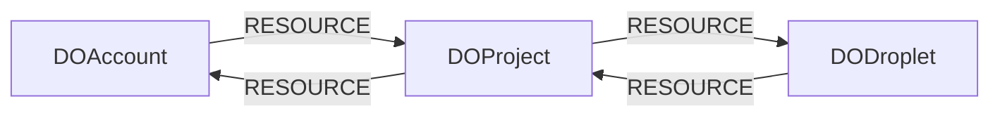

<!-- Generated from the data model. Do not edit manually. -->

## Digitalocean Schema

### DOAccount

A DigitalOcean account.

> **Ontology Mapping**: This node uses the ontology label [`Tenant`](#ontology-tenant).

#### Properties

Ontology-generated fields are shown in *italics*.

| Field | Index | Description |
|-------|-------|-------------|
| id | Yes | DigitalOcean account UUID. |
| firstseen |  | Timestamp when a sync job first created this node. |
| lastupdated | Yes | Timestamp of the last sync that observed this node. |
| droplet_limit |  | Maximum number of Droplets allowed. |
| floating_ip_limit |  | Maximum number of floating IPs allowed. |
| status |  | Account status. |
| uuid |  | DigitalOcean account UUID. |
| *_ont_name* | Yes | Normalized field sourced from `uuid`. |
| *_ont_source* |  | Module that populated this node's ontology fields. |
| *_ont_status* | Yes | Normalized field sourced from `status`. |

#### Relationships

- `(:DOProject)-[:RESOURCE]->(:DOAccount)`: Deprecated compatibility edge linking a project to its account.

- `(:DOAccount)-[:RESOURCE]->(:DOProject)`: The account contains the project.

### DODroplet

A compute instance in a DigitalOcean project.

> **Ontology Mapping**: This node uses the ontology label [`ComputeInstance`](#ontology-computeinstance).

#### Properties

Ontology-generated fields are shown in *italics*.

| Field | Index | Description |
|-------|-------|-------------|
| id | Yes | DigitalOcean Droplet ID. |
| firstseen |  | Timestamp when a sync job first created this node. |
| lastupdated | Yes | Timestamp of the last sync that observed this node. |
| account_id |  | ID of the owning account. |
| created_at |  | Droplet creation timestamp. |
| image |  | Base image slug. |
| ip_address |  | Public IPv4 address. |
| ip_v6_address |  | Public IPv6 address. |
| kernel |  | Current kernel information. |
| locked |  | Whether user actions are blocked. |
| name |  | Droplet name. |
| private_ip_address |  | Private IPv4 address. |
| project_id |  | ID of the containing project. |
| region |  | DigitalOcean region slug. |
| size |  | Droplet size slug. |
| status |  | Droplet lifecycle status. |
| tags |  | Tags assigned to the Droplet. |
| volumes |  | Attached block-storage volume IDs. |
| vpc_uuid |  | UUID of the Droplet's VPC. |
| *_ont_created_at* | Yes | Normalized field sourced from `created_at`. |
| *_ont_name* | Yes | Normalized field sourced from `name`. |
| *_ont_private_ip_address* | Yes | Normalized field sourced from `private_ip_address`. |
| *_ont_public_ip_address* | Yes | Normalized field sourced from `ip_address`. |
| *_ont_region* | Yes | Normalized field sourced from `region`. |
| *_ont_source* |  | Module that populated this node's ontology fields. |
| *_ont_state* | Yes | Normalized field sourced from `status`. |
| *_ont_type* | Yes | Normalized field sourced from `size`. |

#### Relationships

- `(:PublicIP)-[:POINTS_TO]->(:DODroplet)`

- `(:DOProject)-[:RESOURCE]->(:DODroplet)`: The project contains the Droplet.

- `(:DODroplet)-[:RESOURCE]->(:DOProject)`: Deprecated compatibility edge linking a Droplet to its project.

### DOProject

A project in a DigitalOcean account.

> **Ontology Mapping**: This node uses the ontology label [`Tenant`](#ontology-tenant).

#### Properties

Ontology-generated fields are shown in *italics*.

| Field | Index | Description |
|-------|-------|-------------|
| id | Yes | DigitalOcean project UUID. |
| firstseen |  | Timestamp when a sync job first created this node. |
| lastupdated | Yes | Timestamp of the last sync that observed this node. |
| account_id |  | ID of the account that owns the project. |
| created_at |  | Project creation timestamp. |
| description |  | Project description. |
| environment |  | Environment classification of project resources. |
| is_default |  | Whether unspecified resources default to this project. |
| name |  | Project name. |
| owner_uuid |  | UUID of the project owner. |
| updated_at |  | Project update timestamp. |
| *_ont_name* | Yes | Normalized field sourced from `name`. |
| *_ont_source* |  | Module that populated this node's ontology fields. |

#### Relationships

- `(:DOAccount)-[:RESOURCE]->(:DOProject)`: The account contains the project.

- `(:DOProject)-[:RESOURCE]->(:DOAccount)`: Deprecated compatibility edge linking a project to its account.

- `(:DODroplet)-[:RESOURCE]->(:DOProject)`: Deprecated compatibility edge linking a Droplet to its project.

- `(:DOProject)-[:RESOURCE]->(:DODroplet)`: The project contains the Droplet.
