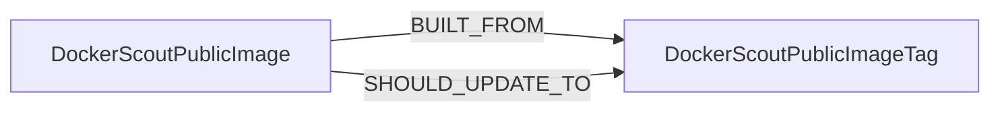

<!-- Generated from the data model. Do not edit manually. -->

## Docker Scout Schema

### DockerScoutPublicImage

The current public base image identified by a Docker Scout report.

#### Properties

| Field | Index | Description |
|-------|-------|-------------|
| id | Yes | Unique identifier for the public image in `name:tag` format. |
| firstseen |  | Timestamp when a sync job first created this node. |
| lastupdated | Yes | Timestamp of the last sync that observed this node. |
| alternative_tags |  | Alternative tags reported for the current public image. |
| digest |  | Digest of the current public image. |
| name |  | Name of the public image. |
| tag |  | Tag of the public image. |
| version |  | Runtime version reported by Docker Scout when available. |

#### Relationships

- `(:DockerScoutPublicImage)-[:BUILT_FROM]->(:DockerScoutPublicImageTag)`: Links a Docker Scout public image to its current public image tag.

- `(:Image)-[:BUILT_ON]->(:DockerScoutPublicImage)`: Links an Image to its Docker Scout public base image by resolved digest.

- `(:DockerScoutPublicImage)-[:SHOULD_UPDATE_TO]->(:DockerScoutPublicImageTag)`: Recommends a public image tag as an update for a Docker Scout image.
  - Properties:

    | Field | Description |
    |-------|-------------|
    | benefits | Recommendation benefits reported as a bullet list. |
    | fix_critical | Number of critical vulnerabilities fixed by the update. |
    | fix_high | Number of high-severity vulnerabilities fixed by the update. |
    | fix_low | Number of low-severity vulnerabilities fixed by the update. |
    | fix_medium | Number of medium-severity vulnerabilities fixed by the update. |

### DockerScoutPublicImageTag

A current or recommended base image tag from Docker Scout.

#### Properties

| Field | Index | Description |
|-------|-------|-------------|
| id | Yes | Unique identifier for the public image tag in `name:tag` format. |
| firstseen |  | Timestamp when a sync job first created this node. |
| lastupdated | Yes | Timestamp of the last sync that observed this node. |
| alternative_tags |  | Alternative tags suggested by Docker Scout. |
| flavor |  | Flavor of the public image. |
| is_slim |  | Whether the public image tag is a slim variant. |
| name |  | Name of the public image. |
| os |  | Operating system family inferred from the report. |
| runtime |  | Runtime version reported by Docker Scout. |
| size |  | Size of the public image. |
| tag |  | Tag of the public image. |

#### Relationships

- `(:DockerScoutPublicImage)-[:BUILT_FROM]->(:DockerScoutPublicImageTag)`: Links a Docker Scout public image to its current public image tag.

- `(:DockerScoutPublicImage)-[:SHOULD_UPDATE_TO]->(:DockerScoutPublicImageTag)`: Recommends a public image tag as an update for a Docker Scout image.
  - Properties:

    | Field | Description |
    |-------|-------------|
    | benefits | Recommendation benefits reported as a bullet list. |
    | fix_critical | Number of critical vulnerabilities fixed by the update. |
    | fix_high | Number of high-severity vulnerabilities fixed by the update. |
    | fix_low | Number of low-severity vulnerabilities fixed by the update. |
    | fix_medium | Number of medium-severity vulnerabilities fixed by the update. |
