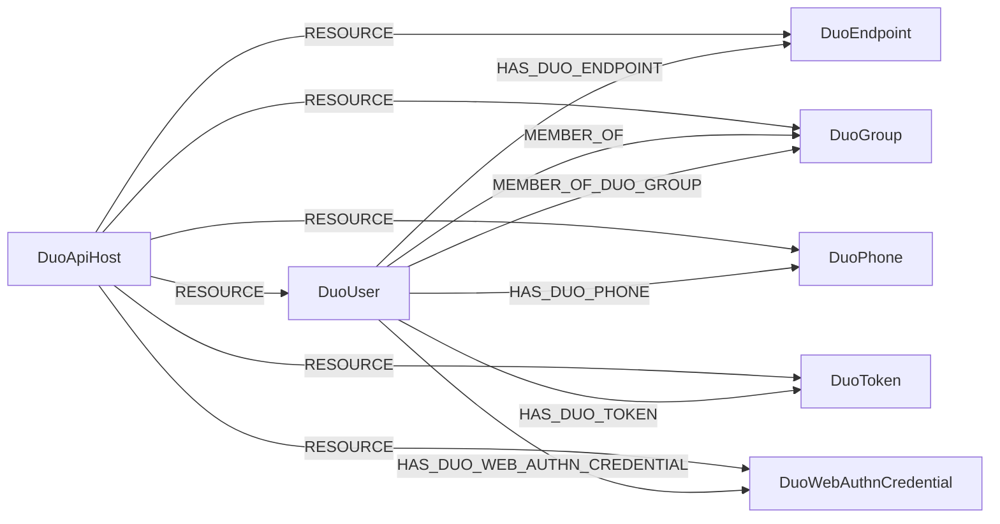

<!-- Generated from the data model. Do not edit manually. -->

## Duo Schema

### DuoApiHost

A Duo API host that contains resources for a Duo tenant.

> **Ontology Mapping**: This node uses the ontology label [`Tenant`](#ontology-tenant).

#### Properties

| Field | Index | Description |
|-------|-------|-------------|
| id | Yes | Duo API hostname. |
| firstseen |  | Timestamp when a sync job first created this node. |
| lastupdated | Yes | Timestamp of the last sync that observed this node. |

#### Relationships

- `(:DuoApiHost)-[:RESOURCE]->(:DuoEndpoint)`: The Duo API host contains the endpoint.

- `(:DuoApiHost)-[:RESOURCE]->(:DuoGroup)`: The Duo API host contains the group.

- `(:DuoApiHost)-[:RESOURCE]->(:DuoPhone)`: The Duo API host contains the phone.

- `(:DuoApiHost)-[:RESOURCE]->(:DuoToken)`: The Duo API host contains the hardware token.

- `(:DuoApiHost)-[:RESOURCE]->(:DuoUser)`: The Duo API host contains the user.

- `(:DuoApiHost)-[:RESOURCE]->(:DuoWebAuthnCredential)`: The Duo API host contains the WebAuthn credential.

### DuoEndpoint

An endpoint observed by Duo.

#### Properties

| Field | Index | Description |
|-------|-------|-------------|
| id | Yes | Duo endpoint key. |
| firstseen |  | Timestamp when a sync job first created this node. |
| lastupdated | Yes | Timestamp of the last sync that observed this node. |
| browsers |  | Detected browser information. |
| computer_sid |  | Windows machine security identifier. |
| cpu_id |  | Windows CPU ID. |
| device_id |  | Device identifier assigned by Duo. |
| device_identifier |  | Deprecated unique device attribute value. |
| device_identifier_type |  | Deprecated device attribute used to identify the endpoint. |
| device_name | Yes | Endpoint hostname. |
| device_udid |  | Managed iOS unique device identifier. |
| device_username |  | Associated management-system username. |
| device_username_type |  | Management-system attribute used to identify the user. |
| disk_encryption_status |  | Detected disk encryption status. |
| domain_sid |  | Active Directory domain security identifier. |
| email | Yes | Associated user email address. |
| epkey | Yes | Duo endpoint key. |
| firewall_status |  | Detected local firewall status. |
| hardware_uuid |  | Mac hardware UUID. |
| health_app_client_version |  | Duo Device Health app version. |
| health_data_last_collected |  | Timestamp of the last device health check. |
| last_updated |  | Timestamp when the endpoint last accessed Duo. |
| machine_guid |  | Windows machine GUID. |
| model |  | Endpoint device model. |
| os_build |  | Operating system build number. |
| os_family |  | Operating system platform. |
| os_version |  | Operating system version. |
| password_status |  | Detected local administrator password status. |
| security_agents |  | Detected security agent information. |
| trusted_endpoint |  | Whether Duo manages the endpoint. |
| type |  | Endpoint device class. |
| username | Yes | Associated Duo username. |

#### Relationships

- `(:DuoUser)-[:HAS_DUO_ENDPOINT]->(:DuoEndpoint)`: The Duo user has the endpoint, matched by email address.

- `(:Device)-[:OBSERVED_AS]->(:DuoEndpoint)`

- `(:DuoApiHost)-[:RESOURCE]->(:DuoEndpoint)`: The Duo API host contains the endpoint.

### DuoGroup

A user group in Duo.

> **Ontology Mapping**: This node uses the ontology label [`UserGroup`](#ontology-usergroup).

#### Properties

Ontology-generated fields are shown in *italics*.

| Field | Index | Description |
|-------|-------|-------------|
| id | Yes | Duo group ID. |
| firstseen |  | Timestamp when a sync job first created this node. |
| lastupdated | Yes | Timestamp of the last sync that observed this node. |
| desc |  | Group description. |
| group_id | Yes | Duo group ID. |
| mobile_otp_enabled |  | Legacy mobile OTP setting, which is always false. |
| name | Yes | Group name. |
| push_enabled |  | Legacy push setting, which is always false. |
| sms_enabled |  | Legacy SMS setting, which is always false. |
| status |  | Group authentication status. |
| voice_enabled |  | Legacy voice setting, which is always false. |
| *_ont_description* |  | Normalized field sourced from `desc`. |
| *_ont_name* | Yes | Normalized field sourced from `name`. |
| *_ont_source* |  | Module that populated this node's ontology fields. |

#### Relationships

- `(:DuoUser)-[:MEMBER_OF]->(:DuoGroup)`: The Duo user account is a member of the Duo user group.

- `(:DuoUser)-[:MEMBER_OF_DUO_GROUP]->(:DuoGroup)`: Deprecated compatibility edge linking a Duo user to a Duo group.

- `(:DuoApiHost)-[:RESOURCE]->(:DuoGroup)`: The Duo API host contains the group.

### DuoPhone

A phone registered in Duo.

#### Properties

| Field | Index | Description |
|-------|-------|-------------|
| id | Yes | Duo phone ID. |
| firstseen |  | Timestamp when a sync job first created this node. |
| lastupdated | Yes | Timestamp of the last sync that observed this node. |
| activated |  | Whether Duo Mobile is activated. |
| capabilities |  | Authentication factors supported by the phone. |
| encrypted |  | Device file-system encryption status. |
| extension |  | Telephone extension. |
| fingerprint |  | Biometric verification status. |
| last_seen |  | Timestamp of the last Duo Mobile contact. |
| model |  | Phone model. |
| name | Yes | Phone label. |
| phone_id |  | Duo phone ID. |
| platform |  | Phone platform. |
| postdelay |  | Delay before speaking the prompt. |
| predelay |  | Delay before dialing the extension. |
| screenlock |  | Device screen-lock status. |
| sms_passcodes_sent |  | Whether SMS passcodes were sent. |
| tampered |  | Device jailbreak or root status. |
| type |  | Phone type. |

#### Relationships

- `(:DuoUser)-[:HAS_DUO_PHONE]->(:DuoPhone)`: The Duo user has the phone.

- `(:Device)-[:OBSERVED_AS]->(:DuoPhone)`

- `(:DuoApiHost)-[:RESOURCE]->(:DuoPhone)`: The Duo API host contains the phone.

### DuoToken

A hardware token registered in Duo.

#### Properties

| Field | Index | Description |
|-------|-------|-------------|
| id | Yes | Duo hardware token ID. |
| firstseen |  | Timestamp when a sync job first created this node. |
| lastupdated | Yes | Timestamp of the last sync that observed this node. |
| admins |  | Administrators associated with the hardware token. |
| serial | Yes | Hardware token serial number. |
| token_id | Yes | Duo hardware token ID. |
| totp_step |  | TOTP step value, which is null for supported tokens. |
| type |  | Hardware token type. |

#### Relationships

- `(:DuoUser)-[:HAS_DUO_TOKEN]->(:DuoToken)`: The Duo user has the hardware token.

- `(:DuoApiHost)-[:RESOURCE]->(:DuoToken)`: The Duo API host contains the hardware token.

### DuoUser

A user account in Duo.

> **Ontology Mapping**: This node uses the ontology label [`UserAccount`](#ontology-useraccount).

#### Properties

Ontology-generated fields are shown in *italics*.

| Field | Index | Description |
|-------|-------|-------------|
| id | Yes | Duo user ID. |
| firstseen |  | Timestamp when a sync job first created this node. |
| lastupdated | Yes | Timestamp of the last sync that observed this node. |
| alias1 |  | First username alias. |
| alias2 |  | Second username alias. |
| alias3 |  | Third username alias. |
| alias4 |  | Fourth username alias. |
| aliases |  | Map of username aliases. |
| created |  | User creation timestamp. |
| desktoptokens |  | Desktop tokens available to the user. |
| email | Yes | User email address. |
| firstname |  | User given name. |
| is_enrolled |  | Whether the user has an authentication method. |
| last_directory_sync |  | Timestamp of the last directory sync. |
| last_login |  | Timestamp of the last login. |
| lastname |  | User surname. |
| notes |  | Administrative user notes. |
| realname |  | User full name. |
| status |  | User status. |
| u2ftokens |  | U2F tokens available to the user. |
| user_id | Yes | Duo user ID. |
| username | Yes | Duo username. |
| *_ont_active* | Yes | Normalized field sourced from `status`. |
| *_ont_email* | Yes | Normalized field sourced from `email`. |
| *_ont_firstname* | Yes | Normalized field sourced from `firstname`. |
| *_ont_fullname* | Yes | Normalized field sourced from `realname`. |
| *_ont_lastactivity* | Yes | Normalized field sourced from `last_login`. |
| *_ont_lastname* | Yes | Normalized field sourced from `lastname`. |
| *_ont_source* |  | Module that populated this node's ontology fields. |
| *_ont_username* | Yes | Normalized field sourced from `username`. |

#### Relationships

- `(:User)-[:HAS_ACCOUNT]->(:DuoUser)`

- `(:DuoUser)-[:HAS_DUO_ENDPOINT]->(:DuoEndpoint)`: The Duo user has the endpoint, matched by email address.

- `(:DuoUser)-[:HAS_DUO_PHONE]->(:DuoPhone)`: The Duo user has the phone.

- `(:DuoUser)-[:HAS_DUO_TOKEN]->(:DuoToken)`: The Duo user has the hardware token.

- `(:DuoUser)-[:HAS_DUO_WEB_AUTHN_CREDENTIAL]->(:DuoWebAuthnCredential)`: The Duo user has the WebAuthn credential.

- `(:Human)-[:IDENTITY_DUO]->(:DuoUser)`: A Human has the Duo user as an identity, matched by email address.

- `(:DuoUser)-[:MEMBER_OF]->(:DuoGroup)`: The Duo user account is a member of the Duo user group.

- `(:DuoUser)-[:MEMBER_OF_DUO_GROUP]->(:DuoGroup)`: Deprecated compatibility edge linking a Duo user to a Duo group.

- `(:DuoApiHost)-[:RESOURCE]->(:DuoUser)`: The Duo API host contains the user.

### DuoWebAuthnCredential

A WebAuthn credential registered in Duo.

#### Properties

| Field | Index | Description |
|-------|-------|-------------|
| id | Yes | WebAuthn credential registration ID. |
| firstseen |  | Timestamp when a sync job first created this node. |
| lastupdated | Yes | Timestamp of the last sync that observed this node. |
| admin |  | Administrator associated with the credential. |
| credential_name | Yes | WebAuthn credential label. |
| date_added |  | Credential registration date. |
| label |  | WebAuthn credential type. |
| webauthnkey | Yes | WebAuthn credential registration ID. |

#### Relationships

- `(:DuoUser)-[:HAS_DUO_WEB_AUTHN_CREDENTIAL]->(:DuoWebAuthnCredential)`: The Duo user has the WebAuthn credential.

- `(:DuoApiHost)-[:RESOURCE]->(:DuoWebAuthnCredential)`: The Duo API host contains the WebAuthn credential.
