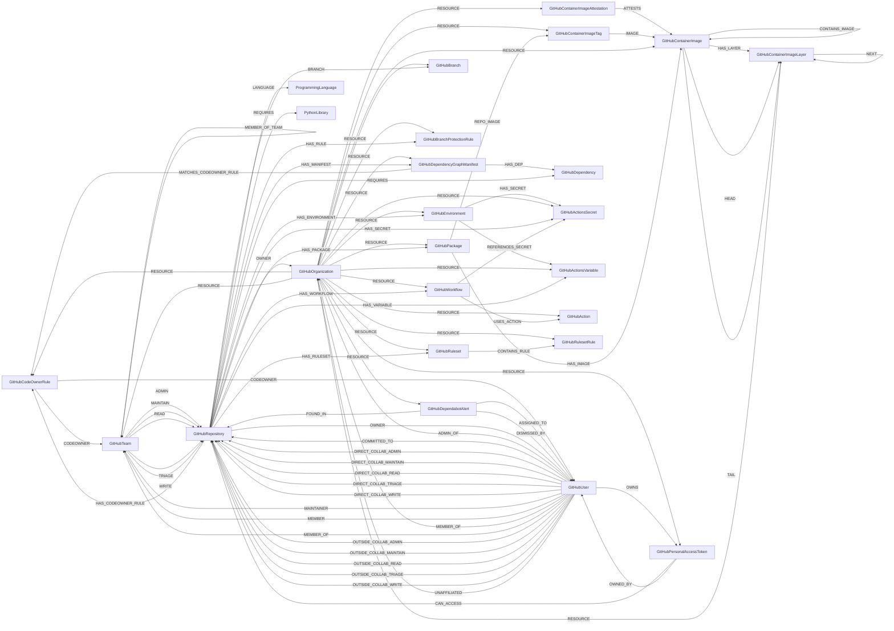

<!-- Generated from the data model. Do not edit manually. -->

## Github Schema

### GitHubAction

Schema for GitHub Actions used in workflows.

Uses GitHubOrganization as the sub-resource for cleanup scoping.
The relationship to GitHubWorkflow is in other_relationships.

#### Properties

| Field | Index | Description |
|-------|-------|-------------|
| id | Yes | Organization-scoped identifier derived from the raw `uses` reference. |
| firstseen |  | Timestamp when a sync job first created this node. |
| lastupdated | Yes | Timestamp of the last sync that observed this node. |
| full_name |  | Action repository name in `owner/name` form. |
| is_local | Yes | Whether the workflow references a repository-local action. |
| is_pinned | Yes | Whether the action is pinned to a full commit SHA. |
| name | Yes | Action name or local action path. |
| owner | Yes | Owner of the referenced action repository, when applicable. |
| version |  | Tag, branch, or commit reference used by the workflow. |

#### Relationships

- `(:ZizmorFinding)-[:AFFECTS]->(:GitHubAction)`: Links a zizmor finding to the action it concerns.

Only findings whose location is a `uses` key resolve to an action, so this
relationship is absent for findings reported against a `run` block, a job's
permissions, or a workflow trigger.

- `(:GitHubOrganization)-[:RESOURCE]->(:GitHubAction)`: Sub-resource relationship from action to organization.

This uses org as the sub-resource so that cleanup is scoped to the organization.

- `(:GitHubWorkflow)-[:USES_ACTION]->(:GitHubAction)`: Relationship from action to the workflow that uses it.

### GitHubActionsSecret

A GitHub Actions secret at organization, repository, or environment scope.

GitHub exposes metadata but never the secret value.

> **Ontology Mapping**: This node uses the ontology label [`Secret`](#ontology-secret).

#### Properties

Ontology-generated fields are shown in *italics*.

| Field | Index | Description |
|-------|-------|-------------|
| id | Yes | Scope-qualified GitHub Actions secret identifier. |
| firstseen |  | Timestamp when a sync job first created this node. |
| lastupdated | Yes | Timestamp of the last sync that observed this node. |
| created_at |  | Timestamp when the secret metadata was created. |
| level |  | Secret scope: `organization`, `repository`, or `environment`. |
| name | Yes | Secret name. |
| updated_at |  | Timestamp when the secret metadata was last updated. |
| visibility |  | Organization secret visibility: `all`, `private`, or `selected`. |
| *_ont_created_at* | Yes | Normalized field sourced from `created_at`. |
| *_ont_name* | Yes | Normalized field sourced from `name`. |
| *_ont_source* |  | Module that populated this node's ontology fields. |
| *_ont_updated_at* | Yes | Normalized field sourced from `updated_at`. |

#### Relationships

- `(:GitHubEnvironment)-[:HAS_SECRET]->(:GitHubActionsSecret)`: Relationship from environment-level secret to its environment.

- `(:GitHubRepository)-[:HAS_SECRET]->(:GitHubActionsSecret)`: Links a GitHub repository to an Actions secret.

- `(:GitHubWorkflow)-[:REFERENCES_SECRET]->(:GitHubActionsSecret)`: Links a GitHub workflow to the secrets it references.

- `(:GitHubOrganization)-[:RESOURCE]->(:GitHubActionsSecret)`: Scopes a GitHub resource to its organization.

### GitHubActionsVariable

A plaintext GitHub Actions variable at organization, repository, or environment scope.

#### Properties

| Field | Index | Description |
|-------|-------|-------------|
| id | Yes | Scope-qualified GitHub Actions variable identifier. |
| firstseen |  | Timestamp when a sync job first created this node. |
| lastupdated | Yes | Timestamp of the last sync that observed this node. |
| created_at |  | Timestamp when the variable was created. |
| level |  | Variable scope: `organization`, `repository`, or `environment`. |
| name | Yes | Variable name. |
| updated_at |  | Timestamp when the variable was last updated. |
| value |  | Plaintext variable value returned by GitHub. |
| visibility |  | Organization variable visibility: `all`, `private`, or `selected`. |

#### Relationships

- `(:GitHubEnvironment)-[:HAS_VARIABLE]->(:GitHubActionsVariable)`: Relationship from environment-level variable to its environment.

- `(:GitHubRepository)-[:HAS_VARIABLE]->(:GitHubActionsVariable)`: Links a GitHub repository to an Actions variable.

- `(:GitHubOrganization)-[:RESOURCE]->(:GitHubActionsVariable)`: Scopes a GitHub resource to its organization.

### GitHubBranch

A branch in a GitHub repository.

#### Properties

| Field | Index | Description |
|-------|-------|-------------|
| id | Yes | Repository-qualified GitHub branch identifier. |
| firstseen |  | Timestamp when a sync job first created this node. |
| lastupdated | Yes | Timestamp of the last sync that observed this node. |
| name |  | Branch name. |

#### Relationships

- `(:GitHubRepository)-[:BRANCH]->(:GitHubBranch)`: Links a GitHub repository to one of its branches.

- `(:GitHubOrganization)-[:RESOURCE]->(:GitHubBranch)`: Scopes a GitHub resource to its organization.

### GitHubBranchProtectionRule

A branch protection rule configured for a GitHub repository.

#### Properties

| Field | Index | Description |
|-------|-------|-------------|
| id | Yes | GitHub branch protection rule ID. |
| firstseen |  | Timestamp when a sync job first created this node. |
| lastupdated | Yes | Timestamp of the last sync that observed this node. |
| allows_deletions |  | Whether matching branches can be deleted. |
| allows_force_pushes |  | Whether matching branches allow force pushes. |
| dismisses_stale_reviews |  | Whether new commits dismiss stale pull request reviews. |
| is_admin_enforced |  | Whether repository administrators must follow the rule. |
| pattern |  | Branch name pattern protected by the rule. |
| required_approving_review_count |  | Number of approving reviews required. |
| requires_approving_reviews |  | Whether pull requests require approving reviews. |
| requires_code_owner_reviews |  | Whether pull requests require a code owner review. |
| requires_commit_signatures |  | Whether matching branches require signed commits. |
| requires_linear_history |  | Whether matching branches require linear history. |
| requires_status_checks |  | Whether required status checks must pass. |
| requires_strict_status_checks |  | Whether branches must be current before status checks pass. |
| restricts_pushes |  | Whether pushes are restricted to selected actors. |
| restricts_review_dismissals |  | Whether review dismissal is restricted to selected actors. |

#### Relationships

- `(:GitHubRepository)-[:HAS_RULE]->(:GitHubBranchProtectionRule)`: Relationship: (GitHubRepository)-[:HAS_RULE]->(GitHubBranchProtectionRule)
A repository can have multiple protection rules (for different branch patterns).

- `(:GitHubOrganization)-[:RESOURCE]->(:GitHubBranchProtectionRule)`: Sub-resource relationship: (GitHubOrganization)-[:RESOURCE]->(GitHubBranchProtectionRule).
Branch protection rules are scoped to the organization for cleanup purposes so
that a single GraphJob run cleans up rules from every repo in the org.

### GitHubCodeOwnerRule

A supported rule parsed from the effective CODEOWNERS file on a repository default branch.

#### Properties

| Field | Index | Description |
|-------|-------|-------------|
| id | Yes | Stable identifier derived from repository, source path, line, pattern, and owners. |
| firstseen |  | Timestamp when a sync job first created this node. |
| lastupdated | Yes | Timestamp of the last sync that observed this node. |
| default_branch |  | Default branch used to locate CODEOWNERS. |
| line_number |  | Line number in the CODEOWNERS file. |
| owner_emails |  | Email addresses parsed from owner tokens. |
| owner_logins |  | GitHub user logins parsed from `@user` owners. |
| owner_team_slugs |  | GitHub team slugs parsed from `@organization/team` owners. |
| owners |  | Raw owner tokens parsed from the CODEOWNERS rule. |
| pattern |  | Path pattern parsed from the CODEOWNERS rule. |
| repo_name |  | Name of the containing repository. |
| repo_url | Yes | URL of the containing repository. |
| source_path |  | Path of the effective CODEOWNERS file. |
| unresolved_owners |  | Owner tokens that could not be classified as users, teams, or emails. |

#### Relationships

- `(:GitHubCodeOwnerRule)-[:CODEOWNER]->(:GitHubTeam)`: Links a CODEOWNERS rule to a resolved GitHub team.

- `(:GitHubCodeOwnerRule)-[:CODEOWNER]->(:GitHubUser)`: Links a CODEOWNERS rule to a resolved GitHub user.

- `(:GitHubRepository)-[:HAS_CODEOWNER_RULE]->(:GitHubCodeOwnerRule)`: Defines the `HAS_CODEOWNER_RULE` relationship between GitHub resources.

- `(:GitHubDependencyGraphManifest)-[:MATCHES_CODEOWNER_RULE]->(:GitHubCodeOwnerRule)`: Links a dependency manifest path to its effective CODEOWNERS rule.
  - Properties:

    | Field | Description |
    |-------|-------------|
    | match_pattern | CODEOWNERS pattern that matched the path. |
    | matched_path | Repository-relative path matched by the CODEOWNERS rule. |

- `(:GitHubOrganization)-[:RESOURCE]->(:GitHubCodeOwnerRule)`: Scopes a GitHub resource to its organization.

### GitHubContainerImage

This node label is loaded by more than one sync path:

- A digest-addressed container image or manifest list stored in GitHub Container Registry.
- Build provenance attached to an image already present in the graph.

> **Conditional Labels**:
>
> - [`Image`](#ontology-image) (ontology label) when `type` equals `image`. A concrete single-platform container image.
> - [`ImageManifestList`](#ontology-imagemanifestlist) (ontology label) when `type` equals `manifest_list`. A cross-provider ImageManifestList resource in Cartography's ontology.

#### Properties

Ontology-generated fields are shown in *italics*.

| Field | Index | Description |
|-------|-------|-------------|
| id | Yes | Container image digest used as the stable identifier. |
| firstseen |  | Timestamp when a sync job first created this node. |
| lastupdated | Yes | Timestamp of the last sync that observed this node. |
| architecture |  | CPU architecture for a single-platform image. |
| child_image_digests |  | Platform image digests referenced by a manifest list. |
| digest | Yes | Container image manifest digest. |
| head_layer_diff_id |  | Uncompressed digest of the base layer. |
| layer_diff_ids |  | Ordered uncompressed layer digests for the image. |
| media_type |  | OCI or Docker manifest media type. |
| os |  | Operating system for a single-platform image. |
| parent_image_digest |  | Parent image digest resolved from provenance or image history. |
| parent_image_uri |  | Parent image URI derived from provenance or image history. |
| schema_version |  | Container manifest schema version. |
| source_file |  | Source definition file extracted from provenance. |
| source_revision |  | Source commit revision extracted from provenance. |
| source_uri | Yes | Normalized source repository URI extracted from provenance. |
| tail_layer_diff_id |  | Uncompressed digest of the topmost layer. |
| type | Yes | Image kind: `image` or `manifest_list`. |
| uri | Yes | Digest-qualified pullable image URI. |
| variant |  | Architecture variant for a single-platform image. |
| *_ont_architecture* | Yes | Normalized field sourced from `architecture`. |
| *_ont_digest* | Yes | Normalized field sourced from `digest`. |
| *_ont_os* | Yes | Normalized field sourced from `os`. |
| *_ont_source* |  | Module that populated this node's ontology fields. |
| *_ont_uri* | Yes | Normalized field sourced from `uri`. |
| *_ont_variant* | Yes | Normalized field sourced from `variant`. |

#### Relationships

- `(:GitHubContainerImageAttestation)-[:ATTESTS]->(:GitHubContainerImage)`: Links an attestation to the image digest it attests.

- `(:GitHubContainerImage)-[:BUILT_FROM]->(:GitHubContainerImage)`: Relationship from a GitHubContainerImage to its parent/base image.
  - Properties:

    | Field | Description |
    |-------|-------------|
    | confidence | Parent image match confidence from 0.0 (lowest) to 1.0 (highest). |
    | from_attestation | Whether the parent image match was derived from an attestation. |
    | parent_image_uri | Parent image URI. |

- `(:GitHubContainerImage)-[:CONTAINS_IMAGE]->(:GitHubContainerImage)`: Relationship from a manifest list to its platform-specific child images.
Only applies to images with type="manifest_list".

- `(:PackageVersion)-[:DEPLOYED]->(:GitHubContainerImage)`: A canonical package version is deployed on a container image.

- `(:AWSECSContainer)-[:HAS_IMAGE]->(:GitHubContainerImage)`: Matches containers to GitHub Container Registry images by runtime digest (imageDigest).

- `(:AWSLambda)-[:HAS_IMAGE]->(:GitHubContainerImage)`

- `(:AzureContainerInstance)-[:HAS_IMAGE]->(:GitHubContainerImage)`: An Azure container uses a GitHub container image with the same digest.

- `(:AzureFunctionApp)-[:HAS_IMAGE]->(:GitHubContainerImage)`: An Azure Function App uses a GitHub container image with the same digest.

- `(:GCPCloudRunJobContainer)-[:HAS_IMAGE]->(:GitHubContainerImage)`

- `(:GCPCloudRunServiceContainer)-[:HAS_IMAGE]->(:GitHubContainerImage)`

- `(:GitHubPackage)-[:HAS_IMAGE]->(:GitHubContainerImage)`: Links a container image to the package (registry repository) that hosts it.

- `(:KubernetesContainer)-[:HAS_IMAGE]->(:GitHubContainerImage)`: Links a container to the image it runs, hosted in GitHub Container Registry.

- `(:GitHubContainerImage)-[:HAS_LAYER]->(:GitHubContainerImageLayer)`: Relationship from an image to its constituent layers.
Only applies to single-image manifests (type="image").

- `(:ComputeService)-[:HAS_RUNTIME_IMAGE]->(:GitHubContainerImage)`: generated by analysis job `Workload HAS_RUNTIME_IMAGE inventory analysis`.
  - Properties:

    | Field | Description |
    |-------|-------------|
    | exposed_internet | Property generated by analysis job: `Workload HAS_RUNTIME_IMAGE inventory analysis`. |

- `(:GitHubContainerImage)-[:HEAD]->(:GitHubContainerImageLayer)`: Links a container image to its base layer.

- `(:GitHubContainerImageTag)-[:IMAGE]->(:GitHubContainerImage)`: Links a GitHub container image tag to the image it identifies.

- `(:GitHubContainerImage)-[:PACKAGED_BY]->(:GitHubWorkflow)`: Links an image to the GitHub workflow that packaged it.

- `(:GitHubContainerImage)-[:PACKAGED_FROM]->(:GitHubRepository)`: Links an image to the GitHub repository that produced it. MatchLink for CircleCI fallback matching: (Image)-[:PACKAGED_FROM]->(GitHubRepository).

Matches Image.digest to the specific image identified by the matcher, and
GitHubRepository.id to the (normalized) repo URL from the CircleCI run's vcs block.
Keyed on GitHubRepository.id (the canonical HTTPS URL) to stay consistent with the
existing GitHub provenance matcher.
  - Properties:

    | Field | Description |
    |-------|-------------|
    | command_similarity | Similarity score between image build commands and Dockerfile commands. |
    | confidence | Confidence score for the image-to-repository match. |
    | dockerfile_path | Path of the Dockerfile associated with the image. |
    | match_method | Method used to link the image to the repository. |
    | matched_commands | Number of image build commands matched to Dockerfile commands. |
    | total_commands | Command count used to normalize the Dockerfile comparison. |

- `(:Container)-[:RESOLVED_IMAGE]->(:GitHubContainerImage)`: generated by analysis job `Container RESOLVED_IMAGE analysis`.

- `(:Function)-[:RESOLVED_IMAGE]->(:GitHubContainerImage)`: generated by analysis job `Function RESOLVED_IMAGE analysis`.

- `(:GitHubOrganization)-[:RESOURCE]->(:GitHubContainerImage)`: Sub-resource relationship from GitHubContainerImage to GitHubOrganization.
Images are scoped to organizations for cleanup and to allow cross-package
deduplication.

- `(:GitHubContainerImage)-[:TAIL]->(:GitHubContainerImageLayer)`: Links a container image to its topmost layer.

### GitHubContainerImageAttestation

A SLSA provenance attestation for a GitHub Container Registry image.

#### Properties

| Field | Index | Description |
|-------|-------|-------------|
| id | Yes | Attestation ID returned by the GitHub Attestations API. |
| firstseen |  | Timestamp when a sync job first created this node. |
| lastupdated | Yes | Timestamp of the last sync that observed this node. |
| attests_digest | Yes | Container image digest attested by the statement. |
| bundle_id |  | Attestation bundle identifier. |
| predicate_type | Yes | In-toto predicate type URI. |
| source_file |  | Source definition file extracted from the predicate. |
| source_revision |  | Source commit revision extracted from the predicate. |
| source_uri |  | Normalized source repository URI extracted from the predicate. |

#### Relationships

- `(:GitHubContainerImageAttestation)-[:ATTESTS]->(:GitHubContainerImage)`: Links an attestation to the image digest it attests.

- `(:GitHubOrganization)-[:RESOURCE]->(:GitHubContainerImageAttestation)`: Scopes a GitHub resource to its organization.

### GitHubContainerImageLayer

An uncompressed container image layer identified by its diff ID.

> **Ontology Mapping**: This node uses the ontology label [`ImageLayer`](#ontology-imagelayer).

#### Properties

| Field | Index | Description |
|-------|-------|-------------|
| id | Yes | Uncompressed layer diff ID used as the stable identifier. |
| firstseen |  | Timestamp when a sync job first created this node. |
| lastupdated | Yes | Timestamp of the last sync that observed this node. |
| diff_id | Yes | Uncompressed layer content digest used for deduplication. |
| digest | Yes | Compressed layer digest from the image manifest. |
| history |  | Image configuration history entry for the layer. |
| is_empty |  | Whether the layer makes no filesystem changes. |
| media_type |  | OCI or Docker media type of the compressed layer. |
| size |  | Compressed layer size in bytes. |

#### Relationships

- `(:GitHubContainerImage)-[:HAS_LAYER]->(:GitHubContainerImageLayer)`: Relationship from an image to its constituent layers.
Only applies to single-image manifests (type="image").

- `(:GitHubContainerImage)-[:HEAD]->(:GitHubContainerImageLayer)`: Links a container image to its base layer.

- `(:GitHubContainerImageLayer)-[:NEXT]->(:GitHubContainerImageLayer)`: Linked-list ordering: each layer points to the next layer(s) it appears
immediately before in some image stack.

- `(:GitHubOrganization)-[:RESOURCE]->(:GitHubContainerImageLayer)`: Sub-resource relationship from GitHubContainerImageLayer to GitHubOrganization.

- `(:GitHubContainerImage)-[:TAIL]->(:GitHubContainerImageLayer)`: Links a container image to its topmost layer.

### GitHubContainerImageTag

A mutable GitHub Container Registry tag that resolves to an image digest.

> **Ontology Mapping**: This node uses the ontology label [`ImageTag`](#ontology-imagetag).

#### Properties

| Field | Index | Description |
|-------|-------|-------------|
| id | Yes | Fully qualified container image tag URI. |
| firstseen |  | Timestamp when a sync job first created this node. |
| lastupdated | Yes | Timestamp of the last sync that observed this node. |
| digest | Yes | Image digest currently referenced by the tag. |
| image_pushed_at |  | Timestamp when GitHub reports the image was pushed. |
| name | Yes | Container image tag name. |
| package_id |  | Identifier of the containing GitHub package. |
| uri | Yes | Fully qualified pullable tag URI. |

#### Relationships

- `(:GitHubContainerImageTag)-[:IMAGE]->(:GitHubContainerImage)`: Links a GitHub container image tag to the image it identifies.

- `(:GitHubPackage)-[:REPO_IMAGE]->(:GitHubContainerImageTag)`: Generic cross-registry edge from ContainerRegistry to ImageTag.

- `(:GitHubOrganization)-[:RESOURCE]->(:GitHubContainerImageTag)`: Scopes a GitHub resource to its organization.

### GitHubDependabotAlert

A GitHub Dependabot vulnerability alert for a repository dependency.

> **Ontology Mapping**: This node uses the ontology label [`SecurityIssue`](#ontology-securityissue).

> **Additional Labels**: This node also uses `Risk`.

> **Additional Label Definitions**:
>
> - `Risk`: A node participating in the shared Risk graph interface.

> **Conditional Labels**:
>
> - [`CVE`](#ontology-cve) (ontology label) when `has_cve` equals `true`. A cross-provider CVE resource in Cartography's ontology.

#### Properties

Ontology-generated fields are shown in *italics*.

| Field | Index | Description |
|-------|-------|-------------|
| id | Yes | Dependabot alert web URL used as the stable identifier. |
| firstseen |  | Timestamp when a sync job first created this node. |
| lastupdated | Yes | Timestamp of the last sync that observed this node. |
| advisory_cve_id | Yes | CVE identifier associated with the advisory, when available. |
| advisory_description |  | GitHub Security Advisory description. |
| advisory_ghsa_id | Yes | GitHub Security Advisory identifier. |
| advisory_published_at |  | Timestamp when the advisory was published. |
| advisory_summary |  | GitHub Security Advisory summary. |
| advisory_updated_at |  | Timestamp when the advisory was last updated. |
| advisory_withdrawn_at |  | Timestamp when the advisory was withdrawn, when applicable. |
| created_at |  | Timestamp when the alert was created. |
| cve_id | Yes | Standard CVE identifier mirrored from `advisory_cve_id`. |
| cvss_score |  | Primary CVSS score reported for the advisory. |
| cvss_v3_score |  | CVSS v3 score, when available. |
| cvss_v3_vector_string |  | CVSS v3 vector, when available. |
| cvss_v4_score |  | CVSS v4 score, when available. |
| cvss_v4_vector_string |  | CVSS v4 vector, when available. |
| cvss_vector_string |  | Primary CVSS vector reported for the advisory. |
| cwe_ids |  | CWE identifiers associated with the advisory. |
| dependency_manifest_path | Yes | Manifest path where GitHub found the dependency. |
| dependency_package_ecosystem | Yes | Package ecosystem of the vulnerable dependency. |
| dependency_package_name | Yes | Name of the vulnerable package. |
| dependency_scope |  | Dependency scope reported by GitHub. |
| dismissed_at |  | Timestamp when the alert was dismissed. |
| dismissed_comment |  | GitHub dismissal comment, when applicable. |
| dismissed_reason |  | GitHub dismissal reason, when applicable. |
| epss_percentage |  | EPSS probability reported by GitHub. |
| epss_percentile |  | EPSS percentile reported by GitHub. |
| first_patched_version |  | First patched package version, when known. |
| fixed_at |  | Timestamp when the alert was fixed. |
| has_cve |  | Whether the advisory includes a CVE identifier. |
| html_url |  | GitHub web URL for the alert. |
| identifiers |  | Advisory identifiers, including GHSA and CVE values. |
| number | Yes | Repository-local Dependabot alert number. |
| references |  | Reference URLs associated with the advisory. |
| repository_full_name |  | Affected repository name in `owner/name` form. |
| repository_name |  | Name of the affected repository. |
| repository_url | Yes | URL of the affected repository. |
| severity | Yes | Advisory severity. |
| state | Yes | Alert state: `open`, `fixed`, `dismissed`, or `auto_dismissed`. |
| updated_at |  | Timestamp when the alert was last updated. |
| url |  | GitHub REST API URL for the alert. |
| vulnerable_version_range |  | Affected package version range. |
| *_ont_base_score* | Yes | Normalized field sourced from `cvss_score`. |
| *_ont_base_severity* | Yes | Normalized field sourced from `severity`. |
| *_ont_cve_id* | Yes | Normalized field sourced from `cve_id`. |
| *_ont_description* |  | Normalized field sourced from `advisory_description`. |
| *_ont_last_modified_date* | Yes | Normalized field sourced from `advisory_updated_at`. |
| *_ont_problem_types* |  | Normalized field sourced from `cwe_ids`. |
| *_ont_published_date* | Yes | Normalized field sourced from `advisory_published_at`. |
| *_ont_references* |  | Normalized field sourced from `references`. |
| *_ont_source* |  | Module that populated this node's ontology fields. |
| *_ont_vector_string* | Yes | Normalized field sourced from `cvss_vector_string`. |

#### Relationships

- `(:GitHubDependabotAlert)-[:ASSIGNED_TO]->(:GitHubUser)`: Links a Dependabot alert to an assigned GitHub user.

- `(:GitHubDependabotAlert)-[:DISMISSED_BY]->(:GitHubUser)`: Links a Dependabot alert to the GitHub user who dismissed it.

- `(:GitHubDependabotAlert)-[:FOUND_IN]->(:GitHubRepository)`: Links a Dependabot alert to its GitHub repository.

- `(:GitHubOrganization)-[:RESOURCE]->(:GitHubDependabotAlert)`: Scopes a GitHub resource to its organization.

### GitHubDependency

A GitHub dependency is a globally shared package node: the same canonical
`name|requirements` is referenced by many repositories across many orgs, so
we cannot scope its node-level cleanup to a single tenant without risking
cross-tenant deletes (see PythonLibrary for the same pattern). Cleanup is
therefore unscoped and runs once per sync cycle from
`cleanup_global_resources`. The links to repositories (REQUIRES) and to
manifests (HAS_DEP) are modeled as `other_relationships`.

The primary label is `GitHubDependency` so that this module's unscoped
cleanup only ever reaps nodes it ingested itself. `Dependency` is the shared
ontology label carried by every dependency producer (Semgrep, SocketDev,
...); it must stay a secondary label here, otherwise github's cleanup would
delete other modules' `Dependency` nodes (see issue #3035).

> **Additional Labels**: This node also uses `Dependency`.

> **Additional Label Definitions**:
>
> - `Dependency`: A node participating in the shared Dependency graph interface.

> **Ontology Projection**: `GitHubDependency` contributes data to canonical [`PackageVersion`](#ontology-packageversion) nodes.

#### Properties

| Field | Index | Description |
|-------|-------|-------------|
| id | Yes | Canonical dependency name, optionally combined with its requirement string. |
| firstseen |  | Timestamp when a sync job first created this node. |
| lastupdated | Yes | Timestamp of the last sync that observed this node. |
| ecosystem |  | Normalized package ecosystem. |
| manifest_file |  | Name of the manifest that declares the dependency. |
| name |  | Ecosystem-normalized dependency name. |
| normalized_id | Yes | Normalized package identifier used for ontology matching. |
| original_name |  | Package name as reported by the GitHub dependency graph. |
| package_manager |  | Package manager reported by the GitHub dependency graph. |
| purl |  | Package URL returned by GitHub when available. |
| requirements |  | Original dependency requirement string. |
| source |  | Version source: `dependency_graph` for GitHub data or `lockfile` for lockfile fallback. |
| type |  | Package URL type when an exact version is known. |
| version |  | Exact package version when one can be resolved. |
| version_confidence |  | Derived version certainty: `exact`, `range`, or `unknown`. |

#### Relationships

- `(:PackageVersion)-[:DETECTED_AS]->(:GitHubDependency)`: A canonical package version was detected as a GitHub dependency.

- `(:GitHubDependencyGraphManifest)-[:HAS_DEP]->(:GitHubDependency)`: Links a dependency manifest to a dependency it declares.

- `(:GitHubRepository)-[:REQUIRES]->(:GitHubDependency)`: Links a GitHub repository to a software dependency it requires.
  - Properties:

    | Field | Description |
    |-------|-------------|
    | manifest_path | Path to the dependency manifest. |
    | requirements | Original dependency requirement string. |

### GitHubDependencyGraphManifest

A dependency manifest reported by the GitHub dependency graph.

> **Additional Labels**: This node also uses `DependencyGraphManifest`.

> **Additional Label Definitions**:
>
> - `DependencyGraphManifest`: Compatibility label for the deprecated `DependencyGraphManifest` github node label. Use `GitHubDependencyGraphManifest` instead. Scheduled for removal in v1.0.0.

#### Properties

| Field | Index | Description |
|-------|-------|-------------|
| id | Yes | Identifier composed from repository URL and manifest path. |
| firstseen |  | Timestamp when a sync job first created this node. |
| lastupdated | Yes | Timestamp of the last sync that observed this node. |
| blob_path |  | Manifest path returned by the GitHub dependency graph. |
| dependencies_count |  | Number of dependencies reported for the manifest. |
| filename |  | Manifest file name. |
| repo_relative_path | Yes | Normalized repository-relative manifest path. |
| repo_url |  | URL of the containing repository. |

#### Relationships

- `(:GitHubDependencyGraphManifest)-[:HAS_DEP]->(:GitHubDependency)`: Links a dependency manifest to a dependency it declares.

- `(:GitHubRepository)-[:HAS_MANIFEST]->(:GitHubDependencyGraphManifest)`: Defines the `HAS_MANIFEST` relationship between GitHub resources.

- `(:GitHubDependencyGraphManifest)-[:MATCHES_CODEOWNER_RULE]->(:GitHubCodeOwnerRule)`: Links a dependency manifest path to its effective CODEOWNERS rule.
  - Properties:

    | Field | Description |
    |-------|-------------|
    | match_pattern | CODEOWNERS pattern that matched the path. |
    | matched_path | Repository-relative path matched by the CODEOWNERS rule. |

- `(:GitHubOrganization)-[:RESOURCE]->(:GitHubDependencyGraphManifest)`: Sub-resource relationship: (GitHubOrganization)-[:RESOURCE]->(GitHubDependencyGraphManifest).
Manifests are scoped to the organization for cleanup purposes so that a single
GraphJob run cleans up manifests from every repo in the org.

### GitHubEnvironment

Schema for GitHub deployment environments.

Uses GitHubOrganization as the sub-resource for cleanup scoping.
The relationship to GitHubRepository is in other_relationships.

#### Properties

| Field | Index | Description |
|-------|-------|-------------|
| id | Yes | GitHub deployment environment ID. |
| firstseen |  | Timestamp when a sync job first created this node. |
| lastupdated | Yes | Timestamp of the last sync that observed this node. |
| created_at |  | Timestamp when the environment was created. |
| html_url |  | Web URL for the environment settings. |
| name | Yes | Deployment environment name. |
| updated_at |  | Timestamp when the environment was last updated. |

#### Relationships

- `(:GitHubRepository)-[:HAS_ENVIRONMENT]->(:GitHubEnvironment)`: Relationship from environment to its repository.

- `(:GitHubEnvironment)-[:HAS_SECRET]->(:GitHubActionsSecret)`: Relationship from environment-level secret to its environment.

- `(:GitHubEnvironment)-[:HAS_VARIABLE]->(:GitHubActionsVariable)`: Relationship from environment-level variable to its environment.

- `(:GitHubOrganization)-[:RESOURCE]->(:GitHubEnvironment)`: Sub-resource relationship from environment to organization.

This uses org as the sub-resource so that cleanup is scoped to the organization.

### GitHubOrganization

An organization in GitHub.

> **Ontology Mapping**: This node uses the ontology label [`Tenant`](#ontology-tenant).

#### Properties

Ontology-generated fields are shown in *italics*.

| Field | Index | Description |
|-------|-------|-------------|
| id | Yes | GitHub organization URL. |
| firstseen |  | Timestamp when a sync job first created this node. |
| lastupdated | Yes | Timestamp of the last sync that observed this node. |
| username | Yes | GitHub organization login. |
| *_ont_name* | Yes | Normalized field sourced from `username`. |
| *_ont_source* |  | Module that populated this node's ontology fields. |

#### Relationships

- `(:GitHubUser)-[:ADMIN_OF]->(:GitHubOrganization)`: Identifies a user as an administrator of a GitHub organization.

- `(:CircleCIOrganization)-[:ASSOCIATED_WITH]->(:GitHubOrganization)`: The CircleCI organization is associated with a matching GitHub organization.

- `(:GitHubUser)-[:MEMBER_OF]->(:GitHubOrganization)`: Links a GitHub user to an organization where the user is a member.

- `(:GitHubRepository)-[:OWNER]->(:GitHubOrganization)`: Links a GitHub repository to its owner.

- `(:GitHubOrganization)-[:RESOURCE]->(:GitHubAction)`: Sub-resource relationship from action to organization.

This uses org as the sub-resource so that cleanup is scoped to the organization.

- `(:GitHubOrganization)-[:RESOURCE]->(:GitHubActionsSecret)`: Scopes a GitHub resource to its organization.

- `(:GitHubOrganization)-[:RESOURCE]->(:GitHubActionsVariable)`: Scopes a GitHub resource to its organization.

- `(:GitHubOrganization)-[:RESOURCE]->(:GitHubBranch)`: Scopes a GitHub resource to its organization.

- `(:GitHubOrganization)-[:RESOURCE]->(:GitHubBranchProtectionRule)`: Sub-resource relationship: (GitHubOrganization)-[:RESOURCE]->(GitHubBranchProtectionRule).
Branch protection rules are scoped to the organization for cleanup purposes so
that a single GraphJob run cleans up rules from every repo in the org.

- `(:GitHubOrganization)-[:RESOURCE]->(:GitHubCodeOwnerRule)`: Scopes a GitHub resource to its organization.

- `(:GitHubOrganization)-[:RESOURCE]->(:GitHubContainerImage)`: Sub-resource relationship from GitHubContainerImage to GitHubOrganization.
Images are scoped to organizations for cleanup and to allow cross-package
deduplication.

- `(:GitHubOrganization)-[:RESOURCE]->(:GitHubContainerImageAttestation)`: Scopes a GitHub resource to its organization.

- `(:GitHubOrganization)-[:RESOURCE]->(:GitHubContainerImageLayer)`: Sub-resource relationship from GitHubContainerImageLayer to GitHubOrganization.

- `(:GitHubOrganization)-[:RESOURCE]->(:GitHubContainerImageTag)`: Scopes a GitHub resource to its organization.

- `(:GitHubOrganization)-[:RESOURCE]->(:GitHubDependabotAlert)`: Scopes a GitHub resource to its organization.

- `(:GitHubOrganization)-[:RESOURCE]->(:GitHubDependencyGraphManifest)`: Sub-resource relationship: (GitHubOrganization)-[:RESOURCE]->(GitHubDependencyGraphManifest).
Manifests are scoped to the organization for cleanup purposes so that a single
GraphJob run cleans up manifests from every repo in the org.

- `(:GitHubOrganization)-[:RESOURCE]->(:GitHubEnvironment)`: Sub-resource relationship from environment to organization.

This uses org as the sub-resource so that cleanup is scoped to the organization.

- `(:GitHubOrganization)-[:RESOURCE]->(:GitHubPackage)`: Sub-resource relationship from GitHubPackage to GitHubOrganization.

- `(:GitHubOrganization)-[:RESOURCE]->(:GitHubPersonalAccessToken)`: Scopes a GitHub resource to its organization.

- `(:GitHubOrganization)-[:RESOURCE]->(:GitHubRuleset)`: Relationship: (GitHubOrganization)-[:RESOURCE]->(GitHubRuleset)
Used for cleanup - rulesets belong to an organization.

- `(:GitHubOrganization)-[:RESOURCE]->(:GitHubRulesetRule)`: Relationship: (GitHubOrganization)-[:RESOURCE]->(GitHubRulesetRule)
Used for cleanup - ruleset rules belong to an organization.

- `(:GitHubOrganization)-[:RESOURCE]->(:GitHubTeam)`: Scopes a GitHub resource to its organization.

- `(:GitHubOrganization)-[:RESOURCE]->(:GitHubWorkflow)`: Sub-resource relationship from workflow to organization.

This uses org as the sub-resource so that cleanup is scoped to the organization.

- `(:GitHubUser)-[:UNAFFILIATED]->(:GitHubOrganization)`: Links an enterprise owner to an organization where the user is not a member.

### GitHubPackage

A container package hosted in GitHub Container Registry.

> **Ontology Mapping**: This node uses the ontology label [`ContainerRegistry`](#ontology-containerregistry).

#### Properties

| Field | Index | Description |
|-------|-------|-------------|
| id | Yes | GitHub package web URL. |
| firstseen |  | Timestamp when a sync job first created this node. |
| lastupdated | Yes | Timestamp of the last sync that observed this node. |
| created_at |  | Timestamp when the package was created. |
| html_url | Yes | GitHub web URL for the package. |
| name | Yes | GitHub package name. |
| package_type | Yes | Package type, normally `container` for GHCR. |
| updated_at |  | Timestamp when the package was last updated. |
| uri | Yes | Pullable package URI without a tag or digest. |
| visibility |  | Package visibility: `public` or `private`. |

#### Relationships

- `(:GitHubPackage)-[:HAS_IMAGE]->(:GitHubContainerImage)`: Links a container image to the package (registry repository) that hosts it.

- `(:GitHubRepository)-[:HAS_PACKAGE]->(:GitHubPackage)`: Links a package to the repository that owns it. Best-effort — not every
package payload has a `repository` field.

- `(:GitHubPackage)-[:REPO_IMAGE]->(:GitHubContainerImageTag)`: Generic cross-registry edge from ContainerRegistry to ImageTag.

- `(:GitHubOrganization)-[:RESOURCE]->(:GitHubPackage)`: Sub-resource relationship from GitHubPackage to GitHubOrganization.

### GitHubPersonalAccessToken

Metadata for a fine-grained or classic GitHub personal access token visible to an organization administrator.

> **Ontology Mapping**: This node uses the ontology label [`APIKey`](#ontology-apikey).

> **Conditional Labels**:
>
> - `GitHubClassicPersonalAccessToken` when `token_kind` equals `classic`. A github node participating in the shared GitHubClassicPersonalAccessToken graph interface.
> - `GitHubFineGrainedPersonalAccessToken` when `token_kind` equals `fine_grained`. A github node participating in the shared GitHubFineGrainedPersonalAccessToken graph interface.

#### Properties

Ontology-generated fields are shown in *italics*.

| Field | Index | Description |
|-------|-------|-------------|
| id | Yes | Stable identifier derived from the organization and access grant. |
| firstseen |  | Timestamp when a sync job first created this node. |
| lastupdated | Yes | Timestamp of the last sync that observed this node. |
| access_granted_at |  | Timestamp when fine-grained PAT access to the organization was granted. |
| credential_accessed_at |  | Timestamp of the latest classic PAT SAML authorization access event. |
| credential_authorized_at |  | Timestamp when a classic PAT was authorized for organization SAML SSO. |
| expires_at |  | Token or credential authorization expiration timestamp. |
| last_used_at |  | Timestamp when a fine-grained PAT last called the GitHub API. |
| owner_login | Yes | Login of the GitHub user who owns the token. |
| permissions |  | Fine-grained PAT permission details encoded as JSON. |
| repository_selection |  | Fine-grained PAT repository selection, such as `all` or `selected`. |
| scopes |  | OAuth scopes exposed for a classic PAT SAML authorization. |
| token_id | Yes | Fine-grained PAT token ID, when GitHub returns one. |
| token_kind | Yes | Token kind: `fine_grained` or `classic`. |
| token_name | Yes | Fine-grained PAT name, when available. |
| *_ont_created_at* | Yes | Normalized field sourced from `access_granted_at`. |
| *_ont_expires_at* | Yes | Normalized field sourced from `expires_at`. |
| *_ont_last_used_at* | Yes | Normalized field sourced from `last_used_at`. |
| *_ont_name* | Yes | Normalized field sourced from `token_name`. |
| *_ont_source* |  | Module that populated this node's ontology fields. |
| *_ont_type* | Yes | Normalized field sourced from `token_kind`. |

#### Relationships

- `(:GitHubPersonalAccessToken)-[:CAN_ACCESS]->(:GitHubRepository)`: Links a personal access token to a repository it can access.

- `(:GitHubPersonalAccessToken)-[:OWNED_BY]->(:GitHubUser)`: Links a GitHub personal access token to its owning user.

- `(:GitHubUser)-[:OWNS]->(:GitHubPersonalAccessToken)`: Deprecated compatibility edge from a GitHub user to a personal access token.

- `(:User)-[:OWNS]->(:GitHubPersonalAccessToken)`: generated by analysis job `Ontology - User OWNS APIKey linking`.

- `(:GitHubOrganization)-[:RESOURCE]->(:GitHubPersonalAccessToken)`: Scopes a GitHub resource to its organization.

### GitHubRepository

A source code repository hosted in GitHub.

> **Ontology Mapping**: This node uses the ontology label [`CodeRepository`](#ontology-coderepository).

#### Properties

Ontology-generated fields are shown in *italics*.

| Field | Index | Description |
|-------|-------|-------------|
| id | Yes | GitHub repository URL. |
| firstseen |  | Timestamp when a sync job first created this node. |
| lastupdated | Yes | Timestamp of the last sync that observed this node. |
| archived |  | Whether the repository is archived. |
| createdat |  | Timestamp when the repository was created. |
| defaultbranch |  | Default branch name. |
| defaultbranchid |  | GitHub node ID of the default branch. |
| description |  | Repository description. |
| disabled |  | Whether the repository is disabled. |
| fork |  | Whether the repository is a fork. |
| fullname |  | Repository name in `owner/name` form. |
| giturl | Yes | Repository `git://` clone URL. |
| homepage |  | Repository homepage URL. |
| locked |  | Whether the repository is locked. |
| name | Yes | Repository name. |
| parent |  | Web URL of the repository this repository was forked from. |
| primarylanguage |  | Primary programming language reported by GitHub. |
| private |  | Whether the repository is private. |
| sshurl | Yes | Repository SSH clone URL. |
| updatedat |  | Timestamp when the repository was last updated. |
| url | Yes | Repository web URL. |
| *_ont_archived* | Yes | Normalized field sourced from `archived`. |
| *_ont_default_branch* | Yes | Normalized field sourced from `defaultbranch`. |
| *_ont_description* |  | Normalized field sourced from `description`. |
| *_ont_fork* | Yes | Normalized field sourced from `fork`. |
| *_ont_fullname* | Yes | Normalized field sourced from `fullname`. |
| *_ont_name* | Yes | Normalized field sourced from `name`. |
| *_ont_public* | Yes | Normalized field sourced from `private`. |
| *_ont_source* |  | Module that populated this node's ontology fields. |
| *_ont_url* | Yes | Normalized field sourced from `url`. |

#### Relationships

- `(:GitHubTeam)-[:ADMIN]->(:GitHubRepository)`: Grants a GitHub team administrative access to a repository.

- `(:GitHubRepository)-[:ASSUMED_ROLE_WITH_WEB_IDENTITY]->(:AWSRole)`: MatchLink schema for ASSUMED_ROLE_WITH_WEB_IDENTITY relationships from GitHub Actions to AWS roles.
Creates relationships like: (GitHubRepository)-[:ASSUMED_ROLE_WITH_WEB_IDENTITY]->(AWSRole)

This MatchLink provides granular visibility into which specific GitHub repositories are assuming
AWS roles via GitHub Actions OIDC, rather than just showing provider-level relationships.
  - Properties:

    | Field | Description |
    |-------|-------------|
    | first_seen_in_time_window | Timestamp when this relationship was first observed in the current time window. |
    | last_used | Timestamp when this relationship was last observed in use. |
    | times_used | Number of times this relationship was observed in use. |

- `(:GitHubRepository)-[:BRANCH]->(:GitHubBranch)`: Links a GitHub repository to one of its branches.

- `(:CircleCIProject)-[:BUILDS]->(:GitHubRepository)`: The CircleCI project builds a matching GitHub repository.

- `(:GitHubPersonalAccessToken)-[:CAN_ACCESS]->(:GitHubRepository)`: Links a personal access token to a repository it can access.

- `(:GitHubUser)-[:COMMITTED_TO]->(:GitHubRepository)`: MatchLink schema for connecting GitHubUser nodes to GitHubRepository nodes
based on commits in the last 30 days.
  - Properties:

    | Field | Description |
    |-------|-------------|
    | commit_count | Number of commits observed in the last 30 days. |
    | first_commit_date | Timestamp of the earliest commit observed in the last 30 days. |
    | last_commit_date | Timestamp of the most recent commit observed in the last 30 days. |

- `(:NetlifySite)-[:DEPLOYED_FROM]->(:GitHubRepository)`: The GitHub repository the site builds from, joined on the repository's full name.
Best effort: the edge only exists if that repository has also been ingested.

- `(:RailwayServiceInstance)-[:DEPLOYED_FROM]->(:GitHubRepository)`: Identifies the GitHub repository used to deploy a Railway service instance.

- `(:AIBOMComponent)-[:DETECTED_IN]->(:GitHubRepository)`: Links a component occurrence to its scanned GitHub repository.

- `(:GitHubUser)-[:DIRECT_COLLAB_ADMIN]->(:GitHubRepository)`: Grants `ADMIN` permission on the repository to a collaborator with `DIRECT` affiliation.

- `(:GitHubUser)-[:DIRECT_COLLAB_MAINTAIN]->(:GitHubRepository)`: Grants `MAINTAIN` permission on the repository to a collaborator with `DIRECT` affiliation.

- `(:GitHubUser)-[:DIRECT_COLLAB_READ]->(:GitHubRepository)`: Grants `READ` permission on the repository to a collaborator with `DIRECT` affiliation.

- `(:GitHubUser)-[:DIRECT_COLLAB_TRIAGE]->(:GitHubRepository)`: Grants `TRIAGE` permission on the repository to a collaborator with `DIRECT` affiliation.

- `(:GitHubUser)-[:DIRECT_COLLAB_WRITE]->(:GitHubRepository)`: Grants `WRITE` permission on the repository to a collaborator with `DIRECT` affiliation.

- `(:GitHubDependabotAlert)-[:FOUND_IN]->(:GitHubRepository)`: Links a Dependabot alert to its GitHub repository.

- `(:SemgrepSASTFinding)-[:FOUND_IN]->(:GitHubRepository)`: Links a SAST finding to the GitHub repository containing the affected code.

- `(:SemgrepSCAFinding)-[:FOUND_IN]->(:GitHubRepository)`: Links an SCA finding to the GitHub repository containing the dependency.

- `(:SemgrepSecretsFinding)-[:FOUND_IN]->(:GitHubRepository)`: Links a secret finding to the GitHub repository containing the secret.

- `(:ZizmorFinding)-[:FOUND_IN]->(:GitHubRepository)`: Links a zizmor finding to the GitHub repository containing the audited file.

- `(:GitHubRepository)-[:HAS_CODEOWNER_RULE]->(:GitHubCodeOwnerRule)`: Defines the `HAS_CODEOWNER_RULE` relationship between GitHub resources.

- `(:GitHubRepository)-[:HAS_ENVIRONMENT]->(:GitHubEnvironment)`: Relationship from environment to its repository.

- `(:GitHubRepository)-[:HAS_MANIFEST]->(:GitHubDependencyGraphManifest)`: Defines the `HAS_MANIFEST` relationship between GitHub resources.

- `(:GitHubRepository)-[:HAS_PACKAGE]->(:GitHubPackage)`: Links a package to the repository that owns it. Best-effort — not every
package payload has a `repository` field.

- `(:GitHubRepository)-[:HAS_RULE]->(:GitHubBranchProtectionRule)`: Relationship: (GitHubRepository)-[:HAS_RULE]->(GitHubBranchProtectionRule)
A repository can have multiple protection rules (for different branch patterns).

- `(:GitHubRepository)-[:HAS_RULESET]->(:GitHubRuleset)`: Relationship: (GitHubRepository)-[:HAS_RULESET]->(GitHubRuleset)
A repository can have multiple rulesets.

- `(:GitHubRepository)-[:HAS_SECRET]->(:GitHubActionsSecret)`: Links a GitHub repository to an Actions secret.

- `(:GitHubRepository)-[:HAS_VARIABLE]->(:GitHubActionsVariable)`: Links a GitHub repository to an Actions variable.

- `(:GitHubRepository)-[:HAS_WORKFLOW]->(:GitHubWorkflow)`: Relationship from workflow to its repository.

- `(:GitHubRepository)-[:LANGUAGE]->(:ProgrammingLanguage)`: Links a GitHub repository to a programming language it uses.

- `(:GitHubTeam)-[:MAINTAIN]->(:GitHubRepository)`: Grants a GitHub team maintain access to a repository.

- `(:GitHubUser)-[:OUTSIDE_COLLAB_ADMIN]->(:GitHubRepository)`: Grants `ADMIN` permission on the repository to a collaborator with `OUTSIDE` affiliation.

- `(:GitHubUser)-[:OUTSIDE_COLLAB_MAINTAIN]->(:GitHubRepository)`: Grants `MAINTAIN` permission on the repository to a collaborator with `OUTSIDE` affiliation.

- `(:GitHubUser)-[:OUTSIDE_COLLAB_READ]->(:GitHubRepository)`: Grants `READ` permission on the repository to a collaborator with `OUTSIDE` affiliation.

- `(:GitHubUser)-[:OUTSIDE_COLLAB_TRIAGE]->(:GitHubRepository)`: Grants `TRIAGE` permission on the repository to a collaborator with `OUTSIDE` affiliation.

- `(:GitHubUser)-[:OUTSIDE_COLLAB_WRITE]->(:GitHubRepository)`: Grants `WRITE` permission on the repository to a collaborator with `OUTSIDE` affiliation.

- `(:GitHubRepository)-[:OWNER]->(:GitHubOrganization)`: Links a GitHub repository to its owner.

- `(:GitHubRepository)-[:OWNER]->(:GitHubUser)`: Links a GitHub repository to its owner.

- `(:Image)-[:PACKAGED_FROM]->(:GitHubRepository)`: Links an image to the GitHub repository that produced it. MatchLink for CircleCI fallback matching: (Image)-[:PACKAGED_FROM]->(GitHubRepository).

Matches Image.digest to the specific image identified by the matcher, and
GitHubRepository.id to the (normalized) repo URL from the CircleCI run's vcs block.
Keyed on GitHubRepository.id (the canonical HTTPS URL) to stay consistent with the
existing GitHub provenance matcher.
  - Properties:

    | Field | Description |
    |-------|-------------|
    | command_similarity | Similarity score between image build commands and Dockerfile commands. |
    | confidence | Confidence score for the image-to-repository match. |
    | dockerfile_path | Path of the Dockerfile associated with the image. |
    | match_method | Method used to link the image to the repository. |
    | matched_commands | Number of image build commands matched to Dockerfile commands. |
    | total_commands | Command count used to normalize the Dockerfile comparison. |

- `(:GitHubTeam)-[:READ]->(:GitHubRepository)`: Grants a GitHub team read access to a repository.

- `(:GitHubRepository)-[:REQUIRES]->(:GitHubDependency)`: Links a GitHub repository to a software dependency it requires.
  - Properties:

    | Field | Description |
    |-------|-------------|
    | manifest_path | Path to the dependency manifest. |
    | requirements | Original dependency requirement string. |

- `(:GitHubRepository)-[:REQUIRES]->(:PythonLibrary)`: Links a GitHub repository to a software dependency it requires.
  - Properties:

    | Field | Description |
    |-------|-------------|
    | specifier | Python version specifier from the requirements file. |

- `(:GitHubRepository)-[:REQUIRES]->(:SemgrepGoLibrary)`: Links a GitHub repository to a dependency it requires.
  - Properties:

    | Field | Description |
    |-------|-------------|
    | specifier | Version specifier required by the repository. |
    | transitivity | Whether the dependency is direct or transitive. |
    | url | URL of the manifest location declaring the dependency. |

- `(:GitHubRepository)-[:REQUIRES]->(:SemgrepNpmLibrary)`: Links a GitHub repository to a dependency it requires.
  - Properties:

    | Field | Description |
    |-------|-------------|
    | specifier | Version specifier required by the repository. |
    | transitivity | Whether the dependency is direct or transitive. |
    | url | URL of the manifest location declaring the dependency. |

- `(:AIBOMSource)-[:SCANNED_REPOSITORY]->(:GitHubRepository)`: Links an AIBOM source to the GitHub repository it scanned.

- `(:RailwayFilesystemSnapshot)-[:SNAPSHOT_OF]->(:GitHubRepository)`: Identifies the repository revision represented by a source snapshot.

- `(:DatabricksRepo)-[:SOURCED_FROM]->(:GitHubRepository)`: A Databricks repo is sourced from a GitHub repository.

- `(:RailwayDeploymentTrigger)-[:TRACKS]->(:GitHubRepository)`: Identifies the GitHub repository and branch watched by a deployment trigger.

- `(:GitHubTeam)-[:TRIAGE]->(:GitHubRepository)`: Grants a GitHub team triage access to a repository.

- `(:GitHubTeam)-[:WRITE]->(:GitHubRepository)`: Grants a GitHub team write access to a repository.

### GitHubRuleset

A repository ruleset configured in GitHub.

#### Properties

| Field | Index | Description |
|-------|-------|-------------|
| id | Yes | GitHub ruleset node ID. |
| firstseen |  | Timestamp when a sync job first created this node. |
| lastupdated | Yes | Timestamp of the last sync that observed this node. |
| conditions_organization_property_exclude |  | Organization property exclude conditions encoded as JSON. |
| conditions_organization_property_include |  | Organization property include conditions encoded as JSON. |
| conditions_ref_name_exclude |  | Ref name patterns excluded by the ruleset. |
| conditions_ref_name_include |  | Ref name patterns included by the ruleset. |
| conditions_repository_ids |  | Repository database IDs selected by the ruleset. |
| conditions_repository_name_exclude |  | Repository name patterns excluded by the ruleset. |
| conditions_repository_name_include |  | Repository name patterns included by the ruleset. |
| conditions_repository_name_protected |  | Whether repository-name conditions select protected repositories. |
| conditions_repository_property_exclude |  | Repository property exclude conditions encoded as JSON. |
| conditions_repository_property_include |  | Repository property include conditions encoded as JSON. |
| created_at |  | Timestamp when the ruleset was created. |
| database_id |  | GitHub numeric database ID for the ruleset. |
| enforcement |  | Ruleset enforcement mode. |
| name |  | Ruleset name. |
| target |  | Ruleset target, such as `BRANCH` or `TAG`. |
| updated_at |  | Timestamp when the ruleset was last updated. |

#### Relationships

- `(:GitHubRuleset)-[:CONTAINS_RULE]->(:GitHubRulesetRule)`: Relationship: (GitHubRuleset)-[:CONTAINS_RULE]->(GitHubRulesetRule)
A ruleset can have multiple rules.

- `(:GitHubRepository)-[:HAS_RULESET]->(:GitHubRuleset)`: Relationship: (GitHubRepository)-[:HAS_RULESET]->(GitHubRuleset)
A repository can have multiple rulesets.

- `(:GitHubOrganization)-[:RESOURCE]->(:GitHubRuleset)`: Relationship: (GitHubOrganization)-[:RESOURCE]->(GitHubRuleset)
Used for cleanup - rulesets belong to an organization.

### GitHubRulesetRule

A rule contained in a GitHub repository ruleset.

#### Properties

| Field | Index | Description |
|-------|-------|-------------|
| id | Yes | Deterministic identifier derived from the ruleset and rule. |
| firstseen |  | Timestamp when a sync job first created this node. |
| lastupdated | Yes | Timestamp of the last sync that observed this node. |
| parameters |  | Complete rule parameters encoded as JSON. |
| parameters_dismiss_stale_reviews_on_push |  | Whether pull request rules dismiss stale reviews after new pushes. |
| parameters_require_code_owner_review |  | Whether pull request rules require a code owner review. |
| parameters_required_approving_review_count |  | Required approval count extracted from pull request rule parameters. |
| parameters_required_status_checks |  | Required status check contexts extracted from the JSON-encoded rule parameters. |
| type |  | GitHub ruleset rule type. |

#### Relationships

- `(:GitHubRuleset)-[:CONTAINS_RULE]->(:GitHubRulesetRule)`: Relationship: (GitHubRuleset)-[:CONTAINS_RULE]->(GitHubRulesetRule)
A ruleset can have multiple rules.

- `(:GitHubOrganization)-[:RESOURCE]->(:GitHubRulesetRule)`: Relationship: (GitHubOrganization)-[:RESOURCE]->(GitHubRulesetRule)
Used for cleanup - ruleset rules belong to an organization.

### GitHubTeam

A team in a GitHub organization.

> **Ontology Mapping**: This node uses the ontology label [`UserGroup`](#ontology-usergroup).

#### Properties

Ontology-generated fields are shown in *italics*.

| Field | Index | Description |
|-------|-------|-------------|
| id | Yes | GitHub team URL. |
| firstseen |  | Timestamp when a sync job first created this node. |
| lastupdated | Yes | Timestamp of the last sync that observed this node. |
| description |  | GitHub team description. |
| name | Yes | GitHub team slug. |
| url |  | GitHub team URL. |
| *_ont_description* |  | Normalized field sourced from `description`. |
| *_ont_name* | Yes | Normalized field sourced from `name`. |
| *_ont_source* |  | Module that populated this node's ontology fields. |

#### Relationships

- `(:GitHubTeam)-[:ADMIN]->(:GitHubRepository)`: Grants a GitHub team administrative access to a repository.

- `(:GitHubCodeOwnerRule)-[:CODEOWNER]->(:GitHubTeam)`: Links a CODEOWNERS rule to a resolved GitHub team.

- `(:GitHubTeam)-[:MAINTAIN]->(:GitHubRepository)`: Grants a GitHub team maintain access to a repository.

- `(:GitHubUser)-[:MAINTAINER]->(:GitHubTeam)`: Identifies a GitHub user as a team maintainer.

- `(:GitHubUser)-[:MEMBER]->(:GitHubTeam)`: Defines the `MEMBER` relationship between GitHub resources.

- `(:GitHubTeam)-[:MEMBER_OF]->(:GitHubTeam)`: Links a GitHub user or child team to its parent organization or team.

- `(:GitHubUser)-[:MEMBER_OF]->(:GitHubTeam)`: Links a GitHub user or child team to its parent organization or team.

- `(:GitHubTeam)-[:MEMBER_OF_TEAM]->(:GitHubTeam)`: Defines the `MEMBER_OF_TEAM` relationship between GitHub resources.

- `(:GitHubTeam)-[:READ]->(:GitHubRepository)`: Grants a GitHub team read access to a repository.

- `(:GitHubOrganization)-[:RESOURCE]->(:GitHubTeam)`: Scopes a GitHub resource to its organization.

- `(:GitHubTeam)-[:TRIAGE]->(:GitHubRepository)`: Grants a GitHub team triage access to a repository.

- `(:GitHubTeam)-[:WRITE]->(:GitHubRepository)`: Grants a GitHub team write access to a repository.

### GitHubUser

A user account in GitHub.

> **Ontology Mapping**: This node uses the ontology label [`UserAccount`](#ontology-useraccount).

#### Properties

Ontology-generated fields are shown in *italics*.

| Field | Index | Description |
|-------|-------|-------------|
| id | Yes | GitHub user profile URL. |
| firstseen |  | Timestamp when a sync job first created this node. |
| lastupdated | Yes | Timestamp of the last sync that observed this node. |
| company |  | Public profile company. |
| email |  | Publicly visible profile email. |
| fullname |  | GitHub user display name. |
| has_2fa_enabled |  | Whether the organization member has two-factor authentication enabled. |
| is_enterprise_owner |  | Whether the user is a GitHub enterprise owner. |
| is_site_admin |  | Whether the user is a GitHub site administrator. |
| organization_verified_domain_emails |  | Email addresses verified against organization domains. |
| type |  | GitHub account type. |
| username | Yes | GitHub user login. |
| *_ont_email* | Yes | Normalized field sourced from `email`. |
| *_ont_fullname* | Yes | Normalized field sourced from `fullname`. |
| *_ont_has_mfa* | Yes | Normalized field sourced from `has_2fa_enabled`. |
| *_ont_source* |  | Module that populated this node's ontology fields. |
| *_ont_username* | Yes | Normalized field sourced from `username`. |

#### Relationships

- `(:GitHubUser)-[:ADMIN_OF]->(:GitHubOrganization)`: Identifies a user as an administrator of a GitHub organization.

- `(:GitHubDependabotAlert)-[:ASSIGNED_TO]->(:GitHubUser)`: Links a Dependabot alert to an assigned GitHub user.

- `(:GitHubCodeOwnerRule)-[:CODEOWNER]->(:GitHubUser)`: Links a CODEOWNERS rule to a resolved GitHub user.

- `(:GitHubUser)-[:COMMITTED_TO]->(:GitHubRepository)`: MatchLink schema for connecting GitHubUser nodes to GitHubRepository nodes
based on commits in the last 30 days.
  - Properties:

    | Field | Description |
    |-------|-------------|
    | commit_count | Number of commits observed in the last 30 days. |
    | first_commit_date | Timestamp of the earliest commit observed in the last 30 days. |
    | last_commit_date | Timestamp of the most recent commit observed in the last 30 days. |

- `(:GitHubUser)-[:DIRECT_COLLAB_ADMIN]->(:GitHubRepository)`: Grants `ADMIN` permission on the repository to a collaborator with `DIRECT` affiliation.

- `(:GitHubUser)-[:DIRECT_COLLAB_MAINTAIN]->(:GitHubRepository)`: Grants `MAINTAIN` permission on the repository to a collaborator with `DIRECT` affiliation.

- `(:GitHubUser)-[:DIRECT_COLLAB_READ]->(:GitHubRepository)`: Grants `READ` permission on the repository to a collaborator with `DIRECT` affiliation.

- `(:GitHubUser)-[:DIRECT_COLLAB_TRIAGE]->(:GitHubRepository)`: Grants `TRIAGE` permission on the repository to a collaborator with `DIRECT` affiliation.

- `(:GitHubUser)-[:DIRECT_COLLAB_WRITE]->(:GitHubRepository)`: Grants `WRITE` permission on the repository to a collaborator with `DIRECT` affiliation.

- `(:GitHubDependabotAlert)-[:DISMISSED_BY]->(:GitHubUser)`: Links a Dependabot alert to the GitHub user who dismissed it.

- `(:User)-[:HAS_ACCOUNT]->(:GitHubUser)`: generated by analysis job `Ontology - GitHubUser HAS_ACCOUNT User linking`.

- `(:GitHubUser)-[:MAINTAINER]->(:GitHubTeam)`: Identifies a GitHub user as a team maintainer.

- `(:GitHubUser)-[:MEMBER]->(:GitHubTeam)`: Defines the `MEMBER` relationship between GitHub resources.

- `(:GitHubUser)-[:MEMBER_OF]->(:GitHubOrganization)`: Links a GitHub user to an organization where the user is a member.

- `(:GitHubUser)-[:MEMBER_OF]->(:GitHubTeam)`: Links a GitHub user or child team to its parent organization or team.

- `(:GitHubUser)-[:OUTSIDE_COLLAB_ADMIN]->(:GitHubRepository)`: Grants `ADMIN` permission on the repository to a collaborator with `OUTSIDE` affiliation.

- `(:GitHubUser)-[:OUTSIDE_COLLAB_MAINTAIN]->(:GitHubRepository)`: Grants `MAINTAIN` permission on the repository to a collaborator with `OUTSIDE` affiliation.

- `(:GitHubUser)-[:OUTSIDE_COLLAB_READ]->(:GitHubRepository)`: Grants `READ` permission on the repository to a collaborator with `OUTSIDE` affiliation.

- `(:GitHubUser)-[:OUTSIDE_COLLAB_TRIAGE]->(:GitHubRepository)`: Grants `TRIAGE` permission on the repository to a collaborator with `OUTSIDE` affiliation.

- `(:GitHubUser)-[:OUTSIDE_COLLAB_WRITE]->(:GitHubRepository)`: Grants `WRITE` permission on the repository to a collaborator with `OUTSIDE` affiliation.

- `(:GitHubPersonalAccessToken)-[:OWNED_BY]->(:GitHubUser)`: Links a GitHub personal access token to its owning user.

- `(:GitHubRepository)-[:OWNER]->(:GitHubUser)`: Links a GitHub repository to its owner.

- `(:GitHubUser)-[:OWNS]->(:GitHubPersonalAccessToken)`: Deprecated compatibility edge from a GitHub user to a personal access token.

- `(:GitHubUser)-[:PUSHED]->(:SpaceliftGitCommit)`: A GitHub user pushed a Spacelift Git commit with a matching author login.

- `(:GitHubUser)-[:UNAFFILIATED]->(:GitHubOrganization)`: Links an enterprise owner to an organization where the user is not a member.

### GitHubWorkflow

Schema for GitHub Actions workflows.

Uses GitHubOrganization as the sub-resource for cleanup scoping.
The relationship to GitHubRepository is in other_relationships.

> **Ontology Mapping**: This node uses the ontology label [`CICDPipeline`](#ontology-cicdpipeline).

#### Properties

Ontology-generated fields are shown in *italics*.

| Field | Index | Description |
|-------|-------|-------------|
| id | Yes | GitHub workflow ID. |
| firstseen |  | Timestamp when a sync job first created this node. |
| lastupdated | Yes | Timestamp of the last sync that observed this node. |
| created_at |  | Timestamp when the resource was created. |
| env_vars |  | Top-level environment variable names parsed from workflow YAML. |
| has_reusable_workflow_calls |  | Whether parsed workflow YAML calls a reusable workflow. |
| job_count |  | Number of jobs parsed from workflow YAML. |
| name | Yes | Workflow name. |
| path | Yes | Repository-relative workflow file path. |
| permissions_actions |  | Actions permission level parsed from workflow YAML. |
| permissions_checks |  | Checks permission level parsed from workflow YAML. |
| permissions_contents |  | Contents permission level parsed from workflow YAML. |
| permissions_deployments |  | Deployments permission level parsed from workflow YAML. |
| permissions_id_token |  | ID token permission level parsed from workflow YAML. |
| permissions_issues |  | Issues permission level parsed from workflow YAML. |
| permissions_packages |  | Packages permission level parsed from workflow YAML. |
| permissions_pull_requests |  | Pull requests permission level parsed from workflow YAML. |
| permissions_security_events |  | Security events permission level parsed from workflow YAML. |
| permissions_statuses |  | Statuses permission level parsed from workflow YAML. |
| repo_url | Yes | URL of the containing repository. |
| state |  | Workflow state, such as `active`, `disabled_manually`, or `disabled_inactivity`. |
| trigger_events |  | Trigger event names parsed from workflow YAML. |
| updated_at |  | Timestamp when the resource was last updated. |
| *_ont_name* | Yes | Normalized field sourced from `name`. |
| *_ont_source* |  | Module that populated this node's ontology fields. |
| *_ont_status* | Yes | Normalized field sourced from `state`. |
| *_ont_type* | Yes | Property generated by the ontology mapping. |

#### Relationships

- `(:ZizmorFinding)-[:AFFECTS]->(:GitHubWorkflow)`: Links a zizmor finding to the GitHub Actions workflow it was found in.

- `(:GitHubRepository)-[:HAS_WORKFLOW]->(:GitHubWorkflow)`: Relationship from workflow to its repository.

- `(:Image)-[:PACKAGED_BY]->(:GitHubWorkflow)`: Links an image to the GitHub workflow that packaged it.

- `(:GitHubWorkflow)-[:REFERENCES_SECRET]->(:GitHubActionsSecret)`: Links a GitHub workflow to the secrets it references.

- `(:GitHubOrganization)-[:RESOURCE]->(:GitHubWorkflow)`: Sub-resource relationship from workflow to organization.

This uses org as the sub-resource so that cleanup is scoped to the organization.

- `(:GitHubWorkflow)-[:USES_ACTION]->(:GitHubAction)`: Relationship from action to the workflow that uses it.

### ProgrammingLanguage

A programming language used by a GitHub repository.

#### Properties

| Field | Index | Description |
|-------|-------|-------------|
| id | Yes | Programming language name used as the identifier. |
| firstseen |  | Timestamp when a sync job first created this node. |
| lastupdated | Yes | Timestamp of the last sync that observed this node. |
| name | Yes | Programming language name. |

#### Relationships

- `(:GitHubRepository)-[:LANGUAGE]->(:ProgrammingLanguage)`: Links a GitHub repository to a programming language it uses.

### PythonLibrary

A globally shared Python library required by a GitHub repository.

> **Additional Labels**: This node also uses `Dependency`.

> **Additional Label Definitions**:
>
> - `Dependency`: A node participating in the shared Dependency graph interface.

#### Properties

| Field | Index | Description |
|-------|-------|-------------|
| id | Yes | Canonical package name, optionally combined with an exact version. |
| firstseen |  | Timestamp when a sync job first created this node. |
| lastupdated | Yes | Timestamp of the last sync that observed this node. |
| name | Yes | Canonical Python package name. |
| specifier |  | Version specifier parsed from the requirements file. |
| version |  | Exact Python package version when pinned. |

#### Relationships

- `(:GitHubRepository)-[:REQUIRES]->(:PythonLibrary)`: Links a GitHub repository to a software dependency it requires.
  - Properties:

    | Field | Description |
    |-------|-------------|
    | specifier | Python version specifier from the requirements file. |
