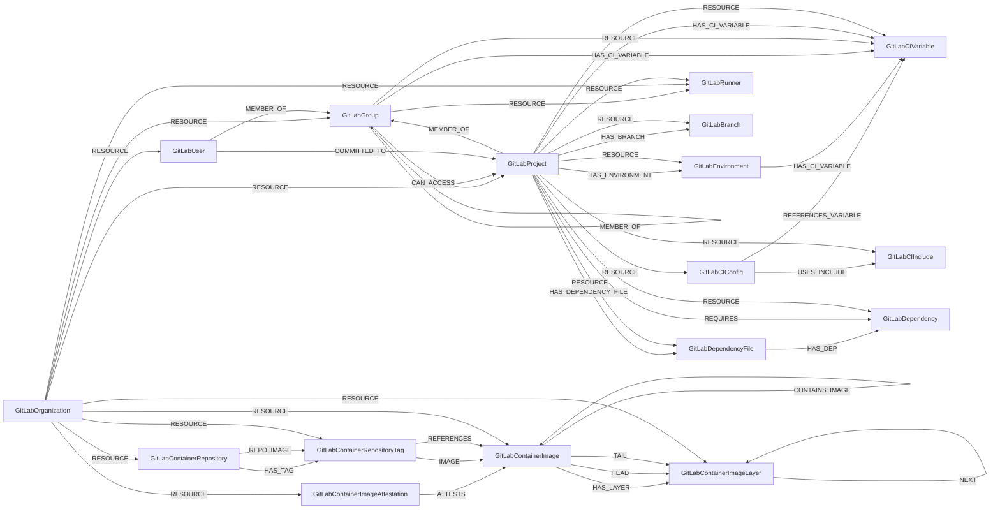

<!-- Generated from the data model. Do not edit manually. -->

## Gitlab Schema

### GitLabBranch

Schema for GitLab Branch nodes.

Branches belong to projects and have two relationships:
- RESOURCE: Sub-resource relationship for cleanup scoping (Branch -> Project)
- HAS_BRANCH: Semantic relationship showing project ownership (Project -> Branch)

#### Properties

| Field | Index | Description |
|-------|-------|-------------|
| id | Yes | Unique branch identifier formed from the project URL and branch name. |
| firstseen |  | Timestamp when a sync job first created this node. |
| lastupdated | Yes | Timestamp of the last sync that observed this node. |
| default |  | Whether this is the project's default branch. |
| name | Yes | Branch name. |
| protected |  | Whether the branch is protected. |
| web_url |  | URL for viewing the branch in GitLab. |

#### Relationships

- `(:GitLabProject)-[:HAS_BRANCH]->(:GitLabBranch)`: Relationship from GitLabProject to GitLabBranch.
Created when branches are loaded to establish the project-branch connection.

- `(:GitLabProject)-[:RESOURCE]->(:GitLabBranch)`: Sub-resource relationship from GitLabBranch to GitLabProject.

### GitLabCIConfig

A parsed GitLab CI/CD pipeline configuration.

> **Ontology Mapping**: This node uses the ontology label [`CICDPipeline`](#ontology-cicdpipeline).

#### Properties

Ontology-generated fields are shown in *italics*.

| Field | Index | Description |
|-------|-------|-------------|
| id | Yes | Composite identifier formed from the project ID and CI config file path. |
| firstseen |  | Timestamp when a sync job first created this node. |
| lastupdated | Yes | Timestamp of the last sync that observed this node. |
| default_image |  | Top-level or default container image configured for CI jobs. |
| file_path |  | Path of the CI config file in the repository. |
| gitlab_url | Yes | URL of the GitLab instance. |
| has_includes |  | Whether the pipeline has any include entries. |
| include_count |  | Number of resolved CI config include entries. |
| is_merged |  | Whether the parsed YAML was GitLab's merged config with includes expanded. |
| is_valid |  | Whether GitLab CI lint validated the config, or null when lint was unavailable. |
| job_count |  | Number of CI jobs detected in the parsed config. |
| project_id | Yes | Numeric ID of the GitLab project that owns the config. |
| referenced_protected_variables |  | Referenced variable keys that match protected project variables. |
| referenced_variable_keys |  | Non-predefined CI/CD variable keys referenced in the config. |
| stages |  | Pipeline stage names declared by the config. |
| trigger_rules |  | Trigger categories heuristically detected in the config. |
| *_ont_name* | Yes | Normalized field sourced from `file_path`. |
| *_ont_source* |  | Module that populated this node's ontology fields. |
| *_ont_type* | Yes | Property generated by the ontology mapping. |

#### Relationships

- `(:GitLabCIConfig)-[:REFERENCES_VARIABLE]->(:GitLabCIVariable)`: Links a GitLab CI configuration to the CI variables it references.

- `(:GitLabProject)-[:RESOURCE]->(:GitLabCIConfig)`: Sub-resource relationship — scoped to GitLabProject.

- `(:GitLabCIConfig)-[:USES_INCLUDE]->(:GitLabCIInclude)`: Links a GitLab CI configuration to an include it uses.

### GitLabCIInclude

An include entry referenced by a GitLab CI/CD configuration.

#### Properties

| Field | Index | Description |
|-------|-------|-------------|
| id | Yes | Composite identifier formed from the project ID, include type, location, and ref. |
| firstseen |  | Timestamp when a sync job first created this node. |
| lastupdated | Yes | Timestamp of the last sync that observed this node. |
| gitlab_url | Yes | URL of the GitLab instance. |
| include_type | Yes | Include type: local, project, remote, template, or component. |
| is_local |  | Whether the include references a file in the same repository. |
| is_pinned |  | Whether the include resolves to an immutable target. |
| location | Yes | Included path, project path, URL, template name, or component identifier. |
| ref |  | Commit SHA, tag, or branch used by a project include. |

#### Relationships

- `(:GitLabProject)-[:RESOURCE]->(:GitLabCIInclude)`: Sub-resource relationship — scoped to GitLabProject.

- `(:GitLabCIConfig)-[:USES_INCLUDE]->(:GitLabCIInclude)`: Links a GitLab CI configuration to an include it uses.

### GitLabCIVariable

A GitLab CI/CD variable defined at group or project scope.

#### Properties

| Field | Index | Description |
|-------|-------|-------------|
| id | Yes | Composite identifier formed from scope type, scope ID, key, and environment scope. |
| firstseen |  | Timestamp when a sync job first created this node. |
| lastupdated | Yes | Timestamp of the last sync that observed this node. |
| description |  | Human-readable description of the variable. |
| environment_scope | Yes | Environment name or glob that controls where the variable is available. |
| gitlab_url | Yes | URL of the GitLab instance. |
| key | Yes | Variable key exposed to CI/CD jobs. |
| masked |  | Whether GitLab attempts to mask the variable value in job logs. |
| masked_and_hidden |  | Whether the value is masked and cannot be retrieved after creation. |
| protected | Yes | Whether the variable is exposed only to pipelines on protected refs. |
| raw |  | Whether GitLab skips variable expansion for the value. |
| scope_type |  | Variable ownership scope: group or project. |
| variable_type |  | GitLab variable type: env_var or file. |

#### Relationships

- `(:GitLabEnvironment)-[:HAS_CI_VARIABLE]->(:GitLabCIVariable)`: An environment uses each project CI variable whose scope applies to it.

- `(:GitLabGroup)-[:HAS_CI_VARIABLE]->(:GitLabCIVariable)`: Links a GitLab group to a CI variable it defines.

- `(:GitLabProject)-[:HAS_CI_VARIABLE]->(:GitLabCIVariable)`: Links a GitLab project to a CI variable it defines.

- `(:GitLabCIConfig)-[:REFERENCES_VARIABLE]->(:GitLabCIVariable)`: Links a GitLab CI configuration to the CI variables it references.

- `(:GitLabGroup)-[:RESOURCE]->(:GitLabCIVariable)`: Sub-resource for group-level CI variables — scoped to GitLabGroup.

- `(:GitLabProject)-[:RESOURCE]->(:GitLabCIVariable)`: Sub-resource for project-level CI variables — scoped to GitLabProject.

### GitLabContainerImage

This node label is loaded by more than one sync path:

- A digest-addressed container image or multi-architecture manifest list.
- Build provenance attached to an image already present in the graph.

> **Conditional Labels**:
>
> - [`Image`](#ontology-image) (ontology label) when `type` equals `image`. A concrete single-platform container image.
> - [`ImageManifestList`](#ontology-imagemanifestlist) (ontology label) when `type` equals `manifest_list`. A cross-provider ImageManifestList resource in Cartography's ontology.

#### Properties

Ontology-generated fields are shown in *italics*.

| Field | Index | Description |
|-------|-------|-------------|
| id | Yes | Content-addressable container image digest. |
| firstseen |  | Timestamp when a sync job first created this node. |
| lastupdated | Yes | Timestamp of the last sync that observed this node. |
| architecture |  | CPU architecture from the image config. |
| child_image_digests |  | Digests of platform-specific images contained by a manifest list. |
| digest | Yes | Content-addressable container image digest. |
| head_layer_diff_id |  | Uncompressed digest of the first base layer. |
| layer_diff_ids |  | Ordered uncompressed layer digests that compose the image. |
| media_type |  | OCI or Docker media type of the image manifest. |
| os |  | Operating system from the image config. |
| parent_image_digest |  | Parent image digest extracted from image provenance. |
| parent_image_uri |  | Parent image reference extracted from image provenance. |
| schema_version |  | Container image manifest schema version. |
| source_file |  | Source definition file extracted from image provenance. |
| source_revision |  | Source revision extracted from image provenance. |
| source_uri | Yes | Normalized source repository URL extracted from image provenance. |
| tail_layer_diff_id |  | Uncompressed digest of the final topmost layer. |
| type | Yes | Image type: image or manifest_list. |
| uri | Yes | Container registry repository URI without a tag or digest. |
| variant |  | CPU architecture variant from the image config. |
| *_ont_architecture* | Yes | Normalized field sourced from `architecture`. |
| *_ont_digest* | Yes | Normalized field sourced from `digest`. |
| *_ont_os* | Yes | Normalized field sourced from `os`. |
| *_ont_source* |  | Module that populated this node's ontology fields. |
| *_ont_uri* | Yes | Normalized field sourced from `uri`. |

#### Relationships

- `(:GitLabContainerImageAttestation)-[:ATTESTS]->(:GitLabContainerImage)`: Relationship from attestation to the image it attests.

- `(:GitLabContainerImage)-[:BUILT_FROM]->(:GitLabContainerImage)`: Relationship from a GitLabContainerImage to its parent/base image.
  - Properties:

    | Field | Description |
    |-------|-------------|
    | confidence | Confidence score for the parent image match. |
    | from_attestation | Whether the parent image was identified from an attestation. |
    | parent_image_uri | Parent image reference reported by provenance. |

- `(:GitLabContainerImage)-[:CONTAINS_IMAGE]->(:GitLabContainerImage)`: Relationship from a manifest list to its platform-specific child images.
Only applies to images with type="manifest_list".

- `(:PackageVersion)-[:DEPLOYED]->(:GitLabContainerImage)`: A canonical package version is deployed on a container image.

- `(:AWSECSContainer)-[:HAS_IMAGE]->(:GitLabContainerImage)`: Relationship from AWSECSContainer to GitLabContainerImage.
Matches containers to GitLab registry images by runtime digest (imageDigest).

- `(:AWSLambda)-[:HAS_IMAGE]->(:GitLabContainerImage)`

- `(:AzureContainerInstance)-[:HAS_IMAGE]->(:GitLabContainerImage)`: An Azure container uses a GitLab container image with the same digest.

- `(:AzureFunctionApp)-[:HAS_IMAGE]->(:GitLabContainerImage)`: An Azure Function App uses a GitLab container image with the same digest.

- `(:GCPCloudRunJobContainer)-[:HAS_IMAGE]->(:GitLabContainerImage)`

- `(:GCPCloudRunServiceContainer)-[:HAS_IMAGE]->(:GitLabContainerImage)`

- `(:KubernetesContainer)-[:HAS_IMAGE]->(:GitLabContainerImage)`: Links a container to the image it runs, hosted in the GitLab registry.

- `(:GitLabContainerImage)-[:HAS_LAYER]->(:GitLabContainerImageLayer)`: Relationship from an image to its constituent layers.
Only applies to images with type="image" (not manifest lists).
Layers are ordered using NEXT relationships and layer_diff_ids array on the image.

- `(:ComputeService)-[:HAS_RUNTIME_IMAGE]->(:GitLabContainerImage)`: generated by analysis job `Workload HAS_RUNTIME_IMAGE inventory analysis`.
  - Properties:

    | Field | Description |
    |-------|-------------|
    | exposed_internet | Property generated by analysis job: `Workload HAS_RUNTIME_IMAGE inventory analysis`. |

- `(:GitLabContainerImage)-[:HEAD]->(:GitLabContainerImageLayer)`: Relationship from an image to its first (base) layer.
Direction: (GitLabContainerImage)-[:HEAD]->(GitLabContainerImageLayer)

- `(:GitLabContainerRepositoryTag)-[:IMAGE]->(:GitLabContainerImage)`: Generic cross-registry edge from ImageTag to Image.

- `(:GitLabContainerImage)-[:PACKAGED_FROM]->(:GitLabProject)`: Links an image to the GitLab project that packaged it. MatchLink for CircleCI fallback matching: (Image)-[:PACKAGED_FROM]->(GitLabProject).

Matches Image.digest to the specific image identified by the matcher, and
GitLabProject.web_url to the (normalized) repo URL from the CircleCI run's vcs block
(GitLabProject.id is numeric, so web_url is the URL-bearing key, consistent with the
existing GitLab provenance matcher).
  - Properties:

    | Field | Description |
    |-------|-------------|
    | command_similarity | Similarity score between image build commands and Dockerfile commands. |
    | confidence | Confidence score for the image-to-project match. |
    | dockerfile_path | Path of the Dockerfile associated with the image. |
    | match_method | Matching method: provenance, dockerfile_analysis, or dockerfile_singleton_fallback. |
    | matched_commands | Number of image build commands matched to Dockerfile commands. |
    | total_commands | Command count used to normalize the Dockerfile comparison. |

- `(:GitLabContainerRepositoryTag)-[:REFERENCES]->(:GitLabContainerImage)`: Links a tag to the container image it references via digest.
Multiple tags can reference the same image.

- `(:Container)-[:RESOLVED_IMAGE]->(:GitLabContainerImage)`: generated by analysis job `Container RESOLVED_IMAGE analysis`.

- `(:Function)-[:RESOLVED_IMAGE]->(:GitLabContainerImage)`: generated by analysis job `Function RESOLVED_IMAGE analysis`.

- `(:GitLabOrganization)-[:RESOURCE]->(:GitLabContainerImage)`: Sub-resource relationship from GitLabContainerImage to GitLabOrganization.
Images are scoped to organizations for cleanup and to allow cross-project deduplication.

- `(:GitLabContainerImage)-[:TAIL]->(:GitLabContainerImageLayer)`: Relationship from an image to its last (topmost) layer.
Direction: (GitLabContainerImage)-[:TAIL]->(GitLabContainerImageLayer)

### GitLabContainerImageAttestation

Schema for GitLab Container Image Attestation nodes.

Relationships:
- RESOURCE: Sub-resource to GitLabOrganization for cleanup
- ATTESTS: Links to the GitLabContainerImage this attestation validates

#### Properties

| Field | Index | Description |
|-------|-------|-------------|
| id | Yes | Attestation manifest digest. |
| firstseen |  | Timestamp when a sync job first created this node. |
| lastupdated | Yes | Timestamp of the last sync that observed this node. |
| attestation_type | Yes | Discovery type: sig, att, or buildx. |
| attests_digest | Yes | Digest of the container image attested by this manifest. |
| digest | Yes | Attestation manifest digest. |
| media_type |  | OCI media type of the attestation manifest. |
| predicate_type |  | In-toto predicate type reported by the attestation manifest. |
| source_file |  | Source definition file extracted from provenance. |
| source_revision |  | Source revision extracted from provenance. |
| source_uri |  | Normalized source repository URL extracted from provenance. |

#### Relationships

- `(:GitLabContainerImageAttestation)-[:ATTESTS]->(:GitLabContainerImage)`: Relationship from attestation to the image it attests.

- `(:GitLabOrganization)-[:RESOURCE]->(:GitLabContainerImageAttestation)`: Sub-resource relationship from GitLabContainerImageAttestation to GitLabOrganization.

### GitLabContainerImageLayer

Schema for GitLab Container Image Layer nodes.

Relationships:
- RESOURCE: Sub-resource to GitLabOrganization for cleanup
- HAS_LAYER: Inward relationship from GitLabContainerImage (defined in image schema)
- NEXT: Outward relationship to the next layer in the stack (linked list)
- HEAD: Inward relationship from images to their first layer (defined in image schema)
- TAIL: Inward relationship from images to their last layer (defined in image schema)

> **Ontology Mapping**: This node uses the ontology label [`ImageLayer`](#ontology-imagelayer).

#### Properties

| Field | Index | Description |
|-------|-------|-------------|
| id | Yes | Uncompressed layer digest from the image config. |
| firstseen |  | Timestamp when a sync job first created this node. |
| lastupdated | Yes | Timestamp of the last sync that observed this node. |
| diff_id | Yes | Uncompressed layer digest used for cross-registry deduplication. |
| digest | Yes | Compressed layer digest from the image manifest. |
| history |  | Image build command associated with the layer. |
| is_empty |  | Whether the layer represents an empty filesystem change. |
| media_type |  | OCI or Docker media type of the compressed layer. |
| size |  | Compressed layer size in bytes. |

#### Relationships

- `(:GitLabContainerImage)-[:HAS_LAYER]->(:GitLabContainerImageLayer)`: Relationship from an image to its constituent layers.
Only applies to images with type="image" (not manifest lists).
Layers are ordered using NEXT relationships and layer_diff_ids array on the image.

- `(:GitLabContainerImage)-[:HEAD]->(:GitLabContainerImageLayer)`: Relationship from an image to its first (base) layer.
Direction: (GitLabContainerImage)-[:HEAD]->(GitLabContainerImageLayer)

- `(:GitLabContainerImageLayer)-[:NEXT]->(:GitLabContainerImageLayer)`: Relationship from a layer to the next layer in the image stack.
Forms a linked list structure allowing traversal of layers in order.

- `(:GitLabOrganization)-[:RESOURCE]->(:GitLabContainerImageLayer)`: Sub-resource relationship from GitLabContainerImageLayer to GitLabOrganization.
Layers are scoped to organizations for cleanup and to allow cross-image deduplication.

- `(:GitLabContainerImage)-[:TAIL]->(:GitLabContainerImageLayer)`: Relationship from an image to its last (topmost) layer.
Direction: (GitLabContainerImage)-[:TAIL]->(GitLabContainerImageLayer)

### GitLabContainerRepository

A container registry repository belonging to a GitLab project.

> **Ontology Mapping**: This node uses the ontology label [`ContainerRegistry`](#ontology-containerregistry).

#### Properties

Ontology-generated fields are shown in *italics*.

| Field | Index | Description |
|-------|-------|-------------|
| id | Yes | Full registry location of the container repository. |
| firstseen |  | Timestamp when a sync job first created this node. |
| lastupdated | Yes | Timestamp of the last sync that observed this node. |
| cleanup_policy_started_at |  | Timestamp when the repository cleanup policy last started. |
| created_at |  | Timestamp when GitLab created the container repository. |
| name | Yes | Container repository name. |
| path | Yes | Container repository path within the GitLab project. |
| project_id |  | Numeric ID of the parent GitLab project. |
| repository_id |  | Numeric GitLab container repository ID. |
| size |  | Container repository size in bytes. |
| status |  | GitLab container repository status. |
| tags_count |  | Number of tags in the container repository. |
| *_ont_created_at* | Yes | Normalized field sourced from `created_at`. |
| *_ont_name* | Yes | Normalized field sourced from `name`. |
| *_ont_size_bytes* | Yes | Normalized field sourced from `size`. |
| *_ont_source* |  | Module that populated this node's ontology fields. |
| *_ont_uri* | Yes | Normalized field sourced from `path`. |

#### Relationships

- `(:GitLabContainerRepository)-[:HAS_TAG]->(:GitLabContainerRepositoryTag)`: Links a tag to its parent container repository.

- `(:GitLabContainerRepository)-[:REPO_IMAGE]->(:GitLabContainerRepositoryTag)`: Generic cross-registry edge from ContainerRegistry to ImageTag.

- `(:GitLabOrganization)-[:RESOURCE]->(:GitLabContainerRepository)`: Sub-resource relationship from GitLabContainerRepository to GitLabOrganization.
All container registry resources are scoped to the organization for cleanup.

### GitLabContainerRepositoryTag

A named tag that points to an image in a GitLab container repository.

> **Ontology Mapping**: This node uses the ontology label [`ImageTag`](#ontology-imagetag).

#### Properties

| Field | Index | Description |
|-------|-------|-------------|
| id | Yes | Full registry location of the tagged image. |
| firstseen |  | Timestamp when a sync job first created this node. |
| lastupdated | Yes | Timestamp of the last sync that observed this node. |
| created_at |  | Timestamp when GitLab created the tag. |
| digest | Yes | Digest of the container image referenced by the tag. |
| name | Yes | Container image tag name. |
| path |  | Container repository path including the tag name. |
| repository_location |  | Full registry location of the parent container repository. |
| revision |  | Full revision reported for the tag. |
| short_revision |  | Abbreviated revision reported for the tag. |
| total_size |  | Total size of the tagged image in bytes. |

#### Relationships

- `(:GitLabContainerRepository)-[:HAS_TAG]->(:GitLabContainerRepositoryTag)`: Links a tag to its parent container repository.

- `(:GitLabContainerRepositoryTag)-[:IMAGE]->(:GitLabContainerImage)`: Generic cross-registry edge from ImageTag to Image.

- `(:GitLabContainerRepositoryTag)-[:REFERENCES]->(:GitLabContainerImage)`: Links a tag to the container image it references via digest.
Multiple tags can reference the same image.

- `(:GitLabContainerRepository)-[:REPO_IMAGE]->(:GitLabContainerRepositoryTag)`: Generic cross-registry edge from ContainerRegistry to ImageTag.

- `(:GitLabOrganization)-[:RESOURCE]->(:GitLabContainerRepositoryTag)`: Sub-resource relationship from GitLabContainerRepositoryTag to GitLabOrganization.
All container registry resources are scoped to the organization for cleanup.

### GitLabDependency

A package dependency reported by a GitLab dependency scanning artifact.

> **Ontology Projection**: `GitLabDependency` contributes data to canonical [`PackageVersion`](#ontology-packageversion) nodes.

#### Properties

| Field | Index | Description |
|-------|-------|-------------|
| id | Yes | Unique dependency identifier within the GitLab project. |
| firstseen |  | Timestamp when a sync job first created this node. |
| lastupdated | Yes | Timestamp of the last sync that observed this node. |
| gitlab_url | Yes | URL of the GitLab instance. |
| name | Yes | Dependency package name. |
| normalized_id | Yes | Normalized cross-tool package identifier. |
| package_manager |  | Package manager reported by the dependency scanning artifact. |
| project_id |  | Numeric ID of the GitLab project where the dependency was detected. |
| purl |  | Package URL identifying the dependency. |
| type |  | Package type derived from the package URL. |
| version |  | Dependency package version. |

#### Relationships

- `(:PackageVersion)-[:DETECTED_AS]->(:GitLabDependency)`: A canonical package version was detected as a GitLab dependency.

- `(:GitLabDependencyFile)-[:HAS_DEP]->(:GitLabDependency)`: Relationship from GitLabDependencyFile to Dependency.
This relationship is optional - only created when manifest_id is present.

- `(:GitLabProject)-[:REQUIRES]->(:GitLabDependency)`: Relationship from GitLabProject to Dependency.

- `(:GitLabProject)-[:RESOURCE]->(:GitLabDependency)`: Sub-resource relationship from Dependency to GitLabProject.

### GitLabDependencyFile

A dependency manifest file found in a GitLab project.

#### Properties

| Field | Index | Description |
|-------|-------|-------------|
| id | Yes | Unique identifier formed from the project URL and file path. |
| firstseen |  | Timestamp when a sync job first created this node. |
| lastupdated | Yes | Timestamp of the last sync that observed this node. |
| filename | Yes | Dependency file name. |
| gitlab_url | Yes | URL of the GitLab instance. |
| path |  | Path to the dependency file in the repository. |
| project_id |  | Numeric ID of the parent GitLab project. |
| project_url |  | URL of the parent GitLab project. |

#### Relationships

- `(:GitLabDependencyFile)-[:HAS_DEP]->(:GitLabDependency)`: Relationship from GitLabDependencyFile to Dependency.
This relationship is optional - only created when manifest_id is present.

- `(:GitLabProject)-[:HAS_DEPENDENCY_FILE]->(:GitLabDependencyFile)`: Relationship from GitLabProject to GitLabDependencyFile.
Created when dependency files are loaded to establish the project-file connection.

- `(:GitLabProject)-[:RESOURCE]->(:GitLabDependencyFile)`: Sub-resource relationship from GitLabDependencyFile to GitLabProject.

### GitLabEnvironment

A deployment environment defined within a GitLab project.

#### Properties

| Field | Index | Description |
|-------|-------|-------------|
| id | Yes | Composite identifier formed from the project ID and GitLab environment ID. |
| firstseen |  | Timestamp when a sync job first created this node. |
| lastupdated | Yes | Timestamp of the last sync that observed this node. |
| auto_stop_at |  | Timestamp when GitLab is scheduled to stop the environment automatically. |
| created_at |  | Timestamp when GitLab created the environment. |
| external_url |  | URL where the deployment environment is reachable. |
| gitlab_id |  | Numeric GitLab environment ID, unique within its project. |
| gitlab_url | Yes | URL of the GitLab instance. |
| name | Yes | Deployment environment name. |
| slug |  | URL-safe deployment environment slug. |
| state |  | Deployment environment state: available or stopped. |
| tier |  | Deployment tier: production, staging, testing, development, or other. |
| updated_at |  | Timestamp when GitLab last updated the environment. |

#### Relationships

- `(:GitLabEnvironment)-[:HAS_CI_VARIABLE]->(:GitLabCIVariable)`: An environment uses each project CI variable whose scope applies to it.

- `(:GitLabProject)-[:HAS_ENVIRONMENT]->(:GitLabEnvironment)`: A GitLab project contains a deployment environment.

- `(:GitLabProject)-[:RESOURCE]->(:GitLabEnvironment)`: A GitLab project owns the environment as a sub-resource.

### GitLabGroup

A nested GitLab group within the configured top-level organization.

> **Ontology Mapping**: This node uses the ontology label [`UserGroup`](#ontology-usergroup).

#### Properties

Ontology-generated fields are shown in *italics*.

| Field | Index | Description |
|-------|-------|-------------|
| id | Yes | Numeric GitLab group ID. |
| firstseen |  | Timestamp when a sync job first created this node. |
| lastupdated | Yes | Timestamp of the last sync that observed this node. |
| created_at |  | Timestamp when GitLab created the group. |
| description |  | Human-readable description of the group. |
| full_path | Yes | Full group path including parent groups. |
| gitlab_url | Yes | URL of the GitLab instance. |
| name | Yes | Display name of the group. |
| parent_id |  | Numeric ID of the immediate parent group. |
| path | Yes | URL path slug of the group. |
| visibility |  | Group visibility: private, internal, or public. |
| web_url | Yes | URL for viewing the group in GitLab. |
| *_ont_description* |  | Normalized field sourced from `description`. |
| *_ont_name* | Yes | Normalized field sourced from `name`. |
| *_ont_source* |  | Module that populated this node's ontology fields. |

#### Relationships

- `(:GitLabGroup)-[:CAN_ACCESS]->(:GitLabProject)`: Relationship from GitLabGroup to GitLabProject representing group access.
  - Properties:

    | Field | Description |
    |-------|-------------|
    | access_level | Numeric GitLab access level granted to the group. |

- `(:GitLabGroup)-[:HAS_CI_VARIABLE]->(:GitLabCIVariable)`: Links a GitLab group to a CI variable it defines.

- `(:GitLabGroup)-[:MEMBER_OF]->(:GitLabGroup)`: Relationship from a child GitLabGroup to its parent GitLabGroup.
Used to represent the nested group hierarchy.

- `(:GitLabProject)-[:MEMBER_OF]->(:GitLabGroup)`: Relationship from GitLabProject to GitLabGroup via MEMBER_OF.
Represents the immediate parent group of a project (for projects in nested groups).

- `(:GitLabUser)-[:MEMBER_OF]->(:GitLabGroup)`: Relationship from GitLabUser to GitLabGroup via MEMBER_OF.
Represents user membership in a group with access permissions.
  - Properties:

    | Field | Description |
    |-------|-------------|
    | access_level | Numeric GitLab access level for the group membership. |
    | role | GitLab membership role, such as owner, maintainer, or developer. |

- `(:GitLabGroup)-[:RESOURCE]->(:GitLabCIVariable)`: Sub-resource for group-level CI variables — scoped to GitLabGroup.

- `(:GitLabOrganization)-[:RESOURCE]->(:GitLabGroup)`: Sub-resource relationship from GitLabGroup to GitLabOrganization.
All groups belong to an organization, used for cleanup scoping.

- `(:GitLabGroup)-[:RESOURCE]->(:GitLabRunner)`: Sub-resource for group-level runners — scoped to GitLabGroup.

### GitLabOrganization

A configured GitLab top-level group that scopes an organization sync.

#### Properties

| Field | Index | Description |
|-------|-------|-------------|
| id | Yes | Numeric GitLab ID of the top-level group. |
| firstseen |  | Timestamp when a sync job first created this node. |
| lastupdated | Yes | Timestamp of the last sync that observed this node. |
| created_at |  | Timestamp when GitLab created the top-level group. |
| description |  | Human-readable description of the organization. |
| full_path | Yes | Full path of the top-level group. |
| gitlab_url | Yes | URL of the GitLab instance. |
| name | Yes | Display name of the organization. |
| path | Yes | URL path slug of the organization. |
| visibility |  | Organization visibility: private, internal, or public. |
| web_url | Yes | URL for viewing the organization in GitLab. |

#### Relationships

- `(:GitLabOrganization)-[:RESOURCE]->(:GitLabContainerImage)`: Sub-resource relationship from GitLabContainerImage to GitLabOrganization.
Images are scoped to organizations for cleanup and to allow cross-project deduplication.

- `(:GitLabOrganization)-[:RESOURCE]->(:GitLabContainerImageAttestation)`: Sub-resource relationship from GitLabContainerImageAttestation to GitLabOrganization.

- `(:GitLabOrganization)-[:RESOURCE]->(:GitLabContainerImageLayer)`: Sub-resource relationship from GitLabContainerImageLayer to GitLabOrganization.
Layers are scoped to organizations for cleanup and to allow cross-image deduplication.

- `(:GitLabOrganization)-[:RESOURCE]->(:GitLabContainerRepository)`: Sub-resource relationship from GitLabContainerRepository to GitLabOrganization.
All container registry resources are scoped to the organization for cleanup.

- `(:GitLabOrganization)-[:RESOURCE]->(:GitLabContainerRepositoryTag)`: Sub-resource relationship from GitLabContainerRepositoryTag to GitLabOrganization.
All container registry resources are scoped to the organization for cleanup.

- `(:GitLabOrganization)-[:RESOURCE]->(:GitLabGroup)`: Sub-resource relationship from GitLabGroup to GitLabOrganization.
All groups belong to an organization, used for cleanup scoping.

- `(:GitLabOrganization)-[:RESOURCE]->(:GitLabProject)`: Sub-resource relationship from GitLabProject to GitLabOrganization.
All projects belong to an organization, used for cleanup scoping.
Projects are cleaned up per organization.

- `(:GitLabOrganization)-[:RESOURCE]->(:GitLabRunner)`: Sub-resource for instance-level runners — scoped to GitLabOrganization.

- `(:GitLabOrganization)-[:RESOURCE]->(:GitLabUser)`: Sub-resource relationship from GitLabUser to GitLabOrganization.
All users belong to an organization, used for cleanup scoping.

### GitLabProject

A GitLab project containing a source code repository.

> **Ontology Mapping**: This node uses the ontology label [`CodeRepository`](#ontology-coderepository).

> **Additional Labels**: This node also uses `GitLabRepository`.

> **Additional Label Definitions**:
>
> - `GitLabRepository`: A gitlab node participating in the shared GitLabRepository graph interface.

#### Properties

Ontology-generated fields are shown in *italics*.

| Field | Index | Description |
|-------|-------|-------------|
| id | Yes | Numeric GitLab project ID. |
| firstseen |  | Timestamp when a sync job first created this node. |
| lastupdated | Yes | Timestamp of the last sync that observed this node. |
| archived |  | Whether the project is archived. |
| created_at |  | Timestamp when GitLab created the project. |
| default_branch |  | Name of the project's default branch. |
| description |  | Human-readable description of the project. |
| gitlab_url | Yes | URL of the GitLab instance. |
| languages | Yes | JSON object mapping detected programming languages to percentages. |
| last_activity_at |  | Timestamp of the project's most recent activity. |
| name | Yes | Project name. |
| path | Yes | URL path slug of the project. |
| path_with_namespace | Yes | Full project path including its namespace. |
| visibility |  | Project visibility: private, internal, or public. |
| web_url | Yes | URL for viewing the project in GitLab. |
| *_ont_archived* | Yes | Normalized field sourced from `archived`. |
| *_ont_default_branch* | Yes | Normalized field sourced from `default_branch`. |
| *_ont_description* |  | Normalized field sourced from `description`. |
| *_ont_fullname* | Yes | Normalized field sourced from `path_with_namespace`. |
| *_ont_name* | Yes | Normalized field sourced from `name`. |
| *_ont_public* | Yes | Normalized field sourced from `visibility`. |
| *_ont_source* |  | Module that populated this node's ontology fields. |
| *_ont_url* | Yes | Normalized field sourced from `web_url`. |

#### Relationships

- `(:CircleCIProject)-[:BUILDS]->(:GitLabProject)`: The CircleCI project builds a matching GitLab project.

- `(:GitLabGroup)-[:CAN_ACCESS]->(:GitLabProject)`: Relationship from GitLabGroup to GitLabProject representing group access.
  - Properties:

    | Field | Description |
    |-------|-------------|
    | access_level | Numeric GitLab access level granted to the group. |

- `(:GitLabUser)-[:COMMITTED_TO]->(:GitLabProject)`: Relationship from GitLabUser to GitLabProject via COMMITTED_TO.
Represents commit activity by a user on a project.
  - Properties:

    | Field | Description |
    |-------|-------------|
    | commit_count | Number of commits made by the user to the project. |
    | first_commit_date | Timestamp of the user's oldest commit to the project. |
    | last_commit_date | Timestamp of the user's most recent commit to the project. |

- `(:AIBOMComponent)-[:DETECTED_IN]->(:GitLabProject)`: Links a component occurrence to its scanned GitLab project.

- `(:SemgrepSASTFinding)-[:FOUND_IN]->(:GitLabProject)`: Links a SAST finding to the GitLab project containing the affected code.

- `(:SemgrepSCAFinding)-[:FOUND_IN]->(:GitLabProject)`: Links an SCA finding to the GitLab project containing the dependency.

- `(:SemgrepSecretsFinding)-[:FOUND_IN]->(:GitLabProject)`: Links a secret finding to the GitLab project containing the secret.

- `(:GitLabProject)-[:HAS_BRANCH]->(:GitLabBranch)`: Relationship from GitLabProject to GitLabBranch.
Created when branches are loaded to establish the project-branch connection.

- `(:GitLabProject)-[:HAS_CI_VARIABLE]->(:GitLabCIVariable)`: Links a GitLab project to a CI variable it defines.

- `(:GitLabProject)-[:HAS_DEPENDENCY_FILE]->(:GitLabDependencyFile)`: Relationship from GitLabProject to GitLabDependencyFile.
Created when dependency files are loaded to establish the project-file connection.

- `(:GitLabProject)-[:HAS_ENVIRONMENT]->(:GitLabEnvironment)`: A GitLab project contains a deployment environment.

- `(:GitLabProject)-[:MEMBER_OF]->(:GitLabGroup)`: Relationship from GitLabProject to GitLabGroup via MEMBER_OF.
Represents the immediate parent group of a project (for projects in nested groups).

- `(:Image)-[:PACKAGED_FROM]->(:GitLabProject)`: Links an image to the GitLab project that packaged it. MatchLink for CircleCI fallback matching: (Image)-[:PACKAGED_FROM]->(GitLabProject).

Matches Image.digest to the specific image identified by the matcher, and
GitLabProject.web_url to the (normalized) repo URL from the CircleCI run's vcs block
(GitLabProject.id is numeric, so web_url is the URL-bearing key, consistent with the
existing GitLab provenance matcher).
  - Properties:

    | Field | Description |
    |-------|-------------|
    | command_similarity | Similarity score between image build commands and Dockerfile commands. |
    | confidence | Confidence score for the image-to-project match. |
    | dockerfile_path | Path of the Dockerfile associated with the image. |
    | match_method | Matching method: provenance, dockerfile_analysis, or dockerfile_singleton_fallback. |
    | matched_commands | Number of image build commands matched to Dockerfile commands. |
    | total_commands | Command count used to normalize the Dockerfile comparison. |

- `(:GitLabProject)-[:REQUIRES]->(:GitLabDependency)`: Relationship from GitLabProject to Dependency.

- `(:GitLabProject)-[:REQUIRES]->(:SemgrepGoLibrary)`: Links a GitLab project to a dependency it requires.
  - Properties:

    | Field | Description |
    |-------|-------------|
    | specifier | Version specifier required by the repository. |
    | transitivity | Whether the dependency is direct or transitive. |
    | url | URL of the manifest location declaring the dependency. |

- `(:GitLabProject)-[:REQUIRES]->(:SemgrepNpmLibrary)`: Links a GitLab project to a dependency it requires.
  - Properties:

    | Field | Description |
    |-------|-------------|
    | specifier | Version specifier required by the repository. |
    | transitivity | Whether the dependency is direct or transitive. |
    | url | URL of the manifest location declaring the dependency. |

- `(:GitLabProject)-[:RESOURCE]->(:GitLabBranch)`: Sub-resource relationship from GitLabBranch to GitLabProject.

- `(:GitLabProject)-[:RESOURCE]->(:GitLabCIConfig)`: Sub-resource relationship — scoped to GitLabProject.

- `(:GitLabProject)-[:RESOURCE]->(:GitLabCIInclude)`: Sub-resource relationship — scoped to GitLabProject.

- `(:GitLabProject)-[:RESOURCE]->(:GitLabCIVariable)`: Sub-resource for project-level CI variables — scoped to GitLabProject.

- `(:GitLabProject)-[:RESOURCE]->(:GitLabDependency)`: Sub-resource relationship from Dependency to GitLabProject.

- `(:GitLabProject)-[:RESOURCE]->(:GitLabDependencyFile)`: Sub-resource relationship from GitLabDependencyFile to GitLabProject.

- `(:GitLabProject)-[:RESOURCE]->(:GitLabEnvironment)`: A GitLab project owns the environment as a sub-resource.

- `(:GitLabOrganization)-[:RESOURCE]->(:GitLabProject)`: Sub-resource relationship from GitLabProject to GitLabOrganization.
All projects belong to an organization, used for cleanup scoping.
Projects are cleaned up per organization.

- `(:GitLabProject)-[:RESOURCE]->(:GitLabRunner)`: Sub-resource for project-level runners — scoped to GitLabProject.

- `(:AIBOMSource)-[:SCANNED_REPOSITORY]->(:GitLabProject)`: Links an AIBOM source to the GitLab project it scanned.

### GitLabRunner

A GitLab CI/CD runner at instance, group, or project scope.

#### Properties

| Field | Index | Description |
|-------|-------|-------------|
| id | Yes | Numeric GitLab runner ID. |
| firstseen |  | Timestamp when a sync job first created this node. |
| lastupdated | Yes | Timestamp of the last sync that observed this node. |
| access_level |  | Ref protection level required for jobs assigned to the runner. |
| active |  | Whether the runner is enabled. |
| architecture |  | CPU architecture reported by the runner. |
| contacted_at |  | Timestamp when the runner last contacted GitLab. |
| description |  | Human-readable runner description. |
| gitlab_url | Yes | URL of the GitLab instance. |
| ip_address |  | Last known IP address of the runner. |
| is_shared |  | Whether the runner is shared across the GitLab instance. |
| locked |  | Whether the runner is locked from assignment to additional projects. |
| maximum_timeout |  | Maximum job timeout enforced by the runner, in seconds. |
| online |  | Whether the runner has contacted GitLab recently. |
| paused |  | Whether the runner is paused from accepting new jobs. |
| platform |  | Operating system platform reported by the runner. |
| run_untagged |  | Whether the runner accepts jobs without matching tags. |
| runner_type | Yes | Runner scope: instance_type, group_type, or project_type. |
| status | Yes | Current GitLab runner status. |
| tag_list |  | Tags used to route CI/CD jobs to the runner. |

#### Relationships

- `(:GitLabGroup)-[:RESOURCE]->(:GitLabRunner)`: Sub-resource for group-level runners — scoped to GitLabGroup.

- `(:GitLabOrganization)-[:RESOURCE]->(:GitLabRunner)`: Sub-resource for instance-level runners — scoped to GitLabOrganization.

- `(:GitLabProject)-[:RESOURCE]->(:GitLabRunner)`: Sub-resource for project-level runners — scoped to GitLabProject.

### GitLabUser

A current GitLab organization or group member.

> **Ontology Mapping**: This node uses the ontology label [`UserAccount`](#ontology-useraccount).

#### Properties

Ontology-generated fields are shown in *italics*.

| Field | Index | Description |
|-------|-------|-------------|
| id | Yes | Numeric GitLab user ID. |
| firstseen |  | Timestamp when a sync job first created this node. |
| lastupdated | Yes | Timestamp of the last sync that observed this node. |
| email |  | Email address exposed for the user. |
| gitlab_url | Yes | URL of the GitLab instance. |
| is_admin |  | Whether the user is a GitLab administrator. |
| name |  | Full name of the user. |
| state |  | GitLab account state, such as active or blocked. |
| username | Yes | GitLab username. |
| web_url | Yes | URL for viewing the user in GitLab. |
| *_ont_active* | Yes | Normalized field sourced from `state`. |
| *_ont_email* | Yes | Normalized field sourced from `email`. |
| *_ont_fullname* | Yes | Normalized field sourced from `name`. |
| *_ont_source* |  | Module that populated this node's ontology fields. |
| *_ont_username* | Yes | Normalized field sourced from `username`. |

#### Relationships

- `(:GitLabUser)-[:COMMITTED_TO]->(:GitLabProject)`: Relationship from GitLabUser to GitLabProject via COMMITTED_TO.
Represents commit activity by a user on a project.
  - Properties:

    | Field | Description |
    |-------|-------------|
    | commit_count | Number of commits made by the user to the project. |
    | first_commit_date | Timestamp of the user's oldest commit to the project. |
    | last_commit_date | Timestamp of the user's most recent commit to the project. |

- `(:User)-[:HAS_ACCOUNT]->(:GitLabUser)`

- `(:GitLabUser)-[:MEMBER_OF]->(:GitLabGroup)`: Relationship from GitLabUser to GitLabGroup via MEMBER_OF.
Represents user membership in a group with access permissions.
  - Properties:

    | Field | Description |
    |-------|-------------|
    | access_level | Numeric GitLab access level for the group membership. |
    | role | GitLab membership role, such as owner, maintainer, or developer. |

- `(:GitLabOrganization)-[:RESOURCE]->(:GitLabUser)`: Sub-resource relationship from GitLabUser to GitLabOrganization.
All users belong to an organization, used for cleanup scoping.
