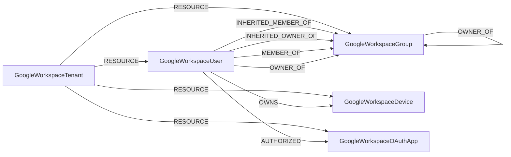

<!-- Generated from the data model. Do not edit manually. -->

## Googleworkspace Schema

### GoogleWorkspaceDevice

A device managed by Google Workspace.

> **Ontology Projection**: `GoogleWorkspaceDevice` contributes data to canonical [`Device`](#ontology-device) nodes.

#### Properties

| Field | Index | Description |
|-------|-------|-------------|
| id | Yes | Unique Google Workspace device ID. |
| firstseen |  | Timestamp when a sync job first created this node. |
| lastupdated | Yes | Timestamp of the last sync that observed this node. |
| android_specific_attributes |  | Android-specific attributes reported for the device. |
| asset_tag |  | Asset tag assigned to the device. |
| baseband_version |  | Mobile baseband version. |
| bootloader_version |  | Android bootloader version. |
| brand |  | Brand of the device. |
| build_number |  | Operating system build number. |
| compromised_state |  | Security compromise state of the device. |
| create_time |  | Time when the device record was created. |
| customer_id |  | ID of the Google Workspace tenant that contains the device. |
| device_type |  | Type of the device. |
| enabled_developer_options |  | Whether Android developer options are enabled. |
| enabled_usb_debugging |  | Whether Android USB debugging is enabled. |
| encryption_state |  | Encryption state of the device. |
| endpoint_verification_specific_attributes |  | Endpoint Verification attributes reported for the device. |
| hostname | Yes | Hostname of the device. |
| imei |  | International Mobile Equipment Identity. |
| kernel_version |  | Operating system kernel version. |
| last_sync_time |  | Time when the device last synchronized. |
| management_state |  | Management state of the device. |
| manufacturer |  | Manufacturer of the device. |
| meid |  | Mobile Equipment Identifier. |
| model |  | Model of the device. |
| network_operator |  | Mobile network operator. |
| os_version |  | Operating system version. |
| other_accounts |  | Other accounts present on the device. |
| owner_type |  | Ownership classification of the device. |
| release_version |  | Release version reported by the device. |
| security_patch_time |  | Time of the installed security patch. |
| serial_number |  | Serial number of the device. |
| unified_device_id |  | Unified identifier for the device. |
| wifi_mac_addresses |  | Wi-Fi MAC addresses of the device. |

#### Relationships

- `(:Device)-[:OBSERVED_AS]->(:GoogleWorkspaceDevice)`

- `(:GoogleWorkspaceUser)-[:OWNS]->(:GoogleWorkspaceDevice)`: A Google Workspace user directly owns a managed device.

- `(:GoogleWorkspaceTenant)-[:RESOURCE]->(:GoogleWorkspaceDevice)`: A Google Workspace tenant contains a managed device.

### GoogleWorkspaceGroup

A Google Workspace group with canonical UserGroup and GCPPrincipal labels.

> **Ontology Mapping**: This node uses the ontology label [`UserGroup`](#ontology-usergroup).

> **Additional Labels**: This node also uses `GCPPrincipal`.

> **Additional Label Definitions**:
>
> - `GCPPrincipal`: A node participating in the shared GCPPrincipal graph interface.

#### Properties

Ontology-generated fields are shown in *italics*.

| Field | Index | Description |
|-------|-------|-------------|
| id | Yes | Unique Cloud Identity resource name of the group. |
| firstseen |  | Timestamp when a sync job first created this node. |
| lastupdated | Yes | Timestamp of the last sync that observed this node. |
| create_time |  | Time when the group was created. |
| customer_id |  | ID of the Google Workspace tenant that contains the group. |
| description |  | Description of the group. |
| display_name |  | Display name of the group. |
| email | Yes | Email address of the group. |
| labels |  | Serialized Cloud Identity labels on the group. |
| name |  | Cloud Identity resource name of the group. |
| parent |  | Cloud Identity parent resource of the group. |
| update_time |  | Time when the group was last updated. |
| *_ont_description* |  | Normalized field sourced from `description`. |
| *_ont_email* | Yes | Normalized field sourced from `email`. |
| *_ont_name* | Yes | Normalized field sourced from `display_name`. |
| *_ont_source* |  | Module that populated this node's ontology fields. |

#### Relationships

- `(:GoogleWorkspaceGroup)-[:INHERITED_MEMBER_OF]->(:GoogleWorkspaceGroup)`: A group inherits membership in ancestors above its direct parent group.

- `(:GoogleWorkspaceUser)-[:INHERITED_MEMBER_OF]->(:GoogleWorkspaceGroup)`: A user inherits membership in ancestors of a directly joined group.

- `(:GoogleWorkspaceGroup)-[:INHERITED_OWNER_OF]->(:GoogleWorkspaceGroup)`: A group inherits ownership of ancestors of a directly owned group.

- `(:GoogleWorkspaceUser)-[:INHERITED_OWNER_OF]->(:GoogleWorkspaceGroup)`: A user inherits ownership of ancestors of a directly owned group.

- `(:GoogleWorkspaceGroup)-[:MEMBER_OF]->(:GoogleWorkspaceGroup)`: A member group has direct MEMBER_OF membership in its parent group.
  - Properties:

    | Field | Description |
    |-------|-------------|
    | role | Value sourced from `role`. |

- `(:GoogleWorkspaceUser)-[:MEMBER_OF]->(:GoogleWorkspaceGroup)`: A Google Workspace user is a direct member of a group.

- `(:GoogleWorkspaceGroup)-[:OWNER_OF]->(:GoogleWorkspaceGroup)`: An owner group directly owns its parent group.
  - Properties:

    | Field | Description |
    |-------|-------------|
    | role | Value sourced from `role`. |

- `(:GoogleWorkspaceUser)-[:OWNER_OF]->(:GoogleWorkspaceGroup)`: A Google Workspace user directly owns a group.

- `(:GoogleWorkspaceTenant)-[:RESOURCE]->(:GoogleWorkspaceGroup)`: A Google Workspace tenant contains a group.

### GoogleWorkspaceOAuthApp

An authorized OAuth app with the canonical ThirdPartyApp label.

> **Ontology Mapping**: This node uses the ontology label [`ThirdPartyApp`](#ontology-thirdpartyapp).

#### Properties

Ontology-generated fields are shown in *italics*.

| Field | Index | Description |
|-------|-------|-------------|
| id | Yes | OAuth client ID used as the unique app ID. |
| firstseen |  | Timestamp when a sync job first created this node. |
| lastupdated | Yes | Timestamp of the last sync that observed this node. |
| anonymous |  | Whether access was granted anonymously. |
| client_id | Yes | OAuth client ID of the app. |
| customer_id |  | ID of the Google Workspace tenant that contains the app. |
| display_text |  | Display name of the app. |
| native_app |  | Whether the app is a native application. |
| *_ont_client_id* | Yes | Normalized field sourced from `client_id`. |
| *_ont_name* | Yes | Normalized field sourced from `display_text`. |
| *_ont_native_app* | Yes | Normalized field sourced from `native_app`. |
| *_ont_protocol* | Yes | Property generated by the ontology mapping. |
| *_ont_source* |  | Module that populated this node's ontology fields. |

#### Relationships

- `(:GoogleWorkspaceUser)-[:AUTHORIZED]->(:GoogleWorkspaceOAuthApp)`: A user authorized an OAuth app with the recorded scopes.
  - Properties:

    | Field | Description |
    |-------|-------------|
    | scopes | Value sourced from `scopes`. |

- `(:User)-[:AUTHORIZED]->(:GoogleWorkspaceOAuthApp)`: generated by analysis job `Ontology - User AUTHORIZED ThirdPartyApp linking`.
  - Properties:

    | Field | Description |
    |-------|-------------|
    | scopes | Property generated by analysis job: `Ontology - User AUTHORIZED ThirdPartyApp linking`. |

- `(:GoogleWorkspaceTenant)-[:RESOURCE]->(:GoogleWorkspaceOAuthApp)`: A Google Workspace tenant contains an authorized OAuth app.

### GoogleWorkspaceTenant

A Google Workspace customer account with the canonical Tenant label.

> **Ontology Mapping**: This node uses the ontology label [`Tenant`](#ontology-tenant).

#### Properties

Ontology-generated fields are shown in *italics*.

| Field | Index | Description |
|-------|-------|-------------|
| id | Yes | Unique Google Workspace customer ID. |
| firstseen |  | Timestamp when a sync job first created this node. |
| lastupdated | Yes | Timestamp of the last sync that observed this node. |
| domain |  | Primary domain of the customer account. |
| name |  | Organization name from the customer postal address. |
| *_ont_domain* | Yes | Normalized field sourced from `domain`. |
| *_ont_name* | Yes | Normalized field sourced from `name`. |
| *_ont_source* |  | Module that populated this node's ontology fields. |

#### Relationships

- `(:GoogleWorkspaceTenant)-[:RESOURCE]->(:GoogleWorkspaceDevice)`: A Google Workspace tenant contains a managed device.

- `(:GoogleWorkspaceTenant)-[:RESOURCE]->(:GoogleWorkspaceGroup)`: A Google Workspace tenant contains a group.

- `(:GoogleWorkspaceTenant)-[:RESOURCE]->(:GoogleWorkspaceOAuthApp)`: A Google Workspace tenant contains an authorized OAuth app.

- `(:GoogleWorkspaceTenant)-[:RESOURCE]->(:GoogleWorkspaceUser)`: A Google Workspace tenant contains a user account.

### GoogleWorkspaceUser

A Google Workspace user with canonical UserAccount and GCPPrincipal labels.

> **Ontology Mapping**: This node uses the ontology label [`UserAccount`](#ontology-useraccount).

> **Additional Labels**: This node also uses `GCPPrincipal`.

> **Additional Label Definitions**:
>
> - `GCPPrincipal`: A node participating in the shared GCPPrincipal graph interface.

#### Properties

Ontology-generated fields are shown in *italics*.

| Field | Index | Description |
|-------|-------|-------------|
| id | Yes | Unique Google Workspace user ID. |
| firstseen |  | Timestamp when a sync job first created this node. |
| lastupdated | Yes | Timestamp of the last sync that observed this node. |
| agreed_to_terms |  | Whether the user accepted the terms of service. |
| archived |  | Whether the user account is archived. |
| change_password_at_next_login |  | Whether the user must change their password at next login. |
| creation_time |  | Time when the user account was created. |
| customer_id |  | ID of the Google Workspace tenant that contains the user. |
| email | Yes | Alias of the user's primary email address. |
| etag |  | API resource ETag. |
| family_name |  | Family name of the user. |
| given_name |  | Given name of the user. |
| include_in_global_address_list |  | Whether the user appears in the global address list. |
| ip_whitelisted |  | Whether IP allowlisting applies to the user. |
| is_admin |  | Whether the user is a super administrator. |
| is_delegated_admin |  | Whether the user is a delegated administrator. |
| is_enforced_in_2_sv |  | Whether two-step verification is enforced. |
| is_enrolled_in_2_sv |  | Whether the user is enrolled in two-step verification. |
| is_mailbox_setup |  | Whether the user's Google mailbox is configured. |
| kind |  | API resource type. |
| last_login_time |  | Time of the user's last login. |
| name |  | Full name of the user. |
| org_unit_path |  | Full path of the user's organizational unit. |
| organization_department |  | Department in the user's primary organization. |
| organization_name |  | Name of the user's primary organization. |
| organization_title |  | Title in the user's primary organization. |
| primary_email | Yes | Primary email address of the user. |
| suspended |  | Whether the user account is suspended. |
| thumbnail_photo_etag |  | ETag of the user's thumbnail photo. |
| thumbnail_photo_url |  | URL of the user's thumbnail photo. |
| user_id |  | Alias of the unique Google Workspace user ID. |
| *_ont_active* | Yes | Normalized field sourced from `suspended`. |
| *_ont_email* | Yes | Normalized field sourced from `email`. |
| *_ont_firstname* | Yes | Normalized field sourced from `given_name`. |
| *_ont_fullname* | Yes | Normalized field sourced from `name`. |
| *_ont_has_mfa* | Yes | Normalized field sourced from `is_enrolled_in_2_sv`. |
| *_ont_lastactivity* | Yes | Normalized field sourced from `last_login_time`. |
| *_ont_lastname* | Yes | Normalized field sourced from `family_name`. |
| *_ont_source* |  | Module that populated this node's ontology fields. |

#### Relationships

- `(:GoogleWorkspaceUser)-[:AUTHORIZED]->(:GoogleWorkspaceOAuthApp)`: A user authorized an OAuth app with the recorded scopes.
  - Properties:

    | Field | Description |
    |-------|-------------|
    | scopes | Value sourced from `scopes`. |

- `(:User)-[:HAS_ACCOUNT]->(:GoogleWorkspaceUser)`

- `(:GoogleWorkspaceUser)-[:INHERITED_MEMBER_OF]->(:GoogleWorkspaceGroup)`: A user inherits membership in ancestors of a directly joined group.

- `(:GoogleWorkspaceUser)-[:INHERITED_OWNER_OF]->(:GoogleWorkspaceGroup)`: A user inherits ownership of ancestors of a directly owned group.

- `(:GoogleWorkspaceUser)-[:MEMBER_OF]->(:GoogleWorkspaceGroup)`: A Google Workspace user is a direct member of a group.

- `(:GoogleWorkspaceUser)-[:OWNER_OF]->(:GoogleWorkspaceGroup)`: A Google Workspace user directly owns a group.

- `(:GoogleWorkspaceUser)-[:OWNS]->(:GoogleWorkspaceDevice)`: A Google Workspace user directly owns a managed device.

- `(:GoogleWorkspaceTenant)-[:RESOURCE]->(:GoogleWorkspaceUser)`: A Google Workspace tenant contains a user account.
