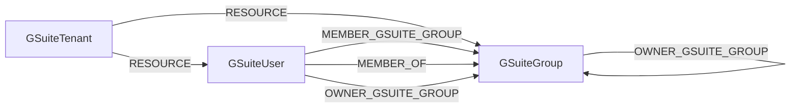

<!-- Generated from the data model. Do not edit manually. -->

## Gsuite Schema

### GSuiteGroup

A GSuite group with the canonical UserGroup label.

> **Ontology Mapping**: This node uses the ontology label [`UserGroup`](#ontology-usergroup).

> **Additional Labels**: This node also uses `GCPPrincipal`.

> **Additional Label Definitions**:
>
> - `GCPPrincipal`: A node participating in the shared GCPPrincipal graph interface.

#### Properties

Ontology-generated fields are shown in *italics*.

| Field | Index | Description |
|-------|-------|-------------|
| id | Yes | Unique GSuite group ID. |
| firstseen |  | Timestamp when a sync job first created this node. |
| lastupdated | Yes | Timestamp of the last sync that observed this node. |
| admin_created |  | Whether an administrator created the group. |
| customer_id |  | ID of the GSuite tenant that contains the group. |
| description |  | Description of the group. |
| direct_members_count |  | Number of direct group members. |
| email | Yes | Email address of the group. |
| etag |  | API resource ETag. |
| group_id |  | Alias of the unique GSuite group ID. |
| kind |  | API resource type. |
| name |  | Display name of the group. |
| *_ont_description* |  | Normalized field sourced from `description`. |
| *_ont_email* | Yes | Normalized field sourced from `email`. |
| *_ont_name* | Yes | Normalized field sourced from `name`. |
| *_ont_source* |  | Module that populated this node's ontology fields. |

#### Relationships

- `(:GSuiteGroup)-[:MEMBER_GSUITE_GROUP]->(:GSuiteGroup)`: Deprecated compatibility edge linking a member group to its parent group.
  - Properties:

    | Field | Description |
    |-------|-------------|
    | role | Value sourced from `role`. |

- `(:GSuiteUser)-[:MEMBER_GSUITE_GROUP]->(:GSuiteGroup)`: Deprecated compatibility edge linking a user to a GSuite group.

- `(:GSuiteGroup)-[:MEMBER_OF]->(:GSuiteGroup)`: A GSuite group is a member of another GSuite group.
  - Properties:

    | Field | Description |
    |-------|-------------|
    | role | Value sourced from `role`. |

- `(:GSuiteUser)-[:MEMBER_OF]->(:GSuiteGroup)`: A GSuite user account is a member of a GSuite group.

- `(:GSuiteGroup)-[:OWNER_GSUITE_GROUP]->(:GSuiteGroup)`: A GSuite group owns another GSuite group.
  - Properties:

    | Field | Description |
    |-------|-------------|
    | role | Value sourced from `role`. |

- `(:GSuiteUser)-[:OWNER_GSUITE_GROUP]->(:GSuiteGroup)`: A GSuite user account owns a GSuite group.

- `(:GSuiteTenant)-[:RESOURCE]->(:GSuiteGroup)`: A GSuite tenant contains a group.

### GSuiteTenant

A GSuite customer account with the canonical Tenant label.

> **Ontology Mapping**: This node uses the ontology label [`Tenant`](#ontology-tenant).

#### Properties

| Field | Index | Description |
|-------|-------|-------------|
| id | Yes | Unique GSuite customer ID. |
| firstseen |  | Timestamp when a sync job first created this node. |
| lastupdated | Yes | Timestamp of the last sync that observed this node. |
| customer_id |  | Alias of the unique GSuite customer ID. |

#### Relationships

- `(:GSuiteTenant)-[:RESOURCE]->(:GSuiteGroup)`: A GSuite tenant contains a group.

- `(:GSuiteTenant)-[:RESOURCE]->(:GSuiteUser)`: A GSuite tenant contains a user account.

### GSuiteUser

A GSuite user account with the canonical UserAccount label.

> **Ontology Mapping**: This node uses the ontology label [`UserAccount`](#ontology-useraccount).

> **Additional Labels**: This node also uses `GCPPrincipal`.

> **Additional Label Definitions**:
>
> - `GCPPrincipal`: A node participating in the shared GCPPrincipal graph interface.

#### Properties

Ontology-generated fields are shown in *italics*.

| Field | Index | Description |
|-------|-------|-------------|
| id | Yes | Unique GSuite user ID. |
| firstseen |  | Timestamp when a sync job first created this node. |
| lastupdated | Yes | Timestamp of the last sync that observed this node. |
| agreed_to_terms |  | Whether the user accepted the terms of service. |
| archived |  | Whether the user account is archived. |
| change_password_at_next_login |  | Whether the user must change their password at next login. |
| creation_time |  | Time when the user account was created. |
| customer_id |  | ID of the GSuite tenant that contains the user. |
| email | Yes | Primary email address of the user. |
| etag |  | API resource ETag. |
| family_name |  | Family name of the user. |
| given_name |  | Given name of the user. |
| include_in_global_address_list |  | Whether the user appears in the global address list. |
| ip_whitelisted |  | Whether the user's IP address is allowlisted. |
| is_admin |  | Whether the user is a super administrator. |
| is_delegated_admin |  | Whether the user is a delegated administrator. |
| is_enforced_in_2_sv |  | Whether two-step verification is enforced. |
| is_enrolled_in_2_sv |  | Whether the user is enrolled in two-step verification. |
| is_mailbox_setup |  | Whether the user's mailbox is configured. |
| kind |  | API resource type. |
| last_login_time |  | Time of the user's last login. |
| name |  | Full name of the user. |
| org_unit_path |  | Path of the user's organizational unit. |
| primary_email |  | Primary email address of the user. |
| suspended |  | Whether the user account is suspended. |
| thumbnail_photo_etag |  | ETag of the user's thumbnail photo. |
| thumbnail_photo_url |  | URL of the user's thumbnail photo. |
| user_id |  | Alias of the unique GSuite user ID. |
| *_ont_active* | Yes | Normalized field sourced from `suspended`. |
| *_ont_email* | Yes | Normalized field sourced from `email`. |
| *_ont_firstname* | Yes | Normalized field sourced from `given_name`. |
| *_ont_fullname* | Yes | Normalized field sourced from `name`. |
| *_ont_has_mfa* | Yes | Normalized field sourced from `is_enrolled_in_2_sv`. |
| *_ont_lastactivity* | Yes | Normalized field sourced from `last_login_time`. |
| *_ont_lastname* | Yes | Normalized field sourced from `family_name`. |
| *_ont_source* |  | Module that populated this node's ontology fields. |

#### Relationships

- `(:User)-[:HAS_ACCOUNT]->(:GSuiteUser)`

- `(:Human)-[:IDENTITY_GSUITE]->(:GSuiteUser)`: generated by analysis job `GSuite user map to Human`.

- `(:GSuiteUser)-[:MEMBER_GSUITE_GROUP]->(:GSuiteGroup)`: Deprecated compatibility edge linking a user to a GSuite group.

- `(:GSuiteUser)-[:MEMBER_OF]->(:GSuiteGroup)`: A GSuite user account is a member of a GSuite group.

- `(:GSuiteUser)-[:OWNER_GSUITE_GROUP]->(:GSuiteGroup)`: A GSuite user account owns a GSuite group.

- `(:GSuiteTenant)-[:RESOURCE]->(:GSuiteUser)`: A GSuite tenant contains a user account.
