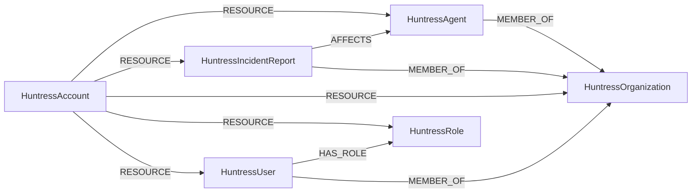

<!-- Generated from the data model. Do not edit manually. -->

## Huntress Schema

### HuntressAccount

The Huntress account the API credentials belong to.

> **Ontology Mapping**: This node uses the ontology label [`Tenant`](#ontology-tenant).

#### Properties

Ontology-generated fields are shown in *italics*.

| Field | Index | Description |
|-------|-------|-------------|
| id | Yes | Huntress account ID, which identifies the tenant. |
| firstseen |  | Timestamp when a sync job first created this node. |
| lastupdated | Yes | Timestamp of the last sync that observed this node. |
| name | Yes | Public facing display name for the account. |
| status |  | Account status: `enabled` or `disabled`. |
| subdomain | Yes | Subdomain the account is reached at, as `<subdomain>.huntress.io`. |
| support_type |  | For accounts provisioned through a reseller, whether the account is `huntress_supported`, `partner_supported` or `not_applicable`. |
| *_ont_name* | Yes | Normalized field sourced from `name`. |
| *_ont_source* |  | Module that populated this node's ontology fields. |
| *_ont_status* | Yes | Normalized field sourced from `status`. |

#### Relationships

- `(:HuntressAccount)-[:RESOURCE]->(:HuntressAgent)`: Links a Huntress account to one of its agents.

- `(:HuntressAccount)-[:RESOURCE]->(:HuntressIncidentReport)`: Links a Huntress account to one of its incident reports.

- `(:HuntressAccount)-[:RESOURCE]->(:HuntressOrganization)`: Links a Huntress account to one of its organizations.

- `(:HuntressAccount)-[:RESOURCE]->(:HuntressRole)`: Links a Huntress account to one of the console roles granted within it.

- `(:HuntressAccount)-[:RESOURCE]->(:HuntressUser)`: Links a Huntress account to one of the users with access to its console.

### HuntressAgent

A Huntress agent installed on an endpoint.

> **Ontology Projection**: `HuntressAgent` contributes data to canonical [`Device`](#ontology-device) nodes.

#### Properties

| Field | Index | Description |
|-------|-------|-------------|
| id | Yes | Huntress-unique identifier for the agent. |
| firstseen |  | Timestamp when a sync job first created this node. |
| lastupdated | Yes | Timestamp of the last sync that observed this node. |
| arch |  | Architecture of the host machine. |
| created_at |  | Timestamp when the agent was created. |
| defender_policy_status |  | Managed Antivirus policy status of Microsoft Defender AV. |
| defender_status |  | Managed Antivirus status of Microsoft Defender AV. |
| defender_substatus |  | Managed Antivirus sub-status of Microsoft Defender AV. |
| domain_name |  | Domain the host machine belongs to. |
| edr_version |  | Version of the Huntress EDR software installed on the host machine. |
| external_ip | Yes | External IP the host machine was last seen from. |
| firewall_status |  | Agent firewall status: `Disabled`, `Enabled`, `Pending Isolation`, `Isolated` or `Pending Release`. |
| hostname | Yes | Hostname of the host machine the agent is installed on. |
| ipv4_address |  | Primary internal IPv4 address of the host machine. |
| ipv4_addresses |  | Every internal IPv4 address the host reports, one per network interface. |
| last_callback_at |  | Timestamp Huntress last reached the host machine. |
| last_survey_at |  | Timestamp Huntress last received a survey from the host machine. |
| mac_addresses |  | MAC addresses of the host machine's network interfaces. |
| os |  | Operating system of the host machine. |
| os_build_version |  | Operating system build number of the host machine. |
| os_major |  | Major operating system version of the host machine. |
| os_minor |  | Minor operating system version of the host machine. |
| os_patch |  | Patch version of the operating system update installed on the host machine. |
| platform |  | Platform of the host machine: `windows`, `darwin` or `linux`. |
| serial_number | Yes | Serial number of the host machine as reported to the operating system. |
| service_pack_major |  | Major version of the Windows service pack installed on the host machine. |
| service_pack_minor |  | Minor version of the Windows service pack installed on the host machine. |
| tags |  | User classifications applied to the host machine. |
| tamper_protection_actual |  | Tamper protection state most recently reported by the host, which may lag the desired state. |
| tamper_protection_configured |  | Desired EDR tamper protection state for the agent. |
| updated_at |  | Timestamp when the agent was last updated. |
| version |  | Version of the Huntress agent installed on the host machine. |
| win_build_number |  | Windows build number of the host machine. |

#### Relationships

- `(:HuntressIncidentReport)-[:AFFECTS]->(:HuntressAgent)`: Links a Huntress incident report to the agent that reported it.

- `(:HuntressAgent)-[:MEMBER_OF]->(:HuntressOrganization)`: Links a Huntress agent to the organization it protects.

- `(:Device)-[:OBSERVED_AS]->(:HuntressAgent)`: Links a canonical device to its Huntress agent, matched on hostname when no serial number is available. Links a canonical device to its Huntress agent, matched on serial number.

- `(:HuntressAccount)-[:RESOURCE]->(:HuntressAgent)`: Links a Huntress account to one of its agents.

### HuntressIncidentReport

An incident raised by the Huntress SOC against a protected endpoint or identity.

> **Ontology Mapping**: This node uses the ontology label [`SecurityIssue`](#ontology-securityissue).

#### Properties

Ontology-generated fields are shown in *italics*.

| Field | Index | Description |
|-------|-------|-------------|
| id | Yes | Huntress-unique identifier for the incident report. |
| firstseen |  | Timestamp when a sync job first created this node. |
| lastupdated | Yes | Timestamp of the last sync that observed this node. |
| body |  | Autogenerated content describing the details of the incident. |
| closed_at |  | Timestamp the incident report status was set to `closed`. |
| indicator_types |  | Threat indicators found in the context of this incident report, such as `footholds`, `ransomware_canaries` or `process_detections`. |
| platform |  | Platform the incident was raised on: `windows`, `darwin`, `linux`, `microsoft_365`, `google`, `email_security` or `other`. |
| remediation_count |  | Total number of remediations attached to the incident report. |
| remediation_types |  | Types of the first ten remediations attached to the incident report: `assisted`, `manual` or `containment`. |
| sent_at |  | Timestamp a Huntress SOC analyst notified the necessary parties. |
| severity |  | Incident report severity: `low`, `high` or `critical`. |
| status |  | Incident report status: `sent`, `closed`, `dismissed`, `auto_remediating`, `deleting` or `partner_dismissed`. |
| status_updated_at |  | Timestamp the incident report status was last updated. |
| subject |  | Autogenerated one-line description of the incident. |
| summary |  | Details of the incident report, as provided by a Huntress SOC analyst. |
| updated_at |  | Timestamp the incident report was last updated. |
| *_ont_severity* | Yes | Normalized field sourced from `severity`. |
| *_ont_source* |  | Module that populated this node's ontology fields. |
| *_ont_status* | Yes | Normalized field sourced from `status`. |
| *_ont_title* | Yes | Normalized field sourced from `subject`. |

#### Relationships

- `(:HuntressIncidentReport)-[:AFFECTS]->(:Device)`: Links a Huntress incident report to the canonical device it affects.

- `(:HuntressIncidentReport)-[:AFFECTS]->(:HuntressAgent)`: Links a Huntress incident report to the agent that reported it.

- `(:HuntressIncidentReport)-[:MEMBER_OF]->(:HuntressOrganization)`: Links a Huntress incident report to the organization it was raised for.

- `(:HuntressAccount)-[:RESOURCE]->(:HuntressIncidentReport)`: Links a Huntress account to one of its incident reports.

### HuntressOrganization

A customer organization managed under a Huntress account.

> **Ontology Mapping**: This node uses the ontology label [`Tenant`](#ontology-tenant).

#### Properties

Ontology-generated fields are shown in *italics*.

| Field | Index | Description |
|-------|-------|-------------|
| id | Yes | Huntress-unique identifier for the organization. |
| firstseen |  | Timestamp when a sync job first created this node. |
| lastupdated | Yes | Timestamp of the last sync that observed this node. |
| agents_count |  | Number of agents deployed for the organization. |
| created_at |  | Timestamp when the organization was created. |
| identity_provider_tenant_id | Yes | Identity provider tenant ID associated with the organization, which ties it to the Entra or Google Workspace tenant it protects. |
| incident_reports_count |  | Number of incident reports raised for the organization. |
| key | Yes | Subdomain associated with the organization. |
| name | Yes | Public facing name for the organization. |
| updated_at |  | Timestamp when the organization was last updated. |
| *_ont_name* | Yes | Normalized field sourced from `name`. |
| *_ont_source* |  | Module that populated this node's ontology fields. |

#### Relationships

- `(:HuntressAgent)-[:MEMBER_OF]->(:HuntressOrganization)`: Links a Huntress agent to the organization it protects.

- `(:HuntressIncidentReport)-[:MEMBER_OF]->(:HuntressOrganization)`: Links a Huntress incident report to the organization it was raised for.

- `(:HuntressUser)-[:MEMBER_OF]->(:HuntressOrganization)`: Links a Huntress user to an organization they hold a membership in.

- `(:HuntressAccount)-[:RESOURCE]->(:HuntressOrganization)`: Links a Huntress account to one of its organizations.

### HuntressRole

A console permission set granted to Huntress users, synthesized from memberships.

Huntress ships a fixed set of permission labels and returns them as a bare string on
each membership. Materializing them as nodes rather than a property puts Huntress
console access into the cross-provider rules that walk
`(:UserAccount)-[:HAS_ROLE]->(:PermissionRole)`.

> **Ontology Mapping**: This node uses the ontology label [`PermissionRole`](#ontology-permissionrole).

#### Properties

Ontology-generated fields are shown in *italics*.

| Field | Index | Description |
|-------|-------|-------------|
| id | Yes | Synthesized as `<scope>/<account or organization ID>/<permission label>`. |
| firstseen |  | Timestamp when a sync job first created this node. |
| lastupdated | Yes | Timestamp of the last sync that observed this node. |
| name | Yes | Permission label granted by the role: `Admin`, `Security Engineer`, `User`, `Read-only`, `Finance`, `Marketing`, `Admin-Read-only` or `Provisioner`. |
| organization_id |  | Organization the role is scoped to, or null for an account-wide role. |
| scope |  | Level the role is granted at: `account` or `org`. |
| *_ont_name* | Yes | Normalized field sourced from `name`. |
| *_ont_scope* | Yes | Normalized field sourced from `scope`. |
| *_ont_source* |  | Module that populated this node's ontology fields. |
| *_ont_type* | Yes | Property generated by the ontology mapping. |

#### Relationships

- `(:HuntressUser)-[:HAS_ROLE]->(:HuntressRole)`: Links a Huntress user to a console role granted to them.

- `(:HuntressAccount)-[:RESOURCE]->(:HuntressRole)`: Links a Huntress account to one of the console roles granted within it.

### HuntressUser

A user with access to the Huntress console, derived from their memberships.

> **Ontology Mapping**: This node uses the ontology label [`UserAccount`](#ontology-useraccount).

#### Properties

Ontology-generated fields are shown in *italics*.

| Field | Index | Description |
|-------|-------|-------------|
| id | Yes | Huntress-unique identifier for the user. |
| firstseen |  | Timestamp when a sync job first created this node. |
| lastupdated | Yes | Timestamp of the last sync that observed this node. |
| email | Yes | Email address the user signs in to the Huntress console with. |
| name | Yes | Display name of the user. |
| *_ont_email* | Yes | Normalized field sourced from `email`. |
| *_ont_fullname* | Yes | Normalized field sourced from `name`. |
| *_ont_source* |  | Module that populated this node's ontology fields. |

#### Relationships

- `(:User)-[:HAS_ACCOUNT]->(:HuntressUser)`

- `(:HuntressUser)-[:HAS_ROLE]->(:HuntressRole)`: Links a Huntress user to a console role granted to them.

- `(:HuntressUser)-[:MEMBER_OF]->(:HuntressOrganization)`: Links a Huntress user to an organization they hold a membership in.

- `(:HuntressAccount)-[:RESOURCE]->(:HuntressUser)`: Links a Huntress account to one of the users with access to its console.
