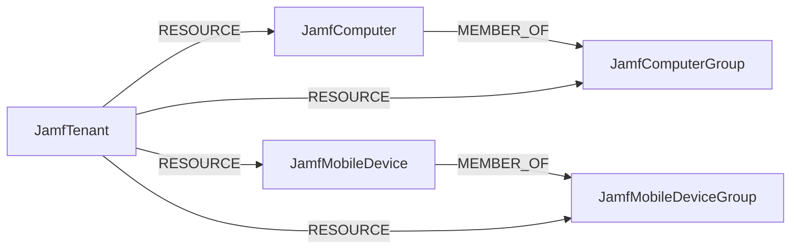

<!-- Generated from the data model. Do not edit manually. -->

## Jamf Schema

### JamfComputer

A macOS computer inventory record managed by Jamf.

> **Ontology Projection**: `JamfComputer` contributes data to canonical [`Device`](#ontology-device) nodes.

#### Properties

| Field | Index | Description |
|-------|-------|-------------|
| id | Yes | Jamf computer inventory ID. |
| firstseen |  | Timestamp when a sync job first created this node. |
| lastupdated | Yes | Timestamp of the last sync that observed this node. |
| activation_lock_enabled |  | Whether Activation Lock is enabled. |
| bootstrap_token_escrowed_status |  | Bootstrap token escrow state. |
| declarative_device_management_enabled |  | Whether declarative device management is enabled. |
| email |  | Associated email address. |
| enrolled_via_automated_device_enrollment |  | Whether automated device enrollment was used. |
| filevault_enabled |  | Whether FileVault is enabled. |
| firewall_enabled |  | Whether the firewall is enabled. |
| gatekeeper_status |  | Gatekeeper status. |
| last_contact_time |  | Last Jamf contact timestamp. |
| model |  | Device model. |
| model_identifier |  | Device model identifier. |
| name | Yes | Device hostname. |
| os_build |  | Operating system build. |
| os_name |  | Operating system family. |
| os_version |  | Operating system version. |
| platform |  | Platform reported by Jamf. |
| recovery_lock_enabled |  | Whether Recovery Lock is enabled. |
| remote_management_managed |  | Whether remote management is enabled. |
| report_date |  | Last inventory report timestamp. |
| secure_boot_level |  | Secure Boot level. |
| serial_number | Yes | Device serial number. |
| sip_status |  | System Integrity Protection status. |
| site_name |  | Jamf site name. |
| supervised |  | Whether the device is supervised. |
| udid |  | Device UDID. |
| user_approved_mdm |  | Whether mobile device management is user approved. |
| user_real_name |  | Associated user's real name. |
| username |  | Associated username. |

#### Relationships

- `(:JamfComputer)-[:MEMBER_OF]->(:JamfComputerGroup)`: Links a Jamf computer to a group containing it.

- `(:Device)-[:OBSERVED_AS]->(:JamfComputer)`

- `(:JamfTenant)-[:RESOURCE]->(:JamfComputer)`: Links a Jamf tenant to one of its managed computers.

### JamfComputerGroup

A group of computers managed by Jamf.

#### Properties

| Field | Index | Description |
|-------|-------|-------------|
| id | Yes | Jamf computer group ID. |
| firstseen |  | Timestamp when a sync job first created this node. |
| lastupdated | Yes | Timestamp of the last sync that observed this node. |
| description |  | Group description. |
| is_smart |  | Whether this is a smart group. |
| membership_count |  | Number of members reported by Jamf. |
| name |  | Friendly name of the group. |

#### Relationships

- `(:JamfComputer)-[:MEMBER_OF]->(:JamfComputerGroup)`: Links a Jamf computer to a group containing it.

- `(:JamfTenant)-[:RESOURCE]->(:JamfComputerGroup)`: Links a Jamf tenant to one of its computer groups.

### JamfMobileDevice

A mobile device inventory record managed by Jamf.

> **Ontology Projection**: `JamfMobileDevice` contributes data to canonical [`Device`](#ontology-device) nodes.

#### Properties

| Field | Index | Description |
|-------|-------|-------------|
| id | Yes | Jamf mobile device inventory ID. |
| firstseen |  | Timestamp when a sync job first created this node. |
| lastupdated | Yes | Timestamp of the last sync that observed this node. |
| activation_lock_enabled |  | Whether Activation Lock is enabled. |
| bootstrap_token_escrowed |  | Whether a bootstrap token is escrowed. |
| data_protected |  | Whether data protection is enabled. |
| display_name | Yes | Device display name. |
| email |  | Associated email address. |
| hardware_encryption |  | Whether hardware encryption is enabled. |
| jailbreak_detected |  | Whether jailbreaking or rooting was detected. |
| last_enrolled_date |  | Enrollment timestamp. |
| last_inventory_update_date |  | Last inventory update timestamp. |
| lost_mode_enabled |  | Whether lost mode is enabled. |
| managed |  | Whether the device is managed. |
| model |  | Device model. |
| model_identifier |  | Device model identifier. |
| os |  | Normalized operating system family. |
| os_build |  | Operating system build. |
| os_version |  | Operating system version. |
| passcode_compliant |  | Whether the passcode meets policy. |
| passcode_present |  | Whether a passcode is present. |
| platform |  | Device type reported by Jamf. |
| serial_number | Yes | Device serial number. |
| supervised |  | Whether the device is supervised. |
| user_real_name |  | Associated user's real name. |
| username |  | Associated username. |

#### Relationships

- `(:JamfMobileDevice)-[:MEMBER_OF]->(:JamfMobileDeviceGroup)`: Links a Jamf mobile device to a group containing it.

- `(:Device)-[:OBSERVED_AS]->(:JamfMobileDevice)`

- `(:JamfTenant)-[:RESOURCE]->(:JamfMobileDevice)`: Links a Jamf tenant to one of its managed mobile devices.

### JamfMobileDeviceGroup

A group of mobile devices managed by Jamf.

#### Properties

| Field | Index | Description |
|-------|-------|-------------|
| id | Yes | Jamf mobile device group ID. |
| firstseen |  | Timestamp when a sync job first created this node. |
| lastupdated | Yes | Timestamp of the last sync that observed this node. |
| description |  | Group description. |
| is_smart |  | Whether this is a smart group. |
| membership_count |  | Number of members reported by Jamf. |
| name |  | Friendly name of the group. |

#### Relationships

- `(:JamfMobileDevice)-[:MEMBER_OF]->(:JamfMobileDeviceGroup)`: Links a Jamf mobile device to a group containing it.

- `(:JamfTenant)-[:RESOURCE]->(:JamfMobileDeviceGroup)`: Links a Jamf tenant to one of its mobile device groups.

### JamfTenant

A Jamf tenant identified by its configured base URI.

> **Ontology Mapping**: This node uses the ontology label [`Tenant`](#ontology-tenant).

#### Properties

| Field | Index | Description |
|-------|-------|-------------|
| id | Yes | Jamf tenant ID represented by the configured base URI. |
| firstseen |  | Timestamp when a sync job first created this node. |
| lastupdated | Yes | Timestamp of the last sync that observed this node. |

#### Relationships

- `(:JamfTenant)-[:RESOURCE]->(:JamfComputer)`: Links a Jamf tenant to one of its managed computers.

- `(:JamfTenant)-[:RESOURCE]->(:JamfComputerGroup)`: Links a Jamf tenant to one of its computer groups.

- `(:JamfTenant)-[:RESOURCE]->(:JamfMobileDevice)`: Links a Jamf tenant to one of its managed mobile devices.

- `(:JamfTenant)-[:RESOURCE]->(:JamfMobileDeviceGroup)`: Links a Jamf tenant to one of its mobile device groups.
