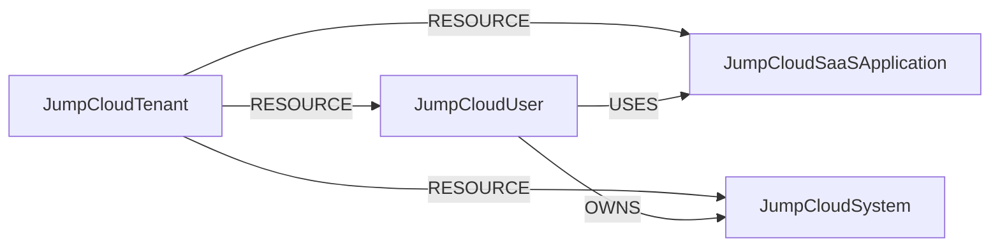

<!-- Generated from the data model. Do not edit manually. -->

## Jumpcloud Schema

### JumpCloudSaaSApplication

A SaaS application managed in JumpCloud.

> **Ontology Mapping**: This node uses the ontology label [`ThirdPartyApp`](#ontology-thirdpartyapp).

#### Properties

Ontology-generated fields are shown in *italics*.

| Field | Index | Description |
|-------|-------|-------------|
| id | Yes | JumpCloud application ID. |
| firstseen |  | Timestamp when a sync job first created this node. |
| lastupdated | Yes | Timestamp of the last sync that observed this node. |
| description |  | Application description. |
| name | Yes | Application name. |
| *_ont_client_id* | Yes | Normalized field sourced from `id`. |
| *_ont_name* | Yes | Normalized field sourced from `name`. |
| *_ont_source* |  | Module that populated this node's ontology fields. |

#### Relationships

- `(:User)-[:AUTHORIZED]->(:JumpCloudSaaSApplication)`: generated by analysis job `Ontology - User AUTHORIZED ThirdPartyApp linking`.
  - Properties:

    | Field | Description |
    |-------|-------------|
    | scopes | Property generated by analysis job: `Ontology - User AUTHORIZED ThirdPartyApp linking`. |

- `(:JumpCloudTenant)-[:RESOURCE]->(:JumpCloudSaaSApplication)`: The tenant contains the SaaS application.

- `(:JumpCloudUser)-[:USES]->(:JumpCloudSaaSApplication)`: A user uses the SaaS application.

### JumpCloudSystem

A managed device in JumpCloud.

> **Ontology Projection**: `JumpCloudSystem` contributes data to canonical [`Device`](#ontology-device) nodes.

#### Properties

| Field | Index | Description |
|-------|-------|-------------|
| id | Yes | JumpCloud asset ID. |
| firstseen |  | Timestamp when a sync job first created this node. |
| lastupdated | Yes | Timestamp of the last sync that observed this node. |
| jc_system_id | Yes | JumpCloud system ID used to correlate system insights data. |
| model |  | Device hardware model. |
| os |  | Full operating system name. |
| os_family |  | Operating system family. |
| os_version |  | Operating system version. |
| primary_user |  | Display name of the primary user assigned to the device. |
| primary_user_id |  | JumpCloud ID of the primary user. |
| serial_number |  | Device serial number. |
| status |  | Device status. |

#### Relationships

- `(:Device)-[:OBSERVED_AS]->(:JumpCloudSystem)`

- `(:JumpCloudUser)-[:OWNS]->(:JumpCloudSystem)`: A user owns the managed system.

- `(:JumpCloudTenant)-[:RESOURCE]->(:JumpCloudSystem)`: The tenant contains the managed system.

### JumpCloudTenant

A JumpCloud organization containing managed resources.

> **Ontology Mapping**: This node uses the ontology label [`Tenant`](#ontology-tenant).

#### Properties

Ontology-generated fields are shown in *italics*.

| Field | Index | Description |
|-------|-------|-------------|
| id | Yes | JumpCloud organization ID. |
| firstseen |  | Timestamp when a sync job first created this node. |
| lastupdated | Yes | Timestamp of the last sync that observed this node. |
| *_ont_name* | Yes | Normalized field sourced from `id`. |
| *_ont_source* |  | Module that populated this node's ontology fields. |

#### Relationships

- `(:JumpCloudTenant)-[:RESOURCE]->(:JumpCloudSaaSApplication)`: The tenant contains the SaaS application.

- `(:JumpCloudTenant)-[:RESOURCE]->(:JumpCloudSystem)`: The tenant contains the managed system.

- `(:JumpCloudTenant)-[:RESOURCE]->(:JumpCloudUser)`: The tenant contains the user.

### JumpCloudUser

A user account in JumpCloud.

> **Ontology Mapping**: This node uses the ontology label [`UserAccount`](#ontology-useraccount).

#### Properties

Ontology-generated fields are shown in *italics*.

| Field | Index | Description |
|-------|-------|-------------|
| id | Yes | JumpCloud user ID. |
| firstseen |  | Timestamp when a sync job first created this node. |
| lastupdated | Yes | Timestamp of the last sync that observed this node. |
| account_locked |  | Whether the account is locked. |
| activated |  | Whether the account is activated. |
| created |  | Timestamp when the account was created. |
| displayname |  | Display name. |
| email | Yes | User email address. |
| firstname |  | First name. |
| lastlogin |  | Timestamp of the last login. |
| lastname |  | Last name. |
| mfa_configured |  | Whether MFA is configured for the user. |
| suspended |  | Whether the account is suspended. |
| username | Yes | Username. |
| *_ont_active* | Yes | Normalized field sourced from `suspended`. |
| *_ont_email* | Yes | Normalized field sourced from `email`. |
| *_ont_firstname* | Yes | Normalized field sourced from `firstname`. |
| *_ont_has_mfa* | Yes | Normalized field sourced from `mfa_configured`. |
| *_ont_lastactivity* | Yes | Normalized field sourced from `lastlogin`. |
| *_ont_lastname* | Yes | Normalized field sourced from `lastname`. |
| *_ont_source* |  | Module that populated this node's ontology fields. |
| *_ont_username* | Yes | Normalized field sourced from `username`. |

#### Relationships

- `(:User)-[:HAS_ACCOUNT]->(:JumpCloudUser)`

- `(:JumpCloudUser)-[:OWNS]->(:JumpCloudSystem)`: A user owns the managed system.

- `(:JumpCloudTenant)-[:RESOURCE]->(:JumpCloudUser)`: The tenant contains the user.

- `(:JumpCloudUser)-[:USES]->(:JumpCloudSaaSApplication)`: A user uses the SaaS application.
