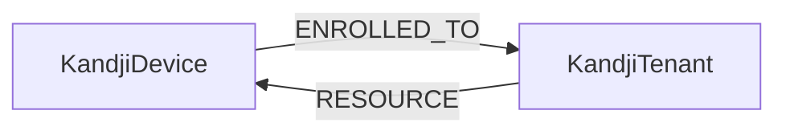

<!-- Generated from the data model. Do not edit manually. -->

## Kandji Schema

### KandjiDevice

A device managed by Kandji.

> **Ontology Projection**: `KandjiDevice` contributes data to canonical [`Device`](#ontology-device) nodes.

#### Properties

| Field | Index | Description |
|-------|-------|-------------|
| id | Yes | Kandji device ID. |
| firstseen |  | Timestamp when a sync job first created this node. |
| lastupdated | Yes | Timestamp of the last sync that observed this node. |
| device_id |  | Kandji device ID. |
| device_name | Yes | Friendly device name. |
| last_check_in |  | Timestamp of the device's last Kandji check-in. |
| model |  | Device model. |
| os_version |  | Operating system version. |
| platform |  | Device platform. |
| serial_number | Yes | Device serial number. |

#### Relationships

- `(:KandjiDevice)-[:ENROLLED_TO]->(:KandjiTenant)`: Deprecated compatibility edge linking a device to its tenant.

- `(:Device)-[:OBSERVED_AS]->(:KandjiDevice)`

- `(:KandjiTenant)-[:RESOURCE]->(:KandjiDevice)`: The tenant contains the enrolled device.

### KandjiTenant

A Kandji tenant containing managed devices.

> **Ontology Mapping**: This node uses the ontology label [`Tenant`](#ontology-tenant).

#### Properties

| Field | Index | Description |
|-------|-------|-------------|
| id | Yes | Kandji tenant ID. |
| firstseen |  | Timestamp when a sync job first created this node. |
| lastupdated | Yes | Timestamp of the last sync that observed this node. |

#### Relationships

- `(:KandjiDevice)-[:ENROLLED_TO]->(:KandjiTenant)`: Deprecated compatibility edge linking a device to its tenant.

- `(:KandjiTenant)-[:RESOURCE]->(:KandjiDevice)`: The tenant contains the enrolled device.
