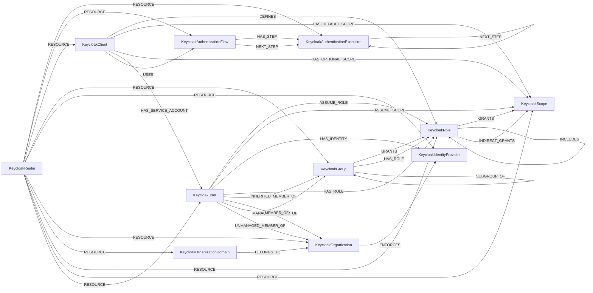

<!-- Generated from the data model. Do not edit manually. -->

## Keycloak Schema

### KeycloakAuthenticationExecution

Represents an individual authentication execution step within a Keycloak authentication flow. Authentication executions define specific authentication mechanisms, requirements, and their order within an authentication flow.

#### Properties

| Field | Index | Description |
|-------|-------|-------------|
| id | Yes | The unique identifier of the authentication execution |
| firstseen |  | Timestamp when a sync job first created this node. |
| lastupdated | Yes | Timestamp of the last sync that observed this node. |
| authentication_flow |  | Whether this execution references an authentication flow |
| configurable |  | Whether this execution is configurable |
| description |  | The description of the authentication execution |
| display_name |  | The display name of the authentication execution |
| flow_id |  | The flow identifier if this execution references a flow |
| index |  | The index position within the flow |
| is_terminal_step |  | Whether the execution can be a terminal workflow step (inferred by Cartography) |
| level |  | The nesting level of the execution |
| priority |  | The priority order of the execution |
| provider_id |  | The provider identifier for the authentication execution |
| requirement |  | The requirement level (REQUIRED, OPTIONAL, ALTERNATIVE, DISABLED) |

#### Relationships

- `(:KeycloakAuthenticationExecution)-[:HAS_STEP]->(:KeycloakAuthenticationExecution)`: The parent execution contains the subflow execution as a step.

- `(:KeycloakAuthenticationFlow)-[:HAS_STEP]->(:KeycloakAuthenticationExecution)`: The authentication flow contains the execution as a step.

- `(:KeycloakAuthenticationExecution)-[:NEXT_STEP]->(:KeycloakAuthenticationExecution)`: The execution can continue to the next execution.

- `(:KeycloakAuthenticationFlow)-[:NEXT_STEP]->(:KeycloakAuthenticationExecution)`: The authentication flow starts with the execution.

- `(:KeycloakRealm)-[:RESOURCE]->(:KeycloakAuthenticationExecution)`: The realm contains the authentication execution.

### KeycloakAuthenticationFlow

Represents an authentication flow in Keycloak that defines the sequence of authentication steps and requirements for user authentication. Authentication flows control how users authenticate to the realm and can include various authentication mechanisms and requirements.

#### Properties

| Field | Index | Description |
|-------|-------|-------------|
| id | Yes | The unique identifier of the authentication flow |
| firstseen |  | Timestamp when a sync job first created this node. |
| lastupdated | Yes | Timestamp of the last sync that observed this node. |
| alias | Yes | The alias of the authentication flow (indexed for queries) |
| built_in |  | Whether this is a built-in authentication flow |
| description |  | The description of the authentication flow |
| provider_id |  | The provider identifier for the authentication flow |
| realm | Yes | The realm name for flow lookup (indexed) |
| top_level |  | Whether this is a top-level authentication flow |

#### Relationships

- `(:KeycloakAuthenticationFlow)-[:HAS_STEP]->(:KeycloakAuthenticationExecution)`: The authentication flow contains the execution as a step.

- `(:KeycloakAuthenticationFlow)-[:NEXT_STEP]->(:KeycloakAuthenticationExecution)`: The authentication flow starts with the execution.

- `(:KeycloakRealm)-[:RESOURCE]->(:KeycloakAuthenticationFlow)`: The realm contains the authentication flow.

- `(:KeycloakClient)-[:USES]->(:KeycloakAuthenticationFlow)`: The client uses an authentication flow.
  - Properties:

    | Field | Description |
    |-------|-------------|
    | default_flow | Value sourced from `default_flow`. |
    | flow_name | Value sourced from `flow_name`. |

### KeycloakClient

Represents a Keycloak client application that can request authentication and authorization services from the realm.

> **Ontology Mapping**: This node uses the ontology label [`ThirdPartyApp`](#ontology-thirdpartyapp).

#### Properties

Ontology-generated fields are shown in *italics*.

| Field | Index | Description |
|-------|-------|-------------|
| id | Yes | The unique identifier of the client |
| firstseen |  | Timestamp when a sync job first created this node. |
| lastupdated | Yes | Timestamp of the last sync that observed this node. |
| admin_url |  | The admin URL of the client |
| always_display_in_console |  | Whether to always display in console |
| authorization_services_enabled |  | Whether authorization services are enabled |
| base_url |  | The base URL of the client |
| bearer_only |  | Whether this is a bearer-only client |
| client_authenticator_type |  | The client authenticator type |
| client_id |  | The client identifier used in protocols |
| client_template |  | Client template reference |
| consent_required |  | Whether user consent is required |
| description |  | The description of the client |
| direct_access_grants_enabled |  | Whether direct access grants are enabled |
| direct_grants_only |  | Whether only direct grants are allowed |
| enabled |  | Whether the client is enabled |
| frontchannel_logout |  | Whether frontchannel logout is enabled |
| full_scope_allowed |  | Whether full scope is allowed |
| implicit_flow_enabled |  | Whether implicit flow is enabled |
| name |  | The name of the client |
| node_re_registration_timeout |  | Node re-registration timeout |
| not_before |  | Not before timestamp for security |
| origin |  | Origin of the client |
| protocol |  | The protocol used by the client |
| public_client |  | Whether this is a public client |
| registration_access_token |  | Registration access token |
| root_url |  | The root URL of the client |
| service_accounts_enabled |  | Whether service accounts are enabled |
| standard_flow_enabled |  | Whether standard flow is enabled |
| surrogate_auth_required |  | Whether surrogate authentication is required |
| type |  | The type of the client |
| use_template_config |  | Whether to use template config |
| use_template_mappers |  | Whether to use template mappers |
| use_template_scope |  | Whether to use template scope |
| *_ont_client_id* | Yes | Normalized field sourced from `client_id`. |
| *_ont_enabled* | Yes | Normalized field sourced from `enabled`. |
| *_ont_name* | Yes | Normalized field sourced from `name`. |
| *_ont_protocol* | Yes | Normalized field sourced from `protocol`. |
| *_ont_source* |  | Module that populated this node's ontology fields. |

#### Relationships

- `(:User)-[:AUTHORIZED]->(:KeycloakClient)`: generated by analysis job `Ontology - User AUTHORIZED ThirdPartyApp linking`.
  - Properties:

    | Field | Description |
    |-------|-------------|
    | scopes | Property generated by analysis job: `Ontology - User AUTHORIZED ThirdPartyApp linking`. |

- `(:KeycloakClient)-[:DEFINES]->(:KeycloakRole)`: The client defines the role.

- `(:KeycloakClient)-[:HAS_DEFAULT_SCOPE]->(:KeycloakScope)`: The client uses a default client scope.

- `(:KeycloakClient)-[:HAS_OPTIONAL_SCOPE]->(:KeycloakScope)`: The client can request an optional client scope.

- `(:KeycloakClient)-[:HAS_SERVICE_ACCOUNT]->(:KeycloakUser)`: The client uses a user as its service account.

- `(:KeycloakRealm)-[:RESOURCE]->(:KeycloakClient)`: The realm contains the client.

- `(:KeycloakClient)-[:USES]->(:KeycloakAuthenticationFlow)`: The client uses an authentication flow.
  - Properties:

    | Field | Description |
    |-------|-------------|
    | default_flow | Value sourced from `default_flow`. |
    | flow_name | Value sourced from `flow_name`. |

### KeycloakGroup

Represents a group of users in Keycloak that can be used for organizing users and assigning roles.

> **Ontology Mapping**: This node uses the ontology label [`UserGroup`](#ontology-usergroup).

#### Properties

Ontology-generated fields are shown in *italics*.

| Field | Index | Description |
|-------|-------|-------------|
| id | Yes | The unique identifier of the group |
| firstseen |  | Timestamp when a sync job first created this node. |
| lastupdated | Yes | Timestamp of the last sync that observed this node. |
| description |  | The description of the group |
| name |  | The name of the group |
| path |  | The hierarchical path of the group |
| *_ont_description* |  | Normalized field sourced from `description`. |
| *_ont_name* | Yes | Normalized field sourced from `name`. |
| *_ont_source* |  | Module that populated this node's ontology fields. |

#### Relationships

- `(:KeycloakGroup)-[:GRANTS]->(:KeycloakRole)`: Deprecated compatibility edge for a role granted to group members.

- `(:KeycloakGroup)-[:HAS_ROLE]->(:KeycloakRole)`: The group has a role that applies to its members.

- `(:KeycloakUser)-[:INHERITED_MEMBER_OF]->(:KeycloakGroup)`: A user inherits membership in the parent groups of its direct groups.

- `(:KeycloakGroup)-[:MEMBER_OF]->(:KeycloakGroup)`: The group is a member of its parent group.

- `(:KeycloakUser)-[:MEMBER_OF]->(:KeycloakGroup)`: Users can be members of the group.

- `(:KeycloakRealm)-[:RESOURCE]->(:KeycloakGroup)`: The realm contains the group.

- `(:KeycloakGroup)-[:SUBGROUP_OF]->(:KeycloakGroup)`: Deprecated compatibility edge linking a subgroup to its parent group.

### KeycloakIdentityProvider

Represents an external identity provider configured in Keycloak for federated authentication.

> **Ontology Mapping**: This node uses the ontology label [`IdentityProvider`](#ontology-identityprovider).

#### Properties

Ontology-generated fields are shown in *italics*.

| Field | Index | Description |
|-------|-------|-------------|
| id | Yes | The internal unique identifier |
| firstseen |  | Timestamp when a sync job first created this node. |
| lastupdated | Yes | Timestamp of the last sync that observed this node. |
| add_read_token_role_on_create |  | Whether to add read token role on create |
| alias | Yes | The alias of the identity provider (indexed for queries) |
| authenticate_by_default |  | Whether to authenticate by default |
| config_sync_mode |  | Configuration sync mode |
| display_name |  | The display name of the identity provider |
| enabled |  | Whether the identity provider is enabled |
| first_broker_login_flow_alias |  | First broker login flow alias |
| hide_on_login |  | Whether to hide on login page |
| link_only |  | Whether this provider is for linking only |
| organization_id |  | Organization ID if applicable |
| post_broker_login_flow_alias |  | Post broker login flow alias |
| provider_id |  | The provider type identifier |
| store_token |  | Whether to store tokens from the provider |
| trust_email |  | Whether to trust email from the provider |
| update_profile_first_login |  | Whether to update profile on first login |
| update_profile_first_login_mode |  | Profile update mode on first login |
| *_ont_enabled* | Yes | Normalized field sourced from `enabled`. |
| *_ont_name* | Yes | Normalized field sourced from `alias`. |
| *_ont_protocol* | Yes | Normalized field sourced from `provider_id`. |
| *_ont_source* |  | Module that populated this node's ontology fields. |

#### Relationships

- `(:KeycloakOrganization)-[:ENFORCES]->(:KeycloakIdentityProvider)`: The organization enforces the identity provider.

- `(:KeycloakUser)-[:HAS_IDENTITY]->(:KeycloakIdentityProvider)`: The user authenticates through the identity provider.

- `(:KeycloakRealm)-[:RESOURCE]->(:KeycloakIdentityProvider)`: The realm contains the identity provider.

### KeycloakOrganization

Represents a Keycloak organization, which is a logical grouping of users, domains, and identity providers within a realm. Organizations provide a way to isolate and manage different business entities or departments within the same Keycloak realm.

#### Properties

| Field | Index | Description |
|-------|-------|-------------|
| id | Yes | The unique identifier of the organization |
| firstseen |  | Timestamp when a sync job first created this node. |
| lastupdated | Yes | Timestamp of the last sync that observed this node. |
| alias |  | The alias of the organization |
| description |  | The description of the organization |
| enabled |  | Whether the organization is enabled |
| name |  | The name of the organization |
| redirect_url |  | The redirect URL for the organization |

#### Relationships

- `(:KeycloakOrganizationDomain)-[:BELONGS_TO]->(:KeycloakOrganization)`: The domain belongs to the organization.

- `(:KeycloakOrganization)-[:ENFORCES]->(:KeycloakIdentityProvider)`: The organization enforces the identity provider.

- `(:KeycloakUser)-[:MANAGED_MEMBER_OF]->(:KeycloakOrganization)`: The user is a managed member of the organization.

- `(:KeycloakRealm)-[:RESOURCE]->(:KeycloakOrganization)`: The realm contains the organization.

- `(:KeycloakUser)-[:UNMANAGED_MEMBER_OF]->(:KeycloakOrganization)`: The user is an unmanaged member of the organization.

### KeycloakOrganizationDomain

Represents a domain that belongs to a Keycloak organization. Organization domains define which email domains are associated with an organization, and can be verified to ensure proper domain ownership.

#### Properties

| Field | Index | Description |
|-------|-------|-------------|
| id | Yes | The unique identifier of the organization domain |
| firstseen |  | Timestamp when a sync job first created this node. |
| lastupdated | Yes | Timestamp of the last sync that observed this node. |
| name | Yes | The domain name (indexed for queries) |
| verified |  | Whether the domain has been verified |

#### Relationships

- `(:KeycloakOrganizationDomain)-[:BELONGS_TO]->(:KeycloakOrganization)`: The domain belongs to the organization.

- `(:KeycloakRealm)-[:RESOURCE]->(:KeycloakOrganizationDomain)`: The realm contains the organization domain.

### KeycloakRealm

Represents a Keycloak realm, which is a security domain where users, groups, roles, and other entities are managed.

> **Ontology Mapping**: This node uses the ontology label [`Tenant`](#ontology-tenant).

#### Properties

Ontology-generated fields are shown in *italics*.

| Field | Index | Description |
|-------|-------|-------------|
| id | Yes | The unique identifier of the realm |
| firstseen |  | Timestamp when a sync job first created this node. |
| lastupdated | Yes | Timestamp of the last sync that observed this node. |
| access_code_lifespan |  | Access code lifespan in seconds |
| access_code_lifespan_login |  | Access code lifespan for login in seconds |
| access_code_lifespan_user_action |  | Access code lifespan for user actions in seconds |
| access_token_lifespan |  | Lifespan of access tokens in seconds |
| access_token_lifespan_for_implicit_flow |  | Access token lifespan for implicit flow |
| action_token_generated_by_admin_lifespan |  | Action token lifespan when generated by admin |
| action_token_generated_by_user_lifespan |  | Action token lifespan when generated by user |
| admin_events_details_enabled |  | Whether admin event details are enabled |
| admin_events_enabled |  | Whether admin events are enabled |
| admin_permissions_enabled |  | Whether admin permissions are enabled |
| bruteForceStrategy |  | Brute force protection strategy |
| brute_force_protected |  | Whether brute force protection is enabled |
| client_offline_session_idle_timeout |  | Client offline session idle timeout in seconds |
| client_offline_session_max_lifespan |  | Maximum client offline session lifespan in seconds |
| client_session_idle_timeout |  | Client session idle timeout in seconds |
| client_session_max_lifespan |  | Maximum client session lifespan in seconds |
| default_locale |  | Default locale for the realm |
| default_role_id |  | ID of the default role |
| default_signature_algorithm |  | Default signature algorithm for the realm |
| display_name |  | The display name of the realm |
| duplicate_emails_allowed |  | Whether duplicate emails are allowed |
| edit_username_allowed |  | Whether username editing is allowed |
| enabled |  | Whether the realm is enabled |
| events_enabled |  | Whether events are enabled |
| events_expiration |  | Events expiration time |
| failure_factor |  | Failure factor for brute force protection |
| internationalization_enabled |  | Whether internationalization is enabled |
| keycloak_version |  | Version of Keycloak |
| login_with_email_allowed |  | Whether login with email is allowed |
| max_delta_time_seconds |  | Maximum delta time in seconds |
| max_failure_wait_seconds |  | Maximum failure wait time in seconds |
| max_temporary_lockouts |  | Maximum number of temporary lockouts |
| minimum_quick_login_wait_seconds |  | Minimum quick login wait time in seconds |
| name | Yes | The realm name (indexed for queries) |
| not_before |  | Not before timestamp for security |
| o_auth2_device_code_lifespan |  | OAuth2 device code lifespan |
| o_auth2_device_polling_interval |  | OAuth2 device polling interval |
| oauth2_device_code_lifespan |  | OAuth2 device code lifespan in seconds |
| oauth2_device_polling_interval |  | OAuth2 device polling interval in seconds |
| offline_session_idle_timeout |  | Offline session idle timeout in seconds |
| offline_session_max_lifespan |  | Maximum offline session lifespan in seconds |
| offline_session_max_lifespan_enabled |  | Whether offline session max lifespan is enabled |
| organizations_enabled |  | Whether organizations are enabled |
| otp_policy_algorithm |  | OTP policy algorithm |
| otp_policy_code_reusable |  | Whether OTP codes are reusable |
| otp_policy_digits |  | Number of digits in OTP |
| otp_policy_initial_counter |  | OTP policy initial counter |
| otp_policy_look_ahead_window |  | OTP policy look ahead window |
| otp_policy_period |  | OTP policy period |
| otp_policy_type |  | OTP policy type |
| password_credential_grant_allowed |  | Whether password credential grant is allowed |
| password_policy |  | Password policy configuration |
| permanent_lockout |  | Whether permanent lockout is enabled |
| quick_login_check_milli_seconds |  | Quick login check time in milliseconds |
| realm_cache_enabled |  | Whether realm cache is enabled |
| refresh_token_max_reuse |  | Maximum reuse count for refresh tokens |
| registration_allowed |  | Whether user registration is allowed |
| registration_email_as_username |  | Whether email is used as username during registration |
| remember_me |  | Whether remember me functionality is enabled |
| reset_password_allowed |  | Whether password reset is allowed |
| revoke_refresh_token |  | Whether refresh tokens should be revoked |
| social |  | Social login configuration |
| ssl_required |  | SSL requirement level for the realm |
| sso_session_idle_timeout |  | SSO session idle timeout in seconds |
| sso_session_idle_timeout_remember_me |  | SSO session idle timeout when remember me is enabled |
| sso_session_max_lifespan |  | Maximum SSO session lifespan in seconds |
| sso_session_max_lifespan_remember_me |  | Maximum SSO session lifespan when remember me is enabled |
| update_profile_on_initial_social_login |  | Whether to update profile on initial social login |
| user_cache_enabled |  | Whether user cache is enabled |
| user_managed_access_allowed |  | Whether user managed access is allowed |
| verifiable_credentials_enabled |  | Whether verifiable credentials are enabled |
| verify_email |  | Whether email verification is required |
| wait_increment_seconds |  | Wait increment in seconds |
| web_authn_policy_attestation_conveyance_preference |  | WebAuthn attestation conveyance preference |
| web_authn_policy_authenticator_attachment |  | WebAuthn authenticator attachment |
| web_authn_policy_avoid_same_authenticator_register |  | Whether to avoid same authenticator registration |
| web_authn_policy_create_timeout |  | WebAuthn create timeout |
| web_authn_policy_passwordless_attestation_conveyance_preference |  | WebAuthn passwordless attestation conveyance preference |
| web_authn_policy_passwordless_authenticator_attachment |  | WebAuthn passwordless authenticator attachment |
| web_authn_policy_passwordless_avoid_same_authenticator_register |  | Whether to avoid same authenticator registration for passwordless |
| web_authn_policy_passwordless_create_timeout |  | WebAuthn passwordless create timeout |
| web_authn_policy_passwordless_require_resident_key |  | Whether WebAuthn passwordless requires resident key |
| web_authn_policy_passwordless_rp_entity_name |  | WebAuthn passwordless relying party entity name |
| web_authn_policy_passwordless_rp_id |  | WebAuthn passwordless relying party ID |
| web_authn_policy_passwordless_user_verification_requirement |  | WebAuthn passwordless user verification requirement |
| web_authn_policy_require_resident_key |  | Whether WebAuthn requires resident key |
| web_authn_policy_rp_entity_name |  | WebAuthn relying party entity name |
| web_authn_policy_rp_id |  | WebAuthn relying party ID |
| web_authn_policy_user_verification_requirement |  | WebAuthn user verification requirement |
| *_ont_name* | Yes | Normalized field sourced from `name`. |
| *_ont_source* |  | Module that populated this node's ontology fields. |

#### Relationships

- `(:KeycloakRealm)-[:RESOURCE]->(:KeycloakAuthenticationExecution)`: The realm contains the authentication execution.

- `(:KeycloakRealm)-[:RESOURCE]->(:KeycloakAuthenticationFlow)`: The realm contains the authentication flow.

- `(:KeycloakRealm)-[:RESOURCE]->(:KeycloakClient)`: The realm contains the client.

- `(:KeycloakRealm)-[:RESOURCE]->(:KeycloakGroup)`: The realm contains the group.

- `(:KeycloakRealm)-[:RESOURCE]->(:KeycloakIdentityProvider)`: The realm contains the identity provider.

- `(:KeycloakRealm)-[:RESOURCE]->(:KeycloakOrganization)`: The realm contains the organization.

- `(:KeycloakRealm)-[:RESOURCE]->(:KeycloakOrganizationDomain)`: The realm contains the organization domain.

- `(:KeycloakRealm)-[:RESOURCE]->(:KeycloakRole)`: The realm contains the role.

- `(:KeycloakRealm)-[:RESOURCE]->(:KeycloakScope)`: The realm contains the client scope.

- `(:KeycloakRealm)-[:RESOURCE]->(:KeycloakUser)`: The realm contains the user.

### KeycloakRole

Represents a role in Keycloak that defines permissions and can be assigned to users or groups.

> **Ontology Mapping**: This node uses the ontology label [`PermissionRole`](#ontology-permissionrole).

#### Properties

Ontology-generated fields are shown in *italics*.

| Field | Index | Description |
|-------|-------|-------------|
| id | Yes | The unique identifier of the role |
| firstseen |  | Timestamp when a sync job first created this node. |
| lastupdated | Yes | Timestamp of the last sync that observed this node. |
| client_role |  | Whether this is a client-specific role |
| composite |  | Whether this is a composite role |
| container_id |  | The container ID (realm or client) |
| description |  | The description of the role |
| name | Yes | The name of the role (indexed for queries) |
| realm | Yes | The realm name for role lookup (indexed) |
| scope_param_required |  | Whether scope parameter is required |
| *_ont_name* | Yes | Normalized field sourced from `name`. |
| *_ont_source* |  | Module that populated this node's ontology fields. |

#### Relationships

- `(:KeycloakUser)-[:ASSUME_ROLE]->(:KeycloakRole)`: Deprecated compatibility edge for a role assumed by a user.

- `(:KeycloakClient)-[:DEFINES]->(:KeycloakRole)`: The client defines the role.

- `(:KeycloakGroup)-[:GRANTS]->(:KeycloakRole)`: Deprecated compatibility edge for a role granted to group members.

- `(:KeycloakRole)-[:GRANTS]->(:KeycloakScope)`: The role grants a client scope.

- `(:KeycloakGroup)-[:HAS_ROLE]->(:KeycloakRole)`: The group has a role that applies to its members.

- `(:KeycloakUser)-[:HAS_ROLE]->(:KeycloakRole)`: A user has the role directly or through group membership.

- `(:KeycloakRole)-[:INCLUDES]->(:KeycloakRole)`: The composite role includes another role.

- `(:KeycloakRole)-[:INDIRECT_GRANTS]->(:KeycloakScope)`: A composite role inherits scopes granted by the roles it includes.

- `(:KeycloakRealm)-[:RESOURCE]->(:KeycloakRole)`: The realm contains the role.

### KeycloakScope

Represents a client scope in Keycloak that defines what access is requested or granted.

#### Properties

| Field | Index | Description |
|-------|-------|-------------|
| id | Yes | The unique identifier of the scope |
| firstseen |  | Timestamp when a sync job first created this node. |
| lastupdated | Yes | Timestamp of the last sync that observed this node. |
| description |  | The description of the scope |
| display_on_consent_screen |  | Whether to display on consent screen |
| include_in_token_scope |  | Whether to include in token scope |
| name | Yes | The name of the scope (indexed for queries) |
| protocol |  | The protocol associated with the scope |
| realm | Yes | The realm name for scope lookup (indexed) |

#### Relationships

- `(:KeycloakUser)-[:ASSUME_SCOPE]->(:KeycloakScope)`: A user can assume scopes granted by its direct or inherited roles.

- `(:KeycloakRole)-[:GRANTS]->(:KeycloakScope)`: The role grants a client scope.

- `(:KeycloakClient)-[:HAS_DEFAULT_SCOPE]->(:KeycloakScope)`: The client uses a default client scope.

- `(:KeycloakClient)-[:HAS_OPTIONAL_SCOPE]->(:KeycloakScope)`: The client can request an optional client scope.

- `(:KeycloakRole)-[:INDIRECT_GRANTS]->(:KeycloakScope)`: A composite role inherits scopes granted by the roles it includes.

- `(:KeycloakRealm)-[:RESOURCE]->(:KeycloakScope)`: The realm contains the client scope.

### KeycloakUser

Represents a user in the Keycloak realm with authentication and profile information.

> **Ontology Mapping**: This node uses the ontology label [`UserAccount`](#ontology-useraccount).

#### Properties

Ontology-generated fields are shown in *italics*.

| Field | Index | Description |
|-------|-------|-------------|
| id | Yes | The unique identifier of the user |
| firstseen |  | Timestamp when a sync job first created this node. |
| lastupdated | Yes | Timestamp of the last sync that observed this node. |
| created_timestamp |  | Timestamp when the user was created |
| email |  | The email address of the user |
| email_verified |  | Whether the email address is verified |
| enabled |  | Whether the user account is enabled |
| first_name |  | The first name of the user |
| last_name |  | The last name of the user |
| not_before |  | Not before timestamp for security |
| origin |  | Origin of the user account |
| service_account_client_id |  | Client ID if this is a service account |
| totp |  | Whether TOTP is enabled for the user |
| username |  | The username for authentication |
| *_ont_active* | Yes | Normalized field sourced from `enabled`. |
| *_ont_email* | Yes | Normalized field sourced from `email`. |
| *_ont_firstname* | Yes | Normalized field sourced from `first_name`. |
| *_ont_has_mfa* | Yes | Normalized field sourced from `totp`. |
| *_ont_lastname* | Yes | Normalized field sourced from `last_name`. |
| *_ont_source* |  | Module that populated this node's ontology fields. |
| *_ont_username* | Yes | Normalized field sourced from `username`. |

#### Relationships

- `(:KeycloakUser)-[:ASSUME_ROLE]->(:KeycloakRole)`: Deprecated compatibility edge for a role assumed by a user.

- `(:KeycloakUser)-[:ASSUME_SCOPE]->(:KeycloakScope)`: A user can assume scopes granted by its direct or inherited roles.

- `(:User)-[:HAS_ACCOUNT]->(:KeycloakUser)`

- `(:KeycloakUser)-[:HAS_IDENTITY]->(:KeycloakIdentityProvider)`: The user authenticates through the identity provider.

- `(:KeycloakUser)-[:HAS_ROLE]->(:KeycloakRole)`: A user has the role directly or through group membership.

- `(:KeycloakClient)-[:HAS_SERVICE_ACCOUNT]->(:KeycloakUser)`: The client uses a user as its service account.

- `(:KeycloakUser)-[:INHERITED_MEMBER_OF]->(:KeycloakGroup)`: A user inherits membership in the parent groups of its direct groups.

- `(:KeycloakUser)-[:MANAGED_MEMBER_OF]->(:KeycloakOrganization)`: The user is a managed member of the organization.

- `(:KeycloakUser)-[:MEMBER_OF]->(:KeycloakGroup)`: Users can be members of the group.

- `(:KeycloakRealm)-[:RESOURCE]->(:KeycloakUser)`: The realm contains the user.

- `(:KeycloakUser)-[:UNMANAGED_MEMBER_OF]->(:KeycloakOrganization)`: The user is an unmanaged member of the organization.
