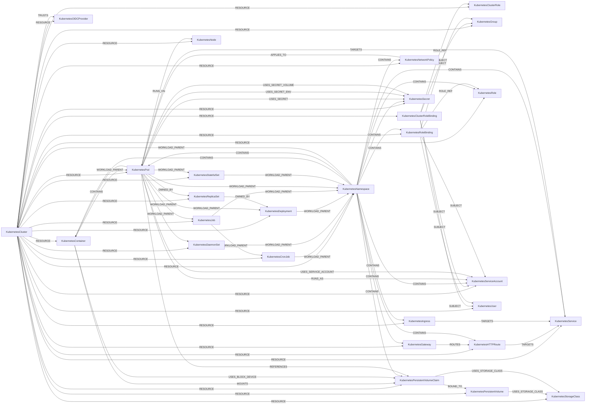

<!-- Generated from the data model. Do not edit manually. -->

## Kubernetes Schema

### KubernetesCluster

A Kubernetes cluster discovered from a kubeconfig context.

> **Ontology Mapping**: This node uses the ontology label [`ComputeCluster`](#ontology-computecluster).

#### Properties

Ontology-generated fields are shown in *italics*.

| Field | Index | Description |
|-------|-------|-------------|
| id | Yes | Identifier for the cluster i.e. UID of `kube-system` namespace. |
| firstseen |  | Timestamp when a sync job first created this node. |
| lastupdated | Yes | Timestamp of the last sync that observed this node. |
| api_server_url |  | Kubernetes API server URL from kubeconfig. |
| compiler |  | Compiler used to build Kubernetes (e.g. gc). |
| creation_timestamp |  | Timestamp of when the cluster was created i.e. creation of `kube-system` namespace. |
| external_id | Yes | Identifier for the cluster fetched from the kubeconfig context. For EKS clusters this should be the `arn`. |
| go_version |  | Version of Go used to compile Kubernetes (e.g. go1.20.5). |
| kubeconfig_ca_file_path |  | CA file path from kubeconfig when `certificate-authority` is configured. |
| kubeconfig_has_certificate_authority_data |  | True when kubeconfig has inline `certificate-authority-data` for this cluster. |
| kubeconfig_has_certificate_authority_file |  | True when kubeconfig has a `certificate-authority` file path for this cluster. |
| kubeconfig_has_client_certificate |  | True when kubeconfig user has a client cert (`client-certificate` or `client-certificate-data`). |
| kubeconfig_has_client_key |  | True when kubeconfig user has a client key (`client-key` or `client-key-data`). |
| kubeconfig_insecure_skip_tls_verify |  | Whether kubeconfig is configured to skip API server TLS verification. |
| kubeconfig_tls_configuration_status |  | Derived kubeconfig TLS posture (`valid_config`, `insecure_skip_tls`, `missing_ca_material`, `unknown`). |
| name | Yes | Name assigned to the cluster which is derived from kubeconfig context. |
| platform |  | Operating system and architecture the cluster is running on (e.g. linux/amd64). |
| version |  | Git version of the Kubernetes cluster (e.g. v1.27.3). |
| version_major |  | Major version number of the Kubernetes cluster (e.g. 1). |
| version_minor |  | Minor version number of the Kubernetes cluster (e.g. 27). |
| *_ont_name* | Yes | Normalized field sourced from `name`. |
| *_ont_source* |  | Module that populated this node's ontology fields. |
| *_ont_version* | Yes | Normalized field sourced from `version`. |

#### Relationships

- `(:AWSEKSCluster)-[:MAPS_TO]->(:KubernetesCluster)`: Links an EKS cluster to the Kubernetes cluster it hosts.

- `(:KubernetesCluster)-[:RESOURCE]->(:KubernetesClusterRole)`: Links a cluster to one of its cluster roles.

- `(:KubernetesCluster)-[:RESOURCE]->(:KubernetesClusterRoleBinding)`: Links a cluster to one of its cluster role bindings.

- `(:KubernetesCluster)-[:RESOURCE]->(:KubernetesContainer)`: Links a cluster to one of its containers.

- `(:KubernetesCluster)-[:RESOURCE]->(:KubernetesCronJob)`: Links a cluster to one of its cron jobs.

- `(:KubernetesCluster)-[:RESOURCE]->(:KubernetesDaemonSet)`: Links a cluster to one of its daemon sets.

- `(:KubernetesCluster)-[:RESOURCE]->(:KubernetesDeployment)`: Links a cluster to one of its deployments.

- `(:KubernetesCluster)-[:RESOURCE]->(:KubernetesGateway)`: Links a cluster to one of its gateways.

- `(:KubernetesCluster)-[:RESOURCE]->(:KubernetesGroup)`: Links a cluster to one of its groups.

- `(:KubernetesCluster)-[:RESOURCE]->(:KubernetesHTTPRoute)`: Links a cluster to one of its HTTP routes.

- `(:KubernetesCluster)-[:RESOURCE]->(:KubernetesIngress)`: Links a cluster to one of its ingresses.

- `(:KubernetesCluster)-[:RESOURCE]->(:KubernetesJob)`: Links a cluster to one of its jobs.

- `(:KubernetesCluster)-[:RESOURCE]->(:KubernetesNamespace)`: Links a cluster to one of its namespaces.

- `(:KubernetesCluster)-[:RESOURCE]->(:KubernetesNetworkPolicy)`: Links a cluster to one of its network policies.

- `(:KubernetesCluster)-[:RESOURCE]->(:KubernetesNode)`: Links a cluster to one of its nodes.

- `(:KubernetesCluster)-[:RESOURCE]->(:KubernetesOIDCProvider)`: Links a cluster to one of its OIDC providers.

- `(:KubernetesCluster)-[:RESOURCE]->(:KubernetesPersistentVolume)`

- `(:KubernetesCluster)-[:RESOURCE]->(:KubernetesPersistentVolumeClaim)`

- `(:KubernetesCluster)-[:RESOURCE]->(:KubernetesPod)`: Links a cluster to a pod running in it.

- `(:KubernetesCluster)-[:RESOURCE]->(:KubernetesReplicaSet)`: Links a cluster to one of its replica sets.

- `(:KubernetesCluster)-[:RESOURCE]->(:KubernetesRole)`: Links a cluster to one of its roles.

- `(:KubernetesCluster)-[:RESOURCE]->(:KubernetesRoleBinding)`: Links a cluster to one of its role bindings.

- `(:KubernetesCluster)-[:RESOURCE]->(:KubernetesSecret)`: Links a cluster to one of its secrets.

- `(:KubernetesCluster)-[:RESOURCE]->(:KubernetesService)`: Links a cluster to one of its services.

- `(:KubernetesCluster)-[:RESOURCE]->(:KubernetesServiceAccount)`: Links a cluster to one of its service accounts.

- `(:KubernetesCluster)-[:RESOURCE]->(:KubernetesStatefulSet)`: Links a cluster to one of its stateful sets.

- `(:KubernetesCluster)-[:RESOURCE]->(:KubernetesStorageClass)`

- `(:KubernetesCluster)-[:RESOURCE]->(:KubernetesUser)`: Links a cluster to one of its users.

- `(:KubernetesCluster)-[:TRUSTS]->(:KubernetesOIDCProvider)`: Links a cluster to an OIDC provider it accepts tokens from.

- `(:KubernetesNamespace)-[:WORKLOAD_PARENT]->(:KubernetesCluster)`: Links a namespace to the cluster it belongs to.

### KubernetesClusterRole

A cluster-scoped Kubernetes RBAC role.

> **Ontology Mapping**: This node uses the ontology label [`PermissionRole`](#ontology-permissionrole).

#### Properties

Ontology-generated fields are shown in *italics*.

| Field | Index | Description |
|-------|-------|-------------|
| id | Yes | Identifier for the ClusterRole derived from cluster_name and name (e.g. `my-cluster/cluster-admin`). |
| firstseen |  | Timestamp when a sync job first created this node. |
| lastupdated | Yes | Timestamp of the last sync that observed this node. |
| api_groups |  | List of API groups that this ClusterRole grants access to (e.g. `["core", "apps"]`). |
| creation_timestamp |  | Timestamp of the creation time of the Kubernetes ClusterRole. |
| name |  | Name of the Kubernetes ClusterRole. |
| resource_version |  | The resource version of the ClusterRole for optimistic concurrency control. |
| resources |  | List of resources that this ClusterRole grants access to (e.g. `["pods", "services"]`). |
| uid |  | UID of the Kubernetes ClusterRole. |
| verbs |  | List of verbs/actions that this ClusterRole allows (e.g. `["get", "list", "create"]`). |
| *_ont_name* | Yes | Normalized field sourced from `name`. |
| *_ont_scope* | Yes | Property generated by the ontology mapping. |
| *_ont_source* |  | Module that populated this node's ontology fields. |

#### Relationships

- `(:KubernetesCluster)-[:RESOURCE]->(:KubernetesClusterRole)`: Links a cluster to one of its cluster roles.

- `(:KubernetesClusterRoleBinding)-[:ROLE_REF]->(:KubernetesClusterRole)`: Links a cluster role binding to the cluster role it grants.

### KubernetesClusterRoleBinding

A cluster-scoped binding between RBAC subjects and a cluster role.

#### Properties

| Field | Index | Description |
|-------|-------|-------------|
| id | Yes | Identifier for the ClusterRoleBinding derived from cluster_name and name (e.g. `my-cluster/cluster-admin-binding`). |
| firstseen |  | Timestamp when a sync job first created this node. |
| lastupdated | Yes | Timestamp of the last sync that observed this node. |
| creation_timestamp |  | Timestamp of the creation time of the Kubernetes ClusterRoleBinding. |
| group_ids |  | Identifiers of bound group subjects. |
| name |  | Name of the Kubernetes ClusterRoleBinding. |
| resource_version |  | The resource version of the ClusterRoleBinding for optimistic concurrency control. |
| role_id |  | Identifier for the target ClusterRole (used for relationship matching). |
| role_kind |  | Kind of the role reference (typically `ClusterRole`). |
| role_name | Yes | Name of the ClusterRole that this ClusterRoleBinding references. |
| service_account_ids |  | Identifiers of bound service account subjects. |
| uid |  | UID of the Kubernetes ClusterRoleBinding. |
| user_ids |  | Identifiers of bound user subjects. |

#### Relationships

- `(:KubernetesCluster)-[:RESOURCE]->(:KubernetesClusterRoleBinding)`: Links a cluster to one of its cluster role bindings.

- `(:KubernetesClusterRoleBinding)-[:ROLE_REF]->(:KubernetesClusterRole)`: Links a cluster role binding to the cluster role it grants.

- `(:KubernetesClusterRoleBinding)-[:SUBJECT]->(:KubernetesGroup)`: Links a cluster role binding to a group it grants its role to.

- `(:KubernetesClusterRoleBinding)-[:SUBJECT]->(:KubernetesServiceAccount)`: Links a cluster role binding to a service account it grants its role to.

- `(:KubernetesClusterRoleBinding)-[:SUBJECT]->(:KubernetesUser)`: Links a cluster role binding to a user it grants its role to.

### KubernetesContainer

A container declared by a Kubernetes pod.

> **Ontology Mapping**: This node uses the ontology label [`Container`](#ontology-container).

#### Properties

Ontology-generated fields are shown in *italics*.

| Field | Index | Description |
|-------|-------|-------------|
| id | Yes | Identifier for the container which is derived from the UID of pod and the name of container. |
| firstseen |  | Timestamp when a sync job first created this node. |
| lastupdated | Yes | Timestamp of the last sync that observed this node. |
| added_capabilities |  | Linux capabilities explicitly added to the container. Derived from `container.security_context.capabilities.add`. |
| allow_privilege_escalation |  | Whether the container explicitly allows privilege escalation. Derived from `container.security_context.allow_privilege_escalation`. |
| architecture_normalized |  | Canonical CPU architecture derived from the scheduled node when available (e.g. `amd64`, `arm64`). |
| cluster_name | Yes | Name of the Kubernetes cluster where this container is deployed. |
| container_port_numbers | Yes | Flat, queryable list of the declared TCP/UDP `containerPort` numbers. Derived from `container.ports[].container_port`. An empty list means the container *declares* no ports; it is not proof that the container listens on nothing, since a process can bind ports it never declared. |
| container_ports |  | The ports the container *declares* in its pod spec. Derived from `container.ports[]`, stored as a JSON-encoded list of `{container_port, protocol, name}`. `containerPort` is optional in Kubernetes, so this reflects declared ports only, not necessarily every port the process listens on. |
| cpu_limit |  | Maximum amount of CPU the container is allowed to use (e.g. "500m", "2"). |
| cpu_request |  | Minimum amount of CPU guaranteed to be available to the container (e.g. "100m", "1"). |
| dropped_capabilities |  | Linux capabilities explicitly dropped by the container. Derived from `container.security_context.capabilities.drop`. |
| exposed_internet | Yes | `True` when the container's pod is targeted by an internet-exposed service. `False` otherwise. |
| exposed_internet_type | Yes | How it is exposed. Always `lb`. |
| gpu_limit | Yes | Total GPU scheduling-unit limit across full-GPU, NVIDIA MIG, and Intel GPU resource keys; heterogeneous units are not normalized to physical GPUs. |
| gpu_request | Yes | Total requested GPU scheduling units across full-GPU, NVIDIA MIG, and Intel GPU resource keys; heterogeneous units are not normalized to physical GPUs. |
| host_ports |  | List of host ports exposed by the container. Derived from `container.ports[].host_port`. |
| image | Yes | Docker image used in the container. |
| image_pull_policy |  | The policy that determines when the kubelet attempts to pull the specified image (Always, Never, IfNotPresent). |
| memory_limit |  | Maximum amount of memory the container is allowed to use (e.g. "256Mi", "2Gi"). |
| memory_request |  | Minimum amount of memory guaranteed to be available to the container (e.g. "128Mi", "1Gi"). |
| name | Yes | Name of the container in kubernetes pod. |
| namespace | Yes | The Kubernetes namespace where this container is deployed. |
| persistent_volume_claim_devices |  | PersistentVolumeClaim raw block device settings from `container.volumeDevices[]`, stored as a JSON-encoded list. |
| persistent_volume_claim_mounts |  | PersistentVolumeClaim mount settings from `container.volumeMounts[]`, stored as a JSON-encoded list. |
| persistent_volume_claim_read_write_ids |  | Identifiers of PersistentVolumeClaims with at least one read-write entry in `container.volumeMounts[]`. |
| region |  | Cloud region associated with the Kubernetes cluster. |
| resource_limits |  | All container resource limits, including extended resources, stored as a JSON-encoded object. |
| resource_requests |  | All container resource requests, including extended resources, stored as a JSON-encoded object. |
| run_as_non_root |  | Whether the container is configured to run as non-root. Derived from `container.security_context.run_as_non_root`. |
| run_as_user |  | Explicit UID configured for the container. Derived from `container.security_context.run_as_user`. |
| seccomp_profile_type |  | Container-level seccomp profile type when set, such as `RuntimeDefault`. Derived from `container.security_context.seccomp_profile.type`. |
| status_image_id |  | Runtime-reported image identifier for the container. This may differ from the declared `image` field because the container runtime can rewrite tags or parent image indexes to digest-qualified references. |
| status_image_sha | Yes | The SHA portion of the runtime-reported `status_image_id` when Cartography can extract it. |
| status_ready |  | Specifies whether the container has passed its readiness probe. |
| status_started |  | Specifies whether the container has passed its startup probe. |
| status_state | Yes | State of the container (running, terminated, waiting). |
| *_ont_image* | Yes | Normalized field sourced from `image`. |
| *_ont_image_digest* | Yes | Normalized field sourced from `status_image_sha`. |
| *_ont_name* | Yes | Normalized field sourced from `name`. |
| *_ont_namespace* | Yes | Normalized field sourced from `namespace`. |
| *_ont_region* | Yes | Normalized field sourced from `region`. |
| *_ont_source* |  | Module that populated this node's ontology fields. |
| *_ont_state* | Yes | Normalized field sourced from `status_state`. |

#### Relationships

- `(:KubernetesNamespace)-[:CONTAINS]->(:KubernetesContainer)`: Links a namespace to a container it contains.

- `(:KubernetesPod)-[:CONTAINS]->(:KubernetesContainer)`: Links a pod to a container it runs.

- `(:AWSLoadBalancerV2)-[:EXPOSE]->(:KubernetesContainer)`: generated by analysis job `Kubernetes LoadBalancer to container EXPOSE relationships`.
  - Properties:

    | Field | Description |
    |-------|-------------|
    | exposure_type | Property generated by analysis job: `Kubernetes LoadBalancer to container EXPOSE relationships`. |

- `(:KubernetesContainer)-[:HAS_IMAGE]->(:AWSECRImage)`: Links a container to the image it runs, hosted in Amazon ECR.

- `(:KubernetesContainer)-[:HAS_IMAGE]->(:GCPArtifactRegistryImage)`: Links a container to the image it runs, hosted in Artifact Registry.

- `(:KubernetesContainer)-[:HAS_IMAGE]->(:GitHubContainerImage)`: Links a container to the image it runs, hosted in GitHub Container Registry.

- `(:KubernetesContainer)-[:HAS_IMAGE]->(:GitLabContainerImage)`: Links a container to the image it runs, hosted in the GitLab registry.

- `(:KubernetesContainer)-[:MOUNTS]->(:KubernetesPersistentVolumeClaim)`: Links a container to a PersistentVolumeClaim mounted as a filesystem.

- `(:KubernetesContainer)-[:RESOLVED_IMAGE]->(:Image)`: generated by analysis job `Container RESOLVED_IMAGE analysis`.

- `(:KubernetesCluster)-[:RESOURCE]->(:KubernetesContainer)`: Links a cluster to one of its containers.

- `(:KubernetesContainer)-[:USES_BLOCK_DEVICE]->(:KubernetesPersistentVolumeClaim)`: Links a container to a PersistentVolumeClaim exposed as a block device.

- `(:KubernetesContainer)-[:WORKLOAD_PARENT]->(:KubernetesPod)`: Links a container to the pod it runs in.

### KubernetesCronJob

A Kubernetes CronJob that creates Jobs on a recurring schedule.

> **Ontology Mapping**: This node uses the ontology label [`ComputeService`](#ontology-computeservice).

#### Properties

Ontology-generated fields are shown in *italics*.

| Field | Index | Description |
|-------|-------|-------------|
| id | Yes | UID of the Kubernetes CronJob. |
| firstseen |  | Timestamp when a sync job first created this node. |
| lastupdated | Yes | Timestamp of the last sync that observed this node. |
| cluster_name | Yes | Name of the Kubernetes cluster containing the CronJob. |
| creation_timestamp |  | Timestamp when the Kubernetes CronJob was created. |
| deletion_timestamp |  | Timestamp when the Kubernetes CronJob was marked for deletion. |
| labels |  | Metadata labels on the CronJob, stored as a JSON-encoded string. |
| name | Yes | Name of the Kubernetes CronJob. |
| namespace | Yes | Kubernetes namespace containing the CronJob. |
| schedule |  | Cron schedule used to create Jobs. |
| suspend |  | Whether creation of new Jobs is suspended. |
| *_ont_name* | Yes | Normalized field sourced from `name`. |
| *_ont_source* |  | Module that populated this node's ontology fields. |

#### Relationships

- `(:KubernetesCronJob)-[:HAS_RUNTIME_IMAGE]->(:Image)`: generated by analysis job `Workload HAS_RUNTIME_IMAGE inventory analysis`.
  - Properties:

    | Field | Description |
    |-------|-------------|
    | exposed_internet | Property generated by analysis job: `Workload HAS_RUNTIME_IMAGE inventory analysis`. |

- `(:KubernetesCluster)-[:RESOURCE]->(:KubernetesCronJob)`: Links a cluster to one of its cron jobs.

- `(:KubernetesJob)-[:WORKLOAD_PARENT]->(:KubernetesCronJob)`: Links a job to the cron job that created it.

- `(:KubernetesCronJob)-[:WORKLOAD_PARENT]->(:KubernetesNamespace)`: Links a cron job to the namespace that owns it.

### KubernetesDaemonSet

A Kubernetes DaemonSet that runs pods across selected cluster nodes.

> **Ontology Mapping**: This node uses the ontology label [`ComputeService`](#ontology-computeservice).

#### Properties

Ontology-generated fields are shown in *italics*.

| Field | Index | Description |
|-------|-------|-------------|
| id | Yes | UID of the Kubernetes DaemonSet. |
| firstseen |  | Timestamp when a sync job first created this node. |
| lastupdated | Yes | Timestamp of the last sync that observed this node. |
| cluster_name | Yes | Name of the Kubernetes cluster containing the DaemonSet. |
| creation_timestamp |  | Timestamp when the Kubernetes DaemonSet was created. |
| deletion_timestamp |  | Timestamp when the Kubernetes DaemonSet was marked for deletion. |
| desired_number_scheduled |  | Number of nodes that should run a pod from the DaemonSet. |
| labels |  | Metadata labels on the DaemonSet, stored as a JSON-encoded string. |
| name | Yes | Name of the Kubernetes DaemonSet. |
| namespace | Yes | Kubernetes namespace containing the DaemonSet. |
| number_ready |  | Number of nodes running a ready pod from the DaemonSet. |
| *_ont_name* | Yes | Normalized field sourced from `name`. |
| *_ont_source* |  | Module that populated this node's ontology fields. |

#### Relationships

- `(:KubernetesDaemonSet)-[:HAS_RUNTIME_IMAGE]->(:Image)`: generated by analysis job `Workload HAS_RUNTIME_IMAGE inventory analysis`.
  - Properties:

    | Field | Description |
    |-------|-------------|
    | exposed_internet | Property generated by analysis job: `Workload HAS_RUNTIME_IMAGE inventory analysis`. |

- `(:KubernetesCluster)-[:RESOURCE]->(:KubernetesDaemonSet)`: Links a cluster to one of its daemon sets.

- `(:KubernetesDaemonSet)-[:WORKLOAD_PARENT]->(:KubernetesNamespace)`: Links a daemon set to the namespace that owns it.

- `(:KubernetesPod)-[:WORKLOAD_PARENT]->(:KubernetesDaemonSet)`

### KubernetesDeployment

A Kubernetes Deployment that manages a replicated application workload.

> **Ontology Mapping**: This node uses the ontology label [`ComputeService`](#ontology-computeservice).

#### Properties

Ontology-generated fields are shown in *italics*.

| Field | Index | Description |
|-------|-------|-------------|
| id | Yes | UID of the Kubernetes Deployment. |
| firstseen |  | Timestamp when a sync job first created this node. |
| lastupdated | Yes | Timestamp of the last sync that observed this node. |
| available_replicas |  | Number of pod replicas that are available. |
| cluster_name | Yes | Name of the Kubernetes cluster containing the Deployment. |
| creation_timestamp |  | Timestamp when the Kubernetes Deployment was created. |
| deletion_timestamp |  | Timestamp when the Kubernetes Deployment was marked for deletion. |
| labels |  | Metadata labels on the Deployment, stored as a JSON-encoded string. |
| name | Yes | Name of the Kubernetes Deployment. |
| namespace | Yes | Kubernetes namespace containing the Deployment. |
| ready_replicas |  | Number of pod replicas that are ready. |
| replicas |  | Desired number of pod replicas. |
| *_ont_name* | Yes | Normalized field sourced from `name`. |
| *_ont_source* |  | Module that populated this node's ontology fields. |

#### Relationships

- `(:KubernetesDeployment)-[:HAS_RUNTIME_IMAGE]->(:Image)`: generated by analysis job `Workload HAS_RUNTIME_IMAGE inventory analysis`.
  - Properties:

    | Field | Description |
    |-------|-------------|
    | exposed_internet | Property generated by analysis job: `Workload HAS_RUNTIME_IMAGE inventory analysis`. |

- `(:KubernetesReplicaSet)-[:OWNED_BY]->(:KubernetesDeployment)`: Links a replica set to the deployment that manages it.

- `(:KubernetesCluster)-[:RESOURCE]->(:KubernetesDeployment)`: Links a cluster to one of its deployments.

- `(:KubernetesDeployment)-[:WORKLOAD_PARENT]->(:KubernetesNamespace)`: Links a deployment to the namespace that owns it.

- `(:KubernetesPod)-[:WORKLOAD_PARENT]->(:KubernetesDeployment)`

### KubernetesGateway

A Gateway API gateway that accepts traffic for attached routes.

#### Properties

| Field | Index | Description |
|-------|-------|-------------|
| id | Yes | UID of the Gateway. |
| firstseen |  | Timestamp when a sync job first created this node. |
| lastupdated | Yes | Timestamp of the last sync that observed this node. |
| cluster_name | Yes | Name of the Kubernetes cluster where this Gateway is deployed. |
| creation_timestamp |  | Epoch seconds of `metadata.creationTimestamp`. |
| deletion_timestamp |  | Epoch seconds of `metadata.deletionTimestamp`. |
| gateway_class_name |  | Name of the `GatewayClass` referenced by `spec.gatewayClassName`. |
| name | Yes | Name of the Gateway. |
| namespace | Yes | The Kubernetes namespace where this Gateway is deployed. |
| qualified_name | Yes | `<namespace>/<name>` identifier used to match the Gateway from `HTTPRoute.spec.parentRefs`. |

#### Relationships

- `(:KubernetesNamespace)-[:CONTAINS]->(:KubernetesGateway)`: Links a namespace to a gateway it contains.

- `(:KubernetesCluster)-[:RESOURCE]->(:KubernetesGateway)`: Links a cluster to one of its gateways.

- `(:KubernetesGateway)-[:ROUTES]->(:KubernetesHTTPRoute)`: Links a gateway to an HTTP route attached to it.

### KubernetesGroup

A group identity referenced by Kubernetes RBAC.

> **Ontology Mapping**: This node uses the ontology label [`UserGroup`](#ontology-usergroup).

#### Properties

Ontology-generated fields are shown in *italics*.

| Field | Index | Description |
|-------|-------|-------------|
| id | Yes | Identifier for the group. |
| firstseen |  | Timestamp when a sync job first created this node. |
| lastupdated | Yes | Timestamp of the last sync that observed this node. |
| cluster_name |  | Name of the cluster this group belongs to. |
| name |  | Name of the Kubernetes group. |
| *_ont_name* | Yes | Normalized field sourced from `name`. |
| *_ont_source* |  | Module that populated this node's ontology fields. |

#### Relationships

- `(:AWSRole)-[:MAPS_TO]->(:KubernetesGroup)`: Links an AWS IAM role to the Kubernetes group it maps to.

- `(:AWSUser)-[:MAPS_TO]->(:KubernetesGroup)`: Links an AWS IAM user to the Kubernetes group it maps to.

- `(:OktaGroup)-[:MEMBER_OF]->(:KubernetesGroup)`: Links an Okta group to the Kubernetes group its members join.

- `(:KubernetesCluster)-[:RESOURCE]->(:KubernetesGroup)`: Links a cluster to one of its groups.

- `(:KubernetesClusterRoleBinding)-[:SUBJECT]->(:KubernetesGroup)`: Links a cluster role binding to a group it grants its role to.

- `(:KubernetesRoleBinding)-[:SUBJECT]->(:KubernetesGroup)`: Links a role binding to a group it grants its role to.

### KubernetesHTTPRoute

A Gateway API HTTPRoute that forwards traffic to services.

#### Properties

| Field | Index | Description |
|-------|-------|-------------|
| id | Yes | UID of the HTTPRoute. |
| firstseen |  | Timestamp when a sync job first created this node. |
| lastupdated | Yes | Timestamp of the last sync that observed this node. |
| cluster_name | Yes | Name of the Kubernetes cluster where this HTTPRoute is deployed. |
| creation_timestamp |  | Epoch seconds of `metadata.creationTimestamp`. |
| deletion_timestamp |  | Epoch seconds of `metadata.deletionTimestamp`. |
| hostnames |  | List of hostnames from `spec.hostnames`. |
| name | Yes | Name of the HTTPRoute. |
| namespace | Yes | The Kubernetes namespace where this HTTPRoute is deployed. |
| qualified_name | Yes | `<namespace>/<name>` identifier used to match this HTTPRoute from `Gateway` parents. |

#### Relationships

- `(:KubernetesNamespace)-[:CONTAINS]->(:KubernetesHTTPRoute)`: Links a namespace to a HTTP route it contains.

- `(:KubernetesCluster)-[:RESOURCE]->(:KubernetesHTTPRoute)`: Links a cluster to one of its HTTP routes.

- `(:KubernetesGateway)-[:ROUTES]->(:KubernetesHTTPRoute)`: Links a gateway to an HTTP route attached to it.

- `(:KubernetesHTTPRoute)-[:TARGETS]->(:KubernetesService)`: Links an HTTP route to a service it forwards traffic to.

### KubernetesIngress

A Kubernetes ingress that routes external traffic to services.

#### Properties

| Field | Index | Description |
|-------|-------|-------------|
| id | Yes | UID of the Kubernetes Ingress. |
| firstseen |  | Timestamp when a sync job first created this node. |
| lastupdated | Yes | Timestamp of the last sync that observed this node. |
| annotations |  | Annotations on the Ingress resource. Stored as a JSON-encoded string. Contains controller-specific configuration. |
| cluster_name |  | Name of the Kubernetes cluster where this Ingress is deployed. |
| creation_timestamp |  | Timestamp of the creation time of the Kubernetes Ingress. |
| default_backend |  | A default backend capable of servicing requests that don't match any rule. Stored as a JSON-encoded string. |
| deletion_timestamp |  | Timestamp of the deletion time of the Kubernetes Ingress. |
| host_names |  | Hostnames configured by the ingress rules. |
| ingress_class_name |  | The name of the IngressClass cluster resource. Specifies which controller will implement the ingress (e.g. `nginx`, `alb`). |
| ingress_group_name | Yes | The ingress group name from the `alb.ingress.kubernetes.io/group.name` annotation (AWS Load Balancer Controller). Allows multiple Ingresses to share a single ALB. |
| load_balancer_dns_names |  | List of DNS hostnames from the Ingress status. Used to match to cloud load balancers (e.g., AWS ALB). |
| name |  | Name of the Kubernetes Ingress. |
| namespace | Yes | The Kubernetes namespace where this Ingress is deployed. |
| rules |  | The list of host rules used to configure the Ingress. Stored as a JSON-encoded string containing host/path routing rules. |

#### Relationships

- `(:KubernetesNamespace)-[:CONTAINS]->(:KubernetesIngress)`: Links a namespace to an ingress it contains.

- `(:DNSRecord)-[:DNS_POINTS_TO]->(:KubernetesIngress)`: generated by analysis job `Ontology - DNSRecord to KubernetesIngress linking`.

- `(:KubernetesCluster)-[:RESOURCE]->(:KubernetesIngress)`: Links a cluster to one of its ingresses.

- `(:KubernetesIngress)-[:TARGETS]->(:KubernetesService)`: Links an ingress to a service it routes traffic to.

- `(:KubernetesIngress)-[:USES_LOAD_BALANCER]->(:AWSLoadBalancerV2)`: Links an ingress to the AWS load balancer that exposes it, matched by the DNS hostname from the ingress status to the load balancer's DNS name; both are lowercased at ingestion.

### KubernetesJob

A Kubernetes Job that runs pods to completion.

> **Ontology Mapping**: This node uses the ontology label [`ComputeService`](#ontology-computeservice).

#### Properties

Ontology-generated fields are shown in *italics*.

| Field | Index | Description |
|-------|-------|-------------|
| id | Yes | UID of the Kubernetes Job. |
| firstseen |  | Timestamp when a sync job first created this node. |
| lastupdated | Yes | Timestamp of the last sync that observed this node. |
| active |  | Number of pods currently running for the Job. |
| cluster_name | Yes | Name of the Kubernetes cluster containing the Job. |
| completions |  | Desired number of successfully completed pods. |
| creation_timestamp |  | Timestamp when the Kubernetes Job was created. |
| deletion_timestamp |  | Timestamp when the Kubernetes Job was marked for deletion. |
| failed |  | Number of pods that completed unsuccessfully. |
| labels |  | Metadata labels on the Job, stored as a JSON-encoded string. |
| name | Yes | Name of the Kubernetes Job. |
| namespace | Yes | Kubernetes namespace containing the Job. |
| parallelism |  | Maximum number of pods that may run in parallel. |
| succeeded |  | Number of pods that completed successfully. |
| *_ont_name* | Yes | Normalized field sourced from `name`. |
| *_ont_source* |  | Module that populated this node's ontology fields. |

#### Relationships

- `(:KubernetesJob)-[:HAS_RUNTIME_IMAGE]->(:Image)`: generated by analysis job `Workload HAS_RUNTIME_IMAGE inventory analysis`.
  - Properties:

    | Field | Description |
    |-------|-------------|
    | exposed_internet | Property generated by analysis job: `Workload HAS_RUNTIME_IMAGE inventory analysis`. |

- `(:KubernetesCluster)-[:RESOURCE]->(:KubernetesJob)`: Links a cluster to one of its jobs.

- `(:KubernetesJob)-[:WORKLOAD_PARENT]->(:KubernetesCronJob)`: Links a job to the cron job that created it.

- `(:KubernetesJob)-[:WORKLOAD_PARENT]->(:KubernetesNamespace)`: Links a job to the namespace that owns it.

- `(:KubernetesPod)-[:WORKLOAD_PARENT]->(:KubernetesJob)`

### KubernetesNamespace

A namespace that scopes resources in a Kubernetes cluster.

> **Ontology Mapping**: This node uses the ontology label [`ComputeNamespace`](#ontology-computenamespace).

#### Properties

Ontology-generated fields are shown in *italics*.

| Field | Index | Description |
|-------|-------|-------------|
| id | Yes | UID of the Kubernetes namespace. |
| firstseen |  | Timestamp when a sync job first created this node. |
| lastupdated | Yes | Timestamp of the last sync that observed this node. |
| cluster_name | Yes | The name of the Kubernetes cluster this namespace belongs to. |
| creation_timestamp |  | Timestamp of the creation time of the Kubernetes namespace. |
| deletion_timestamp |  | Timestamp of the deletion time of the Kubernetes namespace. |
| name | Yes | Name of the Kubernetes namespace. |
| status_phase |  | The phase of a Kubernetes namespace indicates whether it is active, terminating, or terminated. |
| *_ont_name* | Yes | Normalized field sourced from `name`. |
| *_ont_source* |  | Module that populated this node's ontology fields. |
| *_ont_status* | Yes | Normalized field sourced from `status_phase`. |

#### Relationships

- `(:KubernetesNamespace)-[:CONTAINS]->(:KubernetesContainer)`: Links a namespace to a container it contains.

- `(:KubernetesNamespace)-[:CONTAINS]->(:KubernetesGateway)`: Links a namespace to a gateway it contains.

- `(:KubernetesNamespace)-[:CONTAINS]->(:KubernetesHTTPRoute)`: Links a namespace to a HTTP route it contains.

- `(:KubernetesNamespace)-[:CONTAINS]->(:KubernetesIngress)`: Links a namespace to an ingress it contains.

- `(:KubernetesNamespace)-[:CONTAINS]->(:KubernetesNetworkPolicy)`: Links a namespace to a network policy it contains.

- `(:KubernetesNamespace)-[:CONTAINS]->(:KubernetesPersistentVolumeClaim)`

- `(:KubernetesNamespace)-[:CONTAINS]->(:KubernetesPod)`: Links a namespace to a pod it contains.

- `(:KubernetesNamespace)-[:CONTAINS]->(:KubernetesRole)`: Links a namespace to a role it contains.

- `(:KubernetesNamespace)-[:CONTAINS]->(:KubernetesRoleBinding)`: Links a namespace to a role binding it contains.

- `(:KubernetesNamespace)-[:CONTAINS]->(:KubernetesSecret)`: Links a namespace to a secret it contains.

- `(:KubernetesNamespace)-[:CONTAINS]->(:KubernetesService)`: Links a namespace to a service it contains.

- `(:KubernetesNamespace)-[:CONTAINS]->(:KubernetesServiceAccount)`: Links a namespace to a service account it contains.

- `(:KubernetesCluster)-[:RESOURCE]->(:KubernetesNamespace)`: Links a cluster to one of its namespaces.

- `(:KubernetesNamespace)-[:WORKLOAD_PARENT]->(:KubernetesCluster)`: Links a namespace to the cluster it belongs to.

- `(:KubernetesCronJob)-[:WORKLOAD_PARENT]->(:KubernetesNamespace)`: Links a cron job to the namespace that owns it.

- `(:KubernetesDaemonSet)-[:WORKLOAD_PARENT]->(:KubernetesNamespace)`: Links a daemon set to the namespace that owns it.

- `(:KubernetesDeployment)-[:WORKLOAD_PARENT]->(:KubernetesNamespace)`: Links a deployment to the namespace that owns it.

- `(:KubernetesJob)-[:WORKLOAD_PARENT]->(:KubernetesNamespace)`: Links a job to the namespace that owns it.

- `(:KubernetesPod)-[:WORKLOAD_PARENT]->(:KubernetesNamespace)`: Links a pod to the namespace that owns it.

- `(:KubernetesStatefulSet)-[:WORKLOAD_PARENT]->(:KubernetesNamespace)`: Links a stateful set to the namespace that owns it.

### KubernetesNetworkPolicy

A Kubernetes network policy that controls pod traffic.

#### Properties

| Field | Index | Description |
|-------|-------|-------------|
| id | Yes | UID of the network policy. |
| firstseen |  | Timestamp when a sync job first created this node. |
| lastupdated | Yes | Timestamp of the last sync that observed this node. |
| cluster_name | Yes | Name of the Kubernetes cluster where this network policy is defined. |
| creation_timestamp |  | Timestamp of the creation time of the network policy. |
| deletion_timestamp |  | Timestamp of the deletion time of the network policy. |
| egress_rules |  | The `spec.egress` rule set (to-peers and ports), stored as a JSON-encoded string. |
| ingress_rules |  | The `spec.ingress` rule set (from-peers and ports), stored as a JSON-encoded string. |
| name | Yes | Name of the network policy. |
| namespace | Yes | The Kubernetes namespace where this network policy is defined. |
| pod_selector |  | The `spec.podSelector` selecting the pods this policy applies to, stored as a JSON-encoded `{match_labels, match_expressions}`. An empty selector selects every pod in the namespace. |
| policy_types |  | List of policy types the policy governs, e.g. `['Ingress']`, `['Ingress', 'Egress']`. |
| restricts_egress |  | `true` when `Egress` is in `policy_types`: the selected pods are default-deny for egress except for what `egress_rules` admit. |
| restricts_ingress |  | `true` when `Ingress` is in `policy_types`: the selected pods are default-deny for ingress except for what `ingress_rules` admit. |

#### Relationships

- `(:KubernetesNetworkPolicy)-[:APPLIES_TO]->(:KubernetesPod)`: Links a network policy to a pod its selector matches.

- `(:KubernetesNamespace)-[:CONTAINS]->(:KubernetesNetworkPolicy)`: Links a namespace to a network policy it contains.

- `(:KubernetesCluster)-[:RESOURCE]->(:KubernetesNetworkPolicy)`: Links a cluster to one of its network policies.

### KubernetesNode

A worker node registered with a Kubernetes cluster.

#### Properties

| Field | Index | Description |
|-------|-------|-------------|
| id | Yes | Identifier for the node derived from cluster name and node name (e.g. `my-cluster/my-node`). |
| firstseen |  | Timestamp when a sync job first created this node. |
| lastupdated | Yes | Timestamp of the last sync that observed this node. |
| allocatable |  | Node allocatable resources from `status.allocatable`, stored as a JSON-encoded object. |
| architecture |  | Raw CPU architecture as reported by the node (e.g. `amd64`, `arm64`). |
| architecture_normalized |  | Canonical CPU architecture after normalization (e.g. `x86_64` → `amd64`, `aarch64` → `arm64`). |
| capacity |  | Node resource capacity from `status.capacity`, stored as a JSON-encoded object. |
| cluster_name | Yes | Name of the Kubernetes cluster this node belongs to. |
| container_runtime_version |  | Container runtime and version (e.g. `containerd://1.7.0`). |
| gpu_allocatable |  | Total allocatable GPU scheduling units across full-GPU, NVIDIA MIG, and Intel GPU resource keys; heterogeneous units are not normalized to physical GPUs. |
| gpu_capacity |  | Total GPU scheduling-unit capacity across full-GPU, NVIDIA MIG, and Intel GPU resource keys; heterogeneous units are not normalized to physical GPUs. |
| gpu_product | Yes | GPU product reported by the standard NVIDIA GPU Feature Discovery or GKE accelerator label. |
| instance_id | Yes | EC2 instance id parsed from `provider_id` for EKS nodes (e.g. `i-0123456789abcdef0`); null for non-AWS providers. |
| kernel_version |  | Kernel version of the node (e.g. `5.15.0-1034-aws`). |
| kubelet_version |  | Version of the kubelet running on the node (e.g. `v1.27.1`). |
| labels |  | Node metadata labels stored as a JSON-encoded object. |
| name | Yes | Name of the Kubernetes node. |
| os |  | Operating system of the node (e.g. `linux`). |
| os_image |  | Human-readable OS image name (e.g. `Ubuntu 22.04.3 LTS`). |
| provider_id |  | Cloud provider instance reference from the node's `spec.providerID` (e.g. EKS: `aws:///us-east-1a/i-0123456789abcdef0`). |

#### Relationships

- `(:KubernetesNode)-[:IS_INSTANCE]->(:AWSEC2Instance)`: Links a node to the EC2 instance backing it.

- `(:KubernetesCluster)-[:RESOURCE]->(:KubernetesNode)`: Links a cluster to one of its nodes.

- `(:KubernetesPod)-[:RUNS_ON]->(:KubernetesNode)`: Links a pod to the node it is scheduled on.

### KubernetesOIDCProvider

An external OIDC identity provider trusted by a Kubernetes cluster.

> **Ontology Mapping**: This node uses the ontology label [`IdentityProvider`](#ontology-identityprovider).

#### Properties

Ontology-generated fields are shown in *italics*.

| Field | Index | Description |
|-------|-------|-------------|
| id | Yes | Identifier for the OIDC Provider derived from cluster name and provider name (e.g. `my-cluster/oidc/auth0-provider`). |
| firstseen |  | Timestamp when a sync job first created this node. |
| lastupdated | Yes | Timestamp of the last sync that observed this node. |
| client_id |  | OIDC client ID used for authentication. |
| cluster_name |  | Name of the Kubernetes cluster this provider is associated with. |
| issuer_url |  | URL of the OIDC issuer (e.g. `https://company.auth0.com/`). |
| k8s_platform |  | Type of Kubernetes platform managing this OIDC configuration (e.g. `eks` for AWS EKS, `aks` for Azure AKS). |
| name |  | Name of the OIDC provider configuration. |
| status |  | Status of the OIDC provider configuration (e.g. `ACTIVE`). |
| *_ont_enabled* | Yes | Normalized field sourced from `status`. |
| *_ont_issuer* | Yes | Normalized field sourced from `issuer_url`. |
| *_ont_name* | Yes | Normalized field sourced from `name`. |
| *_ont_protocol* | Yes | Property generated by the ontology mapping. |
| *_ont_source* |  | Module that populated this node's ontology fields. |

#### Relationships

- `(:KubernetesCluster)-[:RESOURCE]->(:KubernetesOIDCProvider)`: Links a cluster to one of its OIDC providers.

- `(:KubernetesCluster)-[:TRUSTS]->(:KubernetesOIDCProvider)`: Links a cluster to an OIDC provider it accepts tokens from.

### KubernetesPersistentVolume

Cluster-scoped persistent storage available to Kubernetes workloads.

#### Properties

| Field | Index | Description |
|-------|-------|-------------|
| id | Yes | Identifier derived from cluster name and PersistentVolume name. |
| firstseen |  | Timestamp when a sync job first created this node. |
| lastupdated | Yes | Timestamp of the last sync that observed this node. |
| access_modes |  | Ways the volume can be mounted, such as ReadWriteOnce or ReadWriteMany. |
| aws_ebs_volume_id |  | AWS EBS volume ID when managed by the AWS EBS CSI driver. |
| azure_disk_id |  | Azure managed disk resource ID when managed by the Azure Disk CSI driver. |
| capacity_storage |  | Storage capacity reported by `spec.capacity.storage`. |
| capacity_storage_bytes |  | Storage capacity in bytes. |
| claim_name |  | Name of the bound PersistentVolumeClaim, when present. |
| claim_namespace |  | Namespace of the bound PersistentVolumeClaim, when present. |
| cluster_name | Yes | Name of the Kubernetes cluster containing this PersistentVolume. |
| creation_timestamp |  | Timestamp when the PersistentVolume was created. |
| csi_driver | Yes | CSI driver that manages the volume, when the volume uses CSI. |
| csi_volume_handle |  | CSI driver volume handle for the backing storage resource. |
| deletion_timestamp |  | Timestamp when the PersistentVolume was marked for deletion. |
| labels |  | PersistentVolume metadata labels stored as a JSON-encoded object. |
| name | Yes | Name of the PersistentVolume. |
| phase | Yes | Current PersistentVolume phase. |
| reclaim_policy |  | What happens to the volume after its claim is released. |
| storage_class_name | Yes | Name of the StorageClass associated with the volume. |
| uid |  | Kubernetes UID of the PersistentVolume. |
| volume_mode |  | Whether the volume is exposed as a filesystem or block device. |

#### Relationships

- `(:KubernetesPersistentVolume)-[:BACKED_BY]->(:AWSEBSVolume)`: Links a PersistentVolume to its backing AWS EBS volume.

- `(:KubernetesPersistentVolume)-[:BACKED_BY]->(:AzureDisk)`: Links a PersistentVolume to its backing Azure managed disk.

- `(:KubernetesPersistentVolumeClaim)-[:BOUND_TO]->(:KubernetesPersistentVolume)`

- `(:KubernetesCluster)-[:RESOURCE]->(:KubernetesPersistentVolume)`

- `(:KubernetesPersistentVolume)-[:USES_STORAGE_CLASS]->(:KubernetesStorageClass)`

### KubernetesPersistentVolumeClaim

A namespace-scoped request for persistent storage.

#### Properties

| Field | Index | Description |
|-------|-------|-------------|
| id | Yes | Identifier derived from cluster name, namespace, and claim name. |
| firstseen |  | Timestamp when a sync job first created this node. |
| lastupdated | Yes | Timestamp of the last sync that observed this node. |
| access_modes |  | Requested volume access modes. |
| cluster_name | Yes | Name of the Kubernetes cluster containing this claim. |
| creation_timestamp |  | Timestamp when the PersistentVolumeClaim was created. |
| deletion_timestamp |  | Timestamp when the PersistentVolumeClaim was marked for deletion. |
| labels |  | PersistentVolumeClaim metadata labels stored as a JSON-encoded object. |
| name | Yes | Name of the PersistentVolumeClaim. |
| namespace | Yes | Namespace containing the PersistentVolumeClaim. |
| phase | Yes | Current PersistentVolumeClaim phase. |
| requested_storage |  | Storage quantity requested by the claim. |
| requested_storage_bytes |  | Storage requested by the claim in bytes. |
| storage_class_name | Yes | Name of the StorageClass requested by the claim. |
| uid |  | Kubernetes UID of the PersistentVolumeClaim. |
| volume_mode |  | Whether the claim requests a filesystem or block device. |
| volume_name |  | Name of the PersistentVolume bound to the claim. |

#### Relationships

- `(:KubernetesPersistentVolumeClaim)-[:BOUND_TO]->(:KubernetesPersistentVolume)`

- `(:KubernetesNamespace)-[:CONTAINS]->(:KubernetesPersistentVolumeClaim)`

- `(:KubernetesContainer)-[:MOUNTS]->(:KubernetesPersistentVolumeClaim)`: Links a container to a PersistentVolumeClaim mounted as a filesystem.

- `(:KubernetesPod)-[:REFERENCES]->(:KubernetesPersistentVolumeClaim)`: Links a pod to a PersistentVolumeClaim referenced by one of its volumes.

- `(:KubernetesCluster)-[:RESOURCE]->(:KubernetesPersistentVolumeClaim)`

- `(:KubernetesContainer)-[:USES_BLOCK_DEVICE]->(:KubernetesPersistentVolumeClaim)`: Links a container to a PersistentVolumeClaim exposed as a block device.

- `(:KubernetesPersistentVolumeClaim)-[:USES_STORAGE_CLASS]->(:KubernetesStorageClass)`

### KubernetesPod

A Kubernetes pod and its workload security configuration.

> **Ontology Mapping**: This node uses the ontology label [`ComputePod`](#ontology-computepod).

#### Properties

Ontology-generated fields are shown in *italics*.

| Field | Index | Description |
|-------|-------|-------------|
| id | Yes | UID of the Kubernetes pod. |
| firstseen |  | Timestamp when a sync job first created this node. |
| lastupdated | Yes | Timestamp of the last sync that observed this node. |
| architecture_normalized |  | Canonical CPU architecture derived from the scheduled node when available (e.g. `amd64`, `arm64`). |
| automount_service_account_token |  | Pod-level override for whether a service account token is automatically mounted. Derived from `pod.spec.automount_service_account_token`. |
| cluster_name | Yes | Name of the Kubernetes cluster where this pod is deployed. |
| creation_timestamp |  | Timestamp of the creation time of the Kubernetes pod. |
| deletion_timestamp |  | Timestamp of the deletion time of the Kubernetes pod. |
| exposed_internet | Yes | Set by analysis job. `true` if this pod is reachable from an internet-facing load balancer. |
| exposed_internet_type | Yes | How the pod is exposed. Always `lb`. |
| host_ipc |  | Whether the pod shares the host IPC namespace. Derived from `pod.spec.host_ipc`. |
| host_network | Yes | Whether the pod shares the host network namespace. Derived from `pod.spec.host_network`. |
| host_path_volume_paths |  | List of host filesystem paths mounted via `hostPath` pod volumes. Derived from `pod.spec.volumes[].host_path.path`. |
| host_pid |  | Whether the pod shares the host PID namespace. Derived from `pod.spec.host_pid`. |
| labels |  | Labels are key-value pairs contained in the `PodSpec` and fetched from `pod.metadata.labels`. Stored as a JSON-encoded string. |
| name | Yes | Name of the Kubernetes pod. |
| namespace | Yes | The Kubernetes namespace where this pod is deployed. |
| node |  | Name of the Kubernetes node where this pod is currently scheduled and running. Fetched from `pod.spec.node_name`. |
| persistent_volume_claim_names |  | Names of PersistentVolumeClaims referenced by pod volumes. |
| seccomp_profile_type |  | Pod-level seccomp profile type when set, such as `RuntimeDefault`. Derived from `pod.spec.security_context.seccomp_profile.type`. |
| service_account_name |  | Name of the ServiceAccount used by the pod. Derived from `pod.spec.service_account_name` and defaults to `default` when unset. |
| status_phase |  | The phase of a Pod is a simple, high-level summary of where the Pod is in its lifecycle. |
| *_ont_name* | Yes | Normalized field sourced from `name`. |
| *_ont_namespace* | Yes | Normalized field sourced from `namespace`. |
| *_ont_node* | Yes | Normalized field sourced from `node`. |
| *_ont_source* |  | Module that populated this node's ontology fields. |
| *_ont_status* | Yes | Normalized field sourced from `status_phase`. |

#### Relationships

- `(:KubernetesNetworkPolicy)-[:APPLIES_TO]->(:KubernetesPod)`: Links a network policy to a pod its selector matches.

- `(:KubernetesPod)-[:CONTAINS]->(:KubernetesContainer)`: Links a pod to a container it runs.

- `(:KubernetesNamespace)-[:CONTAINS]->(:KubernetesPod)`: Links a namespace to a pod it contains.

- `(:AWSLoadBalancerV2)-[:EXPOSE]->(:KubernetesPod)`: generated by analysis job `Kubernetes LoadBalancer to pod EXPOSE relationships`.
  - Properties:

    | Field | Description |
    |-------|-------------|
    | exposure_type | Property generated by analysis job: `Kubernetes LoadBalancer to pod EXPOSE relationships`. |

- `(:KubernetesPod)-[:OWNED_BY]->(:KubernetesReplicaSet)`

- `(:KubernetesPod)-[:REFERENCES]->(:KubernetesPersistentVolumeClaim)`: Links a pod to a PersistentVolumeClaim referenced by one of its volumes.

- `(:KubernetesCluster)-[:RESOURCE]->(:KubernetesPod)`: Links a cluster to a pod running in it.

- `(:KubernetesPod)-[:RUNS_AS]->(:KubernetesServiceAccount)`: Links a pod to the identity it runs as.

- `(:KubernetesPod)-[:RUNS_ON]->(:KubernetesNode)`: Links a pod to the node it is scheduled on.

- `(:KubernetesService)-[:TARGETS]->(:KubernetesPod)`: Links a service to a pod it sends traffic to.

- `(:KubernetesPod)-[:USES_SECRET]->(:KubernetesSecret)`: Links a pod to a secret it consumes.
  - Properties:

    | Field | Description |
    |-------|-------------|
    | mount_method | How the pod consumes the secret: volume, environment, or both. |

- `(:KubernetesPod)-[:USES_SECRET_ENV]->(:KubernetesSecret)`: Links a pod to a secret it reads through environment variables.

- `(:KubernetesPod)-[:USES_SECRET_VOLUME]->(:KubernetesSecret)`: Links a pod to a secret it mounts as a volume.

- `(:KubernetesPod)-[:USES_SERVICE_ACCOUNT]->(:KubernetesServiceAccount)`: Links a pod to the service account it is configured with.

- `(:KubernetesContainer)-[:WORKLOAD_PARENT]->(:KubernetesPod)`: Links a container to the pod it runs in.

- `(:KubernetesPod)-[:WORKLOAD_PARENT]->(:KubernetesDaemonSet)`

- `(:KubernetesPod)-[:WORKLOAD_PARENT]->(:KubernetesDeployment)`

- `(:KubernetesPod)-[:WORKLOAD_PARENT]->(:KubernetesJob)`

- `(:KubernetesPod)-[:WORKLOAD_PARENT]->(:KubernetesNamespace)`: Links a pod to the namespace that owns it.

- `(:KubernetesPod)-[:WORKLOAD_PARENT]->(:KubernetesStatefulSet)`

### KubernetesReplicaSet

A Kubernetes ReplicaSet that maintains a stable set of pod replicas.

#### Properties

| Field | Index | Description |
|-------|-------|-------------|
| id | Yes | UID of the Kubernetes ReplicaSet. |
| firstseen |  | Timestamp when a sync job first created this node. |
| lastupdated | Yes | Timestamp of the last sync that observed this node. |
| cluster_name | Yes | Name of the Kubernetes cluster containing the ReplicaSet. |
| creation_timestamp |  | Timestamp when the Kubernetes ReplicaSet was created. |
| deletion_timestamp |  | Timestamp when the Kubernetes ReplicaSet was marked for deletion. |
| labels |  | Metadata labels on the ReplicaSet, stored as a JSON-encoded string. |
| name | Yes | Name of the Kubernetes ReplicaSet. |
| namespace | Yes | Kubernetes namespace containing the ReplicaSet. |
| ready_replicas |  | Number of pod replicas that are ready. |
| replicas |  | Number of pod replicas currently maintained. |

#### Relationships

- `(:KubernetesReplicaSet)-[:OWNED_BY]->(:KubernetesDeployment)`: Links a replica set to the deployment that manages it.

- `(:KubernetesPod)-[:OWNED_BY]->(:KubernetesReplicaSet)`

- `(:KubernetesCluster)-[:RESOURCE]->(:KubernetesReplicaSet)`: Links a cluster to one of its replica sets.

### KubernetesRole

A namespace-scoped Kubernetes RBAC role.

> **Ontology Mapping**: This node uses the ontology label [`PermissionRole`](#ontology-permissionrole).

#### Properties

Ontology-generated fields are shown in *italics*.

| Field | Index | Description |
|-------|-------|-------------|
| id | Yes | Identifier for the Role derived from cluster_name, namespace and name (e.g. `my-cluster/default/pod-reader`). |
| firstseen |  | Timestamp when a sync job first created this node. |
| lastupdated | Yes | Timestamp of the last sync that observed this node. |
| api_groups |  | List of API groups that this Role grants access to (e.g. `["core", "apps"]`). |
| creation_timestamp |  | Timestamp of the creation time of the Kubernetes Role. |
| name |  | Name of the Kubernetes Role. |
| namespace |  | The Kubernetes namespace where this Role is deployed. |
| resource_version |  | The resource version of the Role for optimistic concurrency control. |
| resources |  | List of resources that this Role grants access to (e.g. `["pods", "services"]`). |
| uid |  | UID of the Kubernetes Role. |
| verbs |  | List of verbs/actions that this Role allows (e.g. `["get", "list", "create"]`). |
| *_ont_name* | Yes | Normalized field sourced from `name`. |
| *_ont_scope* | Yes | Property generated by the ontology mapping. |
| *_ont_source* |  | Module that populated this node's ontology fields. |

#### Relationships

- `(:KubernetesNamespace)-[:CONTAINS]->(:KubernetesRole)`: Links a namespace to a role it contains.

- `(:KubernetesCluster)-[:RESOURCE]->(:KubernetesRole)`: Links a cluster to one of its roles.

- `(:KubernetesRoleBinding)-[:ROLE_REF]->(:KubernetesRole)`: Links a role binding to the role it grants.

### KubernetesRoleBinding

A namespace-scoped binding between RBAC subjects and a role.

#### Properties

| Field | Index | Description |
|-------|-------|-------------|
| id | Yes | Identifier for the RoleBinding derived from cluster_name, namespace and name (e.g. `my-cluster/default/my-binding`). |
| firstseen |  | Timestamp when a sync job first created this node. |
| lastupdated | Yes | Timestamp of the last sync that observed this node. |
| creation_timestamp |  | Timestamp of the creation time of the Kubernetes RoleBinding. |
| group_ids |  | Identifiers of bound group subjects. |
| name |  | Name of the Kubernetes RoleBinding. |
| namespace |  | The Kubernetes namespace where this RoleBinding is deployed. |
| resource_version |  | The resource version of the RoleBinding for optimistic concurrency control. |
| role_id |  | Identifier for the target Role (used for relationship matching). |
| role_kind |  | Kind of the role reference (e.g. `Role` or `ClusterRole`). |
| role_name |  | Name of the Role that this RoleBinding references. |
| service_account_ids |  | Identifiers of bound service account subjects. |
| uid |  | UID of the Kubernetes RoleBinding. |
| user_ids |  | Identifiers of bound user subjects. |

#### Relationships

- `(:KubernetesNamespace)-[:CONTAINS]->(:KubernetesRoleBinding)`: Links a namespace to a role binding it contains.

- `(:KubernetesCluster)-[:RESOURCE]->(:KubernetesRoleBinding)`: Links a cluster to one of its role bindings.

- `(:KubernetesRoleBinding)-[:ROLE_REF]->(:KubernetesRole)`: Links a role binding to the role it grants.

- `(:KubernetesRoleBinding)-[:SUBJECT]->(:KubernetesGroup)`: Links a role binding to a group it grants its role to.

- `(:KubernetesRoleBinding)-[:SUBJECT]->(:KubernetesServiceAccount)`: Links a role binding to a service account it grants its role to.

- `(:KubernetesRoleBinding)-[:SUBJECT]->(:KubernetesUser)`: Links a role binding to a user it grants its role to.

### KubernetesSecret

Metadata for a Kubernetes secret without its secret content.

> **Ontology Mapping**: This node uses the ontology label [`Secret`](#ontology-secret).

#### Properties

Ontology-generated fields are shown in *italics*.

| Field | Index | Description |
|-------|-------|-------------|
| id | Yes | UID of the kubernetes secret. |
| firstseen |  | Timestamp when a sync job first created this node. |
| lastupdated | Yes | Timestamp of the last sync that observed this node. |
| cluster_name | Yes | Name of the Kubernetes cluster where this secret is deployed. |
| composite_id | Yes | Cluster, namespace, and name identifier used for matching. |
| creation_timestamp |  | Timestamp of the creation time of the kubernetes secret. |
| deletion_timestamp |  | Timestamp of the deletion time of the kubernetes secret. |
| name | Yes | Name of the kubernetes secret. |
| namespace | Yes | The Kubernetes namespace where this secret is deployed. |
| owner_references |  | References to objects that own this secret. Useful if a secret is an `ExternalSecret`. Fetched from `secret.metadata.owner_references`. Stored as a JSON-encoded string. |
| type |  | Type of kubernetes secret (e.g. `Opaque`). |
| *_ont_created_at* | Yes | Normalized field sourced from `creation_timestamp`. |
| *_ont_name* | Yes | Normalized field sourced from `name`. |
| *_ont_source* |  | Module that populated this node's ontology fields. |

#### Relationships

- `(:KubernetesNamespace)-[:CONTAINS]->(:KubernetesSecret)`: Links a namespace to a secret it contains.

- `(:KubernetesCluster)-[:RESOURCE]->(:KubernetesSecret)`: Links a cluster to one of its secrets.

- `(:KubernetesPod)-[:USES_SECRET]->(:KubernetesSecret)`: Links a pod to a secret it consumes.
  - Properties:

    | Field | Description |
    |-------|-------------|
    | mount_method | How the pod consumes the secret: volume, environment, or both. |

- `(:KubernetesPod)-[:USES_SECRET_ENV]->(:KubernetesSecret)`: Links a pod to a secret it reads through environment variables.

- `(:KubernetesPod)-[:USES_SECRET_VOLUME]->(:KubernetesSecret)`: Links a pod to a secret it mounts as a volume.

### KubernetesService

A Kubernetes service that exposes a set of pods.

#### Properties

| Field | Index | Description |
|-------|-------|-------------|
| id | Yes | UID of the kubernetes service. |
| firstseen |  | Timestamp when a sync job first created this node. |
| lastupdated | Yes | Timestamp of the last sync that observed this node. |
| cluster_ip |  | The internal IP address assigned to the Kubernetes service within the cluster. |
| cluster_name | Yes | Name of the Kubernetes cluster where this service is deployed. |
| creation_timestamp |  | Timestamp of the creation time of the kubernetes service. |
| deletion_timestamp |  | Timestamp of the deletion time of the kubernetes service. |
| exposed_internet | Yes | `True` when the service, or an ingress targeting it, uses an internet-facing load balancer. `False` otherwise. |
| exposed_internet_type | Yes | How it is exposed. Always `lb`. |
| load_balancer_ingress |  | The list of load balancer ingress points, typically containing the hostname and IP. Stored as a JSON-encoded string. |
| load_balancer_ip |  | IP of the load balancer when service type is `LoadBalancer`. |
| name | Yes | Name of the kubernetes service. |
| namespace | Yes | The Kubernetes namespace where this service is deployed. |
| qualified_name | Yes | `<namespace>/<name>` identifier used to match the service from cross-namespace references such as `HTTPRoute.spec.rules[].backendRefs`. |
| selector |  | Labels used by the service to select pods. Fetched from `service.spec.selector`. Stored as a JSON-encoded string. |
| type | Yes | Type of kubernetes service e.g. `ClusterIP`. |

#### Relationships

- `(:KubernetesNamespace)-[:CONTAINS]->(:KubernetesService)`: Links a namespace to a service it contains.

- `(:KubernetesCluster)-[:RESOURCE]->(:KubernetesService)`: Links a cluster to one of its services.

- `(:KubernetesHTTPRoute)-[:TARGETS]->(:KubernetesService)`: Links an HTTP route to a service it forwards traffic to.

- `(:KubernetesIngress)-[:TARGETS]->(:KubernetesService)`: Links an ingress to a service it routes traffic to.

- `(:KubernetesService)-[:TARGETS]->(:KubernetesPod)`: Links a service to a pod it sends traffic to.

- `(:KubernetesService)-[:USES_LOAD_BALANCER]->(:AWSLoadBalancerV2)`: Links a service of type `LoadBalancer` to the AWS load balancer that exposes it, matching the service's `status.loadBalancer.ingress[].hostname` against `AWSLoadBalancerV2.dnsname`. Both sides are lowercased at ingestion, since AWS preserves the load balancer name's case in the DNS name it hands to the in-cluster controller.

### KubernetesServiceAccount

A service account used by workloads in a Kubernetes cluster.

> **Ontology Mapping**: This node uses the ontology label [`ServiceAccount`](#ontology-serviceaccount).

#### Properties

Ontology-generated fields are shown in *italics*.

| Field | Index | Description |
|-------|-------|-------------|
| id | Yes | Identifier for the ServiceAccount derived from cluster_name, namespace and name (e.g. `my-cluster/default/my-service-account`). |
| firstseen |  | Timestamp when a sync job first created this node. |
| lastupdated | Yes | Timestamp of the last sync that observed this node. |
| automount_service_account_token |  | Whether the ServiceAccount token should be automatically mounted in pods. |
| aws_role_arn |  | ARN from the IRSA annotation `eks.amazonaws.com/role-arn`, when present. Used to link the ServiceAccount to an `AWSRole`. |
| creation_timestamp |  | Timestamp of the creation time of the Kubernetes ServiceAccount. |
| gcp_service_account |  | Email from the GKE Workload Identity annotation `iam.gke.io/gcp-service-account`, when present. Used to link the ServiceAccount to a `GCPServiceAccount`. |
| name |  | Name of the Kubernetes ServiceAccount. |
| namespace |  | The Kubernetes namespace where this ServiceAccount is deployed. |
| resource_version |  | The resource version of the ServiceAccount for optimistic concurrency control. |
| uid |  | UID of the Kubernetes ServiceAccount. |
| *_ont_name* | Yes | Normalized field sourced from `name`. |
| *_ont_source* |  | Module that populated this node's ontology fields. |

#### Relationships

- `(:KubernetesServiceAccount)-[:ASSUMES_ROLE]->(:AWSRole)`: Links a service account to the AWS IAM role it can assume through IRSA.

- `(:KubernetesNamespace)-[:CONTAINS]->(:KubernetesServiceAccount)`: Links a namespace to a service account it contains.

- `(:KubernetesCluster)-[:RESOURCE]->(:KubernetesServiceAccount)`: Links a cluster to one of its service accounts.

- `(:KubernetesPod)-[:RUNS_AS]->(:KubernetesServiceAccount)`: Links a pod to the identity it runs as.

- `(:KubernetesClusterRoleBinding)-[:SUBJECT]->(:KubernetesServiceAccount)`: Links a cluster role binding to a service account it grants its role to.

- `(:KubernetesRoleBinding)-[:SUBJECT]->(:KubernetesServiceAccount)`: Links a role binding to a service account it grants its role to.

- `(:KubernetesPod)-[:USES_SERVICE_ACCOUNT]->(:KubernetesServiceAccount)`: Links a pod to the service account it is configured with.

- `(:KubernetesServiceAccount)-[:WORKLOAD_IDENTITY_BINDING]->(:GCPServiceAccount)`: Links a service account to the Google Cloud service account it impersonates through Workload Identity.

### KubernetesStatefulSet

A Kubernetes StatefulSet that manages pods with stable identities.

> **Ontology Mapping**: This node uses the ontology label [`ComputeService`](#ontology-computeservice).

#### Properties

Ontology-generated fields are shown in *italics*.

| Field | Index | Description |
|-------|-------|-------------|
| id | Yes | UID of the Kubernetes StatefulSet. |
| firstseen |  | Timestamp when a sync job first created this node. |
| lastupdated | Yes | Timestamp of the last sync that observed this node. |
| cluster_name | Yes | Name of the Kubernetes cluster containing the StatefulSet. |
| creation_timestamp |  | Timestamp when the Kubernetes StatefulSet was created. |
| deletion_timestamp |  | Timestamp when the Kubernetes StatefulSet was marked for deletion. |
| labels |  | Metadata labels on the StatefulSet, stored as a JSON-encoded string. |
| name | Yes | Name of the Kubernetes StatefulSet. |
| namespace | Yes | Kubernetes namespace containing the StatefulSet. |
| ready_replicas |  | Number of pod replicas that are ready. |
| replicas |  | Desired number of pod replicas. |
| service_name |  | Name of the governing Kubernetes Service. |
| *_ont_name* | Yes | Normalized field sourced from `name`. |
| *_ont_source* |  | Module that populated this node's ontology fields. |

#### Relationships

- `(:KubernetesStatefulSet)-[:HAS_RUNTIME_IMAGE]->(:Image)`: generated by analysis job `Workload HAS_RUNTIME_IMAGE inventory analysis`.
  - Properties:

    | Field | Description |
    |-------|-------------|
    | exposed_internet | Property generated by analysis job: `Workload HAS_RUNTIME_IMAGE inventory analysis`. |

- `(:KubernetesCluster)-[:RESOURCE]->(:KubernetesStatefulSet)`: Links a cluster to one of its stateful sets.

- `(:KubernetesStatefulSet)-[:WORKLOAD_PARENT]->(:KubernetesNamespace)`: Links a stateful set to the namespace that owns it.

- `(:KubernetesPod)-[:WORKLOAD_PARENT]->(:KubernetesStatefulSet)`

### KubernetesStorageClass

A class used to dynamically provision persistent storage.

#### Properties

| Field | Index | Description |
|-------|-------|-------------|
| id | Yes | Identifier derived from cluster name and StorageClass name. |
| firstseen |  | Timestamp when a sync job first created this node. |
| lastupdated | Yes | Timestamp of the last sync that observed this node. |
| allow_volume_expansion |  | Whether volumes created by this StorageClass can be expanded. |
| cluster_name | Yes | Name of the Kubernetes cluster containing this StorageClass. |
| creation_timestamp |  | Timestamp when the StorageClass was created. |
| deletion_timestamp |  | Timestamp when the StorageClass was marked for deletion. |
| mount_options |  | Mount options applied to dynamically provisioned volumes. |
| name | Yes | Name of the StorageClass. |
| parameters |  | Provisioner parameters stored as a JSON-encoded object. |
| provisioner | Yes | Volume plugin or CSI driver used to provision volumes. |
| reclaim_policy |  | Reclaim policy applied to dynamically provisioned volumes. |
| uid |  | Kubernetes UID of the StorageClass. |
| volume_binding_mode |  | When volume binding and dynamic provisioning occur. |

#### Relationships

- `(:KubernetesCluster)-[:RESOURCE]->(:KubernetesStorageClass)`

- `(:KubernetesPersistentVolume)-[:USES_STORAGE_CLASS]->(:KubernetesStorageClass)`

- `(:KubernetesPersistentVolumeClaim)-[:USES_STORAGE_CLASS]->(:KubernetesStorageClass)`

### KubernetesUser

A user identity referenced by Kubernetes RBAC.

> **Ontology Mapping**: This node uses the ontology label [`UserAccount`](#ontology-useraccount).

#### Properties

Ontology-generated fields are shown in *italics*.

| Field | Index | Description |
|-------|-------|-------------|
| id | Yes | Identifier for the user. |
| firstseen |  | Timestamp when a sync job first created this node. |
| lastupdated | Yes | Timestamp of the last sync that observed this node. |
| cluster_name |  | Name of the cluster this user belongs to. |
| name |  | Name of the Kubernetes user. |
| *_ont_source* |  | Module that populated this node's ontology fields. |
| *_ont_username* | Yes | Normalized field sourced from `name`. |

#### Relationships

- `(:User)-[:HAS_ACCOUNT]->(:KubernetesUser)`

- `(:AWSRole)-[:MAPS_TO]->(:KubernetesUser)`: Links an AWS IAM role to the Kubernetes user it maps to.

- `(:AWSRootPrincipal)-[:MAPS_TO]->(:KubernetesUser)`: Links an AWS account root principal to the Kubernetes user it maps to.

- `(:AWSUser)-[:MAPS_TO]->(:KubernetesUser)`: Links an AWS IAM user to the Kubernetes user it maps to.

- `(:OktaUser)-[:MAPS_TO]->(:KubernetesUser)`: Links an Okta user to the Kubernetes user it maps to.

- `(:KubernetesCluster)-[:RESOURCE]->(:KubernetesUser)`: Links a cluster to one of its users.

- `(:KubernetesClusterRoleBinding)-[:SUBJECT]->(:KubernetesUser)`: Links a cluster role binding to a user it grants its role to.

- `(:KubernetesRoleBinding)-[:SUBJECT]->(:KubernetesUser)`: Links a role binding to a user it grants its role to.
