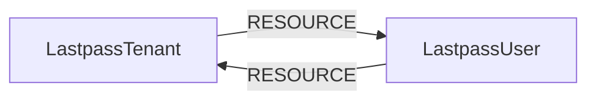

<!-- Generated from the data model. Do not edit manually. -->

## Lastpass Schema

### LastpassTenant

Representation of a LastPass tenant.

> **Ontology Mapping**: This node uses the ontology label [`Tenant`](#ontology-tenant).

#### Properties

| Field | Index | Description |
|-------|-------|-------------|
| id | Yes | LastPass tenant ID. |
| firstseen |  | Timestamp when a sync job first created this node. |
| lastupdated | Yes | Timestamp of the last sync that observed this node. |

#### Relationships

- `(:LastpassUser)-[:RESOURCE]->(:LastpassTenant)`: Deprecated reverse tenant edge retained for backward compatibility.

- `(:LastpassTenant)-[:RESOURCE]->(:LastpassUser)`: Contains a LastPass user in a LastPass tenant.

### LastpassUser

Representation of a LastPass user account.

> **Ontology Mapping**: This node uses the ontology label [`UserAccount`](#ontology-useraccount).

#### Properties

Ontology-generated fields are shown in *italics*.

| Field | Index | Description |
|-------|-------|-------------|
| id | Yes | LastPass user ID. |
| firstseen |  | Timestamp when a sync job first created this node. |
| lastupdated | Yes | Timestamp of the last sync that observed this node. |
| admin |  | Whether the account is an administrator. |
| applications |  | Number of mobile applications stored. |
| attachments |  | Number of file attachments stored. |
| created |  | Timestamp when the account was created. |
| disabled |  | Whether the account is disabled. |
| email | Yes | Email address of the user. |
| formfills |  | Number of form-fill profiles stored. |
| last_login |  | Timestamp of the last login. |
| last_pw_change |  | Timestamp of the last master password change. |
| mpstrength |  | Master password strength score, with a maximum of 100. |
| multifactor |  | Configured multifactor authentication method. |
| name |  | Full name of the user. |
| neverloggedin |  | Whether the user has never logged in. |
| notes |  | Number of secure notes stored. |
| password_reset_required |  | Whether the user must reset their password. |
| sites |  | Number of site credentials stored. |
| totalscore |  | LastPass security score, with a maximum of 100. |
| *_ont_active* | Yes | Normalized field sourced from `disabled`. |
| *_ont_email* | Yes | Normalized field sourced from `email`. |
| *_ont_fullname* | Yes | Normalized field sourced from `name`. |
| *_ont_has_mfa* | Yes | Normalized field sourced from `multifactor`. |
| *_ont_lastactivity* | Yes | Normalized field sourced from `last_login`. |
| *_ont_source* |  | Module that populated this node's ontology fields. |

#### Relationships

- `(:User)-[:HAS_ACCOUNT]->(:LastpassUser)`

- `(:Human)-[:IDENTITY_LASTPASS]->(:LastpassUser)`: Links a Human identity to the LastPass user account with the same email.

- `(:LastpassTenant)-[:RESOURCE]->(:LastpassUser)`: Contains a LastPass user in a LastPass tenant.

- `(:LastpassUser)-[:RESOURCE]->(:LastpassTenant)`: Deprecated reverse tenant edge retained for backward compatibility.
