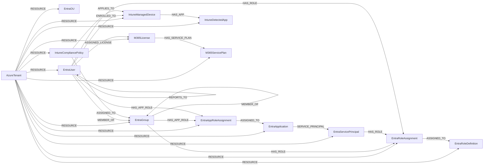

<!-- Generated from the data model. Do not edit manually. -->

## Microsoft Schema

### AzureTenant

A Microsoft tenant, with EntraTenant retained as a compatibility label.

> **Ontology Mapping**: This node uses the ontology label [`Tenant`](#ontology-tenant).

> **Additional Labels**: This node also uses `EntraTenant`.

> **Additional Label Definitions**:
>
> - `EntraTenant`: A microsoft node participating in the shared EntraTenant graph interface.

#### Properties

Ontology-generated fields are shown in *italics*.

| Field | Index | Description |
|-------|-------|-------------|
| id | Yes | Microsoft tenant ID. |
| firstseen |  | Timestamp when a sync job first created this node. |
| lastupdated | Yes | Timestamp of the last sync that observed this node. |
| created_date_time |  | Timestamp when the tenant was created. |
| default_usage_location |  | Default tenant usage location. |
| deleted_date_time |  | Timestamp when the tenant was deleted. |
| display_name |  | Display name of the tenant. |
| marketing_notification_emails |  | Email addresses that receive marketing notifications. |
| mobile_device_management_authority |  | Mobile device management authority for the tenant. |
| on_premises_last_sync_date_time |  | Timestamp of the latest on-premises directory synchronization. |
| on_premises_sync_enabled |  | Whether on-premises directory synchronization is enabled. |
| partner_tenant_type |  | Partner relationship type of the tenant. |
| postal_code |  | Postal code of the tenant address. |
| preferred_language |  | Preferred language of the tenant. |
| state |  | State or province of the tenant address. |
| street |  | Street portion of the tenant address. |
| tenant_type |  | Microsoft directory tenant type. |
| *_ont_name* | Yes | Normalized field sourced from `display_name`. |
| *_ont_source* |  | Module that populated this node's ontology fields. |

#### Relationships

- `(:AzureManagementGroup)-[:PARENT]->(:AzureTenant)`: A root Azure management group has the tenant as its parent.

- `(:AzureTenant)-[:RESOURCE]->(:AzureManagementGroup)`: An Azure tenant contains the management group as a resource.

- `(:AzureTenant)-[:RESOURCE]->(:AzurePrincipal)`: An Azure tenant contains the principal as a resource.

- `(:AzureTenant)-[:RESOURCE]->(:AzureSubscription)`: An Azure tenant contains the subscription as a resource.

- `(:AzureTenant)-[:RESOURCE]->(:EntraAppRoleAssignment)`: Links a Microsoft tenant to one of its app role assignments.

- `(:AzureTenant)-[:RESOURCE]->(:EntraApplication)`: Links a Microsoft tenant to one of its Entra applications.

- `(:AzureTenant)-[:RESOURCE]->(:EntraGroup)`: Links a Microsoft tenant to one of its Entra groups.

- `(:AzureTenant)-[:RESOURCE]->(:EntraOU)`: Links a Microsoft tenant to one of its administrative units.

- `(:AzureTenant)-[:RESOURCE]->(:EntraRoleAssignment)`: Links a Microsoft tenant to one of its directory role assignments.

- `(:AzureTenant)-[:RESOURCE]->(:EntraRoleDefinition)`: Links a Microsoft tenant to one of its directory role definitions.

- `(:AzureTenant)-[:RESOURCE]->(:EntraServicePrincipal)`: Links a Microsoft tenant to one of its service principals.

- `(:AzureTenant)-[:RESOURCE]->(:EntraUser)`: Links a Microsoft tenant to one of its Entra users.

- `(:AzureTenant)-[:RESOURCE]->(:IntuneCompliancePolicy)`: Links a Microsoft tenant to one of its Intune compliance policies.

- `(:AzureTenant)-[:RESOURCE]->(:IntuneDetectedApp)`: Links a Microsoft tenant to a detected Intune application.

- `(:AzureTenant)-[:RESOURCE]->(:IntuneManagedDevice)`: Links a Microsoft tenant to one of its Intune managed devices.

- `(:AzureTenant)-[:RESOURCE]->(:M365License)`: Links a Microsoft tenant to one of its Microsoft 365 licenses.

- `(:AzureTenant)-[:RESOURCE]->(:M365ServicePlan)`: Links a Microsoft tenant to one of its Microsoft 365 service plans.

### EntraApplication

An application registration in Microsoft Entra ID.

> **Ontology Mapping**: This node uses the ontology label [`ThirdPartyApp`](#ontology-thirdpartyapp).

#### Properties

Ontology-generated fields are shown in *italics*.

| Field | Index | Description |
|-------|-------|-------------|
| id | Yes | Entra application object ID. |
| firstseen |  | Timestamp when a sync job first created this node. |
| lastupdated | Yes | Timestamp of the last sync that observed this node. |
| _ont_enabled |  | Property generated by analysis job: `Ontology - Entra application projection`. |
| app_id |  | Application client ID. |
| display_name |  | Display name of the application. |
| publisher_domain |  | Verified publisher domain of the application. |
| sign_in_audience |  | Accounts allowed to sign in to the application. |
| *_ont_client_id* | Yes | Normalized field sourced from `app_id`. |
| *_ont_name* | Yes | Normalized field sourced from `display_name`. |
| *_ont_protocol* | Yes | Property generated by the ontology mapping. |
| *_ont_source* |  | Module that populated this node's ontology fields. |

#### Relationships

- `(:EntraAppRoleAssignment)-[:ASSIGNED_TO]->(:EntraApplication)`: Links an app role assignment to its Entra application.

- `(:User)-[:AUTHORIZED]->(:EntraApplication)`: generated by analysis job `Ontology - User AUTHORIZED ThirdPartyApp linking`.
  - Properties:

    | Field | Description |
    |-------|-------------|
    | scopes | Property generated by analysis job: `Ontology - User AUTHORIZED ThirdPartyApp linking`. |

- `(:AzureTenant)-[:RESOURCE]->(:EntraApplication)`: Links a Microsoft tenant to one of its Entra applications.

- `(:EntraApplication)-[:SERVICE_PRINCIPAL]->(:EntraServicePrincipal)`: Links an Entra application to its deployed service principal.

### EntraAppRoleAssignment

An application role assignment in Microsoft Entra ID.

#### Properties

| Field | Index | Description |
|-------|-------|-------------|
| id | Yes | Entra app role assignment ID. |
| firstseen |  | Timestamp when a sync job first created this node. |
| lastupdated | Yes | Timestamp of the last sync that observed this node. |
| app_role_id |  | ID of the assigned application role. |
| application_app_id |  | Client ID of the assigned application. |
| created_date_time |  | Timestamp when the assignment was created. |
| principal_display_name |  | Display name of the assigned principal. |
| principal_id |  | ID of the principal receiving the role. |
| principal_type |  | Type of the assigned principal. |
| resource_display_name |  | Display name of the resource service principal. |
| resource_id |  | ID of the resource service principal. |

#### Relationships

- `(:EntraAppRoleAssignment)-[:ASSIGNED_TO]->(:EntraApplication)`: Links an app role assignment to its Entra application.

- `(:EntraGroup)-[:HAS_APP_ROLE]->(:EntraAppRoleAssignment)`: Links an Entra group to an app role assignment it holds.

- `(:EntraUser)-[:HAS_APP_ROLE]->(:EntraAppRoleAssignment)`: Links an Entra user to an app role assignment they hold.

- `(:AzureTenant)-[:RESOURCE]->(:EntraAppRoleAssignment)`: Links a Microsoft tenant to one of its app role assignments.

### EntraGroup

A group in Microsoft Entra ID.

> **Ontology Mapping**: This node uses the ontology label [`UserGroup`](#ontology-usergroup).

> **Additional Labels**: This node also uses `EntraIdentity`, `EntraPrincipal`.

> **Additional Label Definitions**:
>
> - `EntraIdentity`: A microsoft node participating in the shared EntraIdentity graph interface.
> - `EntraPrincipal`: A Microsoft identity participating in the shared EntraPrincipal graph interface.

#### Properties

Ontology-generated fields are shown in *italics*.

| Field | Index | Description |
|-------|-------|-------------|
| id | Yes | Entra group ID. |
| firstseen |  | Timestamp when a sync job first created this node. |
| lastupdated | Yes | Timestamp of the last sync that observed this node. |
| created_date_time |  | Timestamp when the group was created. |
| deleted_date_time |  | Timestamp when the group was deleted. |
| description |  | Description of the group. |
| display_name |  | Display name of the group. |
| group_types |  | Microsoft Graph group type values. |
| is_assignable_to_role |  | Whether directory roles can be assigned to the group. |
| mail |  | Primary email address of the group. |
| mail_enabled |  | Whether the group has mail enabled. |
| mail_nickname |  | Mail alias of the group. |
| security_enabled |  | Whether the group has security enabled. |
| visibility |  | Visibility setting of the group. |
| *_ont_description* |  | Normalized field sourced from `description`. |
| *_ont_email* | Yes | Normalized field sourced from `mail`. |
| *_ont_name* | Yes | Normalized field sourced from `display_name`. |
| *_ont_source* |  | Module that populated this node's ontology fields. |

#### Relationships

- `(:IntuneCompliancePolicy)-[:ASSIGNED_TO]->(:EntraGroup)`: Links an Intune compliance policy to an assigned Entra group.

- `(:EntraGroup)-[:CAN_MANAGE]->(:AzureSQLServer)`: `EntraGroup` receives evaluated `CAN_MANAGE` access to `AzureSQLServer` from AZURE IAM policies.
  - Evaluated permissions: `Microsoft.Sql/servers/delete`

- `(:EntraGroup)-[:CAN_READ]->(:AzureSQLServer)`: `EntraGroup` receives evaluated `CAN_READ` access to `AzureSQLServer` from AZURE IAM policies.
  - Evaluated permissions: `Microsoft.Sql/servers/read`

- `(:EntraGroup)-[:CAN_WRITE]->(:AzureSQLServer)`: `EntraGroup` receives evaluated `CAN_WRITE` access to `AzureSQLServer` from AZURE IAM policies.
  - Evaluated permissions: `Microsoft.Sql/servers/write`

- `(:EntraGroup)-[:HAS_APP_ROLE]->(:EntraAppRoleAssignment)`: Links an Entra group to an app role assignment it holds.

- `(:EntraGroup)-[:HAS_ROLE]->(:EntraRoleAssignment)`: Links an Entra group to a directory role assignment it holds.

- `(:EntraGroup)-[:HAS_ROLE_ASSIGNMENT]->(:AzureRoleAssignment)`: A Microsoft Entra group has the Azure role assignment.

- `(:EntraGroup)-[:MEMBER_OF]->(:EntraGroup)`: Links nested Entra groups to their parent group.

- `(:EntraUser)-[:MEMBER_OF]->(:EntraGroup)`: Links Entra users to a group they belong to.

- `(:EntraIdentity)-[:OWNER_OF]->(:EntraGroup)`: Links Entra identities to a group they own.

- `(:AzureTenant)-[:RESOURCE]->(:EntraGroup)`: Links a Microsoft tenant to one of its Entra groups.

### EntraOU

An administrative unit in Microsoft Entra ID.

#### Properties

| Field | Index | Description |
|-------|-------|-------------|
| id | Yes | Entra administrative unit ID. |
| firstseen |  | Timestamp when a sync job first created this node. |
| lastupdated | Yes | Timestamp of the last sync that observed this node. |
| deleted_date_time |  | Timestamp when the administrative unit was deleted. |
| description |  | Description of the administrative unit. |
| display_name |  | Display name of the administrative unit. |
| is_member_management_restricted |  | Whether member management is restricted. |
| membership_type |  | Membership type of the administrative unit. |
| visibility |  | Visibility setting of the administrative unit. |

#### Relationships

- `(:AzureTenant)-[:RESOURCE]->(:EntraOU)`: Links a Microsoft tenant to one of its administrative units.

### EntraRoleAssignment

A directory role assignment in Microsoft Entra ID.

#### Properties

| Field | Index | Description |
|-------|-------|-------------|
| id | Yes | Entra role assignment ID. |
| firstseen |  | Timestamp when a sync job first created this node. |
| lastupdated | Yes | Timestamp of the last sync that observed this node. |
| app_scope_id |  | Application-specific scope of the assignment. |
| directory_scope_id |  | Directory scope of the assignment. |
| principal_id | Yes | ID of the principal granted the role. |
| role_definition_id | Yes | ID of the assigned role definition. |

#### Relationships

- `(:EntraRoleAssignment)-[:ASSIGNED_TO]->(:EntraRoleDefinition)`: Links a role assignment to the directory role it grants.

- `(:EntraGroup)-[:HAS_ROLE]->(:EntraRoleAssignment)`: Links an Entra group to a directory role assignment it holds.

- `(:EntraServicePrincipal)-[:HAS_ROLE]->(:EntraRoleAssignment)`: Links a service principal to a directory role assignment it holds.

- `(:EntraUser)-[:HAS_ROLE]->(:EntraRoleAssignment)`: Links an Entra user to a directory role assignment they hold.

- `(:AzureTenant)-[:RESOURCE]->(:EntraRoleAssignment)`: Links a Microsoft tenant to one of its directory role assignments.

### EntraRoleDefinition

A directory role definition in Microsoft Entra ID.

#### Properties

| Field | Index | Description |
|-------|-------|-------------|
| id | Yes | Entra role definition ID. |
| firstseen |  | Timestamp when a sync job first created this node. |
| lastupdated | Yes | Timestamp of the last sync that observed this node. |
| description |  | Description of the permissions granted by the role. |
| display_name |  | Display name of the directory role. |
| is_built_in |  | Whether this is a Microsoft built-in role. |
| is_enabled |  | Whether the role definition is enabled. |
| template_id |  | Template ID of the directory role. |

#### Relationships

- `(:EntraRoleAssignment)-[:ASSIGNED_TO]->(:EntraRoleDefinition)`: Links a role assignment to the directory role it grants.

- `(:AzureTenant)-[:RESOURCE]->(:EntraRoleDefinition)`: Links a Microsoft tenant to one of its directory role definitions.

### EntraServicePrincipal

A service principal in Microsoft Entra ID.

> **Ontology Mapping**: This node uses the ontology label [`ServiceAccount`](#ontology-serviceaccount).

> **Additional Labels**: This node also uses `EntraPrincipal`.

> **Additional Label Definitions**:
>
> - `EntraPrincipal`: A Microsoft identity participating in the shared EntraPrincipal graph interface.

#### Properties

Ontology-generated fields are shown in *italics*.

| Field | Index | Description |
|-------|-------|-------------|
| id | Yes | Entra service principal ID. |
| firstseen |  | Timestamp when a sync job first created this node. |
| lastupdated | Yes | Timestamp of the last sync that observed this node. |
| account_enabled |  | Whether the service principal is enabled. |
| app_id |  | Client ID of the associated application. |
| app_owner_organization_id |  | Tenant ID of the application's owning organization. |
| aws_identity_center_instance_id |  | AWS Identity Center instance ID derived from reply URLs. |
| display_name |  | Display name of the service principal. |
| login_url |  | Login URL of the service principal. |
| preferred_single_sign_on_mode |  | Preferred single sign-on mode. |
| preferred_token_signing_key_thumbprint |  | Thumbprint of the preferred token-signing certificate. |
| reply_urls |  | Reply URLs registered for the service principal. |
| service_principal_type |  | Type of service principal. |
| sign_in_audience |  | Accounts allowed to sign in. |
| tags |  | Tags assigned to the service principal. |
| token_encryption_key_id |  | Key ID used to encrypt issued tokens. |
| *_ont_active* | Yes | Normalized field sourced from `account_enabled`. |
| *_ont_name* | Yes | Normalized field sourced from `display_name`. |
| *_ont_source* |  | Module that populated this node's ontology fields. |

#### Relationships

- `(:EntraServicePrincipal)-[:CAN_MANAGE]->(:AzureSQLServer)`: `EntraServicePrincipal` receives evaluated `CAN_MANAGE` access to `AzureSQLServer` from AZURE IAM policies.
  - Evaluated permissions: `Microsoft.Sql/servers/delete`

- `(:EntraServicePrincipal)-[:CAN_READ]->(:AzureSQLServer)`: `EntraServicePrincipal` receives evaluated `CAN_READ` access to `AzureSQLServer` from AZURE IAM policies.
  - Evaluated permissions: `Microsoft.Sql/servers/read`

- `(:EntraServicePrincipal)-[:CAN_WRITE]->(:AzureSQLServer)`: `EntraServicePrincipal` receives evaluated `CAN_WRITE` access to `AzureSQLServer` from AZURE IAM policies.
  - Evaluated permissions: `Microsoft.Sql/servers/write`

- `(:GCPBigQueryConnection)-[:CONNECTS_WITH]->(:EntraServicePrincipal)`

- `(:EntraServicePrincipal)-[:FEDERATES_TO]->(:AWSIdentityCenter)`: Links an Entra service principal to its federated AWS Identity Center.

- `(:EntraServicePrincipal)-[:HAS_ROLE]->(:EntraRoleAssignment)`: Links a service principal to a directory role assignment it holds.

- `(:EntraServicePrincipal)-[:HAS_ROLE_ASSIGNMENT]->(:AzureRoleAssignment)`: A Microsoft Entra service principal has the Azure role assignment.

- `(:AzureTenant)-[:RESOURCE]->(:EntraServicePrincipal)`: Links a Microsoft tenant to one of its service principals.

- `(:AzureFunctionApp)-[:RUNS_AS]->(:EntraServicePrincipal)`: An Azure Function App runs as one of its managed identities.

- `(:AzureVirtualMachine)-[:RUNS_AS]->(:EntraServicePrincipal)`: The virtual machine runs as a managed identity's service principal.

- `(:EntraApplication)-[:SERVICE_PRINCIPAL]->(:EntraServicePrincipal)`: Links an Entra application to its deployed service principal.

### EntraUser

A user account in Microsoft Entra ID.

> **Ontology Mapping**: This node uses the ontology label [`UserAccount`](#ontology-useraccount).

> **Additional Labels**: This node also uses `EntraIdentity`, `EntraPrincipal`.

> **Additional Label Definitions**:
>
> - `EntraIdentity`: A microsoft node participating in the shared EntraIdentity graph interface.
> - `EntraPrincipal`: A Microsoft identity participating in the shared EntraPrincipal graph interface.

#### Properties

Ontology-generated fields are shown in *italics*.

| Field | Index | Description |
|-------|-------|-------------|
| id | Yes | Entra user ID. |
| firstseen |  | Timestamp when a sync job first created this node. |
| lastupdated | Yes | Timestamp of the last sync that observed this node. |
| account_enabled |  | Whether the user account is enabled. |
| age_group |  | Age group classification of the user. |
| business_phones |  | Business phone numbers of the user. |
| city |  | City in the user's address. |
| company_name |  | Company name associated with the user. |
| country |  | Country or region in the user's address. |
| department |  | Department of the user. |
| display_name |  | Display name of the user. |
| email | Yes | Primary email address of the user. |
| employee_id |  | Employee identifier of the user. |
| employee_type |  | Employment type of the user. |
| given_name |  | Given name of the user. |
| job_title |  | Job title of the user. |
| manager_id |  | Entra user ID of the user's manager. |
| mobile_phone |  | Mobile phone number of the user. |
| office_location |  | Office location of the user. |
| preferred_language |  | Preferred language of the user. |
| state |  | State or province in the user's address. |
| surname |  | Surname of the user. |
| user_principal_name |  | User principal name. |
| *_ont_active* | Yes | Normalized field sourced from `account_enabled`. |
| *_ont_email* | Yes | Normalized field sourced from `email`. |
| *_ont_firstname* | Yes | Normalized field sourced from `given_name`. |
| *_ont_fullname* | Yes | Normalized field sourced from `display_name`. |
| *_ont_lastname* | Yes | Normalized field sourced from `surname`. |
| *_ont_source* |  | Module that populated this node's ontology fields. |

#### Relationships

- `(:EntraUser)-[:ASSIGNED_LICENSE]->(:M365License)`: Links an Entra user to a Microsoft 365 license assigned to them.

- `(:EntraUser)-[:CAN_MANAGE]->(:AzureSQLServer)`: `EntraUser` receives evaluated `CAN_MANAGE` access to `AzureSQLServer` from AZURE IAM policies.
  - Evaluated permissions: `Microsoft.Sql/servers/delete`

- `(:EntraUser)-[:CAN_READ]->(:AzureSQLServer)`: `EntraUser` receives evaluated `CAN_READ` access to `AzureSQLServer` from AZURE IAM policies.
  - Evaluated permissions: `Microsoft.Sql/servers/read`

- `(:EntraUser)-[:CAN_SIGN_ON_TO]->(:AWSSSOUser)`: Links an Entra user to their federated AWS Identity Center user.

- `(:EntraUser)-[:CAN_WRITE]->(:AzureSQLServer)`: `EntraUser` receives evaluated `CAN_WRITE` access to `AzureSQLServer` from AZURE IAM policies.
  - Evaluated permissions: `Microsoft.Sql/servers/write`

- `(:EntraUser)-[:ENROLLED_TO]->(:IntuneManagedDevice)`: Links an Entra user to a device they enrolled in Intune.

- `(:User)-[:HAS_ACCOUNT]->(:EntraUser)`

- `(:EntraUser)-[:HAS_APP_ROLE]->(:EntraAppRoleAssignment)`: Links an Entra user to an app role assignment they hold.

- `(:EntraUser)-[:HAS_ROLE]->(:EntraRoleAssignment)`: Links an Entra user to a directory role assignment they hold.

- `(:EntraUser)-[:HAS_ROLE_ASSIGNMENT]->(:AzureRoleAssignment)`: A Microsoft Entra user has the Azure role assignment.

- `(:EntraUser)-[:MEMBER_OF]->(:EntraGroup)`: Links Entra users to a group they belong to.

- `(:EntraUser)-[:REPORTS_TO]->(:EntraUser)`: Links an Entra user to their manager.

- `(:AzureTenant)-[:RESOURCE]->(:EntraUser)`: Links a Microsoft tenant to one of its Entra users.

### IntuneCompliancePolicy

A device compliance policy configured in Microsoft Intune.

#### Properties

| Field | Index | Description |
|-------|-------|-------------|
| id | Yes | Intune compliance policy ID. |
| firstseen |  | Timestamp when a sync job first created this node. |
| lastupdated | Yes | Timestamp of the last sync that observed this node. |
| applies_to_all_devices |  | Whether the policy applies to all managed devices. |
| applies_to_all_users |  | Whether the policy applies to all licensed users. |
| created_date_time |  | Timestamp when the policy was created. |
| description |  | Administrator-provided policy description. |
| display_name |  | Display name of the compliance policy. |
| last_modified_date_time |  | Timestamp when the policy was last modified. |
| platform |  | Device platform targeted by the policy. |
| version |  | Version of the compliance policy. |

#### Relationships

- `(:IntuneCompliancePolicy)-[:APPLIES_TO]->(:IntuneManagedDevice)`: generated by analysis job `Intune compliance policy to device resolution`.

- `(:IntuneCompliancePolicy)-[:ASSIGNED_TO]->(:EntraGroup)`: Links an Intune compliance policy to an assigned Entra group.

- `(:AzureTenant)-[:RESOURCE]->(:IntuneCompliancePolicy)`: Links a Microsoft tenant to one of its Intune compliance policies.

### IntuneDetectedApp

An application detected on devices managed by Microsoft Intune.

#### Properties

| Field | Index | Description |
|-------|-------|-------------|
| id | Yes | Intune report application key for the detected app. |
| firstseen |  | Timestamp when a sync job first created this node. |
| lastupdated | Yes | Timestamp of the last sync that observed this node. |
| application_id |  | Application ID reported by Intune when available. |
| device_count |  | Number of devices with the application detected. |
| display_name |  | Display name of the detected application. |
| platform |  | Platform on which the application was detected. |
| publisher |  | Publisher of the detected application. |
| version |  | Detected application version. |

#### Relationships

- `(:IntuneManagedDevice)-[:HAS_APP]->(:IntuneDetectedApp)`: Links an Intune managed device to an application detected on it.

- `(:AzureTenant)-[:RESOURCE]->(:IntuneDetectedApp)`: Links a Microsoft tenant to a detected Intune application.

### IntuneManagedDevice

A device managed by Microsoft Intune.

> **Ontology Projection**: `IntuneManagedDevice` contributes data to canonical [`Device`](#ontology-device) nodes.

#### Properties

| Field | Index | Description |
|-------|-------|-------------|
| id | Yes | Intune managed device ID. |
| firstseen |  | Timestamp when a sync job first created this node. |
| lastupdated | Yes | Timestamp of the last sync that observed this node. |
| azure_ad_device_id |  | Microsoft Entra device ID. |
| azure_ad_registered |  | Whether the device is registered in Entra ID. |
| compliance_state |  | Intune compliance state of the device. |
| device_enrollment_type |  | Method used to enroll the device. |
| device_name | Yes | Name of the managed device. |
| device_registration_state |  | Registration state of the device. |
| eas_activated |  | Whether Exchange ActiveSync is activated. |
| eas_device_id |  | Exchange ActiveSync device ID. |
| enrolled_date_time |  | Timestamp when the device was enrolled. |
| ethernet_mac_address |  | Ethernet MAC address of the device. |
| free_storage_space_in_bytes |  | Available device storage in bytes. |
| imei |  | International Mobile Equipment Identity of the device. |
| is_encrypted |  | Whether the device storage is encrypted. |
| is_supervised |  | Whether the device is supervised. |
| jail_broken |  | Whether the device is jailbroken or rooted. |
| last_sync_date_time |  | Timestamp of the latest Intune synchronization. |
| managed_device_owner_type |  | Ownership type of the managed device. |
| management_agent |  | Management channel used by the device. |
| manufacturer |  | Manufacturer of the device. |
| meid |  | Mobile Equipment Identifier of the device. |
| model |  | Model of the device. |
| operating_system |  | Operating system of the device. |
| os_version |  | Operating system version of the device. |
| partner_reported_threat_state |  | Threat state reported by a mobile threat defense partner. |
| physical_memory_in_bytes |  | Physical memory capacity in bytes. |
| serial_number | Yes | Serial number of the device. |
| total_storage_space_in_bytes |  | Total device storage capacity in bytes. |
| user_id |  | Entra user ID associated with the device. |
| user_principal_name |  | User principal name associated with the device. |
| wifi_mac_address |  | Wi-Fi MAC address of the device. |

#### Relationships

- `(:IntuneCompliancePolicy)-[:APPLIES_TO]->(:IntuneManagedDevice)`: generated by analysis job `Intune compliance policy to device resolution`.

- `(:EntraUser)-[:ENROLLED_TO]->(:IntuneManagedDevice)`: Links an Entra user to a device they enrolled in Intune.

- `(:IntuneManagedDevice)-[:HAS_APP]->(:IntuneDetectedApp)`: Links an Intune managed device to an application detected on it.

- `(:Device)-[:OBSERVED_AS]->(:IntuneManagedDevice)`

- `(:AzureTenant)-[:RESOURCE]->(:IntuneManagedDevice)`: Links a Microsoft tenant to one of its Intune managed devices.

### M365License

A Microsoft 365 license subscription held by a tenant.

#### Properties

| Field | Index | Description |
|-------|-------|-------------|
| id | Yes | Tenant-scoped identifier for the subscribed Microsoft 365 SKU. |
| firstseen |  | Timestamp when a sync job first created this node. |
| lastupdated | Yes | Timestamp of the last sync that observed this node. |
| applies_to |  | Resource type to which the subscribed SKU applies. |
| capability_status |  | Current capability status of the subscribed SKU. |
| consumed_units |  | Number of licenses currently assigned. |
| prepaid_enabled |  | Number of prepaid licenses currently enabled. |
| prepaid_suspended |  | Number of prepaid licenses currently suspended. |
| prepaid_warning |  | Number of prepaid licenses in warning state. |
| sku_id | Yes | Microsoft product SKU GUID. |
| sku_part_number | Yes | Microsoft product SKU part number. |

#### Relationships

- `(:EntraUser)-[:ASSIGNED_LICENSE]->(:M365License)`: Links an Entra user to a Microsoft 365 license assigned to them.

- `(:M365License)-[:HAS_SERVICE_PLAN]->(:M365ServicePlan)`: Links a Microsoft 365 license to one of its included service plans.

- `(:AzureTenant)-[:RESOURCE]->(:M365License)`: Links a Microsoft tenant to one of its Microsoft 365 licenses.

### M365ServicePlan

A service entitlement included in a Microsoft 365 license.

#### Properties

| Field | Index | Description |
|-------|-------|-------------|
| id | Yes | Tenant-scoped Microsoft 365 service plan identifier. |
| firstseen |  | Timestamp when a sync job first created this node. |
| lastupdated | Yes | Timestamp of the last sync that observed this node. |
| applies_to |  | Resource type to which the service plan applies. |
| provisioning_status |  | Current provisioning status of the service plan. |
| service_plan_id | Yes | Microsoft service plan GUID. |
| service_plan_name | Yes | Microsoft service plan name. |

#### Relationships

- `(:M365License)-[:HAS_SERVICE_PLAN]->(:M365ServicePlan)`: Links a Microsoft 365 license to one of its included service plans.

- `(:AzureTenant)-[:RESOURCE]->(:M365ServicePlan)`: Links a Microsoft tenant to one of its Microsoft 365 service plans.
