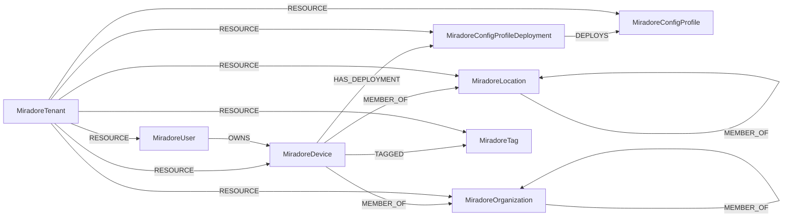

<!-- Generated from the data model. Do not edit manually. -->

## Miradore Schema

### MiradoreConfigProfile

An MDM configuration profile defined in Miradore.

#### Properties

| Field | Index | Description |
|-------|-------|-------------|
| id | Yes | Tenant-scoped identifier for the configuration profile, as `<site name>/<Miradore ID>`. |
| firstseen |  | Timestamp when a sync job first created this node. |
| lastupdated | Yes | Timestamp of the last sync that observed this node. |
| configuration_type |  | Type of configuration carried by the profile. |
| description |  | Configuration profile description. |
| miradore_id | Yes | Raw Miradore ID of the configuration profile, which is only unique within the tenant. |
| name | Yes | Configuration profile name. |
| os_category |  | Platform the profile targets, e.g. Android, iOS, macOS or WindowsDesktop. |
| status |  | Profile status: Unknown, Active or Deleted. |

#### Relationships

- `(:MiradoreConfigProfileDeployment)-[:DEPLOYS]->(:MiradoreConfigProfile)`: Links a deployment to the configuration profile it installs.

- `(:MiradoreTenant)-[:RESOURCE]->(:MiradoreConfigProfile)`: Links a Miradore tenant to one of its configuration profiles.

### MiradoreConfigProfileDeployment

The deployment of a Miradore configuration profile onto a single device.

#### Properties

| Field | Index | Description |
|-------|-------|-------------|
| id | Yes | Tenant-scoped identifier for the configuration profile deployment, as `<site name>/<Miradore ID>`. |
| firstseen |  | Timestamp when a sync job first created this node. |
| lastupdated | Yes | Timestamp of the last sync that observed this node. |
| deployment_time |  | Timestamp when the profile was deployed to the device. |
| deployment_trigger |  | What triggered the deployment: Administrator or BusinessEnforcement. |
| miradore_id | Yes | Raw Miradore ID of the configuration profile deployment, which is only unique within the tenant. |
| status |  | Deployment status: Unknown, Installed or Removed. |

#### Relationships

- `(:MiradoreConfigProfileDeployment)-[:DEPLOYS]->(:MiradoreConfigProfile)`: Links a deployment to the configuration profile it installs.

- `(:MiradoreDevice)-[:HAS_DEPLOYMENT]->(:MiradoreConfigProfileDeployment)`: Links a Miradore device to a configuration profile deployment targeting it.

- `(:MiradoreTenant)-[:RESOURCE]->(:MiradoreConfigProfileDeployment)`: Links a Miradore tenant to one of its configuration profile deployments.

### MiradoreDevice

A device managed by Miradore, on any platform it supports.

> **Ontology Projection**: `MiradoreDevice` contributes data to canonical [`Device`](#ontology-device) nodes.

#### Properties

| Field | Index | Description |
|-------|-------|-------------|
| id | Yes | Tenant-scoped identifier for the device, as `<site name>/<Miradore ID>`. |
| firstseen |  | Timestamp when a sync job first created this node. |
| lastupdated | Yes | Timestamp of the last sync that observed this node. |
| android_device_administration_enabled |  | Whether Android device administration is enabled. |
| android_id |  | Android device identifier. |
| android_passcode_sufficient |  | Whether the Android passcode is sufficient: Unknown, No or Yes. |
| android_password_complexity_requirement |  | Required Android password complexity: None, Low, Medium or High. |
| android_password_min_length |  | Minimum required Android password length. |
| android_password_quality_requirement |  | Required Android password quality. |
| android_password_set |  | Whether an Android password is set: Unknown, No or Yes. |
| android_rooted |  | Android root state: Unknown, NotRooted or Rooted. |
| android_safe_status |  | Samsung SAFE/Knox status. |
| android_security_patch_level |  | Android security patch level. |
| android_storage_encryption_required |  | Whether Android storage encryption is required. |
| android_storage_encryption_status |  | Android storage encryption state. |
| bluetooth_mac |  | Bluetooth MAC address. |
| category_id |  | Miradore device category ID. |
| category_name |  | Miradore device category name. |
| client_build_number |  | Miradore client build number. |
| client_id |  | Miradore client ID installed on the device. |
| client_status |  | Miradore client status reported for the device. |
| client_version |  | Miradore client version. |
| created |  | Timestamp when the device was created in Miradore. |
| device_owner_type |  | Ownership mode: Normal, ProfileOwner, DeviceOwner or WPoCOD. |
| device_type |  | Device type reported by the device. |
| encryption_status |  | Device encryption state: Activating, Disabled, Enabled, NotSupported or Unknown. |
| hostname | Yes | Device hostname as inventoried by Miradore. |
| imei |  | Device IMEI. |
| ios_activation_lock |  | Whether iOS Activation Lock is enabled. |
| ios_device_locator_service |  | Whether the iOS device locator service is enabled. |
| ios_hardware_encryption |  | iOS hardware encryption capability. |
| ios_passcode_compliant |  | Whether the iOS passcode is compliant. |
| ios_passcode_compliant_with_profiles |  | Whether the iOS passcode complies with the installed profiles. |
| ios_passcode_present |  | Whether an iOS passcode is present: Unknown, No or Yes. |
| ios_profile_jailbroken |  | Whether the iOS profile indicates a jailbroken device. |
| ios_software_jailbroken |  | Whether iOS software detection indicates a jailbroken device. |
| ios_supervised |  | Whether the iOS device is supervised. |
| ip_address |  | Public IP address last seen by Miradore. |
| last_reported |  | Timestamp when the device last reported to Miradore. |
| lease_end_date |  | Date the device lease ends. |
| lease_start_date |  | Date the device lease starts. |
| local_ip_address |  | Local IP address last reported by the device. |
| lost_mode_status |  | Lost mode state: Disabled, Enabled or EnabledWithLocationTracking. |
| mac_address |  | Primary MAC address. |
| macos_activation_lock_enabled |  | Whether macOS Activation Lock is enabled. |
| management_type |  | How the device is managed, e.g. AndroidDeviceOwner, BuiltInMDM, iOSSupervised or WindowsClient. |
| manufacturer |  | Device manufacturer. |
| marketing_name |  | Commercial model name. |
| miradore_id | Yes | Raw Miradore ID of the device, which is only unique within the tenant. |
| model |  | Device model. |
| modified |  | Timestamp when the device record was last modified. |
| online_status |  | Connectivity status: Active, Inactive, Unavailable, Unknown or Unmanaged. |
| os_build |  | Operating system build. |
| os_language |  | Operating system language. |
| os_platform |  | Operating system platform from the OS inventory. |
| os_version |  | Operating system version. |
| os_version_name |  | Human readable operating system version name. |
| passcode_set |  | Whether a device passcode is set: No, Unknown or Yes. |
| platform |  | Platform reported by Miradore: Android, iOS, WindowsPhone, WindowsDesktop, macOS, Other or Unknown. |
| product_name |  | Product name reported by the device. |
| purchase_date |  | Device purchase date. |
| serial_number | Yes | Device serial number. |
| source |  | Where the device record originated from. |
| status |  | Device status: Active, AutoGenerated, Deleted, New, Suspended or Unmanaged. |
| udid |  | Device UDID. |
| warranty_end_date |  | Date the device warranty ends. |
| wifi_mac |  | Wi-Fi MAC address. |
| windows_antispyware_status |  | Windows antispyware status. |
| windows_antivirus_signature_status |  | Whether antivirus signatures are up to date. |
| windows_antivirus_status |  | Windows antivirus status. |
| windows_complies_with_enterprise_encryption_policy |  | Whether the device complies with the enterprise encryption policy. |
| windows_firewall_status |  | Windows firewall status. |
| windows_secure_boot_state |  | Secure Boot state: NotSupported, Enabled or Disabled. |
| windows_tpm_specification_version |  | Trusted Platform Module specification version. |
| windows_user_account_control_status |  | User Account Control notification level. |

#### Relationships

- `(:MiradoreDevice)-[:HAS_DEPLOYMENT]->(:MiradoreConfigProfileDeployment)`: Links a Miradore device to a configuration profile deployment targeting it.

- `(:MiradoreDevice)-[:MEMBER_OF]->(:MiradoreLocation)`: Links a Miradore device to the location it is assigned to.

- `(:MiradoreDevice)-[:MEMBER_OF]->(:MiradoreOrganization)`: Links a Miradore device to the organization it belongs to.

- `(:Device)-[:OBSERVED_AS]->(:MiradoreDevice)`

- `(:MiradoreUser)-[:OWNS]->(:MiradoreDevice)`: Links a Miradore device to the user it is assigned to.

- `(:MiradoreTenant)-[:RESOURCE]->(:MiradoreDevice)`: Links a Miradore tenant to one of its managed devices.

- `(:MiradoreDevice)-[:TAGGED]->(:MiradoreTag)`: Links a Miradore device to a tag assigned to it.

### MiradoreLocation

A site in the Miradore location hierarchy.

#### Properties

| Field | Index | Description |
|-------|-------|-------------|
| id | Yes | Tenant-scoped identifier for the location, as `<site name>/<Miradore ID>`. |
| firstseen |  | Timestamp when a sync job first created this node. |
| lastupdated | Yes | Timestamp of the last sync that observed this node. |
| created |  | Timestamp when the location was created. |
| full_name |  | Fully qualified location name including its ancestors. |
| miradore_id | Yes | Raw Miradore ID of the location, which is only unique within the tenant. |
| modified |  | Timestamp when the location was last modified. |
| name | Yes | Location name. |
| status |  | Location status: Unknown, Active or Removed. |

#### Relationships

- `(:MiradoreDevice)-[:MEMBER_OF]->(:MiradoreLocation)`: Links a Miradore device to the location it is assigned to.

- `(:MiradoreLocation)-[:MEMBER_OF]->(:MiradoreLocation)`: Links a Miradore location to its parent location.

- `(:MiradoreTenant)-[:RESOURCE]->(:MiradoreLocation)`: Links a Miradore tenant to one of its locations.

### MiradoreOrganization

An organization unit in the Miradore organization hierarchy.

#### Properties

| Field | Index | Description |
|-------|-------|-------------|
| id | Yes | Tenant-scoped identifier for the organization, as `<site name>/<Miradore ID>`. |
| firstseen |  | Timestamp when a sync job first created this node. |
| lastupdated | Yes | Timestamp of the last sync that observed this node. |
| created |  | Timestamp when the organization was created. |
| full_name |  | Fully qualified organization name including its ancestors. |
| miradore_id | Yes | Raw Miradore ID of the organization, which is only unique within the tenant. |
| modified |  | Timestamp when the organization was last modified. |
| name | Yes | Organization name. |
| status |  | Organization status: Unknown, Active or Removed. |

#### Relationships

- `(:MiradoreDevice)-[:MEMBER_OF]->(:MiradoreOrganization)`: Links a Miradore device to the organization it belongs to.

- `(:MiradoreOrganization)-[:MEMBER_OF]->(:MiradoreOrganization)`: Links a Miradore organization to its parent organization.

- `(:MiradoreTenant)-[:RESOURCE]->(:MiradoreOrganization)`: Links a Miradore tenant to one of its organizations.

### MiradoreTag

A tag that can be assigned to Miradore devices and users.

#### Properties

| Field | Index | Description |
|-------|-------|-------------|
| id | Yes | Tenant-scoped identifier for the tag, as `<site name>/<tag name>`. |
| firstseen |  | Timestamp when a sync job first created this node. |
| lastupdated | Yes | Timestamp of the last sync that observed this node. |
| name | Yes | Tag name. |

#### Relationships

- `(:MiradoreTenant)-[:RESOURCE]->(:MiradoreTag)`: Links a Miradore tenant to one of its tags.

- `(:MiradoreDevice)-[:TAGGED]->(:MiradoreTag)`: Links a Miradore device to a tag assigned to it.

### MiradoreTenant

A Miradore tenant identified by its site name.

> **Ontology Mapping**: This node uses the ontology label [`Tenant`](#ontology-tenant).

#### Properties

Ontology-generated fields are shown in *italics*.

| Field | Index | Description |
|-------|-------|-------------|
| id | Yes | Miradore site name, which identifies the tenant. |
| firstseen |  | Timestamp when a sync job first created this node. |
| lastupdated | Yes | Timestamp of the last sync that observed this node. |
| *_ont_name* | Yes | Normalized field sourced from `id`. |
| *_ont_source* |  | Module that populated this node's ontology fields. |

#### Relationships

- `(:MiradoreTenant)-[:RESOURCE]->(:MiradoreConfigProfile)`: Links a Miradore tenant to one of its configuration profiles.

- `(:MiradoreTenant)-[:RESOURCE]->(:MiradoreConfigProfileDeployment)`: Links a Miradore tenant to one of its configuration profile deployments.

- `(:MiradoreTenant)-[:RESOURCE]->(:MiradoreDevice)`: Links a Miradore tenant to one of its managed devices.

- `(:MiradoreTenant)-[:RESOURCE]->(:MiradoreLocation)`: Links a Miradore tenant to one of its locations.

- `(:MiradoreTenant)-[:RESOURCE]->(:MiradoreOrganization)`: Links a Miradore tenant to one of its organizations.

- `(:MiradoreTenant)-[:RESOURCE]->(:MiradoreTag)`: Links a Miradore tenant to one of its tags.

- `(:MiradoreTenant)-[:RESOURCE]->(:MiradoreUser)`: Links a Miradore tenant to one of its user accounts.

### MiradoreUser

A user account in Miradore.

> **Ontology Mapping**: This node uses the ontology label [`UserAccount`](#ontology-useraccount).

#### Properties

Ontology-generated fields are shown in *italics*.

| Field | Index | Description |
|-------|-------|-------------|
| id | Yes | Tenant-scoped identifier for the user, as `<site name>/<Miradore ID>`. |
| firstseen |  | Timestamp when a sync job first created this node. |
| lastupdated | Yes | Timestamp of the last sync that observed this node. |
| created |  | Timestamp when the account was created. |
| email | Yes | User email address. |
| firstname |  | First name. |
| lastname |  | Last name. |
| middle |  | Middle name. |
| miradore_id | Yes | Raw Miradore ID of the user, which is only unique within the tenant. |
| modified |  | Timestamp when the account was last modified. |
| name |  | User display name as rendered by Miradore. |
| phone_number |  | User phone number. |
| retired |  | Whether the account has been retired, derived from the status. |
| source |  | How the account was created: Unknown, GUI, CSV, API or AD. |
| status |  | Account status: New, Active, Retired or System. |
| *_ont_active* | Yes | Normalized field sourced from `retired`. |
| *_ont_email* | Yes | Normalized field sourced from `email`. |
| *_ont_firstname* | Yes | Normalized field sourced from `firstname`. |
| *_ont_fullname* | Yes | Normalized field sourced from `name`. |
| *_ont_lastname* | Yes | Normalized field sourced from `lastname`. |
| *_ont_source* |  | Module that populated this node's ontology fields. |

#### Relationships

- `(:User)-[:HAS_ACCOUNT]->(:MiradoreUser)`

- `(:MiradoreUser)-[:OWNS]->(:MiradoreDevice)`: Links a Miradore device to the user it is assigned to.

- `(:MiradoreTenant)-[:RESOURCE]->(:MiradoreUser)`: Links a Miradore tenant to one of its user accounts.
