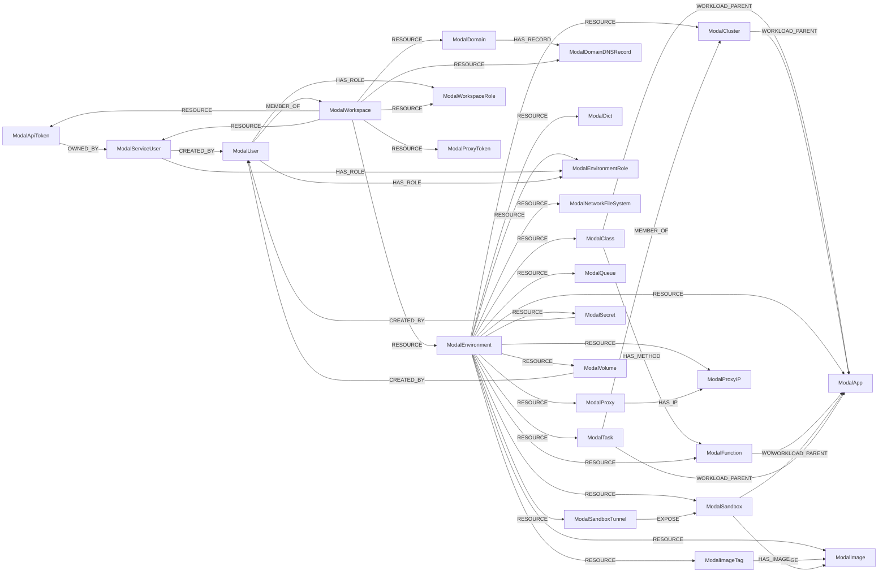

<!-- Generated from the data model. Do not edit manually. -->

## Modal Schema

### ModalApiToken

Represents a Modal API token (`ak-`) belonging to a service user. Only the token id is stored; the token secret is shown once at creation and is never returned by any read API.

> **Ontology Mapping**: This node uses the ontology label [`APIKey`](#ontology-apikey).

#### Properties

Ontology-generated fields are shown in *italics*.

| Field | Index | Description |
|-------|-------|-------------|
| id | Yes | Token ID, e.g. `ak-4pE5t96YiNM0svmOjIet7z`. |
| firstseen |  | Timestamp when a sync job first created this node. |
| lastupdated | Yes | Timestamp of the last sync that observed this node. |
| created_at |  | When the token was created. |
| last_used_at |  | When the token was last used. Modal tokens do not expire, so this is the only signal that one is dormant. |
| name | Yes | Name of the owning service user. |
| token_id | Yes | Same value, indexed for lookups by credential. |
| *_ont_created_at* | Yes | Normalized field sourced from `created_at`. |
| *_ont_last_used_at* | Yes | Normalized field sourced from `last_used_at`. |
| *_ont_name* | Yes | Normalized field sourced from `name`. |
| *_ont_source* |  | Module that populated this node's ontology fields. |

#### Relationships

- `(:ModalApiToken)-[:OWNED_BY]->(:ModalServiceUser)`

- `(:User)-[:OWNS]->(:ModalApiToken)`: generated by analysis job `Ontology - User OWNS APIKey linking`.

- `(:ModalWorkspace)-[:RESOURCE]->(:ModalApiToken)`

### ModalApp

Represents a Modal app: the deployment unit that owns functions, classes, sandboxes and tasks. Enumerated from the private `AppList` RPC, since Modal exposes no public app listing. An ephemeral app (a bare `modal run`) has no name, only a description; the ontology `name` coalesces the two. `_ont_status` normalises `APP_STATE_*` into the shared set, where a stopped app maps to `deleting` (the same choice made for AWS ECS `INACTIVE`), because the canonical set has no `stopped`.

> **Ontology Mapping**: This node uses the ontology label [`ComputeService`](#ontology-computeservice).

#### Properties

Ontology-generated fields are shown in *italics*.

| Field | Index | Description |
|-------|-------|-------------|
| id | Yes | App ID, e.g. `ap-7fkFcwJ6OVd57wM78ERlH1`. |
| firstseen |  | Timestamp when a sync job first created this node. |
| lastupdated | Yes | Timestamp of the last sync that observed this node. |
| created_at |  | When the app was created. |
| description |  | App description. The only human label for an unnamed app. |
| environment_name | Yes | Name of the owning environment. |
| n_running_tasks |  | Number of tasks currently running. |
| name | Yes | App name. Null for an ephemeral app. |
| state | Yes | Raw `APP_STATE_*` value. |
| stopped_at |  | When the app was stopped, if it was. |
| *_ont_name* | Yes | Normalized field sourced from `name`. |
| *_ont_source* |  | Module that populated this node's ontology fields. |
| *_ont_status* | Yes | Normalized field sourced from `state`. |

#### Relationships

- `(:ModalApp)-[:HAS_RUNTIME_IMAGE]->(:Image)`: generated by analysis job `Workload HAS_RUNTIME_IMAGE inventory analysis`.
  - Properties:

    | Field | Description |
    |-------|-------------|
    | exposed_internet | Property generated by analysis job: `Workload HAS_RUNTIME_IMAGE inventory analysis`. |

- `(:ModalEnvironment)-[:RESOURCE]->(:ModalApp)`

- `(:ModalClass)-[:WORKLOAD_PARENT]->(:ModalApp)`

- `(:ModalCluster)-[:WORKLOAD_PARENT]->(:ModalApp)`

- `(:ModalFunction)-[:WORKLOAD_PARENT]->(:ModalApp)`

- `(:ModalSandbox)-[:WORKLOAD_PARENT]->(:ModalApp)`

- `(:ModalTask)-[:WORKLOAD_PARENT]->(:ModalApp)`

### ModalClass

Represents a Modal class, which groups methods sharing a container lifecycle. It carries no ontology label of its own: the runnable units are its methods, which are `ModalFunction` nodes. `HAS_METHOD` is best-effort: it is resolved from the `<Class>.` prefix of the function name, so a function whose prefix matches no known class simply has no edge.

#### Properties

| Field | Index | Description |
|-------|-------|-------------|
| id | Yes | Class ID, e.g. `cs-35B2OoyjwFlvFPNjBMCrPK`. |
| firstseen |  | Timestamp when a sync job first created this node. |
| lastupdated | Yes | Timestamp of the last sync that observed this node. |
| app_id |  | ID of the owning app. |
| environment_name | Yes | Name of the owning environment. |
| name | Yes | Class name. |

#### Relationships

- `(:ModalClass)-[:HAS_METHOD]->(:ModalFunction)`

- `(:ModalEnvironment)-[:RESOURCE]->(:ModalClass)`

- `(:ModalClass)-[:WORKLOAD_PARENT]->(:ModalApp)`

### ModalCluster

Represents a Modal cluster: the group of tasks making up one multi-node job. This node deliberately carries **no** `ComputeCluster` ontology label. A Modal cluster is not a durable compute substrate like EKS, it is a transient task grouping inside a single app, and the label's ontology constraints against `ComputePod` and `ComputeService` would conflict with the `MEMBER_OF` and `WORKLOAD_PARENT` edges here.

#### Properties

| Field | Index | Description |
|-------|-------|-------------|
| id | Yes | Cluster ID. |
| firstseen |  | Timestamp when a sync job first created this node. |
| lastupdated | Yes | Timestamp of the last sync that observed this node. |
| app_id |  | ID of the owning app. |
| environment_name | Yes | Name of the owning environment. |
| started_at |  | When the cluster started. |
| task_ids |  | IDs of its member tasks. The edge itself is materialised from the task side. |

#### Relationships

- `(:ModalTask)-[:MEMBER_OF]->(:ModalCluster)`

- `(:ModalEnvironment)-[:RESOURCE]->(:ModalCluster)`

- `(:ModalCluster)-[:WORKLOAD_PARENT]->(:ModalApp)`

### ModalDict

Represents a Modal Dict: a distributed key-value store scoped to an environment. Only the container is inventoried; its contents are not enumerated. It carries no ontology label. `Database` would be a stretch, since this is not a queryable datastore with its own engine, encryption or backup posture, and the ontology has no key-value-store label, so tagging it would surface it wrongly to cross-provider datastore rules.

#### Properties

| Field | Index | Description |
|-------|-------|-------------|
| id | Yes | Dict ID, e.g. `di-F91whmwZVRH92mOiJgNOCT`. |
| firstseen |  | Timestamp when a sync job first created this node. |
| lastupdated | Yes | Timestamp of the last sync that observed this node. |
| created_at |  | When the Dict was created. |
| environment_name | Yes | Name of the owning environment. |
| name | Yes | Dict name. |

#### Relationships

- `(:ModalEnvironment)-[:RESOURCE]->(:ModalDict)`

### ModalDomain

Represents a custom domain attached to a Modal workspace, used to serve web endpoints on your own hostname. **Workspace-scoped**, not environment-scoped: the underlying API call is workspace-wide. Custom domains require a paid Modal add-on. On workspaces without it the API answers `UNIMPLEMENTED`, which Cartography treats as "no domains" rather than an error, so this node type is simply absent there. This node carries no ontology label: `DNSZone` would be wrong (a hostname is not a zone) and `Certificate` would be a one-field stub, since Modal exposes only a status with no issuer or expiry.

#### Properties

| Field | Index | Description |
|-------|-------|-------------|
| id | Yes | Domain ID. |
| firstseen |  | Timestamp when a sync job first created this node. |
| lastupdated | Yes | Timestamp of the last sync that observed this node. |
| certificate_status | Yes | Raw `CERTIFICATE_STATUS_*` value. A domain stuck `PENDING`, or `FAILED`/`REVOKED`, is serving without a valid certificate. |
| created_at |  | When the domain was added. |
| domain_name | Yes | The custom hostname. |

#### Relationships

- `(:ModalDomain)-[:HAS_RECORD]->(:ModalDomainDNSRecord)`

- `(:ModalWorkspace)-[:RESOURCE]->(:ModalDomain)`

### ModalDomainDNSRecord

Represents a DNS record Modal asks you to create in order to validate a custom domain. Deliberately **not** labelled `DNSRecord`. These are records Modal *requests*, meaning desired configuration, not DNS state observed in the wild. Labelling them would feed the DNS record linking analysis entries that may not exist in any zone, producing phantom resolution paths.

#### Properties

| Field | Index | Description |
|-------|-------|-------------|
| id | Yes | Synthesised as `<domain_id>/<type>/<name>`; Modal gives these records no id. |
| firstseen |  | Timestamp when a sync job first created this node. |
| lastupdated | Yes | Timestamp of the last sync that observed this node. |
| domain_id |  | ID of the owning domain. |
| name | Yes | Record name. |
| type |  | Raw `DNS_RECORD_TYPE_*` value: A, TXT or CNAME. |
| value |  | Record value. |

#### Relationships

- `(:ModalDomain)-[:HAS_RECORD]->(:ModalDomainDNSRecord)`

- `(:ModalWorkspace)-[:RESOURCE]->(:ModalDomainDNSRecord)`

### ModalEnvironment

Represents a Modal environment: a namespace within a workspace. Every named object (app, secret, volume, ...) belongs to exactly one environment, and every Modal listing call is keyed by environment, which makes the environment the cleanup scope for all environment-scoped Modal nodes. `ComputeNamespace` would be the closer semantic fit, but the ontology constrains `ComputeService`/`ComputePod` to `ComputeNamespace` edges to `WORKLOAD_PARENT` in both directions, which the `RESOURCE` sub-resource edge would violate. The environment name is instead exposed to the ontology as `_ont_namespace` on the workload nodes.

> **Ontology Mapping**: This node uses the ontology label [`Tenant`](#ontology-tenant).

#### Properties

Ontology-generated fields are shown in *italics*.

| Field | Index | Description |
|-------|-------|-------------|
| id | Yes | Environment ID, e.g. `en-C3umado26sLFrhYfZjoWjL`. |
| firstseen |  | Timestamp when a sync job first created this node. |
| lastupdated | Yes | Timestamp of the last sync that observed this node. |
| created_at |  | When the environment was created. |
| current_concurrent_gpus |  | GPUs currently in use. |
| current_concurrent_tasks |  | Tasks currently running. |
| environment_type |  | Raw `ENVIRONMENT_TYPE_*` value. |
| is_default |  | Whether this is the workspace's default environment. |
| is_managed |  | Whether the environment is managed by Modal. |
| max_concurrent_gpus |  | Concurrency limit on GPUs. |
| max_concurrent_tasks |  | Concurrency limit on tasks. |
| name | Yes | Environment name. |
| spend_limit_reached |  | Whether the spend limit has been hit. Workloads are refused when true. Cost figures themselves are out of scope. |
| webhook_suffix | Yes | Suffix appended to generated web endpoint URLs in this environment. |
| *_ont_name* | Yes | Normalized field sourced from `name`. |
| *_ont_source* |  | Module that populated this node's ontology fields. |

#### Relationships

- `(:ModalEnvironment)-[:RESOURCE]->(:ModalApp)`

- `(:ModalEnvironment)-[:RESOURCE]->(:ModalClass)`

- `(:ModalEnvironment)-[:RESOURCE]->(:ModalCluster)`

- `(:ModalEnvironment)-[:RESOURCE]->(:ModalDict)`

- `(:ModalEnvironment)-[:RESOURCE]->(:ModalEnvironmentRole)`

- `(:ModalEnvironment)-[:RESOURCE]->(:ModalFunction)`

- `(:ModalEnvironment)-[:RESOURCE]->(:ModalImage)`

- `(:ModalEnvironment)-[:RESOURCE]->(:ModalImageTag)`

- `(:ModalEnvironment)-[:RESOURCE]->(:ModalNetworkFileSystem)`

- `(:ModalEnvironment)-[:RESOURCE]->(:ModalProxy)`

- `(:ModalEnvironment)-[:RESOURCE]->(:ModalProxyIP)`

- `(:ModalEnvironment)-[:RESOURCE]->(:ModalQueue)`

- `(:ModalEnvironment)-[:RESOURCE]->(:ModalSandbox)`

- `(:ModalEnvironment)-[:RESOURCE]->(:ModalSandboxTunnel)`

- `(:ModalEnvironment)-[:RESOURCE]->(:ModalSecret)`

- `(:ModalEnvironment)-[:RESOURCE]->(:ModalTask)`

- `(:ModalEnvironment)-[:RESOURCE]->(:ModalVolume)`

- `(:ModalWorkspace)-[:RESOURCE]->(:ModalEnvironment)`

### ModalEnvironmentRole

Represents one of Modal's builtin per-environment roles (`viewer`, `contributor`, `no-access`). Derived from the role enum; id is synthesised as `<environment_id>/<role>`.

> **Ontology Mapping**: This node uses the ontology label [`PermissionRole`](#ontology-permissionrole).

#### Properties

Ontology-generated fields are shown in *italics*.

| Field | Index | Description |
|-------|-------|-------------|
| id | Yes | Synthesised as `<environment_id>/<role>`. |
| firstseen |  | Timestamp when a sync job first created this node. |
| lastupdated | Yes | Timestamp of the last sync that observed this node. |
| name | Yes | `viewer`, `contributor` or `no-access`. |
| scope |  | Always `environment`. |
| *_ont_name* | Yes | Normalized field sourced from `name`. |
| *_ont_scope* | Yes | Property generated by the ontology mapping. |
| *_ont_source* |  | Module that populated this node's ontology fields. |
| *_ont_type* | Yes | Property generated by the ontology mapping. |

#### Relationships

- `(:ModalServiceUser)-[:HAS_ROLE]->(:ModalEnvironmentRole)`

- `(:ModalUser)-[:HAS_ROLE]->(:ModalEnvironmentRole)`

- `(:ModalEnvironment)-[:RESOURCE]->(:ModalEnvironmentRole)`

### ModalFunction

Represents a deployed Modal function, including web endpoints. Enumerated per app from the private `AppGetLayout` RPC. **Every non-null `web_url` is reachable from the public internet.** Cartography cannot tell you whether it is protected: Modal's `requires_proxy_auth` is write-only and is not returned by any read API. Treat such endpoints as potentially unauthenticated and confirm out of band. For the same reason, a deployed function's GPU, CPU, memory, timeout, region, cloud, mounted secrets and volumes, `block_network`, `untrusted`, proxy and schedule are **absent from this node**: Modal only accepts them at deploy time and never returns them. In particular this means `(:ModalFunction)-[:USES_SECRET]->(:ModalSecret)` cannot be built.

> **Ontology Mapping**: This node uses the ontology label [`Function`](#ontology-function).

#### Properties

Ontology-generated fields are shown in *italics*.

| Field | Index | Description |
|-------|-------|-------------|
| id | Yes | Function ID, e.g. `fu-Z8U7DHNMEog5ogYErpRIW8`. |
| firstseen |  | Timestamp when a sync job first created this node. |
| lastupdated | Yes | Timestamp of the last sync that observed this node. |
| app_id |  | ID of the owning app. |
| definition_id |  | Function definition ID, when Modal returns one. |
| environment_name | Yes | Name of the owning environment. |
| exposed_internet | Yes | `True` when the function is a web endpoint. Whether it requires auth is unknowable, since Modal's `requires_proxy_auth` is write-only, so this is the conservative reading. |
| exposed_internet_type | Yes | How it is exposed. Always `direct`, since the web URL is on the function itself. |
| function_type |  | Raw `FUNCTION_TYPE_*` value. |
| input_plane_region |  | Region of that input plane. |
| input_plane_url |  | Input plane endpoint serving this function. |
| is_method |  | Whether Modal reports this function as a class method. |
| is_web_endpoint | Yes | Whether the function is exposed over HTTP. |
| name | Yes | Function name. A class method is named `<Class>.<method>`, and a class service function `<Class>.*`. |
| web_url | Yes | Public URL if this is a web endpoint, else null. Protection status is unknowable, see above. |
| *_ont_deployment_type* | Yes | Property generated by the ontology mapping. |
| *_ont_name* | Yes | Normalized field sourced from `name`. |
| *_ont_source* |  | Module that populated this node's ontology fields. |

#### Relationships

- `(:ModalClass)-[:HAS_METHOD]->(:ModalFunction)`

- `(:ModalFunction)-[:RESOLVED_IMAGE]->(:Image)`: generated by analysis job `Function RESOLVED_IMAGE analysis`.

- `(:ModalEnvironment)-[:RESOURCE]->(:ModalFunction)`

- `(:ModalFunction)-[:WORKLOAD_PARENT]->(:ModalApp)`

### ModalImage

Represents a named, published Modal image. This node deliberately carries **no** `Image` ontology label. That label means a concrete, digest-addressed single-platform image and drives the `RESOLVED_IMAGE` / `HAS_RUNTIME_IMAGE` analysis; a Modal image id is neither a digest nor a pull URI, so tagging it would inject nodes that can never be joined against a registry image. Only **named** images are enumerable. Anonymous build images (the common case, such as an inline `Image.debian_slim()`) are not returned by the API and are therefore absent, which is why a sandbox's `HAS_IMAGE` edge often does not resolve. Modal's API lists *tags*, not images, so one image published under several tags appears several times. This node is deduplicated by image id and the tags are separate `ModalImageTag` nodes.

#### Properties

| Field | Index | Description |
|-------|-------|-------------|
| id | Yes | Image ID, e.g. `im-m0JhBY9qYlH5iisTrhhftT`. |
| firstseen |  | Timestamp when a sync job first created this node. |
| lastupdated | Yes | Timestamp of the last sync that observed this node. |
| created_at |  | When the image was created. |
| environment_name | Yes | Name of the owning environment. |
| updated_at |  | When the image was last updated. |

#### Relationships

- `(:ModalSandbox)-[:HAS_IMAGE]->(:ModalImage)`

- `(:ModalImageTag)-[:IMAGE]->(:ModalImage)`

- `(:ModalEnvironment)-[:RESOURCE]->(:ModalImage)`

### ModalImageTag

Represents a named pointer to a Modal image. Several tags can point at the same image, which is why they are separate nodes: keying on the image alone made every tag but the last vanish on load. This mirrors AWS ECR, GitHub GHCR, GitLab, GCP Artifact Registry and Scaleway, which all fan out one tag node per `(repository, tag)` pair. Deliberately **not** labelled with the ontology `ImageTag`, for the same reason `ModalImage` is not labelled `Image`. That pair exists so the supply-chain matchers can traverse `(:Image)<-[:IMAGE]-(:ImageTag)<-[:REPO_IMAGE]-(:ContainerRegistry)` and join on a digest. Modal's tag listing returns no digest, so a labelled Modal tag would be a dangling pointer in every cross-provider image query. The structural shape is kept; only the ontology claim is withheld.

#### Properties

| Field | Index | Description |
|-------|-------|-------------|
| id | Yes | Synthesised as `<image_id>:<tag>`; Modal gives tags no id, and exposes no registry URI to use as the repository part. |
| firstseen |  | Timestamp when a sync job first created this node. |
| lastupdated | Yes | Timestamp of the last sync that observed this node. |
| created_at |  | When the tag was created. |
| environment_name | Yes | Name of the owning environment. |
| image_id | Yes | ID of the image it points at. |
| revision_id |  | Revision of the tag. |
| tag | Yes | The tag. |
| updated_at |  | When the tag was last updated. |

#### Relationships

- `(:ModalImageTag)-[:IMAGE]->(:ModalImage)`

- `(:ModalEnvironment)-[:RESOURCE]->(:ModalImageTag)`

### ModalNetworkFileSystem

Represents a Modal network file system: the older shared-filesystem primitive, superseded by Volume. Still inventoried because existing workspaces have them, and an unnoticed legacy share holding data is exactly what an inventory should surface.

> **Ontology Mapping**: This node uses the ontology label [`FileStorage`](#ontology-filestorage).

#### Properties

Ontology-generated fields are shown in *italics*.

| Field | Index | Description |
|-------|-------|-------------|
| id | Yes | Share ID, e.g. `sv-1AsDfGhJkLzXcVbNmQwErT`. |
| firstseen |  | Timestamp when a sync job first created this node. |
| lastupdated | Yes | Timestamp of the last sync that observed this node. |
| cloud_provider | Yes | Raw `CLOUD_PROVIDER_*` value: AWS, GCP, OCI or AUTO. This names a provider, not a region, which is why it is not mapped onto the ontology `location` field. |
| created_at |  | When the share was created. |
| environment_name | Yes | Name of the owning environment. |
| name | Yes | Share name. |
| *_ont_name* | Yes | Normalized field sourced from `name`. |
| *_ont_source* |  | Module that populated this node's ontology fields. |

#### Relationships

- `(:ModalEnvironment)-[:RESOURCE]->(:ModalNetworkFileSystem)`

### ModalProxy

Represents a Modal proxy, which gives workloads a stable set of egress IPs so a third party can allowlist them. The underlying API call is workspace-wide and tags each proxy with its environment, so Cartography filters per environment during the sync. Which functions route through it is not graphable: `Function.proxy_id` is write-only, like every other deploy-time function setting.

#### Properties

| Field | Index | Description |
|-------|-------|-------------|
| id | Yes | Proxy ID, e.g. `pr-7YhNjUmIkOlPaQsWdEfRgT`. |
| firstseen |  | Timestamp when a sync job first created this node. |
| lastupdated | Yes | Timestamp of the last sync that observed this node. |
| created_at |  | When the proxy was created. |
| environment_name | Yes | Name of the owning environment. |
| name | Yes | Proxy name. |
| region | Yes | Region the proxy egresses from. |

#### Relationships

- `(:ModalProxy)-[:HAS_IP]->(:ModalProxyIP)`

- `(:ModalEnvironment)-[:RESOURCE]->(:ModalProxy)`

### ModalProxyIP

Represents one egress IP of a Modal proxy. Not promoted to the canonical ontology `PublicIP` in this version: that would mean editing the shared public IP model to add a `RESERVED_BY` relationship, which does not belong in a new-provider change. Worth a follow-up, since egress-allowlist questions are exactly what a canonical `PublicIP` is for.

#### Properties

| Field | Index | Description |
|-------|-------|-------------|
| id | Yes | Synthesised as `<proxy_id>/<ip_address>`; Modal gives these no id. |
| firstseen |  | Timestamp when a sync job first created this node. |
| lastupdated | Yes | Timestamp of the last sync that observed this node. |
| created_at |  | When the IP was allocated. |
| environment_name | Yes | Name of the owning environment. |
| ip_address | Yes | The egress IP. |
| proxy_id |  | ID of the owning proxy. |
| status | Yes | Raw `PROXY_IP_STATUS_*` value: CREATING, ONLINE, TERMINATED or UNHEALTHY. |

#### Relationships

- `(:ModalProxy)-[:HAS_IP]->(:ModalProxyIP)`

- `(:ModalEnvironment)-[:RESOURCE]->(:ModalProxyIP)`

### ModalProxyToken

Represents a Modal proxy auth token (`wk-`), used to authenticate to web endpoints declared with proxy auth. This is a different credential family from API tokens and the two cannot be interchanged. Cartography can enumerate proxy tokens but **not** which endpoints require them: `requires_proxy_auth` is write-only in Modal's API.

> **Ontology Mapping**: This node uses the ontology label [`APIKey`](#ontology-apikey).

#### Properties

Ontology-generated fields are shown in *italics*.

| Field | Index | Description |
|-------|-------|-------------|
| id | Yes | Proxy token ID, e.g. `wk-5TgBnHyUjMkIoLpQaZwSxE`. |
| firstseen |  | Timestamp when a sync job first created this node. |
| lastupdated | Yes | Timestamp of the last sync that observed this node. |
| created_at |  | When the token was created. |
| scoped | Yes | Whether the token is restricted to specific environments. An unscoped token authenticates against every proxy-auth-protected endpoint in the workspace, so this is the blast-radius signal. |
| token_id | Yes | Same value, indexed. |
| *_ont_created_at* | Yes | Normalized field sourced from `created_at`. |
| *_ont_name* | Yes | Normalized field sourced from `token_id`. |
| *_ont_source* |  | Module that populated this node's ontology fields. |

#### Relationships

- `(:User)-[:OWNS]->(:ModalProxyToken)`: generated by analysis job `Ontology - User OWNS APIKey linking`.

- `(:ModalWorkspace)-[:RESOURCE]->(:ModalProxyToken)`

### ModalQueue

Represents a Modal Queue: a distributed FIFO queue scoped to an environment. Only the container is inventoried; its contents are not enumerated. It carries no ontology label, the ontology having no queue or messaging concept to normalise it to.

#### Properties

| Field | Index | Description |
|-------|-------|-------------|
| id | Yes | Queue ID, e.g. `qu-kbM1N097wnpOSJgRjiwXvk`. |
| firstseen |  | Timestamp when a sync job first created this node. |
| lastupdated | Yes | Timestamp of the last sync that observed this node. |
| created_at |  | When the Queue was created. |
| environment_name | Yes | Name of the owning environment. |
| name | Yes | Queue name. |
| num_partitions |  | Number of partitions, if reported. |
| total_size |  | Current queue depth, if reported. |

#### Relationships

- `(:ModalEnvironment)-[:RESOURCE]->(:ModalQueue)`

### ModalSandbox

Represents a running Modal sandbox: an ad-hoc container, commonly used to run untrusted or agent-generated code. Only **live** sandboxes are ingested; finished ones are ephemeral and would otherwise accumulate forever. Unlike functions, sandboxes **do** expose their resource allocation, regions and tunnels. Modal reports no state field, so `state` is derived from the task result plus readiness: `PENDING` and `RUNNING` are synthetic values, the rest are raw `GENERIC_STATUS_*` values. Modal has two sandbox generations and **the ordinary listing returns only v1**: its docs state that "V2 sandboxes created with this method are not currently returned by `client.sandboxes.list()`". Cartography therefore also calls the v2 listing, which is per app rather than per environment, so both generations appear. Modal reports no version field either, so `sandbox_version` is derived from the shape of the id. v2 is still opt-in at the time of writing, so most workspaces have none. A long `timeout_secs` combined with an exposed tunnel is the sharpest exposure signal on this node. its forwarded ports. `HAS_IMAGE` only resolves when the sandbox runs a *named* image, since anonymous build images are not enumerable.

> **Ontology Mapping**: This node uses the ontology label [`Container`](#ontology-container).

#### Properties

Ontology-generated fields are shown in *italics*.

| Field | Index | Description |
|-------|-------|-------------|
| id | Yes | Sandbox ID, e.g. `sb-iSd0kw3efjqPw0yPVelPit`. |
| firstseen |  | Timestamp when a sync job first created this node. |
| lastupdated | Yes | Timestamp of the last sync that observed this node. |
| app_id |  | ID of the owning app. |
| created_at |  | When the sandbox was created. |
| environment_name | Yes | Name of the owning environment. |
| ephemeral_disk_mb |  | Ephemeral disk in MB, if set. |
| exposed_internet | Yes | `True` when the sandbox has at least one tunnel, meaning a forwarded port is reachable from the public internet. |
| exposed_internet_type | Yes | How it is exposed. Always `direct`. Whether a given tunnel terminates TLS is on `ModalSandboxTunnel.has_unencrypted_endpoint`. |
| gpu_type | Yes | Raw `GPU_TYPE_*` value, null for a CPU-only sandbox. |
| idle_timeout_secs |  | Idle timeout in seconds, if set. |
| image_id | Yes | ID of the image it runs. |
| memory_mb |  | Requested memory in MB. |
| memory_mb_max |  | Memory limit in MB, if set. |
| milli_cpu |  | Requested CPU in millicores. |
| milli_cpu_max |  | CPU limit in millicores, if set. |
| name | Yes | Sandbox name, if one was given. |
| ready_at |  | When the sandbox became ready. Null while still starting. |
| region | Yes | Set only when exactly one region is pinned, so it can join the ontology's scalar region. Null for a multi-region sandbox. |
| regions |  | Regions the sandbox may run in. |
| sandbox_version | Yes | `v1` or `v2`, derived from the id shape. The two are listed by different API calls and support different operations. |
| state | Yes | `PENDING`, `RUNNING`, or a raw `GENERIC_STATUS_*` value. |
| tags |  | Sandbox tags, flattened to `key=value` strings. |
| timeout_secs |  | Hard lifetime in seconds. |
| *_ont_memory* | Yes | Normalized field sourced from `memory_mb`. |
| *_ont_name* | Yes | Normalized field sourced from `name`. |
| *_ont_namespace* | Yes | Normalized field sourced from `environment_name`. |
| *_ont_region* | Yes | Normalized field sourced from `region`. |
| *_ont_source* |  | Module that populated this node's ontology fields. |
| *_ont_state* | Yes | Normalized field sourced from `state`. |

#### Relationships

- `(:ModalSandboxTunnel)-[:EXPOSE]->(:ModalSandbox)`

- `(:ModalSandbox)-[:HAS_IMAGE]->(:ModalImage)`

- `(:ModalSandbox)-[:RESOLVED_IMAGE]->(:Image)`: generated by analysis job `Container RESOLVED_IMAGE analysis`.

- `(:ModalEnvironment)-[:RESOURCE]->(:ModalSandbox)`

- `(:ModalSandbox)-[:WORKLOAD_PARENT]->(:ModalApp)`

### ModalSandboxTunnel

Represents a forwarded port on a running sandbox, reachable from the public internet. This is the main inbound exposure surface of a Modal sandbox.

#### Properties

| Field | Index | Description |
|-------|-------|-------------|
| id | Yes | Synthesised as `<sandbox_id>/<container_port>`; Modal gives tunnels no id. |
| firstseen |  | Timestamp when a sync job first created this node. |
| lastupdated | Yes | Timestamp of the last sync that observed this node. |
| container_port |  | Port inside the container. |
| environment_name | Yes | Name of the owning environment. |
| has_unencrypted_endpoint | Yes | Precomputed flag so cleartext exposure is directly queryable. |
| host | Yes | Public TLS hostname. |
| port |  | Public TLS port. |
| sandbox_id |  | ID of the exposing sandbox. |
| unencrypted_host | Yes | Set only for a tunnel opened on an unencrypted port. Traffic to it is cleartext over the public internet. |
| unencrypted_port |  | The unencrypted port, if any. |

#### Relationships

- `(:ModalSandboxTunnel)-[:EXPOSE]->(:ModalSandbox)`

- `(:ModalEnvironment)-[:RESOURCE]->(:ModalSandboxTunnel)`

### ModalSecret

Represents a Modal secret. Only metadata is ingested. **Modal returns no secret values through any read API**, so Cartography cannot and does not store them. There is deliberately no `USES_SECRET` edge either: `Function.secret_ids` is write-only, so which apps or functions consume a given secret is not obtainable and can only be determined from source code. `last_used_at` is the single aggregate signal that a secret is still in use. `CREATED_BY` is best-effort: Modal reports the creator only as a workspace username, which Cartography resolves to a `ModalUser` id against the members of the workspace being synced. Matching on that id rather than on a display name is what keeps the edge from crossing tenant boundaries, since display names are not globally unique. Absent when the creator is no longer a member.

> **Ontology Mapping**: This node uses the ontology label [`Secret`](#ontology-secret).

#### Properties

Ontology-generated fields are shown in *italics*.

| Field | Index | Description |
|-------|-------|-------------|
| id | Yes | Secret ID, e.g. `st-poEHPwc7kwkkLwrnaVPjTn`. |
| firstseen |  | Timestamp when a sync job first created this node. |
| lastupdated | Yes | Timestamp of the last sync that observed this node. |
| created_at |  | When the secret was created. |
| created_by | Yes | Workspace username of the creator, not an email. |
| environment_name | Yes | Name of the owning environment. |
| last_used_at |  | When the secret was last read by a workload. Null if never. |
| name | Yes | Secret name. |
| *_ont_created_at* | Yes | Normalized field sourced from `created_at`. |
| *_ont_name* | Yes | Normalized field sourced from `name`. |
| *_ont_source* |  | Module that populated this node's ontology fields. |

#### Relationships

- `(:ModalSecret)-[:CREATED_BY]->(:ModalUser)`

- `(:ModalEnvironment)-[:RESOURCE]->(:ModalSecret)`

### ModalServiceUser

Represents a Modal service user: a machine identity that owns exactly one API token. This is the recommended identity to run Cartography under. was created by a member. `CREATED_BY` is best-effort: Modal reports the creator only as a workspace username, which the transform resolves against this workspace's members to a `ModalUser` id. The edge is simply absent when no member matches.

> **Ontology Mapping**: This node uses the ontology label [`ServiceAccount`](#ontology-serviceaccount).

#### Properties

Ontology-generated fields are shown in *italics*.

| Field | Index | Description |
|-------|-------|-------------|
| id | Yes | Service user ID. |
| firstseen |  | Timestamp when a sync job first created this node. |
| lastupdated | Yes | Timestamp of the last sync that observed this node. |
| created_at |  | When the service user was created. |
| created_by | Yes | Workspace username of the creator, not an email. |
| name | Yes | Service user name. |
| *_ont_name* | Yes | Normalized field sourced from `name`. |
| *_ont_source* |  | Module that populated this node's ontology fields. |

#### Relationships

- `(:ModalServiceUser)-[:CREATED_BY]->(:ModalUser)`

- `(:ModalServiceUser)-[:HAS_ROLE]->(:ModalEnvironmentRole)`

- `(:ModalApiToken)-[:OWNED_BY]->(:ModalServiceUser)`

- `(:ModalWorkspace)-[:RESOURCE]->(:ModalServiceUser)`

### ModalTask

Represents a running Modal container task.

> **Ontology Mapping**: This node uses the ontology label [`ComputePod`](#ontology-computepod).

#### Properties

Ontology-generated fields are shown in *italics*.

| Field | Index | Description |
|-------|-------|-------------|
| id | Yes | Task ID, e.g. `ta-01KYQX24W4D7NW306JQ5D98X7S`. |
| firstseen |  | Timestamp when a sync job first created this node. |
| lastupdated | Yes | Timestamp of the last sync that observed this node. |
| app_description |  | Description of the owning app. |
| app_id |  | ID of the owning app. |
| cluster_id |  | ID of the cluster it belongs to, if any. |
| enqueued_at |  | When the task was enqueued. |
| environment_name | Yes | Name of the owning environment. |
| started_at |  | When the task started running. |
| *_ont_name* | Yes | Normalized field sourced from `id`. |
| *_ont_namespace* | Yes | Normalized field sourced from `environment_name`. |
| *_ont_source* |  | Module that populated this node's ontology fields. |
| *_ont_status* | Yes | Property generated by the ontology mapping. |

#### Relationships

- `(:ModalTask)-[:MEMBER_OF]->(:ModalCluster)`

- `(:ModalEnvironment)-[:RESOURCE]->(:ModalTask)`

- `(:ModalTask)-[:WORKLOAD_PARENT]->(:ModalApp)`

### ModalUser

Represents a Modal user account. A Modal user is a **shared identity**: the same person keeps the same `us-...` id across every workspace they belong to. This node therefore has **no sub-resource relationship and no node relationships**, following `RailwayUser` and `GitHubUser`. Marking it as owned by one workspace would let that workspace's cleanup `DETACH DELETE` a person who merely left it, destroying the other workspaces' memberships; and relationship cleanup on a schema without a sub-resource runs unscoped, which would delete other workspaces' edges before they could refresh them. The workspace edges are MatchLinks instead, scoped to the workspace being synced. The accepted cost: a `ModalUser` node is never deleted, so someone who left every workspace lingers as a node with no `MEMBER_OF` edge. An orphan node is a much smaller problem than destroying a live workspace's data. Only person-level fields live here. The membership-level ones (role, join date, removal date) are per-workspace and ride on the `MEMBER_OF` relationship. `_ont_inactive` and `_ont_lastactivity` are deliberately **not** mapped for the same reason: Modal reports both per membership, so mapping them would mark a user removed from one workspace as globally inactive. `MEMBER_OF` carries the membership: `member_id`, `member_role`, `joined_at`, `last_active_at` and `deleted_at`. `member_role` is deliberately duplicated as the `HAS_ROLE` edge to a `ModalWorkspaceRole` node, which is what the cross-provider `UserAccount -> PermissionRole` rules consume.

> **Ontology Mapping**: This node uses the ontology label [`UserAccount`](#ontology-useraccount).

#### Properties

Ontology-generated fields are shown in *italics*.

| Field | Index | Description |
|-------|-------|-------------|
| id | Yes | Global user ID, e.g. `us-ydIZVCWluEtzFTbpJvjHcK`. The same across every workspace. |
| firstseen |  | Timestamp when a sync job first created this node. |
| lastupdated | Yes | Timestamp of the last sync that observed this node. |
| avatar_url |  | Avatar URL. |
| display_name | Yes | Display name, which is also the workspace username Modal uses to attribute object creation. |
| email | Yes | Member email address. |
| identity_provider_type | Yes | `IDENTITY_PROVIDER_TYPE_GITHUB`, `_OKTA` or `_GOOGLE_OAUTH`. A non-SSO provider in an SSO-managed workspace is worth alerting on. |
| idp_external_id |  | The user's ID at the identity provider. |
| *_ont_email* | Yes | Normalized field sourced from `email`. |
| *_ont_fullname* | Yes | Normalized field sourced from `display_name`. |
| *_ont_source* |  | Module that populated this node's ontology fields. |
| *_ont_username* | Yes | Normalized field sourced from `display_name`. |

#### Relationships

- `(:ModalSecret)-[:CREATED_BY]->(:ModalUser)`

- `(:ModalServiceUser)-[:CREATED_BY]->(:ModalUser)`

- `(:ModalVolume)-[:CREATED_BY]->(:ModalUser)`

- `(:User)-[:HAS_ACCOUNT]->(:ModalUser)`

- `(:ModalUser)-[:HAS_ROLE]->(:ModalEnvironmentRole)`

- `(:ModalUser)-[:HAS_ROLE]->(:ModalWorkspaceRole)`

- `(:ModalUser)-[:MEMBER_OF]->(:ModalWorkspace)`
  - Properties:

    | Field | Description |
    |-------|-------------|
    | deleted_at | Value sourced from `deleted_at`. |
    | joined_at | Value sourced from `joined_at`. |
    | last_active_at | Value sourced from `last_active_at`. |
    | member_id | Value sourced from `member_id`. |
    | member_role | Value sourced from `member_role`. |

### ModalVolume

Represents a Modal volume: a persistent distributed filesystem that many containers can mount at once. Which workloads mount it is **not** graphable: `Function.volume_mounts` is write-only, the same limitation as secrets.

> **Ontology Mapping**: This node uses the ontology label [`FileStorage`](#ontology-filestorage).

#### Properties

Ontology-generated fields are shown in *italics*.

| Field | Index | Description |
|-------|-------|-------------|
| id | Yes | Volume ID, e.g. `vo-Fq2DSfh5sU2E9kQ6R9oDrj`. |
| firstseen |  | Timestamp when a sync job first created this node. |
| lastupdated | Yes | Timestamp of the last sync that observed this node. |
| created_at |  | When the volume was created. |
| created_by | Yes | Workspace username of the creator. |
| environment_name | Yes | Name of the owning environment. |
| name | Yes | Volume name. |
| version | Yes | Raw `VOLUME_FS_VERSION_*` value. V1 is the older filesystem generation. |
| *_ont_name* | Yes | Normalized field sourced from `name`. |
| *_ont_source* |  | Module that populated this node's ontology fields. |

#### Relationships

- `(:ModalVolume)-[:CREATED_BY]->(:ModalUser)`

- `(:ModalEnvironment)-[:RESOURCE]->(:ModalVolume)`

### ModalWorkspace

Represents a Modal workspace, the top of the Modal hierarchy. One workspace is derived from the API token used to sync, via `TokenInfoGet`. Because a workspace is derived from the credential rather than enumerated, this node has no sub-resource relationship and is never subject to a cleanup job: deleting it globally would remove a sibling workspace ingested by a second token into the same graph.

> **Ontology Mapping**: This node uses the ontology label [`Tenant`](#ontology-tenant).

#### Properties

Ontology-generated fields are shown in *italics*.

| Field | Index | Description |
|-------|-------|-------------|
| id | Yes | Workspace ID, e.g. `ac-DyLbE2VtEfgvSEhzMQAOcP`. |
| firstseen |  | Timestamp when a sync job first created this node. |
| lastupdated | Yes | Timestamp of the last sync that observed this node. |
| name | Yes | Workspace display name. |
| slug | Yes | Workspace URL slug. Web endpoint hostnames embed it. |
| synced_with_principal_id |  | ID of the user or service user that owns the sync token. |
| synced_with_principal_name |  | Name of that principal. |
| synced_with_principal_type | Yes | `user` or `service_user`. Modal has no read-only token scope, so this records how privileged the sync credential was. |
| synced_with_token_expires_at |  | Token expiry, if any. Modal API tokens do not normally expire. |
| synced_with_token_id |  | ID of the API token that performed the sync. |
| synced_with_token_name |  | Name of that token. |
| *_ont_name* | Yes | Normalized field sourced from `name`. |
| *_ont_source* |  | Module that populated this node's ontology fields. |

#### Relationships

- `(:ModalUser)-[:MEMBER_OF]->(:ModalWorkspace)`
  - Properties:

    | Field | Description |
    |-------|-------------|
    | deleted_at | Value sourced from `deleted_at`. |
    | joined_at | Value sourced from `joined_at`. |
    | last_active_at | Value sourced from `last_active_at`. |
    | member_id | Value sourced from `member_id`. |
    | member_role | Value sourced from `member_role`. |

- `(:ModalWorkspace)-[:RESOURCE]->(:ModalApiToken)`

- `(:ModalWorkspace)-[:RESOURCE]->(:ModalDomain)`

- `(:ModalWorkspace)-[:RESOURCE]->(:ModalDomainDNSRecord)`

- `(:ModalWorkspace)-[:RESOURCE]->(:ModalEnvironment)`

- `(:ModalWorkspace)-[:RESOURCE]->(:ModalProxyToken)`

- `(:ModalWorkspace)-[:RESOURCE]->(:ModalServiceUser)`

- `(:ModalWorkspace)-[:RESOURCE]->(:ModalWorkspaceRole)`

### ModalWorkspaceRole

Represents one of Modal's builtin workspace roles (`member`, `manager`, `owner`). Modal has no role API object, so these nodes are derived from the role enum and their id is synthesised as `<workspace_id>/<role>`. Modelling roles as nodes rather than as a property on the member is what lets Modal RBAC participate in cross-provider `HAS_ROLE` rules.

> **Ontology Mapping**: This node uses the ontology label [`PermissionRole`](#ontology-permissionrole).

#### Properties

Ontology-generated fields are shown in *italics*.

| Field | Index | Description |
|-------|-------|-------------|
| id | Yes | Synthesised as `<workspace_id>/<role>`. |
| firstseen |  | Timestamp when a sync job first created this node. |
| lastupdated | Yes | Timestamp of the last sync that observed this node. |
| name | Yes | `member`, `manager` or `owner`. |
| scope |  | Always `workspace`. |
| *_ont_name* | Yes | Normalized field sourced from `name`. |
| *_ont_scope* | Yes | Property generated by the ontology mapping. |
| *_ont_source* |  | Module that populated this node's ontology fields. |
| *_ont_type* | Yes | Property generated by the ontology mapping. |

#### Relationships

- `(:ModalUser)-[:HAS_ROLE]->(:ModalWorkspaceRole)`

- `(:ModalWorkspace)-[:RESOURCE]->(:ModalWorkspaceRole)`
