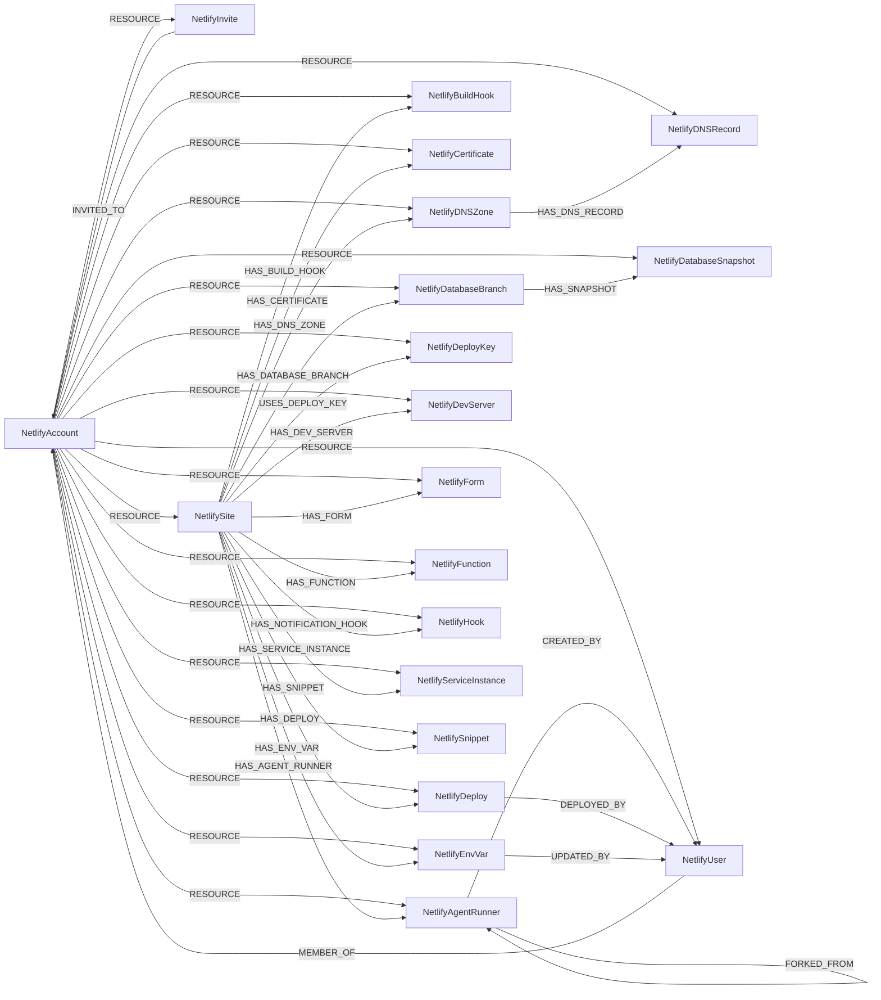

<!-- Generated from the data model. Do not edit manually. -->

## Netlify Schema

### NetlifyAccount

A Netlify team, the tenant that owns every other Netlify resource. Netlify has a single
tenancy level: one Cartography run syncs one team, and every other node in this module is
scoped to it.

> **Ontology Mapping**: This node uses the ontology label [`Tenant`](#ontology-tenant).

#### Properties

Ontology-generated fields are shown in *italics*.

| Field | Index | Description |
|-------|-------|-------------|
| id | Yes | The Netlify team id. |
| firstseen |  | Timestamp when a sync job first created this node. |
| lastupdated | Yes | Timestamp of the last sync that observed this node. |
| billing_email |  | Billing contact address. |
| block_site_transfers |  | Whether transferring sites out of the team is blocked. |
| created_at |  | When the team was created. |
| enforce_mfa |  | Whether MFA is enforced for team members (`not_enforced` / `enforced`). |
| enforce_saml |  | Whether SAML sign-in is enforced for team members. |
| has_site_password |  | Whether a team-wide site password is set. |
| lifecycle_state |  | Team lifecycle state, e.g. `active`. |
| members_count |  | Number of accepted members. |
| name | Yes | Display name of the team. |
| org_mfa_enabled |  | Whether the parent organization has MFA turned on. |
| org_saml_enabled |  | Whether the parent organization has SAML turned on. |
| owner_ids |  | User ids of the team owners. |
| roles_allowed |  | Member roles this plan permits. |
| saml_enabled |  | Whether SAML is configured on this team. |
| saml_session_expiration |  | SAML session lifetime in seconds. |
| site_access |  | Default site access granted to members (`all`, `none`, ...). |
| site_password_context |  | Which deploy contexts the site password applies to. |
| site_sso_login |  | Whether team SSO is required to view the team's sites. |
| site_sso_login_context |  | Which deploy contexts the site SSO requirement applies to. |
| slug | Yes | URL slug of the team, used to address it in the API. |
| support_administration_enabled |  | Whether Netlify support staff may access the team's resources. |
| team_registration_domains |  | Email domains whose users can join the team without an invite. |
| type_name |  | Human-readable plan name, e.g. `Free`, `Pro`. |
| type_slug |  | Plan identifier, e.g. `credit-free`. |
| updated_at |  | When the team was last modified. |
| *_ont_name* | Yes | Normalized field sourced from `name`. |
| *_ont_source* |  | Module that populated this node's ontology fields. |
| *_ont_status* | Yes | Normalized field sourced from `lifecycle_state`. |

#### Relationships

- `(:NetlifyInvite)-[:INVITED_TO]->(:NetlifyAccount)`: An outstanding invitation to a team. Deliberately not a membership edge: the address is not
a member of anything until it accepts.
  - Properties:

    | Field | Description |
    |-------|-------------|
    | created_at | When the invitation was issued. |
    | invite_id | Netlify's id for the invitation, when it reports one. |
    | membership_id | Id of the membership row holding the invitation. |
    | pending | Whether Netlify still reports the invitation as pending. |
    | role | Role the address is invited to hold in this team. |
    | self_invite_state | State of a self-service join request, when the address asked to join. |
    | site_access | Site access the invitation grants (`all`, `none`, ...). |
    | updated_at | When the invitation was last modified. |

- `(:NetlifyUser)-[:MEMBER_OF]->(:NetlifyAccount)`: Membership of a team. Everything that varies per team is carried here rather than on the
person, because the same human holds a different role, site access grant and invitation
state in every team they belong to. `pending` in particular is per team, so whether someone
is active is a fact about the membership, not about the identity.
  - Properties:

    | Field | Description |
    |-------|-------------|
    | created_at | When the membership was created. |
    | invite_id | Id of the outstanding invitation, when there is one. |
    | managed_by_directory_sync | Whether this membership is provisioned by directory sync. |
    | membership_id | Id of the membership row in this team. |
    | pending | Whether an invitation to this team is still outstanding. |
    | role | Role held in this team, e.g. `Owner`, `Collaborator`. |
    | site_access | Which of the team's sites this member can reach (`all`, `none`, ...). |
    | updated_at | When the membership was last modified. |

- `(:NetlifyAccount)-[:RESOURCE]->(:NetlifyAgentRunner)`

- `(:NetlifyAccount)-[:RESOURCE]->(:NetlifyBuildHook)`

- `(:NetlifyAccount)-[:RESOURCE]->(:NetlifyCertificate)`

- `(:NetlifyAccount)-[:RESOURCE]->(:NetlifyDNSRecord)`

- `(:NetlifyAccount)-[:RESOURCE]->(:NetlifyDNSZone)`

- `(:NetlifyAccount)-[:RESOURCE]->(:NetlifyDatabaseBranch)`

- `(:NetlifyAccount)-[:RESOURCE]->(:NetlifyDatabaseSnapshot)`

- `(:NetlifyAccount)-[:RESOURCE]->(:NetlifyDeploy)`

- `(:NetlifyAccount)-[:RESOURCE]->(:NetlifyDeployKey)`

- `(:NetlifyAccount)-[:RESOURCE]->(:NetlifyDevServer)`

- `(:NetlifyAccount)-[:RESOURCE]->(:NetlifyEnvVar)`

- `(:NetlifyAccount)-[:RESOURCE]->(:NetlifyForm)`

- `(:NetlifyAccount)-[:RESOURCE]->(:NetlifyFunction)`

- `(:NetlifyAccount)-[:RESOURCE]->(:NetlifyHook)`

- `(:NetlifyAccount)-[:RESOURCE]->(:NetlifyInvite)`: The team that issued the invitation. The same address can be invited to several teams.

- `(:NetlifyAccount)-[:RESOURCE]->(:NetlifyServiceInstance)`

- `(:NetlifyAccount)-[:RESOURCE]->(:NetlifySite)`

- `(:NetlifyAccount)-[:RESOURCE]->(:NetlifySnippet)`

- `(:NetlifyAccount)-[:RESOURCE]->(:NetlifyUser)`: The team this person is a member of. The identity itself is shared across teams.

### NetlifyAgentRunner

A Netlify AI agent runner: a non-human principal that edits a site's code and can push
branches and open pull requests on its behalf.

Only the runner is ingested, not its sessions: a session is a live execution record
(prompt, step list, result diff) rather than inventory.

#### Properties

| Field | Index | Description |
|-------|-------|-------------|
| id | Yes | The Netlify agent runner id. |
| firstseen |  | Timestamp when a sync job first created this node. |
| lastupdated | Yes | Timestamp of the last sync that observed this node. |
| active_session_created_at |  | When the currently active session started. |
| base_deploy_id |  | Deploy the runner started from. |
| branch |  | Branch the runner started from. |
| code_origin |  | Where the runner's starting code came from, e.g. `zip`, `git`. |
| created_at |  | When the runner was created. |
| current_task |  | What the runner is doing right now. |
| done_at |  | When the runner finished. |
| has_result_diff |  | Whether the runner produced a diff. |
| latest_session_is_published |  | Whether the most recent session's result was published. |
| latest_session_mode |  | Mode of the most recent session. |
| latest_session_state |  | State of the runner's most recent session. |
| merge_commit_error |  | Why creating the merge commit failed. |
| merge_commit_sha |  | Merge commit the runner created. |
| merge_target_available |  | Whether the runner can merge its result. |
| needs_git_sync |  | Whether the runner's branch is behind its base. |
| parent_agent_runner_id |  | Runner this one was forked from. |
| pr_branch |  | Branch the pull request is based on. |
| pr_error |  | Why opening the pull request failed. |
| pr_number |  | Pull request number. |
| pr_state |  | Pull request state. |
| pr_url |  | Pull request the runner opened. |
| result_branch |  | Branch the runner pushed its result to. |
| sha |  | Commit the runner produced. |
| site_id |  | Id of the site the runner works on. |
| state |  | Runner state, e.g. `new`, `running`, `done`. |
| title |  | Title Netlify derived from the prompt. |
| updated_at |  | When the runner was last modified. |
| user_id |  | User who started the runner. |

#### Relationships

- `(:NetlifyAgentRunner)-[:CREATED_BY]->(:NetlifyUser)`: The team member who started this agent runner.

- `(:NetlifyAgentRunner)-[:FORKED_FROM]->(:NetlifyAgentRunner)`: The runner this one was forked from, when it started as a fork of another.

- `(:NetlifySite)-[:HAS_AGENT_RUNNER]->(:NetlifyAgentRunner)`

- `(:NetlifyAccount)-[:RESOURCE]->(:NetlifyAgentRunner)`

### NetlifyBuildHook

An incoming build hook: an unauthenticated URL that triggers a production deploy.

The URL is not ingested. Anyone holding it can deploy the site, so it is bearer-equivalent
and belongs in a secret store, not in the graph.

#### Properties

| Field | Index | Description |
|-------|-------|-------------|
| id | Yes | The Netlify build hook id. |
| firstseen |  | Timestamp when a sync job first created this node. |
| lastupdated | Yes | Timestamp of the last sync that observed this node. |
| branch |  | Branch the hook builds when triggered. |
| created_at |  | When the hook was created. |
| draft |  | Whether the hook produces a draft deploy. |
| site_id |  | Id of the site the hook deploys. |
| title |  | Display title. |

#### Relationships

- `(:NetlifySite)-[:HAS_BUILD_HOOK]->(:NetlifyBuildHook)`

- `(:NetlifyAccount)-[:RESOURCE]->(:NetlifyBuildHook)`

### NetlifyCertificate

The TLS certificate serving a Netlify site's custom domains.

> **Ontology Mapping**: This node uses the ontology label [`Certificate`](#ontology-certificate).

#### Properties

Ontology-generated fields are shown in *italics*.

| Field | Index | Description |
|-------|-------|-------------|
| id | Yes | `<site_id>_ssl`. Netlify's TLS endpoint returns a certificate with no identifier of any kind, and a site has at most one. Nothing time-varying goes into the id: folding `expires_at` in would give the node a new identity on every renewal and defeat cleanup. |
| firstseen |  | Timestamp when a sync job first created this node. |
| lastupdated | Yes | Timestamp of the last sync that observed this node. |
| created_at |  | When the certificate was issued. |
| domain | Yes | Primary domain, the first entry of `domains`. |
| domains |  | Every domain the certificate covers. |
| expires_at |  | When the certificate expires. |
| site_id |  | Id of the site the certificate serves. |
| state |  | Certificate state, e.g. `issued`, `provisioning`. |
| updated_at |  | When the certificate was last renewed. |
| *_ont_domain* | Yes | Normalized field sourced from `domain`. |
| *_ont_expiry* | Yes | Normalized field sourced from `expires_at`. |
| *_ont_source* |  | Module that populated this node's ontology fields. |

#### Relationships

- `(:NetlifySite)-[:HAS_CERTIFICATE]->(:NetlifyCertificate)`

- `(:NetlifyAccount)-[:RESOURCE]->(:NetlifyCertificate)`

### NetlifyDatabaseBranch

A branch of a Netlify DB (Neon) Postgres database attached to a site.

> **Ontology Mapping**: This node uses the ontology label [`Database`](#ontology-database).

#### Properties

Ontology-generated fields are shown in *italics*.

| Field | Index | Description |
|-------|-------|-------------|
| id | Yes | Composite `<site_id>\|<branch_id>`. Netlify's `branch_id` is only unique within a site: the primary branch is called `production` on every Netlify DB. |
| firstseen |  | Timestamp when a sync job first created this node. |
| lastupdated | Yes | Timestamp of the last sync that observed this node. |
| branch_id |  | Netlify's branch identifier. |
| compute_last_active |  | When the compute endpoint last served a query. |
| compute_max_cu |  | Maximum autoscaling compute units. |
| compute_min_cu |  | Minimum autoscaling compute units. |
| compute_state |  | State of the branch's compute endpoint, e.g. `active`, `idle`. |
| compute_suspend_timeout_seconds |  | Idle seconds before the compute endpoint suspends. |
| connection_roles |  | Database roles Netlify issued a connection string for. |
| created_at |  | When the branch was created. |
| last_active_at |  | When the branch was last active. |
| logical_size_bytes |  | Logical size of the branch's data. |
| name | Yes | Branch name. |
| site_id |  | Id of the site the database is attached to. |
| state |  | Branch state, e.g. `ready`. |
| updated_at |  | When the branch was last modified. |
| *_ont_encrypted* | Yes | Property generated by the ontology mapping. |
| *_ont_name* | Yes | Normalized field sourced from `name`. |
| *_ont_source* |  | Module that populated this node's ontology fields. |
| *_ont_type* | Yes | Property generated by the ontology mapping. |

#### Relationships

- `(:NetlifySite)-[:HAS_DATABASE_BRANCH]->(:NetlifyDatabaseBranch)`

- `(:NetlifyDatabaseBranch)-[:HAS_SNAPSHOT]->(:NetlifyDatabaseSnapshot)`

- `(:NetlifyAccount)-[:RESOURCE]->(:NetlifyDatabaseBranch)`

### NetlifyDatabaseSnapshot

A point-in-time snapshot of a Netlify DB branch.

> **Ontology Mapping**: This node uses the ontology label [`Snapshot`](#ontology-snapshot).

#### Properties

Ontology-generated fields are shown in *italics*.

| Field | Index | Description |
|-------|-------|-------------|
| id | Yes | The Netlify snapshot id. |
| firstseen |  | Timestamp when a sync job first created this node. |
| lastupdated | Yes | Timestamp of the last sync that observed this node. |
| created_at |  | When the snapshot was taken. |
| expires_at |  | When the snapshot is deleted. |
| manual |  | Whether the snapshot was taken by hand rather than on Netlify's schedule. |
| name | Yes | Derived `<source_branch_id>@<timestamp>`. Netlify gives a snapshot no name of its own. |
| site_id |  | Id of the site the snapshotted database belongs to. |
| source_branch_id |  | Netlify's branch identifier of the snapshotted branch. |
| source_branch_node_id |  | `NetlifyDatabaseBranch.id` of the snapshotted branch. |
| timestamp |  | Point in time the snapshot captures. |
| *_ont_created_at* | Yes | Normalized field sourced from `created_at`. |
| *_ont_encrypted* | Yes | Property generated by the ontology mapping. |
| *_ont_name* | Yes | Normalized field sourced from `name`. |
| *_ont_public* | Yes | Property generated by the ontology mapping. |
| *_ont_source* |  | Module that populated this node's ontology fields. |
| *_ont_source_id* | Yes | Normalized field sourced from `source_branch_node_id`. |

#### Relationships

- `(:NetlifyDatabaseBranch)-[:HAS_SNAPSHOT]->(:NetlifyDatabaseSnapshot)`

- `(:NetlifyAccount)-[:RESOURCE]->(:NetlifyDatabaseSnapshot)`

### NetlifyDeploy

The deploy currently published on a Netlify site.

Only the published deploy is ingested. Netlify keeps the full deploy history behind a
paginated endpoint that can hold thousands of entries per site, and the published deploy is
embedded in the site payload, so this costs no extra API request and yields a bounded,
deterministic set that cleanup can safely treat as exhaustive.

#### Properties

| Field | Index | Description |
|-------|-------|-------------|
| id | Yes | The Netlify deploy id. |
| firstseen |  | Timestamp when a sync job first created this node. |
| lastupdated | Yes | Timestamp of the last sync that observed this node. |
| admin_url |  | Netlify admin URL for the deploy. |
| agent_runner_id |  | Set when a Netlify AI agent runner produced the deploy rather than a human. |
| blobs_region |  | Region the deploy's blob store lives in. |
| branch |  | Branch the deploy was built from. |
| build_id |  | Id of the build that produced the deploy, when there was one. |
| commit_message |  | Commit message. |
| commit_ref | Yes | Commit SHA the deploy was built from. |
| commit_url |  | Link to the commit on the git provider. |
| committer |  | Committer handle. |
| context |  | Deploy context, e.g. `production`, `deploy-preview`, `branch-deploy`. |
| created_at |  | When the deploy was created. |
| database_branch_id |  | Netlify DB branch this deploy is wired to. |
| deploy_source |  | How the deploy was submitted, e.g. `cli`, `git`, `api`. |
| deploy_ssl_url |  | HTTPS permalink of this specific deploy. |
| deploy_time |  | How long the deploy took, in seconds. |
| deploy_url |  | Permalink URL of this specific deploy. |
| draft |  | Whether the deploy is a draft. |
| edge_functions_present |  | Whether the deploy ships edge functions. |
| error_message |  | Failure reason, when the deploy failed. |
| framework |  | Framework Netlify detected. |
| functions_region |  | Region the deploy's functions run in. |
| locked |  | Whether the deploy is pinned as published. |
| manual_deploy |  | Whether a prebuilt artifact was uploaded rather than built from git. |
| name |  | Site name at deploy time. |
| pending_review_reason |  | Why the deploy is awaiting review. |
| public_repo |  | Whether the source repository was public at deploy time. |
| published_at |  | When the deploy became the published one. |
| required_edge_functions |  | Edge function ids the deploy requires. |
| required_functions |  | Function ids the deploy requires. |
| review_id |  | Pull request number the deploy previews. |
| review_url |  | Pull request URL the deploy previews. |
| secrets_scan_files_scanned |  | Number of files Netlify's secrets scanner checked. |
| secrets_scan_matches_count |  | Number of secrets the scanner matched. The matched values themselves are never ingested. |
| site_id |  | Id of the site this deploy belongs to. |
| skipped |  | Whether the build was skipped. |
| ssl_url |  | HTTPS URL served by this deploy. |
| state |  | Deploy state, e.g. `ready`, `error`, `building`. |
| strict_contributor_verification_failure |  | True when Netlify could not verify the committer against the team. Unattributed code reached the site. |
| updated_at |  | When the deploy was last modified. |
| url |  | Primary URL served by this deploy. |

#### Relationships

- `(:NetlifyDeploy)-[:DEPLOYED_BY]->(:NetlifyUser)`: The team member who triggered the deploy, when Netlify attributes it to one.

- `(:NetlifySite)-[:HAS_DEPLOY]->(:NetlifyDeploy)`: The deploy currently published on the site. Cartography ingests only the published
deploy, not the site's deploy history, so a site has at most one of these.

- `(:NetlifyAccount)-[:RESOURCE]->(:NetlifyDeploy)`

### NetlifyDeployKey

An SSH deploy key Netlify uses to clone a site's source repository.

The team edge is a MatchLink and the sites-using-it edge is declared on NetlifySite; see the
module docstring.

#### Properties

| Field | Index | Description |
|-------|-------|-------------|
| id | Yes | The Netlify deploy key id. |
| firstseen |  | Timestamp when a sync job first created this node. |
| lastupdated | Yes | Timestamp of the last sync that observed this node. |
| created_at |  | When the key was created. |
| public_key |  | Public half of the SSH keypair. |

#### Relationships

- `(:NetlifyAccount)-[:RESOURCE]->(:NetlifyDeployKey)`

- `(:NetlifySite)-[:USES_DEPLOY_KEY]->(:NetlifyDeployKey)`: The SSH key the site uses to clone its private repository. This edge is also what
determines which keys are ingested at all: Netlify lists deploy keys per token rather
than per team, so only keys a team's own sites reference are attached to that team.

### NetlifyDevServer

A Netlify cloud dev server: an ephemeral container running a site's working copy.

> **Ontology Mapping**: This node uses the ontology label [`ComputeInstance`](#ontology-computeinstance).

#### Properties

Ontology-generated fields are shown in *italics*.

| Field | Index | Description |
|-------|-------|-------------|
| id | Yes | The Netlify dev server id. |
| firstseen |  | Timestamp when a sync job first created this node. |
| lastupdated | Yes | Timestamp of the last sync that observed this node. |
| branch |  | Branch the dev server serves. |
| created_at |  | When the dev server was created. |
| done_at |  | When the dev server shut down. |
| enqueued_at |  | When the dev server was requested. |
| environment |  | Environment name the dev server runs as. |
| error_at |  | When the dev server failed. |
| last_activity_at |  | Last request the dev server served. |
| live_at |  | When the dev server became reachable. |
| site_id |  | Id of the site the dev server runs a copy of. |
| starting_at |  | When the dev server began starting. |
| state |  | Dev server state, e.g. `enqueued`, `starting`, `live`, `done`. |
| stop_reason |  | Why the dev server stopped. |
| title |  | Display title. |
| updated_at |  | When the dev server was last modified. |
| url | Yes | Public hostname serving the dev server. |
| *_ont_created_at* | Yes | Normalized field sourced from `created_at`. |
| *_ont_name* | Yes | Normalized field sourced from `branch`. |
| *_ont_source* |  | Module that populated this node's ontology fields. |
| *_ont_state* | Yes | Normalized field sourced from `state`. |

#### Relationships

- `(:NetlifySite)-[:HAS_DEV_SERVER]->(:NetlifyDevServer)`

- `(:PublicIP)-[:POINTS_TO]->(:NetlifyDevServer)`

- `(:NetlifyAccount)-[:RESOURCE]->(:NetlifyDevServer)`

### NetlifyDNSRecord

A record in a Netlify DNS zone.

> **Ontology Mapping**: This node uses the ontology label [`DNSRecord`](#ontology-dnsrecord).

#### Properties

Ontology-generated fields are shown in *italics*.

| Field | Index | Description |
|-------|-------|-------------|
| id | Yes | The Netlify DNS record id. |
| firstseen |  | Timestamp when a sync job first created this node. |
| lastupdated | Yes | Timestamp of the last sync that observed this node. |
| dns_zone_id |  | Id of the zone holding the record. |
| flag |  | CAA flag. |
| hostname |  | Record hostname as Netlify reports it. |
| managed |  | Whether Netlify created and maintains the record itself. A false value means someone set it by hand. |
| name | Yes | Record hostname. Netlify calls this `hostname`; it is copied to `name` for the ontology mapping. |
| priority |  | Priority, for `MX` and `SRV` records. |
| site_id |  | Id of the site the record points at, when Netlify manages it. |
| tag |  | CAA tag. |
| ttl |  | Time to live, in seconds. |
| type |  | Record type, e.g. `A`, `CNAME`, `MX`, `TXT`. |
| value | Yes | Record value or target. |
| *_ont_name* | Yes | Normalized field sourced from `name`. |
| *_ont_source* |  | Module that populated this node's ontology fields. |
| *_ont_type* | Yes | Normalized field sourced from `type`. |
| *_ont_value* | Yes | Normalized field sourced from `value`. |

#### Relationships

- `(:NetlifyDNSZone)-[:HAS_DNS_RECORD]->(:NetlifyDNSRecord)`

- `(:NetlifyAccount)-[:RESOURCE]->(:NetlifyDNSRecord)`

### NetlifyDNSZone

A DNS zone hosted on Netlify DNS.

> **Ontology Mapping**: This node uses the ontology label [`DNSZone`](#ontology-dnszone).

#### Properties

Ontology-generated fields are shown in *italics*.

| Field | Index | Description |
|-------|-------|-------------|
| id | Yes | The Netlify DNS zone id. |
| firstseen |  | Timestamp when a sync job first created this node. |
| lastupdated | Yes | Timestamp of the last sync that observed this node. |
| created_at |  | When the zone was created. |
| dedicated |  | Whether the zone is on dedicated nameservers. |
| dns_servers |  | Nameservers the zone must be delegated to. |
| domain |  | Apex domain of the zone. Taken from the domain registration's name when the domain was bought through Netlify. |
| domain_auto_renew |  | Whether the registration renews automatically. A false value is a hijack candidate. |
| domain_expires_at |  | When the domain registration expires. A near expiry is a hijack candidate. |
| domain_registered_at |  | When the apex domain was registered, for a domain bought through Netlify. |
| domain_registration_status |  | Registration status Netlify reports, e.g. `payment_succeeded`. |
| errors |  | Delegation or validation problems Netlify reports. A zone in error is a dangling-delegation candidate. |
| ipv6_enabled |  | Whether IPv6 records are enabled. |
| name | Yes | Zone name. |
| site_id |  | Id of the site the zone is attached to, when it is not held at team level. |
| supported_record_types |  | Record types the zone accepts. |
| updated_at |  | When the zone was last modified. |
| *_ont_name* | Yes | Normalized field sourced from `name`. |
| *_ont_public* | Yes | Property generated by the ontology mapping. |
| *_ont_source* |  | Module that populated this node's ontology fields. |

#### Relationships

- `(:NetlifyDNSZone)-[:HAS_DNS_RECORD]->(:NetlifyDNSRecord)`

- `(:NetlifySite)-[:HAS_DNS_ZONE]->(:NetlifyDNSZone)`

- `(:NetlifyAccount)-[:RESOURCE]->(:NetlifyDNSZone)`

### NetlifyEnvVar

A Netlify environment variable, team-wide or scoped to one site.

Values are never ingested. Netlify masks a secret value down to its last four characters and
returns a non-secret value in full, so transform() drops the `values[].value` field
entirely and keeps only the contexts each value was set for.

> **Conditional Labels**:
>
> - [`Secret`](#ontology-secret) (ontology label) when `is_secret_flag` equals `true`. A cross-provider Secret resource in Cartography's ontology.

#### Properties

Ontology-generated fields are shown in *italics*.

| Field | Index | Description |
|-------|-------|-------------|
| id | Yes | Composite `<account_id>\|<site_id>\|<key>`, with `_account` in place of the site id for a team-wide variable. The key is the only stable natural identifier, and the same key can exist at both scopes. |
| firstseen |  | Timestamp when a sync job first created this node. |
| lastupdated | Yes | Timestamp of the last sync that observed this node. |
| contexts |  | Deploy contexts the variable is set for. |
| is_secret |  | Whether Netlify marks the variable secret. |
| is_secret_flag |  | String mirror of `is_secret`. Conditional extra labels are compared as Cypher strings, so a real boolean would never match. |
| key | Yes | Variable name. |
| scope |  | `site` or `account`. |
| scopes |  | Where the variable is readable: `builds`, `functions`, `runtime`, `post_processing`. |
| site_id |  | Id of the site, empty for a team-wide variable. |
| updated_at |  | When the variable was last changed. |
| *_ont_name* | Yes | Normalized field sourced from `key`. |
| *_ont_source* |  | Module that populated this node's ontology fields. |
| *_ont_updated_at* | Yes | Normalized field sourced from `updated_at`. |

#### Relationships

- `(:NetlifySite)-[:HAS_ENV_VAR]->(:NetlifyEnvVar)`

- `(:NetlifyAccount)-[:RESOURCE]->(:NetlifyEnvVar)`

- `(:NetlifyEnvVar)-[:UPDATED_BY]->(:NetlifyUser)`: The team member who last changed this variable.

### NetlifyForm

A form Netlify detected on a site, together with the submissions it collects.

#### Properties

| Field | Index | Description |
|-------|-------|-------------|
| id | Yes | The Netlify form id. |
| firstseen |  | Timestamp when a sync job first created this node. |
| lastupdated | Yes | Timestamp of the last sync that observed this node. |
| created_at |  | When the form was first detected. |
| field_names |  | Names of the form's input fields. |
| name | Yes | Form name, from the `name` attribute of the HTML form. |
| paths |  | Site paths the form was detected on. |
| site_id |  | Id of the site the form was detected on. |
| submission_count |  | Number of submissions Netlify has stored. |

#### Relationships

- `(:NetlifySite)-[:HAS_FORM]->(:NetlifyForm)`

- `(:NetlifyAccount)-[:RESOURCE]->(:NetlifyForm)`

### NetlifyFunction

A serverless function deployed on a Netlify site.

> **Ontology Mapping**: This node uses the ontology label [`Function`](#ontology-function).

#### Properties

Ontology-generated fields are shown in *italics*.

| Field | Index | Description |
|-------|-------|-------------|
| id | Yes | Composite `<site_id>\|<branch>\|<name>`. Netlify's own function ids are content hashes that change on every build, so keying on them would create a new node per deploy. |
| firstseen |  | Timestamp when a sync job first created this node. |
| lastupdated | Yes | Timestamp of the last sync that observed this node. |
| branch |  | Branch the function bundle was built from. |
| content_digest |  | Digest of the function's built artifact. |
| created_at |  | When the function bundle was built. |
| endpoint |  | Publicly reachable invocation URL. |
| invocation_mode |  | How the function is invoked, e.g. `stream`, `buffer`. |
| log_type |  | Logging pipeline the function reports to. |
| memory_mb |  | Memory allocated to the function, in MB. |
| name | Yes | Function name, which is also its route segment. |
| provider |  | Underlying compute provider, e.g. `aws_lambda`. |
| provider_account_id |  | Provider account the function runs in. |
| provider_function_id |  | Netlify's per-build function id. |
| region |  | Region the function runs in. |
| runtime |  | Runtime the function executes on, e.g. `nodejs24.x`. |
| schedule |  | Cron expression, when the function runs on a schedule rather than on request. |
| site_id |  | Id of the site the function is deployed on. |
| size_bytes |  | Size of the built artifact. |
| *_ont_deployment_type* | Yes | Property generated by the ontology mapping. |
| *_ont_memory* | Yes | Normalized field sourced from `memory_mb`. |
| *_ont_name* | Yes | Normalized field sourced from `name`. |
| *_ont_runtime* | Yes | Normalized field sourced from `runtime`. |
| *_ont_source* |  | Module that populated this node's ontology fields. |

#### Relationships

- `(:NetlifySite)-[:HAS_FUNCTION]->(:NetlifyFunction)`

- `(:NetlifyFunction)-[:RESOLVED_IMAGE]->(:Image)`: generated by analysis job `Function RESOLVED_IMAGE analysis`.

- `(:NetlifyAccount)-[:RESOURCE]->(:NetlifyFunction)`

### NetlifyHook

An outgoing notification hook: where Netlify reports a site's deploy events.

The hook's `data` object is not ingested. Depending on the hook type it holds the Slack
incoming-webhook URL, the target webhook URL, or a git provider access token, all of which
are credentials.

#### Properties

| Field | Index | Description |
|-------|-------|-------------|
| id | Yes | The Netlify hook id. |
| firstseen |  | Timestamp when a sync job first created this node. |
| lastupdated | Yes | Timestamp of the last sync that observed this node. |
| created_at |  | When the hook was created. |
| disabled |  | Whether the hook is turned off. |
| event |  | Deploy lifecycle event that fires it, e.g. `deploy_created`, `deploy_failed`. |
| site_id |  | Id of the site whose events the hook reports. |
| type |  | Destination kind, e.g. `url`, `slack`, `email`, `github_commit_status`. |
| updated_at |  | When the hook was last modified. |

#### Relationships

- `(:NetlifySite)-[:HAS_NOTIFICATION_HOOK]->(:NetlifyHook)`

- `(:NetlifyAccount)-[:RESOURCE]->(:NetlifyHook)`

### NetlifyInvite

An email address invited to a Netlify team that has not accepted yet.

A team member is invited by email address alone, so the membership exists before any Netlify
user is attached to it. NetlifyUser is keyed on the user id, so those rows get their own node
keyed on the email, the only identity they have. An existing user invited to a further team
is a NetlifyUser with a pending membership instead, since the person already exists.

It carries no ontology label on purpose: there is no account behind the address, so calling
it a user account would put a non-existent identity into cross-provider identity queries.

The node is deleted once no team holds the invitation any more, which is what happens when it
is accepted or revoked. An address still invited elsewhere survives.

#### Properties

| Field | Index | Description |
|-------|-------|-------------|
| id | Yes | The invited email address. |
| firstseen |  | Timestamp when a sync job first created this node. |
| lastupdated | Yes | Timestamp of the last sync that observed this node. |
| email | Yes | The invited email address. |

#### Relationships

- `(:NetlifyInvite)-[:INVITED_TO]->(:NetlifyAccount)`: An outstanding invitation to a team. Deliberately not a membership edge: the address is not
a member of anything until it accepts.
  - Properties:

    | Field | Description |
    |-------|-------------|
    | created_at | When the invitation was issued. |
    | invite_id | Netlify's id for the invitation, when it reports one. |
    | membership_id | Id of the membership row holding the invitation. |
    | pending | Whether Netlify still reports the invitation as pending. |
    | role | Role the address is invited to hold in this team. |
    | self_invite_state | State of a self-service join request, when the address asked to join. |
    | site_access | Site access the invitation grants (`all`, `none`, ...). |
    | updated_at | When the invitation was last modified. |

- `(:NetlifyAccount)-[:RESOURCE]->(:NetlifyInvite)`: The team that issued the invitation. The same address can be invited to several teams.

### NetlifyServiceInstance

A third-party add-on installed on a Netlify site.

The instance's `config` and `env` objects are not ingested: they hold the add-on's
provisioned credentials, and `auth_url` is a pre-authenticated sign-in link.

> **Ontology Mapping**: This node uses the ontology label [`ThirdPartyApp`](#ontology-thirdpartyapp).

#### Properties

Ontology-generated fields are shown in *italics*.

| Field | Index | Description |
|-------|-------|-------------|
| id | Yes | The Netlify service instance id. |
| firstseen |  | Timestamp when a sync job first created this node. |
| lastupdated | Yes | Timestamp of the last sync that observed this node. |
| created_at |  | When the add-on was installed. |
| service_name |  | Add-on display name. |
| service_path |  | Site path the add-on is mounted at. |
| service_slug | Yes | Add-on slug, its stable identifier. |
| site_id |  | Id of the site the add-on is installed on. |
| updated_at |  | When the add-on was last modified. |
| url |  | Add-on URL. |
| *_ont_client_id* | Yes | Normalized field sourced from `service_slug`. |
| *_ont_enabled* | Yes | Property generated by the ontology mapping. |
| *_ont_name* | Yes | Normalized field sourced from `service_name`. |
| *_ont_source* |  | Module that populated this node's ontology fields. |

#### Relationships

- `(:User)-[:AUTHORIZED]->(:NetlifyServiceInstance)`: generated by analysis job `Ontology - User AUTHORIZED ThirdPartyApp linking`.
  - Properties:

    | Field | Description |
    |-------|-------------|
    | scopes | Property generated by analysis job: `Ontology - User AUTHORIZED ThirdPartyApp linking`. |

- `(:NetlifySite)-[:HAS_SERVICE_INSTANCE]->(:NetlifyServiceInstance)`

- `(:NetlifyAccount)-[:RESOURCE]->(:NetlifyServiceInstance)`

### NetlifySite

A Netlify site: the deployed web application, its entry points and its build settings.

> **Ontology Mapping**: This node uses the ontology label [`ComputeService`](#ontology-computeservice).

#### Properties

Ontology-generated fields are shown in *italics*.

| Field | Index | Description |
|-------|-------|-------------|
| id | Yes | The Netlify site id. |
| firstseen |  | Timestamp when a sync job first created this node. |
| lastupdated | Yes | Timestamp of the last sync that observed this node. |
| account_sso_login |  | Whether the team-level SSO requirement applies to this site. |
| account_sso_login_context |  | Which deploy contexts the team-level SSO requirement applies to. |
| admin_url |  | Netlify admin URL for the site. |
| automatic_tls_provisioning |  | Whether Netlify provisions certificates automatically. |
| branch_deploy_custom_domain |  | Custom domain pattern for branch deploys. |
| build_command |  | Build command. |
| build_image |  | Build image the site builds on, e.g. `noble`. |
| created_at |  | When the site was created. |
| custom_domain | Yes | Customer's own primary domain, if set. |
| default_domain | Yes | Always-present `*.netlify.app` hostname. |
| deploy_key_id |  | Id of the deploy key used to clone the repository. |
| deploy_preview_custom_domain |  | Custom domain pattern for deploy previews. |
| deploy_retention_in_days |  | How long deploys are kept. |
| disabled |  | Whether the site has been taken offline. |
| disabled_reason |  | Why the site was taken offline. |
| dns_zone_id |  | Id of the Netlify DNS zone serving the site, if any. |
| domain_aliases |  | Additional domains serving the same site. |
| exposed_internet | Yes | `True` when the site is served and no access gate covers it. Only a gate whose context is `all` counts, since a context-scoped one leaves production open. |
| exposed_internet_type | Yes | How it is exposed. Always `direct`, since the site is served at its own URL. |
| force_ssl |  | Whether plain HTTP is redirected to HTTPS. |
| functions_dir |  | Directory holding the serverless functions. |
| functions_region |  | Region the site's serverless functions run in. |
| functions_timeout |  | Function timeout in seconds. |
| git_provider |  | Git provider backing the site, e.g. `github`. |
| has_database |  | Whether a Netlify DB is attached. |
| has_jwt_secret |  | Whether a Netlify Identity JWT signing secret is configured. The secret itself is dropped. |
| has_password |  | Whether the site is behind a password. The password itself is never returned by the API. |
| identity_instance_id |  | Netlify Identity instance backing the site, if any. |
| jwt_roles_path |  | JSON path in the JWT where Netlify reads role claims. |
| lifecycle_state |  | Site lifecycle state, e.g. `active`. |
| managed_dns |  | Whether the site's DNS is hosted on Netlify DNS. |
| name | Yes | Site name, which is also its `*.netlify.app` subdomain. |
| password_context |  | Which deploy contexts the password applies to. |
| plan |  | Plan the site is billed on, e.g. `nf_team_dev`. |
| prerender |  | Prerendering setting. |
| prevent_non_git_prod_deploys |  | Whether production deploys must come from git rather than an upload. |
| publish_dir |  | Directory published as the site root. |
| repo_allowed_branches |  | Branches Netlify is allowed to build. |
| repo_branch |  | Production branch. |
| repo_path | Yes | Source repository in `owner/name` form, used to join to `GitHubRepository`. |
| repo_private_logs |  | Whether build logs are kept private. |
| repo_public |  | Whether the source repository is public. |
| repo_stop_builds |  | Whether automatic builds are paused. |
| repo_url |  | Source repository URL. |
| ssl |  | Whether a TLS certificate is in place. |
| ssl_status |  | Provisioning status of the certificate. |
| ssl_url |  | HTTPS URL of the site. |
| sso_login |  | Whether Netlify SSO is required to view the site. |
| sso_login_context |  | Which deploy contexts the SSO requirement applies to. |
| state |  | Site state, e.g. `current`, `building`, `error`. |
| updated_at |  | When the site was last modified. |
| url | Yes | Primary URL of the site. |
| use_edge_handlers |  | Whether edge handlers are enabled. |
| use_forms |  | Whether form detection is enabled. |
| use_functions |  | Whether serverless functions are enabled. |
| *_ont_name* | Yes | Normalized field sourced from `name`. |
| *_ont_source* |  | Module that populated this node's ontology fields. |
| *_ont_status* | Yes | Normalized field sourced from `state`. |

#### Relationships

- `(:NetlifySite)-[:DEPLOYED_FROM]->(:GitHubRepository)`: The GitHub repository the site builds from, joined on the repository's full name.
Best effort: the edge only exists if that repository has also been ingested.

- `(:NetlifySite)-[:HAS_AGENT_RUNNER]->(:NetlifyAgentRunner)`

- `(:NetlifySite)-[:HAS_BUILD_HOOK]->(:NetlifyBuildHook)`

- `(:NetlifySite)-[:HAS_CERTIFICATE]->(:NetlifyCertificate)`

- `(:NetlifySite)-[:HAS_DATABASE_BRANCH]->(:NetlifyDatabaseBranch)`

- `(:NetlifySite)-[:HAS_DEPLOY]->(:NetlifyDeploy)`: The deploy currently published on the site. Cartography ingests only the published
deploy, not the site's deploy history, so a site has at most one of these.

- `(:NetlifySite)-[:HAS_DEV_SERVER]->(:NetlifyDevServer)`

- `(:NetlifySite)-[:HAS_DNS_ZONE]->(:NetlifyDNSZone)`

- `(:NetlifySite)-[:HAS_ENV_VAR]->(:NetlifyEnvVar)`

- `(:NetlifySite)-[:HAS_FORM]->(:NetlifyForm)`

- `(:NetlifySite)-[:HAS_FUNCTION]->(:NetlifyFunction)`

- `(:NetlifySite)-[:HAS_NOTIFICATION_HOOK]->(:NetlifyHook)`

- `(:NetlifySite)-[:HAS_RUNTIME_IMAGE]->(:Image)`: generated by analysis job `Workload HAS_RUNTIME_IMAGE inventory analysis`.
  - Properties:

    | Field | Description |
    |-------|-------------|
    | exposed_internet | Property generated by analysis job: `Workload HAS_RUNTIME_IMAGE inventory analysis`. |

- `(:NetlifySite)-[:HAS_SERVICE_INSTANCE]->(:NetlifyServiceInstance)`

- `(:NetlifySite)-[:HAS_SNIPPET]->(:NetlifySnippet)`

- `(:NetlifyAccount)-[:RESOURCE]->(:NetlifySite)`

- `(:NetlifySite)-[:USES_DEPLOY_KEY]->(:NetlifyDeployKey)`: The SSH key the site uses to clone its private repository. This edge is also what
determines which keys are ingested at all: Netlify lists deploy keys per token rather
than per team, so only keys a team's own sites reference are attached to that team.

### NetlifySnippet

A snippet: arbitrary markup Netlify injects into every page a site serves.

Snippets execute in every visitor's browser with the site's origin, so a third-party script
added here has the same reach as first-party code.

#### Properties

| Field | Index | Description |
|-------|-------|-------------|
| id | Yes | Composite `<site_id>\|<snippet_index>`. Netlify's snippet id is the snippet's position in the site's list, so it collides across sites and is renumbered when an earlier snippet is deleted. |
| firstseen |  | Timestamp when a sync job first created this node. |
| lastupdated | Yes | Timestamp of the last sync that observed this node. |
| general |  | The injected markup. |
| general_position |  | Where the general markup is injected: `head` or `footer`. |
| goal |  | The goal-tracking markup. |
| goal_position |  | Where the goal markup is injected. |
| site_id |  | Id of the site the snippet is injected into. |
| snippet_index |  | Netlify's positional snippet id. |
| title |  | Display title. |

#### Relationships

- `(:NetlifySite)-[:HAS_SNIPPET]->(:NetlifySnippet)`

- `(:NetlifyAccount)-[:RESOURCE]->(:NetlifySnippet)`

### NetlifyUser

A member of a Netlify team, keyed on the person rather than on the membership row, so one
human is one node even when they belong to several teams.

The node is never deleted by a team's cleanup: other teams and other modules may still
reference the identity. Removing someone from a team drops that team's edges and leaves a
bare node behind, so ask who is on a team by traversing the membership edge rather than by
node existence.

A membership Netlify has not linked a user to becomes a NetlifyInvite instead. The split is
on whether a user exists, not on whether the membership is pending: someone who already has
a Netlify account and is invited to a further team stays a NetlifyUser with a pending
membership.

> **Ontology Mapping**: This node uses the ontology label [`UserAccount`](#ontology-useraccount).

#### Properties

Ontology-generated fields are shown in *italics*.

| Field | Index | Description |
|-------|-------|-------------|
| id | Yes | The Netlify user id of the person. |
| firstseen |  | Timestamp when a sync job first created this node. |
| lastupdated | Yes | Timestamp of the last sync that observed this node. |
| avatar |  | Avatar image URL. |
| connected_account_providers |  | Identity providers linked to the account, e.g. `["google"]`. |
| email | Yes | Email address. |
| full_name |  | Display name. Netlify never splits this into first and last name. |
| last_activity_date |  | Date of last activity, as a date string. |
| mfa_enabled |  | Whether the account has MFA enabled. |
| *_ont_email* | Yes | Normalized field sourced from `email`. |
| *_ont_fullname* | Yes | Normalized field sourced from `full_name`. |
| *_ont_has_mfa* | Yes | Normalized field sourced from `mfa_enabled`. |
| *_ont_lastactivity* | Yes | Normalized field sourced from `last_activity_date`. |
| *_ont_source* |  | Module that populated this node's ontology fields. |

#### Relationships

- `(:NetlifyAgentRunner)-[:CREATED_BY]->(:NetlifyUser)`: The team member who started this agent runner.

- `(:NetlifyDeploy)-[:DEPLOYED_BY]->(:NetlifyUser)`: The team member who triggered the deploy, when Netlify attributes it to one.

- `(:User)-[:HAS_ACCOUNT]->(:NetlifyUser)`

- `(:NetlifyUser)-[:MEMBER_OF]->(:NetlifyAccount)`: Membership of a team. Everything that varies per team is carried here rather than on the
person, because the same human holds a different role, site access grant and invitation
state in every team they belong to. `pending` in particular is per team, so whether someone
is active is a fact about the membership, not about the identity.
  - Properties:

    | Field | Description |
    |-------|-------------|
    | created_at | When the membership was created. |
    | invite_id | Id of the outstanding invitation, when there is one. |
    | managed_by_directory_sync | Whether this membership is provisioned by directory sync. |
    | membership_id | Id of the membership row in this team. |
    | pending | Whether an invitation to this team is still outstanding. |
    | role | Role held in this team, e.g. `Owner`, `Collaborator`. |
    | site_access | Which of the team's sites this member can reach (`all`, `none`, ...). |
    | updated_at | When the membership was last modified. |

- `(:NetlifyAccount)-[:RESOURCE]->(:NetlifyUser)`: The team this person is a member of. The identity itself is shared across teams.

- `(:NetlifyEnvVar)-[:UPDATED_BY]->(:NetlifyUser)`: The team member who last changed this variable.
