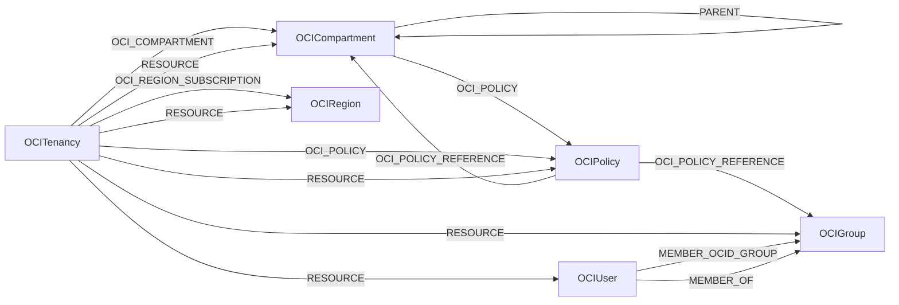

<!-- Generated from the data model. Do not edit manually. -->

## OCI Schema

### OCICompartment

An OCI compartment linked to its tenancy and parent hierarchy.

#### Properties

| Field | Index | Description |
|-------|-------|-------------|
| id | Yes | OCI compartment OCID. |
| firstseen |  | Timestamp when a sync job first created this node. |
| lastupdated | Yes | Timestamp of the last sync that observed this node. |
| compartmentid |  | OCID of the parent compartment or tenancy. |
| createdate |  | Date and time when the compartment was created. |
| description |  | Compartment description. |
| name | Yes | Compartment name. |
| ocid | Yes | OCI compartment OCID. |

#### Relationships

- `(:OCICompartment)-[:OCI_COMPARTMENT]->(:OCICompartment)`: Compatibility edge from a parent OCI compartment to a nested compartment.

- `(:OCITenancy)-[:OCI_COMPARTMENT]->(:OCICompartment)`: Deprecated compatibility edge from an OCI tenancy to a root compartment.

- `(:OCICompartment)-[:OCI_POLICY]->(:OCIPolicy)`: Compatibility edge from an OCI compartment to a compartment-level policy.

- `(:OCIPolicy)-[:OCI_POLICY_REFERENCE]->(:OCICompartment)`: An OCI policy references a compartment identified in its statements.

- `(:OCICompartment)-[:PARENT]->(:OCICompartment)`: An OCI compartment points to its parent compartment.

- `(:OCITenancy)-[:RESOURCE]->(:OCICompartment)`: An OCI tenancy contains a compartment as a managed resource.

### OCIGroup

This node label is loaded by more than one sync path:

- An OCI user group.
- The same group, resolved to the users that belong to it.

> **Ontology Mapping**: This node uses the ontology label [`UserGroup`](#ontology-usergroup).

#### Properties

Ontology-generated fields are shown in *italics*.

| Field | Index | Description |
|-------|-------|-------------|
| id | Yes | OCI group OCID. |
| firstseen |  | Timestamp when a sync job first created this node. |
| lastupdated | Yes | Timestamp of the last sync that observed this node. |
| compartmentid |  | OCID of the tenancy containing the group. |
| createdate |  | Date and time when the group was created. |
| description |  | Group description. |
| name |  | Group name. |
| ocid | Yes | OCI group OCID. |
| *_ont_description* |  | Normalized field sourced from `description`. |
| *_ont_name* | Yes | Normalized field sourced from `name`. |
| *_ont_source* |  | Module that populated this node's ontology fields. |

#### Relationships

- `(:OCIUser)-[:MEMBER_OCID_GROUP]->(:OCIGroup)`: Deprecated compatibility edge from an OCI user to an OCI group.

- `(:OCIUser)-[:MEMBER_OF]->(:OCIGroup)`: Canonical edge from an OCI user account to an OCI user group.

- `(:OCIPolicy)-[:OCI_POLICY_REFERENCE]->(:OCIGroup)`: An OCI policy references a group identified in its policy statements.

- `(:OCITenancy)-[:RESOURCE]->(:OCIGroup)`: An OCI tenancy contains a group as a managed resource.

### OCIPolicy

This node label is loaded by more than one sync path:

- An OCI policy, with the deprecated OCI_POLICY edges to its parents.
- The same policy, resolved to the groups and compartments its statements name.

> **Ontology Mapping**: This node uses the ontology label [`PermissionRole`](#ontology-permissionrole).

#### Properties

Ontology-generated fields are shown in *italics*.

| Field | Index | Description |
|-------|-------|-------------|
| id | Yes | OCI policy OCID. |
| firstseen |  | Timestamp when a sync job first created this node. |
| lastupdated | Yes | Timestamp of the last sync that observed this node. |
| compartmentid |  | OCID of the compartment containing the policy. |
| createdate |  | Date and time when the policy was created. |
| description |  | Policy description. |
| name |  | Policy name. |
| ocid | Yes | OCI policy OCID. |
| statements |  | Statements written in the OCI policy language. |
| updatedate |  | Date and time when the policy was last updated. |
| *_ont_name* | Yes | Normalized field sourced from `name`. |
| *_ont_source* |  | Module that populated this node's ontology fields. |
| *_ont_type* | Yes | Property generated by the ontology mapping. |

#### Relationships

- `(:OCICompartment)-[:OCI_POLICY]->(:OCIPolicy)`: Compatibility edge from an OCI compartment to a compartment-level policy.

- `(:OCITenancy)-[:OCI_POLICY]->(:OCIPolicy)`: Deprecated compatibility edge from an OCI tenancy to a tenancy-level policy.

- `(:OCIPolicy)-[:OCI_POLICY_REFERENCE]->(:OCICompartment)`: An OCI policy references a compartment identified in its statements.

- `(:OCIPolicy)-[:OCI_POLICY_REFERENCE]->(:OCIGroup)`: An OCI policy references a group identified in its policy statements.

- `(:OCITenancy)-[:RESOURCE]->(:OCIPolicy)`: An OCI tenancy contains a policy as a managed resource.

### OCIRegion

An OCI region subscribed by a tenancy.

#### Properties

| Field | Index | Description |
|-------|-------|-------------|
| id | Yes | OCI region key. |
| firstseen |  | Timestamp when a sync job first created this node. |
| lastupdated | Yes | Timestamp of the last sync that observed this node. |
| key | Yes | OCI region key. |
| name | Yes | OCI region name. |

#### Relationships

- `(:OCITenancy)-[:OCI_REGION_SUBSCRIPTION]->(:OCIRegion)`: Deprecated compatibility edge from an OCI tenancy to a subscribed region.

- `(:OCITenancy)-[:RESOURCE]->(:OCIRegion)`: An OCI tenancy contains a subscribed region as a managed resource.

### OCITenancy

An OCI tenancy that serves as the root OCI resource.

#### Properties

| Field | Index | Description |
|-------|-------|-------------|
| id | Yes | OCI tenancy OCID. |
| firstseen |  | Timestamp when a sync job first created this node. |
| lastupdated | Yes | Timestamp of the last sync that observed this node. |
| name |  | Tenancy profile name. |
| ocid | Yes | OCI tenancy OCID. |

#### Relationships

- `(:OCITenancy)-[:OCI_COMPARTMENT]->(:OCICompartment)`: Deprecated compatibility edge from an OCI tenancy to a root compartment.

- `(:OCITenancy)-[:OCI_POLICY]->(:OCIPolicy)`: Deprecated compatibility edge from an OCI tenancy to a tenancy-level policy.

- `(:OCITenancy)-[:OCI_REGION_SUBSCRIPTION]->(:OCIRegion)`: Deprecated compatibility edge from an OCI tenancy to a subscribed region.

- `(:OCITenancy)-[:RESOURCE]->(:OCICompartment)`: An OCI tenancy contains a compartment as a managed resource.

- `(:OCITenancy)-[:RESOURCE]->(:OCIGroup)`: An OCI tenancy contains a group as a managed resource.

- `(:OCITenancy)-[:RESOURCE]->(:OCIPolicy)`: An OCI tenancy contains a policy as a managed resource.

- `(:OCITenancy)-[:RESOURCE]->(:OCIRegion)`: An OCI tenancy contains a subscribed region as a managed resource.

- `(:OCITenancy)-[:RESOURCE]->(:OCIUser)`: An OCI tenancy contains a user as a managed resource.

### OCIUser

An OCI user account with the UserAccount label.

> **Ontology Mapping**: This node uses the ontology label [`UserAccount`](#ontology-useraccount).

#### Properties

Ontology-generated fields are shown in *italics*.

| Field | Index | Description |
|-------|-------|-------------|
| id | Yes | OCI user OCID. |
| firstseen |  | Timestamp when a sync job first created this node. |
| lastupdated | Yes | Timestamp of the last sync that observed this node. |
| can_use_api_keys |  | Whether the user can use API keys. |
| can_use_auth_tokens |  | Whether the user can use auth tokens. |
| can_use_console_password |  | Whether the user can sign in with a console password. |
| can_use_customer_secret_keys |  | Whether the user can use customer secret keys. |
| can_use_smtp_credentials |  | Whether the user can use SMTP credentials. |
| compartmentid |  | OCID of the user's compartment. |
| createdate |  | Date and time when the user was created. |
| description |  | User description. |
| email | Yes | User email address. |
| is_mfa_activated |  | Whether MFA is activated for the user. |
| lifecycle_state |  | Current lifecycle state of the user. |
| name |  | User name. |
| ocid | Yes | OCI user OCID. |
| *_ont_active* | Yes | Normalized field sourced from `lifecycle_state`. |
| *_ont_email* | Yes | Normalized field sourced from `email`. |
| *_ont_fullname* | Yes | Normalized field sourced from `name`. |
| *_ont_has_mfa* | Yes | Normalized field sourced from `is_mfa_activated`. |
| *_ont_source* |  | Module that populated this node's ontology fields. |

#### Relationships

- `(:User)-[:HAS_ACCOUNT]->(:OCIUser)`

- `(:OCIUser)-[:MEMBER_OCID_GROUP]->(:OCIGroup)`: Deprecated compatibility edge from an OCI user to an OCI group.

- `(:OCIUser)-[:MEMBER_OF]->(:OCIGroup)`: Canonical edge from an OCI user account to an OCI user group.

- `(:OCITenancy)-[:RESOURCE]->(:OCIUser)`: An OCI tenancy contains a user as a managed resource.
