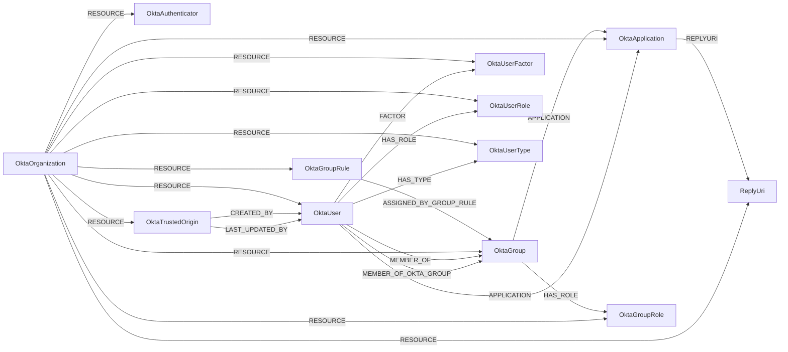

<!-- Generated from the data model. Do not edit manually. -->

## Okta Schema

### OktaApplication

> **Ontology Mapping**: This node uses the ontology label [`ThirdPartyApp`](#ontology-thirdpartyapp).

#### Properties

Ontology-generated fields are shown in *italics*.

| Field | Index | Description |
|-------|-------|-------------|
| id | Yes | Unique identifier for the Okta resource. |
| firstseen |  | Timestamp when a sync job first created this node. |
| lastupdated | Yes | Timestamp of the last sync that observed this resource. |
| accessibility_error_redirect_url |  | Okta accessibility error redirect URL. |
| accessibility_login_redirect_url |  | Okta accessibility login redirect URL. |
| accessibility_self_service |  | Okta accessibility self service. |
| activated |  | Okta activated. |
| created |  | Okta created. |
| credentials_signing_kid |  | Okta credentials signing kid. |
| credentials_signing_last_rotated |  | Okta credentials signing last rotated. |
| credentials_signing_next_rotation |  | Okta credentials signing next rotation. |
| credentials_signing_rotation_mode |  | Okta credentials signing rotation mode. |
| credentials_signing_use |  | Okta credentials signing use. |
| credentials_user_name_template_push_status |  | Okta credentials user name template push status. |
| credentials_user_name_template_suffix |  | Okta credentials user name template suffix. |
| credentials_user_name_template_template |  | Okta credentials user name template template. |
| credentials_user_name_template_type |  | Okta credentials user name template type. |
| features |  | Okta features. |
| label |  | Okta label. |
| last_updated |  | Okta last updated. |
| licensing_seat_count |  | Okta licensing seat count. |
| name |  | Okta name. |
| settings_app_acs_url |  | Okta settings app ACS URL. |
| settings_app_button_field |  | Okta settings app button field. |
| settings_app_implicit_assignment |  | Okta settings app implicit assignment. |
| settings_app_inline_hook_id |  | Okta settings app inline hook ID. |
| settings_app_login_url_regex |  | Okta settings app login URL regex. |
| settings_app_org_name |  | Okta settings app org name. |
| settings_app_password_field |  | Okta settings app password field. |
| settings_app_url |  | Okta settings app URL. |
| settings_app_username_field |  | Okta settings app username field. |
| settings_notes_admin |  | Okta settings notes admin. |
| settings_notes_enduser |  | Okta settings notes enduser. |
| settings_notifications_vpn_help_url |  | Okta settings notifications VPN help URL. |
| settings_notifications_vpn_message |  | Okta settings notifications VPN message. |
| settings_notifications_vpn_network_connection |  | Okta settings notifications VPN network connection. |
| settings_notifications_vpn_network_exclude |  | Okta settings notifications VPN network exclude. |
| settings_notifications_vpn_network_include |  | Okta settings notifications VPN network include. |
| settings_oauth_client_application_type |  | Okta settings OAuth client application type. |
| settings_oauth_client_client_uri |  | Okta settings OAuth client client URI. |
| settings_oauth_client_consent_method |  | Okta settings OAuth client consent method. |
| settings_oauth_client_grant_Type |  | Okta settings OAuth client grant type. |
| settings_oauth_client_idp_initiated_login_default_scope |  | Okta settings OAuth client IdP initiated login default scope. |
| settings_oauth_client_idp_initiated_login_mode |  | Okta settings OAuth client IdP initiated login mode. |
| settings_oauth_client_initiate_login_uri |  | Okta settings OAuth client initiate login URI. |
| settings_oauth_client_logo_uri |  | Okta settings OAuth client logo URI. |
| settings_oauth_client_policy_uri |  | Okta settings OAuth client policy URI. |
| settings_oauth_client_post_logout_redirect_uris |  | Okta settings OAuth client post logout redirect uris. |
| settings_oauth_client_redirect_uris |  | Okta settings OAuth client redirect uris. |
| settings_oauth_client_response_types |  | Okta settings OAuth client response types. |
| settings_oauth_client_tos_uri |  | Okta settings OAuth client tos URI. |
| settings_oauth_client_wildcard_redirect |  | Okta settings OAuth client wildcard redirect. |
| settings_sign_on_assertion_signed |  | Okta settings sign on assertion signed. |
| settings_sign_on_audience |  | Okta settings sign on audience. |
| settings_sign_on_audience_override |  | Okta settings sign on audience override. |
| settings_sign_on_authn_context_class_ref |  | Okta settings sign on authn context class ref. |
| settings_sign_on_default_relay_state |  | Okta settings sign on default relay state. |
| settings_sign_on_destination |  | Okta settings sign on destination. |
| settings_sign_on_destination_override |  | Okta settings sign on destination override. |
| settings_sign_on_digest_algorithm |  | Okta settings sign on digest algorithm. |
| settings_sign_on_honor_force_authn |  | Okta settings sign on honor force authn. |
| settings_sign_on_idp_issuer |  | Okta settings sign on IdP issuer. |
| settings_sign_on_recipient |  | Okta settings sign on recipient. |
| settings_sign_on_recipient_override |  | Okta settings sign on recipient override. |
| settings_sign_on_response_signed |  | Okta settings sign on response signed. |
| settings_sign_on_signature_algorithm |  | Okta settings sign on signature algorithm. |
| settings_sign_on_sso_acs_url |  | Okta settings sign on SSO ACS URL. |
| settings_sign_on_sso_acs_url_override |  | Okta settings sign on SSO ACS URL override. |
| settings_sign_on_subject_name_id_format |  | Okta settings sign on subject name ID format. |
| settings_sign_on_subject_name_id_template |  | Okta settings sign on subject name ID template. |
| sign_on_mode |  | Okta sign on mode. |
| status |  | Okta status. |
| visibility_app_links |  | Okta visibility app links. |
| visibility_auto_launch |  | Okta visibility auto launch. |
| visibility_auto_submit_toolbar |  | Okta visibility auto submit toolbar. |
| visibility_hide |  | Okta visibility hide. |
| *_ont_client_id* | Yes | Normalized field sourced from `id`. |
| *_ont_enabled* | Yes | Normalized field sourced from `status`. |
| *_ont_name* | Yes | Normalized field sourced from `label`. |
| *_ont_protocol* | Yes | Normalized field sourced from `sign_on_mode`. |
| *_ont_source* |  | Module that populated this node's ontology fields. |

#### Relationships

- `(:OktaGroup)-[:APPLICATION]->(:OktaApplication)`

- `(:OktaUser)-[:APPLICATION]->(:OktaApplication)`

- `(:User)-[:AUTHORIZED]->(:OktaApplication)`: generated by analysis job `Ontology - User AUTHORIZED ThirdPartyApp linking`.
  - Properties:

    | Field | Description |
    |-------|-------------|
    | scopes | Property generated by analysis job: `Ontology - User AUTHORIZED ThirdPartyApp linking`. |

- `(:OktaApplication)-[:REPLYURI]->(:ReplyUri)`

- `(:OktaOrganization)-[:RESOURCE]->(:OktaApplication)`

### OktaAuthenticator

#### Properties

| Field | Index | Description |
|-------|-------|-------------|
| id | Yes | Unique identifier for the Okta resource. |
| firstseen |  | Timestamp when a sync job first created this node. |
| lastupdated | Yes | Timestamp of the last sync that observed this resource. |
| authenticator_type |  | Okta authenticator type. |
| created |  | Okta created. |
| key |  | Okta key. |
| last_updated |  | Okta last updated. |
| name |  | Okta name. |
| provider_auth_port |  | Okta provider auth port. |
| provider_configuration |  | Okta provider configuration. |
| provider_host_name |  | Okta provider host name. |
| provider_instance_id |  | Okta provider instance ID. |
| provider_integration_key |  | Okta provider integration key. |
| provider_type |  | Okta provider type. |
| provider_user_name_template |  | Okta provider user name template. |
| settings |  | Okta settings. |
| settings_allowed_for |  | Okta settings allowed for. |
| settings_app_instance_id |  | Okta settings app instance ID. |
| settings_channel_binding |  | Okta settings channel binding. |
| settings_compliance |  | Okta settings compliance. |
| settings_token_lifetime_minutes |  | Okta settings token lifetime minutes. |
| settings_user_verification |  | Okta settings user verification. |
| status |  | Okta status. |

#### Relationships

- `(:OktaOrganization)-[:RESOURCE]->(:OktaAuthenticator)`

### OktaGroup

> **Ontology Mapping**: This node uses the ontology label [`UserGroup`](#ontology-usergroup).

#### Properties

Ontology-generated fields are shown in *italics*.

| Field | Index | Description |
|-------|-------|-------------|
| id | Yes | Unique identifier for the Okta resource. |
| firstseen |  | Timestamp when a sync job first created this node. |
| lastupdated | Yes | Timestamp of the last sync that observed this resource. |
| created |  | Okta created. |
| description |  | Okta description. |
| dn |  | Okta dn. |
| external_id |  | Okta external ID. |
| group_type |  | Okta group type. |
| last_membership_updated |  | Okta last membership updated. |
| last_updated |  | Okta last updated. |
| name | Yes | Okta name. |
| object_class |  | Okta object class. |
| sam_account_name |  | Okta sam account name. |
| windows_domain_qualified_name |  | Okta windows domain qualified name. |
| *_ont_description* |  | Normalized field sourced from `description`. |
| *_ont_name* | Yes | Normalized field sourced from `name`. |
| *_ont_source* |  | Module that populated this node's ontology fields. |

#### Relationships

- `(:OktaGroup)-[:APPLICATION]->(:OktaApplication)`

- `(:OktaGroupRule)-[:ASSIGNED_BY_GROUP_RULE]->(:OktaGroup)`

- `(:OktaGroup)-[:HAS_ROLE]->(:OktaGroupRole)`

- `(:OktaGroup)-[:MEMBER_OF]->(:KubernetesGroup)`: Links an Okta group to the Kubernetes group its members join.

- `(:OktaUser)-[:MEMBER_OF]->(:OktaGroup)`

- `(:OktaUser)-[:MEMBER_OF_OKTA_GROUP]->(:OktaGroup)`

- `(:OktaOrganization)-[:RESOURCE]->(:OktaGroup)`

### OktaGroupRole

> **Ontology Mapping**: This node uses the ontology label [`PermissionRole`](#ontology-permissionrole).

#### Properties

Ontology-generated fields are shown in *italics*.

| Field | Index | Description |
|-------|-------|-------------|
| id | Yes | Unique identifier for the Okta resource. |
| firstseen |  | Timestamp when a sync job first created this node. |
| lastupdated | Yes | Timestamp of the last sync that observed this resource. |
| assignment_type |  | Okta assignment type. |
| created |  | Okta created. |
| description |  | Okta description. |
| label |  | Okta label. |
| last_updated |  | Okta last updated. |
| name |  | Okta name. |
| role_type |  | Okta role type. |
| status |  | Okta status. |
| *_ont_name* | Yes | Normalized field sourced from `label`. |
| *_ont_scope* | Yes | Property generated by the ontology mapping. |
| *_ont_source* |  | Module that populated this node's ontology fields. |
| *_ont_type* | Yes | Property generated by the ontology mapping. |

#### Relationships

- `(:OktaGroup)-[:HAS_ROLE]->(:OktaGroupRole)`

- `(:OktaOrganization)-[:RESOURCE]->(:OktaGroupRole)`

### OktaGroupRule

#### Properties

| Field | Index | Description |
|-------|-------|-------------|
| id | Yes | Unique identifier for the Okta resource. |
| firstseen |  | Timestamp when a sync job first created this node. |
| lastupdated | Yes | Timestamp of the last sync that observed this resource. |
| assigned_groups |  | Okta assigned groups. |
| condition_type |  | Okta condition type. |
| conditions |  | Okta conditions. |
| created |  | Okta created. |
| exclusions |  | Okta exclusions. |
| expression_type |  | Okta expression type. |
| inclusions |  | Okta inclusions. |
| last_updated |  | Okta last updated. |
| name |  | Okta name. |
| status |  | Okta status. |

#### Relationships

- `(:OktaGroupRule)-[:ASSIGNED_BY_GROUP_RULE]->(:OktaGroup)`

- `(:OktaOrganization)-[:RESOURCE]->(:OktaGroupRule)`

### OktaOrganization

> **Ontology Mapping**: This node uses the ontology label [`Tenant`](#ontology-tenant).

#### Properties

Ontology-generated fields are shown in *italics*.

| Field | Index | Description |
|-------|-------|-------------|
| id | Yes | Unique identifier for the Okta resource. |
| firstseen |  | Timestamp when a sync job first created this node. |
| lastupdated | Yes | Timestamp of the last sync that observed this resource. |
| name |  | Okta name. |
| *_ont_name* | Yes | Normalized field sourced from `name`. |
| *_ont_source* |  | Module that populated this node's ontology fields. |

#### Relationships

- `(:OktaOrganization)-[:RESOURCE]->(:OktaApplication)`

- `(:OktaOrganization)-[:RESOURCE]->(:OktaAuthenticator)`

- `(:OktaOrganization)-[:RESOURCE]->(:OktaGroup)`

- `(:OktaOrganization)-[:RESOURCE]->(:OktaGroupRole)`

- `(:OktaOrganization)-[:RESOURCE]->(:OktaGroupRule)`

- `(:OktaOrganization)-[:RESOURCE]->(:OktaTrustedOrigin)`

- `(:OktaOrganization)-[:RESOURCE]->(:OktaUser)`

- `(:OktaOrganization)-[:RESOURCE]->(:OktaUserFactor)`: Links an Okta organization to one of its user authentication factors.

- `(:OktaOrganization)-[:RESOURCE]->(:OktaUserRole)`

- `(:OktaOrganization)-[:RESOURCE]->(:OktaUserType)`

- `(:OktaOrganization)-[:RESOURCE]->(:ReplyUri)`

### OktaTrustedOrigin

#### Properties

| Field | Index | Description |
|-------|-------|-------------|
| id | Yes | Unique identifier for the Okta resource. |
| firstseen |  | Timestamp when a sync job first created this node. |
| lastupdated | Yes | Timestamp of the last sync that observed this resource. |
| cors_allowed |  | Okta cors allowed. |
| cors_allowed_okta_apps |  | Okta cors allowed okta apps. |
| cors_value |  | Okta cors value. |
| created |  | Okta created. |
| created_by |  | Okta created by. |
| iframe_allowed |  | Okta iframe allowed. |
| iframe_allowed_okta_apps |  | Okta iframe allowed okta apps. |
| iframe_value |  | Okta iframe value. |
| last_updated |  | Okta last updated. |
| last_updated_by |  | Okta last updated by. |
| name |  | Okta name. |
| origin |  | Okta origin. |
| redirect_allowed |  | Okta redirect allowed. |
| redirect_allowed_okta_apps |  | Okta redirect allowed okta apps. |
| redirect_value |  | Okta redirect value. |
| status |  | Okta status. |

#### Relationships

- `(:OktaTrustedOrigin)-[:CREATED_BY]->(:OktaUser)`

- `(:OktaTrustedOrigin)-[:LAST_UPDATED_BY]->(:OktaUser)`

- `(:OktaOrganization)-[:RESOURCE]->(:OktaTrustedOrigin)`

### OktaUser

> **Ontology Mapping**: This node uses the ontology label [`UserAccount`](#ontology-useraccount).

#### Properties

Ontology-generated fields are shown in *italics*.

| Field | Index | Description |
|-------|-------|-------------|
| id | Yes | Unique identifier for the Okta resource. |
| firstseen |  | Timestamp when a sync job first created this node. |
| lastupdated | Yes | Timestamp of the last sync that observed this resource. |
| activated |  | Okta activated. |
| city |  | Okta city. |
| cost_center |  | Okta cost center. |
| country_code |  | Okta country code. |
| created |  | Okta created. |
| custom_attributes |  | Okta custom attributes. |
| department |  | Okta department. |
| display_name |  | Okta display name. |
| division |  | Okta division. |
| email | Yes | Okta email. |
| employee_number |  | Okta employee number. |
| first_name |  | Okta first name. |
| honorific_prefix |  | Okta honorific prefix. |
| honorific_suffix |  | Okta honorific suffix. |
| last_login |  | Okta last login. |
| last_name |  | Okta last name. |
| locale |  | Okta locale. |
| login |  | Okta login. |
| manager |  | Okta manager. |
| manager_id |  | Okta manager ID. |
| middle_name |  | Okta middle name. |
| mobile_phone |  | Okta mobile phone. |
| nick_name |  | Okta nick name. |
| okta_last_updated |  | Okta okta last updated. |
| organization |  | Okta organization. |
| password_changed |  | Okta password changed. |
| postal_address |  | Okta postal address. |
| preferred_language |  | Okta preferred language. |
| primary_phone |  | Okta primary phone. |
| profile_url |  | Okta profile URL. |
| second_email |  | Okta second email. |
| state |  | Okta state. |
| status |  | Okta status. |
| status_changed |  | Okta status changed. |
| street_address |  | Okta street address. |
| timezone |  | Okta timezone. |
| title |  | Okta title. |
| transition_to_status |  | Okta transition to status. |
| type |  | Okta type. |
| user_type |  | Okta user type. |
| zip_code |  | Okta zip code. |
| *_ont_email* | Yes | Normalized field sourced from `email`. |
| *_ont_firstname* | Yes | Normalized field sourced from `first_name`. |
| *_ont_lastactivity* | Yes | Normalized field sourced from `last_login`. |
| *_ont_lastname* | Yes | Normalized field sourced from `last_name`. |
| *_ont_source* |  | Module that populated this node's ontology fields. |

#### Relationships

- `(:OktaUser)-[:APPLICATION]->(:OktaApplication)`

- `(:OktaTrustedOrigin)-[:CREATED_BY]->(:OktaUser)`

- `(:OktaUser)-[:FACTOR]->(:OktaUserFactor)`: Links an Okta user to one of their authentication factors.

- `(:User)-[:HAS_ACCOUNT]->(:OktaUser)`

- `(:OktaUser)-[:HAS_ROLE]->(:OktaUserRole)`

- `(:OktaUser)-[:HAS_TYPE]->(:OktaUserType)`

- `(:OktaTrustedOrigin)-[:LAST_UPDATED_BY]->(:OktaUser)`

- `(:OktaUser)-[:MAPS_TO]->(:KubernetesUser)`: Links an Okta user to the Kubernetes user it maps to.

- `(:OktaUser)-[:MEMBER_OF]->(:OktaGroup)`

- `(:OktaUser)-[:MEMBER_OF_OKTA_GROUP]->(:OktaGroup)`

- `(:OktaOrganization)-[:RESOURCE]->(:OktaUser)`

### OktaUserFactor

#### Properties

| Field | Index | Description |
|-------|-------|-------------|
| id | Yes | Unique identifier for the Okta resource. |
| firstseen |  | Timestamp when a sync job first created this node. |
| lastupdated | Yes | Timestamp of the last sync that observed this resource. |
| created |  | Okta created. |
| factor_type |  | Okta factor type. |
| okta_last_updated |  | Okta okta last updated. |
| provider |  | Okta provider. |
| status |  | Okta status. |

#### Relationships

- `(:OktaUser)-[:FACTOR]->(:OktaUserFactor)`: Links an Okta user to one of their authentication factors.

- `(:OktaOrganization)-[:RESOURCE]->(:OktaUserFactor)`: Links an Okta organization to one of its user authentication factors.

### OktaUserRole

> **Ontology Mapping**: This node uses the ontology label [`PermissionRole`](#ontology-permissionrole).

#### Properties

Ontology-generated fields are shown in *italics*.

| Field | Index | Description |
|-------|-------|-------------|
| id | Yes | Unique identifier for the Okta resource. |
| firstseen |  | Timestamp when a sync job first created this node. |
| lastupdated | Yes | Timestamp of the last sync that observed this resource. |
| assignment_type |  | Okta assignment type. |
| created |  | Okta created. |
| description |  | Okta description. |
| label |  | Okta label. |
| last_updated |  | Okta last updated. |
| name |  | Okta name. |
| role_type |  | Okta role type. |
| status |  | Okta status. |
| *_ont_name* | Yes | Normalized field sourced from `label`. |
| *_ont_scope* | Yes | Property generated by the ontology mapping. |
| *_ont_source* |  | Module that populated this node's ontology fields. |
| *_ont_type* | Yes | Property generated by the ontology mapping. |

#### Relationships

- `(:OktaUser)-[:HAS_ROLE]->(:OktaUserRole)`

- `(:OktaOrganization)-[:RESOURCE]->(:OktaUserRole)`

### OktaUserType

#### Properties

| Field | Index | Description |
|-------|-------|-------------|
| id | Yes | Unique identifier for the Okta resource. |
| firstseen |  | Timestamp when a sync job first created this node. |
| lastupdated | Yes | Timestamp of the last sync that observed this resource. |

#### Relationships

- `(:OktaUser)-[:HAS_TYPE]->(:OktaUserType)`

- `(:OktaOrganization)-[:RESOURCE]->(:OktaUserType)`

### ReplyUri

#### Properties

| Field | Index | Description |
|-------|-------|-------------|
| id | Yes | Unique identifier for the Okta resource. |
| firstseen |  | Timestamp when a sync job first created this node. |
| lastupdated | Yes | Timestamp of the last sync that observed this resource. |
| uri |  | Okta URI. |

#### Relationships

- `(:OktaApplication)-[:REPLYURI]->(:ReplyUri)`

- `(:OktaOrganization)-[:RESOURCE]->(:ReplyUri)`
