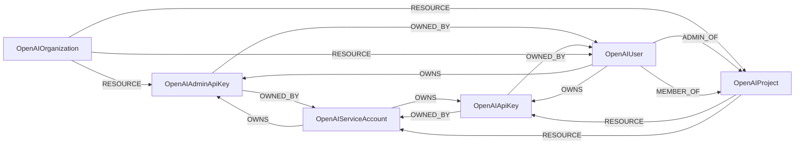

<!-- Generated from the data model. Do not edit manually. -->

## Openai Schema

### OpenAIAdminApiKey

An admin API key in an OpenAI organization.

> **Ontology Mapping**: This node uses the ontology label [`APIKey`](#ontology-apikey).

#### Properties

Ontology-generated fields are shown in *italics*.

| Field | Index | Description |
|-------|-------|-------------|
| id | Yes | OpenAI admin API key ID. |
| firstseen |  | Timestamp when a sync job first created this node. |
| lastupdated | Yes | Timestamp of the last sync that observed this node. |
| created_at |  | Unix timestamp when the admin API key was created. |
| last_used_at |  | Unix timestamp when the admin API key was last used. |
| name |  | Admin API key name. |
| object |  | Object type, always "organization.admin_api_key". |
| *_ont_created_at* | Yes | Normalized field sourced from `created_at`. |
| *_ont_last_used_at* | Yes | Normalized field sourced from `last_used_at`. |
| *_ont_name* | Yes | Normalized field sourced from `name`. |
| *_ont_source* |  | Module that populated this node's ontology fields. |

#### Relationships

- `(:OpenAIAdminApiKey)-[:OWNED_BY]->(:OpenAIServiceAccount)`: An admin API key is owned by a service account.

- `(:OpenAIAdminApiKey)-[:OWNED_BY]->(:OpenAIUser)`: An admin API key is owned by a user account.

- `(:OpenAIServiceAccount)-[:OWNS]->(:OpenAIAdminApiKey)`: Deprecated compatibility edge for a service account that owns an admin API key.

- `(:OpenAIUser)-[:OWNS]->(:OpenAIAdminApiKey)`: Deprecated compatibility edge for a user that owns an admin API key.

- `(:User)-[:OWNS]->(:OpenAIAdminApiKey)`: generated by analysis job `Ontology - User OWNS APIKey linking`.

- `(:OpenAIOrganization)-[:RESOURCE]->(:OpenAIAdminApiKey)`: The organization contains the admin API key.

### OpenAIApiKey

An API key in an OpenAI project.

> **Ontology Mapping**: This node uses the ontology label [`APIKey`](#ontology-apikey).

#### Properties

Ontology-generated fields are shown in *italics*.

| Field | Index | Description |
|-------|-------|-------------|
| id | Yes | OpenAI API key ID. |
| firstseen |  | Timestamp when a sync job first created this node. |
| lastupdated | Yes | Timestamp of the last sync that observed this node. |
| created_at |  | Unix timestamp when the API key was created. |
| last_used_at |  | Unix timestamp when the API key was last used. |
| name |  | API key name. |
| object |  | Object type, always "organization.project.api_key". |
| *_ont_created_at* | Yes | Normalized field sourced from `created_at`. |
| *_ont_last_used_at* | Yes | Normalized field sourced from `last_used_at`. |
| *_ont_name* | Yes | Normalized field sourced from `name`. |
| *_ont_source* |  | Module that populated this node's ontology fields. |

#### Relationships

- `(:OpenAIApiKey)-[:OWNED_BY]->(:OpenAIServiceAccount)`: An API key is owned by a service account.

- `(:OpenAIApiKey)-[:OWNED_BY]->(:OpenAIUser)`: An API key is owned by a user account.

- `(:OpenAIServiceAccount)-[:OWNS]->(:OpenAIApiKey)`: Deprecated compatibility edge for a service account that owns an API key.

- `(:OpenAIUser)-[:OWNS]->(:OpenAIApiKey)`: Deprecated compatibility edge for a user that owns an API key.

- `(:User)-[:OWNS]->(:OpenAIApiKey)`: generated by analysis job `Ontology - User OWNS APIKey linking`.

- `(:OpenAIProject)-[:RESOURCE]->(:OpenAIApiKey)`: The project contains the API key.

### OpenAIOrganization

An OpenAI organization containing users, projects, and admin API keys.

> **Ontology Mapping**: This node uses the ontology label [`Tenant`](#ontology-tenant).

#### Properties

| Field | Index | Description |
|-------|-------|-------------|
| id | Yes | OpenAI organization ID. |
| firstseen |  | Timestamp when a sync job first created this node. |
| lastupdated | Yes | Timestamp of the last sync that observed this node. |

#### Relationships

- `(:OpenAIOrganization)-[:RESOURCE]->(:OpenAIAdminApiKey)`: The organization contains the admin API key.

- `(:OpenAIOrganization)-[:RESOURCE]->(:OpenAIProject)`: The organization contains the project.

- `(:OpenAIOrganization)-[:RESOURCE]->(:OpenAIUser)`: The organization contains the user.

### OpenAIProject

A project in an OpenAI organization.

> **Ontology Mapping**: This node uses the ontology label [`Tenant`](#ontology-tenant).

#### Properties

Ontology-generated fields are shown in *italics*.

| Field | Index | Description |
|-------|-------|-------------|
| id | Yes | OpenAI project ID. |
| firstseen |  | Timestamp when a sync job first created this node. |
| lastupdated | Yes | Timestamp of the last sync that observed this node. |
| archived_at |  | Unix timestamp when the project was archived. |
| created_at |  | Unix timestamp when the project was created. |
| name |  | Project name displayed in reporting. |
| object |  | Object type, always "organization.project". |
| status |  | Project status: active or archived. |
| *_ont_name* | Yes | Normalized field sourced from `name`. |
| *_ont_source* |  | Module that populated this node's ontology fields. |
| *_ont_status* | Yes | Normalized field sourced from `status`. |

#### Relationships

- `(:OpenAIUser)-[:ADMIN_OF]->(:OpenAIProject)`: A user administers the project.

- `(:OpenAIUser)-[:MEMBER_OF]->(:OpenAIProject)`: A user is a member of the project.

- `(:OpenAIProject)-[:RESOURCE]->(:OpenAIApiKey)`: The project contains the API key.

- `(:OpenAIOrganization)-[:RESOURCE]->(:OpenAIProject)`: The organization contains the project.

- `(:OpenAIProject)-[:RESOURCE]->(:OpenAIServiceAccount)`: The project contains the service account.

### OpenAIServiceAccount

A service account in an OpenAI project.

> **Ontology Mapping**: This node uses the ontology label [`ServiceAccount`](#ontology-serviceaccount).

#### Properties

Ontology-generated fields are shown in *italics*.

| Field | Index | Description |
|-------|-------|-------------|
| id | Yes | OpenAI service account ID. |
| firstseen |  | Timestamp when a sync job first created this node. |
| lastupdated | Yes | Timestamp of the last sync that observed this node. |
| created_at |  | Unix timestamp when the service account was created. |
| name |  | Service account name. |
| object |  | Object type, always "organization.project.service_account". |
| role |  | Project role: owner or member. |
| *_ont_name* | Yes | Normalized field sourced from `name`. |
| *_ont_source* |  | Module that populated this node's ontology fields. |

#### Relationships

- `(:OpenAIAdminApiKey)-[:OWNED_BY]->(:OpenAIServiceAccount)`: An admin API key is owned by a service account.

- `(:OpenAIApiKey)-[:OWNED_BY]->(:OpenAIServiceAccount)`: An API key is owned by a service account.

- `(:OpenAIServiceAccount)-[:OWNS]->(:OpenAIAdminApiKey)`: Deprecated compatibility edge for a service account that owns an admin API key.

- `(:OpenAIServiceAccount)-[:OWNS]->(:OpenAIApiKey)`: Deprecated compatibility edge for a service account that owns an API key.

- `(:OpenAIProject)-[:RESOURCE]->(:OpenAIServiceAccount)`: The project contains the service account.

### OpenAIUser

A user account in an OpenAI organization.

> **Ontology Mapping**: This node uses the ontology label [`UserAccount`](#ontology-useraccount).

#### Properties

Ontology-generated fields are shown in *italics*.

| Field | Index | Description |
|-------|-------|-------------|
| id | Yes | OpenAI user ID. |
| firstseen |  | Timestamp when a sync job first created this node. |
| lastupdated | Yes | Timestamp of the last sync that observed this node. |
| added_at |  | Unix timestamp when the user was added. |
| email | Yes | User email address. |
| name |  | User name. |
| object |  | Object type, always "organization.user". |
| role |  | Organization role: owner or reader. |
| *_ont_email* | Yes | Normalized field sourced from `email`. |
| *_ont_fullname* | Yes | Normalized field sourced from `name`. |
| *_ont_source* |  | Module that populated this node's ontology fields. |

#### Relationships

- `(:OpenAIUser)-[:ADMIN_OF]->(:OpenAIProject)`: A user administers the project.

- `(:User)-[:HAS_ACCOUNT]->(:OpenAIUser)`

- `(:OpenAIUser)-[:MEMBER_OF]->(:OpenAIProject)`: A user is a member of the project.

- `(:OpenAIAdminApiKey)-[:OWNED_BY]->(:OpenAIUser)`: An admin API key is owned by a user account.

- `(:OpenAIApiKey)-[:OWNED_BY]->(:OpenAIUser)`: An API key is owned by a user account.

- `(:OpenAIUser)-[:OWNS]->(:OpenAIAdminApiKey)`: Deprecated compatibility edge for a user that owns an admin API key.

- `(:OpenAIUser)-[:OWNS]->(:OpenAIApiKey)`: Deprecated compatibility edge for a user that owns an API key.

- `(:OpenAIOrganization)-[:RESOURCE]->(:OpenAIUser)`: The organization contains the user.
