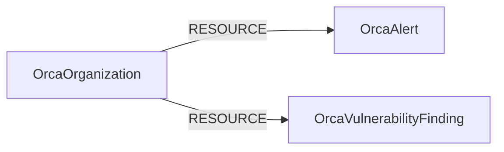

<!-- Generated from the data model. Do not edit manually. -->

## Orca Schema

### OrcaAlert

A security issue reported and prioritized by Orca.

> **Ontology Mapping**: This node uses the ontology label [`SecurityIssue`](#ontology-securityissue).

#### Properties

Ontology-generated fields are shown in *italics*.

| Field | Index | Description |
|-------|-------|-------------|
| id | Yes | Stable organization-scoped identifier for the Orca alert. |
| firstseen |  | Timestamp when a sync job first created this node. |
| lastupdated | Yes | Timestamp when this Orca alert was last seen. |
| alert_type | Yes | Orca alert type. |
| category | Yes | Orca alert category. |
| console_url |  | URL for the alert in the Orca console. |
| created_at |  | Timestamp when Orca created the alert. |
| cve_ids |  | CVE identifiers referenced by the alert. |
| details |  | Detailed explanation of the security issue from Orca. |
| last_seen |  | Timestamp when Orca most recently observed the alert. |
| orca_id | Yes | Raw Orca AlertId value. |
| orca_score |  | Contextual risk score assigned to the alert by Orca. |
| organization_id | Yes | Identifier of the Orca organization that owns this alert. |
| severity | Yes | Raw Orca alert severity. |
| status | Yes | Raw Orca alert workflow status. |
| target_arn | Yes | Amazon Resource Name associated with the alert target. |
| target_cloud_account_id | Yes | Provider-native account, subscription, or project identifier associated with the alert target. |
| target_cloud_provider | Yes | Cloud provider associated with the alert target. |
| target_name |  | Display name reported for the alert target. |
| target_orca_asset_unique_id | Yes | Orca AssetUniqueId associated with the alert target. |
| target_orca_inventory_id | Yes | Orca inventory identifier associated with the alert target. |
| target_provider_id | Yes | Provider-native identifier associated with the alert target. |
| target_region |  | Cloud region associated with the alert target. |
| target_type |  | Orca resource type reported for the alert target. |
| title |  | Human-readable Orca alert title. |
| *_ont_first_seen* | Yes | Normalized field sourced from `created_at`. |
| *_ont_severity* | Yes | Normalized field sourced from `severity`. |
| *_ont_source* |  | Module that populated this node's ontology fields. |
| *_ont_status* | Yes | Normalized field sourced from `status`. |
| *_ont_title* | Yes | Normalized field sourced from `title`. |
| *_ont_type* | Yes | Normalized field sourced from `alert_type`. |

#### Relationships

- `(:OrcaOrganization)-[:RESOURCE]->(:OrcaAlert)`: Links an Orca organization to one of its alerts.

### OrcaOrganization

An Orca organization whose security findings are ingested by Cartography.

> **Ontology Mapping**: This node uses the ontology label [`Tenant`](#ontology-tenant).

#### Properties

Ontology-generated fields are shown in *italics*.

| Field | Index | Description |
|-------|-------|-------------|
| id | Yes | Stable Orca organization identifier. |
| firstseen |  | Timestamp when a sync job first created this node. |
| lastupdated | Yes | Timestamp when this Orca organization was last seen. |
| api_url |  | Regional Orca API base URL used for this organization. |
| name |  | Display name of the Orca organization. |
| *_ont_name* | Yes | Normalized field sourced from `name`. |
| *_ont_source* |  | Module that populated this node's ontology fields. |

#### Relationships

- `(:OrcaOrganization)-[:RESOURCE]->(:OrcaAlert)`: Links an Orca organization to one of its alerts.

- `(:OrcaOrganization)-[:RESOURCE]->(:OrcaVulnerabilityFinding)`: Links an Orca organization to one of its vulnerability findings.

### OrcaVulnerabilityFinding

A CVE occurrence reported by Orca.

> **Ontology Mapping**: This node uses the ontology label [`CVE`](#ontology-cve).

#### Properties

Ontology-generated fields are shown in *italics*.

| Field | Index | Description |
|-------|-------|-------------|
| id | Yes | Stable organization-scoped identifier for the vulnerability occurrence. |
| firstseen |  | Timestamp when a sync job first created this node. |
| lastupdated | Yes | Timestamp when this Orca vulnerability finding was last seen. |
| base_score |  | CVSS base score reported by Orca. |
| base_severity | Yes | Raw CVSS base severity reported by Orca. |
| cisa_kev |  | Whether Orca reports the CVE in the CISA KEV catalog. |
| cpe | Yes | Common Platform Enumeration identifier for the affected package. |
| cve_id | Yes | CVE identifier reported by Orca. |
| cvss_source |  | Source authority for the CVSS assessment. |
| description |  | Description of the vulnerability from Orca. |
| epss_percentile |  | EPSS percentile reported by Orca. |
| epss_probability |  | EPSS exploitation probability reported by Orca. |
| first_seen |  | Timestamp when Orca first observed the vulnerability on the asset. |
| has_exploit |  | Whether Orca reports a known exploit for the CVE. |
| orca_id | Yes | Raw Orca occurrence identifier, when the API supplies one. |
| organization_id | Yes | Identifier of the Orca organization that owns this vulnerability finding. |
| package_base_id_uuid |  | Raw base_id_uuid supplied on the related package object; retained as provenance but not used as package identity. |
| package_id | Yes | Stable Orca identifier for the installed package, when supplied. |
| package_name | Yes | Name of the affected installed package. |
| package_version |  | Installed version of the affected package. |
| patch_available |  | Whether Orca reports that a patch is available. |
| purl | Yes | Package URL identifying the affected package version. |
| references |  | Reference URLs associated with the vulnerability. |
| source_package |  | Source package from which the installed package was built. |
| target_arn | Yes | Amazon Resource Name associated with the vulnerability target. |
| target_cloud_account_id | Yes | Provider-native account, subscription, or project identifier associated with the vulnerability target. |
| target_cloud_provider | Yes | Cloud provider associated with the vulnerability target. |
| target_name |  | Display name reported for the vulnerability target. |
| target_orca_asset_unique_id | Yes | Orca AssetUniqueId associated with the vulnerability target. |
| target_orca_inventory_id | Yes | Orca inventory identifier associated with the vulnerability target. |
| target_provider_id | Yes | Provider-native identifier associated with the vulnerability target. |
| target_region |  | Cloud region associated with the vulnerability target. |
| target_type |  | Orca resource type reported for the vulnerability target. |
| trending |  | Whether Orca identifies the vulnerability as trending. |
| upstream_disposition |  | Upstream package maintainer disposition reported by Orca. |
| vector_string |  | CVSS vector string reported by Orca. |
| *_ont_base_score* | Yes | Normalized field sourced from `base_score`. |
| *_ont_base_severity* | Yes | Normalized field sourced from `base_severity`. |
| *_ont_cve_id* | Yes | Normalized field sourced from `cve_id`. |
| *_ont_description* |  | Normalized field sourced from `description`. |
| *_ont_references* |  | Normalized field sourced from `references`. |
| *_ont_source* |  | Module that populated this node's ontology fields. |
| *_ont_vector_string* | Yes | Normalized field sourced from `vector_string`. |

#### Relationships

- `(:OrcaOrganization)-[:RESOURCE]->(:OrcaVulnerabilityFinding)`: Links an Orca organization to one of its vulnerability findings.
