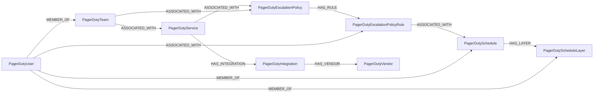

<!-- Generated from the data model. Do not edit manually. -->

## Pagerduty Schema

### PagerDutyEscalationPolicy

A PagerDuty escalation policy for routing incidents.

#### Properties

| Field | Index | Description |
|-------|-------|-------------|
| id | Yes | Escalation policy ID. |
| firstseen |  | Timestamp when a sync job first created this node. |
| lastupdated | Yes | Timestamp of the last sync that observed this node. |
| html_url |  | PagerDuty web URL for the escalation policy. |
| name | Yes | Escalation policy name. |
| num_loops |  | Number of times the escalation policy repeats. |
| on_call_handoff_notifications |  | Policy for sending on-call handoff notifications. |
| summary |  | Short summary of the escalation policy. |
| type |  | PagerDuty object type for the escalation policy. |

#### Relationships

- `(:PagerDutyService)-[:ASSOCIATED_WITH]->(:PagerDutyEscalationPolicy)`: A service associated with an escalation policy.

- `(:PagerDutyTeam)-[:ASSOCIATED_WITH]->(:PagerDutyEscalationPolicy)`: A team associated with an escalation policy.

- `(:PagerDutyEscalationPolicy)-[:HAS_RULE]->(:PagerDutyEscalationPolicyRule)`: An escalation policy that contains this rule.
  - Properties:

    | Field | Description |
    |-------|-------------|
    | order | Value sourced from `_escalation_policy_order`. |

### PagerDutyEscalationPolicyRule

A rule within a PagerDuty escalation policy.

#### Properties

| Field | Index | Description |
|-------|-------|-------------|
| id | Yes | Escalation policy rule ID. |
| firstseen |  | Timestamp when a sync job first created this node. |
| lastupdated | Yes | Timestamp of the last sync that observed this node. |
| escalation_delay_in_minutes | Yes | Minutes before an unacknowledged incident is escalated. |

#### Relationships

- `(:PagerDutyEscalationPolicyRule)-[:ASSOCIATED_WITH]->(:PagerDutySchedule)`: A schedule associated with an escalation policy rule.

- `(:PagerDutyUser)-[:ASSOCIATED_WITH]->(:PagerDutyEscalationPolicyRule)`: A user associated with an escalation policy rule.

- `(:PagerDutyEscalationPolicy)-[:HAS_RULE]->(:PagerDutyEscalationPolicyRule)`: An escalation policy that contains this rule.
  - Properties:

    | Field | Description |
    |-------|-------------|
    | order | Value sourced from `_escalation_policy_order`. |

### PagerDutyIntegration

A PagerDuty integration configured on a service.

#### Properties

| Field | Index | Description |
|-------|-------|-------------|
| id | Yes | Integration ID. |
| firstseen |  | Timestamp when a sync job first created this node. |
| lastupdated | Yes | Timestamp of the last sync that observed this node. |
| created_at |  | Timestamp when the integration was created. |
| html_url |  | PagerDuty web URL for the integration. |
| name | Yes | Integration name. |
| summary |  | Short summary of the integration. |
| type |  | PagerDuty object type for the integration. |

#### Relationships

- `(:PagerDutyService)-[:HAS_INTEGRATION]->(:PagerDutyIntegration)`: The service that contains an integration.

- `(:PagerDutyIntegration)-[:HAS_VENDOR]->(:PagerDutyVendor)`: The vendor provided by an integration.

### PagerDutySchedule

A PagerDuty on-call schedule.

#### Properties

| Field | Index | Description |
|-------|-------|-------------|
| id | Yes | Schedule ID. |
| firstseen |  | Timestamp when a sync job first created this node. |
| lastupdated | Yes | Timestamp of the last sync that observed this node. |
| description |  | Schedule description. |
| html_url |  | PagerDuty web URL for the schedule. |
| name | Yes | Schedule name. |
| summary |  | Short summary of the schedule. |
| time_zone |  | Time zone used by the schedule. |
| type |  | PagerDuty object type for the schedule. |

#### Relationships

- `(:PagerDutyEscalationPolicyRule)-[:ASSOCIATED_WITH]->(:PagerDutySchedule)`: A schedule associated with an escalation policy rule.

- `(:PagerDutySchedule)-[:HAS_LAYER]->(:PagerDutyScheduleLayer)`: The schedule that contains this layer.

- `(:PagerDutyUser)-[:MEMBER_OF]->(:PagerDutySchedule)`: A user who is a member of a schedule.

### PagerDutyScheduleLayer

A rotation layer within a PagerDuty schedule.

#### Properties

| Field | Index | Description |
|-------|-------|-------------|
| id | Yes | Schedule layer ID. |
| firstseen |  | Timestamp when a sync job first created this node. |
| lastupdated | Yes | Timestamp of the last sync that observed this node. |
| end |  | Timestamp when the schedule layer ends, if set. |
| name |  | Schedule layer name. |
| rotation_turn_length_seconds |  | Duration of each on-call shift in seconds. |
| rotation_virtual_start |  | Effective start timestamp for the layer rotation. |
| schedule_id |  | ID of the schedule containing this layer. |
| start |  | Timestamp when the schedule layer starts. |

#### Relationships

- `(:PagerDutySchedule)-[:HAS_LAYER]->(:PagerDutyScheduleLayer)`: The schedule that contains this layer.

- `(:PagerDutyUser)-[:MEMBER_OF]->(:PagerDutyScheduleLayer)`: A user who is a member of a schedule layer.

### PagerDutyService

A PagerDuty service that receives and manages incidents.

#### Properties

| Field | Index | Description |
|-------|-------|-------------|
| id | Yes | Service ID. |
| firstseen |  | Timestamp when a sync job first created this node. |
| lastupdated | Yes | Timestamp of the last sync that observed this node. |
| acknowledgement_timeout |  | Seconds before an acknowledged incident becomes triggered. |
| alert_creation |  | Whether the service creates alerts. |
| alert_grouping_parameters_type |  | Alert grouping strategy used by the service. |
| auto_resolve_timeout |  | Seconds before an open incident resolves automatically. |
| created_at |  | Timestamp when the service was created. |
| description |  | Service description. |
| html_url |  | PagerDuty web URL for the service. |
| incident_urgency_rule_during_support_hours_type |  | Urgency rule type used during support hours. |
| incident_urgency_rule_during_support_hours_urgency |  | Incident urgency used during support hours. |
| incident_urgency_rule_outside_support_hours_type |  | Urgency rule type used outside support hours. |
| incident_urgency_rule_outside_support_hours_urgency |  | Incident urgency used outside support hours. |
| incident_urgency_rule_type |  | Type of incident urgency rule. |
| name | Yes | Service name. |
| status |  | Current service status. |
| summary |  | Short summary of the service. |
| support_hours_days_of_week |  | Days of the week included in support hours. |
| support_hours_end_time |  | Daily end time for support hours. |
| support_hours_start_time |  | Daily start time for support hours. |
| support_hours_time_zone |  | Time zone used for support hours. |
| support_hours_type |  | Type of configured support hours. |
| type |  | PagerDuty object type for the service. |

#### Relationships

- `(:PagerDutyService)-[:ASSOCIATED_WITH]->(:PagerDutyEscalationPolicy)`: A service associated with an escalation policy.

- `(:PagerDutyTeam)-[:ASSOCIATED_WITH]->(:PagerDutyService)`: A team associated with a service.

- `(:PagerDutyService)-[:HAS_INTEGRATION]->(:PagerDutyIntegration)`: The service that contains an integration.

### PagerDutyTeam

A PagerDuty team with the canonical UserGroup label.

> **Ontology Mapping**: This node uses the ontology label [`UserGroup`](#ontology-usergroup).

#### Properties

Ontology-generated fields are shown in *italics*.

| Field | Index | Description |
|-------|-------|-------------|
| id | Yes | Team ID. |
| firstseen |  | Timestamp when a sync job first created this node. |
| lastupdated | Yes | Timestamp of the last sync that observed this node. |
| default_role |  | Default role assigned to team members. |
| description |  | Team description. |
| html_url |  | PagerDuty web URL for the team. |
| name | Yes | Team name. |
| summary |  | Short summary of the team. |
| type |  | PagerDuty object type for the team. |
| *_ont_description* |  | Normalized field sourced from `description`. |
| *_ont_name* | Yes | Normalized field sourced from `name`. |
| *_ont_source* |  | Module that populated this node's ontology fields. |

#### Relationships

- `(:PagerDutyTeam)-[:ASSOCIATED_WITH]->(:PagerDutyEscalationPolicy)`: A team associated with an escalation policy.

- `(:PagerDutyTeam)-[:ASSOCIATED_WITH]->(:PagerDutyService)`: A team associated with a service.

- `(:PagerDutyUser)-[:MEMBER_OF]->(:PagerDutyTeam)`: A user's membership in a team, including the user's team role.
  - Properties:

    | Field | Description |
    |-------|-------------|
    | role | Value sourced from `role`. |

### PagerDutyUser

A PagerDuty user account with the canonical UserAccount label.

> **Ontology Mapping**: This node uses the ontology label [`UserAccount`](#ontology-useraccount).

#### Properties

Ontology-generated fields are shown in *italics*.

| Field | Index | Description |
|-------|-------|-------------|
| id | Yes | User ID. |
| firstseen |  | Timestamp when a sync job first created this node. |
| lastupdated | Yes | Timestamp of the last sync that observed this node. |
| avatar_url |  | URL of the user's avatar. |
| color |  | Color used for the user in schedules. |
| description |  | User biography. |
| email | Yes | User email address. |
| html_url |  | PagerDuty web URL for the user. |
| invitation_sent |  | Whether the user has a pending invitation. |
| job_title |  | User job title. |
| name | Yes | User name. |
| role |  | User account role. |
| summary |  | Short summary of the user. |
| time_zone |  | Preferred time zone for the user. |
| type |  | PagerDuty object type for the user. |
| *_ont_email* | Yes | Normalized field sourced from `email`. |
| *_ont_fullname* | Yes | Normalized field sourced from `name`. |
| *_ont_source* |  | Module that populated this node's ontology fields. |

#### Relationships

- `(:PagerDutyUser)-[:ASSOCIATED_WITH]->(:PagerDutyEscalationPolicyRule)`: A user associated with an escalation policy rule.

- `(:User)-[:HAS_ACCOUNT]->(:PagerDutyUser)`

- `(:PagerDutyUser)-[:MEMBER_OF]->(:PagerDutySchedule)`: A user who is a member of a schedule.

- `(:PagerDutyUser)-[:MEMBER_OF]->(:PagerDutyScheduleLayer)`: A user who is a member of a schedule layer.

- `(:PagerDutyUser)-[:MEMBER_OF]->(:PagerDutyTeam)`: A user's membership in a team, including the user's team role.
  - Properties:

    | Field | Description |
    |-------|-------------|
    | role | Value sourced from `role`. |

### PagerDutyVendor

A vendor that provides PagerDuty integrations.

#### Properties

| Field | Index | Description |
|-------|-------|-------------|
| id | Yes | Vendor ID. |
| firstseen |  | Timestamp when a sync job first created this node. |
| lastupdated | Yes | Timestamp of the last sync that observed this node. |
| description |  | Vendor description. |
| integration_guide_url |  | URL of the vendor's integration guide. |
| logo_url |  | URL of the vendor's logo. |
| name | Yes | Vendor name. |
| summary |  | Short summary of the vendor. |
| thumbnail_url |  | URL of the vendor's thumbnail image. |
| type |  | PagerDuty object type for the vendor. |
| website_url |  | URL of the vendor's website. |

#### Relationships

- `(:PagerDutyIntegration)-[:HAS_VENDOR]->(:PagerDutyVendor)`: The vendor provided by an integration.
