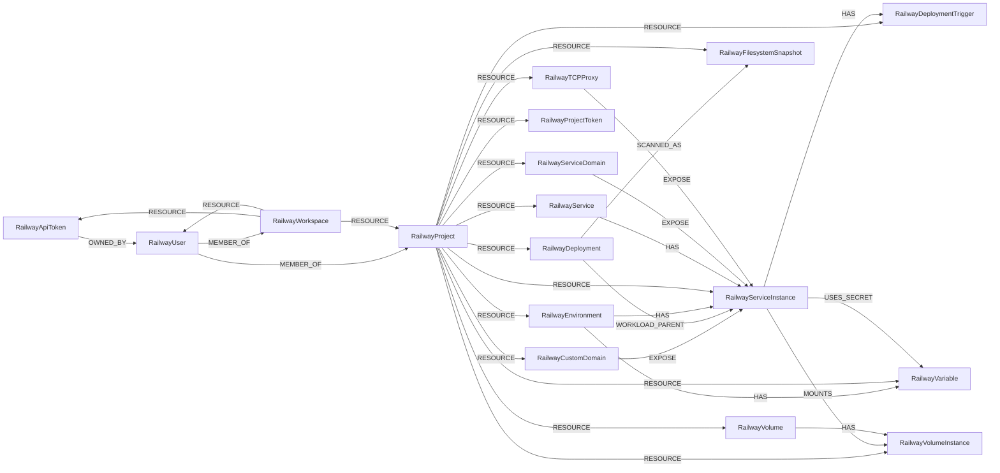

<!-- Generated from the data model. Do not edit manually. -->

## Railway Schema

### RailwayApiToken

A Railway account or workspace API token represented without secret material.

> **Ontology Mapping**: This node uses the ontology label [`APIKey`](#ontology-apikey).

#### Properties

Ontology-generated fields are shown in *italics*.

| Field | Index | Description |
|-------|-------|-------------|
| id | Yes | ID of the Railway API token. |
| firstseen |  | Timestamp when a sync job first created this node. |
| lastupdated | Yes | Timestamp of the last sync that observed this node. |
| display_token |  | Redacted token prefix shown by Railway. |
| expires_at | Yes | Time when the token expires, or null if it does not expire. |
| name |  | Name given to the token. |
| workspace_id |  | ID of the scoped workspace, or null for an account-wide token. |
| *_ont_expires_at* | Yes | Normalized field sourced from `expires_at`. |
| *_ont_name* | Yes | Normalized field sourced from `name`. |
| *_ont_source* |  | Module that populated this node's ontology fields. |

#### Relationships

- `(:RailwayApiToken)-[:OWNED_BY]->(:RailwayUser)`: Identifies the Railway user who owns an API token.

- `(:User)-[:OWNS]->(:RailwayApiToken)`: generated by analysis job `Ontology - User OWNS APIKey linking`.

- `(:RailwayWorkspace)-[:RESOURCE]->(:RailwayApiToken)`: Connects a Railway workspace to an API token scoped within it.

### RailwayCustomDomain

A customer-owned domain configured for a Railway service.

#### Properties

| Field | Index | Description |
|-------|-------|-------------|
| id | Yes | ID of the Railway custom domain. |
| firstseen |  | Timestamp when a sync job first created this node. |
| lastupdated | Yes | Timestamp of the last sync that observed this node. |
| certificate_status |  | TLS certificate provisioning status. |
| domain | Yes | Fully qualified customer-owned domain name. |
| environment_id |  | ID of the environment fronted by the domain. |
| is_railway_domain |  | Whether Railway manages the domain. |
| service_id |  | ID of the service fronted by the domain. |
| sync_status |  | Provisioning status of the domain. |
| target_port |  | Port on the service to which the domain routes. |
| verification_dns_host |  | DNS host Railway expects for domain verification. |
| verified |  | Whether DNS verification has succeeded. |

#### Relationships

- `(:RailwayCustomDomain)-[:EXPOSE]->(:RailwayServiceInstance)`: Identifies the Railway service instance exposed by a verified custom domain.

- `(:RailwayProject)-[:RESOURCE]->(:RailwayCustomDomain)`: Connects a Railway project to a custom domain that it contains.

### RailwayDeployment

A concrete deployment revision of a Railway service instance.

> **Conditional Labels**:
>
> - [`Container`](#ontology-container) (ontology label) when `lifecycle` equals `current`. A cross-provider Container resource in Cartography's ontology.

#### Properties

Ontology-generated fields are shown in *italics*.

| Field | Index | Description |
|-------|-------|-------------|
| id | Yes | ID of the Railway deployment. |
| firstseen |  | Timestamp when a sync job first created this node. |
| lastupdated | Yes | Timestamp of the last sync that observed this node. |
| can_redeploy |  | Whether the deployment can be redeployed. |
| created_at |  | Time when the deployment was created. |
| environment_id | Yes | ID of the deployment environment. |
| lifecycle | Yes | Whether this deployment is the current or a historical revision. |
| project_id |  | ID of the owning project. |
| service_id | Yes | ID of the deployed service. |
| source_revision | Yes | Full source commit SHA reported for this deployment. |
| static_url |  | Stable URL associated with the deployment. |
| status | Yes | Current deployment status. |
| status_updated_at |  | Time when the deployment status last changed. |
| url | Yes | URL associated with the deployment. |
| *_ont_source* |  | Module that populated this node's ontology fields. |
| *_ont_state* | Yes | Normalized field sourced from `status`. |

#### Relationships

- `(:RailwayDeployment)-[:RESOLVED_IMAGE]->(:Image)`: generated by analysis job `Container RESOLVED_IMAGE analysis`.

- `(:RailwayProject)-[:RESOURCE]->(:RailwayDeployment)`: Connects a Railway project to a deployment that it contains.

- `(:RailwayDeployment)-[:SCANNED_AS]->(:RailwayFilesystemSnapshot)`: Identifies the filesystem snapshot used to assess a Railway deployment.

- `(:RailwayDeployment)-[:WORKLOAD_PARENT]->(:RailwayServiceInstance)`: Identifies the service instance represented by a Railway deployment revision.

### RailwayDeploymentTrigger

A source-control trigger that redeploys a Railway service.

#### Properties

| Field | Index | Description |
|-------|-------|-------------|
| id | Yes | ID of the Railway deployment trigger. |
| firstseen |  | Timestamp when a sync job first created this node. |
| lastupdated | Yes | Timestamp of the last sync that observed this node. |
| branch |  | Branch that triggers a deployment. |
| environment_id |  | ID of the environment that is redeployed. |
| provider | Yes | Source-control provider for the trigger. |
| repository | Yes | Repository in owner/name form. |
| service_id |  | ID of the service that is redeployed. |

#### Relationships

- `(:RailwayServiceInstance)-[:HAS]->(:RailwayDeploymentTrigger)`: Connects a Railway service instance to the trigger that redeploys it.

- `(:RailwayProject)-[:RESOURCE]->(:RailwayDeploymentTrigger)`: Connects a Railway project to a deployment trigger that it contains.

- `(:RailwayDeploymentTrigger)-[:TRACKS]->(:GitHubRepository)`: Identifies the GitHub repository and branch watched by a deployment trigger.

### RailwayEnvironment

A Railway deployment environment, such as production or staging.

#### Properties

| Field | Index | Description |
|-------|-------|-------------|
| id | Yes | ID of the Railway environment. |
| firstseen |  | Timestamp when a sync job first created this node. |
| lastupdated | Yes | Timestamp of the last sync that observed this node. |
| created_at |  | Time when the environment was created. |
| is_ephemeral |  | Whether this is a short-lived pull-request environment. |
| name | Yes | Name of the environment. |
| project_id | Yes | ID of the owning project. |

#### Relationships

- `(:RailwayEnvironment)-[:HAS]->(:RailwayServiceInstance)`: Connects a Railway environment to a service instance deployed within it.

- `(:RailwayEnvironment)-[:HAS]->(:RailwayVariable)`: Connects a Railway environment to a variable defined within it.

- `(:RailwayProject)-[:RESOURCE]->(:RailwayEnvironment)`: Connects a Railway project to an environment that it contains.

### RailwayFilesystemSnapshot

An immutable source filesystem used to assess a Railway deployment.

> **Ontology Mapping**: This node uses the ontology label [`FilesystemSnapshot`](#ontology-filesystemsnapshot).

#### Properties

Ontology-generated fields are shown in *italics*.

| Field | Index | Description |
|-------|-------|-------------|
| id | Yes | Cartography ID for this Railway filesystem snapshot. |
| firstseen |  | Timestamp when a sync job first created this node. |
| lastupdated | Yes | Timestamp of the last sync that observed this node. |
| deployment_id |  | ID of the Railway deployment represented by this snapshot. |
| kind | Yes | Snapshot type. Currently always `source`. |
| root_directory |  | Repository subdirectory represented by this snapshot. |
| source_repo | Yes | Source repository in owner/name form. |
| source_revision | Yes | Full source commit SHA represented by this snapshot. |
| *_ont_kind* | Yes | Normalized field sourced from `kind`. |
| *_ont_root_directory* | Yes | Normalized field sourced from `root_directory`. |
| *_ont_source* |  | Module that populated this node's ontology fields. |
| *_ont_source_revision* | Yes | Normalized field sourced from `source_revision`. |

#### Relationships

- `(:PackageVersion)-[:DEPLOYED]->(:RailwayFilesystemSnapshot)`: A canonical package version is deployed in a filesystem snapshot.

- `(:RailwayProject)-[:RESOURCE]->(:RailwayFilesystemSnapshot)`: Connects a Railway project to a filesystem snapshot that it contains.

- `(:RailwayDeployment)-[:SCANNED_AS]->(:RailwayFilesystemSnapshot)`: Identifies the filesystem snapshot used to assess a Railway deployment.

- `(:RailwayFilesystemSnapshot)-[:SNAPSHOT_OF]->(:GitHubRepository)`: Identifies the repository revision represented by a source snapshot.

### RailwayProject

A Railway project that contains environments and deployable resources.

> **Ontology Mapping**: This node uses the ontology label [`Tenant`](#ontology-tenant).

#### Properties

Ontology-generated fields are shown in *italics*.

| Field | Index | Description |
|-------|-------|-------------|
| id | Yes | ID of the Railway project. |
| firstseen |  | Timestamp when a sync job first created this node. |
| lastupdated | Yes | Timestamp of the last sync that observed this node. |
| created_at |  | Time when the project was created. |
| deleted_at |  | Time when the project was deleted, if applicable. |
| description |  | Free-text project description. |
| is_public | Yes | Whether the project's dashboard, build logs, and metrics are publicly readable. |
| is_temp_project |  | Whether this is a temporary project. |
| name | Yes | Name of the project. |
| pr_deploys |  | Whether pull-request environments are enabled. |
| subscription_type |  | Billing tier of the project. |
| updated_at |  | Time when the project was last modified. |
| workspace_id |  | ID of the owning workspace. |
| *_ont_name* | Yes | Normalized field sourced from `name`. |
| *_ont_source* |  | Module that populated this node's ontology fields. |

#### Relationships

- `(:RailwayUser)-[:MEMBER_OF]->(:RailwayProject)`: Represents a Railway user's membership and role in a project.
  - Properties:

    | Field | Description |
    |-------|-------------|
    | role | Role granted to the user in the project. |

- `(:RailwayProject)-[:RESOURCE]->(:RailwayCustomDomain)`: Connects a Railway project to a custom domain that it contains.

- `(:RailwayProject)-[:RESOURCE]->(:RailwayDeployment)`: Connects a Railway project to a deployment that it contains.

- `(:RailwayProject)-[:RESOURCE]->(:RailwayDeploymentTrigger)`: Connects a Railway project to a deployment trigger that it contains.

- `(:RailwayProject)-[:RESOURCE]->(:RailwayEnvironment)`: Connects a Railway project to an environment that it contains.

- `(:RailwayProject)-[:RESOURCE]->(:RailwayFilesystemSnapshot)`: Connects a Railway project to a filesystem snapshot that it contains.

- `(:RailwayProject)-[:RESOURCE]->(:RailwayProjectToken)`: Connects a Railway project to a token scoped within it.

- `(:RailwayProject)-[:RESOURCE]->(:RailwayService)`: Connects a Railway project to a service that it contains.

- `(:RailwayProject)-[:RESOURCE]->(:RailwayServiceDomain)`: Connects a Railway project to a service domain that it contains.

- `(:RailwayProject)-[:RESOURCE]->(:RailwayServiceInstance)`: Connects a Railway project to a service instance that it contains.

- `(:RailwayProject)-[:RESOURCE]->(:RailwayTCPProxy)`: Connects a Railway project to a TCP proxy that it contains.

- `(:RailwayProject)-[:RESOURCE]->(:RailwayVariable)`: Connects a Railway project to a variable that it contains.

- `(:RailwayProject)-[:RESOURCE]->(:RailwayVolume)`: Connects a Railway project to a volume definition that it contains.

- `(:RailwayProject)-[:RESOURCE]->(:RailwayVolumeInstance)`: Connects a Railway project to a volume instance that it contains.

- `(:RailwayWorkspace)-[:RESOURCE]->(:RailwayProject)`: Connects a Railway workspace to a project that it contains.

### RailwayProjectToken

A Railway token scoped to one project environment.

> **Ontology Mapping**: This node uses the ontology label [`APIKey`](#ontology-apikey).

#### Properties

Ontology-generated fields are shown in *italics*.

| Field | Index | Description |
|-------|-------|-------------|
| id | Yes | ID of the Railway project token. |
| firstseen |  | Timestamp when a sync job first created this node. |
| lastupdated | Yes | Timestamp of the last sync that observed this node. |
| created_at |  | Time when the token was created. |
| display_token |  | Redacted token prefix shown by Railway. |
| environment_id | Yes | ID of the environment the token can access. |
| name |  | Name given to the token. |
| project_id |  | ID of the project to which the token is scoped. |
| *_ont_created_at* | Yes | Normalized field sourced from `created_at`. |
| *_ont_name* | Yes | Normalized field sourced from `name`. |
| *_ont_source* |  | Module that populated this node's ontology fields. |

#### Relationships

- `(:User)-[:OWNS]->(:RailwayProjectToken)`: generated by analysis job `Ontology - User OWNS APIKey linking`.

- `(:RailwayProject)-[:RESOURCE]->(:RailwayProjectToken)`: Connects a Railway project to a token scoped within it.

### RailwayService

An environment-independent Railway service definition.

#### Properties

| Field | Index | Description |
|-------|-------|-------------|
| id | Yes | ID of the Railway service. |
| firstseen |  | Timestamp when a sync job first created this node. |
| lastupdated | Yes | Timestamp of the last sync that observed this node. |
| created_at |  | Time when the service was created. |
| icon |  | URL of the service icon. |
| is_restricted |  | Whether the service is restricted. |
| name | Yes | Name of the service. |
| project_id | Yes | ID of the owning project. |
| template_id |  | ID of the Railway template used to create the service, if any. |
| updated_at |  | Time when the service was last modified. |

#### Relationships

- `(:RailwayService)-[:HAS]->(:RailwayServiceInstance)`: Connects a Railway service to one of its environment-specific instances.

- `(:RailwayProject)-[:RESOURCE]->(:RailwayService)`: Connects a Railway project to a service that it contains.

### RailwayServiceDomain

A Railway-provided public domain for a service.

#### Properties

| Field | Index | Description |
|-------|-------|-------------|
| id | Yes | ID of the Railway service domain. |
| firstseen |  | Timestamp when a sync job first created this node. |
| lastupdated | Yes | Timestamp of the last sync that observed this node. |
| created_at |  | Time when the domain was created. |
| domain | Yes | Fully qualified Railway-provided domain name. |
| environment_id |  | ID of the environment fronted by the domain. |
| service_id |  | ID of the service fronted by the domain. |
| suffix |  | Railway domain suffix. |
| sync_status |  | Provisioning status of the domain. |
| target_port |  | Port on the service to which the domain routes. |

#### Relationships

- `(:RailwayServiceDomain)-[:EXPOSE]->(:RailwayServiceInstance)`: Identifies the Railway service instance exposed by a serving domain.

- `(:RailwayProject)-[:RESOURCE]->(:RailwayServiceDomain)`: Connects a Railway project to a service domain that it contains.

### RailwayServiceInstance

A Railway service deployed into a specific environment.

> **Ontology Mapping**: This node uses the ontology label [`ComputeService`](#ontology-computeservice).

#### Properties

Ontology-generated fields are shown in *italics*.

| Field | Index | Description |
|-------|-------|-------------|
| id | Yes | ID of the Railway service instance. |
| firstseen |  | Timestamp when a sync job first created this node. |
| lastupdated | Yes | Timestamp of the last sync that observed this node. |
| build_command |  | Custom build command, if configured. |
| builder |  | Build system used by the instance. |
| created_at |  | Time when the service instance was created. |
| cron_schedule |  | Cron schedule for scheduled execution, if configured. |
| dockerfile_path |  | Path to the custom Dockerfile, if configured. |
| environment_id | Yes | ID of the environment where the instance is deployed. |
| exposed_internet | Yes | `True` when a Railway-generated domain, a DNS-verified custom domain or a TCP proxy is serving traffic for this instance. |
| exposed_internet_type | Yes | How the instance is exposed: `direct` (an HTTPS domain) and/or `tcp_proxy` (a raw port with no TLS termination). |
| healthcheck_path |  | HTTP health-check path, if configured. |
| ipv6_egress_enabled |  | Whether outbound IPv6 traffic is enabled. |
| is_publicly_exposed |  | Whether the instance is reachable from the public internet. DEPRECATED: replaced by the cross-provider `exposed_internet` and will be removed in v1.0.0. |
| latest_deployment_id |  | ID of the latest deployment. |
| latest_deployment_status |  | Status of the latest deployment. |
| num_replicas |  | Number of replicas running in the effective region. |
| region | Yes | Effective deployment region. |
| region_is_workspace_default |  | Whether the effective region comes from the workspace default. |
| restart_policy_max_retries |  | Maximum restart attempts allowed by the restart policy. |
| restart_policy_type |  | Policy governing when the instance restarts. |
| root_directory |  | Repository subdirectory built by the service. |
| service_id | Yes | ID of the parent service. |
| service_name | Yes | Name of the parent service. |
| sleep_application |  | Whether the application sleeps while inactive. |
| source_image | Yes | Container image run by the instance, when deployed from a registry. |
| source_repo | Yes | Source repository in owner/name form, when deployed from git. |
| start_command |  | Custom start command, if configured. |
| updated_at |  | Time when the service instance was last modified. |
| *_ont_name* | Yes | Normalized field sourced from `service_name`. |
| *_ont_region* | Yes | Normalized field sourced from `region`. |
| *_ont_source* |  | Module that populated this node's ontology fields. |
| *_ont_status* | Yes | Normalized field sourced from `latest_deployment_status`. |

#### Relationships

- `(:RailwayServiceInstance)-[:DEPLOYED_FROM]->(:GitHubRepository)`: Identifies the GitHub repository used to deploy a Railway service instance.

- `(:RailwayCustomDomain)-[:EXPOSE]->(:RailwayServiceInstance)`: Identifies the Railway service instance exposed by a verified custom domain.

- `(:RailwayServiceDomain)-[:EXPOSE]->(:RailwayServiceInstance)`: Identifies the Railway service instance exposed by a serving domain.

- `(:RailwayTCPProxy)-[:EXPOSE]->(:RailwayServiceInstance)`: Identifies the Railway service instance exposed by a serving TCP proxy.

- `(:RailwayServiceInstance)-[:HAS]->(:RailwayDeploymentTrigger)`: Connects a Railway service instance to the trigger that redeploys it.

- `(:RailwayEnvironment)-[:HAS]->(:RailwayServiceInstance)`: Connects a Railway environment to a service instance deployed within it.

- `(:RailwayService)-[:HAS]->(:RailwayServiceInstance)`: Connects a Railway service to one of its environment-specific instances.

- `(:RailwayServiceInstance)-[:HAS_RUNTIME_IMAGE]->(:Image)`: generated by analysis job `Workload HAS_RUNTIME_IMAGE inventory analysis`.
  - Properties:

    | Field | Description |
    |-------|-------------|
    | exposed_internet | Property generated by analysis job: `Workload HAS_RUNTIME_IMAGE inventory analysis`. |

- `(:RailwayServiceInstance)-[:MOUNTS]->(:RailwayVolumeInstance)`: Identifies the Railway service instance that mounts a disk.

- `(:RailwayProject)-[:RESOURCE]->(:RailwayServiceInstance)`: Connects a Railway project to a service instance that it contains.

- `(:RailwayServiceInstance)-[:USES_SECRET]->(:RailwayVariable)`: Identifies a Railway service instance that consumes a service-scoped variable.

- `(:RailwayDeployment)-[:WORKLOAD_PARENT]->(:RailwayServiceInstance)`: Identifies the service instance represented by a Railway deployment revision.

### RailwayTCPProxy

A public Railway TCP proxy forwarding traffic to a service.

#### Properties

| Field | Index | Description |
|-------|-------|-------------|
| id | Yes | ID of the Railway TCP proxy. |
| firstseen |  | Timestamp when a sync job first created this node. |
| lastupdated | Yes | Timestamp of the last sync that observed this node. |
| application_port |  | Service port to which the proxy forwards traffic. |
| created_at |  | Time when the proxy was created. |
| domain | Yes | Public hostname of the proxy. |
| environment_id |  | ID of the environment served by the proxy. |
| proxy_port |  | Public port to which clients connect. |
| service_id |  | ID of the service behind the proxy. |
| sync_status |  | Provisioning status of the proxy. |

#### Relationships

- `(:RailwayTCPProxy)-[:EXPOSE]->(:RailwayServiceInstance)`: Identifies the Railway service instance exposed by a serving TCP proxy.

- `(:RailwayProject)-[:RESOURCE]->(:RailwayTCPProxy)`: Connects a Railway project to a TCP proxy that it contains.

### RailwayUser

This node label is loaded by more than one sync path:

- A Railway user discovered through project membership.
- A Railway user who is a member of a workspace.

> **Ontology Mapping**: This node uses the ontology label [`UserAccount`](#ontology-useraccount).

> **Additional Labels**: This node also uses `RailwayPrincipal`.

> **Additional Label Definitions**:
>
> - `RailwayPrincipal`: A Railway identity participating in the shared RailwayPrincipal graph interface.

#### Properties

Ontology-generated fields are shown in *italics*.

| Field | Index | Description |
|-------|-------|-------------|
| id | Yes | ID of the Railway user. |
| firstseen |  | Timestamp when a sync job first created this node. |
| lastupdated | Yes | Timestamp of the last sync that observed this node. |
| email | Yes | Email address of the user. |
| name | Yes | Display name of the user. |
| two_factor_auth_enabled |  | Whether the user has two-factor authentication enabled. |
| *_ont_email* | Yes | Normalized field sourced from `email`. |
| *_ont_fullname* | Yes | Normalized field sourced from `name`. |
| *_ont_has_mfa* | Yes | Normalized field sourced from `two_factor_auth_enabled`. |
| *_ont_source* |  | Module that populated this node's ontology fields. |

#### Relationships

- `(:User)-[:HAS_ACCOUNT]->(:RailwayUser)`

- `(:RailwayUser)-[:MEMBER_OF]->(:RailwayProject)`: Represents a Railway user's membership and role in a project.
  - Properties:

    | Field | Description |
    |-------|-------------|
    | role | Role granted to the user in the project. |

- `(:RailwayUser)-[:MEMBER_OF]->(:RailwayWorkspace)`: Represents a Railway user's membership and role in a workspace.
  - Properties:

    | Field | Description |
    |-------|-------------|
    | role | Role granted to the user in the workspace. |

- `(:RailwayApiToken)-[:OWNED_BY]->(:RailwayUser)`: Identifies the Railway user who owns an API token.

- `(:RailwayWorkspace)-[:RESOURCE]->(:RailwayUser)`: Connects a Railway workspace to a user discovered within its scope.

### RailwayVariable

A named Railway environment variable whose value is not ingested.

> **Ontology Mapping**: This node uses the ontology label [`Secret`](#ontology-secret).

#### Properties

Ontology-generated fields are shown in *italics*.

| Field | Index | Description |
|-------|-------|-------------|
| id | Yes | ID of the Railway variable. |
| firstseen |  | Timestamp when a sync job first created this node. |
| lastupdated | Yes | Timestamp of the last sync that observed this node. |
| created_at |  | Time when the variable was created. |
| environment_id |  | ID of the environment containing the variable. |
| is_sealed |  | Whether the variable is write-only and cannot be read back. |
| name | Yes | Name of the variable. |
| service_id |  | ID of the scoped service, or null for a shared variable. |
| *_ont_created_at* | Yes | Normalized field sourced from `created_at`. |
| *_ont_name* | Yes | Normalized field sourced from `name`. |
| *_ont_source* |  | Module that populated this node's ontology fields. |

#### Relationships

- `(:RailwayEnvironment)-[:HAS]->(:RailwayVariable)`: Connects a Railway environment to a variable defined within it.

- `(:RailwayProject)-[:RESOURCE]->(:RailwayVariable)`: Connects a Railway project to a variable that it contains.

- `(:RailwayServiceInstance)-[:USES_SECRET]->(:RailwayVariable)`: Identifies a Railway service instance that consumes a service-scoped variable.

### RailwayVolume

A Railway volume definition whose disks exist per environment.

#### Properties

| Field | Index | Description |
|-------|-------|-------------|
| id | Yes | ID of the Railway volume. |
| firstseen |  | Timestamp when a sync job first created this node. |
| lastupdated | Yes | Timestamp of the last sync that observed this node. |
| created_at |  | Time when the volume was created. |
| name | Yes | Name of the volume. |
| project_id | Yes | ID of the owning project. |

#### Relationships

- `(:RailwayVolume)-[:HAS]->(:RailwayVolumeInstance)`: Connects a Railway volume definition to one of its environment-specific disks.

- `(:RailwayProject)-[:RESOURCE]->(:RailwayVolume)`: Connects a Railway project to a volume definition that it contains.

### RailwayVolumeInstance

A persistent Railway disk provisioned for one environment.

> **Ontology Mapping**: This node uses the ontology label [`BlockStorage`](#ontology-blockstorage).

#### Properties

Ontology-generated fields are shown in *italics*.

| Field | Index | Description |
|-------|-------|-------------|
| id | Yes | ID of the Railway volume instance. |
| firstseen |  | Timestamp when a sync job first created this node. |
| lastupdated | Yes | Timestamp of the last sync that observed this node. |
| created_at |  | Time when the disk was created. |
| current_size_mb |  | Currently used space in megabytes. |
| environment_id | Yes | ID of the environment containing the disk. |
| mount_path |  | Path where the disk is mounted in the service. |
| region | Yes | Region where the disk is provisioned. |
| service_id | Yes | ID of the service that mounts the disk. |
| size_gb |  | Provisioned size in gigabytes. |
| size_mb |  | Provisioned size in megabytes. |
| state | Yes | Lifecycle state of the disk. |
| volume_id | Yes | ID of the parent volume. |
| volume_name | Yes | Name of the parent volume. |
| *_ont_name* | Yes | Normalized field sourced from `volume_name`. |
| *_ont_region* | Yes | Normalized field sourced from `region`. |
| *_ont_size_gb* | Yes | Normalized field sourced from `size_gb`. |
| *_ont_source* |  | Module that populated this node's ontology fields. |
| *_ont_state* | Yes | Normalized field sourced from `state`. |

#### Relationships

- `(:RailwayVolume)-[:HAS]->(:RailwayVolumeInstance)`: Connects a Railway volume definition to one of its environment-specific disks.

- `(:RailwayServiceInstance)-[:MOUNTS]->(:RailwayVolumeInstance)`: Identifies the Railway service instance that mounts a disk.

- `(:RailwayProject)-[:RESOURCE]->(:RailwayVolumeInstance)`: Connects a Railway project to a volume instance that it contains.

### RailwayWorkspace

A Railway workspace that forms a billing, ownership, and access boundary.

> **Ontology Mapping**: This node uses the ontology label [`Tenant`](#ontology-tenant).

#### Properties

Ontology-generated fields are shown in *italics*.

| Field | Index | Description |
|-------|-------|-------------|
| id | Yes | ID of the Railway workspace. |
| firstseen |  | Timestamp when a sync job first created this node. |
| lastupdated | Yes | Timestamp of the last sync that observed this node. |
| created_at |  | Time when the workspace was created. |
| has_2fa_enforcement |  | Whether the workspace requires two-factor authentication. |
| has_saml |  | Whether SAML single sign-on is configured. |
| name | Yes | Display name of the workspace. |
| plan |  | Billing plan for the workspace. |
| preferred_region |  | Default deployment region for new services. |
| project_count |  | Number of projects in the workspace. |
| *_ont_name* | Yes | Normalized field sourced from `name`. |
| *_ont_source* |  | Module that populated this node's ontology fields. |

#### Relationships

- `(:RailwayUser)-[:MEMBER_OF]->(:RailwayWorkspace)`: Represents a Railway user's membership and role in a workspace.
  - Properties:

    | Field | Description |
    |-------|-------------|
    | role | Role granted to the user in the workspace. |

- `(:RailwayWorkspace)-[:RESOURCE]->(:RailwayApiToken)`: Connects a Railway workspace to an API token scoped within it.

- `(:RailwayWorkspace)-[:RESOURCE]->(:RailwayProject)`: Connects a Railway workspace to a project that it contains.

- `(:RailwayWorkspace)-[:RESOURCE]->(:RailwayUser)`: Connects a Railway workspace to a user discovered within its scope.
