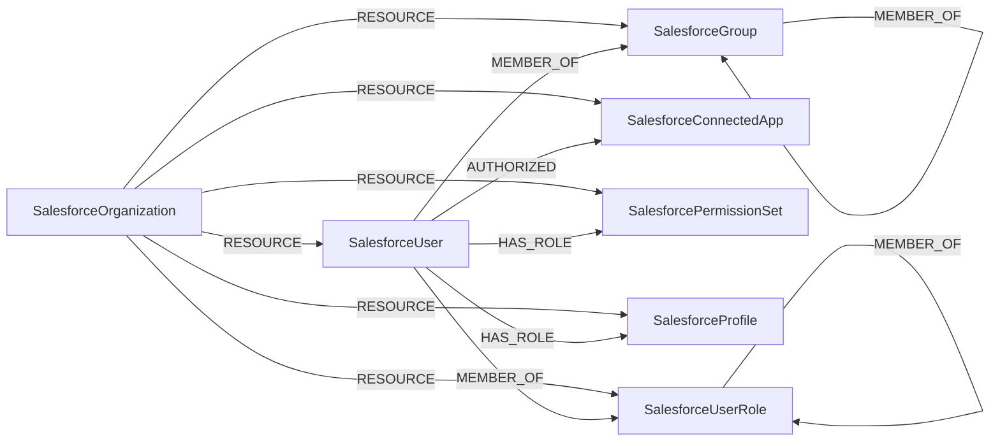

<!-- Generated from the data model. Do not edit manually. -->

## Salesforce Schema

### SalesforceConnectedApp

A third-party connected application integrated with Salesforce.

> **Ontology Mapping**: This node uses the ontology label [`ThirdPartyApp`](#ontology-thirdpartyapp).

#### Properties

Ontology-generated fields are shown in *italics*.

| Field | Index | Description |
|-------|-------|-------------|
| id | Yes | Salesforce connected app ID. |
| firstseen |  | Timestamp when a sync job first created this node. |
| lastupdated | Yes | Timestamp of the last sync that observed this node. |
| admin_approved_users_only |  | Whether only administrator-approved users may use the app. |
| created_date |  | Connected app creation timestamp. |
| last_modified_date |  | Connected app last modification timestamp. |
| name | Yes | Connected app name. |
| *_ont_client_id* | Yes | Normalized field sourced from `id`. |
| *_ont_name* | Yes | Normalized field sourced from `name`. |
| *_ont_protocol* | Yes | Property generated by the ontology mapping. |
| *_ont_source* |  | Module that populated this node's ontology fields. |

#### Relationships

- `(:SalesforceUser)-[:AUTHORIZED]->(:SalesforceConnectedApp)`: A Salesforce user authorized a connected app through an OAuth token.

- `(:User)-[:AUTHORIZED]->(:SalesforceConnectedApp)`: generated by analysis job `Ontology - User AUTHORIZED ThirdPartyApp linking`.
  - Properties:

    | Field | Description |
    |-------|-------------|
    | scopes | Property generated by analysis job: `Ontology - User AUTHORIZED ThirdPartyApp linking`. |

- `(:SalesforceOrganization)-[:RESOURCE]->(:SalesforceConnectedApp)`: A Salesforce organization contains a connected app.

### SalesforceGroup

A Salesforce public group, queue, or role group.

> **Ontology Mapping**: This node uses the ontology label [`UserGroup`](#ontology-usergroup).

#### Properties

Ontology-generated fields are shown in *italics*.

| Field | Index | Description |
|-------|-------|-------------|
| id | Yes | Salesforce group ID. |
| firstseen |  | Timestamp when a sync job first created this node. |
| lastupdated | Yes | Timestamp of the last sync that observed this node. |
| developer_name | Yes | Group API developer name. |
| name |  | Group name. |
| related_id |  | ID of the record associated with the group. |
| type |  | Salesforce group type. |
| *_ont_name* | Yes | Normalized field sourced from `name`. |
| *_ont_source* |  | Module that populated this node's ontology fields. |

#### Relationships

- `(:SalesforceGroup)-[:MEMBER_OF]->(:SalesforceGroup)`: A Salesforce group is a nested member of another group.

- `(:SalesforceUser)-[:MEMBER_OF]->(:SalesforceGroup)`: A Salesforce user is a member of a group.

- `(:SalesforceOrganization)-[:RESOURCE]->(:SalesforceGroup)`: A Salesforce organization contains a group.

### SalesforceOrganization

A Salesforce organization with the Tenant label.

> **Ontology Mapping**: This node uses the ontology label [`Tenant`](#ontology-tenant).

#### Properties

Ontology-generated fields are shown in *italics*.

| Field | Index | Description |
|-------|-------|-------------|
| id | Yes | Salesforce organization ID. |
| firstseen |  | Timestamp when a sync job first created this node. |
| lastupdated | Yes | Timestamp of the last sync that observed this node. |
| country |  | Organization country. |
| created_date |  | Organization creation timestamp. |
| instance_name |  | Salesforce instance name. |
| is_sandbox |  | Whether the organization is a sandbox. |
| language_locale_key |  | Default language locale. |
| name |  | Organization name. |
| namespace_prefix |  | Managed package namespace prefix. |
| organization_type |  | Salesforce organization edition. |
| primary_contact |  | Primary contact name. |
| trial_expiration_date |  | Trial expiration date. |
| *_ont_name* | Yes | Normalized field sourced from `name`. |
| *_ont_source* |  | Module that populated this node's ontology fields. |

#### Relationships

- `(:SalesforceOrganization)-[:RESOURCE]->(:SalesforceConnectedApp)`: A Salesforce organization contains a connected app.

- `(:SalesforceOrganization)-[:RESOURCE]->(:SalesforceGroup)`: A Salesforce organization contains a group.

- `(:SalesforceOrganization)-[:RESOURCE]->(:SalesforcePermissionSet)`: A Salesforce organization contains a permission set.

- `(:SalesforceOrganization)-[:RESOURCE]->(:SalesforceProfile)`: A Salesforce organization contains a profile.

- `(:SalesforceOrganization)-[:RESOURCE]->(:SalesforceUser)`: A Salesforce organization contains a user.

- `(:SalesforceOrganization)-[:RESOURCE]->(:SalesforceUserRole)`: A Salesforce organization contains a user role.

### SalesforcePermissionSet

A Salesforce permission set with the PermissionRole label.

> **Ontology Mapping**: This node uses the ontology label [`PermissionRole`](#ontology-permissionrole).

#### Properties

Ontology-generated fields are shown in *italics*.

| Field | Index | Description |
|-------|-------|-------------|
| id | Yes | Salesforce permission set ID. |
| firstseen |  | Timestamp when a sync job first created this node. |
| lastupdated | Yes | Timestamp of the last sync that observed this node. |
| created_date |  | Permission set creation timestamp. |
| description |  | Permission set description. |
| is_owned_by_profile |  | Whether the permission set is owned by a profile. |
| label |  | Permission set display label. |
| name | Yes | Permission set API name. |
| namespace_prefix |  | Managed package namespace prefix. |
| permissions_api_enabled |  | Whether the permission set grants API access. |
| permissions_modify_all_data |  | Whether the permission set grants Modify All Data. |
| permissions_view_all_data |  | Whether the permission set grants View All Data. |
| profile_id |  | Owning profile ID, when present. |
| type |  | Permission set type. |
| *_ont_name* | Yes | Normalized field sourced from `name`. |
| *_ont_scope* | Yes | Property generated by the ontology mapping. |
| *_ont_source* |  | Module that populated this node's ontology fields. |

#### Relationships

- `(:SalesforceUser)-[:HAS_ROLE]->(:SalesforcePermissionSet)`: A Salesforce user has an assigned permission set role.

- `(:SalesforceOrganization)-[:RESOURCE]->(:SalesforcePermissionSet)`: A Salesforce organization contains a permission set.

### SalesforceProfile

A Salesforce baseline permission profile.

> **Ontology Mapping**: This node uses the ontology label [`PermissionRole`](#ontology-permissionrole).

#### Properties

Ontology-generated fields are shown in *italics*.

| Field | Index | Description |
|-------|-------|-------------|
| id | Yes | Salesforce profile ID. |
| firstseen |  | Timestamp when a sync job first created this node. |
| lastupdated | Yes | Timestamp of the last sync that observed this node. |
| created_date |  | Profile creation timestamp. |
| description |  | Profile description. |
| name | Yes | Profile name. |
| permissions_api_enabled |  | Whether the profile grants API access. |
| permissions_manage_users |  | Whether the profile grants Manage Users. |
| permissions_modify_all_data |  | Whether the profile grants Modify All Data. |
| permissions_view_all_data |  | Whether the profile grants View All Data. |
| user_type |  | User type to which the profile applies. |
| *_ont_name* | Yes | Normalized field sourced from `name`. |
| *_ont_scope* | Yes | Property generated by the ontology mapping. |
| *_ont_source* |  | Module that populated this node's ontology fields. |

#### Relationships

- `(:SalesforceUser)-[:HAS_ROLE]->(:SalesforceProfile)`: A Salesforce user has a baseline profile role.

- `(:SalesforceOrganization)-[:RESOURCE]->(:SalesforceProfile)`: A Salesforce organization contains a profile.

### SalesforceUser

A Salesforce user account with the UserAccount label.

> **Ontology Mapping**: This node uses the ontology label [`UserAccount`](#ontology-useraccount).

#### Properties

Ontology-generated fields are shown in *italics*.

| Field | Index | Description |
|-------|-------|-------------|
| id | Yes | Salesforce user ID. |
| firstseen |  | Timestamp when a sync job first created this node. |
| lastupdated | Yes | Timestamp of the last sync that observed this node. |
| alias |  | Salesforce user alias. |
| created_date |  | User creation timestamp. |
| department |  | User department. |
| email | Yes | User email address. |
| federation_identifier |  | User SSO federation identifier. |
| first_name |  | User first name. |
| is_active |  | Whether the user is active. |
| last_login_date |  | User last login timestamp. |
| last_name |  | User last name. |
| last_password_change_date |  | User last password change timestamp. |
| manager_id |  | ID of the user's manager. |
| name |  | User display name. |
| profile_id |  | ID of the user's profile. |
| title |  | User job title. |
| user_role_id |  | ID of the user's role. |
| user_type |  | Salesforce user type. |
| username | Yes | User login name. |
| *_ont_active* | Yes | Normalized field sourced from `is_active`. |
| *_ont_email* | Yes | Normalized field sourced from `email`. |
| *_ont_firstname* | Yes | Normalized field sourced from `first_name`. |
| *_ont_fullname* | Yes | Normalized field sourced from `name`. |
| *_ont_lastactivity* | Yes | Normalized field sourced from `last_login_date`. |
| *_ont_lastname* | Yes | Normalized field sourced from `last_name`. |
| *_ont_source* |  | Module that populated this node's ontology fields. |
| *_ont_username* | Yes | Normalized field sourced from `username`. |

#### Relationships

- `(:SalesforceUser)-[:AUTHORIZED]->(:SalesforceConnectedApp)`: A Salesforce user authorized a connected app through an OAuth token.

- `(:User)-[:HAS_ACCOUNT]->(:SalesforceUser)`

- `(:SalesforceUser)-[:HAS_ROLE]->(:SalesforcePermissionSet)`: A Salesforce user has an assigned permission set role.

- `(:SalesforceUser)-[:HAS_ROLE]->(:SalesforceProfile)`: A Salesforce user has a baseline profile role.

- `(:SalesforceUser)-[:MEMBER_OF]->(:SalesforceGroup)`: A Salesforce user is a member of a group.

- `(:SalesforceUser)-[:MEMBER_OF]->(:SalesforceUserRole)`: A Salesforce user is a member of a user role.

- `(:SalesforceOrganization)-[:RESOURCE]->(:SalesforceUser)`: A Salesforce organization contains a user.

### SalesforceUserRole

A role in the Salesforce record-sharing hierarchy.

#### Properties

| Field | Index | Description |
|-------|-------|-------------|
| id | Yes | Salesforce user role ID. |
| firstseen |  | Timestamp when a sync job first created this node. |
| lastupdated | Yes | Timestamp of the last sync that observed this node. |
| developer_name |  | User role API developer name. |
| name | Yes | User role name. |
| parent_role_id |  | ID of the parent role. |
| portal_type |  | Portal type associated with the role. |
| rollup_description |  | Role hierarchy rollup description. |

#### Relationships

- `(:SalesforceUser)-[:MEMBER_OF]->(:SalesforceUserRole)`: A Salesforce user is a member of a user role.

- `(:SalesforceUserRole)-[:MEMBER_OF]->(:SalesforceUserRole)`: A Salesforce user role is a member of its parent role.

- `(:SalesforceOrganization)-[:RESOURCE]->(:SalesforceUserRole)`: A Salesforce organization contains a user role.
