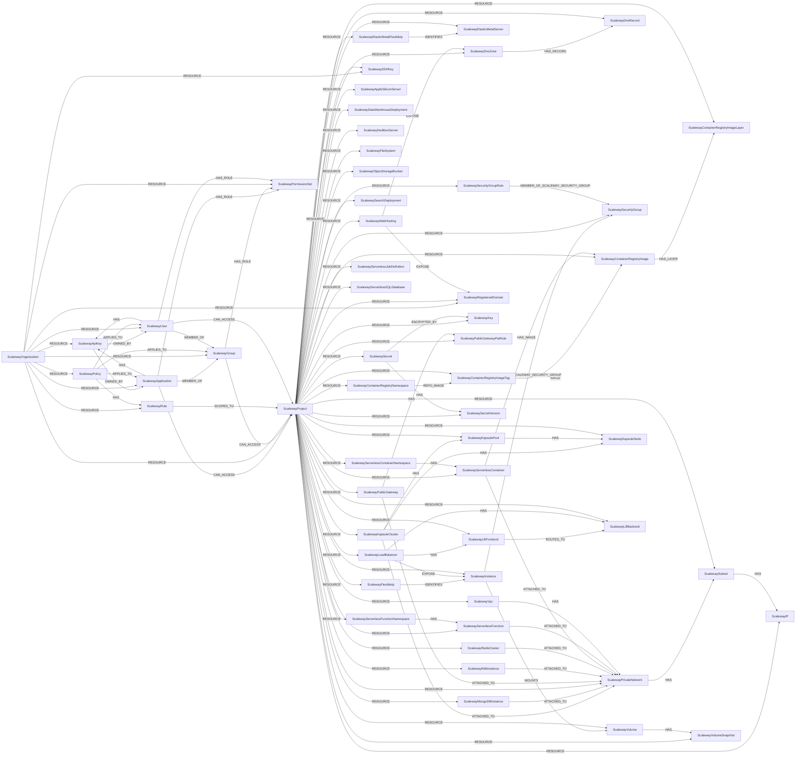

<!-- Generated from the data model. Do not edit manually. -->

## Scaleway Schema

### ScalewayApiKey

Represents an ApiKey in Scaleway.

> **Ontology Mapping**: This node uses the ontology label [`APIKey`](#ontology-apikey).

#### Properties

Ontology-generated fields are shown in *italics*.

| Field | Index | Description |
|-------|-------|-------------|
| id | Yes | Access key of the API key. |
| firstseen |  | Timestamp when a sync job first created this node. |
| lastupdated | Yes | Timestamp of the last sync that observed this node. |
| created_at |  | Date and time of API key creation. |
| creation_ip |  | IP address of the device that created the API key. |
| default_project_id |  | Default Project ID specified for this API key. |
| deletable |  | Defines whether or not the API key is deletable. |
| description |  | Description of API key. |
| editable |  | Defines whether or not the API key is editable. |
| expires_at |  | Date and time of API key expiration. |
| managed |  | Defines whether or not the API key is managed. |
| updated_at |  | Date and time of last API key update. |
| *_ont_created_at* | Yes | Normalized field sourced from `created_at`. |
| *_ont_expires_at* | Yes | Normalized field sourced from `expires_at`. |
| *_ont_name* | Yes | Normalized field sourced from `description`. |
| *_ont_source* |  | Module that populated this node's ontology fields. |
| *_ont_updated_at* | Yes | Normalized field sourced from `updated_at`. |

#### Relationships

- `(:ScalewayApplication)-[:HAS]->(:ScalewayApiKey)`: Connects `ScalewayApplication` to `ScalewayApiKey` through `HAS`.

- `(:ScalewayUser)-[:HAS]->(:ScalewayApiKey)`: Connects `ScalewayUser` to `ScalewayApiKey` through `HAS`.

- `(:ScalewayApiKey)-[:OWNED_BY]->(:ScalewayApplication)`: Connects `ScalewayApiKey` to `ScalewayApplication` through `OWNED_BY`.

- `(:ScalewayApiKey)-[:OWNED_BY]->(:ScalewayUser)`: Connects `ScalewayApiKey` to `ScalewayUser` through `OWNED_BY`.

- `(:User)-[:OWNS]->(:ScalewayApiKey)`: generated by analysis job `Ontology - User OWNS APIKey linking`.

- `(:ScalewayOrganization)-[:RESOURCE]->(:ScalewayApiKey)`: Connects `ScalewayOrganization` to `ScalewayApiKey` through `RESOURCE`.

### ScalewayAppleSiliconServer

Represents an Apple silicon (Mac mini) server in Scaleway.

> **Ontology Mapping**: This node uses the ontology label [`ComputeInstance`](#ontology-computeinstance).

#### Properties

Ontology-generated fields are shown in *italics*.

| Field | Index | Description |
|-------|-------|-------------|
| id | Yes | ID of the server. |
| firstseen |  | Timestamp when a sync job first created this node. |
| lastupdated | Yes | Timestamp of the last sync that observed this node. |
| created_at |  | Date and time of server creation. |
| deletable_at |  | Date and time the server can be deleted. |
| deletion_scheduled |  | Whether deletion is scheduled. |
| delivered |  | Whether the server has been delivered. |
| exposed_internet | Yes | `True` when the server holds a public IP. Bare metal has no managed firewall in front of it. |
| exposed_internet_type | Yes | How it is exposed. Always `direct`. |
| ip |  | Public IP address of the server. |
| name |  | Name of the server. |
| public_bandwidth_bps |  | Public bandwidth in bits per second. |
| status |  | Status of the server. |
| tags |  | Tags attached to the server. |
| type |  | Commercial type of the server. |
| updated_at |  | Date and time of last server update. |
| vpc_status |  | Private network status of the server. |
| zone |  | Zone in which the server is located. |
| *_ont_created_at* | Yes | Normalized field sourced from `created_at`. |
| *_ont_name* | Yes | Normalized field sourced from `name`. |
| *_ont_public_ip_address* | Yes | Normalized field sourced from `ip`. |
| *_ont_region* | Yes | Normalized field sourced from `zone`. |
| *_ont_source* |  | Module that populated this node's ontology fields. |
| *_ont_state* | Yes | Normalized field sourced from `status`. |
| *_ont_type* | Yes | Normalized field sourced from `type`. |

#### Relationships

- `(:PublicIP)-[:POINTS_TO]->(:ScalewayAppleSiliconServer)`

- `(:ScalewayProject)-[:RESOURCE]->(:ScalewayAppleSiliconServer)`: Connects `ScalewayProject` to `ScalewayAppleSiliconServer` through `RESOURCE`.

### ScalewayApplication

Represents an Application (Service Account) in Scaleway

> **Ontology Mapping**: This node uses the ontology label [`ServiceAccount`](#ontology-serviceaccount).

> **Additional Labels**: This node also uses `ScalewayPrincipal`.

> **Additional Label Definitions**:
>
> - `ScalewayPrincipal`: A Scaleway identity participating in the shared ScalewayPrincipal graph interface.

#### Properties

Ontology-generated fields are shown in *italics*.

| Field | Index | Description |
|-------|-------|-------------|
| id | Yes | ID of the application. |
| firstseen |  | Timestamp when a sync job first created this node. |
| lastupdated | Yes | Timestamp of the last sync that observed this node. |
| created_at |  | Date and time application was created. |
| deletable |  | Defines whether or not the application is deletable. |
| description |  | Description of the application. |
| editable |  | Defines whether or not the application is editable. |
| managed |  | Defines whether or not the application is managed. |
| name |  | Name of the application. |
| tags |  | Tags associated with the application. |
| updated_at |  | Date and time of last application update. |
| *_ont_name* | Yes | Normalized field sourced from `name`. |
| *_ont_source* |  | Module that populated this node's ontology fields. |

#### Relationships

- `(:ScalewayPolicy)-[:APPLIES_TO]->(:ScalewayApplication)`: Connects `ScalewayPolicy` to `ScalewayApplication` through `APPLIES_TO`.

- `(:ScalewayApplication)-[:CAN_ACCESS]->(:ScalewayProject)`: Connects `ScalewayApplication` to `ScalewayProject` through `CAN_ACCESS`.
  - Properties:

    | Field | Description |
    |-------|-------------|
    | has_condition | Whether every grant path to the project is gated by an IAM rule condition. |

- `(:ScalewayApplication)-[:HAS]->(:ScalewayApiKey)`: Connects `ScalewayApplication` to `ScalewayApiKey` through `HAS`.

- `(:ScalewayApplication)-[:HAS_ROLE]->(:ScalewayPermissionSet)`: Connects `ScalewayApplication` to `ScalewayPermissionSet` through `HAS_ROLE`.

- `(:ScalewayApplication)-[:MEMBER_OF]->(:ScalewayGroup)`: Connects `ScalewayApplication` to `ScalewayGroup` through `MEMBER_OF`.

- `(:ScalewayApiKey)-[:OWNED_BY]->(:ScalewayApplication)`: Connects `ScalewayApiKey` to `ScalewayApplication` through `OWNED_BY`.

- `(:ScalewayOrganization)-[:RESOURCE]->(:ScalewayApplication)`: Connects `ScalewayOrganization` to `ScalewayApplication` through `RESOURCE`.

### ScalewayContainerRegistryImage

This node label is loaded by more than one sync path:

- Layer and manifest data attached to an image already present in the graph.
- Represents the digest-addressed image content in a Container Registry. Deduplicated
by digest, so multiple tags (and repositories) referencing the same digest share one
node.

> **Ontology Mapping**: This node uses the ontology label [`Image`](#ontology-image).

#### Properties

Ontology-generated fields are shown in *italics*.

| Field | Index | Description |
|-------|-------|-------------|
| id | Yes | Image digest (sha256). |
| firstseen |  | Timestamp when a sync job first created this node. |
| lastupdated | Yes | Timestamp of the last sync that observed this node. |
| digest | Yes | Image digest (sha256). |
| layer_diff_ids |  | Ordered uncompressed layer digests (from the OCI image config). |
| source_file |  | Dockerfile path within the source repository. |
| source_revision |  | Source commit the image was built from. |
| source_uri | Yes | Source VCS repository URL the image was built from (OCI label/annotation or SLSA attestation). Match key for `PACKAGED_FROM`. |
| *_ont_digest* | Yes | Normalized field sourced from `digest`. |
| *_ont_source* |  | Module that populated this node's ontology fields. |

#### Relationships

- `(:PackageVersion)-[:DEPLOYED]->(:ScalewayContainerRegistryImage)`: A canonical package version is deployed on a container image.

- `(:ScalewayServerlessContainer)-[:HAS_IMAGE]->(:ScalewayContainerRegistryImage)`: Connects `ScalewayServerlessContainer` to `ScalewayContainerRegistryImage` through
`HAS_IMAGE`.

- `(:ScalewayContainerRegistryImage)-[:HAS_LAYER]->(:ScalewayContainerRegistryImageLayer)`: Connects `ScalewayContainerRegistryImage` to `ScalewayContainerRegistryImageLayer`
through `HAS_LAYER`.

- `(:ComputeService)-[:HAS_RUNTIME_IMAGE]->(:ScalewayContainerRegistryImage)`: generated by analysis job `Workload HAS_RUNTIME_IMAGE inventory analysis`.
  - Properties:

    | Field | Description |
    |-------|-------------|
    | exposed_internet | Property generated by analysis job: `Workload HAS_RUNTIME_IMAGE inventory analysis`. |

- `(:ScalewayContainerRegistryImageTag)-[:IMAGE]->(:ScalewayContainerRegistryImage)`: Connects `ScalewayContainerRegistryImageTag` to `ScalewayContainerRegistryImage`
through `IMAGE`.

- `(:Container)-[:RESOLVED_IMAGE]->(:ScalewayContainerRegistryImage)`: generated by analysis job `Container RESOLVED_IMAGE analysis`.

- `(:Function)-[:RESOLVED_IMAGE]->(:ScalewayContainerRegistryImage)`: generated by analysis job `Function RESOLVED_IMAGE analysis`.

- `(:ScalewayProject)-[:RESOURCE]->(:ScalewayContainerRegistryImage)`: Connects `ScalewayProject` to `ScalewayContainerRegistryImage` through `RESOURCE`.

### ScalewayContainerRegistryImageLayer

Represents a filesystem layer of a container image, keyed by its uncompressed digest
(`diff_id`) and shared across images that reuse it.

> **Ontology Mapping**: This node uses the ontology label [`ImageLayer`](#ontology-imagelayer).

#### Properties

| Field | Index | Description |
|-------|-------|-------------|
| id | Yes | Layer diff_id (sha256). |
| firstseen |  | Timestamp when a sync job first created this node. |
| lastupdated | Yes | Timestamp of the last sync that observed this node. |
| diff_id | Yes | Uncompressed layer digest (sha256). |
| history |  | Build command (`created_by`) that produced the layer. |
| is_empty |  | Whether the layer is an empty (metadata-only) layer. |

#### Relationships

- `(:ScalewayContainerRegistryImage)-[:HAS_LAYER]->(:ScalewayContainerRegistryImageLayer)`: Connects `ScalewayContainerRegistryImage` to `ScalewayContainerRegistryImageLayer`
through `HAS_LAYER`.

- `(:ScalewayProject)-[:RESOURCE]->(:ScalewayContainerRegistryImageLayer)`: Connects `ScalewayProject` to `ScalewayContainerRegistryImageLayer` through
`RESOURCE`.

### ScalewayContainerRegistryImageTag

Represents a tag (a named pointer such as `latest` or `v1.2.3`) inside a Container
Registry namespace, resolving to a specific image digest. Scaleway's namespace is
the registry (like a GCP Artifact Registry repository), so the "named image" from
`list_images` is not modeled as its own node; its name and visibility are
denormalized onto the tag.

> **Ontology Mapping**: This node uses the ontology label [`ImageTag`](#ontology-imagetag).

#### Properties

| Field | Index | Description |
|-------|-------|-------------|
| id | Yes | Tag UUID. |
| firstseen |  | Timestamp when a sync job first created this node. |
| lastupdated | Yes | Timestamp of the last sync that observed this node. |
| created_at |  | Creation timestamp. |
| digest | Yes | Digest (sha256) the tag resolves to. |
| image_name | Yes | Name of the repository (named image) the tag belongs to. |
| name | Yes | Tag string (e.g. `latest`). |
| status |  | Tag status. |
| updated_at |  | Last update timestamp. |
| uri | Yes | Full pull URI, e.g. `rg.fr-par.scw.cloud/<namespace>/<image>:<tag>`. |
| visibility |  | Per-image visibility (`public`, `private`, `inherit`). Combined with the namespace `is_public` flag to derive effective exposure. |

#### Relationships

- `(:ScalewayContainerRegistryImageTag)-[:IMAGE]->(:ScalewayContainerRegistryImage)`: Connects `ScalewayContainerRegistryImageTag` to `ScalewayContainerRegistryImage`
through `IMAGE`.

- `(:ScalewayContainerRegistryNamespace)-[:REPO_IMAGE]->(:ScalewayContainerRegistryImageTag)`: Connects `ScalewayContainerRegistryNamespace` to `ScalewayContainerRegistryImageTag`
through `REPO_IMAGE`.

- `(:ScalewayProject)-[:RESOURCE]->(:ScalewayContainerRegistryImageTag)`: Connects `ScalewayProject` to `ScalewayContainerRegistryImageTag` through
`RESOURCE`.

### ScalewayContainerRegistryNamespace

Represents a Scaleway Container Registry namespace (top-level repository scope).

> **Ontology Mapping**: This node uses the ontology label [`ContainerRegistry`](#ontology-containerregistry).

#### Properties

Ontology-generated fields are shown in *italics*.

| Field | Index | Description |
|-------|-------|-------------|
| id | Yes | Namespace UUID. |
| firstseen |  | Timestamp when a sync job first created this node. |
| lastupdated | Yes | Timestamp of the last sync that observed this node. |
| created_at |  | Creation timestamp. |
| description |  | Namespace description. |
| endpoint | Yes | Registry endpoint (e.g. `rg.fr-par.scw.cloud/<name>`). |
| exposed_internet | Yes | `True` when `is_public` is true, meaning the registry serves unauthenticated pulls. |
| exposed_internet_type | Yes | How it is exposed. Always `direct`. |
| image_count |  | Number of images in the namespace. |
| is_public |  | True if the namespace allows unauthenticated reads. |
| name | Yes | Namespace name. |
| region |  | Region the namespace lives in. |
| size |  | Total size in bytes of stored images. |
| status |  | Namespace status. |
| status_message |  | Human-readable status message. |
| updated_at |  | Last update timestamp. |
| *_ont_created_at* | Yes | Normalized field sourced from `created_at`. |
| *_ont_location* | Yes | Normalized field sourced from `region`. |
| *_ont_name* | Yes | Normalized field sourced from `name`. |
| *_ont_size_bytes* | Yes | Normalized field sourced from `size`. |
| *_ont_source* |  | Module that populated this node's ontology fields. |
| *_ont_uri* | Yes | Normalized field sourced from `endpoint`. |

#### Relationships

- `(:ScalewayContainerRegistryNamespace)-[:REPO_IMAGE]->(:ScalewayContainerRegistryImageTag)`: Connects `ScalewayContainerRegistryNamespace` to `ScalewayContainerRegistryImageTag`
through `REPO_IMAGE`.

- `(:ScalewayProject)-[:RESOURCE]->(:ScalewayContainerRegistryNamespace)`: Connects `ScalewayProject` to `ScalewayContainerRegistryNamespace` through
`RESOURCE`.

### ScalewayDataWarehouseDeployment

Represents a Data Warehouse (ClickHouse) deployment in Scaleway.

> **Ontology Mapping**: This node uses the ontology label [`Database`](#ontology-database).

#### Properties

Ontology-generated fields are shown in *italics*.

| Field | Index | Description |
|-------|-------|-------------|
| id | Yes | ID of the deployment. |
| firstseen |  | Timestamp when a sync job first created this node. |
| lastupdated | Yes | Timestamp of the last sync that observed this node. |
| cpu_max |  | Maximum vCPU. |
| cpu_min |  | Minimum vCPU. |
| created_at |  | Creation timestamp. |
| exposed_internet | Yes | `True` when `is_public` is true, meaning a publicly reachable endpoint is provisioned. |
| exposed_internet_type | Yes | How it is exposed. Always `direct`. |
| is_public |  | True if any endpoint is public-facing. |
| name |  | Name of the deployment. |
| ram_per_cpu |  | RAM per vCPU. |
| region |  | Region the deployment lives in. |
| replica_count |  | Number of replicas. |
| shard_count |  | Number of shards. |
| status |  | Status of the deployment. |
| tags |  | Tags attached to the deployment. |
| updated_at |  | Last update timestamp. |
| version |  | Engine version. |
| *_ont_location* | Yes | Normalized field sourced from `region`. |
| *_ont_name* | Yes | Normalized field sourced from `name`. |
| *_ont_source* |  | Module that populated this node's ontology fields. |
| *_ont_type* | Yes | Property generated by the ontology mapping. |
| *_ont_version* | Yes | Normalized field sourced from `version`. |

#### Relationships

- `(:ScalewayProject)-[:RESOURCE]->(:ScalewayDataWarehouseDeployment)`: Connects `ScalewayProject` to `ScalewayDataWarehouseDeployment` through `RESOURCE`.

### ScalewayDediboxServer

Represents a Dedibox (dedicated) server in Scaleway.

> **Ontology Mapping**: This node uses the ontology label [`ComputeInstance`](#ontology-computeinstance).

#### Properties

Ontology-generated fields are shown in *italics*.

| Field | Index | Description |
|-------|-------|-------------|
| id | Yes | ID of the server (stringified). |
| firstseen |  | Timestamp when a sync job first created this node. |
| lastupdated | Yes | Timestamp of the last sync that observed this node. |
| created_at |  | Date and time of server creation. |
| datacenter_name |  | Datacenter hosting the server. |
| expired_at |  | Date and time the server expires. |
| exposed_internet | Yes | `True` when the server holds a public IP. Bare metal has no managed firewall in front of it. |
| exposed_internet_type | Yes | How it is exposed. Always `direct`. |
| hostname |  | Hostname of the server. |
| ips |  | Public IP addresses of the server. |
| is_hds |  | Whether the server is HDS certified. |
| is_outsourced |  | Whether the server is outsourced. |
| offer_id |  | Offer ID of the server. |
| offer_name |  | Offer name of the server. |
| public_ip |  | First public IP (scalar, for ontology). |
| status |  | Status of the server. |
| updated_at |  | Date and time of last server update. |
| zone |  | Zone in which the server is located. |
| *_ont_created_at* | Yes | Normalized field sourced from `created_at`. |
| *_ont_name* | Yes | Normalized field sourced from `hostname`. |
| *_ont_public_ip_address* | Yes | Normalized field sourced from `public_ip`. |
| *_ont_region* | Yes | Normalized field sourced from `zone`. |
| *_ont_source* |  | Module that populated this node's ontology fields. |
| *_ont_state* | Yes | Normalized field sourced from `status`. |
| *_ont_type* | Yes | Normalized field sourced from `offer_name`. |

#### Relationships

- `(:PublicIP)-[:POINTS_TO]->(:ScalewayDediboxServer)`

- `(:ScalewayProject)-[:RESOURCE]->(:ScalewayDediboxServer)`: Connects `ScalewayProject` to `ScalewayDediboxServer` through `RESOURCE`.

### ScalewayDnsRecord

Represents an individual DNS record within a `ScalewayDnsZone`.

> **Ontology Mapping**: This node uses the ontology label [`DNSRecord`](#ontology-dnsrecord).

#### Properties

| Field | Index | Description |
|-------|-------|-------------|
| id | Yes | Record unique ID. |
| firstseen |  | Timestamp when a sync job first created this node. |
| lastupdated | Yes | Timestamp of the last sync that observed this node. |
| comment |  | Free-form record comment. |
| data |  | Record data (target IP, hostname, value, ...). |
| name | Yes | Record name (relative to its zone). |
| priority |  | Record priority (relevant for MX/SRV). |
| ttl |  | Record TTL in seconds. |
| type |  | Record type (`a`, `aaaa`, `cname`, `mx`, ...). |
| updated_at |  | Record last update date. |

#### Relationships

- `(:ScalewayDnsZone)-[:HAS_RECORD]->(:ScalewayDnsRecord)`: Connects `ScalewayDnsZone` to `ScalewayDnsRecord` through `HAS_RECORD`.

- `(:ScalewayProject)-[:RESOURCE]->(:ScalewayDnsRecord)`: Connects `ScalewayProject` to `ScalewayDnsRecord` through `RESOURCE`.

### ScalewayDnsZone

Represents a DNS zone managed by Scaleway Domains & DNS. The zone's ID is composed
from `{subdomain}.{domain}` (or just `{domain}` for apex zones), which is the value
the Scaleway API itself uses as the zone path parameter.

> **Ontology Mapping**: This node uses the ontology label [`DNSZone`](#ontology-dnszone).

#### Properties

| Field | Index | Description |
|-------|-------|-------------|
| id | Yes | Full zone name (`subdomain.domain` or `domain`). |
| firstseen |  | Timestamp when a sync job first created this node. |
| lastupdated | Yes | Timestamp of the last sync that observed this node. |
| domain | Yes | Apex domain of the zone. |
| linked_products |  | Scaleway products linked to this zone. |
| message |  | Status message returned by the API. |
| ns |  | Authoritative name servers currently configured for the zone. |
| ns_default |  | Default Scaleway name servers. |
| ns_master |  | Master name servers. |
| status |  | Zone status (`active`, `pending`, `error`, ...). |
| subdomain |  | Subdomain within the apex (empty for the apex zone itself). |
| updated_at |  | Zone last update date. |

#### Relationships

- `(:ScalewayWebHosting)-[:EXPOSE]->(:ScalewayDnsZone)`: Identifies the Scaleway DNS zone served by the hosting account.

- `(:ScalewayDnsZone)-[:HAS_RECORD]->(:ScalewayDnsRecord)`: Connects `ScalewayDnsZone` to `ScalewayDnsRecord` through `HAS_RECORD`.

- `(:ScalewayProject)-[:RESOURCE]->(:ScalewayDnsZone)`: Connects `ScalewayProject` to `ScalewayDnsZone` through `RESOURCE`.

### ScalewayElasticMetalFlexibleIp

Represents a flexible (portable) public IP for Elastic Metal servers in Scaleway.

> **Ontology Projection**: `ScalewayElasticMetalFlexibleIp` contributes data to canonical [`PublicIP`](#ontology-publicip) nodes.

#### Properties

| Field | Index | Description |
|-------|-------|-------------|
| id | Yes | ID of the flexible IP. |
| firstseen |  | Timestamp when a sync job first created this node. |
| lastupdated | Yes | Timestamp of the last sync that observed this node. |
| created_at |  | Creation timestamp. |
| description |  | Description of the flexible IP. |
| ip_address |  | The IP address. |
| reverse |  | Reverse DNS value. |
| server_id |  | ID of the server the IP is attached to. |
| status |  | Status of the flexible IP. |
| tags |  | Tags attached to the flexible IP. |
| updated_at |  | Last update timestamp. |
| zone |  | Availability zone. |

#### Relationships

- `(:ScalewayElasticMetalFlexibleIp)-[:IDENTIFIES]->(:ScalewayElasticMetalServer)`: Connects `ScalewayElasticMetalFlexibleIp` to `ScalewayElasticMetalServer` through
`IDENTIFIES`.

- `(:PublicIP)-[:RESERVED_BY]->(:ScalewayElasticMetalFlexibleIp)`

- `(:ScalewayProject)-[:RESOURCE]->(:ScalewayElasticMetalFlexibleIp)`: Connects `ScalewayProject` to `ScalewayElasticMetalFlexibleIp` through `RESOURCE`.

### ScalewayElasticMetalServer

Represents an Elastic Metal (bare-metal) server in Scaleway.

> **Ontology Mapping**: This node uses the ontology label [`ComputeInstance`](#ontology-computeinstance).

#### Properties

Ontology-generated fields are shown in *italics*.

| Field | Index | Description |
|-------|-------|-------------|
| id | Yes | ID of the server. |
| firstseen |  | Timestamp when a sync job first created this node. |
| lastupdated | Yes | Timestamp of the last sync that observed this node. |
| boot_type |  | Boot type of the server. |
| created_at |  | Date and time of server creation. |
| description |  | Description of the server. |
| domain |  | Domain of the server. |
| exposed_internet | Yes | `True` when the server holds a public IP. Bare metal has no managed firewall in front of it. |
| exposed_internet_type | Yes | How it is exposed. Always `direct`. |
| ips |  | Public IP addresses attached to the server. |
| name |  | Name of the server. |
| offer_id |  | Offer ID of the server. |
| offer_name |  | Offer name of the server. |
| ping_status |  | Status of the server ping. |
| protected |  | If enabled, the server can not be deleted. |
| public_ip |  | First public IP (scalar, for ontology). |
| status |  | Status of the server. |
| tags |  | Tags attached to the server. |
| updated_at |  | Date and time of last server update. |
| zone |  | Zone in which the server is located. |
| *_ont_created_at* | Yes | Normalized field sourced from `created_at`. |
| *_ont_name* | Yes | Normalized field sourced from `name`. |
| *_ont_public_ip_address* | Yes | Normalized field sourced from `public_ip`. |
| *_ont_region* | Yes | Normalized field sourced from `zone`. |
| *_ont_source* |  | Module that populated this node's ontology fields. |
| *_ont_state* | Yes | Normalized field sourced from `status`. |
| *_ont_type* | Yes | Normalized field sourced from `offer_name`. |

#### Relationships

- `(:ScalewayElasticMetalFlexibleIp)-[:IDENTIFIES]->(:ScalewayElasticMetalServer)`: Connects `ScalewayElasticMetalFlexibleIp` to `ScalewayElasticMetalServer` through
`IDENTIFIES`.

- `(:PublicIP)-[:POINTS_TO]->(:ScalewayElasticMetalServer)`

- `(:ScalewayProject)-[:RESOURCE]->(:ScalewayElasticMetalServer)`: Connects `ScalewayProject` to `ScalewayElasticMetalServer` through `RESOURCE`.

### ScalewayFileSystem

Represents a File Storage file system in Scaleway.

> **Ontology Mapping**: This node uses the ontology label [`FileStorage`](#ontology-filestorage).

#### Properties

Ontology-generated fields are shown in *italics*.

| Field | Index | Description |
|-------|-------|-------------|
| id | Yes | ID of the file system. |
| firstseen |  | Timestamp when a sync job first created this node. |
| lastupdated | Yes | Timestamp of the last sync that observed this node. |
| created_at |  | Creation timestamp. |
| name |  | Name of the file system. |
| number_of_attachments |  | Number of resources it is attached to. |
| region |  | Region the file system lives in. |
| size |  | Size of the file system in bytes. |
| status |  | Status of the file system. |
| tags |  | Tags attached to the file system. |
| updated_at |  | Last update timestamp. |
| *_ont_location* | Yes | Normalized field sourced from `region`. |
| *_ont_name* | Yes | Normalized field sourced from `name`. |
| *_ont_source* |  | Module that populated this node's ontology fields. |

#### Relationships

- `(:ScalewayProject)-[:RESOURCE]->(:ScalewayFileSystem)`: Connects `ScalewayProject` to `ScalewayFileSystem` through `RESOURCE`.

### ScalewayFlexibleIp

Flexible IP addresses are public IP addresses that you can hold independently of any
Instance. By default, a Scaleway Instance's public IP is also a flexible IP address.

> **Ontology Projection**: `ScalewayFlexibleIp` contributes data to canonical [`PublicIP`](#ontology-publicip) nodes.

#### Properties

| Field | Index | Description |
|-------|-------|-------------|
| id | Yes | Flexible IP ID |
| firstseen |  | Timestamp when a sync job first created this node. |
| lastupdated | Yes | Timestamp of the last sync that observed this node. |
| address |  | IP address |
| ipam_id |  | IPAM ID (UUID format) |
| prefix |  | IP Network |
| reverse |  | Reverse DNS |
| state |  | State of the IP (`unknown_state`, `detached`, `attached`, `pending`, `error`) |
| tags |  | Tags for the IP |
| type |  | Type of IP (`unknown_iptype`, `routed_ipv4`, `routed_ipv6`) |
| zone |  | AZ of the IP |

#### Relationships

- `(:ScalewayFlexibleIp)-[:IDENTIFIES]->(:ScalewayInstance)`: Connects `ScalewayFlexibleIp` to `ScalewayInstance` through `IDENTIFIES`.

- `(:PublicIP)-[:RESERVED_BY]->(:ScalewayFlexibleIp)`

- `(:ScalewayProject)-[:RESOURCE]->(:ScalewayFlexibleIp)`: Connects `ScalewayProject` to `ScalewayFlexibleIp` through `RESOURCE`.

### ScalewayGroup

Represents a Group in Scaleway.

> **Ontology Mapping**: This node uses the ontology label [`UserGroup`](#ontology-usergroup).

> **Additional Labels**: This node also uses `ScalewayPrincipal`.

> **Additional Label Definitions**:
>
> - `ScalewayPrincipal`: A Scaleway identity participating in the shared ScalewayPrincipal graph interface.

#### Properties

Ontology-generated fields are shown in *italics*.

| Field | Index | Description |
|-------|-------|-------------|
| id | Yes | ID of the group. |
| firstseen |  | Timestamp when a sync job first created this node. |
| lastupdated | Yes | Timestamp of the last sync that observed this node. |
| created_at |  | Date and time of group creation. |
| deletable |  | Defines whether or not the group is deletable. |
| description |  | Description of the group. |
| editable |  | Defines whether or not the group is editable. |
| managed |  | Defines whether or not the group is managed. |
| name |  | Name of the group. |
| tags | Yes | Tags associated to the group. |
| updated_at |  | Date and time of last group update. |
| *_ont_description* |  | Normalized field sourced from `description`. |
| *_ont_name* | Yes | Normalized field sourced from `name`. |
| *_ont_source* |  | Module that populated this node's ontology fields. |

#### Relationships

- `(:ScalewayPolicy)-[:APPLIES_TO]->(:ScalewayGroup)`: Connects `ScalewayPolicy` to `ScalewayGroup` through `APPLIES_TO`.

- `(:ScalewayGroup)-[:CAN_ACCESS]->(:ScalewayProject)`: Connects `ScalewayGroup` to `ScalewayProject` through `CAN_ACCESS`.
  - Properties:

    | Field | Description |
    |-------|-------------|
    | has_condition | Whether every grant path to the project is gated by an IAM rule condition. |

- `(:ScalewayGroup)-[:HAS_ROLE]->(:ScalewayPermissionSet)`: Connects `ScalewayGroup` to `ScalewayPermissionSet` through `HAS_ROLE`.

- `(:ScalewayApplication)-[:MEMBER_OF]->(:ScalewayGroup)`: Connects `ScalewayApplication` to `ScalewayGroup` through `MEMBER_OF`.

- `(:ScalewayUser)-[:MEMBER_OF]->(:ScalewayGroup)`: Connects `ScalewayUser` to `ScalewayGroup` through `MEMBER_OF`.

- `(:ScalewayOrganization)-[:RESOURCE]->(:ScalewayGroup)`: Connects `ScalewayOrganization` to `ScalewayGroup` through `RESOURCE`.

### ScalewayInstance

An Instance is a virtual computing unit that provides resources, such as processing
power, memory, and network connectivity, to run your applications.

> **Ontology Mapping**: This node uses the ontology label [`ComputeInstance`](#ontology-computeinstance).

#### Properties

Ontology-generated fields are shown in *italics*.

| Field | Index | Description |
|-------|-------|-------------|
| id | Yes | Instance unique ID. |
| firstseen |  | Timestamp when a sync job first created this node. |
| lastupdated | Yes | Timestamp of the last sync that observed this node. |
| arch |  | Instance architecture (`unknown_arch`, `x86_64`, `arm`, `arm64`) |
| boot_type |  | Instance boot type (`local`, `bootscript`, `rescue`) |
| commercial_type |  | Instance commercial type (eg. GP1-M). |
| creation_date |  | Instance creation date. |
| dynamic_ip_required |  | True if a dynamic IPv4 is required. |
| enable_ipv6 |  | True if IPv6 is enabled (deprecated and always False when routed_ip_enabled is True). |
| end_of_service |  | True if the Instance type has reached end of service. |
| exposed_internet | Yes | `True` when the instance has a public IP with an open inbound rule, is behind a Public Gateway PAT rule, or sits behind an internet-facing Load Balancer. |
| exposed_internet_type | Yes | How the instance is exposed: `direct`, `pat` and/or `lb`. |
| hostname |  | Instance host name. |
| ipv6_address |  | Instance IPv6 IP-Address. |
| ipv6_gateway |  | IPv6 IP-addresses gateway. |
| ipv6_netmask |  | IPv6 IP-addresses CIDR netmask. |
| location_cluster_id |  | Instance location, cluster ID |
| location_hypervisor_id |  | Instance location, hypervisor ID |
| location_node_id |  | Instance location, node ID |
| location_platform_id |  | Instance location, platform ID |
| mac_address |  | The server's MAC address. |
| modification_date |  | Instance modification date. |
| name |  | Instance name. |
| private_ip |  | Private IP address of the Instance (deprecated and always null when routed_ip_enabled is True). |
| private_nics |  | Instance private NICs. |
| public_ips |  | Public IP addresses assigned to the instance. |
| routed_ip_enabled |  | True to configure the instance so it uses the routed IP mode. Use of routed_ip_enabled as False is deprecated. |
| state |  | Instance state (`running`, `stopped`, `stopped in place`, `starting`, `stopping`, `locked`) |
| state_detail |  | Detailed information about the Instance state. |
| tags |  | Tags associated with the Instance. |
| zone |  | Zone in which the Instance is located. |
| *_ont_created_at* | Yes | Normalized field sourced from `creation_date`. |
| *_ont_name* | Yes | Normalized field sourced from `name`. |
| *_ont_private_ip_address* | Yes | Normalized field sourced from `private_ip`. |
| *_ont_region* | Yes | Normalized field sourced from `zone`. |
| *_ont_source* |  | Module that populated this node's ontology fields. |
| *_ont_state* | Yes | Normalized field sourced from `state`. |
| *_ont_type* | Yes | Normalized field sourced from `commercial_type`. |

#### Relationships

- `(:ScalewayLoadBalancer)-[:EXPOSE]->(:ScalewayInstance)`: generated by analysis job `Scaleway Load Balancer EXPOSE relationships`.
  - Properties:

    | Field | Description |
    |-------|-------------|
    | exposure_type | Property generated by analysis job: `Scaleway Load Balancer EXPOSE relationships`. |

- `(:ScalewayFlexibleIp)-[:IDENTIFIES]->(:ScalewayInstance)`: Connects `ScalewayFlexibleIp` to `ScalewayInstance` through `IDENTIFIES`.

- `(:ScalewayInstance)-[:MEMBER_OF_SCALEWAY_SECURITY_GROUP]->(:ScalewaySecurityGroup)`: Connects `ScalewayInstance` to `ScalewaySecurityGroup` through
`MEMBER_OF_SCALEWAY_SECURITY_GROUP`.

- `(:ScalewayInstance)-[:MOUNTS]->(:ScalewayVolume)`: Connects `ScalewayInstance` to `ScalewayVolume` through `MOUNTS`.

- `(:PublicIP)-[:POINTS_TO]->(:ScalewayInstance)`

- `(:ScalewayProject)-[:RESOURCE]->(:ScalewayInstance)`: Connects `ScalewayProject` to `ScalewayInstance` through `RESOURCE`.

### ScalewayIP

An IP is an IPAM-managed IP address (IPv4 or IPv6) allocated within a Private
Network and optionally attached to a resource.

#### Properties

| Field | Index | Description |
|-------|-------|-------------|
| id | Yes | IP unique ID. |
| firstseen |  | Timestamp when a sync job first created this node. |
| lastupdated | Yes | Timestamp of the last sync that observed this node. |
| address |  | The IP address (CIDR notation). |
| created_at |  | IP creation date. |
| is_ipv6 |  | True if the address is IPv6. |
| region |  | Region the IP lives in. |
| resource_id |  | ID of the resource the IP is attached to. |
| resource_mac_address |  | MAC address of the resource the IP is attached to. |
| resource_name |  | Name of the resource the IP is attached to. |
| resource_type |  | Type of resource the IP is attached to (e.g. `instance_private_nic`). |
| source_private_network_id |  | ID of the Private Network the IP was booked in. |
| source_subnet_id |  | ID of the subnet the IP was booked in. |
| source_vpc_id |  | ID of the VPC the IP was booked in. |
| tags |  | Tags associated with the IP. |
| updated_at |  | IP last update date. |
| zone |  | Zone the IP lives in (when zonal). |

#### Relationships

- `(:ScalewaySubnet)-[:HAS]->(:ScalewayIP)`: Connects `ScalewaySubnet` to `ScalewayIP` through `HAS`.

- `(:ScalewayProject)-[:RESOURCE]->(:ScalewayIP)`: Connects `ScalewayProject` to `ScalewayIP` through `RESOURCE`.

### ScalewayKapsuleCluster

Represents a Scaleway Kapsule (managed Kubernetes) cluster.

> **Ontology Mapping**: This node uses the ontology label [`ComputeCluster`](#ontology-computecluster).

#### Properties

Ontology-generated fields are shown in *italics*.

| Field | Index | Description |
|-------|-------|-------------|
| id | Yes | Cluster UUID. |
| firstseen |  | Timestamp when a sync job first created this node. |
| lastupdated | Yes | Timestamp of the last sync that observed this node. |
| admission_plugins |  | List of enabled admission plugins. |
| apiserver_cert_sans |  | Extra SANs added to the apiserver cert. |
| cluster_url |  | API server URL. |
| cni |  | CNI plugin (`cilium`, `calico`, ...). |
| created_at |  | Creation timestamp. |
| description |  | Cluster description. |
| dns_wildcard |  | Wildcard DNS name pointing at the cluster. |
| feature_gates |  | List of enabled Kubernetes feature gates. |
| name | Yes | Cluster name. |
| pod_cidr |  | Pod IP range. |
| private_network_id |  | ID of the VPC private network this cluster is attached to (if any). |
| region |  | Region the cluster lives in. |
| service_cidr |  | Service IP range. |
| service_dns_ip |  | In-cluster DNS service IP. |
| status |  | Cluster status (`ready`, `creating`, ...). |
| tags |  | Cluster tags. |
| type |  | Cluster offer type (e.g. `kapsule`, `multicloud`). |
| updated_at |  | Last update timestamp. |
| upgrade_available |  | True if a newer Kubernetes version is offered. |
| version |  | Kubernetes version. |
| *_ont_endpoint* | Yes | Normalized field sourced from `cluster_url`. |
| *_ont_name* | Yes | Normalized field sourced from `name`. |
| *_ont_region* | Yes | Normalized field sourced from `region`. |
| *_ont_source* |  | Module that populated this node's ontology fields. |
| *_ont_status* | Yes | Normalized field sourced from `status`. |
| *_ont_version* | Yes | Normalized field sourced from `version`. |

#### Relationships

- `(:ScalewayKapsuleCluster)-[:ATTACHED_TO]->(:ScalewayPrivateNetwork)`: Connects `ScalewayKapsuleCluster` to `ScalewayPrivateNetwork` through `ATTACHED_TO`.

- `(:ScalewayKapsuleCluster)-[:HAS]->(:ScalewayKapsuleNode)`: Connects `ScalewayKapsuleCluster` to `ScalewayKapsuleNode` through `HAS`.

- `(:ScalewayKapsuleCluster)-[:HAS]->(:ScalewayKapsulePool)`: Connects `ScalewayKapsuleCluster` to `ScalewayKapsulePool` through `HAS`.

- `(:ScalewayProject)-[:RESOURCE]->(:ScalewayKapsuleCluster)`: Connects `ScalewayProject` to `ScalewayKapsuleCluster` through `RESOURCE`.

### ScalewayKapsuleNode

Represents a single node in a Kapsule pool.

#### Properties

| Field | Index | Description |
|-------|-------|-------------|
| id | Yes | Node UUID. |
| firstseen |  | Timestamp when a sync job first created this node. |
| lastupdated | Yes | Timestamp of the last sync that observed this node. |
| created_at |  | Creation timestamp. |
| error_message |  | Last error message reported by the node. |
| exposed_internet | Yes | `True` when the node holds a public IPv4 or IPv6 address. Node-level firewalling is not modelled. |
| exposed_internet_type | Yes | How it is exposed. Always `direct`. |
| name | Yes | Node name. |
| provider_id |  | Provider-side identifier for the backing instance (e.g. `scaleway://instance/<zone>/<id>`). |
| public_ip_v4 |  | Public IPv4 address. |
| public_ip_v6 |  | Public IPv6 address. |
| region |  | Region the node lives in. |
| status |  | Node status (`ready`, `not_ready`, ...). |
| updated_at |  | Last update timestamp. |

#### Relationships

- `(:ScalewayKapsuleCluster)-[:HAS]->(:ScalewayKapsuleNode)`: Connects `ScalewayKapsuleCluster` to `ScalewayKapsuleNode` through `HAS`.

- `(:ScalewayKapsulePool)-[:HAS]->(:ScalewayKapsuleNode)`: Connects `ScalewayKapsulePool` to `ScalewayKapsuleNode` through `HAS`.

- `(:ScalewayProject)-[:RESOURCE]->(:ScalewayKapsuleNode)`: Connects `ScalewayProject` to `ScalewayKapsuleNode` through `RESOURCE`.

### ScalewayKapsulePool

Represents a Kapsule node pool: a homogeneous group of nodes provisioned for a
Kapsule cluster.

#### Properties

| Field | Index | Description |
|-------|-------|-------------|
| id | Yes | Pool UUID. |
| firstseen |  | Timestamp when a sync job first created this node. |
| lastupdated | Yes | Timestamp of the last sync that observed this node. |
| autohealing |  | True if autohealing is enabled. |
| autoscaling |  | True if the pool autoscales. |
| container_runtime |  | Container runtime (`containerd`, ...). |
| created_at |  | Creation timestamp. |
| max_size |  | Maximum size for autoscaling. |
| min_size |  | Minimum size for autoscaling. |
| name | Yes | Pool name. |
| node_type |  | Scaleway instance commercial type used for nodes (e.g. `DEV1-M`). |
| placement_group_id |  | ID of the placement group, if any. |
| public_ip_disabled |  | True if nodes have no public IP. |
| region |  | Region the pool lives in. |
| root_volume_size |  | Root volume size in bytes. |
| root_volume_type |  | Root volume type for nodes. |
| security_group_id |  | Security group applied to the nodes. |
| size |  | Current size of the pool. |
| status |  | Pool status. |
| tags |  | Pool tags. |
| updated_at |  | Last update timestamp. |
| version |  | Kubernetes version of the pool. |
| zone |  | Zone the pool's nodes live in. |

#### Relationships

- `(:ScalewayKapsuleCluster)-[:HAS]->(:ScalewayKapsulePool)`: Connects `ScalewayKapsuleCluster` to `ScalewayKapsulePool` through `HAS`.

- `(:ScalewayKapsulePool)-[:HAS]->(:ScalewayKapsuleNode)`: Connects `ScalewayKapsulePool` to `ScalewayKapsuleNode` through `HAS`.

- `(:ScalewayProject)-[:RESOURCE]->(:ScalewayKapsulePool)`: Connects `ScalewayProject` to `ScalewayKapsulePool` through `RESOURCE`.

### ScalewayKey

Represents a Scaleway Key Manager key.

> **Ontology Mapping**: This node uses the ontology label [`EncryptionKey`](#ontology-encryptionkey).

#### Properties

Ontology-generated fields are shown in *italics*.

| Field | Index | Description |
|-------|-------|-------------|
| id | Yes | Key unique ID. |
| firstseen |  | Timestamp when a sync job first created this node. |
| lastupdated | Yes | Timestamp of the last sync that observed this node. |
| created_at |  | Key creation date. |
| deletion_requested_at |  | Timestamp when deletion was requested. |
| description |  | Key description. |
| locked |  | True if the key is locked. |
| name | Yes | Key name. |
| origin |  | Key material origin (`scaleway_kms`, `external`). |
| protected |  | True if the key is protected against deletion. |
| region |  | Region the key lives in. |
| rotated_at |  | Last rotation date. |
| rotation_count |  | Number of times the key has been rotated. |
| rotation_next_at |  | Next scheduled rotation timestamp. |
| rotation_period |  | Automatic rotation period (ISO 8601 duration). |
| state |  | Key state (`enabled`, `disabled`, `pending_deletion`, ...). |
| tags |  | Key tags. |
| updated_at |  | Key last update date. |
| usage_algorithm |  | Algorithm corresponding to `usage_type` (e.g. `aes_256_gcm`). |
| usage_type |  | Active key usage category (`symmetric_encryption`, `asymmetric_encryption`, `asymmetric_signing`). |
| *_ont_enabled* | Yes | Normalized field sourced from `state`. |
| *_ont_key_type* | Yes | Normalized field sourced from `usage_type`. |
| *_ont_name* | Yes | Normalized field sourced from `name`. |
| *_ont_rotation_enabled* | Yes | Normalized field sourced from `rotation_period`. |
| *_ont_source* |  | Module that populated this node's ontology fields. |

#### Relationships

- `(:ScalewaySecret)-[:ENCRYPTED_BY]->(:ScalewayKey)`: Connects `ScalewaySecret` to `ScalewayKey` through `ENCRYPTED_BY`.

- `(:ScalewayProject)-[:RESOURCE]->(:ScalewayKey)`: Connects `ScalewayProject` to `ScalewayKey` through `RESOURCE`.

### ScalewayLBBackend

A Backend defines a pool of servers and the forwarding / health-check configuration
a Load Balancer uses to reach them.

#### Properties

| Field | Index | Description |
|-------|-------|-------------|
| id | Yes | Backend unique ID. |
| firstseen |  | Timestamp when a sync job first created this node. |
| lastupdated | Yes | Timestamp of the last sync that observed this node. |
| created_at |  | Backend creation date. |
| forward_port |  | Port traffic is forwarded to. |
| forward_port_algorithm |  | Load-balancing algorithm (e.g. `roundrobin`). |
| forward_protocol |  | Protocol used to forward traffic (`tcp`, `http`). |
| health_check_delay |  | Delay between health checks. |
| health_check_max_retries |  | Max health-check retries before marking down. |
| health_check_port |  | Port used for health checks. |
| name |  | Backend name. |
| on_marked_down_action |  | Action when a server is marked down. |
| pool |  | List of backend server IP addresses. |
| proxy_protocol |  | Proxy protocol mode. |
| ssl_bridging |  | True if SSL bridging to the backend is enabled. |
| sticky_sessions |  | Sticky-session mode. |
| timeout_connect |  | Connection timeout. |
| timeout_server |  | Server inactivity timeout. |
| updated_at |  | Backend last update date. |

#### Relationships

- `(:ScalewayLoadBalancer)-[:HAS]->(:ScalewayLBBackend)`: Connects `ScalewayLoadBalancer` to `ScalewayLBBackend` through `HAS`.

- `(:ScalewayProject)-[:RESOURCE]->(:ScalewayLBBackend)`: Connects `ScalewayProject` to `ScalewayLBBackend` through `RESOURCE`.

- `(:ScalewayLBFrontend)-[:ROUTES_TO]->(:ScalewayLBBackend)`: Connects `ScalewayLBFrontend` to `ScalewayLBBackend` through `ROUTES_TO`.

### ScalewayLBFrontend

A Frontend defines an inbound listener (port) on a Load Balancer and the backend it
routes to.

#### Properties

| Field | Index | Description |
|-------|-------|-------------|
| id | Yes | Frontend unique ID. |
| firstseen |  | Timestamp when a sync job first created this node. |
| lastupdated | Yes | Timestamp of the last sync that observed this node. |
| certificate_ids |  | IDs of the TLS certificates attached. |
| connection_rate_limit |  | Per-source connection rate limit. |
| created_at |  | Frontend creation date. |
| enable_access_logs |  | True if access logs are enabled. |
| enable_http3 |  | True if HTTP/3 is enabled. |
| inbound_port |  | Port the frontend listens on. |
| name |  | Frontend name. |
| timeout_client |  | Client inactivity timeout. |
| updated_at |  | Frontend last update date. |

#### Relationships

- `(:ScalewayLoadBalancer)-[:HAS]->(:ScalewayLBFrontend)`: Connects `ScalewayLoadBalancer` to `ScalewayLBFrontend` through `HAS`.

- `(:ScalewayProject)-[:RESOURCE]->(:ScalewayLBFrontend)`: Connects `ScalewayProject` to `ScalewayLBFrontend` through `RESOURCE`.

- `(:ScalewayLBFrontend)-[:ROUTES_TO]->(:ScalewayLBBackend)`: Connects `ScalewayLBFrontend` to `ScalewayLBBackend` through `ROUTES_TO`.

### ScalewayLoadBalancer

A Load Balancer distributes incoming traffic across backend servers. Its public
IP(s) make it an internet-facing entry point.

> **Ontology Mapping**: This node uses the ontology label [`LoadBalancer`](#ontology-loadbalancer).

#### Properties

Ontology-generated fields are shown in *italics*.

| Field | Index | Description |
|-------|-------|-------------|
| id | Yes | Load Balancer unique ID. |
| firstseen |  | Timestamp when a sync job first created this node. |
| lastupdated | Yes | Timestamp of the last sync that observed this node. |
| backend_count |  | Number of backends. |
| created_at |  | Load Balancer creation date. |
| description |  | Load Balancer description. |
| exposed_internet | Yes | `True` when the Load Balancer holds a public IP and has a frontend listening. |
| exposed_internet_type | Yes | How the Load Balancer is exposed. Always `direct`. |
| frontend_count |  | Number of frontends. |
| ip_address |  | Primary public IP address (first entry of `ip_addresses`). |
| ip_addresses |  | All public IP addresses of the Load Balancer. |
| name |  | Load Balancer name. |
| private_network_count |  | Number of attached Private Networks. |
| region |  | Region the Load Balancer lives in. |
| route_count |  | Number of routes. |
| ssl_compatibility_level |  | SSL compatibility level. |
| status |  | Load Balancer status (e.g. `ready`). |
| tags |  | Tags associated with the Load Balancer. |
| type |  | Load Balancer commercial type (e.g. `LB-S`). |
| updated_at |  | Load Balancer last update date. |
| zone |  | Zone the Load Balancer lives in. |
| *_ont_ip_address* | Yes | Normalized field sourced from `ip_address`. |
| *_ont_lb_type* | Yes | Normalized field sourced from `type`. |
| *_ont_name* | Yes | Normalized field sourced from `name`. |
| *_ont_region* | Yes | Normalized field sourced from `region`. |
| *_ont_source* |  | Module that populated this node's ontology fields. |

#### Relationships

- `(:ScalewayLoadBalancer)-[:EXPOSE]->(:ScalewayInstance)`: generated by analysis job `Scaleway Load Balancer EXPOSE relationships`.
  - Properties:

    | Field | Description |
    |-------|-------------|
    | exposure_type | Property generated by analysis job: `Scaleway Load Balancer EXPOSE relationships`. |

- `(:ScalewayLoadBalancer)-[:HAS]->(:ScalewayLBBackend)`: Connects `ScalewayLoadBalancer` to `ScalewayLBBackend` through `HAS`.

- `(:ScalewayLoadBalancer)-[:HAS]->(:ScalewayLBFrontend)`: Connects `ScalewayLoadBalancer` to `ScalewayLBFrontend` through `HAS`.

- `(:PublicIP)-[:POINTS_TO]->(:ScalewayLoadBalancer)`

- `(:ScalewayProject)-[:RESOURCE]->(:ScalewayLoadBalancer)`: Connects `ScalewayProject` to `ScalewayLoadBalancer` through `RESOURCE`.

### ScalewayMongoDBInstance

Represents a managed MongoDB instance (Scaleway "Managed Database for MongoDB").

> **Ontology Mapping**: This node uses the ontology label [`Database`](#ontology-database).

#### Properties

Ontology-generated fields are shown in *italics*.

| Field | Index | Description |
|-------|-------|-------------|
| id | Yes | Instance UUID. |
| firstseen |  | Timestamp when a sync job first created this node. |
| lastupdated | Yes | Timestamp of the last sync that observed this node. |
| created_at |  | Creation timestamp. |
| exposed_internet | Yes | `True` when `is_public` is true, meaning a publicly reachable endpoint is provisioned. |
| exposed_internet_type | Yes | How it is exposed. Always `direct`. |
| is_public |  | True if the instance exposes a publicly reachable endpoint. |
| name | Yes | Instance name. |
| node_amount |  | Number of nodes in the deployment. |
| node_type |  | Commercial node type. |
| private_endpoint_dns |  | DNS record for the first private-network endpoint, if any. |
| private_endpoint_port |  | Port of the first private-network endpoint, if any. |
| public_endpoint_dns |  | DNS record for the public endpoint, if any. |
| public_endpoint_port |  | Port of the public endpoint, if any. |
| region |  | Region the instance lives in. |
| status |  | Instance status. |
| tags |  | Instance tags. |
| version |  | MongoDB version (e.g. `7.0`). |
| volume_size |  | Storage volume size in bytes. |
| volume_type |  | Storage volume type. |
| *_ont_endpoint* | Yes | Normalized field sourced from `public_endpoint_dns`. |
| *_ont_location* | Yes | Normalized field sourced from `region`. |
| *_ont_name* | Yes | Normalized field sourced from `name`. |
| *_ont_port* | Yes | Normalized field sourced from `public_endpoint_port`. |
| *_ont_source* |  | Module that populated this node's ontology fields. |
| *_ont_type* | Yes | Property generated by the ontology mapping. |
| *_ont_version* | Yes | Normalized field sourced from `version`. |

#### Relationships

- `(:ScalewayMongoDBInstance)-[:ATTACHED_TO]->(:ScalewayPrivateNetwork)`: Connects `ScalewayMongoDBInstance` to `ScalewayPrivateNetwork` through
`ATTACHED_TO`.

- `(:ScalewayProject)-[:RESOURCE]->(:ScalewayMongoDBInstance)`: Connects `ScalewayProject` to `ScalewayMongoDBInstance` through `RESOURCE`.

### ScalewayObjectStorageBucket

An Object Storage bucket is an S3-compatible container for objects. Scaleway Object
Storage is not exposed by the Scaleway Python SDK, so it is collected through the
regional S3-compatible endpoints.

> **Ontology Mapping**: This node uses the ontology label [`ObjectStorage`](#ontology-objectstorage).

#### Properties

Ontology-generated fields are shown in *italics*.

| Field | Index | Description |
|-------|-------|-------------|
| id | Yes | Bucket name (globally unique). |
| firstseen |  | Timestamp when a sync job first created this node. |
| lastupdated | Yes | Timestamp of the last sync that observed this node. |
| acl_public |  | True if the bucket ACL grants access to `AllUsers` / `AuthenticatedUsers` (null if the ACL could not be read). |
| anonymous_access | Yes | True if the bucket policy grants anonymous (internet) access (null if the policy could not be read). |
| anonymous_actions |  | Actions granted to anonymous principals by the bucket policy. |
| creation_date |  | Bucket creation date. |
| endpoint |  | Public S3 endpoint URL of the bucket. |
| exposed_internet | Yes | `True` when `public` is true. Left unset when `public` is null, meaning neither the ACL nor the policy could be read. |
| exposed_internet_type | Yes | How it is exposed. Always `direct`. |
| name |  | Bucket name. |
| public | Yes | Combined public-exposure signal: `acl_public` OR `anonymous_access`; null when both sources were unreadable. |
| region |  | Region the bucket lives in (`fr-par`, `nl-ams`, `pl-waw`, `it-mil`). |
| tags |  | Bucket tags (`key=value`). |
| versioning_status |  | Versioning status (`Enabled`, `Suspended`, or unset). |
| *_ont_encrypted* | Yes | Property generated by the ontology mapping. |
| *_ont_location* | Yes | Normalized field sourced from `region`. |
| *_ont_name* | Yes | Normalized field sourced from `name`. |
| *_ont_public* | Yes | Normalized field sourced from `public`. |
| *_ont_source* |  | Module that populated this node's ontology fields. |
| *_ont_versioning* | Yes | Normalized field sourced from `versioning_status`. |

#### Relationships

- `(:ScalewayProject)-[:RESOURCE]->(:ScalewayObjectStorageBucket)`: Connects `ScalewayProject` to `ScalewayObjectStorageBucket` through `RESOURCE`.

### ScalewayOrganization

Represents an Organization in Scaleway.

> **Ontology Mapping**: This node uses the ontology label [`Tenant`](#ontology-tenant).

#### Properties

| Field | Index | Description |
|-------|-------|-------------|
| id | Yes | ID of the Scaleway Organization |
| firstseen |  | Timestamp when a sync job first created this node. |
| lastupdated | Yes | Timestamp of the last sync that observed this node. |

#### Relationships

- `(:ScalewayOrganization)-[:RESOURCE]->(:ScalewayApiKey)`: Connects `ScalewayOrganization` to `ScalewayApiKey` through `RESOURCE`.

- `(:ScalewayOrganization)-[:RESOURCE]->(:ScalewayApplication)`: Connects `ScalewayOrganization` to `ScalewayApplication` through `RESOURCE`.

- `(:ScalewayOrganization)-[:RESOURCE]->(:ScalewayGroup)`: Connects `ScalewayOrganization` to `ScalewayGroup` through `RESOURCE`.

- `(:ScalewayOrganization)-[:RESOURCE]->(:ScalewayPermissionSet)`: Connects `ScalewayOrganization` to `ScalewayPermissionSet` through `RESOURCE`.

- `(:ScalewayOrganization)-[:RESOURCE]->(:ScalewayPolicy)`: Connects `ScalewayOrganization` to `ScalewayPolicy` through `RESOURCE`.

- `(:ScalewayOrganization)-[:RESOURCE]->(:ScalewayProject)`: Connects `ScalewayOrganization` to `ScalewayProject` through `RESOURCE`.

- `(:ScalewayOrganization)-[:RESOURCE]->(:ScalewayRegisteredDomain)`: Connects `ScalewayOrganization` to `ScalewayRegisteredDomain` through `RESOURCE`.

- `(:ScalewayOrganization)-[:RESOURCE]->(:ScalewayRule)`: Connects `ScalewayOrganization` to `ScalewayRule` through `RESOURCE`.

- `(:ScalewayOrganization)-[:RESOURCE]->(:ScalewaySSHKey)`: Connects `ScalewayOrganization` to `ScalewaySSHKey` through `RESOURCE`.

- `(:ScalewayOrganization)-[:RESOURCE]->(:ScalewayUser)`: Connects `ScalewayOrganization` to `ScalewayUser` through `RESOURCE`.

### ScalewayPermissionSet

Represents a Permission Set in Scaleway. Permission sets are predefined collections
of permissions.

> **Ontology Mapping**: This node uses the ontology label [`PermissionRole`](#ontology-permissionrole).

#### Properties

Ontology-generated fields are shown in *italics*.

| Field | Index | Description |
|-------|-------|-------------|
| id | Yes | ID of the permission set. |
| firstseen |  | Timestamp when a sync job first created this node. |
| lastupdated | Yes | Timestamp of the last sync that observed this node. |
| categories |  | Categories of the permission set. |
| description |  | Description of the permission set. |
| name | Yes | Name of the permission set. |
| scope_type |  | Scope type of the permission set. |
| *_ont_name* | Yes | Normalized field sourced from `name`. |
| *_ont_scope* | Yes | Normalized field sourced from `scope_type`. |
| *_ont_source* |  | Module that populated this node's ontology fields. |
| *_ont_type* | Yes | Property generated by the ontology mapping. |

#### Relationships

- `(:ScalewayApplication)-[:HAS_ROLE]->(:ScalewayPermissionSet)`: Connects `ScalewayApplication` to `ScalewayPermissionSet` through `HAS_ROLE`.

- `(:ScalewayGroup)-[:HAS_ROLE]->(:ScalewayPermissionSet)`: Connects `ScalewayGroup` to `ScalewayPermissionSet` through `HAS_ROLE`.

- `(:ScalewayUser)-[:HAS_ROLE]->(:ScalewayPermissionSet)`: Connects `ScalewayUser` to `ScalewayPermissionSet` through `HAS_ROLE`.

- `(:ScalewayOrganization)-[:RESOURCE]->(:ScalewayPermissionSet)`: Connects `ScalewayOrganization` to `ScalewayPermissionSet` through `RESOURCE`.

### ScalewayPolicy

Represents an IAM Policy in Scaleway. Policies define permissions for users, groups,
or applications.

#### Properties

| Field | Index | Description |
|-------|-------|-------------|
| id | Yes | ID of the policy. |
| firstseen |  | Timestamp when a sync job first created this node. |
| lastupdated | Yes | Timestamp of the last sync that observed this node. |
| created_at |  | Date and time of policy creation. |
| deletable |  | Defines whether or not the policy is deletable. |
| description |  | Description of the policy. |
| editable |  | Defines whether or not the policy is editable. |
| managed |  | Defines whether or not the policy is managed. |
| name |  | Name of the policy. |
| nb_permission_sets |  | Number of permission sets in the policy. |
| nb_rules |  | Number of rules in the policy. |
| nb_scopes |  | Number of scopes in the policy. |
| no_principal |  | True if the policy has no principal attached. |
| tags |  | Tags associated with the policy. |
| updated_at |  | Date and time of last policy update. |

#### Relationships

- `(:ScalewayPolicy)-[:APPLIES_TO]->(:ScalewayApplication)`: Connects `ScalewayPolicy` to `ScalewayApplication` through `APPLIES_TO`.

- `(:ScalewayPolicy)-[:APPLIES_TO]->(:ScalewayGroup)`: Connects `ScalewayPolicy` to `ScalewayGroup` through `APPLIES_TO`.

- `(:ScalewayPolicy)-[:APPLIES_TO]->(:ScalewayUser)`: Connects `ScalewayPolicy` to `ScalewayUser` through `APPLIES_TO`.

- `(:ScalewayPolicy)-[:HAS]->(:ScalewayRule)`: Connects `ScalewayPolicy` to `ScalewayRule` through `HAS`.

- `(:ScalewayOrganization)-[:RESOURCE]->(:ScalewayPolicy)`: Connects `ScalewayOrganization` to `ScalewayPolicy` through `RESOURCE`.

### ScalewayPrivateNetwork

A Private Network is a layer-2 network within a VPC that Instances and other
resources attach to.

#### Properties

| Field | Index | Description |
|-------|-------|-------------|
| id | Yes | Private Network unique ID. |
| firstseen |  | Timestamp when a sync job first created this node. |
| lastupdated | Yes | Timestamp of the last sync that observed this node. |
| created_at |  | Private Network creation date. |
| default_route_propagation_enabled |  | True if the default route is propagated. |
| dhcp_enabled |  | True if managed DHCP is enabled. |
| name |  | Private Network name. |
| region |  | Region the Private Network lives in. |
| tags |  | Tags associated with the Private Network. |
| updated_at |  | Private Network last update date. |
| vpc_id |  | ID of the VPC the Private Network belongs to. |

#### Relationships

- `(:ScalewayKapsuleCluster)-[:ATTACHED_TO]->(:ScalewayPrivateNetwork)`: Connects `ScalewayKapsuleCluster` to `ScalewayPrivateNetwork` through `ATTACHED_TO`.

- `(:ScalewayMongoDBInstance)-[:ATTACHED_TO]->(:ScalewayPrivateNetwork)`: Connects `ScalewayMongoDBInstance` to `ScalewayPrivateNetwork` through
`ATTACHED_TO`.

- `(:ScalewayPublicGateway)-[:ATTACHED_TO]->(:ScalewayPrivateNetwork)`: Connects `ScalewayPublicGateway` to `ScalewayPrivateNetwork` through `ATTACHED_TO`.

- `(:ScalewayRdbInstance)-[:ATTACHED_TO]->(:ScalewayPrivateNetwork)`: Connects `ScalewayRdbInstance` to `ScalewayPrivateNetwork` through `ATTACHED_TO`.

- `(:ScalewayRedisCluster)-[:ATTACHED_TO]->(:ScalewayPrivateNetwork)`: Connects `ScalewayRedisCluster` to `ScalewayPrivateNetwork` through `ATTACHED_TO`.

- `(:ScalewayServerlessContainer)-[:ATTACHED_TO]->(:ScalewayPrivateNetwork)`: Connects `ScalewayServerlessContainer` to `ScalewayPrivateNetwork` through
`ATTACHED_TO`.

- `(:ScalewayServerlessFunction)-[:ATTACHED_TO]->(:ScalewayPrivateNetwork)`: Connects `ScalewayServerlessFunction` to `ScalewayPrivateNetwork` through
`ATTACHED_TO`.

- `(:ScalewayPrivateNetwork)-[:HAS]->(:ScalewaySubnet)`: Connects `ScalewayPrivateNetwork` to `ScalewaySubnet` through `HAS`.

- `(:ScalewayVpc)-[:HAS]->(:ScalewayPrivateNetwork)`: Connects `ScalewayVpc` to `ScalewayPrivateNetwork` through `HAS`.

- `(:ScalewayProject)-[:RESOURCE]->(:ScalewayPrivateNetwork)`: Connects `ScalewayProject` to `ScalewayPrivateNetwork` through `RESOURCE`.

### ScalewayProject

Represents a Project in Scaleway. Projects are groupings of Scaleway resources.

> **Ontology Mapping**: This node uses the ontology label [`Tenant`](#ontology-tenant).

#### Properties

Ontology-generated fields are shown in *italics*.

| Field | Index | Description |
|-------|-------|-------------|
| id | Yes | ID of the Scaleway Project |
| firstseen |  | Timestamp when a sync job first created this node. |
| lastupdated | Yes | Timestamp of the last sync that observed this node. |
| created_at |  | Creation timestamp |
| description |  | Project description |
| name |  | Name of the project |
| updated_at |  | Last update timestamp |
| *_ont_name* | Yes | Normalized field sourced from `name`. |
| *_ont_source* |  | Module that populated this node's ontology fields. |

#### Relationships

- `(:ScalewayApplication)-[:CAN_ACCESS]->(:ScalewayProject)`: Connects `ScalewayApplication` to `ScalewayProject` through `CAN_ACCESS`.
  - Properties:

    | Field | Description |
    |-------|-------------|
    | has_condition | Whether every grant path to the project is gated by an IAM rule condition. |

- `(:ScalewayGroup)-[:CAN_ACCESS]->(:ScalewayProject)`: Connects `ScalewayGroup` to `ScalewayProject` through `CAN_ACCESS`.
  - Properties:

    | Field | Description |
    |-------|-------------|
    | has_condition | Whether every grant path to the project is gated by an IAM rule condition. |

- `(:ScalewayUser)-[:CAN_ACCESS]->(:ScalewayProject)`: Connects `ScalewayUser` to `ScalewayProject` through `CAN_ACCESS`.
  - Properties:

    | Field | Description |
    |-------|-------------|
    | has_condition | Whether every grant path to the project is gated by an IAM rule condition. |

- `(:ScalewayProject)-[:RESOURCE]->(:ScalewayAppleSiliconServer)`: Connects `ScalewayProject` to `ScalewayAppleSiliconServer` through `RESOURCE`.

- `(:ScalewayProject)-[:RESOURCE]->(:ScalewayContainerRegistryImage)`: Connects `ScalewayProject` to `ScalewayContainerRegistryImage` through `RESOURCE`.

- `(:ScalewayProject)-[:RESOURCE]->(:ScalewayContainerRegistryImageLayer)`: Connects `ScalewayProject` to `ScalewayContainerRegistryImageLayer` through
`RESOURCE`.

- `(:ScalewayProject)-[:RESOURCE]->(:ScalewayContainerRegistryImageTag)`: Connects `ScalewayProject` to `ScalewayContainerRegistryImageTag` through
`RESOURCE`.

- `(:ScalewayProject)-[:RESOURCE]->(:ScalewayContainerRegistryNamespace)`: Connects `ScalewayProject` to `ScalewayContainerRegistryNamespace` through
`RESOURCE`.

- `(:ScalewayProject)-[:RESOURCE]->(:ScalewayDataWarehouseDeployment)`: Connects `ScalewayProject` to `ScalewayDataWarehouseDeployment` through `RESOURCE`.

- `(:ScalewayProject)-[:RESOURCE]->(:ScalewayDediboxServer)`: Connects `ScalewayProject` to `ScalewayDediboxServer` through `RESOURCE`.

- `(:ScalewayProject)-[:RESOURCE]->(:ScalewayDnsRecord)`: Connects `ScalewayProject` to `ScalewayDnsRecord` through `RESOURCE`.

- `(:ScalewayProject)-[:RESOURCE]->(:ScalewayDnsZone)`: Connects `ScalewayProject` to `ScalewayDnsZone` through `RESOURCE`.

- `(:ScalewayProject)-[:RESOURCE]->(:ScalewayElasticMetalFlexibleIp)`: Connects `ScalewayProject` to `ScalewayElasticMetalFlexibleIp` through `RESOURCE`.

- `(:ScalewayProject)-[:RESOURCE]->(:ScalewayElasticMetalServer)`: Connects `ScalewayProject` to `ScalewayElasticMetalServer` through `RESOURCE`.

- `(:ScalewayProject)-[:RESOURCE]->(:ScalewayFileSystem)`: Connects `ScalewayProject` to `ScalewayFileSystem` through `RESOURCE`.

- `(:ScalewayProject)-[:RESOURCE]->(:ScalewayFlexibleIp)`: Connects `ScalewayProject` to `ScalewayFlexibleIp` through `RESOURCE`.

- `(:ScalewayProject)-[:RESOURCE]->(:ScalewayIP)`: Connects `ScalewayProject` to `ScalewayIP` through `RESOURCE`.

- `(:ScalewayProject)-[:RESOURCE]->(:ScalewayInstance)`: Connects `ScalewayProject` to `ScalewayInstance` through `RESOURCE`.

- `(:ScalewayProject)-[:RESOURCE]->(:ScalewayKapsuleCluster)`: Connects `ScalewayProject` to `ScalewayKapsuleCluster` through `RESOURCE`.

- `(:ScalewayProject)-[:RESOURCE]->(:ScalewayKapsuleNode)`: Connects `ScalewayProject` to `ScalewayKapsuleNode` through `RESOURCE`.

- `(:ScalewayProject)-[:RESOURCE]->(:ScalewayKapsulePool)`: Connects `ScalewayProject` to `ScalewayKapsulePool` through `RESOURCE`.

- `(:ScalewayProject)-[:RESOURCE]->(:ScalewayKey)`: Connects `ScalewayProject` to `ScalewayKey` through `RESOURCE`.

- `(:ScalewayProject)-[:RESOURCE]->(:ScalewayLBBackend)`: Connects `ScalewayProject` to `ScalewayLBBackend` through `RESOURCE`.

- `(:ScalewayProject)-[:RESOURCE]->(:ScalewayLBFrontend)`: Connects `ScalewayProject` to `ScalewayLBFrontend` through `RESOURCE`.

- `(:ScalewayProject)-[:RESOURCE]->(:ScalewayLoadBalancer)`: Connects `ScalewayProject` to `ScalewayLoadBalancer` through `RESOURCE`.

- `(:ScalewayProject)-[:RESOURCE]->(:ScalewayMongoDBInstance)`: Connects `ScalewayProject` to `ScalewayMongoDBInstance` through `RESOURCE`.

- `(:ScalewayProject)-[:RESOURCE]->(:ScalewayObjectStorageBucket)`: Connects `ScalewayProject` to `ScalewayObjectStorageBucket` through `RESOURCE`.

- `(:ScalewayOrganization)-[:RESOURCE]->(:ScalewayProject)`: Connects `ScalewayOrganization` to `ScalewayProject` through `RESOURCE`.

- `(:ScalewayProject)-[:RESOURCE]->(:ScalewayPrivateNetwork)`: Connects `ScalewayProject` to `ScalewayPrivateNetwork` through `RESOURCE`.

- `(:ScalewayProject)-[:RESOURCE]->(:ScalewayPublicGateway)`: Connects `ScalewayProject` to `ScalewayPublicGateway` through `RESOURCE`.

- `(:ScalewayProject)-[:RESOURCE]->(:ScalewayPublicGatewayPatRule)`: Connects `ScalewayProject` to `ScalewayPublicGatewayPatRule` through `RESOURCE`.

- `(:ScalewayProject)-[:RESOURCE]->(:ScalewayRdbInstance)`: Connects `ScalewayProject` to `ScalewayRdbInstance` through `RESOURCE`.

- `(:ScalewayProject)-[:RESOURCE]->(:ScalewayRedisCluster)`: Connects `ScalewayProject` to `ScalewayRedisCluster` through `RESOURCE`.

- `(:ScalewayProject)-[:RESOURCE]->(:ScalewayRegisteredDomain)`: Connects `ScalewayProject` to `ScalewayRegisteredDomain` through `RESOURCE`.

- `(:ScalewayProject)-[:RESOURCE]->(:ScalewaySSHKey)`: Connects `ScalewayProject` to `ScalewaySSHKey` through `RESOURCE`.

- `(:ScalewayProject)-[:RESOURCE]->(:ScalewaySearchDeployment)`: Connects `ScalewayProject` to `ScalewaySearchDeployment` through `RESOURCE`.

- `(:ScalewayProject)-[:RESOURCE]->(:ScalewaySecret)`: Connects `ScalewayProject` to `ScalewaySecret` through `RESOURCE`.

- `(:ScalewayProject)-[:RESOURCE]->(:ScalewaySecretVersion)`: Connects `ScalewayProject` to `ScalewaySecretVersion` through `RESOURCE`.

- `(:ScalewayProject)-[:RESOURCE]->(:ScalewaySecurityGroup)`: Connects `ScalewayProject` to `ScalewaySecurityGroup` through `RESOURCE`.

- `(:ScalewayProject)-[:RESOURCE]->(:ScalewaySecurityGroupRule)`: Connects `ScalewayProject` to `ScalewaySecurityGroupRule` through `RESOURCE`.

- `(:ScalewayProject)-[:RESOURCE]->(:ScalewayServerlessContainer)`: Connects `ScalewayProject` to `ScalewayServerlessContainer` through `RESOURCE`.

- `(:ScalewayProject)-[:RESOURCE]->(:ScalewayServerlessContainerNamespace)`: Connects `ScalewayProject` to `ScalewayServerlessContainerNamespace` through
`RESOURCE`.

- `(:ScalewayProject)-[:RESOURCE]->(:ScalewayServerlessFunction)`: Connects `ScalewayProject` to `ScalewayServerlessFunction` through `RESOURCE`.

- `(:ScalewayProject)-[:RESOURCE]->(:ScalewayServerlessFunctionNamespace)`: Connects `ScalewayProject` to `ScalewayServerlessFunctionNamespace` through
`RESOURCE`.

- `(:ScalewayProject)-[:RESOURCE]->(:ScalewayServerlessJobDefinition)`: Connects `ScalewayProject` to `ScalewayServerlessJobDefinition` through `RESOURCE`.

- `(:ScalewayProject)-[:RESOURCE]->(:ScalewayServerlessSQLDatabase)`: Connects `ScalewayProject` to `ScalewayServerlessSQLDatabase` through `RESOURCE`.

- `(:ScalewayProject)-[:RESOURCE]->(:ScalewaySubnet)`: Connects `ScalewayProject` to `ScalewaySubnet` through `RESOURCE`.

- `(:ScalewayProject)-[:RESOURCE]->(:ScalewayVolume)`: Connects `ScalewayProject` to `ScalewayVolume` through `RESOURCE`.

- `(:ScalewayProject)-[:RESOURCE]->(:ScalewayVolumeSnapshot)`: Connects `ScalewayProject` to `ScalewayVolumeSnapshot` through `RESOURCE`.

- `(:ScalewayProject)-[:RESOURCE]->(:ScalewayVpc)`: Connects `ScalewayProject` to `ScalewayVpc` through `RESOURCE`.

- `(:ScalewayProject)-[:RESOURCE]->(:ScalewayWebHosting)`: Connects `ScalewayProject` to `ScalewayWebHosting` through `RESOURCE`.

- `(:ScalewayRule)-[:SCOPED_TO]->(:ScalewayProject)`: Connects `ScalewayRule` to `ScalewayProject` through `SCOPED_TO`.

### ScalewayPublicGateway

Represents a Scaleway Public Gateway: a managed NAT gateway providing internet
egress (and optional SSH bastion) to instances on attached private networks.

#### Properties

| Field | Index | Description |
|-------|-------|-------------|
| id | Yes | Gateway UUID. |
| firstseen |  | Timestamp when a sync job first created this node. |
| lastupdated | Yes | Timestamp of the last sync that observed this node. |
| bandwidth |  | Gateway bandwidth in Mbps. |
| bastion_allowed_ips |  | CIDRs allowed to reach the bastion, if restricted. |
| bastion_enabled |  | True if the SSH bastion is enabled. |
| bastion_port |  | Port the SSH bastion listens on. |
| created_at |  | Creation timestamp. |
| ipv4_address | Yes | Public egress IP of the gateway. |
| is_legacy |  | True if this is a legacy (v1) gateway. |
| name | Yes | Gateway name. |
| smtp_enabled |  | True if outbound SMTP is allowed. |
| status |  | Gateway status (`running`, `stopped`, ...). |
| tags |  | Gateway tags. |
| type |  | Commercial gateway type (for example, `VPC-GW-S`). |
| updated_at |  | Last update timestamp. |
| version |  | Gateway software version. |
| zone |  | Zone the gateway lives in. |

#### Relationships

- `(:ScalewayPublicGateway)-[:ATTACHED_TO]->(:ScalewayPrivateNetwork)`: Connects `ScalewayPublicGateway` to `ScalewayPrivateNetwork` through `ATTACHED_TO`.

- `(:ScalewayPublicGateway)-[:HAS]->(:ScalewayPublicGatewayPatRule)`: Connects `ScalewayPublicGateway` to `ScalewayPublicGatewayPatRule` through `HAS`.

- `(:ScalewayProject)-[:RESOURCE]->(:ScalewayPublicGateway)`: Connects `ScalewayProject` to `ScalewayPublicGateway` through `RESOURCE`.

### ScalewayPublicGatewayPatRule

Represents a PAT (Port Address Translation) rule on a Public Gateway: it forwards a
public port on the gateway's IP to a private IP/port, exposing an internal service
to the internet.

#### Properties

| Field | Index | Description |
|-------|-------|-------------|
| id | Yes | PAT rule UUID. |
| firstseen |  | Timestamp when a sync job first created this node. |
| lastupdated | Yes | Timestamp of the last sync that observed this node. |
| created_at |  | Creation timestamp. |
| private_ip | Yes | Destination private IP. |
| private_port |  | Destination private port. |
| protocol |  | Forwarded protocol (`tcp`, `udp`, `both`). |
| public_port |  | Public port on the gateway IP. |
| updated_at |  | Last update timestamp. |
| zone |  | Zone the rule lives in. |

#### Relationships

- `(:ScalewayPublicGateway)-[:HAS]->(:ScalewayPublicGatewayPatRule)`: Connects `ScalewayPublicGateway` to `ScalewayPublicGatewayPatRule` through `HAS`.

- `(:ScalewayProject)-[:RESOURCE]->(:ScalewayPublicGatewayPatRule)`: Connects `ScalewayProject` to `ScalewayPublicGatewayPatRule` through `RESOURCE`.

### ScalewayRdbInstance

Represents a managed PostgreSQL / MySQL database instance (Scaleway "Managed
Database for PostgreSQL and MySQL").

> **Ontology Mapping**: This node uses the ontology label [`Database`](#ontology-database).

#### Properties

Ontology-generated fields are shown in *italics*.

| Field | Index | Description |
|-------|-------|-------------|
| id | Yes | Instance UUID. |
| firstseen |  | Timestamp when a sync job first created this node. |
| lastupdated | Yes | Timestamp of the last sync that observed this node. |
| backup_same_region |  | True if backups are stored in the same region as the instance. |
| backup_schedule_disabled |  | True if automated backups are disabled. |
| backup_schedule_retention_days |  | Backup retention in days, when configured. |
| created_at |  | Creation timestamp. |
| encryption_at_rest_enabled |  | True if encryption at rest is enabled. |
| engine |  | Engine and version (e.g. `PostgreSQL-15`, `MySQL-8`). |
| exposed_internet | Yes | `True` when `is_public` is true, meaning a publicly reachable endpoint is provisioned. |
| exposed_internet_type | Yes | How it is exposed. Always `direct`. |
| is_ha_cluster |  | True if the instance runs in high-availability mode. |
| is_public |  | True if the instance exposes a publicly reachable endpoint (load balancer or direct access). |
| name | Yes | Instance name. |
| node_type |  | Commercial node type (e.g. `DB-DEV-S`). |
| private_endpoint_ip |  | IP of the first private-network endpoint, if any. |
| private_endpoint_port |  | Port of the first private-network endpoint, if any. |
| public_endpoint_hostname |  | Hostname of the public endpoint, if any. |
| public_endpoint_ip |  | IP of the public endpoint, if any. |
| public_endpoint_port |  | Port of the public endpoint, if any. |
| region |  | Region the instance lives in. |
| status |  | Instance status (`ready`, `provisioning`, ...). |
| tags |  | Instance tags. |
| volume_size |  | Storage volume size in bytes. |
| volume_type |  | Storage volume type (`lssd`, `bssd`, `sbs_5k`, ...). |
| *_ont_encrypted* | Yes | Normalized field sourced from `encryption_at_rest_enabled`. |
| *_ont_endpoint* | Yes | Normalized field sourced from `public_endpoint_hostname`. |
| *_ont_location* | Yes | Normalized field sourced from `region`. |
| *_ont_name* | Yes | Normalized field sourced from `name`. |
| *_ont_port* | Yes | Normalized field sourced from `public_endpoint_port`. |
| *_ont_source* |  | Module that populated this node's ontology fields. |
| *_ont_type* | Yes | Normalized field sourced from `engine`. |

#### Relationships

- `(:ScalewayRdbInstance)-[:ATTACHED_TO]->(:ScalewayPrivateNetwork)`: Connects `ScalewayRdbInstance` to `ScalewayPrivateNetwork` through `ATTACHED_TO`.

- `(:ScalewayProject)-[:RESOURCE]->(:ScalewayRdbInstance)`: Connects `ScalewayProject` to `ScalewayRdbInstance` through `RESOURCE`.

### ScalewayRedisCluster

Represents a managed Redis cluster (Scaleway "Managed Database for Redis").

> **Ontology Mapping**: This node uses the ontology label [`Database`](#ontology-database).

#### Properties

Ontology-generated fields are shown in *italics*.

| Field | Index | Description |
|-------|-------|-------------|
| id | Yes | Cluster UUID. |
| firstseen |  | Timestamp when a sync job first created this node. |
| lastupdated | Yes | Timestamp of the last sync that observed this node. |
| cluster_size |  | Number of nodes in the cluster. |
| created_at |  | Creation timestamp. |
| exposed_internet | Yes | `True` when `is_public` is true, meaning a publicly reachable endpoint is provisioned. |
| exposed_internet_type | Yes | How it is exposed. Always `direct`. |
| is_public |  | True if the cluster exposes a publicly reachable endpoint. |
| name | Yes | Cluster name. |
| node_type |  | Commercial node type. |
| private_endpoint_ip |  | IP of the first private-network endpoint, if any. |
| private_endpoint_port |  | Port of the first private-network endpoint, if any. |
| public_endpoint_ip |  | IP of the public endpoint, if any. |
| public_endpoint_port |  | Port of the public endpoint, if any. |
| status |  | Cluster status. |
| tags |  | Cluster tags. |
| tls_enabled |  | True if TLS is enabled for client traffic. |
| updated_at |  | Last update timestamp. |
| user_name |  | Default admin user. |
| version |  | Redis version (e.g. `7.0.5`). |
| zone |  | Zone the cluster lives in. |
| *_ont_endpoint* | Yes | Normalized field sourced from `public_endpoint_ip`. |
| *_ont_location* | Yes | Normalized field sourced from `zone`. |
| *_ont_name* | Yes | Normalized field sourced from `name`. |
| *_ont_port* | Yes | Normalized field sourced from `public_endpoint_port`. |
| *_ont_source* |  | Module that populated this node's ontology fields. |
| *_ont_type* | Yes | Property generated by the ontology mapping. |
| *_ont_version* | Yes | Normalized field sourced from `version`. |

#### Relationships

- `(:ScalewayRedisCluster)-[:ATTACHED_TO]->(:ScalewayPrivateNetwork)`: Connects `ScalewayRedisCluster` to `ScalewayPrivateNetwork` through `ATTACHED_TO`.

- `(:ScalewayProject)-[:RESOURCE]->(:ScalewayRedisCluster)`: Connects `ScalewayProject` to `ScalewayRedisCluster` through `RESOURCE`.

### ScalewayRegisteredDomain

Represents a domain registered with the Scaleway registrar.

#### Properties

| Field | Index | Description |
|-------|-------|-------------|
| id | Yes | Domain name (unique id). |
| firstseen |  | Timestamp when a sync job first created this node. |
| lastupdated | Yes | Timestamp of the last sync that observed this node. |
| auto_renew_status |  | Auto-renewal status. |
| created_at |  | Creation timestamp. |
| dnssec_status |  | DNSSEC status. |
| epp_code |  | EPP status codes. |
| expired_at |  | Expiration timestamp. |
| external_domain_registration_status |  | External registration status. |
| is_external |  | Whether the domain is external. |
| name |  | Domain name. |
| registrar |  | Registrar of the domain. |
| status |  | Status of the domain. |
| transfer_registration_status |  | Transfer registration status. |
| updated_at |  | Last update timestamp. |

#### Relationships

- `(:ScalewayWebHosting)-[:EXPOSE]->(:ScalewayRegisteredDomain)`: Identifies the registered Scaleway domain served by the hosting account.

- `(:ScalewayOrganization)-[:RESOURCE]->(:ScalewayRegisteredDomain)`: Connects `ScalewayOrganization` to `ScalewayRegisteredDomain` through `RESOURCE`.

- `(:ScalewayProject)-[:RESOURCE]->(:ScalewayRegisteredDomain)`: Connects `ScalewayProject` to `ScalewayRegisteredDomain` through `RESOURCE`.

### ScalewayRule

Represents an IAM Rule within a Policy. Rules define which permission sets apply and
to which projects.

#### Properties

| Field | Index | Description |
|-------|-------|-------------|
| id | Yes | ID of the rule. |
| firstseen |  | Timestamp when a sync job first created this node. |
| lastupdated | Yes | Timestamp of the last sync that observed this node. |
| condition |  | Condition for the rule. |
| permission_set_names |  | Names of the permission sets granted by this rule. |
| permission_sets_scope_type |  | Scope type of the permission sets. |

#### Relationships

- `(:ScalewayPolicy)-[:HAS]->(:ScalewayRule)`: Connects `ScalewayPolicy` to `ScalewayRule` through `HAS`.

- `(:ScalewayOrganization)-[:RESOURCE]->(:ScalewayRule)`: Connects `ScalewayOrganization` to `ScalewayRule` through `RESOURCE`.

- `(:ScalewayRule)-[:SCOPED_TO]->(:ScalewayProject)`: Connects `ScalewayRule` to `ScalewayProject` through `SCOPED_TO`.

### ScalewaySearchDeployment

Represents a managed OpenSearch deployment (SearchDB) in Scaleway.

> **Ontology Mapping**: This node uses the ontology label [`Database`](#ontology-database).

#### Properties

Ontology-generated fields are shown in *italics*.

| Field | Index | Description |
|-------|-------|-------------|
| id | Yes | ID of the deployment. |
| firstseen |  | Timestamp when a sync job first created this node. |
| lastupdated | Yes | Timestamp of the last sync that observed this node. |
| created_at |  | Creation timestamp. |
| exposed_internet | Yes | `True` when `is_public` is true, meaning a publicly reachable endpoint is provisioned. |
| exposed_internet_type | Yes | How it is exposed. Always `direct`. |
| is_public |  | True if any endpoint is public-facing. |
| name |  | Name of the deployment. |
| node_amount |  | Number of nodes. |
| node_type |  | Node type. |
| region |  | Region the deployment lives in. |
| status |  | Status of the deployment. |
| tags |  | Tags attached to the deployment. |
| updated_at |  | Last update timestamp. |
| version |  | Engine version. |
| *_ont_location* | Yes | Normalized field sourced from `region`. |
| *_ont_name* | Yes | Normalized field sourced from `name`. |
| *_ont_source* |  | Module that populated this node's ontology fields. |
| *_ont_type* | Yes | Property generated by the ontology mapping. |
| *_ont_version* | Yes | Normalized field sourced from `version`. |

#### Relationships

- `(:ScalewayProject)-[:RESOURCE]->(:ScalewaySearchDeployment)`: Connects `ScalewayProject` to `ScalewaySearchDeployment` through `RESOURCE`.

### ScalewaySecret

Represents a secret managed by Scaleway Secret Manager.

> **Ontology Mapping**: This node uses the ontology label [`Secret`](#ontology-secret).

#### Properties

| Field | Index | Description |
|-------|-------|-------------|
| id | Yes | Secret unique ID. |
| firstseen |  | Timestamp when a sync job first created this node. |
| lastupdated | Yes | Timestamp of the last sync that observed this node. |
| created_at |  | Secret creation date. |
| deletion_requested_at |  | Timestamp when deletion was requested. |
| description |  | Secret description. |
| key_id |  | ID of the Key Manager key encrypting this secret (if any). |
| managed |  | True if the secret is managed by another Scaleway product. |
| name | Yes | Secret name. |
| path |  | Folder path of the secret. |
| protected |  | True if the secret is protected against deletion. |
| region |  | Region the secret lives in. |
| status |  | Secret status (`ready`, `locked`, ...). |
| tags |  | Secret tags. |
| type |  | Secret type (`opaque`, `basic_credentials`, `ssh_key`, ...). |
| updated_at |  | Secret last update date. |
| used_by |  | Scaleway products using this secret. |
| version_count |  | Number of versions on this secret. |

#### Relationships

- `(:ScalewaySecret)-[:ENCRYPTED_BY]->(:ScalewayKey)`: Connects `ScalewaySecret` to `ScalewayKey` through `ENCRYPTED_BY`.

- `(:ScalewaySecret)-[:HAS]->(:ScalewaySecretVersion)`: Connects `ScalewaySecret` to `ScalewaySecretVersion` through `HAS`.

- `(:ScalewayProject)-[:RESOURCE]->(:ScalewaySecret)`: Connects `ScalewayProject` to `ScalewaySecret` through `RESOURCE`.

### ScalewaySecretVersion

Represents a version of a `ScalewaySecret`. The version's ID is composed as
`{secret_id}/{revision}` since Scaleway does not expose a provider-side version ID.

#### Properties

| Field | Index | Description |
|-------|-------|-------------|
| id | Yes | `{secret_id}/{revision}`. |
| firstseen |  | Timestamp when a sync job first created this node. |
| lastupdated | Yes | Timestamp of the last sync that observed this node. |
| created_at |  | Version creation date. |
| deleted_at |  | Deletion date (when the version is destroyed). |
| deletion_requested_at |  | Timestamp when deletion was requested. |
| description |  | Version description. |
| latest |  | True if this version is the latest for its secret. |
| region |  | Region the version lives in. |
| revision |  | Monotonic revision number. |
| status |  | Version status (`enabled`, `disabled`, `destroyed`, ...). |
| updated_at |  | Version last update date. |

#### Relationships

- `(:ScalewaySecret)-[:HAS]->(:ScalewaySecretVersion)`: Connects `ScalewaySecret` to `ScalewaySecretVersion` through `HAS`.

- `(:ScalewayProject)-[:RESOURCE]->(:ScalewaySecretVersion)`: Connects `ScalewayProject` to `ScalewaySecretVersion` through `RESOURCE`.

### ScalewaySecurityGroup

A Security Group is a set of firewall rules that controls inbound and outbound
traffic for the Instances attached to it.

> **Ontology Mapping**: This node uses the ontology label [`NetworkAccessControl`](#ontology-networkaccesscontrol).

#### Properties

| Field | Index | Description |
|-------|-------|-------------|
| id | Yes | Security Group unique ID. |
| firstseen |  | Timestamp when a sync job first created this node. |
| lastupdated | Yes | Timestamp of the last sync that observed this node. |
| creation_date |  | Security Group creation date. |
| description |  | Security Group description. |
| enable_default_security |  | True if SMTP is blocked on IPv4 and IPv6. |
| inbound_default_policy |  | Default inbound policy (`accept`, `drop`). |
| modification_date |  | Security Group modification date. |
| name |  | Security Group name. |
| organization_default |  | True if it is the default Security Group for the Organization. |
| outbound_default_policy |  | Default outbound policy (`accept`, `drop`). |
| project_default |  | True if it is the default Security Group for the Project. |
| state |  | Security Group state. |
| stateful |  | True if the Security Group is stateful. |
| tags |  | Tags associated with the Security Group. |
| zone |  | Zone in which the Security Group is located. |

#### Relationships

- `(:ScalewayInstance)-[:MEMBER_OF_SCALEWAY_SECURITY_GROUP]->(:ScalewaySecurityGroup)`: Connects `ScalewayInstance` to `ScalewaySecurityGroup` through
`MEMBER_OF_SCALEWAY_SECURITY_GROUP`.

- `(:ScalewaySecurityGroupRule)-[:MEMBER_OF_SCALEWAY_SECURITY_GROUP]->(:ScalewaySecurityGroup)`: Connects `ScalewaySecurityGroupRule` to `ScalewaySecurityGroup` through
`MEMBER_OF_SCALEWAY_SECURITY_GROUP`.

- `(:ScalewayProject)-[:RESOURCE]->(:ScalewaySecurityGroup)`: Connects `ScalewayProject` to `ScalewaySecurityGroup` through `RESOURCE`.

### ScalewaySecurityGroupRule

A Security Group Rule is a single firewall rule (inbound or outbound) belonging to a
Security Group.

> **Additional Labels**: This node also uses `IpRule`.

> **Additional Label Definitions**:
>
> - `IpRule`: A node participating in the shared IpRule graph interface.

> **Conditional Labels**:
>
> - `IpPermissionEgress` when `direction` equals `outbound`. A node participating in the shared IpPermissionEgress graph interface.
> - `IpPermissionInbound` when `direction` equals `inbound`. A node participating in the shared IpPermissionInbound graph interface.

#### Properties

| Field | Index | Description |
|-------|-------|-------------|
| id | Yes | Rule unique ID. |
| firstseen |  | Timestamp when a sync job first created this node. |
| lastupdated | Yes | Timestamp of the last sync that observed this node. |
| action |  | Action taken on matching traffic (`accept`, `drop`). |
| dest_port_from |  | Beginning of the destination port range. |
| dest_port_to |  | End of the destination port range. |
| direction |  | Rule direction (`inbound`, `outbound`). |
| editable |  | True if the rule is editable. |
| ip_range |  | IP range the rule applies to (CIDR notation). |
| position |  | Rule position (evaluation order). |
| protocol |  | Protocol the rule applies to (`tcp`, `udp`, `icmp`, `any`). |
| zone |  | Zone in which the rule is located. |

#### Relationships

- `(:ScalewaySecurityGroupRule)-[:MEMBER_OF_SCALEWAY_SECURITY_GROUP]->(:ScalewaySecurityGroup)`: Connects `ScalewaySecurityGroupRule` to `ScalewaySecurityGroup` through
`MEMBER_OF_SCALEWAY_SECURITY_GROUP`.

- `(:ScalewayProject)-[:RESOURCE]->(:ScalewaySecurityGroupRule)`: Connects `ScalewayProject` to `ScalewaySecurityGroupRule` through `RESOURCE`.

### ScalewayServerlessContainer

Represents a Scaleway Serverless Container (a managed, autoscaled container service
that runs a single container).

> **Ontology Mapping**: This node uses the ontology labels [`ComputeService`](#ontology-computeservice), [`Container`](#ontology-container).

#### Properties

Ontology-generated fields are shown in *italics*.

| Field | Index | Description |
|-------|-------|-------------|
| id | Yes | Container UUID. |
| firstseen |  | Timestamp when a sync job first created this node. |
| lastupdated | Yes | Timestamp of the last sync that observed this node. |
| cpu_limit |  | CPU limit in mvCPU. |
| created_at |  | Creation timestamp. |
| domain_name | Yes | Auto-assigned invocation domain. |
| exposed_internet | Yes | `True` when `privacy` is `public`, meaning the invocation domain answers without a token. Read by the ontology `WORKLOAD_HAS_RUNTIME_IMAGE` job. |
| exposed_internet_type | Yes | How it is exposed. Always `direct`. |
| http_option |  | `enabled` allows plain HTTP; `redirected` forces HTTPS. |
| image_digest | Yes | Digest the `registry_image` resolves to, populated at ingest from the container-registry sync. |
| max_concurrency |  | Max concurrent requests per instance. |
| max_scale |  | Maximum number of instances. |
| memory_limit |  | Memory limit in MB. |
| min_scale |  | Minimum number of instances. |
| name | Yes | Container name. |
| port |  | Container listening port. |
| privacy |  | Invocation privacy (`public` allows unauthenticated invokes, `private` requires a token). |
| protocol |  | Serving protocol (`http1`, `h2c`). |
| region |  | Region the container lives in. |
| registry_image | Yes | Container image pull URI. |
| sandbox |  | Sandbox generation (`v1`, `v2`). |
| status |  | Container status. |
| tags |  | Container tags. |
| timeout |  | Invocation timeout (e.g. `300s`). |
| updated_at |  | Last update timestamp. |
| *_ont_image* | Yes | Normalized field sourced from `registry_image`. |
| *_ont_name* | Yes | Normalized field sourced from `name`. |
| *_ont_region* | Yes | Normalized field sourced from `region`. |
| *_ont_source* |  | Module that populated this node's ontology fields. |
| *_ont_state* | Yes | Normalized field sourced from `status`. |
| *_ont_status* | Yes | Normalized field sourced from `status`. |

#### Relationships

- `(:ScalewayServerlessContainer)-[:ATTACHED_TO]->(:ScalewayPrivateNetwork)`: Connects `ScalewayServerlessContainer` to `ScalewayPrivateNetwork` through
`ATTACHED_TO`.

- `(:ScalewayServerlessContainerNamespace)-[:HAS]->(:ScalewayServerlessContainer)`: Connects `ScalewayServerlessContainerNamespace` to `ScalewayServerlessContainer`
through `HAS`.

- `(:ScalewayServerlessContainer)-[:HAS_IMAGE]->(:ScalewayContainerRegistryImage)`: Connects `ScalewayServerlessContainer` to `ScalewayContainerRegistryImage` through
`HAS_IMAGE`.

- `(:ScalewayServerlessContainer)-[:HAS_RUNTIME_IMAGE]->(:Image)`: generated by analysis job `Workload HAS_RUNTIME_IMAGE inventory analysis`.
  - Properties:

    | Field | Description |
    |-------|-------------|
    | exposed_internet | Property generated by analysis job: `Workload HAS_RUNTIME_IMAGE inventory analysis`. |

- `(:ScalewayServerlessContainer)-[:RESOLVED_IMAGE]->(:Image)`: generated by analysis job `Container RESOLVED_IMAGE analysis`.

- `(:ScalewayProject)-[:RESOURCE]->(:ScalewayServerlessContainer)`: Connects `ScalewayProject` to `ScalewayServerlessContainer` through `RESOURCE`.

### ScalewayServerlessContainerNamespace

Represents a Scaleway Serverless Containers namespace (project-scoped grouping of
containers, backed by a hidden container registry namespace).

> **Ontology Mapping**: This node uses the ontology label [`ComputeNamespace`](#ontology-computenamespace).

#### Properties

Ontology-generated fields are shown in *italics*.

| Field | Index | Description |
|-------|-------|-------------|
| id | Yes | Namespace UUID. |
| firstseen |  | Timestamp when a sync job first created this node. |
| lastupdated | Yes | Timestamp of the last sync that observed this node. |
| created_at |  | Creation timestamp. |
| description |  | Namespace description. |
| error_message |  | Human-readable error message, if any. |
| name | Yes | Namespace name. |
| region |  | Region the namespace lives in. |
| registry_endpoint | Yes | Endpoint of the backing container registry. |
| registry_namespace_id |  | UUID of the backing container registry namespace. |
| status |  | Namespace status. |
| tags |  | Namespace tags. |
| updated_at |  | Last update timestamp. |
| vpc_integration_activated |  | True if the namespace can reach a VPC private network. |
| *_ont_name* | Yes | Normalized field sourced from `name`. |
| *_ont_source* |  | Module that populated this node's ontology fields. |
| *_ont_status* | Yes | Normalized field sourced from `status`. |

#### Relationships

- `(:ScalewayServerlessContainerNamespace)-[:HAS]->(:ScalewayServerlessContainer)`: Connects `ScalewayServerlessContainerNamespace` to `ScalewayServerlessContainer`
through `HAS`.

- `(:ScalewayProject)-[:RESOURCE]->(:ScalewayServerlessContainerNamespace)`: Connects `ScalewayProject` to `ScalewayServerlessContainerNamespace` through
`RESOURCE`.

### ScalewayServerlessFunction

Represents a Scaleway Serverless Function.

> **Ontology Mapping**: This node uses the ontology label [`Function`](#ontology-function).

#### Properties

Ontology-generated fields are shown in *italics*.

| Field | Index | Description |
|-------|-------|-------------|
| id | Yes | Function UUID. |
| firstseen |  | Timestamp when a sync job first created this node. |
| lastupdated | Yes | Timestamp of the last sync that observed this node. |
| cpu_limit |  | CPU limit in mvCPU. |
| created_at |  | Creation timestamp. |
| domain_name | Yes | Auto-assigned invocation domain. |
| exposed_internet | Yes | `True` when `privacy` is `public`, meaning the invocation domain answers without a token. |
| exposed_internet_type | Yes | How it is exposed. Always `direct`. |
| handler |  | Function entrypoint handler. |
| http_option |  | `enabled` allows plain HTTP; `redirected` forces HTTPS. |
| max_scale |  | Maximum number of instances. |
| memory_limit |  | Memory limit in MB. |
| min_scale |  | Minimum number of instances. |
| name | Yes | Function name. |
| privacy |  | Invocation privacy (`public` allows unauthenticated invokes, `private` requires a token). |
| region |  | Region the function lives in. |
| runtime |  | Runtime (e.g. `python311`, `node20`). |
| sandbox |  | Sandbox generation (`v1`, `v2`). |
| status |  | Function status. |
| tags |  | Function tags. |
| timeout |  | Invocation timeout (e.g. `300s`). |
| updated_at |  | Last update timestamp. |
| *_ont_deployment_type* | Yes | Property generated by the ontology mapping. |
| *_ont_memory* | Yes | Normalized field sourced from `memory_limit`. |
| *_ont_name* | Yes | Normalized field sourced from `name`. |
| *_ont_runtime* | Yes | Normalized field sourced from `runtime`. |
| *_ont_source* |  | Module that populated this node's ontology fields. |
| *_ont_timeout* | Yes | Normalized field sourced from `timeout`. |

#### Relationships

- `(:ScalewayServerlessFunction)-[:ATTACHED_TO]->(:ScalewayPrivateNetwork)`: Connects `ScalewayServerlessFunction` to `ScalewayPrivateNetwork` through
`ATTACHED_TO`.

- `(:ScalewayServerlessFunctionNamespace)-[:HAS]->(:ScalewayServerlessFunction)`: Connects `ScalewayServerlessFunctionNamespace` to `ScalewayServerlessFunction`
through `HAS`.

- `(:ScalewayServerlessFunction)-[:RESOLVED_IMAGE]->(:Image)`: generated by analysis job `Function RESOLVED_IMAGE analysis`.

- `(:ScalewayProject)-[:RESOURCE]->(:ScalewayServerlessFunction)`: Connects `ScalewayProject` to `ScalewayServerlessFunction` through `RESOURCE`.

### ScalewayServerlessFunctionNamespace

Represents a Scaleway Serverless Functions namespace (project-scoped grouping of
functions, backed by a hidden container registry namespace).

> **Ontology Mapping**: This node uses the ontology label [`ComputeNamespace`](#ontology-computenamespace).

#### Properties

Ontology-generated fields are shown in *italics*.

| Field | Index | Description |
|-------|-------|-------------|
| id | Yes | Namespace UUID. |
| firstseen |  | Timestamp when a sync job first created this node. |
| lastupdated | Yes | Timestamp of the last sync that observed this node. |
| created_at |  | Creation timestamp. |
| description |  | Namespace description. |
| error_message |  | Human-readable error message, if any. |
| name | Yes | Namespace name. |
| region |  | Region the namespace lives in. |
| registry_endpoint | Yes | Endpoint of the backing container registry. |
| registry_namespace_id |  | UUID of the backing container registry namespace. |
| status |  | Namespace status. |
| tags |  | Namespace tags. |
| updated_at |  | Last update timestamp. |
| vpc_integration_activated |  | True if the namespace can reach a VPC private network. |
| *_ont_name* | Yes | Normalized field sourced from `name`. |
| *_ont_source* |  | Module that populated this node's ontology fields. |
| *_ont_status* | Yes | Normalized field sourced from `status`. |

#### Relationships

- `(:ScalewayServerlessFunctionNamespace)-[:HAS]->(:ScalewayServerlessFunction)`: Connects `ScalewayServerlessFunctionNamespace` to `ScalewayServerlessFunction`
through `HAS`.

- `(:ScalewayProject)-[:RESOURCE]->(:ScalewayServerlessFunctionNamespace)`: Connects `ScalewayProject` to `ScalewayServerlessFunctionNamespace` through
`RESOURCE`.

### ScalewayServerlessJobDefinition

Represents a Scaleway Serverless Job definition (a runnable, optionally scheduled,
container job).

#### Properties

| Field | Index | Description |
|-------|-------|-------------|
| id | Yes | Job definition UUID. |
| firstseen |  | Timestamp when a sync job first created this node. |
| lastupdated | Yes | Timestamp of the last sync that observed this node. |
| command |  | Command run inside the container. |
| cpu_limit |  | CPU limit in mvCPU. |
| created_at |  | Creation timestamp. |
| cron_schedule |  | Cron expression, if the job is scheduled. |
| cron_timezone |  | Timezone for the cron schedule. |
| description |  | Job description. |
| image_uri | Yes | Container image URI executed by the job. |
| job_timeout |  | Per-run timeout (e.g. `3600s`). |
| local_storage_capacity |  | Local storage capacity in MB. |
| memory_limit |  | Memory limit in MB. |
| name | Yes | Job definition name. |
| region |  | Region the job lives in. |
| updated_at |  | Last update timestamp. |

#### Relationships

- `(:ScalewayProject)-[:RESOURCE]->(:ScalewayServerlessJobDefinition)`: Connects `ScalewayProject` to `ScalewayServerlessJobDefinition` through `RESOURCE`.

### ScalewayServerlessSQLDatabase

Represents a Serverless SQL Database (PostgreSQL) in Scaleway.

> **Ontology Mapping**: This node uses the ontology label [`Database`](#ontology-database).

#### Properties

Ontology-generated fields are shown in *italics*.

| Field | Index | Description |
|-------|-------|-------------|
| id | Yes | ID of the database. |
| firstseen |  | Timestamp when a sync job first created this node. |
| lastupdated | Yes | Timestamp of the last sync that observed this node. |
| cpu_current |  | Current vCPU. |
| cpu_max |  | Maximum vCPU. |
| cpu_min |  | Minimum vCPU. |
| created_at |  | Creation timestamp. |
| endpoint |  | Connection endpoint URL. |
| engine_major_version |  | Major engine version. |
| exposed_internet | Yes | `True` when `is_public` is true, meaning a publicly reachable endpoint is provisioned. |
| exposed_internet_type | Yes | How it is exposed. Always `direct`. |
| is_public |  | True if reachable over a public endpoint. |
| name |  | Name of the database. |
| region |  | Region the database lives in. |
| started |  | Whether the database is started. |
| status |  | Status of the database. |
| *_ont_endpoint* | Yes | Normalized field sourced from `endpoint`. |
| *_ont_location* | Yes | Normalized field sourced from `region`. |
| *_ont_name* | Yes | Normalized field sourced from `name`. |
| *_ont_source* |  | Module that populated this node's ontology fields. |
| *_ont_type* | Yes | Property generated by the ontology mapping. |
| *_ont_version* | Yes | Normalized field sourced from `engine_major_version`. |

#### Relationships

- `(:ScalewayProject)-[:RESOURCE]->(:ScalewayServerlessSQLDatabase)`: Connects `ScalewayProject` to `ScalewayServerlessSQLDatabase` through `RESOURCE`.

### ScalewaySSHKey

Represents an SSH key registered in Scaleway IAM.

#### Properties

| Field | Index | Description |
|-------|-------|-------------|
| id | Yes | ID of the SSH key. |
| firstseen |  | Timestamp when a sync job first created this node. |
| lastupdated | Yes | Timestamp of the last sync that observed this node. |
| created_at |  | Date and time of SSH key creation. |
| disabled |  | Defines whether or not the SSH key is disabled. |
| fingerprint |  | Fingerprint of the SSH key. |
| name |  | Name of the SSH key. |
| public_key |  | Public key material. |
| updated_at |  | Date and time of last SSH key update. |

#### Relationships

- `(:ScalewayOrganization)-[:RESOURCE]->(:ScalewaySSHKey)`: Connects `ScalewayOrganization` to `ScalewaySSHKey` through `RESOURCE`.

- `(:ScalewayProject)-[:RESOURCE]->(:ScalewaySSHKey)`: Connects `ScalewayProject` to `ScalewaySSHKey` through `RESOURCE`.

### ScalewaySubnet

A Subnet is a CIDR block (IPv4 or IPv6) belonging to a Private Network.

> **Ontology Mapping**: This node uses the ontology label [`Subnet`](#ontology-subnet).

#### Properties

Ontology-generated fields are shown in *italics*.

| Field | Index | Description |
|-------|-------|-------------|
| id | Yes | Subnet unique ID. |
| firstseen |  | Timestamp when a sync job first created this node. |
| lastupdated | Yes | Timestamp of the last sync that observed this node. |
| created_at |  | Subnet creation date. |
| private_network_id |  | ID of the Private Network the subnet belongs to. |
| subnet |  | CIDR block of the subnet. |
| updated_at |  | Subnet last update date. |
| vpc_id |  | ID of the VPC the subnet belongs to. |
| *_ont_cidr_block* | Yes | Normalized field sourced from `subnet`. |
| *_ont_name* | Yes | Normalized field sourced from `id`. |
| *_ont_source* |  | Module that populated this node's ontology fields. |

#### Relationships

- `(:ScalewaySubnet)-[:HAS]->(:ScalewayIP)`: Connects `ScalewaySubnet` to `ScalewayIP` through `HAS`.

- `(:ScalewayPrivateNetwork)-[:HAS]->(:ScalewaySubnet)`: Connects `ScalewayPrivateNetwork` to `ScalewaySubnet` through `HAS`.

- `(:ScalewayProject)-[:RESOURCE]->(:ScalewaySubnet)`: Connects `ScalewayProject` to `ScalewaySubnet` through `RESOURCE`.

### ScalewayUser

Represents a User in Scaleway.

> **Ontology Mapping**: This node uses the ontology label [`UserAccount`](#ontology-useraccount).

> **Additional Labels**: This node also uses `ScalewayPrincipal`.

> **Additional Label Definitions**:
>
> - `ScalewayPrincipal`: A Scaleway identity participating in the shared ScalewayPrincipal graph interface.

#### Properties

Ontology-generated fields are shown in *italics*.

| Field | Index | Description |
|-------|-------|-------------|
| id | Yes | ID of user. |
| firstseen |  | Timestamp when a sync job first created this node. |
| lastupdated | Yes | Timestamp of the last sync that observed this node. |
| account_root_user_id |  | ID of the account root user associated with the user. |
| created_at |  | Date user was created. |
| deletable |  | Deletion status of user. Owners cannot be deleted. |
| email | Yes | Email of user. |
| first_name |  | First name of the user. |
| last_login_at |  | Date of the last login. |
| last_name |  | Last name of the user. |
| locale |  | Locale of the user. |
| locked |  | Defines whether the user is locked. |
| mfa |  | Defines whether MFA is enabled. |
| phone_number |  | Phone number of the user. |
| status |  | Status of user invitation (`unknown_status`, `invitation_pending`, `activated`) |
| tags |  | Tags associated with the user. |
| type |  | Type of user (`unknown_type`, `guest`, `owner`, `member`) |
| updated_at |  | Date of last user update. |
| username |  | User identifier unique to the Organization. |
| *_ont_active* | Yes | Normalized field sourced from `locked`. |
| *_ont_email* | Yes | Normalized field sourced from `email`. |
| *_ont_firstname* | Yes | Normalized field sourced from `first_name`. |
| *_ont_has_mfa* | Yes | Normalized field sourced from `mfa`. |
| *_ont_lastactivity* | Yes | Normalized field sourced from `last_login_at`. |
| *_ont_lastname* | Yes | Normalized field sourced from `last_name`. |
| *_ont_source* |  | Module that populated this node's ontology fields. |
| *_ont_username* | Yes | Normalized field sourced from `username`. |

#### Relationships

- `(:ScalewayPolicy)-[:APPLIES_TO]->(:ScalewayUser)`: Connects `ScalewayPolicy` to `ScalewayUser` through `APPLIES_TO`.

- `(:ScalewayUser)-[:CAN_ACCESS]->(:ScalewayProject)`: Connects `ScalewayUser` to `ScalewayProject` through `CAN_ACCESS`.
  - Properties:

    | Field | Description |
    |-------|-------------|
    | has_condition | Whether every grant path to the project is gated by an IAM rule condition. |

- `(:ScalewayUser)-[:HAS]->(:ScalewayApiKey)`: Connects `ScalewayUser` to `ScalewayApiKey` through `HAS`.

- `(:User)-[:HAS_ACCOUNT]->(:ScalewayUser)`

- `(:ScalewayUser)-[:HAS_ROLE]->(:ScalewayPermissionSet)`: Connects `ScalewayUser` to `ScalewayPermissionSet` through `HAS_ROLE`.

- `(:ScalewayUser)-[:MEMBER_OF]->(:ScalewayGroup)`: Connects `ScalewayUser` to `ScalewayGroup` through `MEMBER_OF`.

- `(:ScalewayApiKey)-[:OWNED_BY]->(:ScalewayUser)`: Connects `ScalewayApiKey` to `ScalewayUser` through `OWNED_BY`.

- `(:ScalewayOrganization)-[:RESOURCE]->(:ScalewayUser)`: Connects `ScalewayOrganization` to `ScalewayUser` through `RESOURCE`.

### ScalewayVolume

Volumes are storage space used by your Instances. You can attach several volumes to
an Instance.

> **Ontology Mapping**: This node uses the ontology label [`BlockStorage`](#ontology-blockstorage).

#### Properties

Ontology-generated fields are shown in *italics*.

| Field | Index | Description |
|-------|-------|-------------|
| id | Yes | Volume unique ID. |
| firstseen |  | Timestamp when a sync job first created this node. |
| lastupdated | Yes | Timestamp of the last sync that observed this node. |
| creation_date |  | Volume creation date. |
| export_uri |  | Show the volume NBD export URI. |
| modification_date |  | Volume modification date. |
| name |  | Volume name. |
| size |  | Volume disk size. (in bytes) |
| size_gb |  | Volume disk size derived in gigabytes (rounded from `size`). |
| state |  | Volume state (`available`, `snapshotting`, `fetching`, `resizing`, `saving`, `hotsyncing`, `error`) |
| tags |  | Volume tags. |
| volume_type |  | Volume type (`l_ssd`, `b_ssd`, `unified`, `scratch`, `sbs_volume`, `sbs_snapshot`) |
| zone |  | Zone in which the volume is located. |
| *_ont_name* | Yes | Normalized field sourced from `name`. |
| *_ont_region* | Yes | Normalized field sourced from `zone`. |
| *_ont_size_gb* | Yes | Normalized field sourced from `size_gb`. |
| *_ont_source* |  | Module that populated this node's ontology fields. |
| *_ont_state* | Yes | Normalized field sourced from `state`. |

#### Relationships

- `(:ScalewayVolume)-[:HAS]->(:ScalewayVolumeSnapshot)`: Connects `ScalewayVolume` to `ScalewayVolumeSnapshot` through `HAS`.

- `(:ScalewayInstance)-[:MOUNTS]->(:ScalewayVolume)`: Connects `ScalewayInstance` to `ScalewayVolume` through `MOUNTS`.

- `(:ScalewayProject)-[:RESOURCE]->(:ScalewayVolume)`: Connects `ScalewayProject` to `ScalewayVolume` through `RESOURCE`.

### ScalewayVolumeSnapshot

A snapshot takes a picture of a volume at one specific point in time. For a complete
backup of your Instance, you can create an image.

> **Ontology Mapping**: This node uses the ontology label [`Snapshot`](#ontology-snapshot).

#### Properties

Ontology-generated fields are shown in *italics*.

| Field | Index | Description |
|-------|-------|-------------|
| id | Yes | Snapshot ID. |
| firstseen |  | Timestamp when a sync job first created this node. |
| lastupdated | Yes | Timestamp of the last sync that observed this node. |
| creation_date |  | Snapshot creation date. |
| error_reason |  | Reason for the failed snapshot import. |
| modification_date |  | Snapshot modification date. |
| name |  | Snapshot name. |
| size |  | Snapshot size. (in bytes) |
| state |  | Snapshot state (`available`, `snapshotting`, `error`, `invalid_data`, `importing`, `exporting`) |
| tags |  | Snapshot tags. |
| volume_type |  | Snapshot volume type (`l_ssd`, `b_ssd`, `unified`, `scratch`, `sbs_volume`, `sbs_snapshot`) |
| zone |  | Snapshot zone. |
| *_ont_created_at* | Yes | Normalized field sourced from `creation_date`. |
| *_ont_name* | Yes | Normalized field sourced from `name`. |
| *_ont_region* | Yes | Normalized field sourced from `zone`. |
| *_ont_source* |  | Module that populated this node's ontology fields. |

#### Relationships

- `(:ScalewayVolume)-[:HAS]->(:ScalewayVolumeSnapshot)`: Connects `ScalewayVolume` to `ScalewayVolumeSnapshot` through `HAS`.

- `(:ScalewayProject)-[:RESOURCE]->(:ScalewayVolumeSnapshot)`: Connects `ScalewayProject` to `ScalewayVolumeSnapshot` through `RESOURCE`.

### ScalewayVpc

A VPC (Virtual Private Cloud) is a regional, isolated network that groups Private
Networks.

> **Ontology Mapping**: This node uses the ontology label [`VirtualNetwork`](#ontology-virtualnetwork).

#### Properties

Ontology-generated fields are shown in *italics*.

| Field | Index | Description |
|-------|-------|-------------|
| id | Yes | VPC unique ID. |
| firstseen |  | Timestamp when a sync job first created this node. |
| lastupdated | Yes | Timestamp of the last sync that observed this node. |
| created_at |  | VPC creation date. |
| custom_routes_propagation_enabled |  | True if custom routes are propagated. |
| is_default |  | True if it is the default VPC of the Project. |
| name |  | VPC name. |
| private_network_count |  | Number of Private Networks in the VPC. |
| region |  | Region the VPC lives in. |
| routing_enabled |  | True if routing between Private Networks is enabled. |
| tags |  | Tags associated with the VPC. |
| updated_at |  | VPC last update date. |
| *_ont_name* | Yes | Normalized field sourced from `name`. |
| *_ont_region* | Yes | Normalized field sourced from `region`. |
| *_ont_source* |  | Module that populated this node's ontology fields. |

#### Relationships

- `(:ScalewayVpc)-[:HAS]->(:ScalewayPrivateNetwork)`: Connects `ScalewayVpc` to `ScalewayPrivateNetwork` through `HAS`.

- `(:ScalewayProject)-[:RESOURCE]->(:ScalewayVpc)`: Connects `ScalewayProject` to `ScalewayVpc` through `RESOURCE`.

### ScalewayWebHosting

Represents a Web Hosting account in Scaleway.

> **Ontology Mapping**: This node uses the ontology label [`ComputeService`](#ontology-computeservice).

#### Properties

Ontology-generated fields are shown in *italics*.

| Field | Index | Description |
|-------|-------|-------------|
| id | Yes | ID of the Web Hosting account. |
| firstseen |  | Timestamp when a sync job first created this node. |
| lastupdated | Yes | Timestamp of the last sync that observed this node. |
| created_at |  | Creation timestamp. |
| dns_status |  | DNS validation status for the served domain. |
| domain |  | Domain name served by the Web Hosting account. |
| domain_status |  | Domain validation status for the hosting account. |
| offer_name |  | Name of the selected Web Hosting offer. |
| protected |  | Whether protection is enabled for the account. |
| region |  | Region the Web Hosting account lives in. |
| status |  | Status of the Web Hosting account. |
| updated_at |  | Last update timestamp. |
| *_ont_name* | Yes | Normalized field sourced from `domain`. |
| *_ont_region* | Yes | Normalized field sourced from `region`. |
| *_ont_source* |  | Module that populated this node's ontology fields. |
| *_ont_status* | Yes | Normalized field sourced from `status`. |

#### Relationships

- `(:ScalewayWebHosting)-[:EXPOSE]->(:ScalewayDnsZone)`: Identifies the Scaleway DNS zone served by the hosting account.

- `(:ScalewayWebHosting)-[:EXPOSE]->(:ScalewayRegisteredDomain)`: Identifies the registered Scaleway domain served by the hosting account.

- `(:ScalewayWebHosting)-[:HAS_RUNTIME_IMAGE]->(:Image)`: generated by analysis job `Workload HAS_RUNTIME_IMAGE inventory analysis`.
  - Properties:

    | Field | Description |
    |-------|-------------|
    | exposed_internet | Property generated by analysis job: `Workload HAS_RUNTIME_IMAGE inventory analysis`. |

- `(:ScalewayProject)-[:RESOURCE]->(:ScalewayWebHosting)`: Connects `ScalewayProject` to `ScalewayWebHosting` through `RESOURCE`.
