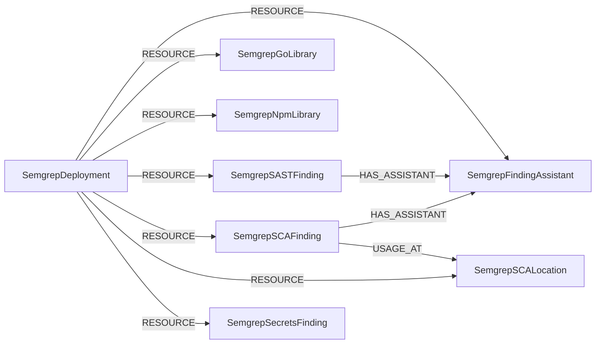

<!-- Generated from the data model. Do not edit manually. -->

## Semgrep Schema

### SemgrepDeployment

A Semgrep Cloud deployment containing an organization's security resources.

#### Properties

| Field | Index | Description |
|-------|-------|-------------|
| id | Yes | Unique integer identifier for the deployment. |
| firstseen |  | Timestamp when a sync job first created this node. |
| lastupdated | Yes | Timestamp of the last sync that observed this node. |
| name | Yes | Name of the security organization connected to the deployment. |
| slug | Yes | Lowercase deployment identifier used to query the Semgrep API. |

#### Relationships

- `(:SemgrepDeployment)-[:RESOURCE]->(:SemgrepFindingAssistant)`: Connects a Semgrep deployment to Assistant data generated for its findings.

- `(:SemgrepDeployment)-[:RESOURCE]->(:SemgrepGoLibrary)`: Connects a Semgrep deployment to one of its dependencies.

- `(:SemgrepDeployment)-[:RESOURCE]->(:SemgrepNpmLibrary)`: Connects a Semgrep deployment to one of its dependencies.

- `(:SemgrepDeployment)-[:RESOURCE]->(:SemgrepSASTFinding)`: Connects a Semgrep deployment to one of its SAST findings.

- `(:SemgrepDeployment)-[:RESOURCE]->(:SemgrepSCAFinding)`: Connects a Semgrep deployment to one of its SCA findings.

- `(:SemgrepDeployment)-[:RESOURCE]->(:SemgrepSCALocation)`: Connects a Semgrep deployment to one of its SCA usage locations.

- `(:SemgrepDeployment)-[:RESOURCE]->(:SemgrepSecretsFinding)`: Connects a Semgrep deployment to one of its secret findings.

### SemgrepFindingAssistant

AI-generated triage, remediation, and explanation data for a finding.

#### Properties

| Field | Index | Description |
|-------|-------|-------------|
| id | Yes | Identifier shared with the parent finding. |
| firstseen |  | Timestamp when a sync job first created this node. |
| lastupdated | Yes | Timestamp of the last sync that observed this node. |
| autofix_fix_code |  | AI-generated source code fix for the finding. |
| autotriage_reason |  | Reasoning supporting the AI triage verdict. |
| autotriage_verdict |  | AI recommendation to fix or ignore the finding. |
| component_risk |  | AI-assessed risk level of the affected component. |
| component_tag |  | AI-generated tag describing the matched code's purpose. |
| guidance_instructions |  | Step-by-step remediation instructions. |
| guidance_summary |  | Short summary explaining how to remediate the finding. |
| rule_explanation |  | Detailed explanation of the rule and its security impact. |
| rule_explanation_summary |  | Concise explanation of why the rule flagged the code. |

#### Relationships

- `(:SemgrepSASTFinding)-[:HAS_ASSISTANT]->(:SemgrepFindingAssistant)`: Links a cloud SAST finding to its Semgrep Assistant analysis.

- `(:SemgrepSCAFinding)-[:HAS_ASSISTANT]->(:SemgrepFindingAssistant)`: Links an SCA finding to its Semgrep Assistant analysis.

- `(:SemgrepDeployment)-[:RESOURCE]->(:SemgrepFindingAssistant)`: Connects a Semgrep deployment to Assistant data generated for its findings.

### SemgrepGoLibrary

A Go library dependency reported by Semgrep.

> **Additional Labels**: This node also uses `Dependency`, `GoLibrary`, `SemgrepDependency`.

> **Additional Label Definitions**:
>
> - `Dependency`: A node participating in the shared Dependency graph interface.
> - `GoLibrary`: Compatibility label for the deprecated `GoLibrary` semgrep node label. Use `SemgrepGoLibrary` instead. Scheduled for removal in v1.0.0.
> - `SemgrepDependency`: A semgrep node participating in the shared SemgrepDependency graph interface.

> **Ontology Projection**: `SemgrepGoLibrary` contributes data to canonical [`PackageVersion`](#ontology-packageversion) nodes.

#### Properties

| Field | Index | Description |
|-------|-------|-------------|
| id | Yes | Unique identifier formed from the dependency name and version. |
| firstseen |  | Timestamp when a sync job first created this node. |
| lastupdated | Yes | Timestamp of the last sync that observed this node. |
| ecosystem |  | Package ecosystem reported by Semgrep. |
| name |  | Dependency name. |
| normalized_id | Yes | Cross-tool package identifier used to create a canonical PackageVersion node. |
| type |  | Canonical package type derived from the ecosystem. |
| version |  | Dependency version. |

#### Relationships

- `(:GitHubRepository)-[:REQUIRES]->(:SemgrepGoLibrary)`: Links a GitHub repository to a dependency it requires.
  - Properties:

    | Field | Description |
    |-------|-------------|
    | specifier | Version specifier required by the repository. |
    | transitivity | Whether the dependency is direct or transitive. |
    | url | URL of the manifest location declaring the dependency. |

- `(:GitLabProject)-[:REQUIRES]->(:SemgrepGoLibrary)`: Links a GitLab project to a dependency it requires.
  - Properties:

    | Field | Description |
    |-------|-------------|
    | specifier | Version specifier required by the repository. |
    | transitivity | Whether the dependency is direct or transitive. |
    | url | URL of the manifest location declaring the dependency. |

- `(:SemgrepDeployment)-[:RESOURCE]->(:SemgrepGoLibrary)`: Connects a Semgrep deployment to one of its dependencies.

### SemgrepNpmLibrary

An npm library dependency reported by Semgrep.

> **Additional Labels**: This node also uses `Dependency`, `NpmLibrary`, `SemgrepDependency`.

> **Additional Label Definitions**:
>
> - `Dependency`: A node participating in the shared Dependency graph interface.
> - `NpmLibrary`: Compatibility label for the deprecated `NpmLibrary` semgrep node label. Use `SemgrepNpmLibrary` instead. Scheduled for removal in v1.0.0.
> - `SemgrepDependency`: A semgrep node participating in the shared SemgrepDependency graph interface.

> **Ontology Projection**: `SemgrepNpmLibrary` contributes data to canonical [`PackageVersion`](#ontology-packageversion) nodes.

#### Properties

| Field | Index | Description |
|-------|-------|-------------|
| id | Yes | Unique identifier formed from the dependency name and version. |
| firstseen |  | Timestamp when a sync job first created this node. |
| lastupdated | Yes | Timestamp of the last sync that observed this node. |
| ecosystem |  | Package ecosystem reported by Semgrep. |
| name |  | Dependency name. |
| normalized_id | Yes | Cross-tool package identifier used to create a canonical PackageVersion node. |
| type |  | Canonical package type derived from the ecosystem. |
| version |  | Dependency version. |

#### Relationships

- `(:GitHubRepository)-[:REQUIRES]->(:SemgrepNpmLibrary)`: Links a GitHub repository to a dependency it requires.
  - Properties:

    | Field | Description |
    |-------|-------------|
    | specifier | Version specifier required by the repository. |
    | transitivity | Whether the dependency is direct or transitive. |
    | url | URL of the manifest location declaring the dependency. |

- `(:GitLabProject)-[:REQUIRES]->(:SemgrepNpmLibrary)`: Links a GitLab project to a dependency it requires.
  - Properties:

    | Field | Description |
    |-------|-------------|
    | specifier | Version specifier required by the repository. |
    | transitivity | Whether the dependency is direct or transitive. |
    | url | URL of the manifest location declaring the dependency. |

- `(:SemgrepDeployment)-[:RESOURCE]->(:SemgrepNpmLibrary)`: Connects a Semgrep deployment to one of its dependencies.

### SemgrepSASTFinding

A code-level security issue reported by Semgrep Cloud or Semgrep OSS.

> **Ontology Mapping**: This node uses the ontology label [`SecurityIssue`](#ontology-securityissue).

#### Properties

Ontology-generated fields are shown in *italics*.

| Field | Index | Description |
|-------|-------|-------------|
| id | Yes | Unique finding identifier from Semgrep Cloud or synthesized for an OSS finding. |
| firstseen |  | Timestamp when a sync job first created this node. |
| lastupdated | Yes | Timestamp of the last sync that observed this node. |
| branch |  | Repository branch where the finding was discovered. |
| categories |  | Categories associated with the finding. |
| confidence |  | Confidence assigned to the finding. |
| cwe_names |  | CWE identifiers associated with the rule. |
| description |  | Description of the vulnerability from the rule message. |
| end_col |  | Column where the finding ends. |
| end_line |  | Line where the finding ends. |
| file_path | Yes | Path of the file where the finding was discovered. |
| fix_status |  | Cloud finding fix status based on triage. |
| line_of_code_url |  | URL of the affected line of code. Available for cloud findings. |
| opened_at |  | UTC date and time when the cloud finding was opened. |
| owasp_names |  | OWASP category names associated with the rule. |
| repository | Yes | Repository path where the finding was discovered. |
| repository_url |  | Full URL of the repository where the finding was discovered. |
| risk_severity |  | Property generated by analysis job: `Semgrep SAST findings risk analysis based on severity and repository archive status.`. |
| rule_id | Yes | Identifier of the rule that triggered the finding. |
| severity |  | Severity assigned to the finding. |
| start_col |  | Column where the finding starts. |
| start_line |  | Line where the finding starts. |
| state |  | Current cloud finding state. |
| title | Yes | Short title for the finding. |
| triage_status |  | Cloud finding triage status. |
| *_ont_first_seen* | Yes | Normalized field sourced from `opened_at`. |
| *_ont_severity* | Yes | Normalized field sourced from `severity`. |
| *_ont_source* |  | Module that populated this node's ontology fields. |
| *_ont_status* | Yes | Normalized field sourced from `state`. |
| *_ont_title* | Yes | Normalized field sourced from `title`. |

#### Relationships

- `(:SemgrepSASTFinding)-[:FOUND_IN]->(:GitHubRepository)`: Links a SAST finding to the GitHub repository containing the affected code.

- `(:SemgrepSASTFinding)-[:FOUND_IN]->(:GitLabProject)`: Links a SAST finding to the GitLab project containing the affected code.

- `(:SemgrepSASTFinding)-[:HAS_ASSISTANT]->(:SemgrepFindingAssistant)`: Links a cloud SAST finding to its Semgrep Assistant analysis.

- `(:SemgrepDeployment)-[:RESOURCE]->(:SemgrepSASTFinding)`: Connects a Semgrep deployment to one of its SAST findings.

### SemgrepSCAFinding

A dependency vulnerability discovered by Semgrep Supply Chain.

> **Conditional Labels**:
>
> - [`CVE`](#ontology-cve) (ontology label) when `has_cve` equals `true`. A cross-provider CVE resource in Cartography's ontology.
> - [`SecurityIssue`](#ontology-securityissue) (ontology label) when `has_cve` equals `false`. A cross-provider SecurityIssue resource in Cartography's ontology.

#### Properties

Ontology-generated fields are shown in *italics*.

| Field | Index | Description |
|-------|-------|-------------|
| id | Yes | Unique identifier for the finding from the Semgrep API. |
| firstseen |  | Timestamp when a sync job first created this node. |
| lastupdated | Yes | Timestamp of the last sync that observed this node. |
| branch |  | Repository branch where the finding was discovered. |
| confidence |  | Confidence assigned by Semgrep. |
| cve_id | Yes | CVE identifier associated with the vulnerability. |
| dependency |  | Affected dependency name and version. |
| dependency_file | Yes | Path of the dependency manifest containing the vulnerable package. |
| dependency_file_url | Yes | URL of the dependency manifest containing the vulnerable package. |
| dependency_fix |  | Closest dependency version that fixes the vulnerability. |
| description |  | Description of the dependency vulnerability. |
| fix_status |  | Fix status based on finding triage. |
| ghsa_id | Yes | GHSA advisory identifier when the finding is not CVE-backed. |
| has_cve |  | Whether cve_id contains a valid CVE identifier. |
| package_manager |  | Package ecosystem of the affected dependency. |
| reachability |  | Whether the vulnerable dependency is reachable. |
| reachability_check |  | Semgrep's determination of whether reachability was confirmed. |
| reachability_condition |  | Condition under which the vulnerable code is reachable. |
| reachability_risk |  | Property generated by analysis job: `Semgrep SCA findings reachability risk analysis based on likelihood and impact. Impact = Severity, Likelihood = reachability + reachability_check`. |
| ref_urls |  | Reference URLs associated with the finding. |
| repository | Yes | Repository path where the finding was discovered. |
| repository_url |  | Full URL of the repository where the finding was discovered. |
| rule_id | Yes | Identifier of the rule that triggered the finding. |
| scan_time |  | UTC date and time when the finding was discovered. |
| severity |  | Severity assigned by Semgrep. |
| summary | Yes | Short title summarizing the finding. |
| transitivity |  | Whether the affected dependency is direct or transitive. |
| triage_status |  | Current triage status of the finding. |
| *_ont_base_severity* | Yes | Normalized field sourced from `severity`. |
| *_ont_cve_id* | Yes | Normalized field sourced from `cve_id`. |
| *_ont_description* |  | Normalized field sourced from `description`. |
| *_ont_first_seen* | Yes | Normalized field sourced from `scan_time`. |
| *_ont_references* |  | Normalized field sourced from `ref_urls`. |
| *_ont_severity* | Yes | Normalized field sourced from `severity`. |
| *_ont_source* |  | Module that populated this node's ontology fields. |
| *_ont_status* | Yes | Normalized field sourced from `triage_status`. |
| *_ont_title* | Yes | Normalized field sourced from `summary`. |

#### Relationships

- `(:SemgrepSCAFinding)-[:AFFECTS]->(:Dependency)`: Links an SCA finding to the affected dependency observation.

- `(:SemgrepSCAFinding)-[:AFFECTS]->(:PackageVersion)`: generated by analysis job `Ontology - SemgrepSCAFinding AFFECTS PackageVersion linking`.

- `(:SemgrepSCAFinding)-[:FOUND_IN]->(:GitHubRepository)`: Links an SCA finding to the GitHub repository containing the dependency.

- `(:SemgrepSCAFinding)-[:FOUND_IN]->(:GitLabProject)`: Links an SCA finding to the GitLab project containing the dependency.

- `(:SemgrepSCAFinding)-[:HAS_ASSISTANT]->(:SemgrepFindingAssistant)`: Links an SCA finding to its Semgrep Assistant analysis.

- `(:CVE)-[:LINKED_TO]->(:SemgrepSCAFinding)`: Links a CVE to the Semgrep SCA finding that identified it.

- `(:SemgrepDeployment)-[:RESOURCE]->(:SemgrepSCAFinding)`: Connects a Semgrep deployment to one of its SCA findings.

- `(:SemgrepSCAFinding)-[:USAGE_AT]->(:SemgrepSCALocation)`: Links an SCA finding to a source location where the dependency is used.

### SemgrepSCALocation

A source location where vulnerable dependency code is used.

#### Properties

| Field | Index | Description |
|-------|-------|-------------|
| id | Yes | Unique identifier for the vulnerable dependency usage location. |
| firstseen |  | Timestamp when a sync job first created this node. |
| lastupdated | Yes | Timestamp of the last sync that observed this node. |
| end_col |  | Column where the usage ends. |
| end_line |  | Line where the usage ends. |
| path | Yes | Path of the file containing the vulnerable dependency usage. |
| start_col |  | Column where the usage starts. |
| start_line |  | Line where the usage starts. |
| url |  | URL of the file containing the usage. |

#### Relationships

- `(:SemgrepDeployment)-[:RESOURCE]->(:SemgrepSCALocation)`: Connects a Semgrep deployment to one of its SCA usage locations.

- `(:SemgrepSCAFinding)-[:USAGE_AT]->(:SemgrepSCALocation)`: Links an SCA finding to a source location where the dependency is used.

### SemgrepSecretsFinding

A hardcoded secret discovered by Semgrep in source code.

> **Ontology Mapping**: This node uses the ontology label [`SecurityIssue`](#ontology-securityissue).

#### Properties

Ontology-generated fields are shown in *italics*.

| Field | Index | Description |
|-------|-------|-------------|
| id | Yes | Unique identifier for the finding from the Semgrep API. |
| firstseen |  | Timestamp when a sync job first created this node. |
| lastupdated | Yes | Timestamp of the last sync that observed this node. |
| confidence |  | Confidence assigned to the finding. |
| created_at |  | UTC date and time when the finding was created. |
| finding_path | Yes | File path and line number where the secret was discovered. |
| finding_path_url |  | URL of the exact location where the secret was discovered. |
| mode |  | Semgrep mode under which the secret was detected. |
| ref |  | Branch or ref where the secret was discovered. |
| ref_url |  | URL of the branch or ref containing the secret. |
| repository_name | Yes | Repository path where the secret was discovered. |
| repository_scm_type |  | Source control system hosting the repository. |
| repository_url |  | Full URL of the repository where the secret was discovered. |
| repository_visibility |  | Visibility of the repository. |
| rule_hash_id | Yes | Hash identifier of the rule that triggered the finding. |
| severity | Yes | Severity assigned to the finding. |
| status | Yes | Current status of the finding. |
| type | Yes | Type of secret detected. |
| updated_at |  | UTC date and time when the finding was last updated. |
| validation_state | Yes | Result of validating whether the secret is active. |
| *_ont_first_seen* | Yes | Normalized field sourced from `created_at`. |
| *_ont_severity* | Yes | Normalized field sourced from `severity`. |
| *_ont_source* |  | Module that populated this node's ontology fields. |
| *_ont_status* | Yes | Normalized field sourced from `status`. |
| *_ont_title* | Yes | Normalized field sourced from `type`. |
| *_ont_type* | Yes | Normalized field sourced from `type`. |

#### Relationships

- `(:SemgrepSecretsFinding)-[:FOUND_IN]->(:GitHubRepository)`: Links a secret finding to the GitHub repository containing the secret.

- `(:SemgrepSecretsFinding)-[:FOUND_IN]->(:GitLabProject)`: Links a secret finding to the GitLab project containing the secret.

- `(:SemgrepDeployment)-[:RESOURCE]->(:SemgrepSecretsFinding)`: Connects a Semgrep deployment to one of its secret findings.
