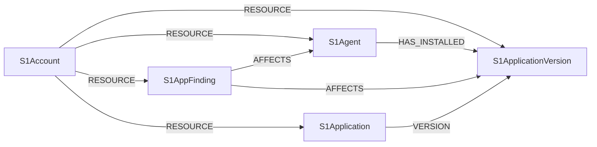

<!-- Generated from the data model. Do not edit manually. -->

## SentinelOne Schema

### S1Account

A top-level SentinelOne account.

> **Ontology Mapping**: This node uses the ontology label [`Tenant`](#ontology-tenant).

#### Properties

Ontology-generated fields are shown in *italics*.

| Field | Index | Description |
|-------|-------|-------------|
| id | Yes | SentinelOne account ID. |
| firstseen |  | Timestamp when a sync job first created this node. |
| lastupdated | Yes | Timestamp of the last sync that observed this node. |
| account_type |  | SentinelOne account type. |
| active_agents |  | Number of active agents in the account. |
| created_at |  | Account creation timestamp. |
| expiration |  | Account expiration timestamp. |
| name | Yes | SentinelOne account name. |
| number_of_sites |  | Number of sites in the account. |
| state |  | Current account state. |
| *_ont_name* | Yes | Normalized field sourced from `name`. |
| *_ont_source* |  | Module that populated this node's ontology fields. |
| *_ont_status* | Yes | Normalized field sourced from `state`. |

#### Relationships

- `(:S1Account)-[:RESOURCE]->(:S1Agent)`: Links a SentinelOne account to one of its agents.

- `(:S1Account)-[:RESOURCE]->(:S1AppFinding)`: Links a SentinelOne account to one of its application findings.

- `(:S1Account)-[:RESOURCE]->(:S1Application)`: Links a SentinelOne account to an application in its inventory.

- `(:S1Account)-[:RESOURCE]->(:S1ApplicationVersion)`: Links a SentinelOne account to an application version in its inventory.

### S1Agent

A SentinelOne agent installed on an endpoint device.

> **Ontology Projection**: `S1Agent` contributes data to canonical [`Device`](#ontology-device) nodes.

#### Properties

| Field | Index | Description |
|-------|-------|-------------|
| id | Yes | SentinelOne agent ID. |
| firstseen |  | Timestamp when a sync job first created this node. |
| lastupdated | Yes | Timestamp of the last sync that observed this node. |
| computer_name | Yes | Endpoint computer name. |
| domain |  | Domain joined by the endpoint. |
| firewall_enabled |  | Whether the endpoint firewall is enabled. |
| last_active |  | Timestamp of the agent's last activity. |
| last_successful_scan |  | Timestamp of the agent's last successful scan. |
| local_ips |  | Local IP addresses reported for the endpoint. |
| os_name |  | Endpoint operating system name. |
| os_revision |  | Endpoint operating system revision. |
| public_ip | Yes | Public IP address reported for the endpoint. |
| scan_status |  | Status of the agent's latest scan. |
| serial_number | Yes | Endpoint serial number. |
| uuid | Yes | SentinelOne agent UUID. |

#### Relationships

- `(:S1AppFinding)-[:AFFECTS]->(:S1Agent)`: Links a finding to the endpoint agent it affects.

- `(:S1Agent)-[:HAS_INSTALLED]->(:S1ApplicationVersion)`: Links an agent to an application version installed on its endpoint.
  - Properties:

    | Field | Description |
    |-------|-------------|
    | installationpath | File system path where the application version is installed. |
    | installeddatetime | Timestamp when the application version was installed. |

- `(:Device)-[:OBSERVED_AS]->(:S1Agent)`: Links a canonical device to its SentinelOne agent, matched on hostname when no serial number is available. Links a canonical device to its SentinelOne agent, matched on serial number.

- `(:S1Account)-[:RESOURCE]->(:S1Agent)`: Links a SentinelOne account to one of its agents.

### S1AppFinding

A vulnerability finding for software on a SentinelOne endpoint.

> **Ontology Mapping**: This node uses the ontology label [`CVE`](#ontology-cve).

> **Additional Labels**: This node also uses `Risk`, `S1Finding`.

> **Additional Label Definitions**:
>
> - `Risk`: A node participating in the shared Risk graph interface.
> - `S1Finding`: A sentinelone node participating in the shared S1Finding graph interface.

#### Properties

Ontology-generated fields are shown in *italics*.

| Field | Index | Description |
|-------|-------|-------------|
| id | Yes | SentinelOne application vulnerability finding ID. |
| firstseen |  | Timestamp when a sync job first created this node. |
| lastupdated | Yes | Timestamp of the last sync that observed this node. |
| cve_id | Yes | CVE identifier associated with the finding. |
| days_detected |  | Number of days since the vulnerability was detected. |
| detection_date |  | Vulnerability detection timestamp. |
| last_scan_date |  | Timestamp of the latest vulnerability scan. |
| last_scan_result |  | Result of the latest vulnerability scan. |
| mark_type_description |  | Description of the mark applied to the finding. |
| marked_by |  | User who marked the finding. |
| marked_date |  | Timestamp when the finding was marked. |
| mitigation_status |  | Current mitigation status. |
| mitigation_status_change_time |  | Timestamp of the latest mitigation status change. |
| mitigation_status_changed_by |  | User who last changed the mitigation status. |
| mitigation_status_reason |  | Reason for the mitigation status. |
| reason |  | Reason recorded for the finding. |
| remediation_level |  | Required remediation level. |
| report_confidence |  | Confidence level of the finding report. |
| risk_score |  | SentinelOne risk score. |
| severity |  | Finding severity. |
| status |  | Current finding status. |
| *_ont_base_severity* | Yes | Normalized field sourced from `severity`. |
| *_ont_cve_id* | Yes | Normalized field sourced from `cve_id`. |
| *_ont_source* |  | Module that populated this node's ontology fields. |

#### Relationships

- `(:S1AppFinding)-[:AFFECTS]->(:Device)`: Links a SentinelOne finding to the canonical device it affects.

- `(:S1AppFinding)-[:AFFECTS]->(:S1Agent)`: Links a finding to the endpoint agent it affects.

- `(:S1AppFinding)-[:AFFECTS]->(:S1ApplicationVersion)`: Links a finding to the application version it affects.

- `(:S1AppFinding)-[:LINKED_TO]->(:CVE)`: Links a SentinelOne finding to its generic CVE definition.

- `(:S1Account)-[:RESOURCE]->(:S1AppFinding)`: Links a SentinelOne account to one of its application findings.

### S1Application

An application observed in SentinelOne inventory.

#### Properties

| Field | Index | Description |
|-------|-------|-------------|
| id | Yes | Normalized vendor and application name. |
| firstseen |  | Timestamp when a sync job first created this node. |
| lastupdated | Yes | Timestamp of the last sync that observed this node. |
| name |  | Application name. |
| vendor |  | Application vendor. |

#### Relationships

- `(:S1Account)-[:RESOURCE]->(:S1Application)`: Links a SentinelOne account to an application in its inventory.

- `(:S1Application)-[:VERSION]->(:S1ApplicationVersion)`: Links an application to one of its observed versions.

### S1ApplicationVersion

A specific application version observed by SentinelOne.

#### Properties

| Field | Index | Description |
|-------|-------|-------------|
| id | Yes | Normalized vendor, application name, and version. |
| firstseen |  | Timestamp when a sync job first created this node. |
| lastupdated | Yes | Timestamp of the last sync that observed this node. |
| application_name |  | Application name. |
| application_vendor |  | Application vendor. |
| version |  | Application version. |

#### Relationships

- `(:S1AppFinding)-[:AFFECTS]->(:S1ApplicationVersion)`: Links a finding to the application version it affects.

- `(:S1Agent)-[:HAS_INSTALLED]->(:S1ApplicationVersion)`: Links an agent to an application version installed on its endpoint.
  - Properties:

    | Field | Description |
    |-------|-------------|
    | installationpath | File system path where the application version is installed. |
    | installeddatetime | Timestamp when the application version was installed. |

- `(:S1Account)-[:RESOURCE]->(:S1ApplicationVersion)`: Links a SentinelOne account to an application version in its inventory.

- `(:S1Application)-[:VERSION]->(:S1ApplicationVersion)`: Links an application to one of its observed versions.
