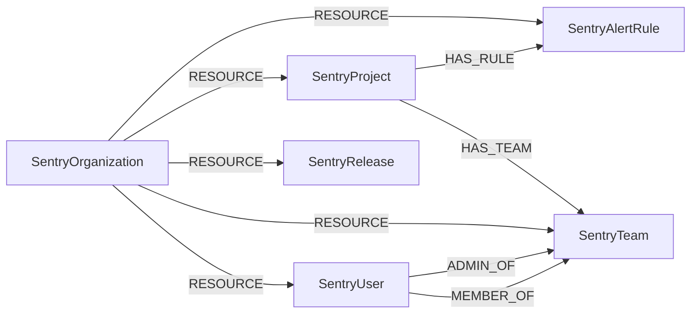

<!-- Generated from the data model. Do not edit manually. -->

## Sentry Schema

### SentryAlertRule

An issue alert rule configured on a Sentry project.

#### Properties

| Field | Index | Description |
|-------|-------|-------------|
| id | Yes | Sentry alert rule ID. |
| firstseen |  | Timestamp when a sync job first created this node. |
| lastupdated | Yes | Timestamp of the last sync that observed this node. |
| action_match |  | Action matching logic: all, any, or none. |
| date_created |  | ISO 8601 timestamp when the alert rule was created. |
| environment |  | Environment to which the rule applies. |
| filter_match |  | Filter matching logic: all, any, or none. |
| frequency |  | Throttle interval in seconds. |
| name |  | Alert rule name. |
| project_slug |  | Slug of the project containing the rule. |
| status |  | Alert rule status. |

#### Relationships

- `(:SentryProject)-[:HAS_RULE]->(:SentryAlertRule)`: The project has the alert rule.

- `(:SentryOrganization)-[:RESOURCE]->(:SentryAlertRule)`: The organization contains the alert rule for scoped cleanup.

### SentryOrganization

A Sentry organization.

> **Ontology Mapping**: This node uses the ontology label [`Tenant`](#ontology-tenant).

#### Properties

Ontology-generated fields are shown in *italics*.

| Field | Index | Description |
|-------|-------|-------------|
| id | Yes | Sentry organization ID. |
| firstseen |  | Timestamp when a sync job first created this node. |
| lastupdated | Yes | Timestamp of the last sync that observed this node. |
| date_created |  | ISO 8601 timestamp when the organization was created. |
| is_early_adopter |  | Whether the organization is an early adopter. |
| name |  | Organization name. |
| require_2fa | Yes | Whether the organization requires two-factor authentication. |
| slug | Yes | URL-friendly organization identifier. |
| status |  | Current organization status. |
| *_ont_name* | Yes | Normalized field sourced from `name`. |
| *_ont_source* |  | Module that populated this node's ontology fields. |
| *_ont_status* | Yes | Normalized field sourced from `status`. |

#### Relationships

- `(:SentryOrganization)-[:RESOURCE]->(:SentryAlertRule)`: The organization contains the alert rule for scoped cleanup.

- `(:SentryOrganization)-[:RESOURCE]->(:SentryProject)`: The organization contains the project.

- `(:SentryOrganization)-[:RESOURCE]->(:SentryRelease)`: The organization contains the release.

- `(:SentryOrganization)-[:RESOURCE]->(:SentryTeam)`: The organization contains the team.

- `(:SentryOrganization)-[:RESOURCE]->(:SentryUser)`: The organization contains the user.

### SentryProject

A project in a Sentry organization.

#### Properties

| Field | Index | Description |
|-------|-------|-------------|
| id | Yes | Sentry project ID. |
| firstseen |  | Timestamp when a sync job first created this node. |
| lastupdated | Yes | Timestamp of the last sync that observed this node. |
| date_created |  | ISO 8601 timestamp when the project was created. |
| first_event |  | ISO 8601 timestamp when the first event was received. |
| name |  | Project name. |
| platform |  | Primary project platform. |
| slug | Yes | URL-friendly project identifier. |

#### Relationships

- `(:SentryProject)-[:HAS_RULE]->(:SentryAlertRule)`: The project has the alert rule.

- `(:SentryProject)-[:HAS_TEAM]->(:SentryTeam)`: The project is assigned to the team.

- `(:SentryOrganization)-[:RESOURCE]->(:SentryProject)`: The organization contains the project.

### SentryRelease

A release in a Sentry organization.

#### Properties

| Field | Index | Description |
|-------|-------|-------------|
| id | Yes | Organization-scoped release version ID. |
| firstseen |  | Timestamp when a sync job first created this node. |
| lastupdated | Yes | Timestamp of the last sync that observed this node. |
| commit_count |  | Number of commits in the release. |
| date_created |  | ISO 8601 timestamp when the release was created. |
| date_released |  | ISO 8601 timestamp when the release was published. |
| deploy_count |  | Number of deployments for the release. |
| new_groups |  | Number of new issues introduced by the release. |
| ref |  | Git reference associated with the release. |
| short_version |  | Abbreviated release version. |
| url |  | URL associated with the release. |
| version | Yes | Full release version identifier. |

#### Relationships

- `(:SentryOrganization)-[:RESOURCE]->(:SentryRelease)`: The organization contains the release.

### SentryTeam

A team within a Sentry organization.

> **Ontology Mapping**: This node uses the ontology label [`UserGroup`](#ontology-usergroup).

#### Properties

Ontology-generated fields are shown in *italics*.

| Field | Index | Description |
|-------|-------|-------------|
| id | Yes | Sentry team ID. |
| firstseen |  | Timestamp when a sync job first created this node. |
| lastupdated | Yes | Timestamp of the last sync that observed this node. |
| date_created |  | ISO 8601 timestamp when the team was created. |
| member_count |  | Number of members in the team. |
| name |  | Team name. |
| slug | Yes | URL-friendly team identifier. |
| *_ont_name* | Yes | Normalized field sourced from `name`. |
| *_ont_source* |  | Module that populated this node's ontology fields. |

#### Relationships

- `(:SentryUser)-[:ADMIN_OF]->(:SentryTeam)`: The user is an administrator of the team.

- `(:SentryProject)-[:HAS_TEAM]->(:SentryTeam)`: The project is assigned to the team.

- `(:SentryUser)-[:MEMBER_OF]->(:SentryTeam)`: The user is a member of the team.

- `(:SentryOrganization)-[:RESOURCE]->(:SentryTeam)`: The organization contains the team.

### SentryUser

A member of a Sentry organization.

> **Ontology Mapping**: This node uses the ontology label [`UserAccount`](#ontology-useraccount).

#### Properties

Ontology-generated fields are shown in *italics*.

| Field | Index | Description |
|-------|-------|-------------|
| id | Yes | Sentry membership ID. |
| firstseen |  | Timestamp when a sync job first created this node. |
| lastupdated | Yes | Timestamp of the last sync that observed this node. |
| date_created |  | ISO 8601 timestamp when the membership was created. |
| email | Yes | Member email address. |
| expired |  | Whether the invitation has expired. |
| has_2fa |  | Whether the user has two-factor authentication enabled. |
| name |  | Member display name. |
| pending |  | Whether the invitation is pending. |
| role |  | Organization role, such as admin, member, or owner. |
| *_ont_active* | Yes | Normalized field sourced from `pending`. |
| *_ont_email* | Yes | Normalized field sourced from `email`. |
| *_ont_fullname* | Yes | Normalized field sourced from `name`. |
| *_ont_has_mfa* | Yes | Normalized field sourced from `has_2fa`. |
| *_ont_source* |  | Module that populated this node's ontology fields. |

#### Relationships

- `(:SentryUser)-[:ADMIN_OF]->(:SentryTeam)`: The user is an administrator of the team.

- `(:User)-[:HAS_ACCOUNT]->(:SentryUser)`

- `(:SentryUser)-[:MEMBER_OF]->(:SentryTeam)`: The user is a member of the team.

- `(:SentryOrganization)-[:RESOURCE]->(:SentryUser)`: The organization contains the user.
