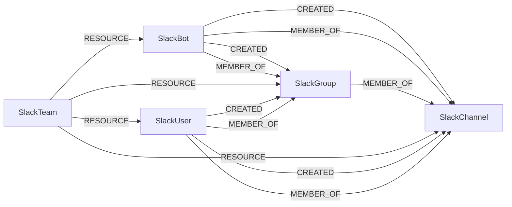

<!-- Generated from the data model. Do not edit manually. -->

## Slack Schema

### SlackBot

A Slack bot with ThirdPartyApp and compatibility SlackUser labels.

> **Ontology Mapping**: This node uses the ontology label [`ThirdPartyApp`](#ontology-thirdpartyapp).

> **Additional Labels**: This node also uses `SlackUser`.

> **Additional Label Definitions**:
>
> - `SlackUser`: A slack node participating in the shared SlackUser graph interface.

#### Properties

Ontology-generated fields are shown in *italics*.

| Field | Index | Description |
|-------|-------|-------------|
| id | Yes | Slack bot ID. |
| firstseen |  | Timestamp when a sync job first created this node. |
| lastupdated | Yes | Timestamp of the last sync that observed this node. |
| deleted |  | Whether the bot is deleted. |
| is_app_user |  | Whether the bot is an application user. |
| is_bot |  | Whether the account is a bot. |
| name | Yes | Slack bot name. |
| real_name |  | Bot display name. |
| *_ont_client_id* | Yes | Normalized field sourced from `id`. |
| *_ont_enabled* | Yes | Normalized field sourced from `deleted`. |
| *_ont_name* | Yes | Normalized field sourced from `name`. |
| *_ont_source* |  | Module that populated this node's ontology fields. |

#### Relationships

- `(:User)-[:AUTHORIZED]->(:SlackBot)`: generated by analysis job `Ontology - User AUTHORIZED ThirdPartyApp linking`.
  - Properties:

    | Field | Description |
    |-------|-------------|
    | scopes | Property generated by analysis job: `Ontology - User AUTHORIZED ThirdPartyApp linking`. |

- `(:SlackBot)-[:CREATED]->(:SlackChannel)`: A Slack bot created a channel.

- `(:SlackBot)-[:CREATED]->(:SlackGroup)`: A Slack bot created a user group.

- `(:SlackBot)-[:MEMBER_OF]->(:SlackChannel)`: A Slack bot is a member of a channel.

- `(:SlackBot)-[:MEMBER_OF]->(:SlackGroup)`: A Slack bot is a member of a user group.

- `(:SlackTeam)-[:RESOURCE]->(:SlackBot)`: A Slack workspace contains a bot account.

### SlackChannel

A channel in a Slack workspace.

#### Properties

| Field | Index | Description |
|-------|-------|-------------|
| id | Yes | Slack channel ID. |
| firstseen |  | Timestamp when a sync job first created this node. |
| lastupdated | Yes | Timestamp of the last sync that observed this node. |
| created |  | Channel creation timestamp. |
| is_archived |  | Whether the channel is archived. |
| is_general |  | Whether this is the workspace's general channel. |
| is_org_shared |  | Whether the channel is shared across an organization. |
| is_private |  | Whether the channel is private. |
| is_shared |  | Whether the channel is shared across workspaces. |
| name | Yes | Slack channel name. |
| num_members |  | Number of channel members. |
| purpose |  | Channel purpose. |
| topic |  | Channel topic. |

#### Relationships

- `(:SlackBot)-[:CREATED]->(:SlackChannel)`: A Slack bot created a channel.

- `(:SlackUser)-[:CREATED]->(:SlackChannel)`: A SlackUser-labeled account created a channel.

- `(:SlackBot)-[:MEMBER_OF]->(:SlackChannel)`: A Slack bot is a member of a channel.

- `(:SlackGroup)-[:MEMBER_OF]->(:SlackChannel)`: A Slack user group is a member of a channel.

- `(:SlackUser)-[:MEMBER_OF]->(:SlackChannel)`: A SlackUser-labeled account is a member of a channel.

- `(:SlackTeam)-[:RESOURCE]->(:SlackChannel)`: A Slack workspace contains a channel.

### SlackGroup

A Slack user group with the canonical UserGroup label.

> **Ontology Mapping**: This node uses the ontology label [`UserGroup`](#ontology-usergroup).

#### Properties

Ontology-generated fields are shown in *italics*.

| Field | Index | Description |
|-------|-------|-------------|
| id | Yes | Slack user group ID. |
| firstseen |  | Timestamp when a sync job first created this node. |
| lastupdated | Yes | Timestamp of the last sync that observed this node. |
| channel_count |  | Number of channels linked to the user group. |
| created_by |  | ID of the account that created the user group. |
| date_create |  | User group creation timestamp. |
| date_delete |  | User group deletion timestamp. |
| date_update |  | User group update timestamp. |
| description |  | User group description. |
| handle |  | User group mention handle. |
| is_external |  | Whether the user group is external. |
| is_subteam |  | Whether this is a subteam. |
| name | Yes | Slack user group name. |
| updated_by |  | ID of the account that last updated the user group. |
| user_count |  | Number of user group members. |
| *_ont_description* |  | Normalized field sourced from `description`. |
| *_ont_name* | Yes | Normalized field sourced from `name`. |
| *_ont_source* |  | Module that populated this node's ontology fields. |

#### Relationships

- `(:SlackBot)-[:CREATED]->(:SlackGroup)`: A Slack bot created a user group.

- `(:SlackUser)-[:CREATED]->(:SlackGroup)`: A SlackUser-labeled account created a user group.

- `(:SlackBot)-[:MEMBER_OF]->(:SlackGroup)`: A Slack bot is a member of a user group.

- `(:SlackGroup)-[:MEMBER_OF]->(:SlackChannel)`: A Slack user group is a member of a channel.

- `(:SlackUser)-[:MEMBER_OF]->(:SlackGroup)`: A SlackUser-labeled account is a member of a user group.

- `(:SlackTeam)-[:RESOURCE]->(:SlackGroup)`: A Slack workspace contains a user group.

### SlackTeam

A Slack workspace with the canonical Tenant label.

> **Ontology Mapping**: This node uses the ontology label [`Tenant`](#ontology-tenant).

#### Properties

Ontology-generated fields are shown in *italics*.

| Field | Index | Description |
|-------|-------|-------------|
| id | Yes | Slack workspace ID. |
| firstseen |  | Timestamp when a sync job first created this node. |
| lastupdated | Yes | Timestamp of the last sync that observed this node. |
| domain |  | Slack workspace domain. |
| email_domain |  | Email domain associated with the workspace. |
| is_verified |  | Whether the workspace is verified. |
| name | Yes | Slack workspace name. |
| url |  | Slack workspace URL. |
| *_ont_domain* | Yes | Normalized field sourced from `domain`. |
| *_ont_name* | Yes | Normalized field sourced from `name`. |
| *_ont_source* |  | Module that populated this node's ontology fields. |

#### Relationships

- `(:SlackTeam)-[:RESOURCE]->(:SlackBot)`: A Slack workspace contains a bot account.

- `(:SlackTeam)-[:RESOURCE]->(:SlackChannel)`: A Slack workspace contains a channel.

- `(:SlackTeam)-[:RESOURCE]->(:SlackGroup)`: A Slack workspace contains a user group.

- `(:SlackTeam)-[:RESOURCE]->(:SlackUser)`: A Slack workspace contains a user account.

### SlackUser

A Slack user account with the canonical UserAccount label.

> **Ontology Mapping**: This node uses the ontology label [`UserAccount`](#ontology-useraccount).

#### Properties

Ontology-generated fields are shown in *italics*.

| Field | Index | Description |
|-------|-------|-------------|
| id | Yes | Slack user ID. |
| firstseen |  | Timestamp when a sync job first created this node. |
| lastupdated | Yes | Timestamp of the last sync that observed this node. |
| deleted |  | Whether the user is deleted. |
| display_name |  | User's display name. |
| email | Yes | User's email address. |
| first_name |  | User's first name. |
| has_mfa |  | Whether multi-factor authentication is enabled. |
| is_admin |  | Whether the user is a workspace administrator. |
| is_email_confirmed |  | Whether the user's email is confirmed. |
| is_owner |  | Whether the user is a workspace owner. |
| is_restricted |  | Whether the user is a restricted guest. |
| is_ultra_restricted |  | Whether the user is an ultra-restricted guest. |
| last_name |  | User's last name. |
| name | Yes | Slack username. |
| profile_phone |  | User's profile phone number. |
| profile_title |  | User's profile title. |
| real_name |  | User's full name. |
| team |  | ID of the user's Slack workspace. |
| *_ont_email* | Yes | Normalized field sourced from `email`. |
| *_ont_firstname* | Yes | Normalized field sourced from `first_name`. |
| *_ont_fullname* | Yes | Normalized field sourced from `real_name`. |
| *_ont_has_mfa* | Yes | Normalized field sourced from `has_mfa`. |
| *_ont_inactive* | Yes | Normalized field sourced from `deleted`. |
| *_ont_lastname* | Yes | Normalized field sourced from `last_name`. |
| *_ont_source* |  | Module that populated this node's ontology fields. |
| *_ont_username* | Yes | Normalized field sourced from `name`. |

#### Relationships

- `(:SlackUser)-[:CREATED]->(:SlackChannel)`: A SlackUser-labeled account created a channel.

- `(:SlackUser)-[:CREATED]->(:SlackGroup)`: A SlackUser-labeled account created a user group.

- `(:User)-[:HAS_ACCOUNT]->(:SlackUser)`

- `(:SlackUser)-[:MEMBER_OF]->(:SlackChannel)`: A SlackUser-labeled account is a member of a channel.

- `(:SlackUser)-[:MEMBER_OF]->(:SlackGroup)`: A SlackUser-labeled account is a member of a user group.

- `(:SlackTeam)-[:RESOURCE]->(:SlackUser)`: A Slack workspace contains a user account.
