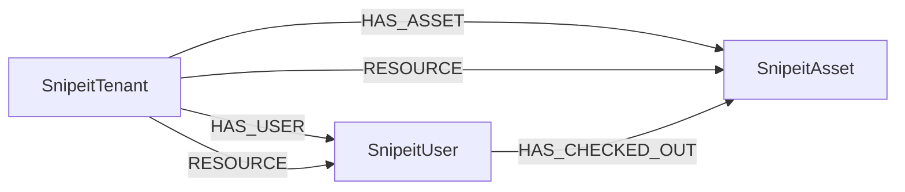

<!-- Generated from the data model. Do not edit manually. -->

## Snipeit Schema

### SnipeitAsset

A device asset managed by Snipe-IT.

> **Ontology Projection**: `SnipeitAsset` contributes data to canonical [`Device`](#ontology-device) nodes.

#### Properties

| Field | Index | Description |
|-------|-------|-------------|
| id | Yes | Asset ID. |
| firstseen |  | Timestamp when a sync job first created this node. |
| lastupdated | Yes | Timestamp of the last sync that observed this node. |
| asset_tag |  | Asset tag. |
| assigned_to |  | Email of the user who checked out the asset. |
| category |  | Asset category. |
| company |  | Company that owns the asset. |
| manufacturer |  | Asset manufacturer. |
| model |  | Device model. |
| name | Yes | Device name. |
| serial | Yes | Asset serial number. |
| status |  | Asset status label. |

#### Relationships

- `(:SnipeitTenant)-[:HAS_ASSET]->(:SnipeitAsset)`: Deprecated compatibility edge linking a tenant to its asset.

- `(:SnipeitUser)-[:HAS_CHECKED_OUT]->(:SnipeitAsset)`: A user has checked out the asset.

- `(:Device)-[:OBSERVED_AS]->(:SnipeitAsset)`

- `(:SnipeitTenant)-[:RESOURCE]->(:SnipeitAsset)`: The tenant contains the asset.

### SnipeitTenant

A Snipe-IT tenant containing users and assets.

> **Ontology Mapping**: This node uses the ontology label [`Tenant`](#ontology-tenant).

#### Properties

| Field | Index | Description |
|-------|-------|-------------|
| id | Yes | Snipe-IT tenant ID. |
| firstseen |  | Timestamp when a sync job first created this node. |
| lastupdated | Yes | Timestamp of the last sync that observed this node. |

#### Relationships

- `(:SnipeitTenant)-[:HAS_ASSET]->(:SnipeitAsset)`: Deprecated compatibility edge linking a tenant to its asset.

- `(:SnipeitTenant)-[:HAS_USER]->(:SnipeitUser)`: Deprecated compatibility edge linking a tenant to its user.

- `(:SnipeitTenant)-[:RESOURCE]->(:SnipeitAsset)`: The tenant contains the asset.

- `(:SnipeitTenant)-[:RESOURCE]->(:SnipeitUser)`: The tenant contains the user.

### SnipeitUser

A user account managed by Snipe-IT.

> **Ontology Mapping**: This node uses the ontology label [`UserAccount`](#ontology-useraccount).

#### Properties

Ontology-generated fields are shown in *italics*.

| Field | Index | Description |
|-------|-------|-------------|
| id | Yes | Snipe-IT user ID. |
| firstseen |  | Timestamp when a sync job first created this node. |
| lastupdated | Yes | Timestamp of the last sync that observed this node. |
| company | Yes | Company linked to the user. |
| email | Yes | Email address. |
| username |  | Username. |
| *_ont_email* | Yes | Normalized field sourced from `email`. |
| *_ont_source* |  | Module that populated this node's ontology fields. |
| *_ont_username* | Yes | Normalized field sourced from `username`. |

#### Relationships

- `(:User)-[:HAS_ACCOUNT]->(:SnipeitUser)`

- `(:SnipeitUser)-[:HAS_CHECKED_OUT]->(:SnipeitAsset)`: A user has checked out the asset.

- `(:SnipeitTenant)-[:HAS_USER]->(:SnipeitUser)`: Deprecated compatibility edge linking a tenant to its user.

- `(:SnipeitTenant)-[:RESOURCE]->(:SnipeitUser)`: The tenant contains the user.
