<!-- Generated from the data model. Do not edit manually. -->

## Snowflake Schema

```mermaid
graph LR
    SnowflakeAccount -- GOVERNED_BY --> SnowflakeNetworkPolicy
    SnowflakeAccount -- RESOURCE --> SnowflakeAccountParameter
    SnowflakeAccount -- RESOURCE --> SnowflakeAlert
    SnowflakeAccount -- RESOURCE --> SnowflakeApiIntegration
    SnowflakeAccount -- RESOURCE --> SnowflakeArtifactRepository
    SnowflakeAccount -- RESOURCE --> SnowflakeAuthenticationPolicy
    SnowflakeAccount -- RESOURCE --> SnowflakeCatalogIntegration
    SnowflakeAccount -- RESOURCE --> SnowflakeComputePool
    SnowflakeAccount -- RESOURCE --> SnowflakeCortexSearchService
    SnowflakeAccount -- RESOURCE --> SnowflakeCredential
    SnowflakeAccount -- RESOURCE --> SnowflakeDataPolicy
    SnowflakeAccount -- RESOURCE --> SnowflakeDatabase
    SnowflakeAccount -- RESOURCE --> SnowflakeDatabaseRole
    SnowflakeAccount -- RESOURCE --> SnowflakeDynamicTable
    SnowflakeAccount -- RESOURCE --> SnowflakeEventTable
    SnowflakeAccount -- RESOURCE --> SnowflakeExternalAccessIntegration
    SnowflakeAccount -- RESOURCE --> SnowflakeExternalTable
    SnowflakeAccount -- RESOURCE --> SnowflakeExternalVolume
    SnowflakeAccount -- RESOURCE --> SnowflakeExternalVolumeStorageLocation
    SnowflakeAccount -- RESOURCE --> SnowflakeFailoverGroup
    SnowflakeAccount -- RESOURCE --> SnowflakeFileFormat
    SnowflakeAccount -- RESOURCE --> SnowflakeFunction
    SnowflakeAccount -- RESOURCE --> SnowflakeIcebergTable
    SnowflakeAccount -- RESOURCE --> SnowflakeImage
    SnowflakeAccount -- RESOURCE --> SnowflakeImageRepository
    SnowflakeAccount -- RESOURCE --> SnowflakeListing
    SnowflakeAccount -- RESOURCE --> SnowflakeManagedAccount
    SnowflakeAccount -- RESOURCE --> SnowflakeMaterializedView
    SnowflakeAccount -- RESOURCE --> SnowflakeNetworkPolicy
    SnowflakeAccount -- RESOURCE --> SnowflakeNetworkRule
    SnowflakeAccount -- RESOURCE --> SnowflakeNotebook
    SnowflakeAccount -- RESOURCE --> SnowflakeNotificationIntegration
    SnowflakeAccount -- RESOURCE --> SnowflakePasswordPolicy
    SnowflakeAccount -- RESOURCE --> SnowflakePipe
    SnowflakeAccount -- RESOURCE --> SnowflakeProcedure
    SnowflakeAccount -- RESOURCE --> SnowflakeProgrammaticAccessToken
    SnowflakeAccount -- RESOURCE --> SnowflakeReplicationGroup
    SnowflakeAccount -- RESOURCE --> SnowflakeResourceMonitor
    SnowflakeAccount -- RESOURCE --> SnowflakeRole
    SnowflakeAccount -- RESOURCE --> SnowflakeSchema
    SnowflakeAccount -- RESOURCE --> SnowflakeSecret
    SnowflakeAccount -- RESOURCE --> SnowflakeSecurityIntegration
    SnowflakeAccount -- RESOURCE --> SnowflakeSequence
    SnowflakeAccount -- RESOURCE --> SnowflakeService
    SnowflakeAccount -- RESOURCE --> SnowflakeServiceContainer
    SnowflakeAccount -- RESOURCE --> SnowflakeServiceEndpoint
    SnowflakeAccount -- RESOURCE --> SnowflakeServiceRole
    SnowflakeAccount -- RESOURCE --> SnowflakeServiceUser
    SnowflakeAccount -- RESOURCE --> SnowflakeSessionPolicy
    SnowflakeAccount -- RESOURCE --> SnowflakeShare
    SnowflakeAccount -- RESOURCE --> SnowflakeStage
    SnowflakeAccount -- RESOURCE --> SnowflakeStorageIntegration
    SnowflakeAccount -- RESOURCE --> SnowflakeStream
    SnowflakeAccount -- RESOURCE --> SnowflakeStreamlit
    SnowflakeAccount -- RESOURCE --> SnowflakeTable
    SnowflakeAccount -- RESOURCE --> SnowflakeTag
    SnowflakeAccount -- RESOURCE --> SnowflakeTask
    SnowflakeAccount -- RESOURCE --> SnowflakeUser
    SnowflakeAccount -- RESOURCE --> SnowflakeView
    SnowflakeAccount -- RESOURCE --> SnowflakeWarehouse
    SnowflakeAlert -- USES_WAREHOUSE --> SnowflakeWarehouse
    SnowflakeArtifactRepository -- USES_INTEGRATION --> SnowflakeApiIntegration
    SnowflakeCortexSearchService -- READS_FROM --> SnowflakeTable
    SnowflakeCortexSearchService -- USES_WAREHOUSE --> SnowflakeWarehouse
    SnowflakeCredential -- OWNED_BY --> SnowflakeServiceUser
    SnowflakeCredential -- OWNED_BY --> SnowflakeUser
    SnowflakeDatabase -- CONTAINS --> SnowflakeDatabaseRole
    SnowflakeDatabase -- CONTAINS --> SnowflakeSchema
    SnowflakeDatabase -- CREATED_FROM_SHARE --> SnowflakeShare
    SnowflakeDatabaseRole -- INCLUDES --> SnowflakeDatabaseRole
    SnowflakeDynamicTable -- USES_WAREHOUSE --> SnowflakeWarehouse
    SnowflakeExternalAccessIntegration -- ALLOWS --> SnowflakeNetworkRule
    SnowflakeExternalAccessIntegration -- ALLOWS_AUTH_INTEGRATION --> SnowflakeSecurityIntegration
    SnowflakeExternalAccessIntegration -- ALLOWS_SECRET --> SnowflakeSecret
    SnowflakeExternalTable -- READS_FROM --> SnowflakeStage
    SnowflakeExternalTable -- USES_FILE_FORMAT --> SnowflakeFileFormat
    SnowflakeExternalVolume -- HAS_STORAGE_LOCATION --> SnowflakeExternalVolumeStorageLocation
    SnowflakeFailoverGroup -- REPLICATES --> SnowflakeDatabase
    SnowflakeFailoverGroup -- REPLICATES_TO --> SnowflakeAccount
    SnowflakeFunction -- USES_INTEGRATION --> SnowflakeApiIntegration
    SnowflakeFunction -- USES_INTEGRATION --> SnowflakeExternalAccessIntegration
    SnowflakeFunction -- USES_SECRET --> SnowflakeSecret
    SnowflakeIcebergTable -- STORED_IN --> SnowflakeExternalVolume
    SnowflakeIcebergTable -- USES_CATALOG --> SnowflakeCatalogIntegration
    SnowflakeImageRepository -- CONTAINS --> SnowflakeImage
    SnowflakeListing -- PUBLISHES --> SnowflakeShare
    SnowflakeNetworkPolicy -- ALLOWS --> SnowflakeNetworkRule
    SnowflakeNetworkPolicy -- BLOCKS --> SnowflakeNetworkRule
    SnowflakeNotebook -- RUNS_ON --> SnowflakeComputePool
    SnowflakeNotebook -- USES_INTEGRATION --> SnowflakeExternalAccessIntegration
    SnowflakeNotebook -- USES_SECRET --> SnowflakeSecret
    SnowflakeNotebook -- USES_WAREHOUSE --> SnowflakeWarehouse
    SnowflakeOrganization -- RESOURCE --> SnowflakeAccount
    SnowflakePipe -- USES_INTEGRATION --> SnowflakeNotificationIntegration
    SnowflakeProcedure -- ASSUMES --> SnowflakeRole
    SnowflakeProcedure -- USES_INTEGRATION --> SnowflakeExternalAccessIntegration
    SnowflakeProcedure -- USES_SECRET --> SnowflakeSecret
    SnowflakeProgrammaticAccessToken -- OWNED_BY --> SnowflakeServiceUser
    SnowflakeProgrammaticAccessToken -- OWNED_BY --> SnowflakeUser
    SnowflakeProgrammaticAccessToken -- RESTRICTED_TO --> SnowflakeRole
    SnowflakeReplicationGroup -- REPLICATES --> SnowflakeDatabase
    SnowflakeReplicationGroup -- REPLICATES_TO --> SnowflakeAccount
    SnowflakeRole -- INCLUDES --> SnowflakeDatabaseRole
    SnowflakeRole -- INCLUDES --> SnowflakeRole
    SnowflakeSchema -- CONTAINS --> SnowflakeAlert
    SnowflakeSchema -- CONTAINS --> SnowflakeArtifactRepository
    SnowflakeSchema -- CONTAINS --> SnowflakeAuthenticationPolicy
    SnowflakeSchema -- CONTAINS --> SnowflakeCortexSearchService
    SnowflakeSchema -- CONTAINS --> SnowflakeDataPolicy
    SnowflakeSchema -- CONTAINS --> SnowflakeDynamicTable
    SnowflakeSchema -- CONTAINS --> SnowflakeEventTable
    SnowflakeSchema -- CONTAINS --> SnowflakeExternalTable
    SnowflakeSchema -- CONTAINS --> SnowflakeFileFormat
    SnowflakeSchema -- CONTAINS --> SnowflakeFunction
    SnowflakeSchema -- CONTAINS --> SnowflakeIcebergTable
    SnowflakeSchema -- CONTAINS --> SnowflakeImageRepository
    SnowflakeSchema -- CONTAINS --> SnowflakeMaterializedView
    SnowflakeSchema -- CONTAINS --> SnowflakeNetworkRule
    SnowflakeSchema -- CONTAINS --> SnowflakeNotebook
    SnowflakeSchema -- CONTAINS --> SnowflakePasswordPolicy
    SnowflakeSchema -- CONTAINS --> SnowflakePipe
    SnowflakeSchema -- CONTAINS --> SnowflakeProcedure
    SnowflakeSchema -- CONTAINS --> SnowflakeSecret
    SnowflakeSchema -- CONTAINS --> SnowflakeSequence
    SnowflakeSchema -- CONTAINS --> SnowflakeService
    SnowflakeSchema -- CONTAINS --> SnowflakeSessionPolicy
    SnowflakeSchema -- CONTAINS --> SnowflakeStage
    SnowflakeSchema -- CONTAINS --> SnowflakeStream
    SnowflakeSchema -- CONTAINS --> SnowflakeStreamlit
    SnowflakeSchema -- CONTAINS --> SnowflakeTable
    SnowflakeSchema -- CONTAINS --> SnowflakeTag
    SnowflakeSchema -- CONTAINS --> SnowflakeTask
    SnowflakeSchema -- CONTAINS --> SnowflakeView
    SnowflakeSchema -- DEFAULT_EXTERNAL_VOLUME --> SnowflakeExternalVolume
    SnowflakeSecret -- USES_INTEGRATION --> SnowflakeSecurityIntegration
    SnowflakeSecurityIntegration -- GOVERNED_BY --> SnowflakeNetworkPolicy
    SnowflakeSecurityIntegration -- RUNS_AS_ROLE --> SnowflakeRole
    SnowflakeService -- HAS_ENDPOINT --> SnowflakeServiceEndpoint
    SnowflakeService -- HAS_SERVICE_ROLE --> SnowflakeServiceRole
    SnowflakeService -- USES_INTEGRATION --> SnowflakeExternalAccessIntegration
    SnowflakeService -- USES_WAREHOUSE --> SnowflakeWarehouse
    SnowflakeService -- WORKLOAD_PARENT --> SnowflakeComputePool
    SnowflakeServiceContainer -- HAS_IMAGE --> SnowflakeImage
    SnowflakeServiceContainer -- WORKLOAD_PARENT --> SnowflakeService
    SnowflakeServiceUser -- GOVERNED_BY --> SnowflakeNetworkPolicy
    SnowflakeServiceUser -- HAS_ROLE --> SnowflakeRole
    SnowflakeShare -- SHARED_WITH --> SnowflakeManagedAccount
    SnowflakeStage -- USES_INTEGRATION --> SnowflakeStorageIntegration
    SnowflakeStream -- READS_FROM --> SnowflakeTable
    SnowflakeStreamlit -- RUNS_ON --> SnowflakeComputePool
    SnowflakeStreamlit -- USES_INTEGRATION --> SnowflakeExternalAccessIntegration
    SnowflakeStreamlit -- USES_WAREHOUSE --> SnowflakeWarehouse
    SnowflakeTask -- ASSUMES --> SnowflakeRole
    SnowflakeTask -- NOTIFIES --> SnowflakeNotificationIntegration
    SnowflakeTask -- PRECEDED_BY --> SnowflakeTask
    SnowflakeTask -- USES_WAREHOUSE --> SnowflakeWarehouse
    SnowflakeUser -- GOVERNED_BY --> SnowflakeNetworkPolicy
    SnowflakeUser -- HAS_ROLE --> SnowflakeRole
    SnowflakeWarehouse -- MONITORED_BY --> SnowflakeResourceMonitor
```

### SnowflakeAccount

Represents a Snowflake account: the tenant that owns every other Snowflake object.

> **Ontology Mapping**: This node uses the ontology label [`Tenant`](#ontology-tenant).

> **Additional Labels**: This node also uses `SnowflakeSecurable`.

> **Additional Label Definitions**:
>
> - `SnowflakeSecurable`: A Snowflake object that can receive privileges through GRANT.

#### Properties

Ontology-generated fields are shown in *italics*.

| Field | Index | Description |
|-------|-------|-------------|
| id | Yes | The account identifier, as ORGANIZATION.ACCOUNT. |
| firstseen |  | Timestamp when a sync job first created this node. |
| lastupdated | Yes | Timestamp of the last sync that observed this node. |
| account_locator | Yes | The account's legacy locator identifier. |
| account_url |  | The account's preferred URL. |
| comment |  | Account comment. |
| created_on |  | When the account was created. |
| dropped_on |  | When the account was dropped, if it has been. |
| edition |  | The Snowflake edition, which gates features such as masking policies and failover groups. |
| is_current |  | Whether this is the account Cartography authenticated against. Only the current account has its objects synced; sibling accounts in the organization are recorded as nodes without resources. |
| is_org_admin |  | Whether the ORGADMIN role is enabled in this account. |
| name | Yes | The account name within the organization. |
| organization_name | Yes | The organization that owns the account. |
| region |  | The cloud region hosting the account. |
| region_group |  | The region group the account's region belongs to. |
| retention_time |  | Days the account remains restorable after being dropped. |
| scheduled_deletion_time |  | When a dropped account is scheduled for permanent deletion. |
| *_ont_domain* | Yes | Normalized field sourced from `account_url`. |
| *_ont_name* | Yes | Normalized field sourced from `name`. |
| *_ont_source* |  | Module that populated this node's ontology fields. |

#### Relationships

- `(:SnowflakeAccount)-[:GOVERNED_BY]->(:SnowflakeNetworkPolicy)`: Every connection to the Snowflake account is restricted by this network policy.

Distinct from the RESOURCE edge, which merely records that the policy is
defined in the account. This edge means the policy is actually in force
account-wide, which is read from the account's NETWORK_POLICY parameter.

- `(:SnowflakeFailoverGroup)-[:REPLICATES_TO]->(:SnowflakeAccount)`: The group is permitted to place a replica of its objects in this Snowflake account.

- `(:SnowflakeReplicationGroup)-[:REPLICATES_TO]->(:SnowflakeAccount)`: The group is permitted to place a replica of its objects in this Snowflake account.

- `(:SnowflakeAccount)-[:RESOURCE]->(:SnowflakeAccountParameter)`: A Snowflake account contains the parameter as a resource.

- `(:SnowflakeAccount)-[:RESOURCE]->(:SnowflakeAlert)`: A Snowflake account contains the alert as a resource.

- `(:SnowflakeAccount)-[:RESOURCE]->(:SnowflakeApiIntegration)`: A Snowflake account contains the API integration as a resource.

- `(:SnowflakeAccount)-[:RESOURCE]->(:SnowflakeArtifactRepository)`: A Snowflake account contains the artifact repository as a resource.

- `(:SnowflakeAccount)-[:RESOURCE]->(:SnowflakeAuthenticationPolicy)`: A Snowflake account contains the authentication policy as a resource.

- `(:SnowflakeAccount)-[:RESOURCE]->(:SnowflakeCatalogIntegration)`: A Snowflake account contains the catalog integration as a resource.

- `(:SnowflakeAccount)-[:RESOURCE]->(:SnowflakeComputePool)`: A Snowflake account contains the compute pool as a resource.

- `(:SnowflakeAccount)-[:RESOURCE]->(:SnowflakeCortexSearchService)`: A Snowflake account contains the Cortex Search service as a resource.

- `(:SnowflakeAccount)-[:RESOURCE]->(:SnowflakeCredential)`: A Snowflake account contains the credential as a resource.

- `(:SnowflakeAccount)-[:RESOURCE]->(:SnowflakeDataPolicy)`: A Snowflake account contains the data policy as a resource.

- `(:SnowflakeAccount)-[:RESOURCE]->(:SnowflakeDatabase)`: A Snowflake account contains the database as a resource.

- `(:SnowflakeAccount)-[:RESOURCE]->(:SnowflakeDatabaseRole)`: A Snowflake account contains the role as a resource.

- `(:SnowflakeAccount)-[:RESOURCE]->(:SnowflakeDynamicTable)`: A Snowflake account contains the dynamic table as a resource.

- `(:SnowflakeAccount)-[:RESOURCE]->(:SnowflakeEventTable)`: A Snowflake account contains the event table as a resource.

- `(:SnowflakeAccount)-[:RESOURCE]->(:SnowflakeExternalAccessIntegration)`: A Snowflake account contains the external access integration as a resource.

- `(:SnowflakeAccount)-[:RESOURCE]->(:SnowflakeExternalTable)`: A Snowflake account contains the external table as a resource.

- `(:SnowflakeAccount)-[:RESOURCE]->(:SnowflakeExternalVolume)`: A Snowflake account contains the external volume as a resource.

- `(:SnowflakeAccount)-[:RESOURCE]->(:SnowflakeExternalVolumeStorageLocation)`: A Snowflake account contains the external volume storage location as a resource.

- `(:SnowflakeAccount)-[:RESOURCE]->(:SnowflakeFailoverGroup)`: A Snowflake account contains the replication or failover group as a resource.

- `(:SnowflakeAccount)-[:RESOURCE]->(:SnowflakeFileFormat)`: A Snowflake account contains the file format as a resource.

- `(:SnowflakeAccount)-[:RESOURCE]->(:SnowflakeFunction)`: A Snowflake account contains the function as a resource.

- `(:SnowflakeAccount)-[:RESOURCE]->(:SnowflakeIcebergTable)`: A Snowflake account contains the Iceberg table as a resource.

- `(:SnowflakeAccount)-[:RESOURCE]->(:SnowflakeImage)`: A Snowflake account contains the image as a resource.

- `(:SnowflakeAccount)-[:RESOURCE]->(:SnowflakeImageRepository)`: A Snowflake account contains the image repository as a resource.

- `(:SnowflakeAccount)-[:RESOURCE]->(:SnowflakeListing)`: A Snowflake account contains the listing as a resource.

- `(:SnowflakeAccount)-[:RESOURCE]->(:SnowflakeManagedAccount)`: A Snowflake account owns the managed account it created.

- `(:SnowflakeAccount)-[:RESOURCE]->(:SnowflakeMaterializedView)`: A Snowflake account contains the materialized view as a resource.

- `(:SnowflakeAccount)-[:RESOURCE]->(:SnowflakeNetworkPolicy)`: A Snowflake account contains the network policy as a resource.

- `(:SnowflakeAccount)-[:RESOURCE]->(:SnowflakeNetworkRule)`: A Snowflake account contains the network rule as a resource.

- `(:SnowflakeAccount)-[:RESOURCE]->(:SnowflakeNotebook)`: A Snowflake account contains the notebook as a resource.

- `(:SnowflakeAccount)-[:RESOURCE]->(:SnowflakeNotificationIntegration)`: A Snowflake account contains the notification integration as a resource.

- `(:SnowflakeOrganization)-[:RESOURCE]->(:SnowflakeAccount)`: A Snowflake organization contains the account.

- `(:SnowflakeAccount)-[:RESOURCE]->(:SnowflakePasswordPolicy)`: A Snowflake account contains the password policy as a resource.

- `(:SnowflakeAccount)-[:RESOURCE]->(:SnowflakePipe)`: A Snowflake account contains the pipe as a resource.

- `(:SnowflakeAccount)-[:RESOURCE]->(:SnowflakeProcedure)`: A Snowflake account contains the stored procedure as a resource.

- `(:SnowflakeAccount)-[:RESOURCE]->(:SnowflakeProgrammaticAccessToken)`: A Snowflake account contains the access token as a resource.

- `(:SnowflakeAccount)-[:RESOURCE]->(:SnowflakeReplicationGroup)`: A Snowflake account contains the replication or failover group as a resource.

- `(:SnowflakeAccount)-[:RESOURCE]->(:SnowflakeResourceMonitor)`: A Snowflake account contains the resource monitor as a resource.

- `(:SnowflakeAccount)-[:RESOURCE]->(:SnowflakeRole)`: A Snowflake account contains the role as a resource.

- `(:SnowflakeAccount)-[:RESOURCE]->(:SnowflakeSchema)`: A Snowflake account contains the schema as a resource.

- `(:SnowflakeAccount)-[:RESOURCE]->(:SnowflakeSecret)`: A Snowflake account contains the secret as a resource.

- `(:SnowflakeAccount)-[:RESOURCE]->(:SnowflakeSecurityIntegration)`: A Snowflake account contains the security integration as a resource.

- `(:SnowflakeAccount)-[:RESOURCE]->(:SnowflakeSequence)`: A Snowflake account contains the sequence as a resource.

- `(:SnowflakeAccount)-[:RESOURCE]->(:SnowflakeService)`: A Snowflake account contains the service as a resource.

- `(:SnowflakeAccount)-[:RESOURCE]->(:SnowflakeServiceContainer)`: A Snowflake account contains the service container as a resource.

- `(:SnowflakeAccount)-[:RESOURCE]->(:SnowflakeServiceEndpoint)`: A Snowflake account contains the service endpoint as a resource.

- `(:SnowflakeAccount)-[:RESOURCE]->(:SnowflakeServiceRole)`: A Snowflake account contains the service role as a resource.

- `(:SnowflakeAccount)-[:RESOURCE]->(:SnowflakeServiceUser)`: A Snowflake account contains the user as a resource.

- `(:SnowflakeAccount)-[:RESOURCE]->(:SnowflakeSessionPolicy)`: A Snowflake account contains the session policy as a resource.

- `(:SnowflakeAccount)-[:RESOURCE]->(:SnowflakeShare)`: A Snowflake account contains the share as a resource.

- `(:SnowflakeAccount)-[:RESOURCE]->(:SnowflakeStage)`: A Snowflake account contains the stage as a resource.

- `(:SnowflakeAccount)-[:RESOURCE]->(:SnowflakeStorageIntegration)`: A Snowflake account contains the storage integration as a resource.

- `(:SnowflakeAccount)-[:RESOURCE]->(:SnowflakeStream)`: A Snowflake account contains the stream as a resource.

- `(:SnowflakeAccount)-[:RESOURCE]->(:SnowflakeStreamlit)`: A Snowflake account contains the Streamlit app as a resource.

- `(:SnowflakeAccount)-[:RESOURCE]->(:SnowflakeTable)`: A Snowflake account contains the table as a resource.

- `(:SnowflakeAccount)-[:RESOURCE]->(:SnowflakeTag)`: A Snowflake account contains the tag as a resource.

- `(:SnowflakeAccount)-[:RESOURCE]->(:SnowflakeTask)`: A Snowflake account contains the task as a resource.

- `(:SnowflakeAccount)-[:RESOURCE]->(:SnowflakeUser)`: A Snowflake account contains the user as a resource.

- `(:SnowflakeAccount)-[:RESOURCE]->(:SnowflakeView)`: A Snowflake account contains the view as a resource.

- `(:SnowflakeAccount)-[:RESOURCE]->(:SnowflakeWarehouse)`: A Snowflake account contains the warehouse as a resource.

### SnowflakeAccountParameter

Represents a security-relevant Snowflake account parameter and its effective value.

#### Properties

| Field | Index | Description |
|-------|-------|-------------|
| id | Yes | Account-scoped identifier for the parameter. |
| firstseen |  | Timestamp when a sync job first created this node. |
| lastupdated | Yes | Timestamp of the last sync that observed this node. |
| default_value |  | The value Snowflake applies when the parameter is not set. |
| description |  | Snowflake's own description of the parameter. |
| is_default |  | Whether the effective value still equals Snowflake's default, meaning nobody has deliberately set it. |
| level |  | The object level the value was set at. An empty level means the value was never set anywhere and the default applies. |
| name | Yes | The parameter name. |
| parameter_type |  | The parameter's data type, such as BOOLEAN, NUMBER or STRING. |
| value |  | The parameter's effective value at the account level. Null when the parameter is unset. |

#### Relationships

- `(:SnowflakeAccount)-[:RESOURCE]->(:SnowflakeAccountParameter)`: A Snowflake account contains the parameter as a resource.

### SnowflakeAlert

Represents a Snowflake alert: a scheduled condition query paired with the SQL it triggers.

> **Additional Labels**: This node also uses `SnowflakeSecurable`.

> **Additional Label Definitions**:
>
> - `SnowflakeSecurable`: A Snowflake object that can receive privileges through GRANT.

#### Properties

| Field | Index | Description |
|-------|-------|-------------|
| id | Yes | Account-scoped identifier for the alert. |
| firstseen |  | Timestamp when a sync job first created this node. |
| lastupdated | Yes | Timestamp of the last sync that observed this node. |
| action |  | SQL the alert executes when the condition is met. |
| comment |  | Alert comment. |
| condition |  | SQL query whose result decides whether the action runs. |
| created_on |  | When the alert was created. |
| database_name |  | Database containing the alert. |
| name | Yes | Alert name. |
| owner |  | Name of the role that owns the alert. |
| qualified_name |  | Fully-qualified database.schema.alert name. |
| schedule |  | How often the condition is evaluated, as a cron expression or an interval. |
| schema_name |  | Schema containing the alert. |
| state |  | Whether the alert is started or suspended. |
| warehouse |  | Name of the virtual warehouse that evaluates the alert's condition. |

#### Relationships

- `(:SnowflakeSchema)-[:CONTAINS]->(:SnowflakeAlert)`: A Snowflake schema holds the alert in its namespace.

- `(:SnowflakeAccount)-[:RESOURCE]->(:SnowflakeAlert)`: A Snowflake account contains the alert as a resource.

- `(:SnowflakeAlert)-[:USES_WAREHOUSE]->(:SnowflakeWarehouse)`: A Snowflake alert evaluates its condition on this virtual warehouse.

### SnowflakeApiIntegration

Represents a Snowflake API integration: the outbound HTTPS proxy configuration used by external functions and Git repositories.

> **Additional Labels**: This node also uses `SnowflakeSecurable`.

> **Additional Label Definitions**:
>
> - `SnowflakeSecurable`: A Snowflake object that can receive privileges through GRANT.

#### Properties

| Field | Index | Description |
|-------|-------|-------------|
| id | Yes | Account-scoped identifier for the API integration. |
| firstseen |  | Timestamp when a sync job first created this node. |
| lastupdated | Yes | Timestamp of the last sync that observed this node. |
| allowed_api_authentication_integrations |  | Security integrations that may supply OAuth tokens for the API calls. |
| allowed_authentication_secrets |  | Secrets a Git repository integration may authenticate with. |
| api_allowed_prefixes |  | URL prefixes external functions may call through the integration. A broad prefix lets any function in the account reach the whole endpoint tree. |
| api_aws_external_id |  | External id the role's trust policy must require, which is what prevents another Snowflake account from assuming it. |
| api_aws_iam_user_arn |  | ARN of the Snowflake-owned IAM user that must be trusted by the role's trust policy. |
| api_aws_role_arn | Yes | ARN of the AWS IAM role Snowflake assumes to invoke the API Gateway. |
| api_blocked_prefixes |  | URL prefixes denied even when covered by an allowed prefix. |
| api_hook_type |  | Backing platform of the integration: AWS, AZURE, GCP or GIT. |
| api_provider |  | Concrete provider, for example aws_api_gateway, azure_api_management or git_https_api. |
| azure_ad_application_id | Yes | Application id of the Entra ID app registration fronting the API. |
| azure_tenant_id |  | Entra ID tenant the integration requests an access token from. |
| comment |  | API integration comment. |
| created_on |  | When the API integration was created. |
| enabled |  | Whether the integration may be used by external functions and Git repositories. |
| google_audience |  | Audience claim Snowflake requests in its Google-signed token. |
| name | Yes | The API integration name. |

#### Relationships

- `(:SnowflakeApiIntegration)-[:ASSUMES_ROLE]->(:AWSPrincipal)`: A Snowflake API integration assumes an AWS IAM role to invoke its endpoint.

- `(:SnowflakeAccount)-[:RESOURCE]->(:SnowflakeApiIntegration)`: A Snowflake account contains the API integration as a resource.

- `(:SnowflakeArtifactRepository)-[:USES_INTEGRATION]->(:SnowflakeApiIntegration)`: A Snowflake artifact repository fetches upstream packages through this API integration.

The integration is what decides which external package index Snowflake will
pull code from, so it is the control point for a supply-chain risk.

- `(:SnowflakeFunction)-[:USES_INTEGRATION]->(:SnowflakeApiIntegration)`: An external Snowflake function calls its remote service through this API integration.

### SnowflakeArtifactRepository

Represents a Snowflake artifact repository: a schema-level proxy to an external package index.

> **Additional Labels**: This node also uses `SnowflakeSecurable`.

> **Additional Label Definitions**:
>
> - `SnowflakeSecurable`: A Snowflake object that can receive privileges through GRANT.

#### Properties

| Field | Index | Description |
|-------|-------|-------------|
| id | Yes | Account-scoped identifier for the artifact repository. |
| firstseen |  | Timestamp when a sync job first created this node. |
| lastupdated | Yes | Timestamp of the last sync that observed this node. |
| api_integration |  | API integration the repository fetches upstream packages through. |
| comment |  | Artifact repository comment. |
| created_on |  | When the artifact repository was created. |
| database_name |  | Database containing the artifact repository. |
| name | Yes | Artifact repository name. |
| owner |  | Name of the role that owns the artifact repository. |
| qualified_name |  | Fully-qualified database.schema.repository name. |
| repository_type |  | Kind of package index the repository proxies, such as PIP. |
| schema_name |  | Schema containing the artifact repository. |

#### Relationships

- `(:SnowflakeSchema)-[:CONTAINS]->(:SnowflakeArtifactRepository)`: A Snowflake schema holds the artifact repository in its namespace.

- `(:SnowflakeAccount)-[:RESOURCE]->(:SnowflakeArtifactRepository)`: A Snowflake account contains the artifact repository as a resource.

- `(:SnowflakeArtifactRepository)-[:USES_INTEGRATION]->(:SnowflakeApiIntegration)`: A Snowflake artifact repository fetches upstream packages through this API integration.

The integration is what decides which external package index Snowflake will
pull code from, so it is the control point for a supply-chain risk.

### SnowflakeAuthenticationPolicy

Represents a Snowflake authentication policy: which authentication methods, clients and MFA rules apply.

> **Additional Labels**: This node also uses `SnowflakeSecurable`.

> **Additional Label Definitions**:
>
> - `SnowflakeSecurable`: A Snowflake object that can receive privileges through GRANT.

#### Properties

| Field | Index | Description |
|-------|-------|-------------|
| id | Yes | Account-scoped identifier for the authentication policy. |
| firstseen |  | Timestamp when a sync job first created this node. |
| lastupdated | Yes | Timestamp of the last sync that observed this node. |
| authentication_methods |  | Authentication methods the policy accepts, such as PASSWORD, SAML, OAUTH, KEYPAIR or PROGRAMMATIC_ACCESS_TOKEN. ALL accepts every method. |
| client_types |  | Client types allowed to connect, such as SNOWFLAKE_UI, DRIVERS or SNOWSQL. ALL allows every client. |
| comment |  | Policy comment. |
| created_on |  | When the policy was created. |
| database_name |  | Database holding the policy. |
| mfa_authentication_methods |  | Methods for which MFA is enforced. A method accepted by the policy but absent here can authenticate with a single factor. |
| mfa_enrollment |  | Whether users under the policy must enroll in MFA. OPTIONAL leaves enrollment to the user. |
| name | Yes | The authentication policy name. |
| owner |  | Name of the role that owns the policy. |
| owner_role_type |  | Whether the owning role is an account role or a database role. |
| pat_policy |  | Constraints the policy places on programmatic access tokens, such as the maximum lifetime and whether a network policy is required to use one. |
| qualified_name | Yes | Fully qualified name of the policy, as DATABASE.SCHEMA.NAME. |
| schema_name |  | Schema holding the policy. |
| security_integrations |  | Security integrations the policy permits for federated or OAuth authentication. ALL permits every integration in the account. |

#### Relationships

- `(:SnowflakeAuthenticationPolicy)-[:APPLIED_TO]->(:SnowflakeSecurable)`: A Snowflake authentication policy governs how this object's users may authenticate.
  - Properties:

    | Field | Description |
    |-------|-------------|
    | policy_status | Whether the attachment is active. An inactive attachment leaves the object unprotected despite the policy being set. |
    | ref_column_name | The column the policy protects, for a masking or projection policy. Null when the policy applies to the whole object. |
    | ref_entity_domain | The kind of object the policy is attached to, such as TABLE, VIEW, USER or ACCOUNT. |

- `(:SnowflakeSchema)-[:CONTAINS]->(:SnowflakeAuthenticationPolicy)`: A Snowflake schema holds the authentication policy.

- `(:SnowflakeAccount)-[:RESOURCE]->(:SnowflakeAuthenticationPolicy)`: A Snowflake account contains the authentication policy as a resource.

### SnowflakeCatalogIntegration

Represents a Snowflake catalog integration: the external table catalog Iceberg tables resolve metadata through.

> **Additional Labels**: This node also uses `SnowflakeSecurable`.

> **Additional Label Definitions**:
>
> - `SnowflakeSecurable`: A Snowflake object that can receive privileges through GRANT.

#### Properties

| Field | Index | Description |
|-------|-------|-------------|
| id | Yes | Account-scoped identifier for the catalog integration. |
| firstseen |  | Timestamp when a sync job first created this node. |
| lastupdated | Yes | Timestamp of the last sync that observed this node. |
| catalog_namespace |  | Default namespace (Glue database or Iceberg namespace) tables resolve in. |
| catalog_source |  | Where table metadata is read from: GLUE, OBJECT_STORE or POLARIS. |
| category |  | Snowflake integration category. |
| comment |  | Catalog integration comment. |
| created_on |  | When the catalog integration was created. |
| enabled |  | Whether Iceberg tables may be created against the catalog. |
| glue_aws_iam_user_arn |  | ARN of the Snowflake-owned IAM user that must be trusted by the role's trust policy. |
| glue_aws_role_arn | Yes | ARN of the AWS IAM role Snowflake assumes to read the Glue Data Catalog. |
| glue_catalog_id |  | AWS account id owning the Glue Data Catalog being read. |
| glue_region |  | AWS region of the Glue Data Catalog. |
| integration_type |  | Snowflake integration type reported for the catalog integration. |
| name | Yes | The catalog integration name. |
| oauth_allowed_scopes |  | OAuth scopes requested when authenticating to the REST catalog. |
| oauth_client_id |  | OAuth client id used against the REST catalog. The matching client secret is deliberately never stored. |
| rest_authentication_type |  | How Snowflake authenticates to the REST catalog, for example OAUTH or SIGV4. |
| rest_catalog_uri |  | Base URI of the Iceberg REST catalog, when the source is a REST catalog. |
| rest_warehouse |  | Warehouse identifier passed to the Iceberg REST catalog. |
| table_format |  | Open table format the catalog serves, for example ICEBERG. |

#### Relationships

- `(:SnowflakeCatalogIntegration)-[:ASSUMES_ROLE]->(:AWSPrincipal)`: A Snowflake catalog integration assumes an AWS IAM role to read the Glue Data Catalog.

- `(:SnowflakeAccount)-[:RESOURCE]->(:SnowflakeCatalogIntegration)`: A Snowflake account contains the catalog integration as a resource.

- `(:SnowflakeIcebergTable)-[:USES_CATALOG]->(:SnowflakeCatalogIntegration)`: An external catalog integration, rather than Snowflake, tracks this table.

Absent when Snowflake is its own catalog, which is the case for tables
Snowflake manages end to end.

### SnowflakeComputePool

Represents a Snowflake compute pool: the node pool that runs Snowpark Container Services workloads.

> **Ontology Mapping**: This node uses the ontology label [`ComputeCluster`](#ontology-computecluster).

> **Additional Labels**: This node also uses `SnowflakeSecurable`.

> **Additional Label Definitions**:
>
> - `SnowflakeSecurable`: A Snowflake object that can receive privileges through GRANT.

#### Properties

Ontology-generated fields are shown in *italics*.

| Field | Index | Description |
|-------|-------|-------------|
| id | Yes | Account-scoped identifier for the compute pool. |
| firstseen |  | Timestamp when a sync job first created this node. |
| lastupdated | Yes | Timestamp of the last sync that observed this node. |
| active_nodes |  | Number of nodes currently running in the pool. |
| application |  | Name of the Native App the pool is exclusive to, when it is exclusive. |
| auto_resume |  | Whether the pool restarts automatically when a service needs it. |
| auto_suspend_secs |  | Seconds of inactivity before the pool suspends its nodes. |
| comment |  | Compute pool comment. |
| created_on |  | When the compute pool was created. |
| instance_family |  | Snowflake instance family that determines each node's CPU, memory and GPUs. |
| is_exclusive |  | Whether the pool is dedicated to a single Snowflake Native App rather than shared across the account's own services. |
| max_nodes |  | Maximum number of nodes the pool may scale out to. |
| min_nodes |  | Minimum number of nodes the pool keeps running. |
| name | Yes | The compute pool name. |
| num_jobs |  | Number of job services currently on the pool. |
| num_services |  | Number of long-running services on the pool. |
| owner |  | Name of the role that owns the compute pool. |
| state |  | Whether the pool is ACTIVE, IDLE, SUSPENDED, STARTING or STOPPING. |
| *_ont_name* | Yes | Normalized field sourced from `name`. |
| *_ont_source* |  | Module that populated this node's ontology fields. |
| *_ont_status* | Yes | Normalized field sourced from `state`. |

#### Relationships

- `(:SnowflakeAccount)-[:RESOURCE]->(:SnowflakeComputePool)`: A Snowflake account contains the compute pool as a resource.

- `(:SnowflakeNotebook)-[:RUNS_ON]->(:SnowflakeComputePool)`: A container-runtime Snowflake notebook executes on this compute pool.

- `(:SnowflakeStreamlit)-[:RUNS_ON]->(:SnowflakeComputePool)`: A container-runtime Snowflake Streamlit app executes on this compute pool.

- `(:SnowflakeService)-[:WORKLOAD_PARENT]->(:SnowflakeComputePool)`: A Snowflake service's containers are scheduled on this compute pool.

### SnowflakeCortexSearchService

Represents a Snowflake Cortex Search service: a managed semantic search index built over account data.

> **Additional Labels**: This node also uses `SnowflakeSecurable`.

> **Additional Label Definitions**:
>
> - `SnowflakeSecurable`: A Snowflake object that can receive privileges through GRANT.

#### Properties

| Field | Index | Description |
|-------|-------|-------------|
| id | Yes | Account-scoped identifier for the Cortex Search service. |
| firstseen |  | Timestamp when a sync job first created this node. |
| lastupdated | Yes | Timestamp of the last sync that observed this node. |
| attribute_columns |  | Source columns exposed as filterable attributes on search results. |
| comment |  | Cortex Search service comment. |
| created_on |  | When the service was created. |
| database_name |  | Database containing the service. |
| embedding_model |  | Model used to embed the indexed text for semantic retrieval. |
| name | Yes | Cortex Search service name. |
| qualified_name |  | Fully-qualified database.schema.service name. |
| schema_name |  | Schema containing the service. |
| search_column |  | Source column whose text is indexed and searched. |
| service_query_url |  | Endpoint applications call to query the service. |
| source |  | Table, view or query the service indexes its documents from. |
| target_lag |  | How stale the search index is allowed to be against its source. |
| warehouse |  | Name of the virtual warehouse that refreshes the search index. |

#### Relationships

- `(:SnowflakeSchema)-[:CONTAINS]->(:SnowflakeCortexSearchService)`: A Snowflake schema holds the Cortex Search service in its namespace.

- `(:SnowflakeCortexSearchService)-[:READS_FROM]->(:SnowflakeTable)`: A Snowflake Cortex Search service indexes the contents of this table.

Copying source text into a searchable index moves the data out from behind the
table's own access controls, so knowing which table feeds a service is what
makes that exposure visible.

- `(:SnowflakeAccount)-[:RESOURCE]->(:SnowflakeCortexSearchService)`: A Snowflake account contains the Cortex Search service as a resource.

- `(:SnowflakeCortexSearchService)-[:USES_WAREHOUSE]->(:SnowflakeWarehouse)`: A Snowflake Cortex Search service refreshes its index on this virtual warehouse.

### SnowflakeCredential

Represents one authentication factor registered against a Snowflake user.

#### Properties

| Field | Index | Description |
|-------|-------|-------------|
| id | Yes | Account-scoped identifier for the credential. |
| firstseen |  | Timestamp when a sync job first created this node. |
| lastupdated | Yes | Timestamp of the last sync that observed this node. |
| additional_details |  | Snowflake's per-type detail blob, such as a key-pair fingerprint or a federated issuer. Never contains the secret itself. |
| comment |  | Credential comment. |
| created_by |  | Name of the user that created the credential. |
| created_on |  | When the credential was created. |
| credential_id | Yes | Snowflake's internal identifier for the credential. |
| credential_type |  | The factor kind: PASSWORD, KEYPAIR, PAT, PASSKEY, TOTP, OIDC, or AWS / AZURE / GCP for workload identity federation. PASSWORD on a service identity, or a user whose only factor is PASSWORD, means no MFA. |
| domain |  | The object domain the credential belongs to, normally USER. |
| expiration_date |  | When the credential expires. Null means it never expires, so it stays valid until it is explicitly revoked. |
| last_altered |  | When the credential was last changed. |
| last_altered_by |  | Name of the user that last changed the credential. |
| last_used_on |  | When the credential last authenticated. Null means it has never been used, which makes it a candidate for removal. |
| name | Yes | The credential name. |
| status |  | Credential status; only an active credential can authenticate. |
| user_name | Yes | Name of the Snowflake user the credential authenticates as. |

#### Relationships

- `(:SnowflakeCredential)-[:OWNED_BY]->(:SnowflakeServiceUser)`: The credential authenticates as this Snowflake service user.

- `(:SnowflakeCredential)-[:OWNED_BY]->(:SnowflakeUser)`: The credential authenticates as this human Snowflake user.

- `(:SnowflakeAccount)-[:RESOURCE]->(:SnowflakeCredential)`: A Snowflake account contains the credential as a resource.

### SnowflakeDatabase

Represents a Snowflake database, the top container of the data hierarchy.

> **Ontology Mapping**: This node uses the ontology label [`Database`](#ontology-database).

> **Additional Labels**: This node also uses `SnowflakeSecurable`.

> **Additional Label Definitions**:
>
> - `SnowflakeSecurable`: A Snowflake object that can receive privileges through GRANT.

#### Properties

Ontology-generated fields are shown in *italics*.

| Field | Index | Description |
|-------|-------|-------------|
| id | Yes | Account-scoped identifier for the database. |
| firstseen |  | Timestamp when a sync job first created this node. |
| lastupdated | Yes | Timestamp of the last sync that observed this node. |
| budget |  | Name of the budget the database is attached to. |
| comment |  | Database comment. |
| created_on |  | When the database was created. |
| data_retention_time_in_days |  | Time Travel window in days. A value of 0 disables Time Travel, which removes the ability to recover data after an accidental or malicious change. |
| dropped_on |  | When the database was dropped, if it is pending purge. |
| is_current |  | Whether this is the current database for the collecting session. |
| is_default |  | Whether this is the default database for the collecting user. |
| is_from_share |  | Whether the database is a read-only mount of an inbound share rather than data this account owns. |
| kind |  | The database kind reported by Snowflake, for example STANDARD or IMPORTED DATABASE. |
| name | Yes | The database name. |
| options |  | Database options such as TRANSIENT, as reported by Snowflake. |
| origin | Yes | The share this database was created from, as PROVIDER_ACCOUNT.SHARE. Empty for a database created locally. |
| owner |  | Name of the role that owns the database. |
| owner_role_type |  | Whether the owner is a ROLE or a DATABASE_ROLE. |
| qualified_name | Yes | The database name as it appears in a fully-qualified object name. |
| retention_time |  | Days a dropped database stays recoverable through UNDROP. |
| *_ont_encrypted* | Yes | Property generated by the ontology mapping. |
| *_ont_name* | Yes | Normalized field sourced from `name`. |
| *_ont_source* |  | Module that populated this node's ontology fields. |
| *_ont_type* | Yes | Property generated by the ontology mapping. |

#### Relationships

- `(:SnowflakeDatabase)-[:CONTAINS]->(:SnowflakeDatabaseRole)`: A Snowflake database contains the database role.

- `(:SnowflakeDatabase)-[:CONTAINS]->(:SnowflakeSchema)`: A Snowflake database contains the schema.

- `(:SnowflakeDatabase)-[:CREATED_FROM_SHARE]->(:SnowflakeShare)`: The database is a read-only mount of data another Snowflake account shared in.

Data reachable through this database belongs to the provider account, so a
privilege granted here exposes someone else's data rather than this account's.

- `(:SnowflakeFailoverGroup)-[:REPLICATES]->(:SnowflakeDatabase)`: The group copies this database's contents to every account allowed to hold a replica.

- `(:SnowflakeReplicationGroup)-[:REPLICATES]->(:SnowflakeDatabase)`: The group copies this database's contents to every account allowed to hold a replica.

- `(:SnowflakeAccount)-[:RESOURCE]->(:SnowflakeDatabase)`: A Snowflake account contains the database as a resource.

### SnowflakeDatabaseRole

Represents a Snowflake database role, whose privileges are confined to one database.

> **Ontology Mapping**: This node uses the ontology label [`PermissionRole`](#ontology-permissionrole).

> **Additional Labels**: This node also uses `SnowflakePrincipal`, `SnowflakeSecurable`.

> **Additional Label Definitions**:
>
> - `SnowflakePrincipal`: A Snowflake grantee that can hold privileges.
> - `SnowflakeSecurable`: A Snowflake object that can receive privileges through GRANT.

#### Properties

Ontology-generated fields are shown in *italics*.

| Field | Index | Description |
|-------|-------|-------------|
| id | Yes | Account-scoped identifier for the database role. |
| firstseen |  | Timestamp when a sync job first created this node. |
| lastupdated | Yes | Timestamp of the last sync that observed this node. |
| comment |  | Database role comment. |
| created_on |  | When the database role was created. |
| database_name |  | The database that owns the role. |
| granted_database_roles |  | Number of database roles granted to this database role. |
| granted_to_database_roles |  | Number of database roles this database role is granted to. |
| granted_to_roles |  | Number of account roles this database role is granted to. |
| name | Yes | The database role name. |
| owner |  | Name of the role that owns this database role. |
| qualified_name | Yes | The database-qualified role name, as DATABASE.ROLE. |
| *_ont_name* | Yes | Normalized field sourced from `qualified_name`. |
| *_ont_scope* | Yes | Property generated by the ontology mapping. |
| *_ont_source* |  | Module that populated this node's ontology fields. |
| *_ont_type* | Yes | Property generated by the ontology mapping. |

#### Relationships

- `(:SnowflakeDatabase)-[:CONTAINS]->(:SnowflakeDatabaseRole)`: A Snowflake database contains the database role.

- `(:SnowflakeDatabaseRole)-[:INCLUDES]->(:SnowflakeDatabaseRole)`: A Snowflake database role inherits the privileges of the database role granted to it.
  - Properties:

    | Field | Description |
    |-------|-------------|
    | created_on | When the role was granted. |
    | granted_by | Name of the role that created the grant. |

- `(:SnowflakeRole)-[:INCLUDES]->(:SnowflakeDatabaseRole)`: A Snowflake role inherits the privileges of the database role granted to it.
  - Properties:

    | Field | Description |
    |-------|-------------|
    | created_on | When the role was granted. |
    | granted_by | Name of the role that created the grant. |

- `(:SnowflakeAccount)-[:RESOURCE]->(:SnowflakeDatabaseRole)`: A Snowflake account contains the role as a resource.

### SnowflakeDataPolicy

Represents a Snowflake data governance policy that restricts what a query may read.

> **Additional Labels**: This node also uses `SnowflakeSecurable`.

> **Additional Label Definitions**:
>
> - `SnowflakeSecurable`: A Snowflake object that can receive privileges through GRANT.

#### Properties

| Field | Index | Description |
|-------|-------|-------------|
| id | Yes | Account-scoped identifier for the data policy. |
| firstseen |  | Timestamp when a sync job first created this node. |
| lastupdated | Yes | Timestamp of the last sync that observed this node. |
| body |  | The SQL expression the policy evaluates. This is where the actual condition lives, for example which roles see unmasked values. |
| comment |  | Policy comment. |
| created_on |  | When the policy was created. |
| database_name |  | Database holding the policy. |
| kind |  | The object kind Snowflake reports for the policy. |
| name | Yes | The data policy name. |
| owner |  | Name of the role that owns the policy. |
| owner_role_type |  | Whether the owning role is an account role or a database role. |
| policy_kind | Yes | Which governance policy this is: MASKING_POLICY, ROW_ACCESS_POLICY, PROJECTION_POLICY, AGGREGATION_POLICY or JOIN_POLICY. |
| qualified_name | Yes | Fully qualified name of the policy, as DATABASE.SCHEMA.NAME. |
| return_type |  | The type the policy body returns, for masking policies. |
| schema_name |  | Schema holding the policy. |
| signature |  | The policy's argument list, which decides the column types it can be attached to. |

#### Relationships

- `(:SnowflakeDataPolicy)-[:APPLIED_TO]->(:SnowflakeSecurable)`: A Snowflake data governance policy is attached to this object, restricting reads of it.
  - Properties:

    | Field | Description |
    |-------|-------------|
    | policy_status | Whether the attachment is active. An inactive attachment leaves the object unprotected despite the policy being set. |
    | ref_column_name | The column the policy protects, for a masking or projection policy. Null when the policy applies to the whole object. |
    | ref_entity_domain | The kind of object the policy is attached to, such as TABLE, VIEW, USER or ACCOUNT. |

- `(:SnowflakeSchema)-[:CONTAINS]->(:SnowflakeDataPolicy)`: A Snowflake schema holds the data policy.

- `(:SnowflakeAccount)-[:RESOURCE]->(:SnowflakeDataPolicy)`: A Snowflake account contains the data policy as a resource.

### SnowflakeDynamicTable

Represents a Snowflake dynamic table: a declarative pipeline Snowflake refreshes on a lag target.

> **Additional Labels**: This node also uses `SnowflakeSecurable`.

> **Additional Label Definitions**:
>
> - `SnowflakeSecurable`: A Snowflake object that can receive privileges through GRANT.

#### Properties

| Field | Index | Description |
|-------|-------|-------------|
| id | Yes | Account-scoped identifier for the dynamic table. |
| firstseen |  | Timestamp when a sync job first created this node. |
| lastupdated | Yes | Timestamp of the last sync that observed this node. |
| comment |  | Dynamic table comment. |
| created_on |  | When the dynamic table was created. |
| database_name | Yes | Name of the database that contains the dynamic table. |
| name | Yes | The dynamic table name. |
| owner |  | Name of the role that owns the dynamic table. |
| qualified_name | Yes | The fully-qualified name, as DATABASE.SCHEMA.DYNAMIC_TABLE. |
| query |  | The SELECT statement the dynamic table materializes. |
| refresh_mode |  | Whether refreshes are INCREMENTAL or FULL. |
| scheduling_state |  | Whether refreshes are RUNNING or SUSPENDED. A suspended dynamic table keeps serving stale data without failing queries. |
| schema_name | Yes | Name of the schema that contains the dynamic table. |
| target_lag |  | How far behind its sources the dynamic table is allowed to fall. |
| warehouse | Yes | Name of the warehouse that runs the refresh. |

#### Relationships

- `(:SnowflakeSchema)-[:CONTAINS]->(:SnowflakeDynamicTable)`: A Snowflake schema contains the dynamic table.

- `(:SnowflakeAccount)-[:RESOURCE]->(:SnowflakeDynamicTable)`: A Snowflake account contains the dynamic table as a resource.

- `(:SnowflakeDynamicTable)-[:USES_WAREHOUSE]->(:SnowflakeWarehouse)`: The dynamic table runs its refreshes on this warehouse.

The refresh executes with the dynamic table owner's privileges, so the
warehouse is where that owner's compute is spent.

### SnowflakeEventTable

Represents a Snowflake event table, the destination for logs, traces and metrics.

> **Additional Labels**: This node also uses `SnowflakeSecurable`.

> **Additional Label Definitions**:
>
> - `SnowflakeSecurable`: A Snowflake object that can receive privileges through GRANT.

#### Properties

| Field | Index | Description |
|-------|-------|-------------|
| id | Yes | Account-scoped identifier for the event table. |
| firstseen |  | Timestamp when a sync job first created this node. |
| lastupdated | Yes | Timestamp of the last sync that observed this node. |
| comment |  | Event table comment. |
| created_on |  | When the event table was created. |
| database_name | Yes | Name of the database that contains the event table. |
| name | Yes | The event table name. |
| owner |  | Name of the role that owns the event table. |
| qualified_name | Yes | The fully-qualified name, as DATABASE.SCHEMA.EVENT_TABLE. |
| row_count |  | Number of event rows Snowflake reports for the table. |
| schema_name | Yes | Name of the schema that contains the event table. |
| size_bytes |  | Bytes of storage the event table occupies. |

#### Relationships

- `(:SnowflakeSchema)-[:CONTAINS]->(:SnowflakeEventTable)`: A Snowflake schema contains the event table.

- `(:SnowflakeAccount)-[:RESOURCE]->(:SnowflakeEventTable)`: A Snowflake account contains the event table as a resource.

### SnowflakeExternalAccessIntegration

Represents a Snowflake external access integration: the allow-list that lets UDF and procedure code call out to the internet.

> **Additional Labels**: This node also uses `SnowflakeSecurable`.

> **Additional Label Definitions**:
>
> - `SnowflakeSecurable`: A Snowflake object that can receive privileges through GRANT.

#### Properties

| Field | Index | Description |
|-------|-------|-------------|
| id | Yes | Account-scoped identifier for the external access integration. |
| firstseen |  | Timestamp when a sync job first created this node. |
| lastupdated | Yes | Timestamp of the last sync that observed this node. |
| allowed_api_authentication_integrations |  | Names of the security integrations that may mint OAuth tokens for the calls. |
| allowed_authentication_secrets |  | Qualified names of the secrets handler code may read through the integration. |
| allowed_network_rules |  | Qualified names of the egress network rules the integration permits. |
| comment |  | External access integration comment. |
| created_on |  | When the external access integration was created. |
| enabled |  | Whether UDFs and procedures may make outbound network calls through the integration. |
| name | Yes | The external access integration name. |

#### Relationships

- `(:SnowflakeExternalAccessIntegration)-[:ALLOWS]->(:SnowflakeNetworkRule)`: A Snowflake external access integration permits the egress described by this network rule.

- `(:SnowflakeExternalAccessIntegration)-[:ALLOWS_AUTH_INTEGRATION]->(:SnowflakeSecurityIntegration)`: A Snowflake external access integration may mint tokens through this security integration.

- `(:SnowflakeExternalAccessIntegration)-[:ALLOWS_SECRET]->(:SnowflakeSecret)`: A Snowflake external access integration lets handler code read this secret.

- `(:SnowflakeAccount)-[:RESOURCE]->(:SnowflakeExternalAccessIntegration)`: A Snowflake account contains the external access integration as a resource.

- `(:SnowflakeFunction)-[:USES_INTEGRATION]->(:SnowflakeExternalAccessIntegration)`: A Snowflake function reaches the network through this external access integration.

The integration is what turns a sandboxed handler into one that can talk to
the outside world, so it marks a function as a potential egress path.

- `(:SnowflakeNotebook)-[:USES_INTEGRATION]->(:SnowflakeExternalAccessIntegration)`: A Snowflake notebook reaches the network through this external access integration.

- `(:SnowflakeProcedure)-[:USES_INTEGRATION]->(:SnowflakeExternalAccessIntegration)`: A Snowflake stored procedure reaches the network through this external access integration.

- `(:SnowflakeService)-[:USES_INTEGRATION]->(:SnowflakeExternalAccessIntegration)`: A Snowflake service makes outbound network calls through this external access integration.

- `(:SnowflakeStreamlit)-[:USES_INTEGRATION]->(:SnowflakeExternalAccessIntegration)`: A Snowflake Streamlit app reaches the network through this external access integration.

### SnowflakeExternalTable

Represents a Snowflake external table: a table whose files stay in cloud storage.

> **Additional Labels**: This node also uses `SnowflakeSecurable`.

> **Additional Label Definitions**:
>
> - `SnowflakeSecurable`: A Snowflake object that can receive privileges through GRANT.

#### Properties

| Field | Index | Description |
|-------|-------|-------------|
| id | Yes | Account-scoped identifier for the external table. |
| firstseen |  | Timestamp when a sync job first created this node. |
| lastupdated | Yes | Timestamp of the last sync that observed this node. |
| cloud |  | Cloud provider hosting the underlying files. |
| comment |  | External table comment. |
| created_on |  | When the external table was created. |
| database_name | Yes | Name of the database that contains the external table. |
| file_format_name |  | Name of the file format used to parse the files. |
| file_format_type |  | File format type, for example CSV, JSON or PARQUET. |
| invalid |  | Whether Snowflake marked the external table invalid, meaning it can no longer read its files. |
| invalid_reason |  | Why Snowflake invalidated the external table. |
| last_refreshed_on |  | When the external table metadata was last refreshed. |
| location | Yes | Cloud storage prefix the files are read from. The data lives outside Snowflake, so its access controls are the storage provider's. |
| name | Yes | The external table name. |
| notification_channel |  | Cloud messaging channel that triggers automatic metadata refreshes. |
| owner |  | Name of the role that owns the external table. |
| owner_role_type |  | Whether the owner is a ROLE or a DATABASE_ROLE. |
| qualified_name | Yes | The fully-qualified name, as DATABASE.SCHEMA.EXTERNAL_TABLE. |
| region |  | Cloud region hosting the underlying files. |
| schema_name | Yes | Name of the schema that contains the external table. |
| stage |  | Name of the stage the external table reads its files through. |
| table_format |  | Table format layered over the files, for example DELTA. |

#### Relationships

- `(:SnowflakeSchema)-[:CONTAINS]->(:SnowflakeExternalTable)`: A Snowflake schema contains the external table.

- `(:SnowflakeExternalTable)-[:READS_FROM]->(:SnowflakeStage)`: The external table reads its files through this stage.

The stage holds the credential or storage integration, so it is the hop that
turns a query on the external table into access to cloud storage.

- `(:SnowflakeAccount)-[:RESOURCE]->(:SnowflakeExternalTable)`: A Snowflake account contains the external table as a resource.

- `(:SnowflakeExternalTable)-[:USES_FILE_FORMAT]->(:SnowflakeFileFormat)`: The external table parses its files with this named file format.

### SnowflakeExternalVolume

Represents a Snowflake external volume: the named set of cloud storage locations Iceberg tables are written to.

> **Additional Labels**: This node also uses `SnowflakeSecurable`.

> **Additional Label Definitions**:
>
> - `SnowflakeSecurable`: A Snowflake object that can receive privileges through GRANT.

#### Properties

| Field | Index | Description |
|-------|-------|-------------|
| id | Yes | Account-scoped identifier for the external volume. |
| firstseen |  | Timestamp when a sync job first created this node. |
| lastupdated | Yes | Timestamp of the last sync that observed this node. |
| allow_writes |  | Whether Snowflake may write to the volume's storage locations, which is required for Snowflake-managed Iceberg tables. |
| comment |  | External volume comment. |
| created_on |  | When the external volume was created. |
| name | Yes | The external volume name. |
| owner |  | Name of the role that owns the external volume. |
| owner_role_type |  | Whether the owning role is an account ROLE or a DATABASE_ROLE. |
| storage_location_count |  | Number of storage locations configured on the volume. |

#### Relationships

- `(:SnowflakeSchema)-[:DEFAULT_EXTERNAL_VOLUME]->(:SnowflakeExternalVolume)`: Iceberg tables created in this schema land on this external volume by default.

The volume points at customer-owned cloud storage, so this edge is how schema
data reaches an S3, GCS or Azure location.

- `(:SnowflakeExternalVolume)-[:HAS_STORAGE_LOCATION]->(:SnowflakeExternalVolumeStorageLocation)`: A Snowflake external volume writes to this storage location.

- `(:SnowflakeAccount)-[:RESOURCE]->(:SnowflakeExternalVolume)`: A Snowflake account contains the external volume as a resource.

- `(:SnowflakeIcebergTable)-[:STORED_IN]->(:SnowflakeExternalVolume)`: The Iceberg table's files live on this external volume.

The volume points at customer-owned cloud storage, so anyone with access to
that storage can read the table's data without going through Snowflake.

### SnowflakeExternalVolumeStorageLocation

Represents one cloud storage location of a Snowflake external volume.

> **Ontology Mapping**: This node uses the ontology label [`ObjectStorage`](#ontology-objectstorage).

#### Properties

Ontology-generated fields are shown in *italics*.

| Field | Index | Description |
|-------|-------|-------------|
| id | Yes | Account-scoped identifier for the external volume storage location. |
| firstseen |  | Timestamp when a sync job first created this node. |
| lastupdated | Yes | Timestamp of the last sync that observed this node. |
| azure_storage_account |  | Name of the Azure storage account parsed out of the base URL, when the provider is Azure. |
| azure_tenant_id |  | Entra ID tenant Snowflake requests an access token from for the location. |
| encryption_type |  | Server-side encryption applied to the location: NONE, AWS_SSE_S3, AWS_SSE_KMS or GCS_SSE_KMS. |
| gcs_bucket |  | Name of the GCS bucket parsed out of the base URL, when the provider is GCS. |
| kms_key_id | Yes | Identifier of the KMS key used when encryption is customer-managed. |
| name | Yes | Name of the storage location within its external volume. |
| s3_bucket |  | Name of the S3 bucket parsed out of the base URL, when the provider is AWS. |
| storage_aws_external_id |  | External id the role's trust policy must require, which is what prevents another Snowflake account from assuming it. |
| storage_aws_iam_user_arn |  | ARN of the Snowflake-owned IAM user that must be trusted by the role's trust policy. |
| storage_aws_role_arn | Yes | ARN of the AWS IAM role Snowflake assumes to reach the location. |
| storage_base_url | Yes | Base cloud storage URL that Iceberg data and metadata are written under. |
| storage_provider |  | Cloud storage provider: S3, S3GOV, GCS or AZURE. |
| volume_name |  | Name of the external volume that owns the location. |
| *_ont_encrypted* | Yes | Normalized field sourced from `encryption_type`. |
| *_ont_name* | Yes | Normalized field sourced from `name`. |
| *_ont_source* |  | Module that populated this node's ontology fields. |

#### Relationships

- `(:SnowflakeExternalVolumeStorageLocation)-[:ASSUMES_ROLE]->(:AWSPrincipal)`: A Snowflake external volume storage location assumes an AWS IAM role to reach its bucket.

- `(:SnowflakeExternalVolumeStorageLocation)-[:BACKED_BY]->(:AWSS3Bucket)`: A Snowflake external volume storage location is backed by an Amazon S3 bucket.

- `(:SnowflakeExternalVolumeStorageLocation)-[:BACKED_BY]->(:AzureStorageAccount)`: A Snowflake external volume storage location is backed by an Azure storage account.

- `(:SnowflakeExternalVolumeStorageLocation)-[:BACKED_BY]->(:GCPBucket)`: A Snowflake external volume storage location is backed by a Google Cloud Storage bucket.

- `(:SnowflakeExternalVolumeStorageLocation)-[:ENCRYPTED_BY]->(:AWSKMSKey)`: A Snowflake external volume storage location is encrypted with an AWS KMS key.

- `(:SnowflakeExternalVolume)-[:HAS_STORAGE_LOCATION]->(:SnowflakeExternalVolumeStorageLocation)`: A Snowflake external volume writes to this storage location.

- `(:SnowflakeAccount)-[:RESOURCE]->(:SnowflakeExternalVolumeStorageLocation)`: A Snowflake account contains the external volume storage location as a resource.

### SnowflakeFailoverGroup

Represents a Snowflake failover group: a replication group whose secondary can be promoted to primary.

> **Additional Labels**: This node also uses `SnowflakeSecurable`.

> **Additional Label Definitions**:
>
> - `SnowflakeSecurable`: A Snowflake object that can receive privileges through GRANT.

#### Properties

| Field | Index | Description |
|-------|-------|-------------|
| id | Yes | Account-scoped identifier for the group. |
| firstseen |  | Timestamp when a sync job first created this node. |
| lastupdated | Yes | Timestamp of the last sync that observed this node. |
| allowed_accounts |  | Accounts permitted to hold a replica, as organization-qualified identifiers. Kept verbatim because an account outside this organization has no node in the graph. |
| allowed_databases |  | Databases the group replicates. |
| allowed_integration_types |  | Integration types the group is permitted to replicate. |
| allowed_shares |  | Shares the group replicates. |
| comment |  | Group comment. |
| created_on |  | When the group was created. |
| group_type |  | The group type Snowflake reports, distinguishing replication from failover. |
| is_primary |  | Whether this account holds the primary copy. Only the primary is writable; a secondary is a read-only replica. |
| name | Yes | The group name. |
| next_scheduled_refresh |  | When the next refresh is due. |
| object_types |  | Kinds of object the group replicates, such as DATABASES, SHARES, USERS or ROLES. Replicating USERS and ROLES copies the account's identities into the target account. |
| owner |  | Name of the role that owns the group. |
| primary |  | Fully qualified name of the primary group, including its account. |
| replication_schedule |  | How often the replica is refreshed. Null means refreshes are triggered manually rather than on a schedule. |
| secondary_state |  | Whether the secondary replica is started or suspended. |

#### Relationships

- `(:SnowflakeFailoverGroup)-[:REPLICATES]->(:SnowflakeDatabase)`: The group copies this database's contents to every account allowed to hold a replica.

- `(:SnowflakeFailoverGroup)-[:REPLICATES_TO]->(:SnowflakeAccount)`: The group is permitted to place a replica of its objects in this Snowflake account.

- `(:SnowflakeAccount)-[:RESOURCE]->(:SnowflakeFailoverGroup)`: A Snowflake account contains the replication or failover group as a resource.

### SnowflakeFileFormat

Represents a Snowflake named file format, the reusable parsing rules for staged files.

> **Additional Labels**: This node also uses `SnowflakeSecurable`.

> **Additional Label Definitions**:
>
> - `SnowflakeSecurable`: A Snowflake object that can receive privileges through GRANT.

#### Properties

| Field | Index | Description |
|-------|-------|-------------|
| id | Yes | Account-scoped identifier for the file format. |
| firstseen |  | Timestamp when a sync job first created this node. |
| lastupdated | Yes | Timestamp of the last sync that observed this node. |
| comment |  | File format comment. |
| created_on |  | When the file format was created. |
| database_name | Yes | Name of the database that contains the file format. |
| format_options |  | The format's parsing options, as reported by Snowflake. |
| format_type | Yes | File type the format parses, for example CSV, JSON or PARQUET. |
| name | Yes | The file format name. |
| owner |  | Name of the role that owns the file format. |
| owner_role_type |  | Whether the owner is a ROLE or a DATABASE_ROLE. |
| qualified_name | Yes | The fully-qualified name, as DATABASE.SCHEMA.FILE_FORMAT. |
| schema_name | Yes | Name of the schema that contains the file format. |

#### Relationships

- `(:SnowflakeSchema)-[:CONTAINS]->(:SnowflakeFileFormat)`: A Snowflake schema contains the file format.

- `(:SnowflakeAccount)-[:RESOURCE]->(:SnowflakeFileFormat)`: A Snowflake account contains the file format as a resource.

- `(:SnowflakeExternalTable)-[:USES_FILE_FORMAT]->(:SnowflakeFileFormat)`: The external table parses its files with this named file format.

### SnowflakeFunction

Represents a Snowflake user-defined function: code that runs inside the account whenever a query calls it.

A function name alone does not identify a function, because the same name can
be overloaded with different argument types in one schema, so the identifier
carries a normalised argument list as well. Known limitation: SHOW GRANTS
renders a function's arguments differently from the object API, so a privilege
granted on a specific overload may not attach to this node.

> **Ontology Mapping**: This node uses the ontology label [`Function`](#ontology-function).

> **Additional Labels**: This node also uses `SnowflakeSecurable`.

> **Additional Label Definitions**:
>
> - `SnowflakeSecurable`: A Snowflake object that can receive privileges through GRANT.

#### Properties

Ontology-generated fields are shown in *italics*.

| Field | Index | Description |
|-------|-------|-------------|
| id | Yes | Account-scoped identifier for the function. |
| firstseen |  | Timestamp when a sync job first created this node. |
| lastupdated | Yes | Timestamp of the last sync that observed this node. |
| api_integration |  | API integration an external function calls its remote service through. |
| comment |  | Function comment. |
| created_on |  | When the function was created. |
| database_name |  | Database containing the function. |
| external_access_integrations |  | External access integrations that let the handler reach the network. |
| handler |  | Entry point Snowflake invokes inside the code. |
| imports |  | Staged files the handler loads its code from. |
| is_builtin |  | Whether the function ships with Snowflake rather than being user-defined. |
| is_external_function |  | Whether the function calls out to a remote HTTPS service, which sends query data outside Snowflake. |
| is_memoizable |  | Whether Snowflake may cache the function's result per session. |
| is_secure |  | Whether the function is secure, meaning Snowflake hides its definition and keeps the optimizer from leaking underlying data. |
| language |  | Language the handler is written in, such as SQL, PYTHON or JAVA. |
| name | Yes | Function name, without its arguments. |
| owner |  | Name of the role that owns the function. |
| packages |  | Third-party packages the handler imports. |
| qualified_name |  | Fully-qualified database.schema.function name with its normalised argument list, which is what makes an overloaded function unique. |
| returns |  | Data type the function returns. |
| runtime_version |  | Language runtime version the handler runs on. |
| schema_name |  | Schema containing the function. |
| secrets |  | References to the Snowflake secrets the handler is allowed to read. |
| signature |  | Normalised argument type list distinguishing this overload. |
| *_ont_deployment_type* | Yes | Property generated by the ontology mapping. |
| *_ont_name* | Yes | Normalized field sourced from `name`. |
| *_ont_runtime* | Yes | Normalized field sourced from `runtime_version`. |
| *_ont_source* |  | Module that populated this node's ontology fields. |

#### Relationships

- `(:SnowflakeSchema)-[:CONTAINS]->(:SnowflakeFunction)`: A Snowflake schema holds the function in its namespace.

- `(:SnowflakeFunction)-[:RESOLVED_IMAGE]->(:Image)`: generated by analysis job `Function RESOLVED_IMAGE analysis`.

- `(:SnowflakeAccount)-[:RESOURCE]->(:SnowflakeFunction)`: A Snowflake account contains the function as a resource.

- `(:SnowflakeFunction)-[:USES_INTEGRATION]->(:SnowflakeApiIntegration)`: An external Snowflake function calls its remote service through this API integration.

- `(:SnowflakeFunction)-[:USES_INTEGRATION]->(:SnowflakeExternalAccessIntegration)`: A Snowflake function reaches the network through this external access integration.

The integration is what turns a sandboxed handler into one that can talk to
the outside world, so it marks a function as a potential egress path.

- `(:SnowflakeFunction)-[:USES_SECRET]->(:SnowflakeSecret)`: A Snowflake function is allowed to read this secret at runtime.

### SnowflakeIcebergTable

Represents a Snowflake Iceberg table, whose files sit on customer-owned cloud storage.

> **Additional Labels**: This node also uses `SnowflakeSecurable`.

> **Additional Label Definitions**:
>
> - `SnowflakeSecurable`: A Snowflake object that can receive privileges through GRANT.

#### Properties

| Field | Index | Description |
|-------|-------|-------------|
| id | Yes | Account-scoped identifier for the Iceberg table. |
| firstseen |  | Timestamp when a sync job first created this node. |
| lastupdated | Yes | Timestamp of the last sync that observed this node. |
| base_location |  | Path within the external volume holding the table's files. |
| can_write_metadata |  | Whether Snowflake may write Iceberg metadata for the table, meaning it needs write access to the external volume rather than read-only. |
| catalog |  | Name of the catalog tracking the table. The literal SNOWFLAKE means Snowflake itself is the catalog rather than an external integration. |
| catalog_namespace |  | Namespace of the table in the external catalog. |
| catalog_sync |  | Name of the catalog integration the table's metadata is synced out to, which makes it readable by engines outside Snowflake. |
| catalog_table_name |  | Name of the table as the external catalog knows it. |
| created_on |  | When the Iceberg table was created. |
| database_name | Yes | Name of the database that contains the Iceberg table. |
| external_volume | Yes | Name of the external volume holding the table's data and metadata files, which sit in customer-owned cloud storage. |
| iceberg_table_type |  | Whether Snowflake manages the table or only reads a table an external catalog manages. |
| name | Yes | The Iceberg table name. |
| owner |  | Name of the role that owns the Iceberg table. |
| qualified_name | Yes | The fully-qualified name, as DATABASE.SCHEMA.ICEBERG_TABLE. |
| schema_name | Yes | Name of the schema that contains the Iceberg table. |
| storage_serialization_policy |  | How Snowflake encodes the Parquet files, which decides whether other Iceberg engines can read them. |

#### Relationships

- `(:SnowflakeSchema)-[:CONTAINS]->(:SnowflakeIcebergTable)`: A Snowflake schema contains the Iceberg table.

- `(:SnowflakeAccount)-[:RESOURCE]->(:SnowflakeIcebergTable)`: A Snowflake account contains the Iceberg table as a resource.

- `(:SnowflakeIcebergTable)-[:STORED_IN]->(:SnowflakeExternalVolume)`: The Iceberg table's files live on this external volume.

The volume points at customer-owned cloud storage, so anyone with access to
that storage can read the table's data without going through Snowflake.

- `(:SnowflakeIcebergTable)-[:USES_CATALOG]->(:SnowflakeCatalogIntegration)`: An external catalog integration, rather than Snowflake, tracks this table.

Absent when Snowflake is its own catalog, which is the case for tables
Snowflake manages end to end.

### SnowflakeImage

Represents a container image stored in a Snowflake image repository.

> **Ontology Mapping**: This node uses the ontology label [`Image`](#ontology-image).

#### Properties

Ontology-generated fields are shown in *italics*.

| Field | Index | Description |
|-------|-------|-------------|
| id | Yes | Account-scoped identifier for the image. |
| firstseen |  | Timestamp when a sync job first created this node. |
| lastupdated | Yes | Timestamp of the last sync that observed this node. |
| digest | Yes | Content digest of the image manifest, which uniquely pins its contents. |
| image_path | Yes | Full registry path a container specification references the image by. |
| name | Yes | Image name within its repository. |
| repository_name |  | Fully qualified name of the image repository holding the image. |
| size |  | Size of the image in bytes. |
| tags |  | Tags currently pointing at this image. |
| untagged_image_path | Yes | Registry path with the tag removed. A running container is resolved to this plus the digest, so the same image bytes pushed to two repositories stay two distinct images. |
| uploaded_on |  | When the image was pushed to the repository. |
| *_ont_digest* | Yes | Normalized field sourced from `digest`. |
| *_ont_source* |  | Module that populated this node's ontology fields. |
| *_ont_uri* | Yes | Normalized field sourced from `image_path`. |

#### Relationships

- `(:SnowflakeImageRepository)-[:CONTAINS]->(:SnowflakeImage)`: A Snowflake image repository holds this image.

- `(:PackageVersion)-[:DEPLOYED]->(:SnowflakeImage)`: A canonical package version is deployed on a container image.

- `(:SnowflakeServiceContainer)-[:HAS_IMAGE]->(:SnowflakeImage)`: A Snowflake service container runs this image from an account image repository.

Matched on the untagged registry path as well as the digest. The digest alone
identifies the image *bytes*, not the image object: the same bytes pushed to two
repositories are two ``SnowflakeImage`` nodes, and a digest-only matcher would
attach the container to every one of them. Pairing the path with the digest picks
the single repository the container actually pulled from, while staying tolerant
of the container and the repository listing reporting different tags.

- `(:ComputeService)-[:HAS_RUNTIME_IMAGE]->(:SnowflakeImage)`: generated by analysis job `Workload HAS_RUNTIME_IMAGE inventory analysis`.
  - Properties:

    | Field | Description |
    |-------|-------------|
    | exposed_internet | Property generated by analysis job: `Workload HAS_RUNTIME_IMAGE inventory analysis`. |

- `(:Container)-[:RESOLVED_IMAGE]->(:SnowflakeImage)`: generated by analysis job `Container RESOLVED_IMAGE analysis`.

- `(:Function)-[:RESOLVED_IMAGE]->(:SnowflakeImage)`: generated by analysis job `Function RESOLVED_IMAGE analysis`.

- `(:SnowflakeAccount)-[:RESOURCE]->(:SnowflakeImage)`: A Snowflake account contains the image as a resource.

### SnowflakeImageRepository

Represents a Snowflake image repository: the account-hosted OCI registry that Snowpark Container Services pulls from.

> **Ontology Mapping**: This node uses the ontology label [`ContainerRegistry`](#ontology-containerregistry).

> **Additional Labels**: This node also uses `SnowflakeSecurable`.

> **Additional Label Definitions**:
>
> - `SnowflakeSecurable`: A Snowflake object that can receive privileges through GRANT.

#### Properties

Ontology-generated fields are shown in *italics*.

| Field | Index | Description |
|-------|-------|-------------|
| id | Yes | Account-scoped identifier for the image repository. |
| firstseen |  | Timestamp when a sync job first created this node. |
| lastupdated | Yes | Timestamp of the last sync that observed this node. |
| comment |  | Image repository comment. |
| created_on |  | When the image repository was created. |
| database_name |  | Name of the database containing the image repository. |
| name | Yes | The image repository name. |
| owner |  | Name of the role that owns the image repository. |
| privatelink_repository_url |  | Private-endpoint registry URL, when private connectivity is configured. |
| qualified_name | Yes | Fully qualified DATABASE.SCHEMA.NAME of the image repository. |
| repository_url | Yes | Registry URL images are pushed to and pulled from. |
| schema_name |  | Name of the schema containing the image repository. |
| *_ont_created_at* | Yes | Normalized field sourced from `created_on`. |
| *_ont_name* | Yes | Normalized field sourced from `name`. |
| *_ont_source* |  | Module that populated this node's ontology fields. |
| *_ont_uri* | Yes | Normalized field sourced from `repository_url`. |

#### Relationships

- `(:SnowflakeImageRepository)-[:CONTAINS]->(:SnowflakeImage)`: A Snowflake image repository holds this image.

- `(:SnowflakeSchema)-[:CONTAINS]->(:SnowflakeImageRepository)`: A Snowflake schema contains the image repository.

- `(:SnowflakeAccount)-[:RESOURCE]->(:SnowflakeImageRepository)`: A Snowflake account contains the image repository as a resource.

### SnowflakeListing

Represents a Snowflake listing: the Marketplace or Data Exchange offer that publishes a share.

#### Properties

| Field | Index | Description |
|-------|-------|-------------|
| id | Yes | Account-scoped identifier for the listing. |
| firstseen |  | Timestamp when a sync job first created this node. |
| lastupdated | Yes | Timestamp of the last sync that observed this node. |
| comment |  | Listing comment. |
| created_on |  | When the listing was created. |
| distribution |  | EXTERNAL for the public Snowflake Marketplace, INTERNAL for the organization's own Data Exchange. EXTERNAL plus a published state means the share behind it is publicly offered. |
| global_name | Yes | Snowflake's globally unique name for the listing. |
| is_application |  | Whether the listing publishes a Native App rather than data alone. |
| is_limited_trial |  | Whether the listing offers a limited trial of the data. |
| is_monetized |  | Whether the listing is offered for a price. |
| is_targeted |  | Whether the listing is offered only to named consumer accounts rather than to everyone who can see it. |
| name | Yes | The listing name within the account. |
| owner |  | Name of the role that owns the listing. |
| published_on |  | When the listing was published. Null while it is unpublished. |
| review_state |  | Where the listing stands in Snowflake's publishing review. |
| share_name |  | Name of the share the listing publishes. |
| state |  | Lifecycle state of the listing. Only a published listing is discoverable by consumers. |
| title |  | The title consumers see for the listing. |

#### Relationships

- `(:SnowflakeListing)-[:PUBLISHES]->(:SnowflakeShare)`: A Snowflake listing offers this share to consumers.

- `(:SnowflakeAccount)-[:RESOURCE]->(:SnowflakeListing)`: A Snowflake account contains the listing as a resource.

### SnowflakeManagedAccount

Represents a Snowflake managed account, such as a reader account created to consume a share.

> **Ontology Mapping**: This node uses the ontology label [`Tenant`](#ontology-tenant).

#### Properties

Ontology-generated fields are shown in *italics*.

| Field | Index | Description |
|-------|-------|-------------|
| id | Yes | Account-scoped identifier for the managed account. |
| firstseen |  | Timestamp when a sync job first created this node. |
| lastupdated | Yes | Timestamp of the last sync that observed this node. |
| account_type |  | The managed account type; READER for a reader account. |
| cloud |  | The cloud hosting the managed account. |
| comment |  | Managed account comment. |
| created_on |  | When the managed account was created. |
| is_reader |  | Whether this is a reader account, which consumes shared data without a Snowflake contract of its own. |
| locator | Yes | The managed account's locator. |
| name | Yes | The managed account name. |
| region |  | The region hosting the managed account. |
| url |  | The managed account's login URL. |
| *_ont_domain* | Yes | Normalized field sourced from `url`. |
| *_ont_name* | Yes | Normalized field sourced from `name`. |
| *_ont_source* |  | Module that populated this node's ontology fields. |

#### Relationships

- `(:SnowflakeAccount)-[:RESOURCE]->(:SnowflakeManagedAccount)`: A Snowflake account owns the managed account it created.

- `(:SnowflakeShare)-[:SHARED_WITH]->(:SnowflakeManagedAccount)`: A Snowflake share is readable by this managed consumer account.

### SnowflakeMaterializedView

Represents a Snowflake materialized view: a query whose results are stored and kept fresh.

> **Additional Labels**: This node also uses `SnowflakeSecurable`.

> **Additional Label Definitions**:
>
> - `SnowflakeSecurable`: A Snowflake object that can receive privileges through GRANT.

#### Properties

| Field | Index | Description |
|-------|-------|-------------|
| id | Yes | Account-scoped identifier for the materialized view. |
| firstseen |  | Timestamp when a sync job first created this node. |
| lastupdated | Yes | Timestamp of the last sync that observed this node. |
| automatic_clustering |  | Whether Snowflake reclusters the materialized view automatically. |
| cluster_by |  | Clustering key expression, if there is one. |
| comment |  | Materialized view comment. |
| created_on |  | When the materialized view was created. |
| database_name | Yes | Name of the database that contains the materialized view. |
| invalid |  | Whether the materialized view is suspended and no longer being maintained, in which case queries fall back to the base table. |
| invalid_reason |  | Why Snowflake invalidated the materialized view. |
| is_secure |  | Whether the materialized view is secure, which hides its definition and stops the optimizer leaking rows the definition filters out. |
| name | Yes | The materialized view name. |
| owner |  | Name of the role that owns the materialized view. |
| owner_role_type |  | Whether the owner is a ROLE or a DATABASE_ROLE. |
| qualified_name | Yes | The fully-qualified name, as DATABASE.SCHEMA.MATERIALIZED_VIEW. |
| query |  | The SELECT statement the materialized view keeps precomputed. |
| refreshed_on |  | When the materialized view was last refreshed. |
| row_count |  | Number of rows Snowflake reports for the materialized view. |
| schema_name | Yes | Name of the schema that contains the materialized view. |
| size_bytes |  | Bytes of storage the materialized view occupies. |
| source_database_name |  | Database of the base table the materialized view reads. |
| source_name |  | Name of the base table the materialized view is defined over. |
| source_schema_name |  | Schema of the base table the materialized view reads. |

#### Relationships

- `(:SnowflakeSchema)-[:CONTAINS]->(:SnowflakeMaterializedView)`: A Snowflake schema contains the materialized view.

- `(:SnowflakeAccount)-[:RESOURCE]->(:SnowflakeMaterializedView)`: A Snowflake account contains the materialized view as a resource.

### SnowflakeNetworkPolicy

Represents a Snowflake network policy: the IP and network-rule allow/deny list gating connections.

> **Ontology Mapping**: This node uses the ontology label [`NetworkAccessControl`](#ontology-networkaccesscontrol).

> **Additional Labels**: This node also uses `SnowflakeSecurable`.

> **Additional Label Definitions**:
>
> - `SnowflakeSecurable`: A Snowflake object that can receive privileges through GRANT.

#### Properties

Ontology-generated fields are shown in *italics*.

| Field | Index | Description |
|-------|-------|-------------|
| id | Yes | Account-scoped identifier for the network policy. |
| firstseen |  | Timestamp when a sync job first created this node. |
| lastupdated | Yes | Timestamp of the last sync that observed this node. |
| allowed_ip_count |  | Number of entries in the allowed IP list. |
| allowed_ip_list |  | CIDR ranges permitted to connect. A list containing 0.0.0.0/0 permits the entire internet and satisfies Snowflake's policy requirement without restricting anything. |
| allows_all_ipv4 |  | Whether the allowed list contains 0.0.0.0/0, meaning the policy places no effective network restriction on IPv4 traffic. |
| attached_to_account |  | Whether this policy is set as the account-level network policy, which applies it to every user without their own policy. |
| blocked_ip_count |  | Number of entries in the blocked IP list. |
| blocked_ip_list |  | CIDR ranges denied even when they appear in the allowed list. |
| comment |  | Network policy comment. |
| created_on |  | When the network policy was created. |
| name | Yes | The network policy name. |
| owner |  | Name of the role that owns the network policy. |
| *_ont_direction* | Yes | Property generated by the ontology mapping. |
| *_ont_name* | Yes | Normalized field sourced from `name`. |
| *_ont_source* |  | Module that populated this node's ontology fields. |

#### Relationships

- `(:SnowflakeNetworkPolicy)-[:ALLOWS]->(:SnowflakeNetworkRule)`: A Snowflake network policy permits the traffic described by this network rule.

- `(:SnowflakeNetworkPolicy)-[:BLOCKS]->(:SnowflakeNetworkRule)`: A Snowflake network policy denies the traffic described by this network rule.

- `(:SnowflakeAccount)-[:GOVERNED_BY]->(:SnowflakeNetworkPolicy)`: Every connection to the Snowflake account is restricted by this network policy.

Distinct from the RESOURCE edge, which merely records that the policy is
defined in the account. This edge means the policy is actually in force
account-wide, which is read from the account's NETWORK_POLICY parameter.

- `(:SnowflakeSecurityIntegration)-[:GOVERNED_BY]->(:SnowflakeNetworkPolicy)`: Use of this Snowflake security integration is restricted by a network policy.

- `(:SnowflakeServiceUser)-[:GOVERNED_BY]->(:SnowflakeNetworkPolicy)`: A Snowflake user's connections are restricted by this network policy.

- `(:SnowflakeUser)-[:GOVERNED_BY]->(:SnowflakeNetworkPolicy)`: A Snowflake user's connections are restricted by this network policy.

- `(:SnowflakeAccount)-[:RESOURCE]->(:SnowflakeNetworkPolicy)`: A Snowflake account contains the network policy as a resource.

### SnowflakeNetworkRule

Represents a Snowflake network rule: a reusable list of network identifiers referenced by policies and integrations.

> **Ontology Mapping**: This node uses the ontology label [`NetworkAccessControl`](#ontology-networkaccesscontrol).

> **Additional Labels**: This node also uses `SnowflakeSecurable`.

> **Additional Label Definitions**:
>
> - `SnowflakeSecurable`: A Snowflake object that can receive privileges through GRANT.

#### Properties

| Field | Index | Description |
|-------|-------|-------------|
| id | Yes | Account-scoped identifier for the network rule. |
| firstseen |  | Timestamp when a sync job first created this node. |
| lastupdated | Yes | Timestamp of the last sync that observed this node. |
| comment |  | Network rule comment. |
| created_on |  | When the network rule was created. |
| database_name |  | Name of the database containing the network rule. |
| mode |  | Direction the rule governs: INGRESS for inbound connections, EGRESS for outbound calls from UDFs and procedures, INTERNAL_STAGE for stage access. |
| name | Yes | The network rule name. |
| owner |  | Name of the role that owns the network rule. |
| qualified_name | Yes | Fully qualified DATABASE.SCHEMA.NAME of the network rule. |
| rule_type |  | What the value list holds: IPV4, IPV6, AWSVPCEID, AZURELINKID, HOST_PORT or PRIVATE_HOST_PORT. |
| schema_name |  | Name of the schema containing the network rule. |
| value_count |  | Number of entries in the rule's value list. |
| value_list |  | The addresses, endpoint ids or host:port pairs the rule matches. |

#### Relationships

- `(:SnowflakeExternalAccessIntegration)-[:ALLOWS]->(:SnowflakeNetworkRule)`: A Snowflake external access integration permits the egress described by this network rule.

- `(:SnowflakeNetworkPolicy)-[:ALLOWS]->(:SnowflakeNetworkRule)`: A Snowflake network policy permits the traffic described by this network rule.

- `(:SnowflakeNetworkPolicy)-[:BLOCKS]->(:SnowflakeNetworkRule)`: A Snowflake network policy denies the traffic described by this network rule.

- `(:SnowflakeSchema)-[:CONTAINS]->(:SnowflakeNetworkRule)`: A Snowflake schema contains the network rule.

- `(:SnowflakeAccount)-[:RESOURCE]->(:SnowflakeNetworkRule)`: A Snowflake account contains the network rule as a resource.

### SnowflakeNotebook

Represents a Snowflake notebook: interactive code and SQL stored as an account object.

> **Additional Labels**: This node also uses `SnowflakeSecurable`.

> **Additional Label Definitions**:
>
> - `SnowflakeSecurable`: A Snowflake object that can receive privileges through GRANT.

#### Properties

| Field | Index | Description |
|-------|-------|-------------|
| id | Yes | Account-scoped identifier for the notebook. |
| firstseen |  | Timestamp when a sync job first created this node. |
| lastupdated | Yes | Timestamp of the last sync that observed this node. |
| comment |  | Notebook comment. |
| compute_pool |  | Name of the compute pool backing a container-runtime notebook. |
| created_on |  | When the notebook was created. |
| database_name |  | Database containing the notebook. |
| default_version |  | Version of the notebook's files that Snowflake runs by default. |
| external_access_integrations |  | External access integrations that let the notebook reach the network. |
| external_access_secrets |  | References to the secrets the notebook may read when calling out. |
| import_urls |  | Stage locations the notebook's supporting files were imported from. |
| live_version_location_uri |  | Stage URI holding the currently live version of the notebook's files. |
| main_file |  | Path of the notebook file that is executed. |
| name | Yes | Notebook name. |
| owner |  | Name of the role that owns the notebook. |
| qualified_name |  | Fully-qualified database.schema.notebook name. |
| query_warehouse |  | Name of the virtual warehouse the notebook's SQL cells run on. |
| runtime_name |  | Container runtime image the notebook executes on. |
| schema_name |  | Schema containing the notebook. |
| title |  | Display title shown in Snowsight. |
| url_id |  | Opaque identifier used in the notebook's Snowsight URL. |

#### Relationships

- `(:SnowflakeSchema)-[:CONTAINS]->(:SnowflakeNotebook)`: A Snowflake schema holds the notebook in its namespace.

- `(:SnowflakeAccount)-[:RESOURCE]->(:SnowflakeNotebook)`: A Snowflake account contains the notebook as a resource.

- `(:SnowflakeNotebook)-[:RUNS_ON]->(:SnowflakeComputePool)`: A container-runtime Snowflake notebook executes on this compute pool.

- `(:SnowflakeNotebook)-[:USES_INTEGRATION]->(:SnowflakeExternalAccessIntegration)`: A Snowflake notebook reaches the network through this external access integration.

- `(:SnowflakeNotebook)-[:USES_SECRET]->(:SnowflakeSecret)`: A Snowflake notebook is allowed to read this secret when calling out.

- `(:SnowflakeNotebook)-[:USES_WAREHOUSE]->(:SnowflakeWarehouse)`: A Snowflake notebook runs its queries on this virtual warehouse.

### SnowflakeNotificationIntegration

Represents a Snowflake notification integration: the message queue or email hook Snowflake sends and receives events through.

> **Additional Labels**: This node also uses `SnowflakeSecurable`.

> **Additional Label Definitions**:
>
> - `SnowflakeSecurable`: A Snowflake object that can receive privileges through GRANT.

#### Properties

| Field | Index | Description |
|-------|-------|-------------|
| id | Yes | Account-scoped identifier for the notification integration. |
| firstseen |  | Timestamp when a sync job first created this node. |
| lastupdated | Yes | Timestamp of the last sync that observed this node. |
| aws_sns_external_id |  | External id the role's trust policy must require, which is what prevents another Snowflake account from assuming it. |
| aws_sns_role_arn | Yes | ARN of the AWS IAM role Snowflake assumes to publish to the topic. |
| aws_sns_topic_arn | Yes | ARN of the SNS topic Snowflake publishes notifications to. |
| azure_storage_queue_primary_uri |  | URI of the Azure storage queue that carries Event Grid notifications. |
| azure_tenant_id |  | Entra ID tenant Snowflake requests an access token from for the queue. |
| comment |  | Notification integration comment. |
| created_on |  | When the notification integration was created. |
| enabled |  | Whether the integration may send or receive notifications. |
| gcp_pubsub_subscription_name | Yes | Full name of the Pub/Sub subscription Snowflake reads notifications from. |
| gcp_pubsub_topic_name | Yes | Full name of the Pub/Sub topic Snowflake publishes notifications to. |
| name | Yes | The notification integration name. |
| notification_hook_type |  | Transport the integration uses: EMAIL, WEBHOOK, QUEUE_AWS_SNS_OUTBOUND, an Azure Event Grid queue or a GCP Pub/Sub queue. |

#### Relationships

- `(:SnowflakeNotificationIntegration)-[:ASSUMES_ROLE]->(:AWSPrincipal)`: A Snowflake notification integration assumes an AWS IAM role to reach its SNS topic.

- `(:SnowflakeNotificationIntegration)-[:NOTIFIES]->(:AWSSNSTopic)`: A Snowflake notification integration publishes to an Amazon SNS topic.

- `(:SnowflakeTask)-[:NOTIFIES]->(:SnowflakeNotificationIntegration)`: A Snowflake task sends its error notifications through this integration. A Snowflake task sends its success notifications through this integration.

- `(:SnowflakeAccount)-[:RESOURCE]->(:SnowflakeNotificationIntegration)`: A Snowflake account contains the notification integration as a resource.

- `(:SnowflakePipe)-[:USES_INTEGRATION]->(:SnowflakeNotificationIntegration)`: A Snowflake pipe reads its file-arrival events through this notification integration.

### SnowflakeOrganization

Represents a Snowflake organization: the container that owns a set of accounts.

> **Ontology Mapping**: This node uses the ontology label [`Tenant`](#ontology-tenant).

#### Properties

Ontology-generated fields are shown in *italics*.

| Field | Index | Description |
|-------|-------|-------------|
| id | Yes | The Snowflake organization name. |
| firstseen |  | Timestamp when a sync job first created this node. |
| lastupdated | Yes | Timestamp of the last sync that observed this node. |
| name | Yes | The Snowflake organization name. |
| *_ont_name* | Yes | Normalized field sourced from `name`. |
| *_ont_source* |  | Module that populated this node's ontology fields. |

#### Relationships

- `(:SnowflakeOrganization)-[:RESOURCE]->(:SnowflakeAccount)`: A Snowflake organization contains the account.

### SnowflakePasswordPolicy

Represents a Snowflake password policy: the complexity and rotation rules applied to passwords.

> **Additional Labels**: This node also uses `SnowflakeSecurable`.

> **Additional Label Definitions**:
>
> - `SnowflakeSecurable`: A Snowflake object that can receive privileges through GRANT.

#### Properties

| Field | Index | Description |
|-------|-------|-------------|
| id | Yes | Account-scoped identifier for the password policy. |
| firstseen |  | Timestamp when a sync job first created this node. |
| lastupdated | Yes | Timestamp of the last sync that observed this node. |
| comment |  | Policy comment. |
| created_on |  | When the policy was created. |
| database_name |  | Database holding the policy. |
| name | Yes | The password policy name. |
| owner |  | Name of the role that owns the policy. |
| owner_role_type |  | Whether the owning role is an account role or a database role. |
| password_history |  | Number of previous passwords that may not be reused. |
| password_lockout_time_mins |  | Minutes a user stays locked out after too many failed attempts. |
| password_max_age_days |  | Days before a password must be rotated. Zero disables expiry, so passwords under this policy never have to change. |
| password_max_length |  | Maximum number of characters allowed. |
| password_max_retries |  | Failed attempts allowed before the user is locked out. |
| password_min_age_days |  | Days a password must be kept before it may be changed again. |
| password_min_length |  | Minimum number of characters required. |
| password_min_lower_case_chars |  | Minimum number of lowercase characters required. |
| password_min_numeric_chars |  | Minimum number of digits required. |
| password_min_special_chars |  | Minimum number of special characters required. |
| password_min_upper_case_chars |  | Minimum number of uppercase characters required. |
| qualified_name | Yes | Fully qualified name of the policy, as DATABASE.SCHEMA.NAME. |
| schema_name |  | Schema holding the policy. |

#### Relationships

- `(:SnowflakePasswordPolicy)-[:APPLIED_TO]->(:SnowflakeSecurable)`: A Snowflake password policy governs the passwords of this object's users.
  - Properties:

    | Field | Description |
    |-------|-------------|
    | policy_status | Whether the attachment is active. An inactive attachment leaves the object unprotected despite the policy being set. |
    | ref_column_name | The column the policy protects, for a masking or projection policy. Null when the policy applies to the whole object. |
    | ref_entity_domain | The kind of object the policy is attached to, such as TABLE, VIEW, USER or ACCOUNT. |

- `(:SnowflakeSchema)-[:CONTAINS]->(:SnowflakePasswordPolicy)`: A Snowflake schema holds the password policy.

- `(:SnowflakeAccount)-[:RESOURCE]->(:SnowflakePasswordPolicy)`: A Snowflake account contains the password policy as a resource.

### SnowflakePipe

Represents a Snowflake pipe: a continuous COPY that loads staged files into a table.

> **Additional Labels**: This node also uses `SnowflakeSecurable`.

> **Additional Label Definitions**:
>
> - `SnowflakeSecurable`: A Snowflake object that can receive privileges through GRANT.

#### Properties

| Field | Index | Description |
|-------|-------|-------------|
| id | Yes | Account-scoped identifier for the pipe. |
| firstseen |  | Timestamp when a sync job first created this node. |
| lastupdated | Yes | Timestamp of the last sync that observed this node. |
| auto_ingest |  | Whether the pipe loads files automatically from cloud storage event notifications rather than waiting for an explicit REST call. |
| aws_sns_topic |  | ARN of the SNS topic that notifies the pipe of new files. |
| comment |  | Pipe comment. |
| created_on |  | When the pipe was created. |
| database_name |  | Database containing the pipe. |
| definition |  | The COPY INTO statement the pipe runs for each ingested file. |
| error_integration |  | Notification integration that receives the pipe's error notifications. |
| integration |  | Notification integration the pipe reads its event queue from. |
| invalid_reason |  | Why Snowflake considers the pipe unusable, for example a dropped stage or target table. Null while the pipe is healthy. |
| name | Yes | Pipe name. |
| owner |  | Name of the role that owns the pipe. |
| pattern |  | Regular expression limiting which staged file paths the pipe ingests. |
| qualified_name |  | Fully-qualified database.schema.pipe name. |
| schema_name |  | Schema containing the pipe. |

#### Relationships

- `(:SnowflakeSchema)-[:CONTAINS]->(:SnowflakePipe)`: A Snowflake schema holds the pipe in its namespace.

- `(:AWSSNSTopic)-[:NOTIFIES]->(:SnowflakePipe)`: A Snowflake pipe is driven by file-arrival notifications from this SNS topic.

Joining the pipe to the topic the aws module already ingested is what makes an
ingestion path traceable from the S3 bucket that receives a file all the way
to the Snowflake table it lands in.

- `(:SnowflakeAccount)-[:RESOURCE]->(:SnowflakePipe)`: A Snowflake account contains the pipe as a resource.

- `(:SnowflakePipe)-[:USES_INTEGRATION]->(:SnowflakeNotificationIntegration)`: A Snowflake pipe reads its file-arrival events through this notification integration.

### SnowflakeProcedure

Represents a Snowflake stored procedure: a callable body of code that can run with its owner's privileges.

A procedure name alone does not identify a procedure, because the same name
can be overloaded with different argument types in one schema, so the
identifier carries a normalised argument list as well. Known limitation: SHOW
GRANTS renders a procedure's arguments differently from the object API, so a
privilege granted on a specific overload may not attach to this node.

> **Ontology Mapping**: This node uses the ontology label [`Function`](#ontology-function).

> **Additional Labels**: This node also uses `SnowflakeSecurable`.

> **Additional Label Definitions**:
>
> - `SnowflakeSecurable`: A Snowflake object that can receive privileges through GRANT.

#### Properties

Ontology-generated fields are shown in *italics*.

| Field | Index | Description |
|-------|-------|-------------|
| id | Yes | Account-scoped identifier for the stored procedure. |
| firstseen |  | Timestamp when a sync job first created this node. |
| lastupdated | Yes | Timestamp of the last sync that observed this node. |
| api_integration |  | API integration the procedure calls a remote service through. |
| comment |  | Procedure comment. |
| created_on |  | When the procedure was created. |
| database_name |  | Database containing the procedure. |
| execute_as |  | Whether the body runs with the privileges of the procedure owner (OWNER) or of the role that called it (CALLER). An owner-rights procedure lends its owner's privileges to anyone allowed to call it. |
| external_access_integrations |  | External access integrations that let the handler reach the network. |
| handler |  | Entry point Snowflake invokes inside the code. |
| imports |  | Staged files the handler loads its code from. |
| is_builtin |  | Whether the procedure ships with Snowflake rather than being user-defined. |
| is_external_function |  | Whether the procedure calls out to a remote HTTPS service. |
| is_memoizable |  | Whether Snowflake may cache the procedure's result per session. |
| is_secure |  | Whether Snowflake hides the procedure's definition from non-owners. |
| language |  | Language the handler is written in, such as SQL, PYTHON or JAVA. |
| name | Yes | Procedure name, without its arguments. |
| owner |  | Name of the role that owns the procedure. |
| packages |  | Third-party packages the handler imports. |
| qualified_name |  | Fully-qualified database.schema.procedure name with its normalised argument list, which is what makes an overloaded procedure unique. |
| returns |  | Data type the procedure returns. |
| runtime_version |  | Language runtime version the handler runs on. |
| schema_name |  | Schema containing the procedure. |
| secrets |  | References to the Snowflake secrets the handler is allowed to read. |
| signature |  | Normalised argument type list distinguishing this overload. |
| *_ont_deployment_type* | Yes | Property generated by the ontology mapping. |
| *_ont_name* | Yes | Normalized field sourced from `name`. |
| *_ont_runtime* | Yes | Normalized field sourced from `runtime_version`. |
| *_ont_source* |  | Module that populated this node's ontology fields. |

#### Relationships

- `(:SnowflakeProcedure)-[:ASSUMES]->(:SnowflakeRole)`: An owner-rights stored procedure executes with the privileges of its owning role.

This is the Snowflake equivalent of a privilege-escalation stepping stone: any
role that may call the procedure gets the owner's privileges for the duration
of the body. Absent for a caller-rights procedure, which runs with whatever
privileges the caller already had.

- `(:SnowflakeSchema)-[:CONTAINS]->(:SnowflakeProcedure)`: A Snowflake schema holds the stored procedure in its namespace.

- `(:SnowflakeProcedure)-[:RESOLVED_IMAGE]->(:Image)`: generated by analysis job `Function RESOLVED_IMAGE analysis`.

- `(:SnowflakeAccount)-[:RESOURCE]->(:SnowflakeProcedure)`: A Snowflake account contains the stored procedure as a resource.

- `(:SnowflakeProcedure)-[:USES_INTEGRATION]->(:SnowflakeExternalAccessIntegration)`: A Snowflake stored procedure reaches the network through this external access integration.

- `(:SnowflakeProcedure)-[:USES_SECRET]->(:SnowflakeSecret)`: A Snowflake stored procedure is allowed to read this secret at runtime.

### SnowflakeProgrammaticAccessToken

Represents a Snowflake programmatic access token: a bearer secret that authenticates as a user.

> **Ontology Mapping**: This node uses the ontology label [`APIKey`](#ontology-apikey).

#### Properties

Ontology-generated fields are shown in *italics*.

| Field | Index | Description |
|-------|-------|-------------|
| id | Yes | Account-scoped identifier for the access token. |
| firstseen |  | Timestamp when a sync job first created this node. |
| lastupdated | Yes | Timestamp of the last sync that observed this node. |
| comment |  | Token comment. |
| created_by |  | Name of the user that created the token. |
| created_on |  | When the token was created. |
| expires_at |  | When the token stops being accepted. |
| mins_to_bypass_required_network_policy |  | Minutes remaining in which this token may be used from outside the network policy that would otherwise gate it. A non-null value is an active exemption from network restrictions, so the token can be replayed from anywhere on the internet until it lapses. |
| name | Yes | The token name. |
| role_restriction |  | The single role the token is limited to. Null when the token is unrestricted, in which case it can activate every role its user holds. |
| rotated_to |  | Name of the token this one was rotated to. A rotated token stays usable for its grace period, so both it and its successor are live secrets. |
| status |  | Token status; only an ACTIVE token can authenticate. |
| user_name | Yes | Name of the Snowflake user the token authenticates as. |
| *_ont_created_at* | Yes | Normalized field sourced from `created_on`. |
| *_ont_expires_at* | Yes | Normalized field sourced from `expires_at`. |
| *_ont_name* | Yes | Normalized field sourced from `name`. |
| *_ont_source* |  | Module that populated this node's ontology fields. |

#### Relationships

- `(:SnowflakeProgrammaticAccessToken)-[:OWNED_BY]->(:SnowflakeServiceUser)`: The access token authenticates as this Snowflake service user.

- `(:SnowflakeProgrammaticAccessToken)-[:OWNED_BY]->(:SnowflakeUser)`: The access token authenticates as this human Snowflake user.

- `(:User)-[:OWNS]->(:SnowflakeProgrammaticAccessToken)`: generated by analysis job `Ontology - User OWNS APIKey linking`.

- `(:SnowflakeAccount)-[:RESOURCE]->(:SnowflakeProgrammaticAccessToken)`: A Snowflake account contains the access token as a resource.

- `(:SnowflakeProgrammaticAccessToken)-[:RESTRICTED_TO]->(:SnowflakeRole)`: The access token may only activate this role, whatever else its user holds.

Absent when the token is unrestricted, which means it inherits every role
granted to its user.

### SnowflakeReplicationGroup

Represents a Snowflake replication group: a set of objects copied to other accounts on a schedule.

> **Additional Labels**: This node also uses `SnowflakeSecurable`.

> **Additional Label Definitions**:
>
> - `SnowflakeSecurable`: A Snowflake object that can receive privileges through GRANT.

#### Properties

| Field | Index | Description |
|-------|-------|-------------|
| id | Yes | Account-scoped identifier for the group. |
| firstseen |  | Timestamp when a sync job first created this node. |
| lastupdated | Yes | Timestamp of the last sync that observed this node. |
| allowed_accounts |  | Accounts permitted to hold a replica, as organization-qualified identifiers. Kept verbatim because an account outside this organization has no node in the graph. |
| allowed_databases |  | Databases the group replicates. |
| allowed_integration_types |  | Integration types the group is permitted to replicate. |
| allowed_shares |  | Shares the group replicates. |
| comment |  | Group comment. |
| created_on |  | When the group was created. |
| group_type |  | The group type Snowflake reports, distinguishing replication from failover. |
| is_primary |  | Whether this account holds the primary copy. Only the primary is writable; a secondary is a read-only replica. |
| name | Yes | The group name. |
| next_scheduled_refresh |  | When the next refresh is due. |
| object_types |  | Kinds of object the group replicates, such as DATABASES, SHARES, USERS or ROLES. Replicating USERS and ROLES copies the account's identities into the target account. |
| owner |  | Name of the role that owns the group. |
| primary |  | Fully qualified name of the primary group, including its account. |
| replication_schedule |  | How often the replica is refreshed. Null means refreshes are triggered manually rather than on a schedule. |
| secondary_state |  | Whether the secondary replica is started or suspended. |

#### Relationships

- `(:SnowflakeReplicationGroup)-[:REPLICATES]->(:SnowflakeDatabase)`: The group copies this database's contents to every account allowed to hold a replica.

- `(:SnowflakeReplicationGroup)-[:REPLICATES_TO]->(:SnowflakeAccount)`: The group is permitted to place a replica of its objects in this Snowflake account.

- `(:SnowflakeAccount)-[:RESOURCE]->(:SnowflakeReplicationGroup)`: A Snowflake account contains the replication or failover group as a resource.

### SnowflakeResourceMonitor

Represents a Snowflake resource monitor: the credit quota that suspends warehouses when exceeded.

> **Additional Labels**: This node also uses `SnowflakeSecurable`.

> **Additional Label Definitions**:
>
> - `SnowflakeSecurable`: A Snowflake object that can receive privileges through GRANT.

#### Properties

| Field | Index | Description |
|-------|-------|-------------|
| id | Yes | Account-scoped identifier for the resource monitor. |
| firstseen |  | Timestamp when a sync job first created this node. |
| lastupdated | Yes | Timestamp of the last sync that observed this node. |
| comment |  | Resource monitor comment. |
| created_on |  | When the resource monitor was created. |
| credit_quota |  | Credits the monitored objects may consume per interval before actions fire. |
| end_time |  | When monitoring ends. Null means the monitor runs indefinitely. |
| frequency |  | How often the credit usage resets: MONTHLY, DAILY, WEEKLY, YEARLY or NEVER. |
| level |  | Scope the monitor applies to: ACCOUNT for an account-wide cap, WAREHOUSE when it is assigned to specific warehouses. |
| name | Yes | The resource monitor name. |
| notify_at |  | Quota percentages at which the monitor only notifies, without suspending. |
| owner |  | Name of the role that owns the resource monitor. |
| remaining_credits |  | Credits left in the current interval before the quota is reached. |
| start_time |  | When the current monitoring interval started. |
| suspend_at |  | Quota percentage at which running statements finish but no new ones start. Null means the monitor never suspends. |
| suspend_immediate_at |  | Quota percentage at which running statements are aborted immediately. |
| used_credits |  | Credits consumed so far in the current interval. |

#### Relationships

- `(:SnowflakeWarehouse)-[:MONITORED_BY]->(:SnowflakeResourceMonitor)`: A resource monitor caps the credits this Snowflake warehouse may consume.

- `(:SnowflakeAccount)-[:RESOURCE]->(:SnowflakeResourceMonitor)`: A Snowflake account contains the resource monitor as a resource.

### SnowflakeRole

Represents a Snowflake account-level role, the unit privileges are granted to.

> **Ontology Mapping**: This node uses the ontology label [`PermissionRole`](#ontology-permissionrole).

> **Additional Labels**: This node also uses `SnowflakePrincipal`, `SnowflakeSecurable`.

> **Additional Label Definitions**:
>
> - `SnowflakePrincipal`: A Snowflake grantee that can hold privileges.
> - `SnowflakeSecurable`: A Snowflake object that can receive privileges through GRANT.

#### Properties

Ontology-generated fields are shown in *italics*.

| Field | Index | Description |
|-------|-------|-------------|
| id | Yes | Account-scoped identifier for the role. |
| firstseen |  | Timestamp when a sync job first created this node. |
| lastupdated | Yes | Timestamp of the last sync that observed this node. |
| assigned_to_users |  | Number of users this role is granted to. |
| comment |  | Role comment. |
| created_on |  | When the role was created. |
| granted_roles |  | Number of roles granted to this role. |
| granted_to_roles |  | Number of roles this role is granted to. |
| name | Yes | The role name. |
| owner |  | Name of the role that owns this role. |
| role_type |  | BUILTIN for a Snowflake system role such as ACCOUNTADMIN or SECURITYADMIN, CUSTOM otherwise. |
| *_ont_name* | Yes | Normalized field sourced from `name`. |
| *_ont_scope* | Yes | Property generated by the ontology mapping. |
| *_ont_source* |  | Module that populated this node's ontology fields. |
| *_ont_type* | Yes | Normalized field sourced from `role_type`. |

#### Relationships

- `(:SnowflakeProcedure)-[:ASSUMES]->(:SnowflakeRole)`: An owner-rights stored procedure executes with the privileges of its owning role.

This is the Snowflake equivalent of a privilege-escalation stepping stone: any
role that may call the procedure gets the owner's privileges for the duration
of the body. Absent for a caller-rights procedure, which runs with whatever
privileges the caller already had.

- `(:SnowflakeTask)-[:ASSUMES]->(:SnowflakeRole)`: A Snowflake task executes with the privileges of its owning role.

Only present for an owner-rights task. A caller-rights task instead runs with
the privileges of whichever role resumed it, so no single role can be named.

- `(:SnowflakeServiceUser)-[:HAS_ROLE]->(:SnowflakeRole)`: A Snowflake service user has been granted this role.
  - Properties:

    | Field | Description |
    |-------|-------------|
    | created_on | When the role was granted. |
    | granted_by | Name of the role that created the grant. |

- `(:SnowflakeUser)-[:HAS_ROLE]->(:SnowflakeRole)`: A Snowflake user has been granted this role.
  - Properties:

    | Field | Description |
    |-------|-------------|
    | created_on | When the role was granted. |
    | granted_by | Name of the role that created the grant. |

- `(:SnowflakeRole)-[:INCLUDES]->(:SnowflakeDatabaseRole)`: A Snowflake role inherits the privileges of the database role granted to it.
  - Properties:

    | Field | Description |
    |-------|-------------|
    | created_on | When the role was granted. |
    | granted_by | Name of the role that created the grant. |

- `(:SnowflakeRole)-[:INCLUDES]->(:SnowflakeRole)`: A Snowflake role inherits the privileges of the role granted to it.
  - Properties:

    | Field | Description |
    |-------|-------------|
    | created_on | When the role was granted. |
    | granted_by | Name of the role that created the grant. |

- `(:SnowflakeAccount)-[:RESOURCE]->(:SnowflakeRole)`: A Snowflake account contains the role as a resource.

- `(:SnowflakeProgrammaticAccessToken)-[:RESTRICTED_TO]->(:SnowflakeRole)`: The access token may only activate this role, whatever else its user holds.

Absent when the token is unrestricted, which means it inherits every role
granted to its user.

- `(:SnowflakeSecurityIntegration)-[:RUNS_AS_ROLE]->(:SnowflakeRole)`: A Snowflake security integration acts as this role when provisioning through SCIM.

### SnowflakeSchema

Represents a Snowflake schema, the namespace tables and views live in.

> **Additional Labels**: This node also uses `SnowflakeSecurable`.

> **Additional Label Definitions**:
>
> - `SnowflakeSecurable`: A Snowflake object that can receive privileges through GRANT.

#### Properties

| Field | Index | Description |
|-------|-------|-------------|
| id | Yes | Account-scoped identifier for the schema. |
| firstseen |  | Timestamp when a sync job first created this node. |
| lastupdated | Yes | Timestamp of the last sync that observed this node. |
| catalog |  | Name of the catalog Iceberg tables created in this schema default to. |
| comment |  | Schema comment. |
| created_on |  | When the schema was created. |
| database_name | Yes | Name of the database that contains the schema. |
| dropped_on |  | When the schema was dropped, if it is pending purge. |
| external_volume |  | Name of the external volume Iceberg tables created in this schema default to. |
| kind |  | The schema kind reported by Snowflake. |
| managed_access |  | Whether the schema uses managed access, which reserves granting on its objects to the schema owner instead of each object's owner. |
| name | Yes | The schema name. |
| options |  | Schema options such as TRANSIENT, as reported by Snowflake. |
| owner |  | Name of the role that owns the schema. |
| owner_role_type |  | Whether the owner is a ROLE or a DATABASE_ROLE. |
| qualified_name | Yes | The fully-qualified schema name, as DATABASE.SCHEMA. |
| retention_time |  | Days a dropped schema stays recoverable through UNDROP. |

#### Relationships

- `(:SnowflakeSchema)-[:CONTAINS]->(:SnowflakeAlert)`: A Snowflake schema holds the alert in its namespace.

- `(:SnowflakeSchema)-[:CONTAINS]->(:SnowflakeArtifactRepository)`: A Snowflake schema holds the artifact repository in its namespace.

- `(:SnowflakeSchema)-[:CONTAINS]->(:SnowflakeAuthenticationPolicy)`: A Snowflake schema holds the authentication policy.

- `(:SnowflakeSchema)-[:CONTAINS]->(:SnowflakeCortexSearchService)`: A Snowflake schema holds the Cortex Search service in its namespace.

- `(:SnowflakeSchema)-[:CONTAINS]->(:SnowflakeDataPolicy)`: A Snowflake schema holds the data policy.

- `(:SnowflakeDatabase)-[:CONTAINS]->(:SnowflakeSchema)`: A Snowflake database contains the schema.

- `(:SnowflakeSchema)-[:CONTAINS]->(:SnowflakeDynamicTable)`: A Snowflake schema contains the dynamic table.

- `(:SnowflakeSchema)-[:CONTAINS]->(:SnowflakeEventTable)`: A Snowflake schema contains the event table.

- `(:SnowflakeSchema)-[:CONTAINS]->(:SnowflakeExternalTable)`: A Snowflake schema contains the external table.

- `(:SnowflakeSchema)-[:CONTAINS]->(:SnowflakeFileFormat)`: A Snowflake schema contains the file format.

- `(:SnowflakeSchema)-[:CONTAINS]->(:SnowflakeFunction)`: A Snowflake schema holds the function in its namespace.

- `(:SnowflakeSchema)-[:CONTAINS]->(:SnowflakeIcebergTable)`: A Snowflake schema contains the Iceberg table.

- `(:SnowflakeSchema)-[:CONTAINS]->(:SnowflakeImageRepository)`: A Snowflake schema contains the image repository.

- `(:SnowflakeSchema)-[:CONTAINS]->(:SnowflakeMaterializedView)`: A Snowflake schema contains the materialized view.

- `(:SnowflakeSchema)-[:CONTAINS]->(:SnowflakeNetworkRule)`: A Snowflake schema contains the network rule.

- `(:SnowflakeSchema)-[:CONTAINS]->(:SnowflakeNotebook)`: A Snowflake schema holds the notebook in its namespace.

- `(:SnowflakeSchema)-[:CONTAINS]->(:SnowflakePasswordPolicy)`: A Snowflake schema holds the password policy.

- `(:SnowflakeSchema)-[:CONTAINS]->(:SnowflakePipe)`: A Snowflake schema holds the pipe in its namespace.

- `(:SnowflakeSchema)-[:CONTAINS]->(:SnowflakeProcedure)`: A Snowflake schema holds the stored procedure in its namespace.

- `(:SnowflakeSchema)-[:CONTAINS]->(:SnowflakeSecret)`: A Snowflake schema contains the secret.

- `(:SnowflakeSchema)-[:CONTAINS]->(:SnowflakeSequence)`: A Snowflake schema contains the sequence.

- `(:SnowflakeSchema)-[:CONTAINS]->(:SnowflakeService)`: A Snowflake schema contains the service.

- `(:SnowflakeSchema)-[:CONTAINS]->(:SnowflakeSessionPolicy)`: A Snowflake schema holds the session policy.

- `(:SnowflakeSchema)-[:CONTAINS]->(:SnowflakeStage)`: A Snowflake schema contains the stage.

- `(:SnowflakeSchema)-[:CONTAINS]->(:SnowflakeStream)`: A Snowflake schema contains the stream.

- `(:SnowflakeSchema)-[:CONTAINS]->(:SnowflakeStreamlit)`: A Snowflake schema holds the Streamlit app in its namespace.

- `(:SnowflakeSchema)-[:CONTAINS]->(:SnowflakeTable)`: A Snowflake schema contains the table.

- `(:SnowflakeSchema)-[:CONTAINS]->(:SnowflakeTag)`: A Snowflake schema holds the tag definition in its namespace.

- `(:SnowflakeSchema)-[:CONTAINS]->(:SnowflakeTask)`: A Snowflake schema holds the task in its namespace.

- `(:SnowflakeSchema)-[:CONTAINS]->(:SnowflakeView)`: A Snowflake schema contains the view.

- `(:SnowflakeSchema)-[:DEFAULT_EXTERNAL_VOLUME]->(:SnowflakeExternalVolume)`: Iceberg tables created in this schema land on this external volume by default.

The volume points at customer-owned cloud storage, so this edge is how schema
data reaches an S3, GCS or Azure location.

- `(:SnowflakeAccount)-[:RESOURCE]->(:SnowflakeSchema)`: A Snowflake account contains the schema as a resource.

### SnowflakeSecret

Represents a Snowflake secret: a schema-level credential used by external access and API calls.

> **Ontology Mapping**: This node uses the ontology label [`Secret`](#ontology-secret).

> **Additional Labels**: This node also uses `SnowflakeSecurable`.

> **Additional Label Definitions**:
>
> - `SnowflakeSecurable`: A Snowflake object that can receive privileges through GRANT.

#### Properties

Ontology-generated fields are shown in *italics*.

| Field | Index | Description |
|-------|-------|-------------|
| id | Yes | Account-scoped identifier for the secret. |
| firstseen |  | Timestamp when a sync job first created this node. |
| lastupdated | Yes | Timestamp of the last sync that observed this node. |
| algorithm |  | Algorithm of a symmetric-key secret. |
| api_authentication |  | Name of the security integration that issues the secret's OAuth token. |
| comment |  | Secret comment. |
| created_on |  | When the secret was created. |
| database_name |  | Name of the database containing the secret. |
| key_length |  | Length in bits of a symmetric-key secret. |
| name | Yes | The secret name. |
| oauth_refresh_token_expiry_time |  | When the stored OAuth refresh token expires. A past value means calls using the secret already fail. |
| oauth_scopes |  | OAuth scopes the secret's token is issued for. |
| owner |  | Name of the role that owns the secret. |
| qualified_name | Yes | Fully qualified DATABASE.SCHEMA.NAME of the secret. |
| schema_name |  | Name of the schema containing the secret. |
| secret_type |  | Kind of credential held: PASSWORD, OAUTH2, GENERIC_STRING, SYMMETRIC_KEY or a private-key type. |
| username |  | Username half of a PASSWORD secret. The password itself is never stored. |
| *_ont_created_at* | Yes | Normalized field sourced from `created_on`. |
| *_ont_name* | Yes | Normalized field sourced from `name`. |
| *_ont_source* |  | Module that populated this node's ontology fields. |

#### Relationships

- `(:SnowflakeExternalAccessIntegration)-[:ALLOWS_SECRET]->(:SnowflakeSecret)`: A Snowflake external access integration lets handler code read this secret.

- `(:SnowflakeSchema)-[:CONTAINS]->(:SnowflakeSecret)`: A Snowflake schema contains the secret.

- `(:SnowflakeAccount)-[:RESOURCE]->(:SnowflakeSecret)`: A Snowflake account contains the secret as a resource.

- `(:SnowflakeSecret)-[:USES_INTEGRATION]->(:SnowflakeSecurityIntegration)`: A Snowflake secret obtains its OAuth token from this security integration.

- `(:SnowflakeFunction)-[:USES_SECRET]->(:SnowflakeSecret)`: A Snowflake function is allowed to read this secret at runtime.

- `(:SnowflakeNotebook)-[:USES_SECRET]->(:SnowflakeSecret)`: A Snowflake notebook is allowed to read this secret when calling out.

- `(:SnowflakeProcedure)-[:USES_SECRET]->(:SnowflakeSecret)`: A Snowflake stored procedure is allowed to read this secret at runtime.

### SnowflakeSecurityIntegration

Represents a Snowflake security integration: the federated sign-in, OAuth or SCIM trust configured on the account.

> **Ontology Mapping**: This node uses the ontology label [`IdentityProvider`](#ontology-identityprovider).

> **Additional Labels**: This node also uses `SnowflakeSecurable`.

> **Additional Label Definitions**:
>
> - `SnowflakeSecurable`: A Snowflake object that can receive privileges through GRANT.

#### Properties

Ontology-generated fields are shown in *italics*.

| Field | Index | Description |
|-------|-------|-------------|
| id | Yes | Account-scoped identifier for the security integration. |
| firstseen |  | Timestamp when a sync job first created this node. |
| lastupdated | Yes | Timestamp of the last sync that observed this node. |
| category |  | Snowflake integration category. |
| comment |  | Security integration comment. |
| created_on |  | When the security integration was created. |
| enabled |  | Whether the integration is active. |
| external_oauth_any_role_mode |  | Whether a token may request any role rather than only the roles named in its scope. ENABLE lets a token holder pick any role the user has. |
| external_oauth_audience_list |  | Audience values Snowflake accepts in an external OAuth token. |
| external_oauth_issuer | Yes | Issuer claim the external OAuth authorization server must present. |
| external_oauth_jws_keys_url |  | URL Snowflake fetches the authorization server's signing keys from. |
| integration_type |  | Snowflake integration type, for example SAML2, EXTERNAL_OAUTH, OAUTH or SCIM, optionally suffixed with the provider. |
| name | Yes | The security integration name. |
| network_policy |  | Name of the network policy restricting where the integration may be used from. |
| oauth_client_type |  | Whether the Snowflake OAuth client is CONFIDENTIAL or PUBLIC. A public client authenticates without a secret. |
| oauth_issue_refresh_tokens |  | Whether the integration issues long-lived refresh tokens. |
| oauth_redirect_uri |  | Redirect URI authorization codes are returned to. |
| oauth_refresh_token_validity |  | Seconds a refresh token issued by the integration stays valid. |
| protocol |  | Federation protocol derived from the integration type: SAML, OIDC or SCIM. Null when the type maps to none of them. |
| run_as_role |  | Name of the Snowflake role the SCIM client acts as, which bounds what the external provisioner may create and modify. |
| saml2_issuer | Yes | Entity id of the SAML identity provider that signs assertions. |
| saml2_provider |  | SAML provider name, for example OKTA, ADFS or CUSTOM. |
| saml2_sso_url |  | URL users are redirected to for SAML single sign-on. |
| saml2_x509_cert_fingerprint |  | SHA-256 fingerprint of the identity provider's signing certificate. Only the fingerprint is stored, never the certificate body. |
| scim_client |  | SCIM client provisioning users and roles, for example OKTA or AZURE. |
| *_ont_enabled* | Yes | Normalized field sourced from `enabled`. |
| *_ont_issuer* | Yes | Normalized field sourced from `saml2_issuer`. |
| *_ont_name* | Yes | Normalized field sourced from `name`. |
| *_ont_protocol* | Yes | Normalized field sourced from `protocol`. |
| *_ont_source* |  | Module that populated this node's ontology fields. |

#### Relationships

- `(:SnowflakeExternalAccessIntegration)-[:ALLOWS_AUTH_INTEGRATION]->(:SnowflakeSecurityIntegration)`: A Snowflake external access integration may mint tokens through this security integration.

- `(:SnowflakeSecurityIntegration)-[:GOVERNED_BY]->(:SnowflakeNetworkPolicy)`: Use of this Snowflake security integration is restricted by a network policy.

- `(:SnowflakeAccount)-[:RESOURCE]->(:SnowflakeSecurityIntegration)`: A Snowflake account contains the security integration as a resource.

- `(:SnowflakeSecurityIntegration)-[:RUNS_AS_ROLE]->(:SnowflakeRole)`: A Snowflake security integration acts as this role when provisioning through SCIM.

- `(:SnowflakeSecret)-[:USES_INTEGRATION]->(:SnowflakeSecurityIntegration)`: A Snowflake secret obtains its OAuth token from this security integration.

### SnowflakeSequence

Represents a Snowflake sequence, a generator of monotonically increasing numbers.

> **Additional Labels**: This node also uses `SnowflakeSecurable`.

> **Additional Label Definitions**:
>
> - `SnowflakeSecurable`: A Snowflake object that can receive privileges through GRANT.

#### Properties

| Field | Index | Description |
|-------|-------|-------------|
| id | Yes | Account-scoped identifier for the sequence. |
| firstseen |  | Timestamp when a sync job first created this node. |
| lastupdated | Yes | Timestamp of the last sync that observed this node. |
| comment |  | Sequence comment. |
| created_on |  | When the sequence was created. |
| database_name | Yes | Name of the database that contains the sequence. |
| increment |  | Step between successive sequence values. |
| name | Yes | The sequence name. |
| next_value |  | Next value the sequence will produce. |
| owner |  | Name of the role that owns the sequence. |
| qualified_name | Yes | The fully-qualified name, as DATABASE.SCHEMA.SEQUENCE. |
| schema_name | Yes | Name of the schema that contains the sequence. |
| start_value |  | First value the sequence produced. |

#### Relationships

- `(:SnowflakeSchema)-[:CONTAINS]->(:SnowflakeSequence)`: A Snowflake schema contains the sequence.

- `(:SnowflakeAccount)-[:RESOURCE]->(:SnowflakeSequence)`: A Snowflake account contains the sequence as a resource.

### SnowflakeService

Represents a Snowflake service: a containerized workload running on Snowpark Container Services.

> **Ontology Mapping**: This node uses the ontology label [`ComputeService`](#ontology-computeservice).

> **Additional Labels**: This node also uses `SnowflakeSecurable`.

> **Additional Label Definitions**:
>
> - `SnowflakeSecurable`: A Snowflake object that can receive privileges through GRANT.

#### Properties

Ontology-generated fields are shown in *italics*.

| Field | Index | Description |
|-------|-------|-------------|
| id | Yes | Account-scoped identifier for the service. |
| firstseen |  | Timestamp when a sync job first created this node. |
| lastupdated | Yes | Timestamp of the last sync that observed this node. |
| auto_resume |  | Whether the service restarts automatically when its compute pool resumes. |
| comment |  | Service comment. |
| compute_pool |  | Name of the compute pool the service runs on. |
| created_on |  | When the service was created. |
| current_instances |  | Number of service instances currently running. |
| database_name |  | Name of the database containing the service. |
| dns_name | Yes | Internal DNS name other services in the account reach this one at. |
| external_access_integrations |  | Names of the external access integrations the service's containers may make outbound calls through. |
| is_job |  | Whether this is a run-to-completion job service rather than a long-running one. |
| is_upgrading |  | Whether the service is mid-upgrade to a new specification. |
| max_instances |  | Maximum number of instances the service may scale to. |
| min_instances |  | Minimum number of instances the service keeps running. |
| name | Yes | The service name. |
| owner |  | Name of the role that owns the service. |
| qualified_name | Yes | Fully qualified DATABASE.SCHEMA.NAME of the service. |
| query_warehouse |  | Name of the warehouse the service's own SQL queries run on. |
| schema_name |  | Name of the schema containing the service. |
| spec_digest |  | Digest of the service specification, which changes on every redeploy. |
| status |  | Service status, for example RUNNING, PENDING, SUSPENDED or FAILED. |
| target_instances |  | Number of service instances Snowflake is converging to. |
| *_ont_name* | Yes | Normalized field sourced from `name`. |
| *_ont_source* |  | Module that populated this node's ontology fields. |
| *_ont_status* | Yes | Normalized field sourced from `status`. |

#### Relationships

- `(:SnowflakeSchema)-[:CONTAINS]->(:SnowflakeService)`: A Snowflake schema contains the service.

- `(:SnowflakeService)-[:HAS_ENDPOINT]->(:SnowflakeServiceEndpoint)`: A Snowflake service exposes this endpoint.

- `(:SnowflakeService)-[:HAS_RUNTIME_IMAGE]->(:Image)`: generated by analysis job `Workload HAS_RUNTIME_IMAGE inventory analysis`.
  - Properties:

    | Field | Description |
    |-------|-------------|
    | exposed_internet | Property generated by analysis job: `Workload HAS_RUNTIME_IMAGE inventory analysis`. |

- `(:SnowflakeService)-[:HAS_SERVICE_ROLE]->(:SnowflakeServiceRole)`: A Snowflake service declares this service role, which gates access to its endpoints.

- `(:SnowflakeAccount)-[:RESOURCE]->(:SnowflakeService)`: A Snowflake account contains the service as a resource.

- `(:SnowflakeService)-[:USES_INTEGRATION]->(:SnowflakeExternalAccessIntegration)`: A Snowflake service makes outbound network calls through this external access integration.

- `(:SnowflakeService)-[:USES_WAREHOUSE]->(:SnowflakeWarehouse)`: A Snowflake service runs its own SQL queries on this warehouse.

Distinct from the WORKLOAD_PARENT edge to the compute pool: the pool hosts the
service's containers, whereas the query warehouse is a data-plane dependency the
container code calls into. Whitelisted in constraints_whitelist.py for that
reason.

- `(:SnowflakeService)-[:WORKLOAD_PARENT]->(:SnowflakeComputePool)`: A Snowflake service's containers are scheduled on this compute pool.

- `(:SnowflakeServiceContainer)-[:WORKLOAD_PARENT]->(:SnowflakeService)`: A Snowflake service container runs as part of this service.

### SnowflakeServiceContainer

Represents one container instance of a Snowflake service.

> **Ontology Mapping**: This node uses the ontology label [`Container`](#ontology-container).

#### Properties

Ontology-generated fields are shown in *italics*.

| Field | Index | Description |
|-------|-------|-------------|
| id | Yes | Account-scoped identifier for the service container instance. |
| firstseen |  | Timestamp when a sync job first created this node. |
| lastupdated | Yes | Timestamp of the last sync that observed this node. |
| image_digest | Yes | Digest of the running image, which pins exactly what code is executing. |
| image_name | Yes | Image reference the container was started from. |
| instance_id |  | Index of the service instance this container belongs to. |
| message |  | Most recent status message reported for the container. |
| name | Yes | Container name as declared in the service specification. |
| restart_count |  | Number of times the container has restarted. |
| service_name |  | Fully qualified name of the service that owns the container. |
| start_time |  | When the container last started. |
| status |  | Container status, for example READY, PENDING or FAILED. |
| untagged_image_path |  | Image reference with the tag removed, used together with the digest to resolve the one repository image the container is running. |
| *_ont_source* |  | Module that populated this node's ontology fields. |
| *_ont_state* | Yes | Normalized field sourced from `status`. |

#### Relationships

- `(:SnowflakeServiceContainer)-[:HAS_IMAGE]->(:SnowflakeImage)`: A Snowflake service container runs this image from an account image repository.

Matched on the untagged registry path as well as the digest. The digest alone
identifies the image *bytes*, not the image object: the same bytes pushed to two
repositories are two ``SnowflakeImage`` nodes, and a digest-only matcher would
attach the container to every one of them. Pairing the path with the digest picks
the single repository the container actually pulled from, while staying tolerant
of the container and the repository listing reporting different tags.

- `(:SnowflakeServiceContainer)-[:RESOLVED_IMAGE]->(:Image)`: generated by analysis job `Container RESOLVED_IMAGE analysis`.

- `(:SnowflakeAccount)-[:RESOURCE]->(:SnowflakeServiceContainer)`: A Snowflake account contains the service container as a resource.

- `(:SnowflakeServiceContainer)-[:WORKLOAD_PARENT]->(:SnowflakeService)`: A Snowflake service container runs as part of this service.

### SnowflakeServiceEndpoint

Represents a network endpoint exposed by a Snowflake service.

#### Properties

| Field | Index | Description |
|-------|-------|-------------|
| id | Yes | Account-scoped identifier for the service endpoint. |
| firstseen |  | Timestamp when a sync job first created this node. |
| lastupdated | Yes | Timestamp of the last sync that observed this node. |
| ingress_url | Yes | Public ingress URL Snowflake assigned to a public endpoint. |
| is_public |  | Whether the endpoint is reachable from the public internet through a Snowflake-managed ingress rather than only from inside the account. |
| name | Yes | Endpoint name as declared in the service specification. |
| port |  | Container port the endpoint forwards to. |
| port_range |  | Container port range the endpoint forwards to, if a range. |
| protocol |  | Endpoint protocol, for example HTTP or TCP. |
| service_name |  | Fully qualified name of the service that exposes the endpoint. |

#### Relationships

- `(:SnowflakeService)-[:HAS_ENDPOINT]->(:SnowflakeServiceEndpoint)`: A Snowflake service exposes this endpoint.

- `(:SnowflakeAccount)-[:RESOURCE]->(:SnowflakeServiceEndpoint)`: A Snowflake account contains the service endpoint as a resource.

### SnowflakeServiceRole

Represents a service role declared by a Snowflake service to gate endpoint access.

#### Properties

| Field | Index | Description |
|-------|-------|-------------|
| id | Yes | Account-scoped identifier for the service role. |
| firstseen |  | Timestamp when a sync job first created this node. |
| lastupdated | Yes | Timestamp of the last sync that observed this node. |
| comment |  | Service role comment. |
| name | Yes | The service role name. |
| service_name |  | Fully qualified name of the service that declares the role. |

#### Relationships

- `(:SnowflakeService)-[:HAS_SERVICE_ROLE]->(:SnowflakeServiceRole)`: A Snowflake service declares this service role, which gates access to its endpoints.

- `(:SnowflakeAccount)-[:RESOURCE]->(:SnowflakeServiceRole)`: A Snowflake account contains the service role as a resource.

### SnowflakeServiceUser

Represents a Snowflake service user: a machine identity that cannot hold a password.

> **Ontology Mapping**: This node uses the ontology label [`ServiceAccount`](#ontology-serviceaccount).

> **Additional Labels**: This node also uses `SnowflakePrincipal`, `SnowflakeSecurable`.

> **Additional Label Definitions**:
>
> - `SnowflakePrincipal`: A Snowflake grantee that can hold privileges.
> - `SnowflakeSecurable`: A Snowflake object that can receive privileges through GRANT.

#### Properties

Ontology-generated fields are shown in *italics*.

| Field | Index | Description |
|-------|-------|-------------|
| id | Yes | Account-scoped identifier for the user. |
| firstseen |  | Timestamp when a sync job first created this node. |
| lastupdated | Yes | Timestamp of the last sync that observed this node. |
| comment |  | User comment. |
| created_on |  | When the user was created. |
| days_to_expiry |  | Days until the user account expires. |
| default_namespace |  | The user's default database or schema. |
| default_role |  | The role the user's sessions activate by default. This is also the role Snowflake's object API endpoints run as. |
| default_secondary_roles |  | Secondary roles activated by default: ALL grants the union of every role granted to the user in a session. |
| default_warehouse |  | The user's default warehouse. |
| disabled |  | Whether the user is disabled and cannot authenticate. |
| display_name |  | The user's display name. |
| email | Yes | The user's email address. |
| expires_at |  | When the user account expires. |
| ext_authn_duo |  | Whether Duo external authentication is enabled. |
| first_name |  | The user's first name. |
| has_mfa |  | Whether the user has enrolled in multi-factor authentication. Read from SQL, since the REST API does not expose it; null when unreadable. |
| has_password |  | Whether the user has a password set. |
| has_rsa_public_key |  | Whether the user has an RSA public key registered for key-pair auth. |
| last_name |  | The user's last name. |
| last_successful_login |  | When the user last authenticated successfully. |
| locked_until |  | When a lockout on the user expires. |
| login_name | Yes | The name the user authenticates with, which may differ from `name`. |
| mins_to_bypass_mfa |  | Minutes remaining in which the user may authenticate without MFA. A non-null value means MFA is temporarily bypassed. |
| mins_to_bypass_network_policy |  | Minutes remaining in which the user may authenticate from outside their network policy. |
| mins_to_unlock |  | Minutes until a locked-out user is unlocked. |
| must_change_password |  | Whether the user must change their password at next login. |
| name | Yes | The user's Snowflake name. |
| network_policy_name |  | Name of the network policy attached directly to this user, if any. |
| owner |  | Name of the role that owns the user. |
| password_last_set |  | When the user's password was last set. |
| rsa_public_key_2_fp |  | Fingerprint of the user's secondary registered RSA public key, used for rotation. |
| rsa_public_key_fp |  | Fingerprint of the user's primary registered RSA public key. |
| snowflake_lock |  | Whether Snowflake has locked the account, for example after abuse detection. |
| snowflake_support |  | Whether Snowflake Support may use this user for troubleshooting. |
| user_type |  | The Snowflake user type: PERSON for a human, SERVICE or LEGACY_SERVICE for a machine identity. SERVICE users cannot hold a password. |
| *_ont_active* | Yes | Normalized field sourced from `disabled`. |
| *_ont_email* | Yes | Normalized field sourced from `email`. |
| *_ont_name* | Yes | Normalized field sourced from `name`. |
| *_ont_source* |  | Module that populated this node's ontology fields. |

#### Relationships

- `(:SnowflakeServiceUser)-[:GOVERNED_BY]->(:SnowflakeNetworkPolicy)`: A Snowflake user's connections are restricted by this network policy.

- `(:SnowflakeServiceUser)-[:HAS_ROLE]->(:SnowflakeRole)`: A Snowflake service user has been granted this role.
  - Properties:

    | Field | Description |
    |-------|-------------|
    | created_on | When the role was granted. |
    | granted_by | Name of the role that created the grant. |

- `(:SnowflakeCredential)-[:OWNED_BY]->(:SnowflakeServiceUser)`: The credential authenticates as this Snowflake service user.

- `(:SnowflakeProgrammaticAccessToken)-[:OWNED_BY]->(:SnowflakeServiceUser)`: The access token authenticates as this Snowflake service user.

- `(:SnowflakeAccount)-[:RESOURCE]->(:SnowflakeServiceUser)`: A Snowflake account contains the user as a resource.

### SnowflakeSessionPolicy

Represents a Snowflake session policy: the idle timeouts that govern how long a session stays authenticated.

> **Additional Labels**: This node also uses `SnowflakeSecurable`.

> **Additional Label Definitions**:
>
> - `SnowflakeSecurable`: A Snowflake object that can receive privileges through GRANT.

#### Properties

| Field | Index | Description |
|-------|-------|-------------|
| id | Yes | Account-scoped identifier for the session policy. |
| firstseen |  | Timestamp when a sync job first created this node. |
| lastupdated | Yes | Timestamp of the last sync that observed this node. |
| allowed_secondary_authentication_methods |  | Secondary authentication methods the policy permits, such as password re-entry, when a session has to be re-verified. |
| comment |  | Policy comment. |
| created_on |  | When the policy was created. |
| database_name |  | Database holding the policy. |
| name | Yes | The session policy name. |
| owner |  | Name of the role that owns the policy. |
| owner_role_type |  | Whether the owning role is an account role or a database role. |
| qualified_name | Yes | Fully qualified name of the policy, as DATABASE.SCHEMA.NAME. |
| schema_name |  | Schema holding the policy. |
| session_idle_timeout_mins |  | Minutes an idle programmatic session stays authenticated before it has to re-authenticate. |
| session_ui_idle_timeout_mins |  | Minutes an idle Snowsight session stays authenticated. A high value leaves an unattended browser session usable. |

#### Relationships

- `(:SnowflakeSessionPolicy)-[:APPLIED_TO]->(:SnowflakeSecurable)`: A Snowflake session policy governs the session timeouts of this object's users.
  - Properties:

    | Field | Description |
    |-------|-------------|
    | policy_status | Whether the attachment is active. An inactive attachment leaves the object unprotected despite the policy being set. |
    | ref_column_name | The column the policy protects, for a masking or projection policy. Null when the policy applies to the whole object. |
    | ref_entity_domain | The kind of object the policy is attached to, such as TABLE, VIEW, USER or ACCOUNT. |

- `(:SnowflakeSchema)-[:CONTAINS]->(:SnowflakeSessionPolicy)`: A Snowflake schema holds the session policy.

- `(:SnowflakeAccount)-[:RESOURCE]->(:SnowflakeSessionPolicy)`: A Snowflake account contains the session policy as a resource.

### SnowflakeShare

Represents a Snowflake share: a live, copy-free data feed between accounts.

> **Additional Labels**: This node also uses `SnowflakePrincipal`, `SnowflakeSecurable`.

> **Additional Label Definitions**:
>
> - `SnowflakePrincipal`: A Snowflake grantee that can hold privileges.
> - `SnowflakeSecurable`: A Snowflake object that can receive privileges through GRANT.

#### Properties

| Field | Index | Description |
|-------|-------|-------------|
| id | Yes | Account-scoped identifier for the share. |
| firstseen |  | Timestamp when a sync job first created this node. |
| lastupdated | Yes | Timestamp of the last sync that observed this node. |
| comment |  | Share comment. |
| created_on |  | When the share was created. |
| database_name |  | Database the share exposes, or the local database created from an inbound share. |
| listing_global_name |  | Global name of the Marketplace or Data Exchange listing that publishes this share, if any. |
| name | Yes | The share name. |
| owner |  | Name of the role that owns the share. |
| owner_account | Yes | Account that owns the share. For an INBOUND share this is the provider the data arrives from, which is what distinguishes two shares that happen to carry the same name. |
| share_kind |  | OUTBOUND when this account publishes the share, INBOUND when it consumes one. An OUTBOUND share is a data egress path out of the account. |
| shared_with_account_count |  | Number of accounts the share is shared with. |
| shared_with_accounts |  | Every account the share is shared with, as Snowflake reports them. Kept verbatim because a consumer outside this organization has no node in the graph and would otherwise be invisible. |

#### Relationships

- `(:SnowflakeDatabase)-[:CREATED_FROM_SHARE]->(:SnowflakeShare)`: The database is a read-only mount of data another Snowflake account shared in.

Data reachable through this database belongs to the provider account, so a
privilege granted here exposes someone else's data rather than this account's.

- `(:SnowflakeListing)-[:PUBLISHES]->(:SnowflakeShare)`: A Snowflake listing offers this share to consumers.

- `(:SnowflakeAccount)-[:RESOURCE]->(:SnowflakeShare)`: A Snowflake account contains the share as a resource.

- `(:SnowflakeShare)-[:SHARED_WITH]->(:SnowflakeManagedAccount)`: A Snowflake share is readable by this managed consumer account.

- `(:SnowflakeShare)-[:SHARES]->(:SnowflakeSecurable)`: A Snowflake share exposes this object to every account the share is shared with.

### SnowflakeStage

Represents a Snowflake stage: the file location data is loaded from and unloaded to.

> **Additional Labels**: This node also uses `SnowflakeSecurable`.

> **Additional Label Definitions**:
>
> - `SnowflakeSecurable`: A Snowflake object that can receive privileges through GRANT.

> **Conditional Labels**:
>
> - [`FileStorage`](#ontology-filestorage) (ontology label) when `is_external` equals `false`. A cross-provider FileStorage resource in Cartography's ontology.
> - [`ObjectStorage`](#ontology-objectstorage) (ontology label) when `is_external` equals `true`. A cross-provider ObjectStorage resource in Cartography's ontology.

#### Properties

Ontology-generated fields are shown in *italics*.

| Field | Index | Description |
|-------|-------|-------------|
| id | Yes | Account-scoped identifier for the stage. |
| firstseen |  | Timestamp when a sync job first created this node. |
| lastupdated | Yes | Timestamp of the last sync that observed this node. |
| cloud |  | Cloud provider hosting the stage's storage. |
| comment |  | Stage comment. |
| created_on |  | When the stage was created. |
| database_name |  | Name of the database containing the stage. |
| directory_table |  | Whether a directory table is enabled over the stage's files. |
| endpoint |  | S3-compatible or private endpoint the stage connects through. |
| has_credentials |  | Whether the stage stores its own cloud credentials, which is a long-lived secret in the stage definition rather than a storage integration. |
| has_encryption_key |  | Whether the stage carries a client-side encryption master key. |
| is_external |  | String discriminator, 'true' or 'false', recording whether the stage points at customer-owned cloud storage rather than Snowflake-managed internal storage. Stored as a string because the conditional ObjectStorage and FileStorage ontology labels match on exact string values. |
| kind |  | Stage kind reported by Snowflake, for example PERMANENT or TEMPORARY. |
| name | Yes | The stage name. |
| owner |  | Name of the role that owns the stage. |
| owner_role_type |  | Whether the owning role is an account ROLE or a DATABASE_ROLE. |
| qualified_name | Yes | Fully qualified DATABASE.SCHEMA.NAME of the stage. |
| region |  | Cloud region hosting the stage's storage. |
| schema_name |  | Name of the schema containing the stage. |
| storage_integration |  | Name of the storage integration that authenticates the stage. Null when the stage instead embeds its own credentials. |
| url | Yes | Cloud storage URL the external stage reads and writes. Null for an internal stage, whose files live in Snowflake-managed storage. |
| *_ont_encrypted* | Yes | Normalized field sourced from `has_encryption_key`. |
| *_ont_location* | Yes | Normalized field sourced from `region`. |
| *_ont_name* | Yes | Normalized field sourced from `name`. |
| *_ont_source* |  | Module that populated this node's ontology fields. |

#### Relationships

- `(:SnowflakeStage)-[:BACKED_BY]->(:AWSS3Bucket)`: A Snowflake external stage is backed by an Amazon S3 bucket.

- `(:SnowflakeStage)-[:BACKED_BY]->(:AzureStorageAccount)`: A Snowflake external stage is backed by an Azure storage account.

- `(:SnowflakeStage)-[:BACKED_BY]->(:GCPBucket)`: A Snowflake external stage is backed by a Google Cloud Storage bucket.

- `(:SnowflakeSchema)-[:CONTAINS]->(:SnowflakeStage)`: A Snowflake schema contains the stage.

- `(:SnowflakeExternalTable)-[:READS_FROM]->(:SnowflakeStage)`: The external table reads its files through this stage.

The stage holds the credential or storage integration, so it is the hop that
turns a query on the external table into access to cloud storage.

- `(:SnowflakeAccount)-[:RESOURCE]->(:SnowflakeStage)`: A Snowflake account contains the stage as a resource.

- `(:SnowflakeStage)-[:USES_INTEGRATION]->(:SnowflakeStorageIntegration)`: A Snowflake stage authenticates to cloud storage through a storage integration.

### SnowflakeStorageIntegration

Represents a Snowflake storage integration: the delegated cloud identity stages use instead of embedded credentials.

> **Additional Labels**: This node also uses `SnowflakeSecurable`.

> **Additional Label Definitions**:
>
> - `SnowflakeSecurable`: A Snowflake object that can receive privileges through GRANT.

#### Properties

| Field | Index | Description |
|-------|-------|-------------|
| id | Yes | Account-scoped identifier for the storage integration. |
| firstseen |  | Timestamp when a sync job first created this node. |
| lastupdated | Yes | Timestamp of the last sync that observed this node. |
| azure_multi_tenant_app_name |  | Name of the Snowflake multi-tenant Entra ID application that must be granted access to the storage account. |
| azure_tenant_id |  | Entra ID tenant Snowflake requests an access token from for the storage. |
| category |  | Snowflake integration category. |
| comment |  | Storage integration comment. |
| created_on |  | When the storage integration was created. |
| enabled |  | Whether stages may authenticate to cloud storage through the integration. |
| integration_type |  | Snowflake integration type, for example EXTERNAL_STAGE. |
| name | Yes | The storage integration name. |
| storage_allowed_locations |  | Storage URL prefixes stages using this integration may read and write. A bare bucket prefix grants the whole bucket. |
| storage_aws_external_id |  | External id the role's trust policy must require, which is what prevents another Snowflake account from assuming it. |
| storage_aws_iam_user_arn |  | ARN of the Snowflake-owned IAM user that must be trusted by the role's trust policy. |
| storage_aws_role_arn | Yes | ARN of the AWS IAM role Snowflake assumes to reach the storage. |
| storage_blocked_locations |  | Storage URL prefixes denied even when covered by an allowed location. |
| storage_provider |  | Cloud storage provider: S3, S3GOV, GCS or AZURE. |
| use_privatelink_endpoint |  | Whether traffic to the storage goes over a private endpoint. |

#### Relationships

- `(:SnowflakeStorageIntegration)-[:ASSUMES_ROLE]->(:AWSPrincipal)`: A Snowflake storage integration assumes an AWS IAM role to reach cloud storage.

- `(:SnowflakeAccount)-[:RESOURCE]->(:SnowflakeStorageIntegration)`: A Snowflake account contains the storage integration as a resource.

- `(:SnowflakeStage)-[:USES_INTEGRATION]->(:SnowflakeStorageIntegration)`: A Snowflake stage authenticates to cloud storage through a storage integration.

### SnowflakeStream

Represents a Snowflake stream, a change-data feed over a table, view or stage.

> **Additional Labels**: This node also uses `SnowflakeSecurable`.

> **Additional Label Definitions**:
>
> - `SnowflakeSecurable`: A Snowflake object that can receive privileges through GRANT.

#### Properties

| Field | Index | Description |
|-------|-------|-------------|
| id | Yes | Account-scoped identifier for the stream. |
| firstseen |  | Timestamp when a sync job first created this node. |
| lastupdated | Yes | Timestamp of the last sync that observed this node. |
| comment |  | Stream comment. |
| created_on |  | When the stream was created. |
| database_name | Yes | Name of the database that contains the stream. |
| invalid_reason |  | Why Snowflake invalidated the stream. |
| is_stale |  | Whether the stream went stale. A stale stream silently stops delivering changes, so a pipeline consuming it will miss data until it is recreated. |
| mode |  | Which change rows the stream returns: DEFAULT, APPEND_ONLY or INSERT_ONLY. |
| name | Yes | The stream name. |
| owner |  | Name of the role that owns the stream. |
| qualified_name | Yes | The fully-qualified name, as DATABASE.SCHEMA.STREAM. |
| schema_name | Yes | Name of the schema that contains the stream. |
| source_name | Yes | Name of the object whose changes the stream reads. |
| source_type |  | Kind of object the stream tracks changes on, for example Table, View or Stage. |
| stale_after |  | When the stream goes stale if it is not consumed before then. |
| stream_type |  | Stream type reported by Snowflake, for example DELTA. |

#### Relationships

- `(:SnowflakeSchema)-[:CONTAINS]->(:SnowflakeStream)`: A Snowflake schema contains the stream.

- `(:SnowflakeStream)-[:READS_FROM]->(:SnowflakeTable)`: The stream delivers the change rows of this table.

Anything granted SELECT on the stream can therefore read the table's changed
rows without holding a privilege on the table itself.

- `(:SnowflakeAccount)-[:RESOURCE]->(:SnowflakeStream)`: A Snowflake account contains the stream as a resource.

### SnowflakeStreamlit

Represents a Snowflake Streamlit app: a Python web app served by Snowflake over account data.

> **Additional Labels**: This node also uses `SnowflakeSecurable`.

> **Additional Label Definitions**:
>
> - `SnowflakeSecurable`: A Snowflake object that can receive privileges through GRANT.

#### Properties

| Field | Index | Description |
|-------|-------|-------------|
| id | Yes | Account-scoped identifier for the Streamlit app. |
| firstseen |  | Timestamp when a sync job first created this node. |
| lastupdated | Yes | Timestamp of the last sync that observed this node. |
| comment |  | Streamlit app comment. |
| compute_pool |  | Name of the compute pool backing a container-runtime app. |
| created_on |  | When the Streamlit app was created. |
| database_name |  | Database containing the Streamlit app. |
| default_packages |  | Packages Snowflake installs into the app's environment. |
| external_access_integrations |  | External access integrations that let the app reach the network. |
| main_file |  | Path of the Python file that renders the app. |
| name | Yes | Streamlit app name. |
| owner |  | Name of the role that owns the Streamlit app. |
| qualified_name |  | Fully-qualified database.schema.streamlit name. |
| query_warehouse |  | Name of the virtual warehouse the app's queries run on. |
| root_location |  | Stage location holding the app's source files. |
| schema_name |  | Schema containing the Streamlit app. |
| title |  | Display title shown in Snowsight. |
| url_id |  | Opaque identifier used in the app's Snowsight URL. |

#### Relationships

- `(:SnowflakeSchema)-[:CONTAINS]->(:SnowflakeStreamlit)`: A Snowflake schema holds the Streamlit app in its namespace.

- `(:SnowflakeAccount)-[:RESOURCE]->(:SnowflakeStreamlit)`: A Snowflake account contains the Streamlit app as a resource.

- `(:SnowflakeStreamlit)-[:RUNS_ON]->(:SnowflakeComputePool)`: A container-runtime Snowflake Streamlit app executes on this compute pool.

- `(:SnowflakeStreamlit)-[:USES_INTEGRATION]->(:SnowflakeExternalAccessIntegration)`: A Snowflake Streamlit app reaches the network through this external access integration.

- `(:SnowflakeStreamlit)-[:USES_WAREHOUSE]->(:SnowflakeWarehouse)`: A Snowflake Streamlit app runs its queries on this virtual warehouse.

### SnowflakeTable

Represents a Snowflake table, where the account's data actually sits.

> **Additional Labels**: This node also uses `SnowflakeSecurable`.

> **Additional Label Definitions**:
>
> - `SnowflakeSecurable`: A Snowflake object that can receive privileges through GRANT.

#### Properties

| Field | Index | Description |
|-------|-------|-------------|
| id | Yes | Account-scoped identifier for the table. |
| firstseen |  | Timestamp when a sync job first created this node. |
| lastupdated | Yes | Timestamp of the last sync that observed this node. |
| change_tracking |  | Whether change tracking is enabled, which streams require. |
| cluster_by |  | Clustering key expression, if the table has one. |
| column_count |  | Number of columns in the table. The column list itself is not stored: one node per column would dwarf the rest of the graph. |
| comment |  | Table comment. |
| created_on |  | When the table was created. |
| data_retention_time_in_days |  | Time Travel window in days. A value of 0 disables Time Travel, which removes the ability to recover rows after an accidental or malicious change. |
| database_name | Yes | Name of the database that contains the table. |
| dropped_on |  | When the table was dropped, if it is pending purge. |
| enable_schema_evolution |  | Whether loading a file may add columns to the table, which lets an ingestion path widen the table without a DDL change. |
| kind |  | The table kind reported by Snowflake. |
| name | Yes | The table name. |
| owner |  | Name of the role that owns the table. |
| owner_role_type |  | Whether the owner is a ROLE or a DATABASE_ROLE. |
| qualified_name | Yes | The fully-qualified table name, as DATABASE.SCHEMA.TABLE. |
| row_count |  | Number of rows Snowflake reports for the table. |
| schema_name | Yes | Name of the schema that contains the table. |
| search_optimization |  | Whether the search optimization service is enabled on the table. |
| size_bytes |  | Bytes of storage the table occupies. |
| table_type | Yes | The table flavour: NORMAL, DYNAMIC, EXTERNAL, EVENT, HYBRID, ICEBERG or IMMUTABLE. |

#### Relationships

- `(:SnowflakeSchema)-[:CONTAINS]->(:SnowflakeTable)`: A Snowflake schema contains the table.

- `(:SnowflakeCortexSearchService)-[:READS_FROM]->(:SnowflakeTable)`: A Snowflake Cortex Search service indexes the contents of this table.

Copying source text into a searchable index moves the data out from behind the
table's own access controls, so knowing which table feeds a service is what
makes that exposure visible.

- `(:SnowflakeStream)-[:READS_FROM]->(:SnowflakeTable)`: The stream delivers the change rows of this table.

Anything granted SELECT on the stream can therefore read the table's changed
rows without holding a privilege on the table itself.

- `(:SnowflakeAccount)-[:RESOURCE]->(:SnowflakeTable)`: A Snowflake account contains the table as a resource.

### SnowflakeTag

Represents a Snowflake tag definition: a governance key that can later be attached to objects and columns.

> **Additional Labels**: This node also uses `SnowflakeSecurable`.

> **Additional Label Definitions**:
>
> - `SnowflakeSecurable`: A Snowflake object that can receive privileges through GRANT.

#### Properties

| Field | Index | Description |
|-------|-------|-------------|
| id | Yes | Account-scoped identifier for the tag. |
| firstseen |  | Timestamp when a sync job first created this node. |
| lastupdated | Yes | Timestamp of the last sync that observed this node. |
| allowed_values |  | Values the tag may be set to. Empty when the tag accepts any string, which is what makes a governance tag hard to rely on. |
| comment |  | Tag comment. |
| created_on |  | When the tag was created. |
| database_name |  | Database containing the tag. |
| name | Yes | Tag name. |
| owner |  | Name of the role that owns the tag. |
| qualified_name |  | Fully-qualified database.schema.tag name. |
| schema_name |  | Schema containing the tag. |

#### Relationships

- `(:SnowflakeSchema)-[:CONTAINS]->(:SnowflakeTag)`: A Snowflake schema holds the tag definition in its namespace.

- `(:SnowflakeAccount)-[:RESOURCE]->(:SnowflakeTag)`: A Snowflake account contains the tag as a resource.

### SnowflakeTask

Represents a Snowflake task: scheduled or DAG-triggered SQL running inside the account.

> **Additional Labels**: This node also uses `SnowflakeSecurable`.

> **Additional Label Definitions**:
>
> - `SnowflakeSecurable`: A Snowflake object that can receive privileges through GRANT.

#### Properties

| Field | Index | Description |
|-------|-------|-------------|
| id | Yes | Account-scoped identifier for the task. |
| firstseen |  | Timestamp when a sync job first created this node. |
| lastupdated | Yes | Timestamp of the last sync that observed this node. |
| allow_overlapping_execution |  | Whether a new run may start while the previous one is still going, which lets a slow task pile up concurrent executions. |
| comment |  | Task comment. |
| condition |  | WHEN expression that must hold for the run to go ahead. |
| created_on |  | When the task was created. |
| database_name |  | Database containing the task. |
| definition |  | SQL the task executes on every run. |
| error_integration |  | Notification integration that receives the task's error notifications. |
| execute_as |  | Whether the task's SQL runs with the privileges of the task owner (OWNER) or of the role that resumed it (CALLER). |
| name | Yes | Task name. |
| owner |  | Name of the role that owns the task. |
| owner_role_type |  | Whether the owner is an account role or a database role. |
| predecessors |  | Fully-qualified names of the tasks that trigger this one. |
| qualified_name |  | Fully-qualified database.schema.task name. |
| schedule |  | The task's schedule, as a cron expression or an interval. Null for a child task, which is triggered by its predecessors instead. |
| schema_name |  | Schema containing the task. |
| state |  | Whether the task is started or suspended. |
| success_integration |  | Notification integration that receives the task's success notifications. |
| suspend_task_after_num_failures |  | Number of consecutive failed runs after which Snowflake suspends the task. Zero means it is never suspended automatically. |
| target_completion_interval |  | Duration Snowflake targets for a serverless run to complete in. |
| user_task_managed_initial_warehouse_size |  | Initial compute size Snowflake uses for a serverless task's first run. |
| warehouse |  | Name of the virtual warehouse the task runs on. Null for a serverless task, which Snowflake sizes itself. |

#### Relationships

- `(:SnowflakeTask)-[:ASSUMES]->(:SnowflakeRole)`: A Snowflake task executes with the privileges of its owning role.

Only present for an owner-rights task. A caller-rights task instead runs with
the privileges of whichever role resumed it, so no single role can be named.

- `(:SnowflakeSchema)-[:CONTAINS]->(:SnowflakeTask)`: A Snowflake schema holds the task in its namespace.

- `(:SnowflakeTask)-[:NOTIFIES]->(:SnowflakeNotificationIntegration)`: A Snowflake task sends its error notifications through this integration. A Snowflake task sends its success notifications through this integration.

- `(:SnowflakeTask)-[:PRECEDED_BY]->(:SnowflakeTask)`: A Snowflake task only runs once this upstream task has finished.

Chaining tasks this way builds a directed acyclic graph rooted at the one
scheduled task, so following these edges upwards reveals what actually
triggers a given piece of SQL.

- `(:SnowflakeAccount)-[:RESOURCE]->(:SnowflakeTask)`: A Snowflake account contains the task as a resource.

- `(:SnowflakeTask)-[:USES_WAREHOUSE]->(:SnowflakeWarehouse)`: A Snowflake task runs its SQL on this virtual warehouse.

### SnowflakeUser

Represents a human Snowflake user account.

> **Ontology Mapping**: This node uses the ontology label [`UserAccount`](#ontology-useraccount).

> **Additional Labels**: This node also uses `SnowflakePrincipal`, `SnowflakeSecurable`.

> **Additional Label Definitions**:
>
> - `SnowflakePrincipal`: A Snowflake grantee that can hold privileges.
> - `SnowflakeSecurable`: A Snowflake object that can receive privileges through GRANT.

#### Properties

Ontology-generated fields are shown in *italics*.

| Field | Index | Description |
|-------|-------|-------------|
| id | Yes | Account-scoped identifier for the user. |
| firstseen |  | Timestamp when a sync job first created this node. |
| lastupdated | Yes | Timestamp of the last sync that observed this node. |
| comment |  | User comment. |
| created_on |  | When the user was created. |
| days_to_expiry |  | Days until the user account expires. |
| default_namespace |  | The user's default database or schema. |
| default_role |  | The role the user's sessions activate by default. This is also the role Snowflake's object API endpoints run as. |
| default_secondary_roles |  | Secondary roles activated by default: ALL grants the union of every role granted to the user in a session. |
| default_warehouse |  | The user's default warehouse. |
| disabled |  | Whether the user is disabled and cannot authenticate. |
| display_name |  | The user's display name. |
| email | Yes | The user's email address. |
| expires_at |  | When the user account expires. |
| ext_authn_duo |  | Whether Duo external authentication is enabled. |
| first_name |  | The user's first name. |
| has_mfa |  | Whether the user has enrolled in multi-factor authentication. Read from SQL, since the REST API does not expose it; null when unreadable. |
| has_password |  | Whether the user has a password set. |
| has_rsa_public_key |  | Whether the user has an RSA public key registered for key-pair auth. |
| last_name |  | The user's last name. |
| last_successful_login |  | When the user last authenticated successfully. |
| locked_until |  | When a lockout on the user expires. |
| login_name | Yes | The name the user authenticates with, which may differ from `name`. |
| mins_to_bypass_mfa |  | Minutes remaining in which the user may authenticate without MFA. A non-null value means MFA is temporarily bypassed. |
| mins_to_bypass_network_policy |  | Minutes remaining in which the user may authenticate from outside their network policy. |
| mins_to_unlock |  | Minutes until a locked-out user is unlocked. |
| must_change_password |  | Whether the user must change their password at next login. |
| name | Yes | The user's Snowflake name. |
| network_policy_name |  | Name of the network policy attached directly to this user, if any. |
| owner |  | Name of the role that owns the user. |
| password_last_set |  | When the user's password was last set. |
| rsa_public_key_2_fp |  | Fingerprint of the user's secondary registered RSA public key, used for rotation. |
| rsa_public_key_fp |  | Fingerprint of the user's primary registered RSA public key. |
| snowflake_lock |  | Whether Snowflake has locked the account, for example after abuse detection. |
| snowflake_support |  | Whether Snowflake Support may use this user for troubleshooting. |
| user_type |  | The Snowflake user type: PERSON for a human, SERVICE or LEGACY_SERVICE for a machine identity. SERVICE users cannot hold a password. |
| *_ont_active* | Yes | Normalized field sourced from `disabled`. |
| *_ont_email* | Yes | Normalized field sourced from `email`. |
| *_ont_firstname* | Yes | Normalized field sourced from `first_name`. |
| *_ont_fullname* | Yes | Normalized field sourced from `display_name`. |
| *_ont_has_mfa* | Yes | Normalized field sourced from `has_mfa`. |
| *_ont_lastactivity* | Yes | Normalized field sourced from `last_successful_login`. |
| *_ont_lastname* | Yes | Normalized field sourced from `last_name`. |
| *_ont_source* |  | Module that populated this node's ontology fields. |
| *_ont_username* | Yes | Normalized field sourced from `login_name`. |

#### Relationships

- `(:SnowflakeUser)-[:GOVERNED_BY]->(:SnowflakeNetworkPolicy)`: A Snowflake user's connections are restricted by this network policy.

- `(:User)-[:HAS_ACCOUNT]->(:SnowflakeUser)`

- `(:SnowflakeUser)-[:HAS_ROLE]->(:SnowflakeRole)`: A Snowflake user has been granted this role.
  - Properties:

    | Field | Description |
    |-------|-------------|
    | created_on | When the role was granted. |
    | granted_by | Name of the role that created the grant. |

- `(:SnowflakeCredential)-[:OWNED_BY]->(:SnowflakeUser)`: The credential authenticates as this human Snowflake user.

- `(:SnowflakeProgrammaticAccessToken)-[:OWNED_BY]->(:SnowflakeUser)`: The access token authenticates as this human Snowflake user.

- `(:SnowflakeAccount)-[:RESOURCE]->(:SnowflakeUser)`: A Snowflake account contains the user as a resource.

### SnowflakeView

Represents a Snowflake view, a named query over one or more tables.

> **Additional Labels**: This node also uses `SnowflakeSecurable`.

> **Additional Label Definitions**:
>
> - `SnowflakeSecurable`: A Snowflake object that can receive privileges through GRANT.

#### Properties

| Field | Index | Description |
|-------|-------|-------------|
| id | Yes | Account-scoped identifier for the view. |
| firstseen |  | Timestamp when a sync job first created this node. |
| lastupdated | Yes | Timestamp of the last sync that observed this node. |
| column_count |  | Number of columns the view returns. The column list itself is not stored: one node per column would dwarf the rest of the graph. |
| comment |  | View comment. |
| created_on |  | When the view was created. |
| database_name | Yes | Name of the database that contains the view. |
| is_secure |  | Whether the view is secure. A non-secure view exposes its definition and lets the optimizer leak rows the definition meant to filter out, so a view used as a row-level access boundary should be secure. |
| kind |  | The view kind reported by Snowflake. |
| name | Yes | The view name. |
| owner |  | Name of the role that owns the view. |
| owner_role_type |  | Whether the owner is a ROLE or a DATABASE_ROLE. |
| qualified_name | Yes | The fully-qualified view name, as DATABASE.SCHEMA.VIEW. |
| query |  | The SELECT statement that defines the view. |
| schema_name | Yes | Name of the schema that contains the view. |

#### Relationships

- `(:SnowflakeSchema)-[:CONTAINS]->(:SnowflakeView)`: A Snowflake schema contains the view.

- `(:SnowflakeAccount)-[:RESOURCE]->(:SnowflakeView)`: A Snowflake account contains the view as a resource.

### SnowflakeWarehouse

Represents a Snowflake virtual warehouse: the compute cluster that executes queries.

> **Ontology Mapping**: This node uses the ontology label [`ComputeCluster`](#ontology-computecluster).

> **Additional Labels**: This node also uses `SnowflakeSecurable`.

> **Additional Label Definitions**:
>
> - `SnowflakeSecurable`: A Snowflake object that can receive privileges through GRANT.

#### Properties

Ontology-generated fields are shown in *italics*.

| Field | Index | Description |
|-------|-------|-------------|
| id | Yes | Account-scoped identifier for the warehouse. |
| firstseen |  | Timestamp when a sync job first created this node. |
| lastupdated | Yes | Timestamp of the last sync that observed this node. |
| auto_resume |  | Whether a query against a suspended warehouse restarts it automatically. |
| auto_suspend |  | Seconds of inactivity before the warehouse suspends. Null means it never suspends and keeps billing credits. |
| budget |  | Name of the budget the warehouse's spend is attributed to. |
| comment |  | Warehouse comment. |
| created_on |  | When the warehouse was created. |
| enable_query_acceleration |  | Whether the query acceleration service is enabled for the warehouse. |
| kind |  | Warehouse kind reported by Snowflake. |
| max_cluster_count |  | Maximum number of clusters a multi-cluster warehouse may scale out to. |
| max_concurrency_level |  | Maximum number of concurrent statements a single cluster will run. |
| min_cluster_count |  | Minimum number of clusters in a multi-cluster warehouse. |
| name | Yes | The warehouse name. |
| owner |  | Name of the role that owns the warehouse. |
| owner_role_type |  | Whether the owning role is an account ROLE or a DATABASE_ROLE. |
| resource_monitor |  | Name of the resource monitor capping this warehouse's credit usage. Null when the warehouse has no credit ceiling of its own. |
| resumed_on |  | When the warehouse was last resumed. |
| scaling_policy |  | Multi-cluster scaling policy: STANDARD or ECONOMY. |
| size |  | Warehouse size (X-Small through 6X-Large), which sets its credit rate. |
| state |  | Whether the warehouse is STARTED, SUSPENDED or RESIZING. |
| statement_timeout_in_seconds |  | Seconds after which a statement running on the warehouse is aborted. |
| updated_on |  | When the warehouse was last altered. |
| warehouse_type |  | Warehouse type: STANDARD, or a SNOWPARK-OPTIMIZED variant for memory-intensive workloads. |
| *_ont_name* | Yes | Normalized field sourced from `name`. |
| *_ont_source* |  | Module that populated this node's ontology fields. |
| *_ont_status* | Yes | Normalized field sourced from `state`. |

#### Relationships

- `(:SnowflakeWarehouse)-[:MONITORED_BY]->(:SnowflakeResourceMonitor)`: A resource monitor caps the credits this Snowflake warehouse may consume.

- `(:SnowflakeAccount)-[:RESOURCE]->(:SnowflakeWarehouse)`: A Snowflake account contains the warehouse as a resource.

- `(:SnowflakeAlert)-[:USES_WAREHOUSE]->(:SnowflakeWarehouse)`: A Snowflake alert evaluates its condition on this virtual warehouse.

- `(:SnowflakeCortexSearchService)-[:USES_WAREHOUSE]->(:SnowflakeWarehouse)`: A Snowflake Cortex Search service refreshes its index on this virtual warehouse.

- `(:SnowflakeDynamicTable)-[:USES_WAREHOUSE]->(:SnowflakeWarehouse)`: The dynamic table runs its refreshes on this warehouse.

The refresh executes with the dynamic table owner's privileges, so the
warehouse is where that owner's compute is spent.

- `(:SnowflakeNotebook)-[:USES_WAREHOUSE]->(:SnowflakeWarehouse)`: A Snowflake notebook runs its queries on this virtual warehouse.

- `(:SnowflakeService)-[:USES_WAREHOUSE]->(:SnowflakeWarehouse)`: A Snowflake service runs its own SQL queries on this warehouse.

Distinct from the WORKLOAD_PARENT edge to the compute pool: the pool hosts the
service's containers, whereas the query warehouse is a data-plane dependency the
container code calls into. Whitelisted in constraints_whitelist.py for that
reason.

- `(:SnowflakeStreamlit)-[:USES_WAREHOUSE]->(:SnowflakeWarehouse)`: A Snowflake Streamlit app runs its queries on this virtual warehouse.

- `(:SnowflakeTask)-[:USES_WAREHOUSE]->(:SnowflakeWarehouse)`: A Snowflake task runs its SQL on this virtual warehouse.
