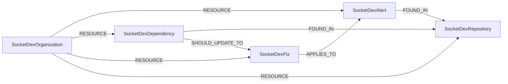

<!-- Generated from the data model. Do not edit manually. -->

## Socket.dev Schema

### SocketDevAlert

A security or supply chain alert reported by Socket.dev.

> **Ontology Mapping**: This node uses the ontology label [`SecurityIssue`](#ontology-securityissue).

> **Additional Labels**: This node also uses `Risk`.

> **Additional Label Definitions**:
>
> - `Risk`: A node participating in the shared Risk graph interface.

#### Properties

Ontology-generated fields are shown in *italics*.

| Field | Index | Description |
|-------|-------|-------------|
| id | Yes | Unique Socket.dev alert identifier. |
| firstseen |  | Timestamp when a sync job first created this node. |
| lastupdated | Yes | Timestamp of the last sync that observed this node. |
| action |  | Action assigned by the security policy. |
| artifact_name |  | Affected package name. |
| artifact_type |  | Affected package ecosystem. |
| artifact_version |  | Affected package version. |
| branch |  | Branch where the alert was found. |
| category | Yes | Alert category. |
| cleared_at |  | Timestamp when the alert was cleared. |
| created_at |  | Alert creation timestamp. |
| cve_id |  | CVE identifier for a vulnerability alert. |
| cvss_score |  | CVSS score for a vulnerability alert. |
| dashboard_url |  | URL for the alert in the Socket.dev dashboard. |
| description |  | Detailed alert description. |
| epss_percentile |  | EPSS percentile for a vulnerability alert. |
| epss_score |  | EPSS probability score for a vulnerability alert. |
| first_patched_version |  | First package version that fixes the vulnerability. |
| ghsa_id | Yes | GitHub Security Advisory identifier. |
| is_kev |  | Whether the vulnerability is in the CISA KEV catalog. |
| key |  | Alert deduplication key. |
| repo_fullname |  | Full path of the repository where the alert was found. |
| repo_slug |  | Slug of the repository where the alert was found. |
| severity | Yes | Alert severity. |
| status |  | Alert status. |
| title |  | Human-readable alert title. |
| type | Yes | Socket.dev alert type. |
| updated_at |  | Alert last update timestamp. |
| *_ont_first_seen* | Yes | Normalized field sourced from `created_at`. |
| *_ont_severity* | Yes | Normalized field sourced from `severity`. |
| *_ont_source* |  | Module that populated this node's ontology fields. |
| *_ont_status* | Yes | Normalized field sourced from `status`. |
| *_ont_title* | Yes | Normalized field sourced from `title`. |
| *_ont_type* | Yes | Normalized field sourced from `type`. |

#### Relationships

- `(:SocketDevFix)-[:APPLIES_TO]->(:SocketDevAlert)`: Links an available fix to the alert it addresses.

- `(:SocketDevAlert)-[:FOUND_IN]->(:SocketDevRepository)`: Links an alert to the Socket.dev repository where it was found.

- `(:SocketDevOrganization)-[:RESOURCE]->(:SocketDevAlert)`: Links a Socket.dev organization to one of its alerts.

### SocketDevDependency

An open source dependency tracked by Socket.dev.

> **Additional Labels**: This node also uses `Dependency`.

> **Additional Label Definitions**:
>
> - `Dependency`: A node participating in the shared Dependency graph interface.

#### Properties

| Field | Index | Description |
|-------|-------|-------------|
| id | Yes | Unique Socket.dev dependency identifier. |
| firstseen |  | Timestamp when a sync job first created this node. |
| lastupdated | Yes | Timestamp of the last sync that observed this node. |
| direct |  | Whether this is a direct dependency. |
| ecosystem |  | Package ecosystem. |
| name | Yes | Package name. |
| namespace |  | Package namespace, when applicable. |
| normalized_id | Yes | Normalized package identifier used for cross-tool matching. |
| repo_fullname |  | Full path of the repository containing the dependency. |
| repo_slug |  | Slug of the repository containing the dependency. |
| version |  | Package version. |

#### Relationships

- `(:PackageVersion)-[:DETECTED_AS]->(:SocketDevDependency)`: A canonical package version was detected as a Socket.dev dependency.

- `(:SocketDevDependency)-[:FOUND_IN]->(:SocketDevRepository)`: Links a dependency to the Socket.dev repository containing it.

- `(:SocketDevOrganization)-[:RESOURCE]->(:SocketDevDependency)`: Links a Socket.dev organization to one of its dependencies.

- `(:SocketDevDependency)-[:SHOULD_UPDATE_TO]->(:SocketDevFix)`: Links a dependency to the fix version it should use.

### SocketDevFix

An available remediation for a Socket.dev vulnerability alert.

> **Additional Labels**: This node also uses `Fix`.

> **Additional Label Definitions**:
>
> - `Fix`: A node participating in the shared Fix graph interface.

#### Properties

| Field | Index | Description |
|-------|-------|-------------|
| id | Yes | Unique Socket.dev fix identifier. |
| firstseen |  | Timestamp when a sync job first created this node. |
| lastupdated | Yes | Timestamp of the last sync that observed this node. |
| fix_type | Yes | Availability classification for the fix. |
| fixed_version |  | Package version that fixes the vulnerability. |
| purl |  | Package URL of the affected package. |
| update_type |  | Type of version update required. |
| vulnerability_id | Yes | CVE or GHSA identifier addressed by the fix. |

#### Relationships

- `(:SocketDevFix)-[:APPLIES_TO]->(:SocketDevAlert)`: Links an available fix to the alert it addresses.

- `(:SocketDevOrganization)-[:RESOURCE]->(:SocketDevFix)`: Links a Socket.dev organization to one of its available fixes.

- `(:SocketDevDependency)-[:SHOULD_UPDATE_TO]->(:SocketDevFix)`: Links a dependency to the fix version it should use.

### SocketDevOrganization

A Socket.dev organization containing monitored resources.

> **Ontology Mapping**: This node uses the ontology label [`Tenant`](#ontology-tenant).

#### Properties

Ontology-generated fields are shown in *italics*.

| Field | Index | Description |
|-------|-------|-------------|
| id | Yes | Unique Socket.dev organization identifier. |
| firstseen |  | Timestamp when a sync job first created this node. |
| lastupdated | Yes | Timestamp of the last sync that observed this node. |
| image |  | Organization image URL. |
| name |  | Organization display name. |
| plan |  | Organization subscription plan. |
| slug | Yes | Organization slug used in Socket.dev API URLs. |
| *_ont_name* | Yes | Normalized field sourced from `name`. |
| *_ont_source* |  | Module that populated this node's ontology fields. |

#### Relationships

- `(:SocketDevOrganization)-[:RESOURCE]->(:SocketDevAlert)`: Links a Socket.dev organization to one of its alerts.

- `(:SocketDevOrganization)-[:RESOURCE]->(:SocketDevDependency)`: Links a Socket.dev organization to one of its dependencies.

- `(:SocketDevOrganization)-[:RESOURCE]->(:SocketDevFix)`: Links a Socket.dev organization to one of its available fixes.

- `(:SocketDevOrganization)-[:RESOURCE]->(:SocketDevRepository)`: Links a Socket.dev organization to one of its repositories.

### SocketDevRepository

A source code repository monitored by Socket.dev.

#### Properties

| Field | Index | Description |
|-------|-------|-------------|
| id | Yes | Unique Socket.dev repository identifier. |
| firstseen |  | Timestamp when a sync job first created this node. |
| lastupdated | Yes | Timestamp of the last sync that observed this node. |
| archived |  | Whether the repository is archived. |
| created_at |  | Repository creation timestamp. |
| default_branch |  | Default branch name. |
| description |  | Repository description. |
| fullname | Yes | Full repository path including its workspace. |
| homepage |  | Repository homepage URL. |
| name | Yes | Repository name. |
| slug | Yes | Repository slug. |
| updated_at |  | Repository last update timestamp. |
| visibility |  | Repository visibility. |

#### Relationships

- `(:SocketDevAlert)-[:FOUND_IN]->(:SocketDevRepository)`: Links an alert to the Socket.dev repository where it was found.

- `(:SocketDevDependency)-[:FOUND_IN]->(:SocketDevRepository)`: Links a dependency to the Socket.dev repository containing it.

- `(:SocketDevRepository)-[:MONITORS]->(:CodeRepository)`: Links a Socket.dev repository to the code repository it monitors.

- `(:SocketDevOrganization)-[:RESOURCE]->(:SocketDevRepository)`: Links a Socket.dev organization to one of its repositories.
