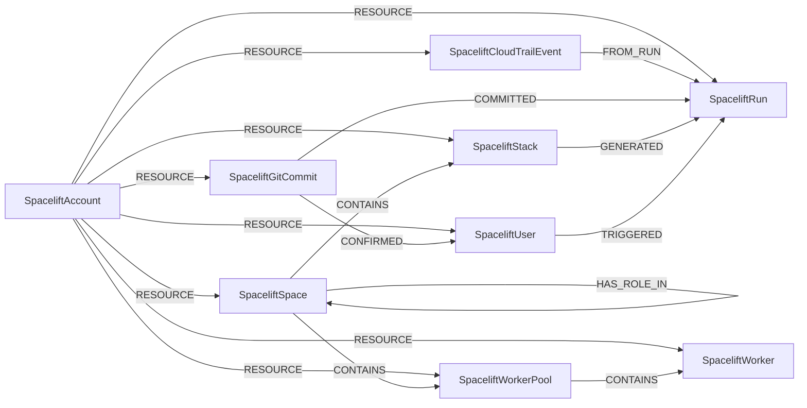

<!-- Generated from the data model. Do not edit manually. -->

## Spacelift Schema

### SpaceliftAccount

A Spacelift account that contains the organization's resources.

> **Ontology Mapping**: This node uses the ontology label [`Tenant`](#ontology-tenant).

#### Properties

Ontology-generated fields are shown in *italics*.

| Field | Index | Description |
|-------|-------|-------------|
| id | Yes | Spacelift account ID. |
| firstseen |  | Timestamp when a sync job first created this node. |
| lastupdated | Yes | Timestamp of the last sync that observed this node. |
| name |  | Account display name. |
| spacelift_account_id | Yes | Spacelift account identifier. |
| *_ont_name* | Yes | Normalized field sourced from `name`. |
| *_ont_source* |  | Module that populated this node's ontology fields. |

#### Relationships

- `(:SpaceliftAccount)-[:RESOURCE]->(:SpaceliftCloudTrailEvent)`: A Spacelift account contains a CloudTrail event attributed to a run.

- `(:SpaceliftAccount)-[:RESOURCE]->(:SpaceliftGitCommit)`: A Spacelift account contains a Git commit observed by Spacelift.

- `(:SpaceliftAccount)-[:RESOURCE]->(:SpaceliftRun)`: A Spacelift account contains a run.

- `(:SpaceliftAccount)-[:RESOURCE]->(:SpaceliftSpace)`: A Spacelift account contains a space.

- `(:SpaceliftAccount)-[:RESOURCE]->(:SpaceliftStack)`: A Spacelift account contains a stack.

- `(:SpaceliftAccount)-[:RESOURCE]->(:SpaceliftUser)`: A Spacelift account contains a user.

- `(:SpaceliftAccount)-[:RESOURCE]->(:SpaceliftWorker)`: A Spacelift account contains a worker.

- `(:SpaceliftAccount)-[:RESOURCE]->(:SpaceliftWorkerPool)`: A Spacelift account contains a worker pool.

### SpaceliftCloudTrailEvent

A CloudTrail event from a Spacelift run that interacted with EC2.

> **Additional Labels**: This node also uses `CloudTrailSpaceliftEvent`.

> **Additional Label Definitions**:
>
> - `CloudTrailSpaceliftEvent`: Compatibility label for the deprecated `CloudTrailSpaceliftEvent` spacelift node label. Use `SpaceliftCloudTrailEvent` instead. Scheduled for removal in v1.0.0.

#### Properties

| Field | Index | Description |
|-------|-------|-------------|
| id | Yes | CloudTrail event ID. |
| firstseen |  | Timestamp when a sync job first created this node. |
| lastupdated | Yes | Timestamp of the last sync that observed this node. |
| aws_account |  | AWS account ID associated with the event. |
| aws_region |  | AWS region associated with the event. |
| event_name |  | AWS API action recorded by CloudTrail. |
| event_time |  | Timestamp of the CloudTrail event. |
| instance_ids |  | EC2 instance IDs affected by the event. |
| run_id |  | ID of the Spacelift run that produced the event. |

#### Relationships

- `(:SpaceliftCloudTrailEvent)-[:AFFECTED]->(:AWSEC2Instance)`: Links a CloudTrail event to the EC2 instances it affected.

- `(:SpaceliftCloudTrailEvent)-[:FROM_RUN]->(:SpaceliftRun)`: Links a CloudTrail event to the Spacelift run that generated it.

- `(:SpaceliftAccount)-[:RESOURCE]->(:SpaceliftCloudTrailEvent)`: A Spacelift account contains a CloudTrail event attributed to a run.

### SpaceliftGitCommit

A Git commit used by a Spacelift run.

#### Properties

| Field | Index | Description |
|-------|-------|-------------|
| id | Yes | Git commit SHA used as the unique ID. |
| firstseen |  | Timestamp when a sync job first created this node. |
| lastupdated | Yes | Timestamp of the last sync that observed this node. |
| author_login | Yes | Login of the commit author. |
| author_name |  | Display name of the commit author. |
| message |  | Git commit message. |
| sha | Yes | Git commit SHA. |
| timestamp |  | Timestamp when the commit was created. |
| url |  | URL of the Git commit. |

#### Relationships

- `(:SpaceliftGitCommit)-[:COMMITTED]->(:SpaceliftRun)`: A Spacelift Git commit was used by a run.

- `(:SpaceliftGitCommit)-[:CONFIRMED]->(:SpaceliftUser)`: A Spacelift Git commit was confirmed by its Spacelift user author.

- `(:GitHubUser)-[:PUSHED]->(:SpaceliftGitCommit)`: A GitHub user pushed a Spacelift Git commit with a matching author login.

- `(:SpaceliftAccount)-[:RESOURCE]->(:SpaceliftGitCommit)`: A Spacelift account contains a Git commit observed by Spacelift.

### SpaceliftRun

An execution of a Spacelift stack configuration.

#### Properties

| Field | Index | Description |
|-------|-------|-------------|
| id | Yes | Spacelift run ID. |
| firstseen |  | Timestamp when a sync job first created this node. |
| lastupdated | Yes | Timestamp of the last sync that observed this node. |
| affected_instance_ids |  | EC2 instance IDs affected by the run. |
| branch |  | Git branch used by the run. |
| commit_sha |  | Git commit SHA used by the run. |
| created_at |  | Timestamp when the run was created. |
| run_type |  | Type of Spacelift run. |
| spacelift_account_id |  | ID of the containing Spacelift account. |
| stack_id |  | ID of the stack that generated the run. |
| state |  | Current run state. |
| triggered_by_user_id |  | ID of the user that triggered the run. |

#### Relationships

- `(:SpaceliftRun)-[:AFFECTED]->(:AWSEC2Instance)`: Links a Spacelift run to the EC2 instances it affected.

- `(:SpaceliftGitCommit)-[:COMMITTED]->(:SpaceliftRun)`: A Spacelift Git commit was used by a run.

- `(:SpaceliftCloudTrailEvent)-[:FROM_RUN]->(:SpaceliftRun)`: Links a CloudTrail event to the Spacelift run that generated it.

- `(:SpaceliftStack)-[:GENERATED]->(:SpaceliftRun)`: A Spacelift stack generated a run.

- `(:SpaceliftAccount)-[:RESOURCE]->(:SpaceliftRun)`: A Spacelift account contains a run.

- `(:SpaceliftUser)-[:TRIGGERED]->(:SpaceliftRun)`: A Spacelift user triggered a run.

### SpaceliftSpace

An organizational container in a Spacelift account.

#### Properties

| Field | Index | Description |
|-------|-------|-------------|
| id | Yes | Spacelift space ID. |
| firstseen |  | Timestamp when a sync job first created this node. |
| lastupdated | Yes | Timestamp of the last sync that observed this node. |
| description |  | Space description. |
| is_root |  | Whether this is a root space. |
| name | Yes | Space name. |
| parent_space_id |  | ID of the parent space for a child space. |
| parent_spacelift_account_id |  | Account ID used to identify a root space. |
| spacelift_account_id |  | ID of the containing Spacelift account. |

#### Relationships

- `(:SpaceliftSpace)-[:CONTAINS]->(:SpaceliftSpace)`: A parent Spacelift space contains a child space.

- `(:SpaceliftSpace)-[:CONTAINS]->(:SpaceliftStack)`: A Spacelift space contains a stack.

- `(:SpaceliftSpace)-[:CONTAINS]->(:SpaceliftWorkerPool)`: A Spacelift space contains a worker pool.

- `(:SpaceliftSpace)-[:HAS_ROLE_IN]->(:SpaceliftSpace)`: A Spacelift space has a role in another Spacelift space.
  - Properties:

    | Field | Description |
    |-------|-------------|
    | role | Value sourced from `role`. |

- `(:SpaceliftAccount)-[:RESOURCE]->(:SpaceliftSpace)`: A Spacelift account contains a space.

### SpaceliftStack

An infrastructure management stack with the CICDPipeline label.

> **Ontology Mapping**: This node uses the ontology label [`CICDPipeline`](#ontology-cicdpipeline).

#### Properties

Ontology-generated fields are shown in *italics*.

| Field | Index | Description |
|-------|-------|-------------|
| id | Yes | Spacelift stack ID. |
| firstseen |  | Timestamp when a sync job first created this node. |
| lastupdated | Yes | Timestamp of the last sync that observed this node. |
| administrative |  | Whether this is an administrative stack. |
| aws_role_arn |  | ARN of the AWS IAM role assumed at runtime. |
| branch |  | Git branch monitored by the stack. |
| description |  | Stack description. |
| name | Yes | Stack name. |
| project_root |  | Repository directory containing project code. |
| repository |  | VCS repository used by the stack. |
| space_id |  | ID of the space containing the stack. |
| spacelift_account_id |  | ID of the containing Spacelift account. |
| state |  | Current stack state. |
| *_ont_name* | Yes | Normalized field sourced from `name`. |
| *_ont_source* |  | Module that populated this node's ontology fields. |
| *_ont_type* | Yes | Property generated by the ontology mapping. |

#### Relationships

- `(:SpaceliftStack)-[:ASSUMES]->(:AWSRole)`: A Spacelift stack assumes an AWS IAM role at runtime.

- `(:SpaceliftSpace)-[:CONTAINS]->(:SpaceliftStack)`: A Spacelift space contains a stack.

- `(:SpaceliftStack)-[:GENERATED]->(:SpaceliftRun)`: A Spacelift stack generated a run.

- `(:SpaceliftAccount)-[:RESOURCE]->(:SpaceliftStack)`: A Spacelift account contains a stack.

### SpaceliftUser

A Spacelift identity with the UserAccount label.

> **Ontology Mapping**: This node uses the ontology label [`UserAccount`](#ontology-useraccount).

#### Properties

Ontology-generated fields are shown in *italics*.

| Field | Index | Description |
|-------|-------|-------------|
| id | Yes | Spacelift user ID. |
| firstseen |  | Timestamp when a sync job first created this node. |
| lastupdated | Yes | Timestamp of the last sync that observed this node. |
| email | Yes | User email address. |
| name |  | User display name. |
| user_type |  | Type of Spacelift user, such as human or machine. |
| username | Yes | User login name. |
| *_ont_email* | Yes | Normalized field sourced from `email`. |
| *_ont_fullname* | Yes | Normalized field sourced from `name`. |
| *_ont_source* |  | Module that populated this node's ontology fields. |
| *_ont_username* | Yes | Normalized field sourced from `username`. |

#### Relationships

- `(:SpaceliftGitCommit)-[:CONFIRMED]->(:SpaceliftUser)`: A Spacelift Git commit was confirmed by its Spacelift user author.

- `(:User)-[:HAS_ACCOUNT]->(:SpaceliftUser)`

- `(:SpaceliftAccount)-[:RESOURCE]->(:SpaceliftUser)`: A Spacelift account contains a user.

- `(:SpaceliftUser)-[:TRIGGERED]->(:SpaceliftRun)`: A Spacelift user triggered a run.

### SpaceliftWorker

An execution worker in a Spacelift worker pool.

#### Properties

| Field | Index | Description |
|-------|-------|-------------|
| id | Yes | Spacelift worker ID. |
| firstseen |  | Timestamp when a sync job first created this node. |
| lastupdated | Yes | Timestamp of the last sync that observed this node. |
| name | Yes | Worker name. |
| spacelift_account_id |  | ID of the containing Spacelift account. |
| status |  | Current worker status. |
| worker_pool_id |  | ID of the worker's pool. |

#### Relationships

- `(:SpaceliftWorkerPool)-[:CONTAINS]->(:SpaceliftWorker)`: A Spacelift worker pool contains a worker.

- `(:SpaceliftAccount)-[:RESOURCE]->(:SpaceliftWorker)`: A Spacelift account contains a worker.

### SpaceliftWorkerPool

A pool of workers that execute Spacelift runs.

#### Properties

| Field | Index | Description |
|-------|-------|-------------|
| id | Yes | Spacelift worker pool ID. |
| firstseen |  | Timestamp when a sync job first created this node. |
| lastupdated | Yes | Timestamp of the last sync that observed this node. |
| description |  | Worker pool description. |
| name | Yes | Worker pool name. |
| pool_type |  | Type of worker pool. |
| space_id |  | ID of the space containing the worker pool. |
| spacelift_account_id |  | ID of the containing Spacelift account. |

#### Relationships

- `(:SpaceliftSpace)-[:CONTAINS]->(:SpaceliftWorkerPool)`: A Spacelift space contains a worker pool.

- `(:SpaceliftWorkerPool)-[:CONTAINS]->(:SpaceliftWorker)`: A Spacelift worker pool contains a worker.

- `(:SpaceliftAccount)-[:RESOURCE]->(:SpaceliftWorkerPool)`: A Spacelift account contains a worker pool.
