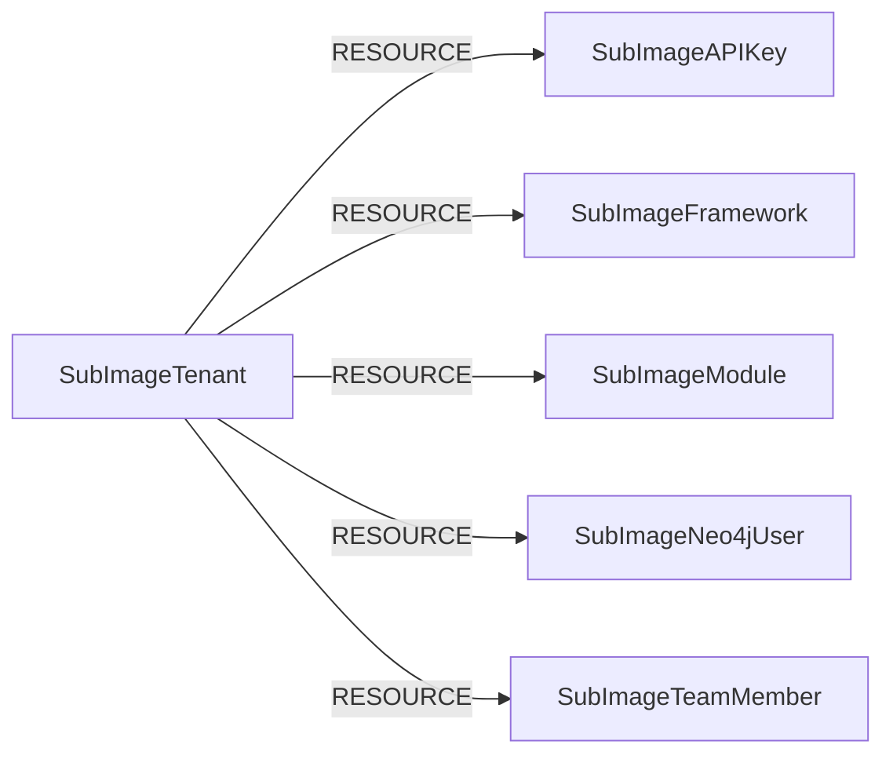

<!-- Generated from the data model. Do not edit manually. -->

## Subimage Schema

### SubImageAPIKey

An API key configured in SubImage.

> **Ontology Mapping**: This node uses the ontology label [`APIKey`](#ontology-apikey).

#### Properties

Ontology-generated fields are shown in *italics*.

| Field | Index | Description |
|-------|-------|-------------|
| id | Yes | Application ID. |
| firstseen |  | Timestamp when a sync job first created this node. |
| lastupdated | Yes | Timestamp of the last sync that observed this node. |
| client_id |  | Client ID. |
| description |  | API key description. |
| name |  | API key name. |
| role |  | Role associated with the API key. |
| *_ont_name* | Yes | Normalized field sourced from `name`. |
| *_ont_source* |  | Module that populated this node's ontology fields. |

#### Relationships

- `(:User)-[:OWNS]->(:SubImageAPIKey)`: generated by analysis job `Ontology - User OWNS APIKey linking`.

- `(:SubImageTenant)-[:RESOURCE]->(:SubImageAPIKey)`: The tenant contains the API key.

### SubImageFramework

A compliance framework configured in SubImage.

#### Properties

| Field | Index | Description |
|-------|-------|-------------|
| id | Yes | Framework ID. |
| firstseen |  | Timestamp when a sync job first created this node. |
| lastupdated | Yes | Timestamp of the last sync that observed this node. |
| disabled_at |  | Timestamp when the framework was disabled. |
| enabled |  | Whether the framework is enabled. |
| enabled_at |  | Timestamp when the framework was enabled. |
| name |  | Full framework name. |
| revision |  | Framework revision. |
| rule_count |  | Number of rules in the framework. |
| scope |  | Framework scope, such as aws or all. |
| short_name |  | Short framework name. |

#### Relationships

- `(:SubImageTenant)-[:RESOURCE]->(:SubImageFramework)`: The tenant contains the compliance framework.

### SubImageModule

A sync module configured in SubImage.

#### Properties

| Field | Index | Description |
|-------|-------|-------------|
| id | Yes | Module name. |
| firstseen |  | Timestamp when a sync job first created this node. |
| lastupdated | Yes | Timestamp of the last sync that observed this node. |
| is_configured |  | Whether the module is configured. |
| last_sync_status |  | Status of the latest sync run. |

#### Relationships

- `(:SubImageTenant)-[:RESOURCE]->(:SubImageModule)`: The tenant contains the sync module.

### SubImageNeo4jUser

A Neo4j database user configured in SubImage.

#### Properties

| Field | Index | Description |
|-------|-------|-------------|
| id | Yes | Neo4j username. |
| firstseen |  | Timestamp when a sync job first created this node. |
| lastupdated | Yes | Timestamp of the last sync that observed this node. |

#### Relationships

- `(:SubImageTenant)-[:RESOURCE]->(:SubImageNeo4jUser)`: The tenant contains the Neo4j user.

### SubImageTeamMember

A team member in a SubImage tenant.

> **Ontology Mapping**: This node uses the ontology label [`UserAccount`](#ontology-useraccount).

#### Properties

Ontology-generated fields are shown in *italics*.

| Field | Index | Description |
|-------|-------|-------------|
| id | Yes | Team member ID. |
| firstseen |  | Timestamp when a sync job first created this node. |
| lastupdated | Yes | Timestamp of the last sync that observed this node. |
| email | Yes | Team member email address. |
| first_name |  | Team member first name. |
| last_name |  | Team member last name. |
| role |  | Team member role, such as admin or viewer. |
| *_ont_email* | Yes | Normalized field sourced from `email`. |
| *_ont_firstname* | Yes | Normalized field sourced from `first_name`. |
| *_ont_lastname* | Yes | Normalized field sourced from `last_name`. |
| *_ont_source* |  | Module that populated this node's ontology fields. |

#### Relationships

- `(:User)-[:HAS_ACCOUNT]->(:SubImageTeamMember)`

- `(:SubImageTenant)-[:RESOURCE]->(:SubImageTeamMember)`: The tenant contains the team member.

### SubImageTenant

A SubImage tenant containing configured resources.

> **Ontology Mapping**: This node uses the ontology label [`Tenant`](#ontology-tenant).

#### Properties

Ontology-generated fields are shown in *italics*.

| Field | Index | Description |
|-------|-------|-------------|
| id | Yes | SubImage tenant ID. |
| firstseen |  | Timestamp when a sync job first created this node. |
| lastupdated | Yes | Timestamp of the last sync that observed this node. |
| account_id |  | SubImage account ID. |
| scan_role_name |  | IAM role name used for scanning. |
| *_ont_source* |  | Module that populated this node's ontology fields. |

#### Relationships

- `(:SubImageTenant)-[:RESOURCE]->(:SubImageAPIKey)`: The tenant contains the API key.

- `(:SubImageTenant)-[:RESOURCE]->(:SubImageFramework)`: The tenant contains the compliance framework.

- `(:SubImageTenant)-[:RESOURCE]->(:SubImageModule)`: The tenant contains the sync module.

- `(:SubImageTenant)-[:RESOURCE]->(:SubImageNeo4jUser)`: The tenant contains the Neo4j user.

- `(:SubImageTenant)-[:RESOURCE]->(:SubImageTeamMember)`: The tenant contains the team member.
