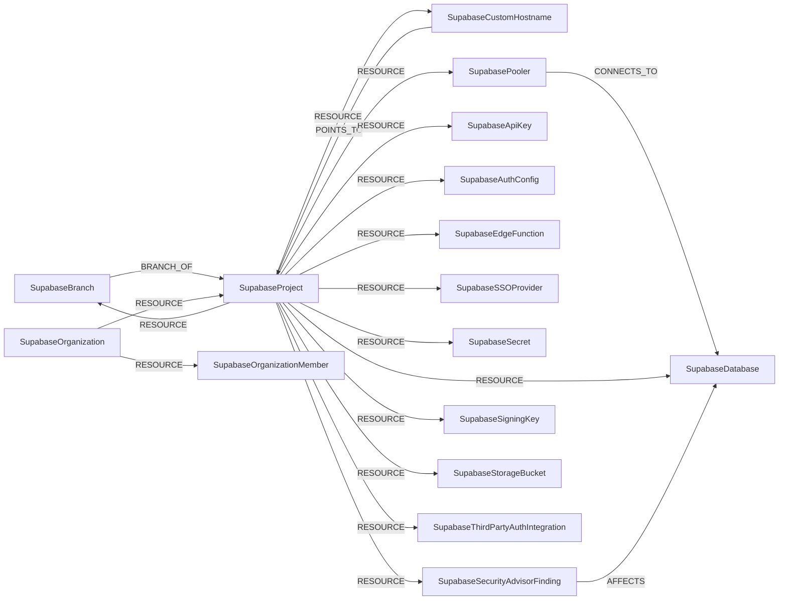

<!-- Generated from the data model. Do not edit manually. -->

## Supabase Schema

### SupabaseApiKey

Represents a project API key. The key material is never stored. Cartography lists keys without the `reveal` parameter, though note the endpoint returns the value regardless; it is dropped during transformation and this node has no property to hold it.

> **Ontology Mapping**: This node uses the ontology label [`APIKey`](#ontology-apikey).

#### Properties

Ontology-generated fields are shown in *italics*.

| Field | Index | Description |
|-------|-------|-------------|
| id | Yes | Synthesised as `<project ref>/<key id>`. The prefix is required because the API returns `anon` and `service_role` as the ids of the legacy keys, which are identical in every project; without it two projects would share one node. When the API returns no id at all, the key type is used in its place |
| firstseen |  | Timestamp when a sync job first created this node. |
| lastupdated | Yes | Timestamp of the last sync that observed this node. |
| description |  | Description of the key |
| hash |  | Server-side hash of the key |
| inserted_at |  | When the key was created |
| name | Yes | Name of the key |
| prefix |  | Non-secret identifying prefix of the key |
| type |  | `legacy`, `publishable` or `secret` |
| updated_at |  | When the key was last changed |
| *_ont_created_at* | Yes | Normalized field sourced from `inserted_at`. |
| *_ont_name* | Yes | Normalized field sourced from `name`. |
| *_ont_source* |  | Module that populated this node's ontology fields. |
| *_ont_updated_at* | Yes | Normalized field sourced from `updated_at`. |

#### Relationships

- `(:User)-[:OWNS]->(:SupabaseApiKey)`: generated by analysis job `Ontology - User OWNS APIKey linking`.

- `(:SupabaseProject)-[:RESOURCE]->(:SupabaseApiKey)`

### SupabaseAuthConfig

Represents the authentication configuration of a Supabase project. The API returns 237 fields for this resource; Cartography ingests a curated non-secret subset. SMTP credentials, the captcha secret, webhook hook secrets and test OTPs are never stored.

#### Properties

| Field | Index | Description |
|-------|-------|-------------|
| id | Yes | Synthesised as `<project ref>/auth` |
| firstseen |  | Timestamp when a sync job first created this node. |
| lastupdated | Yes | Timestamp of the last sync that observed this node. |
| disable_signup |  | Whether self-service sign-up is disabled |
| enabled_external_providers |  | Names of the enabled federated identity providers, derived from the `external_*_enabled` flags |
| external_anonymous_users_enabled |  | Whether anonymous sign-ins are allowed |
| external_email_enabled |  | Whether email sign-in is enabled |
| external_phone_enabled |  | Whether phone sign-in is enabled |
| jwt_exp |  | Access token lifetime in seconds |
| mailer_otp_exp |  | Email OTP lifetime |
| mailer_otp_length |  | Email OTP length |
| mailer_secure_email_change_enabled |  | Whether email changes require confirmation on both addresses |
| mfa_max_enrolled_factors |  | Maximum factors a user may enrol |
| mfa_phone_enroll_enabled |  | Whether users may enrol a phone factor |
| mfa_phone_verify_enabled |  | Whether phone factors may be used to verify |
| mfa_totp_enroll_enabled |  | Whether users may enrol a TOTP factor |
| mfa_totp_verify_enabled |  | Whether TOTP factors may be used to verify |
| mfa_web_authn_enroll_enabled |  | Whether users may enrol a WebAuthn factor |
| mfa_web_authn_verify_enabled |  | Whether WebAuthn factors may be used to verify |
| password_hibp_enabled |  | Whether passwords are checked against Have I Been Pwned |
| password_min_length |  | Minimum password length |
| password_required_characters |  | Character classes required in passwords |
| rate_limit_anonymous_users |  | Anonymous sign-in rate limit |
| rate_limit_otp |  | OTP send rate limit |
| rate_limit_token_refresh |  | Token refresh rate limit |
| refresh_token_rotation_enabled |  | Whether refresh tokens rotate on use |
| security_captcha_enabled |  | Whether captcha protection is enabled |
| security_captcha_provider |  | The captcha provider in use |
| security_manual_linking_enabled |  | Whether users may manually link identities |
| security_refresh_token_reuse_interval |  | Grace period for reusing a rotated refresh token |
| security_update_password_require_reauthentication |  | Whether changing a password requires reauthentication |
| sessions_inactivity_timeout |  | Session idle timeout |
| sessions_single_per_user |  | Whether a user may hold only one session |
| sessions_timebox |  | Maximum absolute session lifetime |
| site_url |  | The project's primary site URL |
| sms_otp_exp |  | SMS OTP lifetime |
| uri_allow_list |  | Allowed post-authentication redirect URIs |

#### Relationships

- `(:SupabaseProject)-[:RESOURCE]->(:SupabaseAuthConfig)`

### SupabaseBranch

Represents a database preview branch. Branching is a paid feature tied to the GitHub integration; on projects without it this node type is simply absent.

#### Properties

| Field | Index | Description |
|-------|-------|-------------|
| id | Yes | The branch id |
| firstseen |  | Timestamp when a sync job first created this node. |
| lastupdated | Yes | Timestamp of the last sync that observed this node. |
| created_at |  | When the branch was created |
| deletion_scheduled_at |  | When the branch is scheduled for deletion |
| git_branch |  | The Git branch this preview tracks |
| is_default |  | Whether this is the project's default branch |
| name | Yes | Name of the branch |
| parent_project_ref |  | Ref of the project the branch was created from |
| persistent |  | Whether the branch survives after its pull request closes |
| pr_number |  | The pull request number this preview tracks |
| preview_project_status |  | Status of the branch's preview project |
| project_ref | Yes | Ref of the ephemeral project holding the branch's data |
| review_requested_at |  | When review was requested |
| status |  | Status of the branch |
| updated_at |  | When the branch was last changed |
| with_data |  | Whether the branch was seeded with production data |

#### Relationships

- `(:SupabaseBranch)-[:BRANCH_OF]->(:SupabaseProject)`

- `(:SupabaseProject)-[:RESOURCE]->(:SupabaseBranch)`

### SupabaseCustomHostname

Represents a custom domain fronting a Supabase project's API endpoint.

> **Ontology Mapping**: This node uses the ontology label [`DNSRecord`](#ontology-dnsrecord).

#### Properties

Ontology-generated fields are shown in *italics*.

| Field | Index | Description |
|-------|-------|-------------|
| id | Yes | Synthesised as `<project ref>/<hostname>` |
| firstseen |  | Timestamp when a sync job first created this node. |
| lastupdated | Yes | Timestamp of the last sync that observed this node. |
| custom_origin_server |  | The custom origin server, when one is configured |
| hostname | Yes | The custom hostname |
| ssl_status |  | Status of the hostname's TLS certificate |
| status |  | Status of the custom hostname configuration |
| type |  | Always `CNAME`: a custom hostname always fronts the project's own endpoint |
| verification_errors |  | Any outstanding domain verification errors |
| *_ont_name* | Yes | Normalized field sourced from `hostname`. |
| *_ont_source* |  | Module that populated this node's ontology fields. |
| *_ont_type* | Yes | Normalized field sourced from `type`. |

#### Relationships

- `(:SupabaseCustomHostname)-[:POINTS_TO]->(:SupabaseProject)`

- `(:SupabaseProject)-[:RESOURCE]->(:SupabaseCustomHostname)`

### SupabaseDatabase

Represents the Postgres database backing a Supabase project, together with its network, TLS and backup posture.

> **Ontology Mapping**: This node uses the ontology label [`Database`](#ontology-database).

#### Properties

Ontology-generated fields are shown in *italics*.

| Field | Index | Description |
|-------|-------|-------------|
| id | Yes | Synthesised as `<project ref>/postgres` |
| firstseen |  | Timestamp when a sync job first created this node. |
| lastupdated | Yes | Timestamp of the last sync that observed this node. |
| db_allowed_cidrs |  | IPv4 CIDRs allowed to reach the database. An empty or absent value means unrestricted |
| db_allowed_cidrs_v6 |  | IPv6 CIDRs allowed to reach the database |
| exposed_internet | Yes | `True` when the allowed-CIDR lists leave the Postgres endpoint reachable from anywhere, either by being empty or by listing `0.0.0.0/0` or `::/0`. |
| exposed_internet_type | Yes | How it is exposed. Always `direct`, since the endpoint is on the database itself. |
| host | Yes | The database hostname |
| latest_backup_at |  | Timestamp of the most recent backup |
| name |  | Display name, derived from the project name |
| network_restrictions_status |  | Status of the project's network restriction configuration |
| pitr_enabled |  | Whether point-in-time recovery is enabled |
| postgres_engine |  | The major Postgres engine version |
| region |  | The region hosting the database |
| release_channel |  | The release channel the database runs on |
| ssl_enforced |  | Whether TLS is required for database connections |
| version |  | The Postgres version |
| walg_enabled |  | Whether WAL-G physical backups are enabled |
| *_ont_endpoint* | Yes | Normalized field sourced from `host`. |
| *_ont_location* | Yes | Normalized field sourced from `region`. |
| *_ont_name* | Yes | Normalized field sourced from `name`. |
| *_ont_source* |  | Module that populated this node's ontology fields. |
| *_ont_type* | Yes | Property generated by the ontology mapping. |
| *_ont_version* | Yes | Normalized field sourced from `version`. |

#### Relationships

- `(:SupabaseSecurityAdvisorFinding)-[:AFFECTS]->(:SupabaseDatabase)`

- `(:SupabasePooler)-[:CONNECTS_TO]->(:SupabaseDatabase)`

- `(:SupabaseProject)-[:RESOURCE]->(:SupabaseDatabase)`

### SupabaseEdgeFunction

Represents a Supabase edge function: a Deno function deployed at the project's edge.

> **Ontology Mapping**: This node uses the ontology label [`Function`](#ontology-function).

#### Properties

Ontology-generated fields are shown in *italics*.

| Field | Index | Description |
|-------|-------|-------------|
| id | Yes | The function id |
| firstseen |  | Timestamp when a sync job first created this node. |
| lastupdated | Yes | Timestamp of the last sync that observed this node. |
| created_at |  | When the function was created |
| entrypoint_path |  | Path to the function entrypoint |
| exposed_internet | Yes | `True` when `verify_jwt` is `false`, meaning the function can be invoked without a project JWT. |
| exposed_internet_type | Yes | How it is exposed. Always `direct`, since the invocation URL is on the function itself. |
| import_map |  | Whether the deployment uses an import map |
| import_map_path |  | Path to the import map |
| name |  | Display name of the function |
| slug | Yes | The function slug, which forms its invocation URL |
| status |  | `ACTIVE`, `REMOVED` or `THROTTLED` |
| updated_at |  | When the function was last deployed |
| verify_jwt |  | Whether a valid project JWT is required to invoke the function. `false` means it is publicly invokable |
| version |  | Deployment version counter |
| *_ont_deployment_type* | Yes | Property generated by the ontology mapping. |
| *_ont_name* | Yes | Normalized field sourced from `name`. |
| *_ont_source* |  | Module that populated this node's ontology fields. |

#### Relationships

- `(:SupabaseEdgeFunction)-[:RESOLVED_IMAGE]->(:Image)`: generated by analysis job `Function RESOLVED_IMAGE analysis`.

- `(:SupabaseProject)-[:RESOURCE]->(:SupabaseEdgeFunction)`

### SupabaseOrganization

Represents a Supabase organization: the billing and membership boundary that owns projects.

> **Ontology Mapping**: This node uses the ontology label [`Tenant`](#ontology-tenant).

#### Properties

Ontology-generated fields are shown in *italics*.

| Field | Index | Description |
|-------|-------|-------------|
| id | Yes | The organization slug, which is how every organization-scoped API path addresses it |
| firstseen |  | Timestamp when a sync job first created this node. |
| lastupdated | Yes | Timestamp of the last sync that observed this node. |
| allowed_release_channels |  | Release channels this organization may deploy projects on |
| name |  | Display name of the organization |
| opt_in_tags |  | Feature opt-in tags set on the organization |
| organization_id |  | The opaque organization identifier returned by the API |
| plan |  | The organization's subscription plan |
| slug | Yes | The organization slug |
| *_ont_name* | Yes | Normalized field sourced from `name`. |
| *_ont_source* |  | Module that populated this node's ontology fields. |

#### Relationships

- `(:SupabaseOrganization)-[:RESOURCE]->(:SupabaseOrganizationMember)`

- `(:SupabaseOrganization)-[:RESOURCE]->(:SupabaseProject)`

### SupabaseOrganizationMember

Represents a user who is a member of a Supabase organization.

> **Ontology Mapping**: This node uses the ontology label [`UserAccount`](#ontology-useraccount).

#### Properties

Ontology-generated fields are shown in *italics*.

| Field | Index | Description |
|-------|-------|-------------|
| id | Yes | Synthesised as `<org slug>/<user id>`. This node is a membership, not a person: `role_name` is per-organization, so a user belonging to several organizations gets one node per organization, the same way `AWSUser` is scoped per account |
| firstseen |  | Timestamp when a sync job first created this node. |
| lastupdated | Yes | Timestamp of the last sync that observed this node. |
| email | Yes | The member's email address |
| mfa_enabled |  | Whether the member has multi-factor authentication enabled on their Supabase account |
| role_name |  | The member's role in the organization (Owner, Administrator, Developer, ...) |
| user_id | Yes | The member's Supabase user id, shared across their memberships |
| user_name |  | The member's username |
| *_ont_email* | Yes | Normalized field sourced from `email`. |
| *_ont_has_mfa* | Yes | Normalized field sourced from `mfa_enabled`. |
| *_ont_source* |  | Module that populated this node's ontology fields. |
| *_ont_username* | Yes | Normalized field sourced from `user_name`. |

#### Relationships

- `(:User)-[:HAS_ACCOUNT]->(:SupabaseOrganizationMember)`

- `(:SupabaseOrganization)-[:RESOURCE]->(:SupabaseOrganizationMember)`

### SupabasePooler

Represents a Supavisor connection pooler: a second network endpoint onto the project's Postgres database.

#### Properties

| Field | Index | Description |
|-------|-------|-------------|
| id | Yes | Synthesised as `<project ref>/<identifier>` |
| firstseen |  | Timestamp when a sync job first created this node. |
| lastupdated | Yes | Timestamp of the last sync that observed this node. |
| database_type |  | Whether the pooler fronts the primary or a read replica |
| db_host | Yes | Hostname clients connect to |
| db_name |  | The database name behind the pooler |
| db_port |  | Port clients connect to |
| db_user |  | The database user the pooler authenticates as |
| default_pool_size |  | Default server-side pool size |
| identifier |  | The pooler identifier |
| is_using_scram_auth |  | Whether SCRAM authentication is in use |
| max_client_conn |  | Maximum client connections |
| pool_mode |  | Pooling mode (`transaction` or `session`) |

#### Relationships

- `(:SupabasePooler)-[:CONNECTS_TO]->(:SupabaseDatabase)`

- `(:SupabaseProject)-[:RESOURCE]->(:SupabasePooler)`

### SupabaseProject

Represents a Supabase project: the isolation boundary containing a Postgres database, an auth service, storage buckets and edge functions.

> **Ontology Mapping**: This node uses the ontology label [`Tenant`](#ontology-tenant).

#### Properties

Ontology-generated fields are shown in *italics*.

| Field | Index | Description |
|-------|-------|-------------|
| id | Yes | The project ref, the 20-character identifier used in every project-scoped API path |
| firstseen |  | Timestamp when a sync job first created this node. |
| lastupdated | Yes | Timestamp of the last sync that observed this node. |
| created_at |  | When the project was created |
| legacy_api_keys_enabled |  | Whether the legacy JWT-based `anon` and `service_role` keys are still accepted |
| name |  | Display name of the project |
| organization_slug |  | Slug of the owning organization |
| postgrest_db_extra_search_path |  | Extra schemas added to the REST search path |
| postgrest_db_schema |  | The Postgres schemas exposed over the public REST API |
| postgrest_max_rows |  | Maximum rows a single REST request may return |
| realtime_presence_enabled |  | Whether realtime presence is enabled |
| realtime_private_only |  | Whether realtime channels require authorization |
| ref | Yes | The project ref |
| region |  | The region hosting the project |
| status |  | Project lifecycle status (`ACTIVE_HEALTHY`, `INACTIVE`, `PAUSING`, ...) |
| storage_file_size_limit |  | Maximum upload size for storage objects, in bytes |
| storage_s3_protocol_enabled |  | Whether the S3-compatible storage protocol is enabled |
| vanity_subdomain |  | The project's vanity subdomain, when configured |
| vanity_subdomain_status |  | Status of the vanity subdomain configuration |
| *_ont_name* | Yes | Normalized field sourced from `name`. |
| *_ont_source* |  | Module that populated this node's ontology fields. |
| *_ont_status* | Yes | Normalized field sourced from `status`. |

#### Relationships

- `(:SupabaseBranch)-[:BRANCH_OF]->(:SupabaseProject)`

- `(:SupabaseCustomHostname)-[:POINTS_TO]->(:SupabaseProject)`

- `(:SupabaseProject)-[:RESOURCE]->(:SupabaseApiKey)`

- `(:SupabaseProject)-[:RESOURCE]->(:SupabaseAuthConfig)`

- `(:SupabaseProject)-[:RESOURCE]->(:SupabaseBranch)`

- `(:SupabaseProject)-[:RESOURCE]->(:SupabaseCustomHostname)`

- `(:SupabaseProject)-[:RESOURCE]->(:SupabaseDatabase)`

- `(:SupabaseProject)-[:RESOURCE]->(:SupabaseEdgeFunction)`

- `(:SupabaseOrganization)-[:RESOURCE]->(:SupabaseProject)`

- `(:SupabaseProject)-[:RESOURCE]->(:SupabasePooler)`

- `(:SupabaseProject)-[:RESOURCE]->(:SupabaseSSOProvider)`

- `(:SupabaseProject)-[:RESOURCE]->(:SupabaseSecret)`

- `(:SupabaseProject)-[:RESOURCE]->(:SupabaseSecurityAdvisorFinding)`

- `(:SupabaseProject)-[:RESOURCE]->(:SupabaseSigningKey)`

- `(:SupabaseProject)-[:RESOURCE]->(:SupabaseStorageBucket)`

- `(:SupabaseProject)-[:RESOURCE]->(:SupabaseThirdPartyAuthIntegration)`

### SupabaseSecret

Represents an edge function secret. Only the name and last-updated timestamp are stored; the value returned by the API is dropped before ingestion.

> **Ontology Mapping**: This node uses the ontology label [`Secret`](#ontology-secret).

#### Properties

Ontology-generated fields are shown in *italics*.

| Field | Index | Description |
|-------|-------|-------------|
| id | Yes | Synthesised as `<project ref>/<name>` |
| firstseen |  | Timestamp when a sync job first created this node. |
| lastupdated | Yes | Timestamp of the last sync that observed this node. |
| name | Yes | Name of the secret |
| updated_at |  | When the secret was last changed |
| *_ont_name* | Yes | Normalized field sourced from `name`. |
| *_ont_source* |  | Module that populated this node's ontology fields. |
| *_ont_updated_at* | Yes | Normalized field sourced from `updated_at`. |

#### Relationships

- `(:SupabaseProject)-[:RESOURCE]->(:SupabaseSecret)`

### SupabaseSecurityAdvisorFinding

Represents a finding from Supabase's own security advisor, for example a public table with row level security disabled, or a security-definer view.

> **Ontology Mapping**: This node uses the ontology label [`SecurityIssue`](#ontology-securityissue).

#### Properties

Ontology-generated fields are shown in *italics*.

| Field | Index | Description |
|-------|-------|-------------|
| id | Yes | Synthesised as `<project ref>/<cache key>` |
| firstseen |  | Timestamp when a sync job first created this node. |
| lastupdated | Yes | Timestamp of the last sync that observed this node. |
| categories |  | Advisor categories the lint belongs to |
| description |  | What the lint checks |
| detail |  | Details of this particular occurrence |
| entity |  | Fully-qualified name of the affected database object |
| entity_name |  | Name of the affected object |
| entity_schema |  | Schema of the affected object |
| entity_type |  | Type of the affected object (table, view, function, ...) |
| facing |  | Exposure of the affected object. `EXTERNAL` means it is reachable from outside the project |
| level |  | Advisor severity (`ERROR`, `WARN`, `INFO`) |
| name | Yes | The lint identifier (e.g. `rls_disabled_in_public`) |
| remediation |  | Link to remediation guidance |
| title |  | Human-readable title of the finding |
| *_ont_severity* | Yes | Normalized field sourced from `level`. |
| *_ont_source* |  | Module that populated this node's ontology fields. |
| *_ont_title* | Yes | Normalized field sourced from `title`. |
| *_ont_type* | Yes | Normalized field sourced from `name`. |

#### Relationships

- `(:SupabaseSecurityAdvisorFinding)-[:AFFECTS]->(:SupabaseDatabase)`

- `(:SupabaseProject)-[:RESOURCE]->(:SupabaseSecurityAdvisorFinding)`

### SupabaseSigningKey

Represents a JWT signing key used to mint the project's access tokens. Only public metadata is stored.

#### Properties

| Field | Index | Description |
|-------|-------|-------------|
| id | Yes | The signing key id |
| firstseen |  | Timestamp when a sync job first created this node. |
| lastupdated | Yes | Timestamp of the last sync that observed this node. |
| algorithm |  | Signing algorithm (`ES256`, `RS256`, `HS256`, ...) |
| created_at |  | When the key was created |
| status |  | Rotation status of the key (`in_use`, `standby`, `revoked`, ...) |
| updated_at |  | When the key was last changed |

#### Relationships

- `(:SupabaseProject)-[:RESOURCE]->(:SupabaseSigningKey)`

### SupabaseSSOProvider

Represents a SAML identity provider configured for a project's auth service.

> **Ontology Mapping**: This node uses the ontology label [`IdentityProvider`](#ontology-identityprovider).

#### Properties

Ontology-generated fields are shown in *italics*.

| Field | Index | Description |
|-------|-------|-------------|
| id | Yes | The provider id |
| firstseen |  | Timestamp when a sync job first created this node. |
| lastupdated | Yes | Timestamp of the last sync that observed this node. |
| created_at |  | When the provider was configured |
| domains |  | Email domains routed to this provider |
| entity_id | Yes | The SAML entity id, which is also the trust identifier |
| metadata_url |  | URL of the provider's SAML metadata |
| name_id_format |  | The requested SAML NameID format |
| updated_at |  | When the provider was last changed |
| *_ont_issuer* | Yes | Normalized field sourced from `entity_id`. |
| *_ont_name* | Yes | Normalized field sourced from `entity_id`. |
| *_ont_protocol* | Yes | Property generated by the ontology mapping. |
| *_ont_source* |  | Module that populated this node's ontology fields. |

#### Relationships

- `(:SupabaseProject)-[:RESOURCE]->(:SupabaseSSOProvider)`

### SupabaseStorageBucket

Represents a Supabase Storage bucket.

> **Ontology Mapping**: This node uses the ontology label [`ObjectStorage`](#ontology-objectstorage).

#### Properties

Ontology-generated fields are shown in *italics*.

| Field | Index | Description |
|-------|-------|-------------|
| id | Yes | Synthesised as `<project ref>/<bucket id>` |
| firstseen |  | Timestamp when a sync job first created this node. |
| lastupdated | Yes | Timestamp of the last sync that observed this node. |
| bucket_id | Yes | The bucket id, unique within the project |
| created_at |  | When the bucket was created |
| exposed_internet | Yes | `True` when the bucket is public, meaning every object is readable without authentication. |
| exposed_internet_type | Yes | How it is exposed. Always `direct`, since the objects are served from the bucket itself. |
| name | Yes | Name of the bucket |
| owner |  | Owner of the bucket |
| public |  | Whether every object in the bucket is readable without authentication |
| updated_at |  | When the bucket was last changed |
| *_ont_name* | Yes | Normalized field sourced from `name`. |
| *_ont_public* | Yes | Normalized field sourced from `public`. |
| *_ont_source* |  | Module that populated this node's ontology fields. |

#### Relationships

- `(:SupabaseProject)-[:RESOURCE]->(:SupabaseStorageBucket)`

### SupabaseThirdPartyAuthIntegration

Represents an external OIDC issuer whose JWTs the project's auth service accepts, which is a trust edge into the project.

> **Ontology Mapping**: This node uses the ontology label [`IdentityProvider`](#ontology-identityprovider).

#### Properties

Ontology-generated fields are shown in *italics*.

| Field | Index | Description |
|-------|-------|-------------|
| id | Yes | The integration id |
| firstseen |  | Timestamp when a sync job first created this node. |
| lastupdated | Yes | Timestamp of the last sync that observed this node. |
| inserted_at |  | When the integration was created |
| jwks_url |  | URL of the issuer's JWKS |
| oidc_issuer_url | Yes | The trusted OIDC issuer URL |
| resolved_at |  | When the issuer's JWKS was last resolved |
| type |  | The integration type (`firebase`, `auth0`, `awsCognito`, ...) |
| updated_at |  | When the integration was last changed |
| *_ont_issuer* | Yes | Normalized field sourced from `oidc_issuer_url`. |
| *_ont_name* | Yes | Normalized field sourced from `oidc_issuer_url`. |
| *_ont_protocol* | Yes | Property generated by the ontology mapping. |
| *_ont_source* |  | Module that populated this node's ontology fields. |

#### Relationships

- `(:SupabaseProject)-[:RESOURCE]->(:SupabaseThirdPartyAuthIntegration)`
