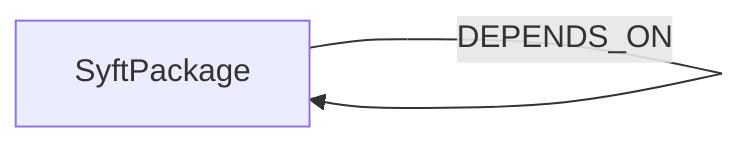

<!-- Generated from the data model. Do not edit manually. -->

## Syft Schema

### SyftPackage

A software package discovered in a Syft artifact scan.

> **Ontology Projection**: `SyftPackage` contributes data to canonical [`PackageVersion`](#ontology-packageversion) nodes.

#### Properties

| Field | Index | Description |
|-------|-------|-------------|
| id | Yes | Normalized package identifier. |
| firstseen |  | Timestamp when a sync job first created this node. |
| lastupdated | Yes | Timestamp of the last sync that observed this node. |
| language |  | Programming language associated with the package. |
| name |  | Package name. |
| normalized_id | Yes | Normalized identifier used for cross-tool package matching. |
| purl |  | Package URL identifying the package. |
| type |  | Package ecosystem or type, such as npm, pypi, or deb. |
| version |  | Package version. |

#### Relationships

- `(:SyftPackage)-[:DEPENDS_ON]->(:SyftPackage)`: Self-referential relationship: (SyftPackage)-[:DEPENDS_ON]->(SyftPackage).

Each SyftPackage carries a dependency_ids list of normalized_ids it depends on.

- `(:SyftPackage)-[:DEPLOYED]->(:Image)`: Links a package to the ontology image in which Syft discovered it.
  - Properties:

    | Field | Description |
    |-------|-------------|
    | found_by | Syft cataloger names that discovered this package in this image. A package can be found by more than one cataloger in the same scan. |
    | locations | Syft location paths for this package in this image, such as node_modules paths or lockfile paths. |

- `(:PackageVersion)-[:DETECTED_AS]->(:SyftPackage)`: A canonical package version was detected as a Syft package.
