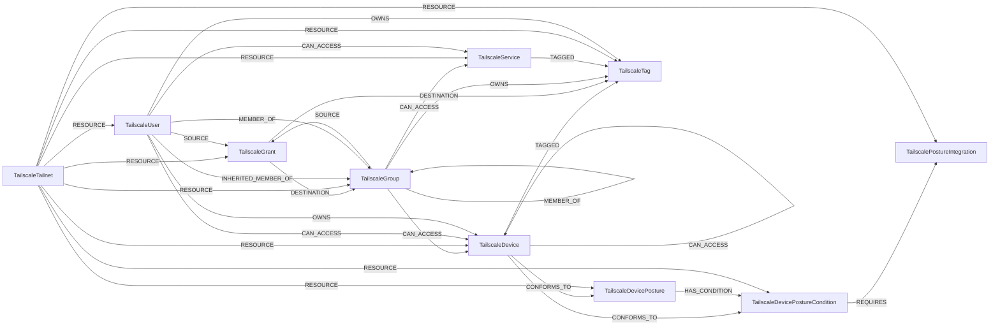

<!-- Generated from the data model. Do not edit manually. -->

## Tailscale Schema

### TailscaleDevice

A Tailscale device (sometimes referred to as *node* or *machine*), is any computer
or mobile device that joins a tailnet.

> **Ontology Projection**: `TailscaleDevice` contributes data to canonical [`Device`](#ontology-device) nodes.

#### Properties

| Field | Index | Description |
|-------|-------|-------------|
| id | Yes | The preferred identifier for a device. |
| firstseen |  | Timestamp when a sync job first created this node. |
| lastupdated | Yes | Timestamp of the last sync that observed this node. |
| addresses |  | Addresses. |
| authorized |  | 'true' if the device has been authorized to join the tailnet; otherwise, 'false'. Learn more about device authorization at https://tailscale.com/kb/1099/. |
| blocks_incoming_connections |  | 'true' if the device is not allowed to accept any connections over Tailscale, including pings. Learn more in the "Allow incoming connections" section of https://tailscale.com/kb/1072/. |
| client_connectivity_endpoints |  | Client's magicsock UDP IP:port endpoints (IPv4 or IPv6). |
| client_connectivity_mapping_varies_by_dest_ip |  | 'true' if the host's NAT mappings vary based on the destination IP. |
| client_version |  | The version of the Tailscale client software; this is empty for external devices. |
| created |  | The date on which the device was added to the tailnet; this is empty for external devices. |
| expires |  | The expiration date of the device's auth key. Learn more about key expiry at https://tailscale.com/kb/1028/. |
| hostname | Yes | The machine name in the admin console. Learn more about machine names at https://tailscale.com/kb/1098/. |
| is_external |  | 'true', indicates that a device is not a member of the tailnet, but is shared in to the tailnet; if 'false', the device is a member of the tailnet. Learn more about node sharing at https://tailscale.com/kb/1084/. |
| key_expiry_disabled |  | 'true' if the keys for the device will not expire. Learn more at https://tailscale.com/kb/1028/. |
| last_seen |  | When device was last active on the tailnet. |
| name |  | The MagicDNS name of the device. Learn more about MagicDNS at https://tailscale.com/kb/1081/. |
| node_key |  | Mostly for internal use, required for select operations, such as adding a node to a locked tailnet. Learn about tailnet locks at https://tailscale.com/kb/1226/. |
| os |  | The operating system that the device is running. |
| posture_falcon_zta_score |  | Device posture value for `falcon:ztaScore`. |
| posture_fleet_policies |  | List of `fleetPolicy:*` posture keys present on the device. |
| posture_fleet_present |  | Device posture value for `fleet:present`. |
| posture_huntress_defender_policy_status |  | Device posture value for `huntress:defenderPolicyStatus`. |
| posture_huntress_defender_status |  | Device posture value for `huntress:defenderStatus`. |
| posture_huntress_firewall_status |  | Device posture value for `huntress:firewallStatus`. |
| posture_identity_disabled |  | 'true' if device posture identification collection is disabled. |
| posture_identity_serial_numbers |  | Posture identification collection. |
| posture_intune_azure_ad_registered |  | Device posture value for `intune:azureADRegistered`. |
| posture_intune_compliance_state |  | Device posture value for `intune:complianceState`. |
| posture_intune_device_registration_state |  | Device posture value for `intune:deviceRegistrationState`. |
| posture_intune_is_encrypted |  | Device posture value for `intune:isEncrypted`. |
| posture_intune_is_supervised |  | Device posture value for `intune:isSupervised`. |
| posture_intune_managed_device_owner_type |  | Device posture value for `intune:managedDeviceOwnerType`. |
| posture_ip_country |  | Device posture value for `ip:country`. |
| posture_jamfpro_file_vault_status |  | Device posture value for `jamfPro:fileVaultStatus`. |
| posture_jamfpro_firewall_enabled |  | Device posture value for `jamfPro:firewallEnabled`. |
| posture_jamfpro_remote_managed |  | Device posture value for `jamfPro:remoteManaged`. |
| posture_jamfpro_sip_enabled |  | Device posture value for `jamfPro:SIPEnabled`. |
| posture_jamfpro_supervised |  | Device posture value for `jamfPro:supervised`. |
| posture_kandji_agent_installed |  | Device posture value for `kandji:agentInstalled`. |
| posture_kandji_mdm_enabled |  | Device posture value for `kandji:mdmEnabled`. |
| posture_kolide_auth_state |  | Device posture value for `kolide:authState`. |
| posture_node_os |  | Device posture value for `node:os`. |
| posture_node_os_version |  | Device posture value for `node:osVersion`. |
| posture_node_ts_auto_update |  | Device posture value for `node:tsAutoUpdate`. |
| posture_node_ts_release_track |  | Device posture value for `node:tsReleaseTrack`. |
| posture_node_ts_state_encrypted |  | Device posture value for `node:tsStateEncrypted`. |
| posture_node_ts_version |  | Device posture value for `node:tsVersion`. |
| posture_sentinelone_active_threats |  | Device posture value for `sentinelOne:activeThreats`. |
| posture_sentinelone_agent_version |  | Device posture value for `sentinelOne:agentVersion`. |
| posture_sentinelone_encrypted_applications |  | Device posture value for `sentinelOne:encryptedApplications`. |
| posture_sentinelone_firewall_enabled |  | Device posture value for `sentinelOne:firewallEnabled`. |
| posture_sentinelone_infected |  | Device posture value for `sentinelOne:infected`. |
| posture_sentinelone_operational_state |  | Device posture value for `sentinelOne:operationalState`. |
| serial_number | Yes | The first serial number from posture identity, if available. |
| tailnet_lock_error |  | Indicates an issue with the tailnet lock node-key signature on this device. This field is only populated when tailnet lock is enabled. |
| tailnet_lock_key |  | The node's tailnet lock key. Every node generates a tailnet lock key (so the value will be present) even if tailnet lock is not enabled. Learn more about tailnet lock at https://tailscale.com/kb/1226/. |
| update_available |  | 'true' if a Tailscale client version upgrade is available. This value is empty for external devices. |

#### Relationships

- `(:TailscaleDevice)-[:CAN_ACCESS]->(:TailscaleDevice)`: Indicates that a tagged Tailscale device has effective access to another device through a grant.
  - Properties:

    | Field | Description |
    |-------|-------------|
    | granted_by | Grant IDs that justify the resolved access. |

- `(:TailscaleGroup)-[:CAN_ACCESS]->(:TailscaleDevice)`: Indicates that a Tailscale group has effective access to a device through a grant.
  - Properties:

    | Field | Description |
    |-------|-------------|
    | granted_by | Grant IDs that justify the resolved access. |

- `(:TailscaleUser)-[:CAN_ACCESS]->(:TailscaleDevice)`: Indicates that a Tailscale user has effective access to a device through a grant.
  - Properties:

    | Field | Description |
    |-------|-------------|
    | granted_by | Grant IDs that justify the resolved access. |

- `(:TailscaleDevice)-[:CONFORMS_TO]->(:TailscaleDevicePosture)`: Defines the CONFORMS_TO relationship to TailscaleDevicePosture nodes.

- `(:TailscaleDevice)-[:CONFORMS_TO]->(:TailscaleDevicePostureCondition)`: Defines the CONFORMS_TO relationship to TailscaleDevicePostureCondition nodes.

- `(:TailscaleDevice)-[:IS_INSTANCE]->(:ComputeInstance)`: generated by analysis job `Tailscale device to cloud instance linking`.

- `(:Device)-[:OBSERVED_AS]->(:TailscaleDevice)`

- `(:TailscaleUser)-[:OWNS]->(:TailscaleDevice)`: Defines the OWNS relationship to TailscaleUser nodes.

- `(:TailscaleTailnet)-[:RESOURCE]->(:TailscaleDevice)`: Defines the RESOURCE relationship to TailscaleTailnet nodes.

- `(:TailscaleDevice)-[:TAGGED]->(:TailscaleTag)`: Defines the TAGGED relationship to TailscaleDevice nodes.

### TailscaleDevicePosture

Logical posture policy blocks defined in the ACL.

#### Properties

| Field | Index | Description |
|-------|-------|-------------|
| id | Yes | Posture ID from the ACL, for example `posture:healthySentinelOneMac`. |
| firstseen |  | Timestamp when a sync job first created this node. |
| lastupdated | Yes | Timestamp of the last sync that observed this node. |
| description |  | Human-readable description generated from the ACL conditions. |
| name |  | Posture name without the `posture:` prefix. |

#### Relationships

- `(:TailscaleDevice)-[:CONFORMS_TO]->(:TailscaleDevicePosture)`: Defines the CONFORMS_TO relationship to TailscaleDevicePosture nodes.

- `(:TailscaleDevicePosture)-[:HAS_CONDITION]->(:TailscaleDevicePostureCondition)`: Defines the HAS_CONDITION relationship to TailscaleDevicePostureCondition nodes.

- `(:TailscaleTailnet)-[:RESOURCE]->(:TailscaleDevicePosture)`: Links a tailnet to a device posture it defines.

### TailscaleDevicePostureCondition

Atomic posture assertions extracted from ACL posture definitions.

#### Properties

| Field | Index | Description |
|-------|-------|-------------|
| id | Yes | Stable condition identifier derived from the posture ID and condition index. |
| firstseen |  | Timestamp when a sync job first created this node. |
| lastupdated | Yes | Timestamp of the last sync that observed this node. |
| name |  | The posture attribute being evaluated, for example `sentinelOne:infected` or `node:os`. |
| operator |  | Comparison operator such as `==`, `IN`, or `IS SET`. |
| provider |  | The provider/namespace inferred from the attribute, for example `sentinelone` or `node`. |
| value |  | Expected comparison value serialized as a string. |

#### Relationships

- `(:TailscaleDevice)-[:CONFORMS_TO]->(:TailscaleDevicePostureCondition)`: Defines the CONFORMS_TO relationship to TailscaleDevicePostureCondition nodes.

- `(:TailscaleDevicePosture)-[:HAS_CONDITION]->(:TailscaleDevicePostureCondition)`: Defines the HAS_CONDITION relationship to TailscaleDevicePostureCondition nodes.

- `(:TailscaleDevicePostureCondition)-[:REQUIRES]->(:TailscalePostureIntegration)`: Defines the REQUIRES relationship to TailscalePostureIntegration nodes.

- `(:TailscaleTailnet)-[:RESOURCE]->(:TailscaleDevicePostureCondition)`: Links a tailnet to a device posture condition it defines.

### TailscaleGrant

A grant rule from the Tailscale ACL/policy file. Grants define access rules with
sources, destinations, and capabilities.

#### Properties

| Field | Index | Description |
|-------|-------|-------------|
| id | Yes | Stable content-hash ID (eg. `grant:a1b2c3d4e5f6`). Computed from the grant's src, dst, ip, app, and srcPosture fields. |
| firstseen |  | Timestamp when a sync job first created this node. |
| lastupdated | Yes | Timestamp of the last sync that observed this node. |
| app_capabilities |  | JSON-serialized dict of application capabilities. |
| destinations |  | Native list of destination selectors (tags, groups, services, IPs). |
| ip_rules |  | Native list of network capabilities (eg. `["tcp:443"]`). |
| sources |  | Native list of source selectors (users, groups, tags). |
| src_posture |  | Native list of required posture policies for sources. |

#### Relationships

- `(:TailscaleGrant)-[:DESTINATION]->(:TailscaleGroup)`: Defines the DESTINATION relationship to TailscaleGroup nodes.

- `(:TailscaleGrant)-[:DESTINATION]->(:TailscaleTag)`: Defines the DESTINATION relationship to TailscaleTag nodes.

- `(:TailscaleTailnet)-[:RESOURCE]->(:TailscaleGrant)`: Defines the RESOURCE relationship to TailscaleTailnet nodes.

- `(:TailscaleGroup)-[:SOURCE]->(:TailscaleGrant)`: Defines the SOURCE relationship to TailscaleGroup nodes.

- `(:TailscaleUser)-[:SOURCE]->(:TailscaleGrant)`: Defines the SOURCE relationship to TailscaleUser nodes.

### TailscaleGroup

A group in Tailscale (either `group` or `autogroup`).

> **Ontology Mapping**: This node uses the ontology label [`UserGroup`](#ontology-usergroup).

#### Properties

Ontology-generated fields are shown in *italics*.

| Field | Index | Description |
|-------|-------|-------------|
| id | Yes | Group ID (eg. `group:example` or `autogroup:admin`). |
| firstseen |  | Timestamp when a sync job first created this node. |
| lastupdated | Yes | Timestamp of the last sync that observed this node. |
| name |  | The group name (eg. `example`). |
| *_ont_name* | Yes | Normalized field sourced from `name`. |
| *_ont_source* |  | Module that populated this node's ontology fields. |

#### Relationships

- `(:TailscaleGroup)-[:CAN_ACCESS]->(:TailscaleDevice)`: Indicates that a Tailscale group has effective access to a device through a grant.
  - Properties:

    | Field | Description |
    |-------|-------------|
    | granted_by | Grant IDs that justify the resolved access. |

- `(:TailscaleGroup)-[:CAN_ACCESS]->(:TailscaleService)`: Indicates that a Tailscale group has effective access to a service through a grant.
  - Properties:

    | Field | Description |
    |-------|-------------|
    | granted_by | Grant IDs that justify the resolved access. |

- `(:TailscaleGrant)-[:DESTINATION]->(:TailscaleGroup)`: Defines the DESTINATION relationship to TailscaleGroup nodes.

- `(:TailscaleUser)-[:INHERITED_MEMBER_OF]->(:TailscaleGroup)`: Indicates that a Tailscale user belongs to a parent group through nested group membership.

- `(:TailscaleGroup)-[:MEMBER_OF]->(:TailscaleGroup)`: Defines the MEMBER_OF relationship to TailscaleGroup nodes.

- `(:TailscaleUser)-[:MEMBER_OF]->(:TailscaleGroup)`: Defines the MEMBER_OF relationship to TailscaleUser nodes.

- `(:TailscaleGroup)-[:OWNS]->(:TailscaleTag)`: Defines the OWNS relationship to TailscaleGroup nodes.

- `(:TailscaleTailnet)-[:RESOURCE]->(:TailscaleGroup)`: Defines the RESOURCE relationship to TailscaleTailnet nodes.

- `(:TailscaleGroup)-[:SOURCE]->(:TailscaleGrant)`: Defines the SOURCE relationship to TailscaleGroup nodes.

### TailscalePostureIntegration

A configured PostureIntegration.

#### Properties

| Field | Index | Description |
|-------|-------|-------------|
| id | Yes | A unique identifier for the integration (generated by the system). |
| firstseen |  | Timestamp when a sync job first created this node. |
| lastupdated | Yes | Timestamp of the last sync that observed this node. |
| client_id |  | Unique identifier for your client. - For Microsoft Intune, it will be your application's UUID. - For CrowdStrike Falcon and Jamf Pro, it will be your client id. - For Kandji, Kolide and Sentinel One, this is left blank. |
| cloud_id |  | Identifies which of the provider's clouds to integrate with. - For CrowdStrike Falcon, it will be one of `us-1`, `us-2`, `eu-1` or `us-gov`. - For Microsoft Intune, it will be one of `global` or `us-gov`. - For Jamf Pro, Kandji and Sentinel One, it is the FQDN of your subdomain, for example `mydomain.sentinelone.net`. - For Kolide, this is left blank. |
| config_updated |  | Timestamp of the last time this configuration was updated, in RFC 3339 format. |
| provider |  | The device posture provider. Required on POST requests, ignored on PATCH requests. |
| status_error |  | If the last synchronization failed, this shows the error message associated with the failed synchronization. |
| status_last_sync |  | Timestamp of the last synchronization with the device posture provider, in RFC 3339 format. |
| status_matched_count |  | The number of Tailscale nodes that were matched with provider. |
| status_possible_matched_count |  | The number of Tailscale nodes with identifiers for matching. |
| status_provider_host_count |  | The number of devices known to the provider. |
| tenant_id |  | The Microsoft Intune directory (tenant) ID. For other providers, this is left blank. |

#### Relationships

- `(:TailscaleDevicePostureCondition)-[:REQUIRES]->(:TailscalePostureIntegration)`: Defines the REQUIRES relationship to TailscalePostureIntegration nodes.

- `(:TailscaleTailnet)-[:RESOURCE]->(:TailscalePostureIntegration)`: Defines the RESOURCE relationship to TailscaleTailnet nodes.

### TailscaleService

A Tailscale Service published in the tailnet. Services are named resources backed by
one or more device hosts, accessible via stable MagicDNS names.

#### Properties

| Field | Index | Description |
|-------|-------|-------------|
| id | Yes | Service ID in grant selector format (eg. `svc:web-server`). |
| firstseen |  | Timestamp when a sync job first created this node. |
| lastupdated | Yes | Timestamp of the last sync that observed this node. |
| comment |  | An optional description for the service. |
| ipv4_address |  | The IPv4 address assigned to the service. |
| ipv6_address |  | The IPv6 address assigned to the service. |
| name |  | The unique name of the service. |
| ports |  | Native list of protocol:port pairs (eg. `["tcp:443"]`). |
| tags |  | JSON-serialized list of tags associated with the service. |

#### Relationships

- `(:TailscaleGroup)-[:CAN_ACCESS]->(:TailscaleService)`: Indicates that a Tailscale group has effective access to a service through a grant.
  - Properties:

    | Field | Description |
    |-------|-------------|
    | granted_by | Grant IDs that justify the resolved access. |

- `(:TailscaleUser)-[:CAN_ACCESS]->(:TailscaleService)`: Indicates that a Tailscale user has effective access to a service through a grant.
  - Properties:

    | Field | Description |
    |-------|-------------|
    | granted_by | Grant IDs that justify the resolved access. |

- `(:TailscaleTailnet)-[:RESOURCE]->(:TailscaleService)`: Defines the RESOURCE relationship to TailscaleTailnet nodes.

- `(:TailscaleService)-[:TAGGED]->(:TailscaleTag)`: Defines the TAGGED relationship to TailscaleTag nodes.

### TailscaleTag

A tag in Tailscale (defined and used by ACL).

#### Properties

| Field | Index | Description |
|-------|-------|-------------|
| id | Yes | Tag ID (eg. `tag:example`). |
| firstseen |  | Timestamp when a sync job first created this node. |
| lastupdated | Yes | Timestamp of the last sync that observed this node. |
| name |  | The tag name (eg. `example`). |

#### Relationships

- `(:TailscaleGrant)-[:DESTINATION]->(:TailscaleTag)`: Defines the DESTINATION relationship to TailscaleTag nodes.

- `(:TailscaleGroup)-[:OWNS]->(:TailscaleTag)`: Defines the OWNS relationship to TailscaleGroup nodes.

- `(:TailscaleUser)-[:OWNS]->(:TailscaleTag)`: Defines the OWNS relationship to TailscaleUser nodes.

- `(:TailscaleTailnet)-[:RESOURCE]->(:TailscaleTag)`: Defines the RESOURCE relationship to TailscaleTailnet nodes.

- `(:TailscaleDevice)-[:TAGGED]->(:TailscaleTag)`: Defines the TAGGED relationship to TailscaleDevice nodes.

- `(:TailscaleService)-[:TAGGED]->(:TailscaleTag)`: Defines the TAGGED relationship to TailscaleTag nodes.

### TailscaleTailnet

Settings for a tailnet (aka Tenant).

> **Ontology Mapping**: This node uses the ontology label [`Tenant`](#ontology-tenant).

#### Properties

| Field | Index | Description |
|-------|-------|-------------|
| id | Yes | ID of the Tailnet (name of the organization). |
| firstseen |  | Timestamp when a sync job first created this node. |
| lastupdated | Yes | Timestamp of the last sync that observed this node. |
| devices_approval_on |  | Whether device approval is enabled for the tailnet. |
| devices_auto_updates_on |  | Whether auto updates are enabled for devices that belong to this tailnet. |
| devices_key_duration_days |  | The key expiry duration for devices on this tailnet. |
| network_flow_logging_on |  | Whether network flow logs are enabled for the tailnet. |
| posture_identity_collection_on |  | Whether identity collection is enabled for device posture integrations for the tailnet. |
| regional_routing_on |  | Whether regional routing is enabled for the tailnet. |
| users_approval_on |  | Whether user approval is enabled for this tailnet. |
| users_role_allowed_to_join_external_tailnets |  | Which user roles are allowed to join external tailnets. |

#### Relationships

- `(:TailscaleTailnet)-[:RESOURCE]->(:TailscaleDevice)`: Defines the RESOURCE relationship to TailscaleTailnet nodes.

- `(:TailscaleTailnet)-[:RESOURCE]->(:TailscaleDevicePosture)`: Links a tailnet to a device posture it defines.

- `(:TailscaleTailnet)-[:RESOURCE]->(:TailscaleDevicePostureCondition)`: Links a tailnet to a device posture condition it defines.

- `(:TailscaleTailnet)-[:RESOURCE]->(:TailscaleGrant)`: Defines the RESOURCE relationship to TailscaleTailnet nodes.

- `(:TailscaleTailnet)-[:RESOURCE]->(:TailscaleGroup)`: Defines the RESOURCE relationship to TailscaleTailnet nodes.

- `(:TailscaleTailnet)-[:RESOURCE]->(:TailscalePostureIntegration)`: Defines the RESOURCE relationship to TailscaleTailnet nodes.

- `(:TailscaleTailnet)-[:RESOURCE]->(:TailscaleService)`: Defines the RESOURCE relationship to TailscaleTailnet nodes.

- `(:TailscaleTailnet)-[:RESOURCE]->(:TailscaleTag)`: Defines the RESOURCE relationship to TailscaleTailnet nodes.

- `(:TailscaleTailnet)-[:RESOURCE]->(:TailscaleUser)`: Defines the RESOURCE relationship to TailscaleTailnet nodes.

### TailscaleUser

Representation of a user within a tailnet.

> **Ontology Mapping**: This node uses the ontology label [`UserAccount`](#ontology-useraccount).

#### Properties

Ontology-generated fields are shown in *italics*.

| Field | Index | Description |
|-------|-------|-------------|
| id | Yes | The unique identifier for the user. |
| firstseen |  | Timestamp when a sync job first created this node. |
| lastupdated | Yes | Timestamp of the last sync that observed this node. |
| created |  | The time the user joined their tailnet. |
| currently_connected |  | `true` when the user has a node currently connected to the control server. |
| device_count |  | Number of devices the user owns. |
| display_name |  | The name of the user. |
| email | Yes | The email of the user. |
| last_seen |  | The later of either: - The last time any of the user's nodes were connected to the network. - The last time the user authenticated to any tailscale service, including the admin panel. |
| login_name |  | The emailish login name of the user. |
| profile_pic_url |  | The profile pic URL for the user. |
| role |  | The role of the user. Learn more about user roles. |
| status |  | The status of the user. |
| type |  | The type of relation this user has to the tailnet associated with the request. |
| *_ont_active* | Yes | Normalized field sourced from `status`. |
| *_ont_email* | Yes | Normalized field sourced from `email`. |
| *_ont_fullname* | Yes | Normalized field sourced from `display_name`. |
| *_ont_source* |  | Module that populated this node's ontology fields. |
| *_ont_username* | Yes | Normalized field sourced from `login_name`. |

#### Relationships

- `(:TailscaleUser)-[:CAN_ACCESS]->(:TailscaleDevice)`: Indicates that a Tailscale user has effective access to a device through a grant.
  - Properties:

    | Field | Description |
    |-------|-------------|
    | granted_by | Grant IDs that justify the resolved access. |

- `(:TailscaleUser)-[:CAN_ACCESS]->(:TailscaleService)`: Indicates that a Tailscale user has effective access to a service through a grant.
  - Properties:

    | Field | Description |
    |-------|-------------|
    | granted_by | Grant IDs that justify the resolved access. |

- `(:User)-[:HAS_ACCOUNT]->(:TailscaleUser)`

- `(:TailscaleUser)-[:INHERITED_MEMBER_OF]->(:TailscaleGroup)`: Indicates that a Tailscale user belongs to a parent group through nested group membership.

- `(:TailscaleUser)-[:MEMBER_OF]->(:TailscaleGroup)`: Defines the MEMBER_OF relationship to TailscaleUser nodes.

- `(:TailscaleUser)-[:OWNS]->(:TailscaleDevice)`: Defines the OWNS relationship to TailscaleUser nodes.

- `(:TailscaleUser)-[:OWNS]->(:TailscaleTag)`: Defines the OWNS relationship to TailscaleUser nodes.

- `(:TailscaleTailnet)-[:RESOURCE]->(:TailscaleUser)`: Defines the RESOURCE relationship to TailscaleTailnet nodes.

- `(:TailscaleUser)-[:SOURCE]->(:TailscaleGrant)`: Defines the SOURCE relationship to TailscaleUser nodes.
