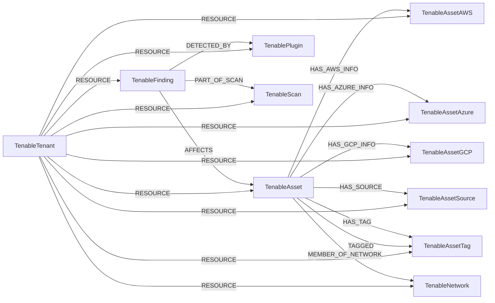

<!-- Generated from the data model. Do not edit manually. -->

## Tenable Schema

### TenableAsset

An asset discovered and tracked by Tenable.

#### Properties

| Field | Index | Description |
|-------|-------|-------------|
| id | Yes | Tenable asset UUID. |
| firstseen |  | Timestamp when a sync job first created this node. |
| lastupdated | Yes | Timestamp of the last sync that observed this node. |
| acr_score |  | Asset Criticality Rating score. |
| aes_score |  | Asset Exposure Score. |
| aws_ec2_instance_id | Yes | AWS EC2 instance ID. |
| azure_vm_id | Yes | Azure virtual machine ID. |
| created_at_timestamps |  | Asset creation timestamps. |
| first_scan_time |  | Timestamp of the first scan. |
| first_seen_timestamps |  | Asset first-seen timestamps. |
| fqdn | Yes | Primary fully qualified domain name. |
| fqdns |  | Fully qualified domain names for the asset. |
| gcp_instance_id | Yes | GCP instance ID. |
| has_agent |  | Whether a Tenable agent is installed. |
| has_plugin_results |  | Whether plugin scan results exist. |
| hostnames |  | Hostnames for the asset. |
| ipv4s |  | IPv4 addresses assigned to the asset. |
| ipv6s |  | IPv6 addresses assigned to the asset. |
| is_licensed |  | Whether the asset is licensed. |
| is_public |  | Whether the asset has a public IP address. |
| last_authenticated_scan_date |  | Timestamp of the most recent authenticated scan. |
| last_licensed_scan_date |  | Timestamp of the most recent licensed scan. |
| last_scan_id |  | ID of the most recent scan. |
| last_scan_time |  | Timestamp of the most recent scan. |
| last_seen_timestamps |  | Asset last-seen timestamps. |
| mac_addresses |  | MAC addresses assigned to the asset. |
| network_id |  | Tenable network UUID. |
| operating_systems |  | Operating systems reported for the asset. |
| serial_number | Yes | Hardware serial number. |
| system_types |  | Asset system type names. |
| tenable_agent_days_since_active |  | Days since the Tenable agent was last active. |
| types |  | Asset type names. |
| updated_at_timestamps |  | Asset update timestamps. |

#### Relationships

- `(:TenableFinding)-[:AFFECTS]->(:TenableAsset)`: Links a Tenable finding to the affected asset.

- `(:TenableAsset)-[:HAS_AWS_INFO]->(:TenableAssetAWS)`: Links a Tenable asset to its AWS details.

- `(:TenableAsset)-[:HAS_AZURE_INFO]->(:TenableAssetAzure)`: Links a Tenable asset to its Azure details.

- `(:TenableAsset)-[:HAS_GCP_INFO]->(:TenableAssetGCP)`: Links a Tenable asset to its GCP details.

- `(:TenableAsset)-[:HAS_SOURCE]->(:TenableAssetSource)`: Links a Tenable asset to a source that observed it.

- `(:TenableAsset)-[:HAS_TAG]->(:TenableAssetTag)`: Deprecated compatibility edge linking an asset to a tag until v1.0.0.

- `(:TenableAsset)-[:MEMBER_OF_NETWORK]->(:TenableNetwork)`: Links a Tenable asset to its logical network.

- `(:TenableTenant)-[:RESOURCE]->(:TenableAsset)`: Links a Tenable tenant to one of its assets.

- `(:TenableAsset)-[:TAGGED]->(:TenableAssetTag)`: Links a Tenable asset to a tag applied to it.

### TenableAssetAWS

AWS cloud details associated with a Tenable asset.

#### Properties

| Field | Index | Description |
|-------|-------|-------------|
| id | Yes | AWS EC2 instance ID. |
| firstseen |  | Timestamp when a sync job first created this node. |
| lastupdated | Yes | Timestamp of the last sync that observed this node. |
| availability_zone |  | AWS availability zone. |
| ec2_instance_ami_id |  | AMI ID used to launch the instance. |
| ec2_instance_group_name |  | EC2 security group name. |
| ec2_instance_state_name |  | EC2 instance state. |
| ec2_instance_type |  | EC2 instance type. |
| ec2_name |  | Value of the EC2 Name tag. |
| owner_id |  | AWS account ID. |
| region |  | AWS region. |
| subnet_id |  | AWS subnet ID. |
| vpc_id |  | AWS VPC ID. |

#### Relationships

- `(:TenableAsset)-[:HAS_AWS_INFO]->(:TenableAssetAWS)`: Links a Tenable asset to its AWS details.

- `(:TenableTenant)-[:RESOURCE]->(:TenableAssetAWS)`: Links a Tenable tenant to AWS details for an asset.

### TenableAssetAzure

Azure cloud details associated with a Tenable asset.

#### Properties

| Field | Index | Description |
|-------|-------|-------------|
| id | Yes | Azure virtual machine ID. |
| firstseen |  | Timestamp when a sync job first created this node. |
| lastupdated | Yes | Timestamp of the last sync that observed this node. |
| resource_id | Yes | Azure Resource Manager resource ID. |

#### Relationships

- `(:TenableAsset)-[:HAS_AZURE_INFO]->(:TenableAssetAzure)`: Links a Tenable asset to its Azure details.

- `(:TenableTenant)-[:RESOURCE]->(:TenableAssetAzure)`: Links a Tenable tenant to Azure details for an asset.

### TenableAssetGCP

GCP cloud details associated with a Tenable asset.

#### Properties

| Field | Index | Description |
|-------|-------|-------------|
| id | Yes | GCP instance ID. |
| firstseen |  | Timestamp when a sync job first created this node. |
| lastupdated | Yes | Timestamp of the last sync that observed this node. |
| project_id |  | GCP project ID. |
| zone |  | GCP zone. |

#### Relationships

- `(:TenableAsset)-[:HAS_GCP_INFO]->(:TenableAssetGCP)`: Links a Tenable asset to its GCP details.

- `(:TenableTenant)-[:RESOURCE]->(:TenableAssetGCP)`: Links a Tenable tenant to GCP details for an asset.

### TenableAssetSource

A data source that observed a Tenable asset.

#### Properties

| Field | Index | Description |
|-------|-------|-------------|
| id | Yes | Asset-scoped Tenable source identifier. |
| firstseen |  | Timestamp when a sync job first created this node. |
| lastupdated | Yes | Timestamp of the last sync that observed this node. |
| name |  | Tenable source name. |
| source_first_seen |  | Timestamp when the source first observed the asset. |
| source_last_seen |  | Timestamp when the source most recently observed the asset. |

#### Relationships

- `(:TenableAsset)-[:HAS_SOURCE]->(:TenableAssetSource)`: Links a Tenable asset to a source that observed it.

- `(:TenableTenant)-[:RESOURCE]->(:TenableAssetSource)`: Links a Tenable tenant to an asset observation source.

### TenableAssetTag

A key-value tag applied to a Tenable asset.

> **Ontology Mapping**: This node uses the ontology label [`Tag`](#ontology-tag).

#### Properties

Ontology-generated fields are shown in *italics*.

| Field | Index | Description |
|-------|-------|-------------|
| id | Yes | Tenable tag UUID. |
| firstseen |  | Timestamp when a sync job first created this node. |
| lastupdated | Yes | Timestamp of the last sync that observed this node. |
| added_at |  | Timestamp when the tag was applied. |
| added_by |  | User who applied the tag. |
| key | Yes | Tag category or key. |
| tag_key |  | Deprecated mirror of key; removed in v1.0.0. |
| tag_value |  | Deprecated mirror of value; removed in v1.0.0. |
| value |  | Tag value. |
| *_ont_source* |  | Module that populated this node's ontology fields. |

#### Relationships

- `(:TenableAsset)-[:HAS_TAG]->(:TenableAssetTag)`: Deprecated compatibility edge linking an asset to a tag until v1.0.0.

- `(:TenableTenant)-[:RESOURCE]->(:TenableAssetTag)`: Links a Tenable tenant to one of its asset tags.

- `(:TenableAsset)-[:TAGGED]->(:TenableAssetTag)`: Links a Tenable asset to a tag applied to it.

### TenableFinding

A vulnerability finding detected by Tenable on an asset.

> **Conditional Labels**:
>
> - [`CVE`](#ontology-cve) (ontology label) when `has_cve` equals `true`. A cross-provider CVE resource in Cartography's ontology.

#### Properties

Ontology-generated fields are shown in *italics*.

| Field | Index | Description |
|-------|-------|-------------|
| id | Yes | Tenable finding UUID. |
| firstseen |  | Timestamp when a sync job first created this node. |
| lastupdated | Yes | Timestamp of the last sync that observed this node. |
| asset_uuid | Yes | UUID of the affected Tenable asset. |
| cve_id | Yes | First CVE ID associated with the finding. |
| cve_list | Yes | CVE IDs associated with the finding. |
| first_found |  | Timestamp when the finding was first detected. |
| has_cve |  | Whether the finding has a CVE ID, as "true" or "false". |
| indexed |  | Timestamp when Tenable indexed the finding. |
| last_found |  | Timestamp when the finding was most recently detected. |
| output |  | Raw scanner output. |
| port |  | Network port associated with the finding. |
| protocol |  | Network protocol associated with the finding. |
| resurfaced_date |  | Timestamp when the finding resurfaced. |
| service |  | Network service associated with the finding. |
| severity |  | Finding severity name. |
| severity_default_id |  | Default numeric finding severity. |
| severity_id |  | Numeric finding severity. |
| severity_modification_type |  | Type of severity adjustment applied. |
| source |  | Scanner source that reported the finding. |
| state |  | Finding state. |
| time_taken_to_fix |  | Time taken to remediate the finding. |
| *_ont_base_severity* | Yes | Normalized field sourced from `severity`. |
| *_ont_cve_id* | Yes | Normalized field sourced from `cve_id`. |
| *_ont_source* |  | Module that populated this node's ontology fields. |
| *_ont_vuln_status* | Yes | Normalized field sourced from `state`. |

#### Relationships

- `(:TenableFinding)-[:AFFECTS]->(:TenableAsset)`: Links a Tenable finding to the affected asset.

- `(:TenableFinding)-[:DETECTED_BY]->(:TenablePlugin)`: Links a Tenable finding to the plugin that detected it.

- `(:TenableFinding)-[:PART_OF_SCAN]->(:TenableScan)`: Links a Tenable finding to the scan that produced it.

- `(:TenableTenant)-[:RESOURCE]->(:TenableFinding)`: Links a Tenable tenant to one of its findings.

### TenableNetwork

A logical network that groups Tenable assets.

#### Properties

| Field | Index | Description |
|-------|-------|-------------|
| id | Yes | Tenable network UUID. |
| firstseen |  | Timestamp when a sync job first created this node. |
| lastupdated | Yes | Timestamp of the last sync that observed this node. |
| name |  | Tenable network name. |

#### Relationships

- `(:TenableAsset)-[:MEMBER_OF_NETWORK]->(:TenableNetwork)`: Links a Tenable asset to its logical network.

- `(:TenableTenant)-[:RESOURCE]->(:TenableNetwork)`: Links a Tenable tenant to one of its logical networks.

### TenablePlugin

A Tenable plugin that detected one or more findings.

#### Properties

| Field | Index | Description |
|-------|-------|-------------|
| id | Yes | Tenable plugin ID. |
| firstseen |  | Timestamp when a sync job first created this node. |
| lastupdated | Yes | Timestamp of the last sync that observed this node. |
| cve_list |  | CVE IDs associated with the plugin. |
| cvss3_base_score |  | CVSS v3 base score. |
| cvss3_temporal_score |  | CVSS v3 temporal score. |
| cvss4_base_score |  | CVSS v4 base score. |
| cvss_base_score |  | CVSS v2 base score. |
| cvss_temporal_score |  | CVSS v2 temporal score. |
| description |  | Detailed plugin description. |
| epss_score |  | Exploit Prediction Scoring System score. |
| exploit_available |  | Whether a known exploit is available. |
| exploit_framework_metasploit |  | Whether a Metasploit module is available. |
| exploitability_ease |  | Ease of exploitation. |
| family |  | Plugin family name. |
| family_id |  | Plugin family ID. |
| has_patch |  | Whether a vendor patch is available. |
| has_workaround |  | Whether a workaround is available. |
| modification_date |  | Date the plugin was last modified. |
| name |  | Plugin name. |
| patch_publication_date |  | Date the patch was published. |
| publication_date |  | Date the plugin was published. |
| risk_factor |  | Qualitative plugin risk factor. |
| solution |  | Recommended remediation. |
| synopsis |  | Short summary of the plugin check. |
| type |  | Plugin scan type. |
| vendor_severity |  | Vendor-assigned severity. |
| vendor_unpatched |  | Whether the vendor has not issued a patch. |
| vpr_score |  | Tenable Vulnerability Priority Rating score. |
| vuln_publication_date |  | Date the vulnerability was published. |

#### Relationships

- `(:TenableFinding)-[:DETECTED_BY]->(:TenablePlugin)`: Links a Tenable finding to the plugin that detected it.

- `(:TenableTenant)-[:RESOURCE]->(:TenablePlugin)`: Links a Tenable tenant to one of its vulnerability plugins.

### TenableScan

A Tenable scan that produced vulnerability findings.

#### Properties

| Field | Index | Description |
|-------|-------|-------------|
| id | Yes | Tenable scan UUID. |
| firstseen |  | Timestamp when a sync job first created this node. |
| lastupdated | Yes | Timestamp of the last sync that observed this node. |
| last_scan_target |  | Most recently scanned target. |
| schedule_uuid |  | UUID of the scan schedule. |
| started_at |  | Timestamp when the scan started. |

#### Relationships

- `(:TenableFinding)-[:PART_OF_SCAN]->(:TenableScan)`: Links a Tenable finding to the scan that produced it.

- `(:TenableTenant)-[:RESOURCE]->(:TenableScan)`: Links a Tenable tenant to one of its scans.

### TenableTenant

A Tenable tenant that scopes imported resources.

> **Ontology Mapping**: This node uses the ontology label [`Tenant`](#ontology-tenant).

#### Properties

Ontology-generated fields are shown in *italics*.

| Field | Index | Description |
|-------|-------|-------------|
| id | Yes | Configured Tenable tenant ID or normalized base URL. |
| firstseen |  | Timestamp when a sync job first created this node. |
| lastupdated | Yes | Timestamp of the last sync that observed this node. |
| *_ont_source* |  | Module that populated this node's ontology fields. |

#### Relationships

- `(:TenableTenant)-[:RESOURCE]->(:TenableAsset)`: Links a Tenable tenant to one of its assets.

- `(:TenableTenant)-[:RESOURCE]->(:TenableAssetAWS)`: Links a Tenable tenant to AWS details for an asset.

- `(:TenableTenant)-[:RESOURCE]->(:TenableAssetAzure)`: Links a Tenable tenant to Azure details for an asset.

- `(:TenableTenant)-[:RESOURCE]->(:TenableAssetGCP)`: Links a Tenable tenant to GCP details for an asset.

- `(:TenableTenant)-[:RESOURCE]->(:TenableAssetSource)`: Links a Tenable tenant to an asset observation source.

- `(:TenableTenant)-[:RESOURCE]->(:TenableAssetTag)`: Links a Tenable tenant to one of its asset tags.

- `(:TenableTenant)-[:RESOURCE]->(:TenableFinding)`: Links a Tenable tenant to one of its findings.

- `(:TenableTenant)-[:RESOURCE]->(:TenableNetwork)`: Links a Tenable tenant to one of its logical networks.

- `(:TenableTenant)-[:RESOURCE]->(:TenablePlugin)`: Links a Tenable tenant to one of its vulnerability plugins.

- `(:TenableTenant)-[:RESOURCE]->(:TenableScan)`: Links a Tenable tenant to one of its scans.
