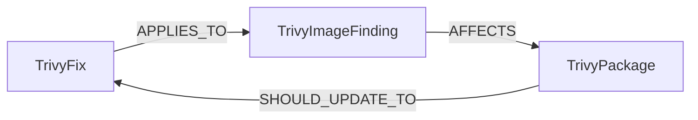

<!-- Generated from the data model. Do not edit manually. -->

## Trivy Schema

### TrivyFix

A package version that fixes a Trivy vulnerability finding.

> **Additional Labels**: This node also uses `Fix`.

> **Additional Label Definitions**:
>
> - `Fix`: A node participating in the shared Fix graph interface.

#### Properties

| Field | Index | Description |
|-------|-------|-------------|
| id | Yes | Unique Trivy fix ID. |
| firstseen |  | Timestamp when a sync job first created this node. |
| lastupdated | Yes | Timestamp of the last sync that observed this node. |
| version |  | Package version that fixes the vulnerability. |

#### Relationships

- `(:TrivyFix)-[:APPLIES_TO]->(:TrivyImageFinding)`: Links a Trivy fix to the finding it resolves.

- `(:PackageVersion)-[:SHOULD_UPDATE_TO]->(:TrivyFix)`: A canonical package version should be updated to an available Trivy fix.

- `(:TrivyPackage)-[:SHOULD_UPDATE_TO]->(:TrivyFix)`: Links a vulnerable package to the version that fixes it.
  - Properties:

    | Field | Description |
    |-------|-------------|
    | version | Package version that fixes the vulnerability. |

### TrivyImageFinding

A vulnerability finding detected by Trivy in a scan target.

> **Additional Labels**: This node also uses `Risk`.

> **Additional Label Definitions**:
>
> - `Risk`: A node participating in the shared Risk graph interface.

> **Conditional Labels**:
>
> - [`CVE`](#ontology-cve) (ontology label) when `has_cve` equals `true`. A cross-provider CVE resource in Cartography's ontology.

#### Properties

Ontology-generated fields are shown in *italics*.

| Field | Index | Description |
|-------|-------|-------------|
| id | Yes | Unique Trivy finding ID. |
| firstseen |  | Timestamp when a sync job first created this node. |
| lastupdated | Yes | Timestamp of the last sync that observed this node. |
| class_name |  | Trivy result class, such as operating system or language package. |
| cve_id | Yes | CVE identifier. |
| cvss_nvd_v2_score |  | NVD CVSS v2 score. |
| cvss_nvd_v2_vector |  | NVD CVSS v2 vector. |
| cvss_nvd_v3_score |  | NVD CVSS v3 score. |
| cvss_nvd_v3_vector |  | NVD CVSS v3 vector. |
| cvss_redhat_v3_score |  | Red Hat CVSS v3 score. |
| cvss_redhat_v3_vector |  | Red Hat CVSS v3 vector. |
| cvss_ubuntu_v3_score |  | Ubuntu CVSS v3 score. |
| cvss_ubuntu_v3_vector |  | Ubuntu CVSS v3 vector. |
| cwe_ids |  | Associated CWE identifiers. |
| data_source_id |  | Trivy vulnerability data source ID. |
| data_source_name |  | Trivy vulnerability data source name. |
| description |  | Vulnerability description. |
| ghsa_id | Yes | GitHub Security Advisory identifier. |
| has_cve |  | Whether the finding includes a CVE identifier. |
| last_modified_date |  | Date the vulnerability record was last modified. |
| layer_diff_id |  | Uncompressed digest of the affected image layer. |
| layer_digest |  | Digest of the image layer containing the vulnerable package. |
| name |  | Vulnerability identifier reported by Trivy. |
| primary_url |  | Primary vulnerability reference URL. |
| published_date |  | Date the vulnerability was published. |
| references |  | Vulnerability reference URLs. |
| severity | Yes | Vulnerability severity. |
| severity_source |  | Source of the severity rating. |
| status |  | Vulnerability remediation status. |
| title |  | Vulnerability title. |
| type |  | Trivy result type, such as an operating system or package ecosystem. |
| vulnerability_ids |  | All vulnerability identifiers reported for this finding, with the primary identifier first. |
| *_ont_base_score* | Yes | Normalized field sourced from `cvss_nvd_v3_score`. |
| *_ont_base_severity* | Yes | Normalized field sourced from `severity`. |
| *_ont_cve_id* | Yes | Normalized field sourced from `cve_id`. |
| *_ont_description* |  | Normalized field sourced from `description`. |
| *_ont_last_modified_date* | Yes | Normalized field sourced from `last_modified_date`. |
| *_ont_problem_types* |  | Normalized field sourced from `cwe_ids`. |
| *_ont_published_date* | Yes | Normalized field sourced from `published_date`. |
| *_ont_references* |  | Normalized field sourced from `references`. |
| *_ont_source* |  | Module that populated this node's ontology fields. |
| *_ont_vector_string* | Yes | Normalized field sourced from `cvss_nvd_v3_vector`. |
| *_ont_vuln_status* | Yes | Normalized field sourced from `status`. |

#### Relationships

- `(:TrivyImageFinding)-[:AFFECTS]->(:FilesystemSnapshot)`: Links a Trivy finding to the filesystem snapshots it affects.

- `(:TrivyImageFinding)-[:AFFECTS]->(:Image)`: Links a Trivy finding to the container image it affects.

- `(:TrivyImageFinding)-[:AFFECTS]->(:PackageVersion)`: A Trivy finding affects a canonical package version.

- `(:TrivyImageFinding)-[:AFFECTS]->(:TrivyPackage)`: Links a Trivy finding to the vulnerable package it affects.

- `(:TrivyFix)-[:APPLIES_TO]->(:TrivyImageFinding)`: Links a Trivy fix to the finding it resolves.

### TrivyPackage

A package detected by Trivy in a scan target.

> **Ontology Projection**: `TrivyPackage` contributes data to canonical [`PackageVersion`](#ontology-packageversion) nodes.

#### Properties

| Field | Index | Description |
|-------|-------|-------------|
| id | Yes | Unique Trivy package ID. |
| firstseen |  | Timestamp when a sync job first created this node. |
| lastupdated | Yes | Timestamp of the last sync that observed this node. |
| class_name |  | Trivy result class, such as operating system or language package. |
| installed_version |  | Installed package version. |
| name |  | Package name. |
| normalized_id | Yes | Normalized cross-tool package identifier. |
| pkg_id |  | Package identifier reported by Trivy. |
| purl |  | Package URL identifying the package. |
| type |  | Package ecosystem or operating system type. |
| version |  | Installed package version. |

#### Relationships

- `(:TrivyImageFinding)-[:AFFECTS]->(:TrivyPackage)`: Links a Trivy finding to the vulnerable package it affects.

- `(:TrivyPackage)-[:DEPLOYED]->(:FilesystemSnapshot)`: Links a Trivy package to the filesystem snapshots where it is installed.

- `(:TrivyPackage)-[:DEPLOYED]->(:Image)`: Links a Trivy package to the container image where it is installed.

- `(:PackageVersion)-[:DETECTED_AS]->(:TrivyPackage)`: A canonical package version was detected as a Trivy package.

- `(:TrivyPackage)-[:SHOULD_UPDATE_TO]->(:TrivyFix)`: Links a vulnerable package to the version that fixes it.
  - Properties:

    | Field | Description |
    |-------|-------------|
    | version | Package version that fixes the vulnerability. |
